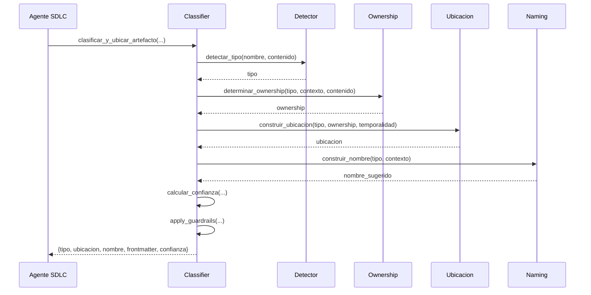

# UC-SYS-001: Clasificar Artefacto

## Actor

Sistema (PlacementAgent)

## Trigger

Agente SDLC invoca `clasificar_y_ubicar_artefacto(nombre, contenido, tipo, contexto)`

## Precondiciones

- Artefacto tiene nombre y contenido no vacios
- Contexto opcional puede incluir: dominio, tema, id, descripcion

## Flujo Principal

```
1. Sistema recibe input: (nombre, contenido, tipo_declarado, contexto)

2. Sistema detecta tipo:
   IF tipo_declarado is not None:
       tipo = normalizar_tipo(tipo_declarado)
   ELSE:
       tipo = detectar_tipo(nombre, contenido)  # RT-001

3. Sistema determina ownership:
   ownership = determinar_ownership(tipo, contexto, contenido)
   # "transversal" | "dominio:backend" | "agente" | "devops"

4. Sistema determina temporalidad:
   IF contexto.get("temporal") == True:
       temporalidad = "temporal"
   ELSE IF tipo in ["analisis", "sesion"]:
       temporalidad = "historico"
   ELSE:
       temporalidad = "permanente"

5. Sistema construye ubicacion:
   ubicacion = construir_ubicacion(tipo, ownership, temporalidad)  # RT-002

6. Sistema genera nombre:
   nombre_sugerido = construir_nombre(tipo, contexto)  # RT-003

7. Sistema genera frontmatter:
   frontmatter = generar_frontmatter(tipo, contexto)

8. Sistema calcula confianza:
   confianza = calcular_confianza(tipo_declarado, tipo, matches)

9. Sistema aplica guardrails:
   errores = apply_guardrails({
       "tipo": tipo,
       "ubicacion": ubicacion,
       "confianza": confianza
   })
   IF errores:
       return ERROR(errores)

10. Sistema retorna resultado:
    return {
        "tipo": tipo,
        "ubicacion": ubicacion,
        "nombre_sugerido": nombre_sugerido,
        "frontmatter": frontmatter,
        "confianza": confianza
    }
```

## Postcondiciones

### Exito

- Tipo detectado con confianza >= 0.6
- Ubicacion canonica determinada
- Nombre estandarizado generado
- Frontmatter YAML valido
- Guardrails pasados

### Fallo

- Confianza < 0.6 → requiere_clarificacion = True
- Ubicacion prohibida → ERROR
- Tipo invalido → ERROR

## Flujos Alternos

### A1: Tipo Ambiguo (Confianza Baja)

```
En paso 8:
IF confianza < 0.6:
    requiere_clarificacion = True
    return {
        ...,
        "requiere_clarificacion": True,
        "sugerencia": "Especificar dominio o tipo explicito"
    }
```

### A2: Guardrails Fallan

```
En paso 9:
IF ubicacion in UBICACIONES_PROHIBIDAS:
    return ERROR("Ubicacion prohibida: {ubicacion}")

IF tipo not in TIPOS_VALIDOS:
    return ERROR("Tipo no valido: {tipo}")

IF confianza < min_confidence:
    return ERROR("Confianza muy baja: {confianza}")
```

## Performance

- Tiempo de ejecucion: < 100ms (sin I/O de archivos)
- Sin llamadas de red
- Deterministico: mismo input → mismo output

## Testing

Tests: `scripts/coding/tests/ai/test_placement_detector.py`

```python
def test_clasificar_task_completo():
    resultado = clasificar_y_ubicar_artefacto(
        nombre_archivo="tarea.md",
        contenido="# Implementar feature",
        tipo_declarado="task",
        contexto={"id": "001", "descripcion": "Feature", "dominio": "backend"}
    )

    assert resultado["tipo"] == "task"
    assert resultado["ubicacion"] == "docs/backend/tareas/"
    assert resultado["nombre_sugerido"] == "TASK-001-feature.md"
    assert resultado["confianza"] >= 0.95
```

## Diagrama de Secuencia



## Referencias

- ADR-046: Arquitectura de clasificacion
- RT-001: Tipos canonicos
- RT-002: Estructura de directorios
- RT-003: Clean Code Naming
