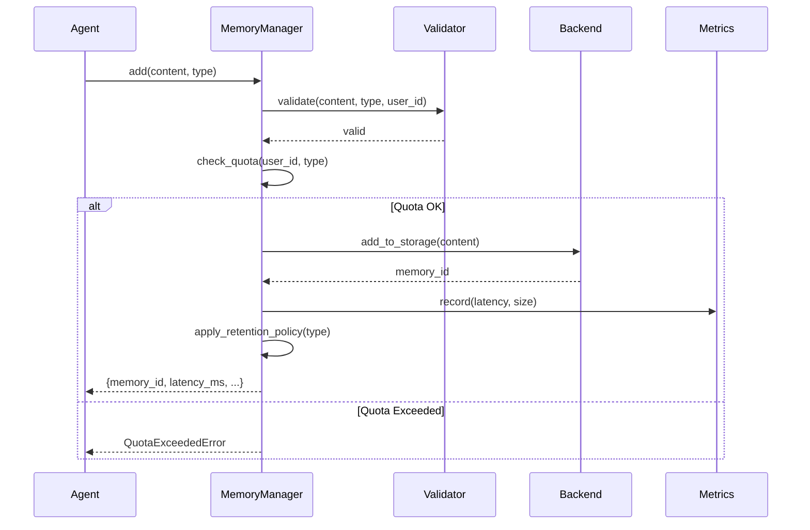

# UC-SYS-002: Gestionar Memoria de Agente

## Actor

Sistema (MemoryManager)

## Trigger

Agent invoca operaciones de memoria:

- `memory.add(content, type)`
- `memory.retrieve(query, types)`
- `memory.update(memory_id, new_content)`
- `memory.delete(memory_id)`

## Precondiciones

- Agent tiene user_id y agent_id válidos
- Storage backends (Redis, Azure AI Search, Neo4j) están disponibles
- User no ha excedido quotas (RT-006)

## Flujo Principal

```
1. Sistema recibe operación de memoria (add | retrieve | update | delete)

2. Sistema valida inputs:
   - content no vacío
   - memory_type es válido (MemoryType enum)
   - user_id existe

3. Sistema verifica quotas (RT-006):
   IF operation == "add":
       current_count = count_user_memories(user_id, memory_type)
       max_count = USER_QUOTAS[memory_type]["max_memories"]

       IF current_count >= max_count:
           RAISE QuotaExceededError

4. Sistema selecciona storage backend según memory_type:
   backend = STORAGE_MAPPING[memory_type]
   # working → dict, short_term → Redis, long_term → Vector, etc.

5. Sistema ejecuta operación en backend:

   IF operation == "add":
       memory_id = backend.add(content, metadata)
       Sistema registra metrics (latency, size)

   ELIF operation == "retrieve":
       results = backend.search(query, filters)
       Sistema aplica timeout (RT-004)
       Sistema rankea por relevancia

   ELIF operation == "update":
       backend.update(memory_id, new_content)
       Sistema versiona (opcional)

   ELIF operation == "delete":
       backend.delete(memory_id)
       Sistema audita (GDPR compliance)

6. Sistema verifica performance (RT-004):
   elapsed_ms = time_operation()

   IF elapsed_ms > LATENCY_TARGETS[memory_type]:
       Sistema log warning
       Sistema increment timeout_metric

7. Sistema aplica retention policy (RT-005):
   IF memory_type == "short_term":
       Sistema set TTL (1 hour)

   IF memory_type == "episodic":
       Sistema schedule cleanup (90 days)

8. Sistema actualiza cache (si aplica):
   IF operation in ["add", "update", "delete"]:
       Sistema invalidate cache entry

9. Sistema retorna resultado:
   return {
       "memory_id": memory_id,
       "operation": operation,
       "memory_type": memory_type,
       "latency_ms": elapsed_ms,
       "quota_remaining": max_count - current_count,
   }
```

## Postcondiciones

### Éxito

- Operación completada en < target latency (RT-004)
- Memoria persistida en backend correcto
- Quotas no excedidas
- Metrics registradas
- Cache actualizado

### Fallo

- QuotaExceededError → user debe borrar memories o upgrade
- TimeoutError → operation abortada, retry sugerido
- ValidationError → inputs inválidos
- StorageError → backend unavailable

## Flujos Alternos

### A1: Quota Exceeded

```
En paso 3:
IF current_count >= max_count:
    IF auto_prune_enabled:
        Sistema delete oldest 10% memories
        Sistema retry add operation
        return success
    ELSE:
        RAISE QuotaExceededError(
            "Quota exceeded. Delete old memories or upgrade tier."
        )
```

### A2: Timeout Excedido

```
En paso 6:
IF elapsed_ms > timeout_threshold:
    Sistema abort operation
    Sistema try fallback:
        - Return cached result (if available)
        - Return partial results
        - Return empty list

    Sistema log timeout event
    RAISE TimeoutError("Operation exceeded timeout")
```

### A3: Backend Unavailable

```
En paso 5:
TRY:
    result = backend.execute(operation)
EXCEPT ConnectionError:
    Sistema try fallback backend:
        IF memory_type == "long_term":
            fallback to in-memory cache
        ELIF memory_type == "short_term":
            fallback to local file

    Sistema alert ops team
    RAISE StorageError("Primary backend unavailable")
```

### A4: Compression for Large Content

```
En paso 5 (add operation):
IF len(content) > 1024:  # 1 KB
    compressed = zlib.compress(content)
    is_compressed = True
ELSE:
    compressed = content
    is_compressed = False

backend.add(compressed, {"is_compressed": is_compressed})
```

## Performance

- Working memory: < 1ms (RT-004)
- Short-term memory: < 10ms (RT-004)
- Long-term memory: < 100ms (RT-004)
- Episodic/Entity memory: < 200ms (RT-004)

Sin llamadas de red para working memory (in-memory dict).

## Testing

Tests: `scripts/coding/tests/ai/test_memory_manager.py`

### Test Cases

```python
def test_add_working_memory():
    """UC-SYS-002: Add to working memory"""
    manager = MemoryManager(user_id="test", agent_id="test_agent")

    result = manager.add(
        content="current task: book flight to Paris",
        memory_type=MemoryType.WORKING
    )

    assert result["memory_id"] is not None
    assert result["latency_ms"] < 1  # RT-004

def test_retrieve_long_term():
    """UC-SYS-002: Retrieve from long-term memory"""
    manager = MemoryManager(user_id="test", agent_id="test_agent")

    # Add memories
    manager.add("User likes skiing", MemoryType.LONG_TERM)
    manager.add("User avoids advanced slopes", MemoryType.LONG_TERM)

    # Retrieve
    results = manager.retrieve(
        query="skiing preferences",
        memory_types=[MemoryType.LONG_TERM]
    )

    assert len(results) > 0
    assert "skiing" in results[0]["content"].lower()

def test_quota_enforcement():
    """UC-SYS-002: Quota enforcement (RT-006)"""
    manager = MemoryManager(user_id="test", agent_id="test_agent")

    # Fill to quota
    max_count = USER_QUOTAS["long_term"]["max_memories"]
    for i in range(max_count):
        manager.add(f"Memory {i}", MemoryType.LONG_TERM)

    # Next should fail
    with pytest.raises(QuotaExceededError):
        manager.add("Exceeds quota", MemoryType.LONG_TERM)

def test_auto_prune():
    """UC-SYS-002: Auto-prune when quota exceeded"""
    manager = MemoryManager(
        user_id="test",
        agent_id="test_agent",
        auto_prune=True
    )

    # Fill to quota
    max_count = USER_QUOTAS["long_term"]["max_memories"]
    for i in range(max_count):
        manager.add(f"Memory {i}", MemoryType.LONG_TERM)

    # This should auto-prune oldest
    result = manager.add("New memory", MemoryType.LONG_TERM)

    assert result["operation"] == "add_with_prune"
    assert manager.count_memories(MemoryType.LONG_TERM) == max_count
```

## Diagrama de Secuencia



## Flujo de Self-Improvement

```
User conversa con Agent → Agent responde → KnowledgeAgent observa

IF KnowledgeAgent.is_worth_storing(conversation):
    knowledge = KnowledgeAgent.extract_knowledge(conversation)

    MemoryManager.add(
        content=knowledge,
        memory_type=MemoryType.LONG_TERM,
        metadata={"source": "conversation", "confidence": 0.8}
    )

Next conversation:
    relevant = MemoryManager.retrieve(
        query=user_query,
        memory_types=[MemoryType.LONG_TERM, MemoryType.ENTITY]
    )

    augmented_prompt = f"{relevant}\n\nUser: {user_query}"
    Agent.process(augmented_prompt)
```

## Referencias

- ADR-048: AI Agent Memory Architecture
- ADR-049: Memory Types and Storage Strategy
- RT-004: Memory Performance Constraints
- RT-005: Memory Retention Policies
- RT-006: Memory Storage Limits
