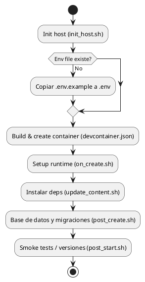
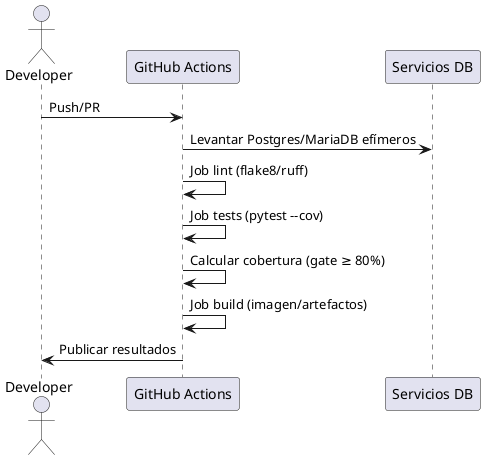

# Procedimiento operativo del DevContainer

Este documento resume el flujo de ejecución del DevContainer en Linux (coexistente con Vagrant) y cómo se orquesta dentro de un pipeline CI/CD. Se incluyen diagramas PlantUML listos para generar vistas de flujo y de secuencia.

## ¿Cómo llamar al análisis inicial?
Si necesitas un diagnóstico para entender "qué estamos haciendo" en el DevContainer y su pipeline, propón un **Análisis de Paridad Operativa DevContainer–CI/CD**. El objetivo es validar que los flujos locales (Codespaces/Vagrant), los hooks del contenedor y las etapas de CI usan las mismas variables, comandos y expectativas de cobertura.

## Paso a paso (Linux + Vagrant)
1. **Preparar el host / Codespaces**
   - Dado que los hosts locales tienen **restricción de Docker**, usa GitHub Codespaces (Dev Containers en la nube). No es necesario instalar Docker Engine en tu máquina.
   - Si operas con Vagrant para las bases fuera de Codespaces, expón los puertos (p. ej., `15432` para PostgreSQL y `13306` para MariaDB) y consúmelos desde el contenedor remoto.
   - Copia `.devcontainer/.env.example` a `.devcontainer/.env` y ajusta credenciales/hosts.

2. **Inicializar el workspace**
   - Abre el repo en VS Code y selecciona "Reopen in Container".
   - `init_host.sh` valida estructura, scripts y genera `.env` si falta.

3. **Construir e iniciar el contenedor**
   - `on_create.sh` prepara el runtime (Python 3.12, Git) y `update_content.sh` instala dependencias.
   - `post_create.sh` aplica migraciones y crea el superusuario inicial.
   - `post_start.sh` corre chequeos rápidos (p. ej., `pytest -q` limitado) y registra versiones.

4. **Conectar a bases de datos**
   - Desde la app en el contenedor usa los hosts internos (`db_postgres`, `db_mariadb`).
   - Para usar Vagrant como origen, edita `.devcontainer/.env` con los puertos publicados y reinicia el contenedor; los servicios del compose pueden deshabilitarse comentando las secciones de DB si no se necesitan.

5. **Ciclo de desarrollo (TDD)**
   - Escribe tests antes del código, ejecuta `pytest --maxfail=1 --cov=.`.
   - Mantén cobertura ≥ 80% y refactoriza tras cada ciclo Red→Green→Refactor.

## Pipeline CI/CD recomendado
1. **Trigger**: push o PR hacia ramas principales.
2. **Jobs**:
   - **lint**: `flake8`/`ruff` y verificación de formato.
   - **test**: `pytest --cov` con servicios efímeros de Postgres/MariaDB (usando el mismo compose o contenedores dedicados).
   - **build**: imagen de aplicación (opcional si producción no usa Docker) + empaquetado de artefactos.
   - **deploy**: solo en ramas protegidas; reutiliza las mismas variables declaradas en `.devcontainer/.env.example` para paridad de entorno.
3. **Gates**: el despliegue se habilita sólo si lint + tests + cobertura ≥ 80% pasan.

## Diagrama PlantUML - Flujo de lifecycle (actividad)

## Diagrama PlantUML - Ejecución CI/CD

## Referencia rápida
- Ejecuta los scripts manualmente desde `infrastructure/devcontainer/scripts/` si necesitas debug.
- Los logs se almacenan en `infrastructure/devcontainer/logs/` (creados automáticamente).
- Alinea las variables de `.devcontainer/.env` con las que usarás en CI y en producción sin contenedores para minimizar sorpresas.
