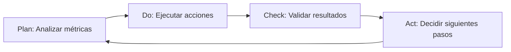
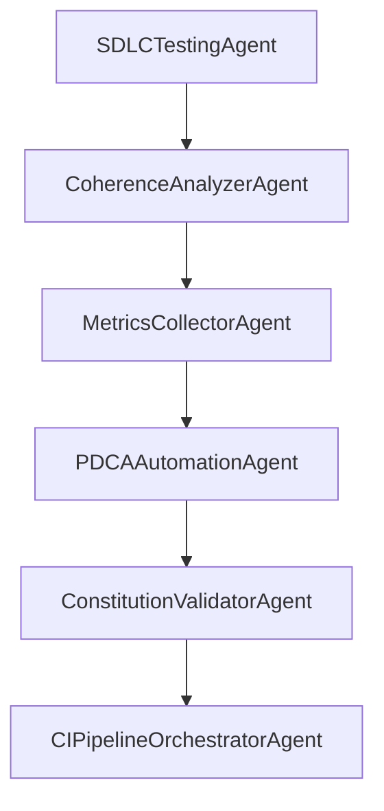

# Agentes de Automatización

Los agentes de automatización gestionan procesos CI/CD, validación, métricas y análisis de coherencia del código.

## Ubicación

**Directorio**: `scripts/coding/ai/automation/`

## Agentes Disponibles

### 1. CoherenceAnalyzerAgent

**Archivo**: `coherence_analyzer_agent.py`

**Propósito**: Análisis de coherencia entre tests, documentación y código implementado.

**Capacidades**:
- Análisis AST (Abstract Syntax Tree) de código Python
- Correlación entre funciones y tests
- Detección de gaps (código sin tests, tests sin código)
- Análisis de documentación vs implementación
- Scoring de confianza de coherencia
- Generación de reportes de alineación

**Técnicas de Prompting**:
- AST parsing para análisis estático
- Correlation analysis
- Gap detection
- Confidence scoring

**Metodología TDD**: ✅ Implementado con Test-Driven Development

**Ejemplo de uso**:
```bash
python scripts/coding/ai/automation/coherence_analyzer_agent.py \
  --project-root . \
  --module "scripts/coding/ai/sdlc" \
  --output-dir "docs/agent/coherence"
```

**Output esperado**:
- `docs/agent/coherence/coherence_report.json`
- `docs/agent/coherence/gaps.md`
- Métricas: `code_coverage`, `test_alignment`, `doc_alignment`

**Tests**:
```bash
pytest scripts/coding/ai/tests/test_coherence_analyzer_agent.py -v
```

---

### 2. PDCAAutomationAgent

**Archivo**: `pdca_agent.py`

**Propósito**: Implementación del ciclo Plan-Do-Check-Act (PDCA) automatizado para mejora continua.

**Capacidades**:
- **Plan**: Análisis de métricas y definición de objetivos
- **Do**: Ejecución de acciones de mejora
- **Check**: Validación de resultados
- **Act**: Decisiones basadas en umbrales
- Weighted scoring para priorización
- Threshold-based automation
- Generación de planes de acción

**Técnicas de Prompting**:
- Decision automation
- Weighted scoring
- Threshold-based actions
- PDCA cycle prompting

**Metodología TDD**: ✅ Implementado con Test-Driven Development

**Ejemplo de uso**:
```bash
python scripts/coding/ai/automation/pdca_agent.py \
  --project-root . \
  --metrics-file "docs/metrics/current.json" \
  --output-dir "docs/agent/pdca"
```

**Ciclo PDCA**:


**Tests**:
```bash
pytest scripts/coding/ai/tests/test_pdca_agent.py -v
```

---

### 3. ConstitutionValidatorAgent

**Archivo**: `constitution_validator_agent.py`

**Propósito**: Validación de outputs contra principios constitucionales de IA.

**Capacidades**:
- Validación de principios de Constitutional AI
- Rule-based validation
- Detección de violaciones éticas
- Scoring de conformidad
- Generación de reportes de compliance

**Principios validados**:
1. **Helpfulness**: El output es útil y responde la pregunta
2. **Harmlessness**: No contiene contenido dañino
3. **Honesty**: No contiene información falsa o engañosa
4. **Privacy**: No expone información sensible
5. **Security**: No introduce vulnerabilidades

**Técnicas de Prompting**:
- Constitutional AI principles
- Rule-based validation
- Ethical guardrails

**Metodología TDD**: ✅ Implementado con Test-Driven Development

**Ejemplo de uso**:
```bash
python scripts/coding/ai/automation/constitution_validator_agent.py \
  --project-root . \
  --output-file "generated_code.py" \
  --constitution-file "docs/ai/constitution.yaml"
```

**Tests**:
```bash
pytest scripts/coding/ai/tests/test_constitution_validator_agent.py -v
```

---

### 4. DevContainerValidatorAgent

**Archivo**: `devcontainer_validator_agent.py`

**Propósito**: Validación de configuraciones de devcontainer.

**Capacidades**:
- Schema validation de `.devcontainer/devcontainer.json`
- Validación de extensiones de VSCode
- Verificación de features y customizations
- Detección de configuraciones incompatibles
- Sugerencias de mejoras

**Técnicas de Prompting**:
- Schema validation
- JSON parsing
- Configuration analysis

**Metodología TDD**: ✅ Implementado con Test-Driven Development

**Ejemplo de uso**:
```bash
python scripts/coding/ai/automation/devcontainer_validator_agent.py \
  --project-root . \
  --devcontainer-path ".devcontainer/devcontainer.json"
```

**Schema validado**:
```json
{
  "name": "string",
  "image": "string",
  "features": {},
  "customizations": {
    "vscode": {
      "extensions": [],
      "settings": {}
    }
  }
}
```

**Tests**:
```bash
pytest scripts/coding/ai/tests/test_devcontainer_validator_agent.py -v
```

---

### 5. MetricsCollectorAgent

**Archivo**: `metrics_collector_agent.py`

**Propósito**: Recolección de métricas DORA y otras métricas de ingeniería.

**Capacidades**:
- Recolección de métricas DORA:
  - Deployment Frequency
  - Lead Time for Changes
  - Change Failure Rate
  - Time to Restore Service
- Métricas de código:
  - Coverage
  - Complexity
  - Technical Debt
- Data aggregation y trending
- Generación de dashboards

**Técnicas de Prompting**:
- DORA metrics collection
- Data aggregation
- Trend analysis

**Metodología TDD**: ✅ Implementado con Test-Driven Development

**Ejemplo de uso**:
```bash
python scripts/coding/ai/automation/metrics_collector_agent.py \
  --project-root . \
  --output-dir "docs/metrics" \
  --baseline-days 30
```

**Métricas DORA**:
| Métrica | Elite | High | Medium | Low |
|---------|-------|------|--------|-----|
| Deployment Frequency | On-demand | Weekly-Monthly | Monthly-Biannual | < Biannual |
| Lead Time | < 1 day | 1-7 days | 1-6 months | > 6 months |
| Change Failure Rate | 0-15% | 16-30% | 31-45% | > 45% |
| Time to Restore | < 1 hour | < 1 day | 1-7 days | > 7 days |

**Tests**:
```bash
pytest scripts/coding/ai/tests/test_metrics_collector_agent.py -v
```

---

### 6. SchemaValidatorAgent

**Archivo**: `schema_validator_agent.py`

**Propósito**: Validación genérica de esquemas JSON.

**Capacidades**:
- Validación de JSON Schema
- Validación de YAML contra schema
- Detección de campos faltantes
- Validación de tipos
- Generación de reportes de errores

**Técnicas de Prompting**:
- JSON schema validation
- Type checking
- Required fields validation

**Metodología TDD**: ✅ Implementado con Test-Driven Development

**Ejemplo de uso**:
```bash
python scripts/coding/ai/automation/schema_validator_agent.py \
  --project-root . \
  --data-file "config.json" \
  --schema-file "schemas/config.schema.json"
```

**Schema ejemplo**:
```json
{
  "$schema": "http://json-schema.org/draft-07/schema#",
  "type": "object",
  "properties": {
    "name": {"type": "string"},
    "version": {"type": "string", "pattern": "^\\d+\\.\\d+\\.\\d+$"}
  },
  "required": ["name", "version"]
}
```

**Tests**:
```bash
pytest scripts/coding/ai/tests/test_schema_validator_agent.py -v
```

---

### 7. CIPipelineOrchestratorAgent

**Archivo**: `ci_pipeline_orchestrator_agent.py`

**Propósito**: Orquestación de pipelines de CI/CD.

**Capacidades**:
- Orquestación de múltiples agentes
- Coordinación de fases del pipeline
- Manejo de dependencias entre jobs
- Rollback automático en fallos
- Generación de reportes de pipeline

**Técnicas de Prompting**:
- Pipeline orchestration
- Dependency management
- Error handling

**Metodología TDD**: ✅ Implementado con Test-Driven Development

**Ejemplo de uso**:
```bash
python scripts/coding/ai/automation/ci_pipeline_orchestrator_agent.py \
  --project-root . \
  --pipeline-config "pipelines/main.yaml" \
  --output-dir "docs/agent/ci"
```

**Pipeline ejemplo**:
```yaml
name: "Main CI Pipeline"
stages:
  - name: "Build"
    agents: [BuildAgent]
  - name: "Test"
    agents: [SDLCTestingAgent, CoherenceAnalyzerAgent]
    depends_on: [Build]
  - name: "Deploy"
    agents: [SDLCDeploymentAgent]
    depends_on: [Test]
```

**Tests**:
```bash
pytest scripts/coding/ai/tests/test_ci_pipeline_orchestrator_agent.py -v
```

---

## Integración con SDLC

Los agentes de automatización se integran con los agentes SDLC:



## Configuración Común

```json
{
  "project_root": ".",
  "output_dir": "docs/agent",
  "confidence_threshold": 70.0,
  "baseline_days": 30,
  "validation_threshold": 0.05,
  "enable_guardrails": true,
  "log_level": "INFO"
}
```

## Guardarraíles

Todos los agentes de automatización implementan:

- ✅ **Constitutional AI** para validación ética
- ✅ **Input Validation** para prevenir inyección
- ✅ **Authority Checks** para verificar permisos
- ✅ **Audit Logging** para trazabilidad
- ✅ **TDD** para garantizar calidad

## Referencias

- [Agentes de Automatización](../../../docs/gobernanza/metodologias/agentes_automatizacion.md)
- [Constitutional AI](../../../docs/ai/constitutional_ai.md)
- [Métricas DORA](https://dora.dev/)

---

**Última actualización**: 2025-11-14
**Total de agentes de automatización**: 7
**Todos implementados con TDD**: ✅
