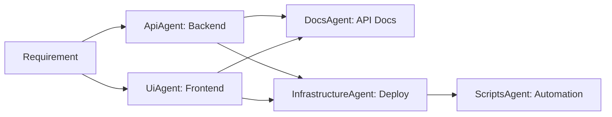

# Agentes por Dominio

Agentes especializados que conectan la estructura del repositorio por dominio (api, ui, infrastructure, docs, scripts) con ExecPlans y scripts multi-LLM.

## Ubicación

**Archivos de definición**: `.agent/agents/`
**Directorios asociados**: Cada agente trabaja con su directorio específico del proyecto

## Agentes Disponibles

### 1. ApiAgent (Backend)

**Archivo**: `.agent/agents/api_agent.md`

**Directorio base**: `api/`

**Propósito**: Gestión y desarrollo del backend/API del proyecto.

**Responsabilidades**:
- Desarrollo de endpoints REST/GraphQL
- Gestión de modelos de base de datos
- Lógica de negocio
- Autenticación y autorización
- Integración con servicios externos
- Gestión de migraciones

**Tecnologías típicas**:
- Django / Django REST Framework
- FastAPI
- PostgreSQL / MySQL
- Celery para tareas asíncronas
- Redis para caché

**Relaciones clave**:
- [EXECPLAN_agents_domain_alignment.md](../../../docs/plans/EXECPLAN_agents_domain_alignment.md)
- [SDLC_AGENTS_GUIDE.md](../../../docs/ai/SDLC_AGENTS_GUIDE.md)
- [PROMPT_TECHNIQUES_CATALOG.md](../../../docs/ai_capabilities/prompting/PROMPT_TECHNIQUES_CATALOG.md)
- [CONTEXT_MANAGEMENT_PLAYBOOK.md](../../../docs/ai_capabilities/orchestration/CONTEXT_MANAGEMENT_PLAYBOOK.md)
- `scripts/coding/ai/shared/context_sessions.py`
- `scripts/coding/ai/orchestrators/codex_mcp_workflow.py`

**Ejemplo de uso**:
```
ApiAgent: Implementa endpoint POST /api/auth/login para autenticación de usuarios.
Incluye validación, manejo de errores, rate limiting y tests.
```

**Comandos comunes**:
```bash
# Generar endpoint
ApiAgent: Generate REST endpoint for user management with CRUD operations

# Crear modelo
ApiAgent: Create Django model for Customer with fields: name, email, phone, created_at

# Generar tests
ApiAgent: Generate unit tests for authentication endpoints with 80% coverage
```

---

### 2. UiAgent (Frontend)

**Archivo**: `.agent/agents/ui_agent.md`

**Directorio base**: `ui/`

**Propósito**: Gestión y desarrollo del frontend/interfaz de usuario.

**Responsabilidades**:
- Desarrollo de componentes UI
- Gestión de estado
- Routing y navegación
- Integración con API
- Optimización de rendimiento
- Accesibilidad (a11y)

**Tecnologías típicas**:
- React / Vue / Angular
- TypeScript
- Tailwind CSS / Material-UI
- Redux / Vuex / Pinia
- React Query / SWR

**Relaciones clave**:
- [EXECPLAN_agents_domain_alignment.md](../../../docs/plans/EXECPLAN_agents_domain_alignment.md)
- [PROMPT_TECHNIQUES_CATALOG.md](../../../docs/ai_capabilities/prompting/PROMPT_TECHNIQUES_CATALOG.md)
- [CODE_GENERATION_GUIDE.md](../../../docs/ai_capabilities/prompting/CODE_GENERATION_GUIDE.md)
- [PHI3_PROMPT_ENGINEERING_PLAYBOOK.md](../../../docs/ai_capabilities/prompting/PHI3_PROMPT_ENGINEERING_PLAYBOOK.md)
- [CONTEXT_MANAGEMENT_PLAYBOOK.md](../../../docs/ai_capabilities/orchestration/CONTEXT_MANAGEMENT_PLAYBOOK.md)
- `scripts/coding/ai/shared/context_sessions.py`

**Ejemplo de uso**:
```
UiAgent: Crea componente React LoginForm con validación,
manejo de errores y integración con /api/auth/login.
```

**Comandos comunes**:
```bash
# Generar componente
UiAgent: Create React component UserCard with props: user, onEdit, onDelete

# Generar página
UiAgent: Generate Dashboard page with charts, metrics and user table

# Generar tests
UiAgent: Generate Jest tests for LoginForm component with validation scenarios
```

---

### 3. InfrastructureAgent

**Archivo**: `.agent/agents/infrastructure_agent.md`

**Directorio base**: `infrastructure/`

**Propósito**: Gestión de infraestructura como código (IaC) y DevOps.

**Responsabilidades**:
- Configuración de infraestructura (Terraform, Ansible)
- Configuración de contenedores (Docker, Kubernetes)
- CI/CD pipelines
- Monitoreo y observabilidad
- Gestión de secretos
- Networking y seguridad

**Tecnologías típicas**:
- Terraform / CloudFormation
- Ansible / Chef / Puppet
- Docker / Docker Compose
- Kubernetes / Helm
- GitHub Actions / GitLab CI
- Prometheus / Grafana

**Relaciones clave**:
- [EXECPLAN_agents_domain_alignment.md](../../../docs/plans/EXECPLAN_agents_domain_alignment.md)
- [PROMPT_TECHNIQUES_CATALOG.md](../../../docs/ai_capabilities/prompting/PROMPT_TECHNIQUES_CATALOG.md)
- [CONTEXT_MANAGEMENT_PLAYBOOK.md](../../../docs/ai_capabilities/orchestration/CONTEXT_MANAGEMENT_PLAYBOOK.md)
- [agentes_automatizacion.md](../../../docs/gobernanza/metodologias/agentes_automatizacion.md)
- `scripts/coding/ai/shared/context_sessions.py`
- Planes `SPEC_INFRA_*`

**Ejemplo de uso**:
```
InfrastructureAgent: Genera configuración Terraform para desplegar
aplicación Django en AWS ECS con RDS PostgreSQL y ElastiCache Redis.
```

**Comandos comunes**:
```bash
# Generar IaC
InfrastructureAgent: Create Terraform modules for AWS VPC with public/private subnets

# Configurar CI/CD
InfrastructureAgent: Generate GitHub Actions workflow for Django app with tests and deployment

# Docker
InfrastructureAgent: Create Dockerfile and docker-compose.yml for Django + PostgreSQL + Redis
```

---

### 4. DocsAgent

**Archivo**: `.agent/agents/docs_agent.md`

**Directorio base**: `docs/`

**Propósito**: Gestión y generación de documentación del proyecto.

**Responsabilidades**:
- Generación de documentación técnica
- Mantenimiento de READMEs
- Documentación de APIs (OpenAPI/Swagger)
- Guías de usuario
- Runbooks y procedimientos
- Diagramas de arquitectura

**Tecnologías típicas**:
- Markdown
- Sphinx / MkDocs
- OpenAPI / Swagger
- Mermaid para diagramas
- PlantUML

**Relaciones clave**:
- [AGENTS.md](../../../docs/analisis/AGENTS.md)
- [PROMPT_TECHNIQUES_CATALOG.md](../../../docs/ai_capabilities/prompting/PROMPT_TECHNIQUES_CATALOG.md)
- [CONTEXT_MANAGEMENT_PLAYBOOK.md](../../../docs/ai_capabilities/orchestration/CONTEXT_MANAGEMENT_PLAYBOOK.md)
- `scripts/coding/ai/shared/context_sessions.py`
- `scripts/coding/ai/agents/documentation/eta_codex_agent.py`
- `docs/testing/test_documentation_alignment.py`

**Ejemplo de uso**:
```
DocsAgent: Genera documentación OpenAPI para todos los endpoints del módulo de autenticación.
Incluye ejemplos de requests/responses y códigos de error.
```

**Comandos comunes**:
```bash
# Generar API docs
DocsAgent: Generate OpenAPI specification for authentication endpoints

# Generar README
DocsAgent: Create comprehensive README.md for api/ directory with setup instructions

# Generar diagramas
DocsAgent: Generate Mermaid architecture diagram showing system components
```

---

### 5. ScriptsAgent

**Archivo**: `.agent/agents/scripts_agent.md`

**Directorio base**: `scripts/`

**Propósito**: Gestión de scripts de automatización y utilidades.

**Responsabilidades**:
- Scripts de setup y configuración
- Scripts de migración de datos
- Utilidades de desarrollo
- Scripts de mantenimiento
- Automatizaciones custom
- Generadores de código

**Tecnologías típicas**:
- Python
- Bash
- Node.js
- SQL para migraciones

**Relaciones clave**:
- [EXECPLAN_codex_mcp_multi_llm.md](../../../docs/plans/EXECPLAN_codex_mcp_multi_llm.md)
- [PROMPT_TECHNIQUES_CATALOG.md](../../../docs/ai_capabilities/prompting/PROMPT_TECHNIQUES_CATALOG.md)
- [CONTEXT_MANAGEMENT_PLAYBOOK.md](../../../docs/ai_capabilities/orchestration/CONTEXT_MANAGEMENT_PLAYBOOK.md)
- [README.md](../../../docs/scripts/README.md)
- `scripts/coding/ai/shared/context_sessions.py`
- `scripts/coding/ai/generators/llm_generator.py`

**Ejemplo de uso**:
```
ScriptsAgent: Crea script Python para migrar usuarios de base de datos legacy a nueva estructura.
Incluye validación, logging y rollback en caso de error.
```

**Comandos comunes**:
```bash
# Generar script de setup
ScriptsAgent: Create setup script to initialize development environment

# Generar migración
ScriptsAgent: Generate data migration script from old User model to new schema

# Generar utilidad
ScriptsAgent: Create utility script to backup database and upload to S3
```

---

## Coordinación entre Agentes de Dominio

Los agentes de dominio frecuentemente trabajan juntos:

### Ejemplo: Feature completa
```
1. ApiAgent: Crea endpoint POST /api/tasks
2. UiAgent: Crea componente TaskForm que consume el endpoint
3. DocsAgent: Documenta el endpoint en OpenAPI
4. InfrastructureAgent: Actualiza pipeline CI para incluir tests
```

### Ejemplo: Refactorización
```
1. ApiAgent: Refactoriza modelo User agregando campo role
2. ScriptsAgent: Genera script de migración de datos
3. UiAgent: Actualiza componentes que usan User
4. DocsAgent: Actualiza documentación de API
```

### Ejemplo: Deployment
```
1. InfrastructureAgent: Configura infraestructura en AWS
2. ApiAgent: Genera health check endpoints
3. ScriptsAgent: Crea scripts de deployment
4. DocsAgent: Genera runbook de deployment
```

## Flujo Multi-Dominio con ExecPlans

Referencia: [EXECPLAN_agents_domain_alignment.md](../../../docs/plans/EXECPLAN_agents_domain_alignment.md)



## Uso con Context Management

Todos los agentes de dominio utilizan gestión de contexto para mantener coherencia:

```python
from scripts.coding.ai.shared.context_sessions import ContextSession

# Contexto compartido entre dominios
session = ContextSession(
    domains=["api", "ui", "docs"],
    max_tokens=10000
)

# ApiAgent crea endpoint
api_context = session.get_domain_context("api")
api_agent.execute(context=api_context)

# UiAgent usa info del endpoint
ui_context = session.get_domain_context("ui", include_from=["api"])
ui_agent.execute(context=ui_context)

# DocsAgent documenta ambos
docs_context = session.get_domain_context("docs", include_from=["api", "ui"])
docs_agent.execute(context=docs_context)
```

## Referencias

- [ExecPlan Domain Alignment](../../../docs/plans/EXECPLAN_agents_domain_alignment.md)
- [SDLC Agents Guide](../../../docs/ai/SDLC_AGENTS_GUIDE.md)
- [Code Generation Guide](../../../docs/ai_capabilities/prompting/CODE_GENERATION_GUIDE.md)
- [Context Management Playbook](../../../docs/ai_capabilities/orchestration/CONTEXT_MANAGEMENT_PLAYBOOK.md)

---

**Última actualización**: 2025-11-14
**Total de dominios**: 5
**Patrón de integración**: Multi-domain orchestration
