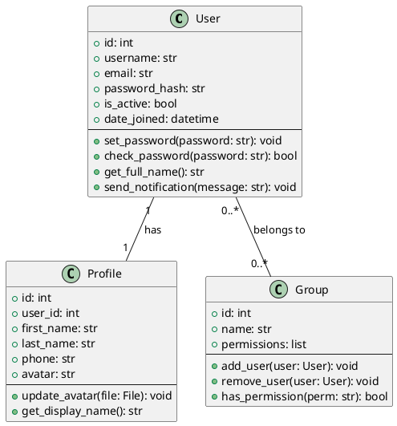
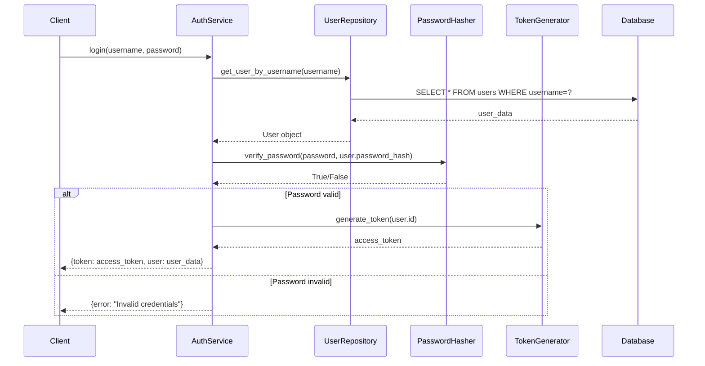
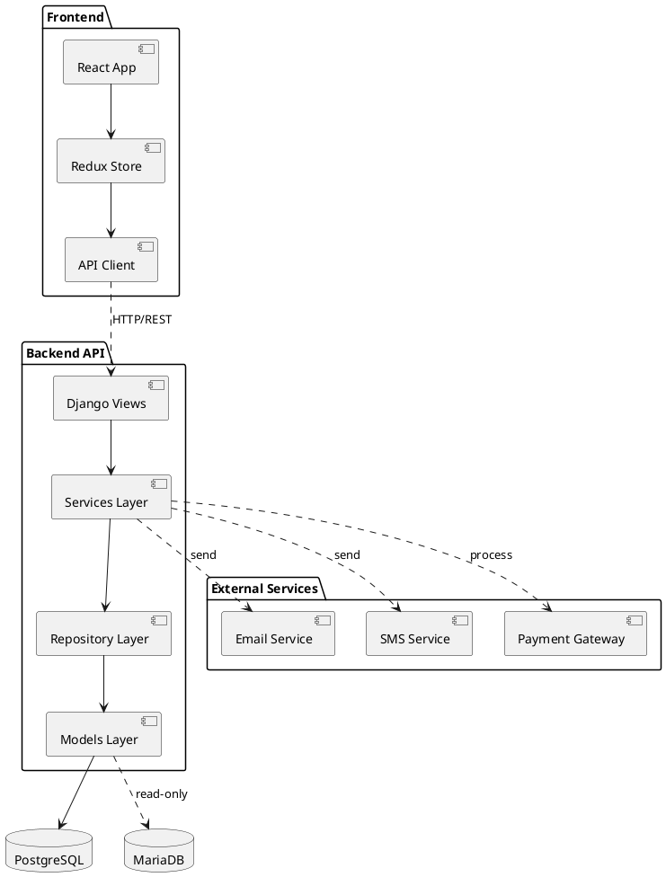

# UML Generator Agent

Agente experto en generacion automatica de diagramas UML que analiza codigo fuente y genera diagramas de clases, secuencia, actividad, componentes y deployment en formato PlantUML, Mermaid o imagenes.

## Capacidades

### Generacion de Diagramas
- Diagramas de clases con atributos y metodos
- Diagramas de secuencia para flujos de interaccion
- Diagramas de actividad para procesos
- Diagramas de componentes para arquitectura
- Diagramas de deployment para infraestructura
- Diagramas de caso de uso

### Analisis de Relaciones
- Herencia y composicion
- Agregacion y dependencias
- Asociaciones y multiplicidad
- Interfaces y realizaciones

### Formatos de Salida
- PlantUML (.puml)
- Mermaid (.mmd)
- Imagenes (PNG, SVG)
- DOT/Graphviz
- HTML interactivo

## Cuando Usar

- Documentacion de arquitectura
- Onboarding de desarrolladores
- Code reviews
- Analisis de dependencias
- Preparacion de presentaciones tecnicas
- Documentacion de APIs

## Uso

### Sintaxis Basica

```bash
python scripts/coding/ai/meta/uml_generator_agent.py \
  --project-root /ruta/al/proyecto \
  --target-module api/models \
  --diagram-type class
```

### Generar Diagrama de Clases

```bash
python scripts/coding/ai/meta/uml_generator_agent.py \
  --project-root . \
  --target-module api/users/models.py \
  --diagram-type class \
  --output-format plantuml \
  --include-private \
  --show-methods
```

### Generar Diagrama de Secuencia

```bash
python scripts/coding/ai/meta/uml_generator_agent.py \
  --project-root . \
  --target-method api.services.AuthService.login \
  --diagram-type sequence \
  --trace-depth 5 \
  --output-format mermaid
```

### Generar Diagrama de Componentes

```bash
python scripts/coding/ai/meta/uml_generator_agent.py \
  --project-root . \
  --scan-dir api/ \
  --diagram-type component \
  --group-by app \
  --output-format svg
```

### Batch Generation

```bash
python scripts/coding/ai/meta/uml_generator_agent.py \
  --project-root . \
  --batch-generate \
  --output-dir docs/diagrams \
  --formats plantuml,png
```

## Parametros

- `--project-root`: Directorio raiz del proyecto
- `--target-module`: Modulo o archivo especifico
- `--target-method`: Metodo para diagrama de secuencia
- `--diagram-type`: Tipo (class, sequence, activity, component, deployment)
- `--output-format`: Formato (plantuml, mermaid, png, svg, html)
- `--include-private`: Incluir miembros privados
- `--show-methods`: Mostrar metodos en diagramas de clases
- `--trace-depth`: Profundidad de tracing
- `--group-by`: Agrupar por (app, package, module)
- `--batch-generate`: Generar multiples diagramas

## Salida

### Diagrama de Clases (PlantUML)



### Diagrama de Secuencia (Mermaid)



### Diagrama de Componentes (PlantUML)



## Herramientas Utilizadas

- **pylint**: Extraccion de informacion de clases
- **pyreverse**: Generacion de diagramas UML
- **plantuml**: Renderizado de diagramas
- **graphviz**: Generacion de grafos
- **mermaid-cli**: Renderizado de Mermaid

## Mejores Practicas

1. **Mantener diagramas actualizados**: Regenerar periodicamente
2. **Simplicidad**: No incluir todos los detalles
3. **Niveles de abstraccion**: Diagramas para diferentes audiencias
4. **Versionado**: Guardar diagramas en control de versiones
5. **Automation**: Integrar en CI para generar automaticamente
6. **Documentacion**: Acompanar con texto explicativo
7. **Formatos**: Usar formatos editables (PlantUML, Mermaid)

## Restricciones

- Diagramas complejos pueden ser dificiles de leer
- No captura logica de negocio, solo estructura
- Diagramas de secuencia requieren instrumentacion o tracing
- Algunos frameworks dificultan extraccion de informacion
- Renderizado de imagenes requiere herramientas externas

## Ubicacion

Archivo: `scripts/coding/ai/meta/uml_generator_agent.py`
