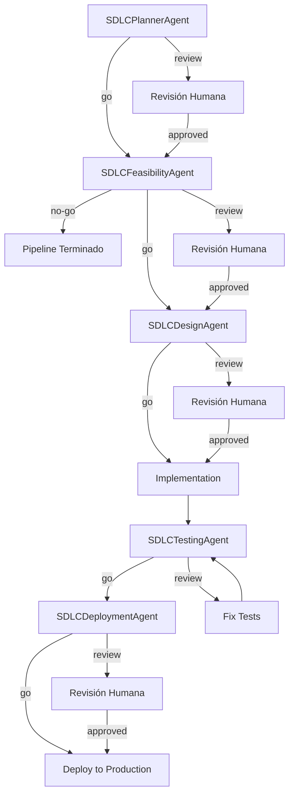

# Agentes SDLC - Software Development Life Cycle

Los agentes SDLC gestionan las diferentes fases del ciclo de vida del desarrollo de software, desde la planificación hasta el despliegue.

## Ubicación

**Directorio**: `scripts/coding/ai/sdlc/`

## Arquitectura Base

Todos los agentes SDLC heredan de la clase `SDLCAgent` que proporciona:

```python
class SDLCAgent(Agent):
    def __init__(self, phase: str, project_root: str, output_dir: str):
        self.phase = phase  # planning, design, testing, deployment
        self.decision = None  # go, no-go, review, blocked

    def execute(self) -> Dict[str, Any]:
        # Ejecuta con guardarraíles constitucionales
        # Retorna decision y artifacts
```

### Estados de Decisión

- **go**: Proceder a la siguiente fase
- **no-go**: Detener el pipeline (riesgos críticos)
- **review**: Requiere revisión humana
- **blocked**: Bloqueado por guardarraíles o validaciones

## Agentes Disponibles

### 1. SDLCPlannerAgent

**Archivo**: `planner_agent.py`

**Propósito**: Planificación de sprints, generación de issues y estimación de esfuerzo.

**Capacidades**:
- Generación automática de issues desde descripción
- Estimación de story points
- Priorización de backlog
- Detección de dependencias entre tareas
- Generación de roadmap

**Técnicas de Prompting**:
- Few-Shot Learning para extracción de issues
- Task Decomposition para división de épicas
- Template-based prompting para formato de issues

**Ejemplo de uso**:
```bash
python scripts/coding/ai/sdlc/planner_agent.py \
  --project-root . \
  --output-dir docs/agent \
  --description "Implementar autenticación OAuth2"
```

**Output esperado**:
- `docs/agent/planning/issues.json` - Lista de issues generados
- `docs/agent/planning/roadmap.md` - Roadmap del sprint
- Decisión: `go` o `review`

---

### 2. SDLCFeasibilityAgent

**Archivo**: `feasibility_agent.py`

**Propósito**: Análisis de viabilidad técnica y evaluación de riesgos.

**Capacidades**:
- Análisis de riesgos técnicos
- Evaluación de dependencias
- Estimación de complejidad
- Detección de blockers
- Recomendaciones de arquitectura

**Técnicas de Prompting**:
- Risk Assessment prompting
- Heuristic analysis
- Expert prompting para evaluación técnica

**Ejemplo de uso**:
```bash
python scripts/coding/ai/sdlc/feasibility_agent.py \
  --project-root . \
  --output-dir docs/agent \
  --proposal "docs/proposals/oauth2.md"
```

**Output esperado**:
- `docs/agent/feasibility/risk_assessment.json`
- `docs/agent/feasibility/recommendations.md`
- Decisión: `go`, `no-go`, o `review`

---

### 3. SDLCDesignAgent

**Archivo**: `design_agent.py`

**Propósito**: Generación de diseños de alto y bajo nivel (HLD/LLD).

**Capacidades**:
- Generación de High-Level Design (HLD)
- Generación de Low-Level Design (LLD)
- Diagramas de arquitectura (Mermaid)
- Diagramas de secuencia
- Documentación de APIs
- Identificación de patrones de diseño

**Técnicas de Prompting**:
- Pattern Recognition para identificar patrones arquitectónicos
- Structured Output para generar diagramas
- Template-based generation para documentación

**Ejemplo de uso**:
```bash
python scripts/coding/ai/sdlc/design_agent.py \
  --project-root . \
  --output-dir docs/agent \
  --module "authentication"
```

**Output esperado**:
- `docs/agent/design/HLD.md` - High-Level Design
- `docs/agent/design/LLD.md` - Low-Level Design
- `docs/agent/design/diagrams/*.mmd` - Diagramas Mermaid
- Decisión: `go` o `review`

---

### 4. SDLCTestingAgent

**Archivo**: `testing_agent.py`

**Propósito**: Generación automática de pruebas unitarias, integración y E2E.

**Capacidades**:
- Generación de pruebas unitarias
- Generación de pruebas de integración
- Generación de pruebas E2E
- Cobertura de código objetivo
- Test pyramid strategy
- Generación de fixtures y mocks

**Técnicas de Prompting**:
- LLM-enhanced test generation
- Template-based test creation
- Heuristic fallback cuando LLM no disponible
- Few-Shot learning para patrones de test

**Ejemplo de uso**:
```bash
python scripts/coding/ai/sdlc/testing_agent.py \
  --project-root . \
  --output-dir docs/agent \
  --target-module "authentication" \
  --coverage-target 80
```

**Output esperado**:
- `tests/unit/test_authentication.py`
- `tests/integration/test_auth_flow.py`
- `docs/agent/testing/coverage_report.json`
- Decisión: `go` si coverage >= target, sino `review`

**Test Pyramid Strategy**:
```
       /\
      /E2E\     (10-20%) - Pocos tests E2E críticos
     /------\
    /Integration\ (20-30%) - Tests de integración
   /------------\
  /Unit Tests    \ (50-70%) - Muchos tests unitarios
 /----------------\
```

---

### 5. SDLCDeploymentAgent

**Archivo**: `deployment_agent.py`

**Propósito**: Planificación y validación de estrategias de despliegue.

**Capacidades**:
- Planificación de despliegues
- Estrategias de rollback
- Validación de pre-deployment
- Generación de runbooks
- Health checks y smoke tests
- Análisis de impacto

**Técnicas de Prompting**:
- Deployment planning prompts
- Risk mitigation strategies
- Checklist generation

**Ejemplo de uso**:
```bash
python scripts/coding/ai/sdlc/deployment_agent.py \
  --project-root . \
  --output-dir docs/agent \
  --environment "production" \
  --strategy "blue-green"
```

**Output esperado**:
- `docs/agent/deployment/plan.md` - Plan de despliegue
- `docs/agent/deployment/rollback.md` - Plan de rollback
- `docs/agent/deployment/checklist.md` - Checklist pre-deployment
- Decisión: `go` o `review`

**Estrategias soportadas**:
- **Blue-Green**: Ambiente paralelo, switch instantáneo
- **Canary**: Despliegue progresivo a subconjunto de usuarios
- **Rolling**: Actualización gradual de instancias
- **Recreate**: Terminar todo y recrear

---

### 6. SDLCAgent (Base Class)

**Archivo**: `base_agent.py`

**Propósito**: Clase base abstracta para todos los agentes SDLC.

**Responsabilidades**:
- Gestión de fases del ciclo de vida
- Validación de transiciones entre fases
- Aplicación de guardarraíles por fase
- Registro de decisiones y artifacts
- Integración con Constitutional AI

**Métodos principales**:
```python
class SDLCAgent(Agent):
    def execute(self) -> Dict[str, Any]:
        """Ejecuta la fase del SDLC con validaciones"""

    def _phase_guardrails(self) -> bool:
        """Guardarraíles específicos de la fase"""

    def _make_decision(self, results: Dict) -> str:
        """Determina: go, no-go, review, blocked"""

    def _generate_artifacts(self) -> List[str]:
        """Genera artifacts de la fase"""
```

**Pattern**: Template Method Pattern

---

## Flujo de Ejecución SDLC Completo



## Configuración Común

Todos los agentes aceptan configuración vía JSON:

```json
{
  "project_root": ".",
  "output_dir": "docs/agent",
  "llm_provider": "anthropic",
  "model": "claude-sonnet-4-5-20250929",
  "confidence_threshold": 70.0,
  "enable_guardrails": true,
  "log_level": "INFO"
}
```

## Guardarraíles Aplicados

Cada agente aplica guardarraíles específicos:

### Planning Phase
- ✅ Issues tienen descripción clara
- ✅ Story points están justificados
- ✅ Dependencias identificadas

### Feasibility Phase
- ✅ Todos los riesgos categorizados (LOW, MEDIUM, HIGH, CRITICAL)
- ✅ Riesgos CRITICAL requieren mitigación antes de `go`
- ✅ Dependencias externas documentadas

### Design Phase
- ✅ HLD incluye decisiones arquitectónicas
- ✅ LLD incluye firma de funciones
- ✅ Diagramas son sintácticamente válidos (Mermaid)

### Testing Phase
- ✅ Coverage >= threshold configurado
- ✅ Todos los tests tienen assertions
- ✅ No tests vacíos o comentados

### Deployment Phase
- ✅ Plan de rollback definido
- ✅ Health checks especificados
- ✅ Criterios de éxito medibles

## Referencias

- [Arquitectura de Agentes SDLC](../../../scripts/coding/ai/agents/ARCHITECTURE_SDLC_AGENTS.md)
- [Guía de Agentes SDLC](../../../docs/ai/SDLC_AGENTS_GUIDE.md)
- [Constitutional AI](../../../docs/ai/constitutional_ai.md)

## Testing de Agentes

Todos los agentes SDLC siguen **Test-Driven Development (TDD)**:

```bash
# Ejecutar tests de un agente
pytest scripts/coding/ai/tests/test_sdlc_testing_agent.py -v

# Coverage
pytest --cov=scripts/coding/ai/sdlc --cov-report=html
```

---

**Última actualización**: 2025-11-14
**Total de agentes SDLC**: 6
**Patrón de diseño**: Template Method + Constitutional AI
