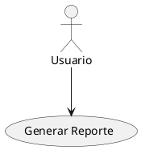

# Cómo Ver la Documentación - Proyecto IACT

Esta guía explica las diferentes formas en que puedes visualizar la documentación del proyecto IACT.

## Opción 1: Sitio Web Renderizado (RECOMENDADO)

### Para usuarios finales

**URL de producción**: https://2-coatl.github.io/IACT---project/

Accede directamente desde tu navegador. La documentación incluye:
- Navegación estructurada por secciones
- Búsqueda de texto completo
- Diagramas PlantUML renderizados
- Bloques de código con syntax highlighting
- Enlaces internos funcionales

### Para desarrollo local

Si estás contribuyendo a la documentación:

```bash
# 1. Clonar repositorio (si no lo tienes)
git clone https://github.com/2-Coatl/IACT---project.git
cd IACT---project/docs

# 2. Instalar dependencias (solo primera vez)
pip install -r requirements.txt

# 3. Ejecutar servidor local
mkdocs serve

# 4. Abrir en navegador
open http://127.0.0.1:8000
```

**Características del servidor local**:
- Live reload: Cambios se reflejan automáticamente
- Puerto por defecto: 8000
- Logs en tiempo real de errores/advertencias
- Pre-visualización antes de commit

**Comandos útiles**:
```bash
# Puerto personalizado
mkdocs serve -a 127.0.0.1:8080

# Modo estricto (falla en errores)
mkdocs serve --strict

# Limpiar y reconstruir
mkdocs build --clean
```

---

## Opción 2: GitHub (Sin renderizado avanzado)

**URL**: https://github.com/2-Coatl/IACT---project/tree/main/docs

**Ventajas**:
- No requiere instalación
- Renderizado básico de Markdown
- Historial de cambios visible
- Comentarios en línea

**Limitaciones**:
- Diagramas PlantUML NO se renderizan (muestra código)
- Sin navegación estructurada
- Sin búsqueda avanzada
- Sin tabla de contenidos interactiva

**Cuándo usar**:
- Revisión rápida de texto
- Ver historial de cambios (git blame)
- Comentar en Pull Requests
- Navegación simple entre archivos

---

## Opción 3: Editor con Preview (VSCode)

### Extensiones recomendadas

```bash
# Markdown Preview Enhanced
code --install-extension shd101wyy.markdown-preview-enhanced

# PlantUML
code --install-extension jebbs.plantuml

# MkDocs Material
code --install-extension ms-python.python
```

### Configuración

**1. Abrir carpeta del proyecto en VSCode**:
```bash
code /path/to/IACT---project
```

**2. Preview de Markdown**:
- Abrir cualquier archivo `.md`
- Presionar `Cmd+K V` (Mac) o `Ctrl+K V` (Windows/Linux)
- Se abre preview lado a lado

**3. Preview de PlantUML**:
- Abrir archivo `.puml`
- Presionar `Alt+D` para preview
- Se renderiza diagrama en panel lateral

**Ventajas**:
- Sin instalar MkDocs
- Renderiza PlantUML localmente
- Edición y preview simultáneos
- Autocompletado de Markdown

**Limitaciones**:
- No replica exactamente el theme de MkDocs
- Sin navegación global del sitio
- Algunos plugins de MkDocs no funcionan

---

## Comparación de opciones

| Característica | MkDocs Local | GitHub Pages | GitHub Raw | VSCode |
|----------------|--------------|--------------|------------|--------|
| Navegación estructurada | ✅ | ✅ | ❌ | ❌ |
| Búsqueda global | ✅ | ✅ | ❌ | ⚠️ (parcial) |
| PlantUML renderizado | ✅ | ✅ | ❌ | ✅ |
| Live reload | ✅ | ❌ | ❌ | ✅ |
| Sin instalación | ❌ | ✅ | ✅ | ❌ |
| Offline | ✅ | ❌ | ❌ | ✅ |
| Theme completo | ✅ | ✅ | ❌ | ⚠️ |
| Enlaces internos | ✅ | ✅ | ✅ | ⚠️ |

---

## Navegación del sitio MkDocs

Cuando accedes al sitio renderizado verás:

```
┌────────────────────────────────────────────────────────────────┐
│  IACT Documentation                          [🔍 Search]  📱   │
├────────────────────────────────────────────────────────────────┤
│                                                                 │
│  ╔═══════════════════╗     ╔════════════════════════════════╗ │
│  ║  NAVEGACIÓN       ║     ║  CONTENIDO                     ║ │
│  ╚═══════════════════╝     ╚════════════════════════════════╝ │
│                                                                 │
│  📄 Inicio                  # Guía de Casos de Uso            │
│  📋 Visión y alcance                                          │
│  ⚙️  Gobernanza             Esta guía establece los           │
│    • Portada               estándares para documentar...     │
│    • Estándares Código                                        │
│    • Guía Casos de Uso     ## 1. Nomenclatura                │
│    • Shell Scripting                                          │
│  📊 Requisitos ISO 29148    VERBO + OBJETO                    │
│  🏗️  Implementación                                           │
│  🏛️  Arquitectura           ### Ejemplos correctos:          │
│  📐 Diseño detallado        - Generar Reporte de Métricas    │
│  🗂️  Anexos                 - Registrar Llamada Entrante     │
│    • Diagramas UML                                            │
│    • Glosario              ┌──────────────────────┐          │
│  📝 Plantillas             │ @startuml            │          │
│  ✅ Checklists             │ actor Usuario        │          │
│                             │ Usuario -> Sistema   │          │
│  ← Anterior  Siguiente →   │ @enduml              │          │
│                             └──────────────────────┘          │
│                             ↓ renderiza como ↓               │
│                             [Diagrama UML SVG]               │
│                                                                │
└────────────────────────────────────────────────────────────────┘
```

### Elementos interactivos

**Barra superior**:
- Logo/Título del proyecto
- Barra de búsqueda (Ctrl+K o Cmd+K)
- Link al repositorio GitHub
- Versión/Branch actual

**Navegación lateral izquierda**:
- Árbol de documentos organizado por sección
- Colapsa/expande subsecciones
- Resalta página actual
- Scroll independiente

**Contenido central**:
- Markdown renderizado
- Tabla de contenidos (TOC) flotante a la derecha
- Código con syntax highlighting
- Diagramas PlantUML renderizados
- Botones "Editar en GitHub"

**Pie de página**:
- Navegación anterior/siguiente
- Fecha de última actualización (plugin git-revision-date)
- Links a licencia/términos

---

## Cómo funcionan los diagramas PlantUML

### En MkDocs con Kroki

**1. Escribes código en Markdown**:

````markdown

````

**2. Plugin Kroki procesa**:
- Detecta bloque `plantuml`
- Envía código a https://kroki.io
- Recibe SVG renderizado
- Lo inserta en HTML

**3. Usuario ve**:
```
     Usuario
        │
        │
        ▼
   ┌─────────────────┐
   │ Generar Reporte │
   └─────────────────┘
```

**Caché automático**:
- Primera vez: Descarga de Kroki
- Guardado en `images/diagrams/`
- Próximas veces: Usa caché local

### Alternativa: SVG pre-generados

Si prefieres no depender de Kroki online:

```bash
# Generar SVG localmente
cd docs/anexos/diagramas
plantuml -tsvg casos_de_uso/*.puml

# Referenciar en Markdown

```

---

## Búsqueda en el sitio

### Cómo usar la búsqueda

1. **Abrir búsqueda**: Presiona `/` o `Ctrl+K` (Cmd+K en Mac)
2. **Escribir término**: Ej. "PlantUML", "caso de uso", "requisito"
3. **Ver resultados**: Ordenados por relevancia
4. **Navegar**: Usa flechas ↑↓, Enter para abrir

**Características**:
- Búsqueda en tiempo real (mientras escribes)
- Resalta palabras en resultados
- Indexa TODO el contenido (títulos, texto, código)
- Funciona offline (índice pre-generado)

**Ejemplos de búsquedas**:
- `PlantUML` → Encuentra guías de diagramas
- `VERBO OBJETO` → Nomenclatura de casos de uso
- `WKF-SDLC` → Workflows documentales
- `UC-001` → Caso de uso específico

---

## Despliegue a producción (GitHub Pages)

### Configuración actual

El proyecto está configurado para publicar en:
- **URL**: https://2-coatl.github.io/IACT---project/
- **Fuente**: Branch `gh-pages`
- **Trigger**: Manual con `mkdocs gh-deploy`

### Proceso de despliegue

**Opción A: Manual (recomendado para releases)**
```bash
cd /home/user/IACT---project/docs

# 1. Verificar que todo compila
mkdocs build --strict

# 2. Desplegar a GitHub Pages
mkdocs gh-deploy --clean --message "docs: actualizar documentación v1.2.0"
```

Esto:
1. Ejecuta `mkdocs build`
2. Pushea contenido de `site/` a branch `gh-pages`
3. GitHub Pages detecta cambio y republica automáticamente
4. Disponible en ~2-5 minutos

**Opción B: GitHub Actions (automatizado)**

Crear `.github/workflows/deploy-docs.yml`:

```yaml
name: Deploy Documentation

on:
  push:
    branches:
      - main
      - develop
    paths:
      - 'docs/**'
      - 'mkdocs.yml'

jobs:
  deploy:
    runs-on: ubuntu-latest
    steps:
      - uses: actions/checkout@v3

      - name: Setup Python
        uses: actions/setup-python@v4
        with:
          python-version: 3.x

      - name: Install dependencies
        run: |
          cd docs
          pip install -r requirements.txt

      - name: Deploy to GitHub Pages
        run: |
          cd docs
          mkdocs gh-deploy --force
```

**Resultado**: Cada push a `main` o `develop` que modifique `docs/` despliega automáticamente.

---

## Troubleshooting

### Problema: "mkdocs: command not found"

**Causa**: MkDocs no instalado o no en PATH

**Solución**:
```bash
# Reinstalar
pip install --upgrade mkdocs

# Verificar instalación
which mkdocs
mkdocs --version

# Si usas virtualenv, activarlo primero
source venv/bin/activate
```

### Problema: Diagramas PlantUML no se renderizan

**Causa 1**: Plugin Kroki no instalado

```bash
pip install mkdocs-kroki-plugin
```

**Causa 2**: Sin conexión a internet (Kroki online)

**Solución**: Generar SVG localmente
```bash
brew install plantuml  # o apt-get install plantuml
cd docs/anexos/diagramas
plantuml -tsvg **/*.puml
```

**Causa 3**: Sintaxis PlantUML incorrecta

**Solución**: Validar en http://www.plantuml.com/plantuml/uml/

### Problema: "Config file 'mkdocs.yml' does not exist"

**Causa**: Ejecutando mkdocs desde directorio incorrecto

**Solución**:
```bash
# mkdocs.yml está en docs/
cd /path/to/IACT---project/docs
mkdocs serve
```

### Problema: Links rotos o errores 404

**Causa**: Rutas relativas incorrectas

**Solución**:
```bash
# Modo estricto detecta links rotos
mkdocs build --strict

# Revisar output
ERROR   -  Doc file 'gobernanza/casos_de_uso_guide.md' contains an unrecognized
           relative link '../anexos/diagramas/casos_de_uso/UC-999.puml'.
```

Corregir ruta en el archivo `.md`

### Problema: Cambios no se reflejan en preview

**Causa**: Caché del navegador o servidor no detectó cambio

**Solución**:
```bash
# Hard refresh navegador
Ctrl+Shift+R  (Windows/Linux)
Cmd+Shift+R   (Mac)

# Reiniciar servidor
Ctrl+C
mkdocs serve --clean
```

---

## Recursos adicionales

### Documentación oficial

- [MkDocs](https://www.mkdocs.org/)
- [Material for MkDocs](https://squidfunk.github.io/mkdocs-material/)
- [Kroki Plugin](https://github.com/AVATEAM-IT-SYSTEMHAUS/mkdocs-kroki-plugin)
- [PlantUML](https://plantuml.com/)

### Guías del proyecto

- [Guía de instalación MkDocs](solicitudes/sc01/readme.md)
- [Guía de Casos de Uso](gobernanza/casos_de_uso_guide.md)
- [Catálogo de Diagramas](anexos/diagramas/readme.md)
- [Estándares de documentación](gobernanza/documentacion_corporativa.md)

### Soporte

**Reportar errores en documentación**:
- GitHub Issues: https://github.com/2-Coatl/IACT---project/issues
- Label: `documentation`

**Contribuir**:
1. Fork del repositorio
2. Crear branch `docs/feature-name`
3. Hacer cambios siguiendo estándares
4. Pull Request a `develop`

---

**Última actualización**: 2025-11-04
**Mantenedor**: equipo-documentacion
**Versión de esta guía**: v1.0.0
