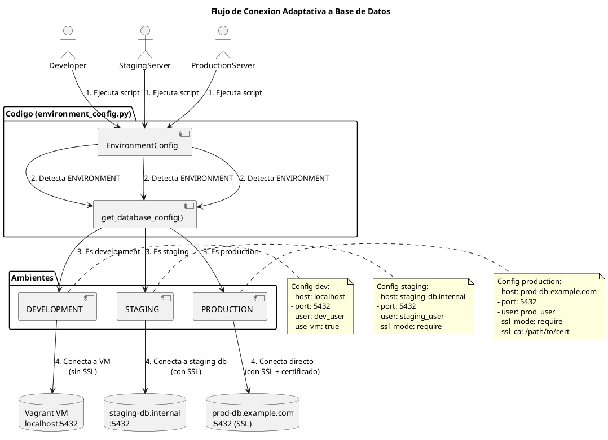

# Flujo de Conexion a Base de Datos

Explicacion visual de como funciona la conexion a base de datos en diferentes ambientes.

## Diagrama de Flujo



## Como Funciona en Tu Maquina

### 1. DEVELOPMENT (tu laptop)

```
┌─────────────────────────────────────────────────────┐
│ Tu Maquina (Mac/Linux/Windows)                      │
│                                                     │
│  ┌──────────────────────────────────────────┐      │
│  │ Python Script                            │      │
│  │                                          │      │
│  │  from environment_config import ...      │      │
│  │  config = get_environment_config()       │      │
│  │  db = config.get_database_config()       │      │
│  │                                          │      │
│  │  print(db['host'])  # localhost          │      │
│  │  print(db['port'])  # 5432               │      │
│  └──────────────────────────────────────────┘      │
│                    │                                │
│                    │ psycopg2.connect()             │
│                    ▼                                │
│  ┌──────────────────────────────────────────┐      │
│  │ localhost:5432                           │      │
│  │    (port forwarding)                     │      │
│  └──────────────────────────────────────────┘      │
│                    │                                │
└────────────────────┼────────────────────────────────┘
                     │
                     │ Vagrant Port Forward
                     ▼
      ┌──────────────────────────────────────┐
      │ Vagrant VM (VirtualBox/VMware)       │
      │                                      │
      │  ┌────────────────────────────┐      │
      │  │ PostgreSQL Server          │      │
      │  │ - Database: iact_dev       │      │
      │  │ - User: dev_user           │      │
      │  │ - Port: 5432 (interno)     │      │
      │  └────────────────────────────┘      │
      └──────────────────────────────────────┘
```

**Configuracion Vagrantfile:**
```ruby
Vagrant.configure("2") do |config|
  config.vm.box = "ubuntu/jammy64"

  # Port forwarding: VM:5432 -> Host:5432
  config.vm.network "forwarded_port", guest: 5432, host: 5432
end
```

**Configuracion .env:**
```bash
ENVIRONMENT=development
DB_VM_HOST=localhost      # Puerto forwarded
DB_VM_PORT=5432
DB_VM_NAME=iact_dev
DB_VM_USER=dev_user
DB_VM_PASSWORD=dev_password
```

**Conexion Python:**
```python
import psycopg2
from scripts.ai.shared.environment_config import get_environment_config

config = get_environment_config()  # Detecta: development
db_config = config.get_database_config()

# db_config = {
#   'host': 'localhost',  # Gracias a port forwarding
#   'port': 5432,
#   'database': 'iact_dev',
#   'user': 'dev_user',
#   'password': 'dev_password',
#   'use_vm': True
# }

conn = psycopg2.connect(**db_config)
# [OK] Conectado a VM via localhost:5432
```

### 2. STAGING (servidor staging)

```
┌─────────────────────────────────────────────────────┐
│ Servidor Staging (AWS/GCP/Azure)                    │
│                                                     │
│  ┌──────────────────────────────────────────┐      │
│  │ Python Script (mismo codigo!)            │      │
│  │                                          │      │
│  │  config = get_environment_config()       │      │
│  │  # Detecta: ENVIRONMENT=staging          │      │
│  │                                          │      │
│  │  db = config.get_database_config()       │      │
│  │  print(db['host'])                       │      │
│  │  # staging-db.internal                   │      │
│  └──────────────────────────────────────────┘      │
│                    │                                │
└────────────────────┼────────────────────────────────┘
                     │
                     │ psycopg2.connect() con SSL
                     ▼
      ┌──────────────────────────────────────┐
      │ staging-db.internal:5432             │
      │                                      │
      │  ┌────────────────────────────┐      │
      │  │ PostgreSQL Server          │      │
      │  │ - Database: iact_staging   │      │
      │  │ - User: staging_user       │      │
      │  │ - SSL: required            │      │
      │  └────────────────────────────┘      │
      └──────────────────────────────────────┘
```

**Configuracion .env en servidor staging:**
```bash
ENVIRONMENT=staging
DB_STAGING_HOST=staging-db.internal
DB_STAGING_PORT=5432
DB_STAGING_NAME=iact_staging
DB_STAGING_USER=staging_user
DB_STAGING_PASSWORD=secure_password_here
```

**Codigo NO cambia, solo detecta staging:**
```python
config = get_environment_config()  # Detecta: staging
db_config = config.get_database_config()

# db_config = {
#   'host': 'staging-db.internal',  # Ya no es localhost
#   'port': 5432,
#   'database': 'iact_staging',
#   'user': 'staging_user',
#   'password': 'secure_password',
#   'use_vm': False,                 # No es VM
#   'ssl_mode': 'require'            # SSL habilitado
# }

conn = psycopg2.connect(**db_config)
# [OK] Conectado a staging-db via red interna con SSL
```

### 3. PRODUCTION (servidor produccion)

```
┌─────────────────────────────────────────────────────┐
│ Servidor Produccion (AWS RDS/Cloud SQL)             │
│                                                     │
│  ┌──────────────────────────────────────────┐      │
│  │ Python Script (mismo codigo!)            │      │
│  │                                          │      │
│  │  config = get_environment_config()       │      │
│  │  # Detecta: ENVIRONMENT=production       │      │
│  │                                          │      │
│  │  db = config.get_database_config()       │      │
│  │  print(db['host'])                       │      │
│  │  # prod-db.example.com                   │      │
│  └──────────────────────────────────────────┘      │
│                    │                                │
└────────────────────┼────────────────────────────────┘
                     │
                     │ psycopg2.connect()
                     │ con SSL + Certificado
                     ▼
      ┌──────────────────────────────────────┐
      │ prod-db.example.com:5432             │
      │ (AWS RDS / Cloud SQL)                │
      │                                      │
      │  ┌────────────────────────────┐      │
      │  │ PostgreSQL Server          │      │
      │  │ - Database: iact_production│      │
      │  │ - User: prod_user          │      │
      │  │ - SSL: required            │      │
      │  │ - Certificado: CA cert     │      │
      │  └────────────────────────────┘      │
      └──────────────────────────────────────┘
```

**Configuracion .env en servidor produccion:**
```bash
ENVIRONMENT=production
DB_PROD_HOST=prod-db.example.com
DB_PROD_PORT=5432
DB_PROD_NAME=iact_production
DB_PROD_USER=prod_user
DB_PROD_PASSWORD=very_secure_password
DB_PROD_SSL_CA=/etc/ssl/certs/rds-ca-2019-root.pem
```

**Codigo IDENTICO, detecta produccion:**
```python
config = get_environment_config()  # Detecta: production
db_config = config.get_database_config()

# db_config = {
#   'host': 'prod-db.example.com',   # Host real
#   'port': 5432,
#   'database': 'iact_production',
#   'user': 'prod_user',
#   'password': 'very_secure_password',
#   'use_vm': False,                  # Conexion directa
#   'ssl_mode': 'require',            # SSL obligatorio
#   'ssl_ca': '/etc/ssl/certs/...'    # Certificado CA
# }

conn = psycopg2.connect(**db_config)
# [OK] Conectado a prod-db con SSL y certificado
```

## Resumen Comparativo

| Aspecto | Development | Staging | Production |
|---------|-------------|---------|------------|
| **Host** | localhost | staging-db.internal | prod-db.example.com |
| **Infraestructura** | Vagrant VM | Servidor staging | AWS RDS/Cloud SQL |
| **Port Forwarding** | Si (5432→5432) | No | No |
| **SSL** | No | Si (require) | Si (require + cert) |
| **use_vm** | True | False | False |
| **Credenciales** | dev_user/dev_password | staging_user/secure | prod_user/very_secure |
| **Codigo Python** | IDENTICO | IDENTICO | IDENTICO |

## Ventajas del Sistema

1. **Un solo codigo** para todos los ambientes
2. **Deteccion automatica** del ambiente
3. **Configuracion por .env** sin tocar codigo
4. **Seguridad**: SSL automatico en staging/prod
5. **Facilidad**: port forwarding en desarrollo

## Como Probarlo Ahora

En tu maquina local:

```bash
# 1. Levantar Vagrant
vagrant up

# 2. Configurar .env
cat > .env << EOF
ENVIRONMENT=development
DB_VM_HOST=localhost
DB_VM_PORT=5432
DB_VM_NAME=iact_dev
DB_VM_USER=dev_user
DB_VM_PASSWORD=dev_password
EOF

# 3. Ejecutar ejemplo
python3 examples/backend_database_example.py

# Resultado:
# [OK] Conectado a localhost:5432 (VM via port forwarding)
```

En servidor staging:

```bash
# 1. Configurar .env en servidor
cat > /etc/iact/.env << EOF
ENVIRONMENT=staging
DB_STAGING_HOST=staging-db.internal
DB_STAGING_USER=staging_user
DB_STAGING_PASSWORD=secure_password
EOF

# 2. Ejecutar MISMO codigo
python3 examples/backend_database_example.py

# Resultado:
# [OK] Conectado a staging-db.internal:5432 con SSL
```

En servidor produccion:

```bash
# 1. Configurar .env en servidor
cat > /etc/iact/.env << EOF
ENVIRONMENT=production
DB_PROD_HOST=prod-db.example.com
DB_PROD_USER=prod_user
DB_PROD_PASSWORD=very_secure_password
DB_PROD_SSL_CA=/etc/ssl/certs/ca-cert.pem
EOF

# 2. Ejecutar MISMO codigo
python3 examples/backend_database_example.py

# Resultado:
# [OK] Conectado a prod-db.example.com:5432 con SSL + certificado
```

## Preguntas Frecuentes

### Q: Por que no se conecto realmente en Claude Code?

A: Claude Code no tiene:
- PostgreSQL instalado
- Vagrant instalado
- Acceso a tu VM local

El sistema MUESTRA como se configuraria, pero la conexion real
sucede cuando TU lo ejecutas en tu maquina.

### Q: Funciona con otros tipos de base de datos?

A: Si, el patron es el mismo para:
- MySQL
- MongoDB
- Redis
- Elasticsearch

Solo cambia la libreria de conexion (psycopg2, pymongo, etc.)

### Q: Que pasa si no uso Vagrant?

A: Puedes usar:
- Docker Compose (mejor opcion)
- PostgreSQL instalado localmente
- Base de datos remota

El sistema detecta donde esta y se conecta correctamente.

### Q: Como hacer SSH tunnel si necesito?

A: Configurar en .env:

```bash
DB_SSH_TUNNEL=true
DB_SSH_HOST=192.168.1.100
DB_SSH_PORT=22
DB_SSH_USER=vagrant
```

El sistema automaticamente crea el tunnel antes de conectar.
