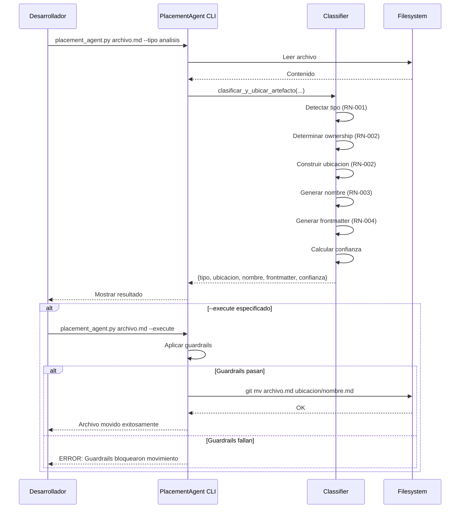

# Caso de Uso: Clasificar Artefacto via CLI

## Identificacion
- Codigo: UC-001
- Nombre: Clasificar Artefacto Manualmente
- Actor primario: Desarrollador
- Nivel: Usuario

## Resumen
El desarrollador utiliza el CLI del PlacementAgent para clasificar manualmente un artefacto y obtener recomendacion de ubicacion, nombre y frontmatter.

## Precondiciones
- PlacementAgent instalado en el proyecto
- Archivo artefacto existe en filesystem
- Desarrollador tiene permisos de lectura sobre el archivo

## Flujo principal

| Actor | Sistema |
| --- | --- |
| 1. Desarrollador ejecuta: `python placement_agent.py <archivo> --tipo <tipo> --tema <tema>` | |
| | 2. Sistema lee archivo y contexto proporcionado |
| | 3. Sistema clasifica artefacto aplicando RN-001 |
| | 4. Sistema determina ownership aplicando RN-002 |
| | 5. Sistema construye ubicacion canonica aplicando RN-002 |
| | 6. Sistema genera nombre estandarizado aplicando RN-003 |
| | 7. Sistema genera frontmatter YAML aplicando RN-004 |
| | 8. Sistema calcula confianza de clasificacion |
| | 9. Sistema muestra resultado: |
| | - Tipo detectado |
| | - Ubicacion canonica |
| | - Nombre sugerido |
| | - Confianza (0.0-1.0) |
| | - Frontmatter generado |
| | - Warnings (si hay) |
| 10. Desarrollador revisa resultado | |
| 11. Desarrollador ejecuta con `--execute` para mover archivo | |
| | 12. Sistema valida guardrails (confianza ≥ 0.6, ubicacion no prohibida) |
| | 13. Sistema crea directorio destino si no existe |
| | 14. Sistema mueve archivo con `git mv` (preserva historial) |
| | 15. Sistema confirma movimiento exitoso |

## Flujos alternos

### 1.a Clasificacion ambigua (confianza < 0.6)

| Actor | Sistema |
| --- | --- |
| | 1.a.1 Sistema detecta confianza < 0.6 |
| | 1.a.2 Sistema marca `requiere_clarificacion: true` |
| | 1.a.3 Sistema muestra: "REQUIERE CLARIFICACION - Especificar dominio/contexto" |
| 1.a.4 Desarrollador vuelve a ejecutar con contexto adicional: `--dominio backend --tema VALIDACION` | |
| | 1.a.5 Sistema reclasifica con contexto adicional |
| | 1.a.6 Continua en paso 8 del flujo principal |

### 2.a Archivo no existe

| Actor | Sistema |
| --- | --- |
| 1. Desarrollador ejecuta con archivo inexistente | |
| | 2.a.1 Sistema valida existencia de archivo |
| | 2.a.2 Sistema retorna error: "Archivo '/path/file.md' no existe" |
| | 2.a.3 Termina caso de uso con status FAILED |

### 3.a Ubicacion prohibida (guardrails)

| Actor | Sistema |
| --- | --- |
| | 3.a.1 Sistema detecta ubicacion prohibida (/home/, /root/, etc.) |
| | 3.a.2 Sistema retorna error: "Ubicacion prohibida: /home/..." |
| | 3.a.3 Termina caso de uso con status BLOCKED |

### 4.a Archivo destino ya existe

| Actor | Sistema |
| --- | --- |
| | 4.a.1 Sistema detecta que archivo destino ya existe |
| | 4.a.2 Sistema agrega warning: "Archivo ya existe en destino: <path>" |
| | 4.a.3 Sistema NO ejecuta movimiento (requiere confirmacion manual) |
| 4.a.4 Desarrollador decide agregar version: `--nombre TASK-001-descripcion_v2.md` | |
| | 4.a.5 Continua en paso 14 del flujo principal |

## Postcondiciones

### Exito
- Archivo clasificado correctamente
- Ubicacion canonica determinada
- Nombre estandarizado generado
- Frontmatter YAML valido generado
- Si `--execute`: archivo movido a ubicacion canonica con `git mv`

### Fallo
- Archivo no movido
- Error reportado al usuario
- Status FAILED o BLOCKED registrado

## Reglas de negocio vinculadas
- RN-001: Clasificacion de tipos de artefactos
- RN-002: Ubicacion canonica segun ADR-010
- RN-003: Clean Code Naming
- RN-004: Frontmatter YAML con trazabilidad

## Requisitos especiales

### Seguridad
- No permitir movimientos fuera de docs/ o scripts/
- Validar permisos de escritura en destino
- Preservar historial git al mover archivos

### Rendimiento
- Clasificacion completa en < 500ms
- Lectura de archivo limitada a primeros 10KB (performance)

### Usabilidad
- Output legible en terminal (tabla formateada)
- Modo `--json` para integracion con otras herramientas
- Modo `--dry-run` (default) para previsualizar sin mover

## Diagramas

