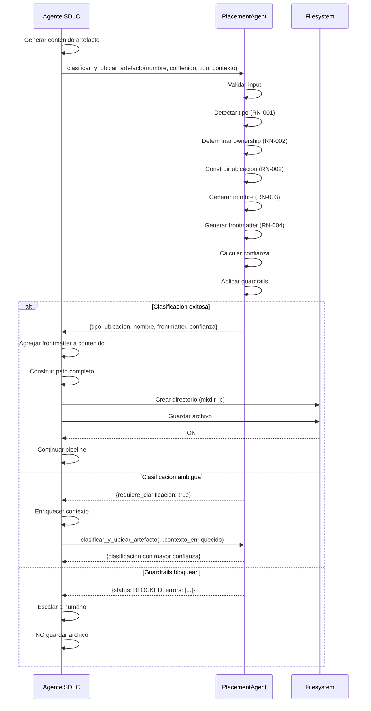

# Caso de Uso: Clasificar Artefacto desde Agente SDLC

## Identificacion
- Codigo: UC-002
- Nombre: Clasificar Artefacto Automaticamente desde Agente SDLC
- Actor primario: Agente SDLC (PlannerAgent, DesignAgent, TDDAgent, etc.)
- Nivel: Sistema

## Resumen
Un agente SDLC genera un artefacto durante su ejecucion (ej: DesignAgent genera ADR) y usa PlacementAgent para determinar donde guardarlo automaticamente, sin intervencion humana.

## Precondiciones
- PlacementAgent disponible en el proyecto
- Agente SDLC ha generado contenido de artefacto
- Agente SDLC tiene contexto de tipo y dominio

## Flujo principal

| Actor | Sistema |
| --- | --- |
| 1. Agente SDLC genera contenido de artefacto (ej: texto de ADR) | |
| 2. Agente SDLC invoca PlacementAgent via API Python: | |
| `from scripts.coding.ai.agents.placement import clasificar_y_ubicar_artefacto` | |
| `resultado = clasificar_y_ubicar_artefacto(nombre, contenido, tipo, contexto)` | |
| | 3. PlacementAgent recibe input_data con: |
| | - nombre_archivo: nombre tentativo del archivo |
| | - contenido: contenido completo del artefacto |
| | - tipo_declarado: tipo declarado por el agente (opcional) |
| | - contexto: {dominio, tema, id, descripcion} |
| | 4. PlacementAgent clasifica artefacto aplicando RN-001 |
| | 5. PlacementAgent determina ownership aplicando RN-002 |
| | 6. PlacementAgent construye ubicacion canonica aplicando RN-002 |
| | 7. PlacementAgent genera nombre estandarizado aplicando RN-003 |
| | 8. PlacementAgent genera frontmatter YAML aplicando RN-004 |
| | 9. PlacementAgent calcula confianza de clasificacion |
| | 10. PlacementAgent retorna dict con: |
| | ```python |
| | { |
| | "tipo": "adr", |
| | "ubicacion": "docs/gobernanza/adr/", |
| | "nombre_sugerido": "ADR-010-arquitectura_dominios.md", |
| | "frontmatter": {...}, |
| | "confianza": 0.95 |
| | } |
| | ``` |
| 11. Agente SDLC recibe resultado | |
| 12. Agente SDLC agrega frontmatter al contenido: | |
| `contenido_final = frontmatter_yaml + "\n\n" + contenido` | |
| 13. Agente SDLC construye path completo: | |
| `filepath = Path(resultado["ubicacion"]) / resultado["nombre_sugerido"]` | |
| 14. Agente SDLC guarda archivo: | |
| `filepath.parent.mkdir(parents=True, exist_ok=True)` | |
| `filepath.write_text(contenido_final)` | |
| | 15. PlacementAgent registra artefacto guardado en log |
| 16. Agente SDLC continua con siguiente paso de su pipeline | |

## Flujos alternos

### 1.a Clasificacion ambigua (confianza < 0.6)

| Actor | Sistema |
| --- | --- |
| | 1.a.1 PlacementAgent detecta confianza < 0.6 |
| | 1.a.2 PlacementAgent retorna con `requiere_clarificacion: true` |
| 1.a.3 Agente SDLC detecta flag de clarificacion | |
| 1.a.4 Agente SDLC agrega contexto adicional automatico (ej: extrae dominio de config) | |
| 1.a.5 Agente SDLC reinvoca PlacementAgent con contexto enriquecido | |
| | 1.a.6 PlacementAgent reclasifica |
| | 1.a.7 Si aun requiere clarificacion: |
| | - PlacementAgent retorna error |
| | - Agente SDLC escala a humano (genera issue "Clasificacion manual requerida") |

### 2.a Contenido vacio o invalido

| Actor | Sistema |
| --- | --- |
| 1. Agente SDLC invoca con contenido vacio | |
| | 2.a.1 PlacementAgent valida contenido |
| | 2.a.2 PlacementAgent retorna error: "Contenido vacio o invalido" |
| 2.a.3 Agente SDLC registra error y aborta generacion de artefacto | |

### 3.a Guardrails bloquean clasificacion

| Actor | Sistema |
| --- | --- |
| | 3.a.1 PlacementAgent detecta violacion de guardrails |
| | 3.a.2 PlacementAgent retorna status BLOCKED con errores |
| 3.a.3 Agente SDLC detecta bloqueo | |
| 3.a.4 Agente SDLC registra error y escala a humano | |
| 3.a.5 Agente SDLC no guarda archivo (previene ubicacion incorrecta) | |

## Postcondiciones

### Exito
- Artefacto clasificado con confianza ≥ 0.6
- Ubicacion canonica determinada
- Nombre estandarizado generado
- Frontmatter YAML agregado al contenido
- Archivo guardado en ubicacion correcta
- Agente SDLC continua ejecucion

### Fallo
- Clasificacion bloqueada (guardrails o confianza baja)
- Error reportado al agente SDLC
- Agente SDLC escala a humano o aborta
- Archivo NO guardado en ubicacion incorrecta

## Reglas de negocio vinculadas
- RN-001: Clasificacion de tipos de artefactos
- RN-002: Ubicacion canonica segun ADR-010
- RN-003: Clean Code Naming
- RN-004: Frontmatter YAML con trazabilidad

## Requisitos especiales

### Seguridad
- PlacementAgent NO debe tener permisos de escritura (solo clasificacion)
- Agente SDLC responsable de guardar archivo (separacion de responsabilidades)
- Validar que contexto provisto por agente es confiable

### Rendimiento
- Clasificacion en < 100ms (ejecucion asincrona de agentes)
- Sin I/O de archivos (contenido en memoria)

### Integracion
- API Python simple (una funcion, un dict de retorno)
- Sin dependencias circulares entre agentes
- Backward compatible con agentes existentes

## Diagramas


