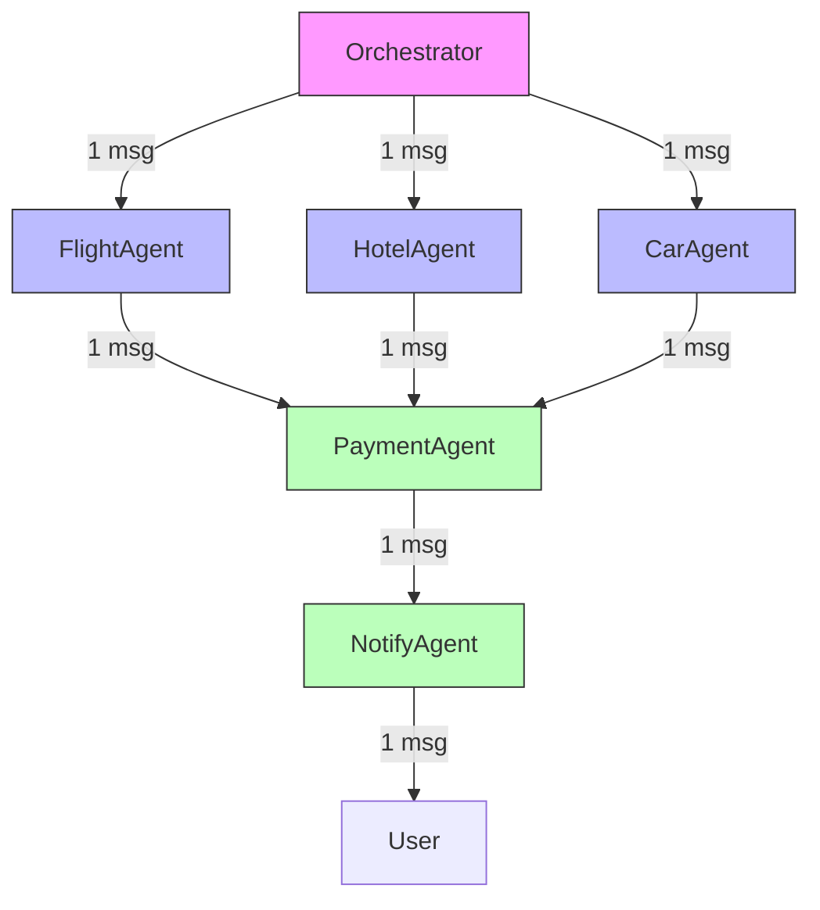

# RT-012: Multi-Agent Performance and Observability

## Propósito

Definir estándares de observabilidad para sistemas multi-agent, garantizando visibilidad completa de interacciones, performance tracking, y debugging capabilities.

## Reglas Técnicas

### 1. Logging Requirements

```python
LOGGING_REQUIREMENTS = {
    # Log levels
    "levels": {
        "DEBUG": "Detailed messages for debugging",
        "INFO": "Normal operations (agent actions, messages)",
        "WARNING": "Unusual but handled situations",
        "ERROR": "Error conditions",
        "CRITICAL": "System failures"
    },

    # What to log
    "log_categories": {
        "agent_action": {
            "required_fields": [
                "timestamp",
                "agent_id",
                "action",
                "task_id",
                "duration_ms",
                "success",
                "result_summary"
            ],
            "level": "INFO"
        },

        "agent_communication": {
            "required_fields": [
                "timestamp",
                "message_id",
                "from_agent",
                "to_agent",
                "message_type",
                "correlation_id",
                "latency_ms"
            ],
            "level": "INFO"
        },

        "handoff": {
            "required_fields": [
                "timestamp",
                "from_agent",
                "to_agent",
                "workflow_id",
                "step_number",
                "task_description",
                "context_size_kb"
            ],
            "level": "INFO"
        },

        "orchestration": {
            "required_fields": [
                "timestamp",
                "workflow_id",
                "user_request",
                "decomposed_tasks_count",
                "execution_strategy",  # "parallel" or "sequential"
                "total_duration_ms"
            ],
            "level": "INFO"
        },

        "error": {
            "required_fields": [
                "timestamp",
                "agent_id",
                "error_type",
                "error_message",
                "stack_trace",
                "task_id",
                "workflow_id"
            ],
            "level": "ERROR"
        }
    },

    # Retention
    "retention_days": 30,
    "archive_to_blob_after_days": 7,

    # Format
    "format": "json",  # Structured logging
    "include_context": True  # Include task context in logs
}
```

**Implementation**:
```python
class MultiAgentLogger:
    """RT-012: Structured logger for multi-agent systems."""

    def __init__(self):
        self.logger = logging.getLogger("multi_agent")
        self.formatter = JsonFormatter()

    def log_agent_action(
        self,
        agent_id: str,
        action: str,
        task_id: str,
        duration_ms: float,
        success: bool,
        result: Any
    ):
        """
        RT-012: Log agent action with required fields.
        """
        log_entry = {
            "category": "agent_action",
            "timestamp": datetime.now().isoformat(),
            "agent_id": agent_id,
            "action": action,
            "task_id": task_id,
            "duration_ms": duration_ms,
            "success": success,
            "result_summary": self._summarize_result(result)
        }

        self.logger.info(json.dumps(log_entry))

    def log_communication(self, message: Message, latency_ms: float):
        """
        RT-012: Log agent communication.
        """
        log_entry = {
            "category": "agent_communication",
            "timestamp": datetime.now().isoformat(),
            "message_id": message.message_id,
            "from_agent": message.from_agent,
            "to_agent": message.to_agent,
            "message_type": message.message_type.value,
            "correlation_id": message.correlation_id,
            "latency_ms": latency_ms
        }

        self.logger.info(json.dumps(log_entry))

    def log_handoff(
        self,
        from_agent: str,
        to_agent: str,
        workflow_id: str,
        step_number: int,
        task_description: str,
        context: Dict
    ):
        """
        RT-012: Log handoff between agents.
        """
        context_size_kb = len(json.dumps(context).encode('utf-8')) / 1024

        log_entry = {
            "category": "handoff",
            "timestamp": datetime.now().isoformat(),
            "from_agent": from_agent,
            "to_agent": to_agent,
            "workflow_id": workflow_id,
            "step_number": step_number,
            "task_description": task_description,
            "context_size_kb": context_size_kb
        }

        self.logger.info(json.dumps(log_entry))

    def log_error(
        self,
        agent_id: str,
        error: Exception,
        task_id: str,
        workflow_id: str
    ):
        """
        RT-012: Log error with full context.
        """
        log_entry = {
            "category": "error",
            "timestamp": datetime.now().isoformat(),
            "agent_id": agent_id,
            "error_type": type(error).__name__,
            "error_message": str(error),
            "stack_trace": traceback.format_exc(),
            "task_id": task_id,
            "workflow_id": workflow_id
        }

        self.logger.error(json.dumps(log_entry))
```

### 2. Workflow Tracing

```python
WORKFLOW_TRACING_CONFIG = {
    # Trace requirements
    "trace_all_workflows": True,
    "trace_retention_days": 30,

    # Trace components
    "components": {
        "spans": {
            "description": "Individual agent actions",
            "required_attributes": [
                "span_id",
                "parent_span_id",
                "trace_id",  # Same as workflow_id
                "agent_id",
                "operation",
                "start_time",
                "end_time",
                "duration_ms",
                "status",  # "success", "error", "timeout"
            ]
        },

        "trace": {
            "description": "Complete workflow trace",
            "required_attributes": [
                "trace_id",
                "workflow_id",
                "user_request",
                "start_time",
                "end_time",
                "total_duration_ms",
                "agents_involved",
                "spans_count",
                "status"
            ]
        }
    },

    # Sampling
    "sampling_rate": 1.0,  # 100% (trace all workflows)

    # Export
    "export_to": "distributed_tracing_system"  # e.g., Jaeger, Zipkin
}
```

**Implementation**:
```python
class WorkflowTracer:
    """RT-012: Distributed tracing for multi-agent workflows."""

    def __init__(self):
        self.tracer = DistributedTracer()
        self.active_traces: Dict[str, Trace] = {}

    def start_workflow_trace(
        self,
        workflow_id: str,
        user_request: str
    ) -> Trace:
        """
        RT-012: Start tracing a new workflow.
        """
        trace = Trace(
            trace_id=workflow_id,
            workflow_id=workflow_id,
            user_request=user_request,
            start_time=datetime.now(),
            agents_involved=[],
            spans=[]
        )

        self.active_traces[workflow_id] = trace

        logger.info(f"Started workflow trace: {workflow_id}")

        return trace

    def add_span(
        self,
        workflow_id: str,
        agent_id: str,
        operation: str,
        parent_span_id: str = None
    ) -> Span:
        """
        RT-012: Add span to workflow trace.
        """
        if workflow_id not in self.active_traces:
            raise ValueError(f"No active trace for workflow: {workflow_id}")

        trace = self.active_traces[workflow_id]

        span = Span(
            span_id=str(uuid.uuid4()),
            parent_span_id=parent_span_id,
            trace_id=workflow_id,
            agent_id=agent_id,
            operation=operation,
            start_time=datetime.now()
        )

        trace.spans.append(span)

        if agent_id not in trace.agents_involved:
            trace.agents_involved.append(agent_id)

        return span

    def end_span(self, span: Span, status: str, result: Any = None):
        """
        RT-012: End span with status.
        """
        span.end_time = datetime.now()
        span.duration_ms = (span.end_time - span.start_time).total_seconds() * 1000
        span.status = status
        span.result = result

        logger.debug(
            f"Span ended: {span.agent_id}.{span.operation} "
            f"({span.duration_ms:.2f}ms, {status})"
        )

    def end_workflow_trace(self, workflow_id: str, status: str):
        """
        RT-012: End workflow trace.
        """
        if workflow_id not in self.active_traces:
            raise ValueError(f"No active trace for workflow: {workflow_id}")

        trace = self.active_traces[workflow_id]
        trace.end_time = datetime.now()
        trace.total_duration_ms = (trace.end_time - trace.start_time).total_seconds() * 1000
        trace.status = status
        trace.spans_count = len(trace.spans)

        # Export trace
        self.tracer.export(trace)

        # Remove from active
        del self.active_traces[workflow_id]

        logger.info(
            f"Workflow trace ended: {workflow_id} "
            f"({trace.total_duration_ms:.2f}ms, {trace.spans_count} spans, {status})"
        )

    def get_trace(self, workflow_id: str) -> Trace:
        """
        RT-012: Retrieve workflow trace for analysis.
        """
        return self.tracer.query(trace_id=workflow_id)
```

### 3. Visualization Requirements

```python
VISUALIZATION_REQUIREMENTS = {
    # Dashboard components
    "dashboards": {
        "workflow_overview": {
            "description": "High-level workflow status",
            "components": [
                "active_workflows_count",
                "completed_workflows_count",
                "failed_workflows_count",
                "avg_workflow_duration",
                "workflow_throughput_per_minute"
            ]
        },

        "agent_activity": {
            "description": "Per-agent activity",
            "components": [
                "agent_status_table",     # IDLE, BUSY, ERROR
                "tasks_completed_per_agent",
                "avg_task_duration_per_agent",
                "error_rate_per_agent"
            ]
        },

        "communication_graph": {
            "description": "Agent communication visualization",
            "type": "directed_graph",
            "nodes": "agents",
            "edges": "messages",
            "edge_weight": "message_count",
            "update_interval_seconds": 5
        },

        "workflow_trace_viewer": {
            "description": "Detailed workflow trace",
            "type": "timeline",
            "shows": [
                "agent_spans",
                "messages_exchanged",
                "handoffs",
                "critical_path"
            ]
        }
    },

    # Graph rendering
    "graph_format": "mermaid",  # or "graphviz", "d3"

    # Real-time updates
    "refresh_interval_seconds": 5,
}
```

**Example Visualization - Workflow Trace**:
```
Workflow: book_trip_paris_123
Duration: 15.3s
Status: SUCCESS

┌─────────────────────────────────────────────────────────┐
│  Timeline (0s ──────────────────────────── 15.3s)      │
├─────────────────────────────────────────────────────────┤
│                                                         │
│  Orchestrator  ████ (0-0.5s)                           │
│                 ▼                                       │
│  FlightAgent    ████████████ (0.5-3.0s)                │
│                                                         │
│  HotelAgent      ████████████████ (0.6-4.1s)           │
│                                                         │
│  CarAgent         ██████████ (0.7-2.5s)                │
│                       │  │  │                          │
│                       └──┴──┘                          │
│                          ▼                              │
│  PaymentAgent             █████████████ (4.1-9.3s)     │
│                                     ▼                   │
│  NotifyAgent                         ████ (9.3-9.7s)   │
│                                                         │
│  Messages: 8                                           │
│  Handoffs: 2 (Flight→Payment, Payment→Notify)         │
└─────────────────────────────────────────────────────────┘
```

**Example Visualization - Communication Graph**:


### 4. Performance Metrics Collection

```python
PERFORMANCE_METRICS = {
    # Workflow metrics
    "workflow.active_count": "gauge",
    "workflow.completed_count": "counter",
    "workflow.failed_count": "counter",
    "workflow.duration_ms": "histogram",
    "workflow.throughput_per_minute": "gauge",

    # Agent metrics
    "agent.status": "enum",  # IDLE, BUSY, ERROR
    "agent.tasks_completed": "counter",
    "agent.tasks_failed": "counter",
    "agent.task_duration_ms": "histogram",
    "agent.idle_time_ms": "histogram",
    "agent.utilization_percent": "gauge",

    # Communication metrics
    "communication.messages_sent": "counter",
    "communication.messages_received": "counter",
    "communication.message_latency_ms": "histogram",
    "communication.handoffs_count": "counter",
    "communication.handoff_latency_ms": "histogram",
    "communication.broadcasts_count": "counter",

    # Orchestration metrics
    "orchestration.routing_latency_ms": "histogram",
    "orchestration.aggregation_latency_ms": "histogram",
    "orchestration.parallel_execution_count": "counter",
    "orchestration.sequential_execution_count": "counter",

    # Error metrics
    "error.count_by_agent": "counter",
    "error.count_by_type": "counter",
    "error.resolution_time_ms": "histogram",

    # Resource metrics
    "resource.message_queue_depth": "gauge",
    "resource.shared_state_size_kb": "gauge",
    "resource.memory_usage_mb": "gauge",
}
```

**Implementation**:
```python
class MultiAgentMetrics:
    """RT-012: Comprehensive metrics collection for multi-agent systems."""

    def __init__(self):
        self.metrics_client = MetricsClient()

    def record_workflow_started(self, workflow_id: str):
        """RT-012: Record workflow start."""
        self.metrics_client.increment("workflow.started")
        self.metrics_client.gauge("workflow.active_count", self._get_active_count())

    def record_workflow_completed(
        self,
        workflow_id: str,
        duration_ms: float,
        success: bool
    ):
        """RT-012: Record workflow completion."""
        if success:
            self.metrics_client.increment("workflow.completed_count")
        else:
            self.metrics_client.increment("workflow.failed_count")

        self.metrics_client.histogram("workflow.duration_ms", duration_ms)
        self.metrics_client.gauge("workflow.active_count", self._get_active_count())

    def record_agent_task(
        self,
        agent_id: str,
        duration_ms: float,
        success: bool
    ):
        """RT-012: Record agent task execution."""
        if success:
            self.metrics_client.increment(
                "agent.tasks_completed",
                tags={"agent_id": agent_id}
            )
        else:
            self.metrics_client.increment(
                "agent.tasks_failed",
                tags={"agent_id": agent_id}
            )

        self.metrics_client.histogram(
            "agent.task_duration_ms",
            duration_ms,
            tags={"agent_id": agent_id}
        )

    def record_agent_utilization(self, agent_id: str, utilization: float):
        """RT-012: Record agent utilization percentage."""
        self.metrics_client.gauge(
            "agent.utilization_percent",
            utilization * 100,
            tags={"agent_id": agent_id}
        )

    def record_communication(self, message: Message, latency_ms: float):
        """RT-012: Record agent communication metrics."""
        self.metrics_client.increment(
            "communication.messages_sent",
            tags={"from_agent": message.from_agent}
        )

        self.metrics_client.increment(
            "communication.messages_received",
            tags={"to_agent": message.to_agent}
        )

        self.metrics_client.histogram(
            "communication.message_latency_ms",
            latency_ms,
            tags={
                "message_type": message.message_type.value
            }
        )

    def record_handoff(
        self,
        from_agent: str,
        to_agent: str,
        latency_ms: float
    ):
        """RT-012: Record handoff metrics."""
        self.metrics_client.increment("communication.handoffs_count")

        self.metrics_client.histogram(
            "communication.handoff_latency_ms",
            latency_ms,
            tags={
                "from_agent": from_agent,
                "to_agent": to_agent
            }
        )
```

### 5. Debugging Tools

```python
DEBUGGING_TOOLS = {
    # Log query interface
    "log_query": {
        "filters": [
            "workflow_id",
            "agent_id",
            "time_range",
            "log_level",
            "category"
        ],
        "output_format": ["json", "table", "timeline"]
    },

    # Trace replay
    "trace_replay": {
        "description": "Replay workflow from trace",
        "capabilities": [
            "step_through",
            "breakpoints",
            "inspect_state",
            "modify_context"
        ]
    },

    # Agent inspector
    "agent_inspector": {
        "shows": [
            "current_task",
            "message_queue",
            "internal_state",
            "recent_actions"
        ]
    },

    # Message inspector
    "message_inspector": {
        "shows": [
            "message_content",
            "correlation_chain",  # All messages in request-response chain
            "delivery_timeline"
        ]
    }
}
```

**Implementation - Log Query Tool**:
```python
class LogQueryTool:
    """RT-012: Query multi-agent logs for debugging."""

    def __init__(self):
        self.log_storage = LogStorage()

    def query_logs(
        self,
        workflow_id: str = None,
        agent_id: str = None,
        start_time: datetime = None,
        end_time: datetime = None,
        log_level: str = None,
        category: str = None,
        limit: int = 100
    ) -> List[Dict]:
        """
        RT-012: Query logs with filters.

        Returns:
            List of log entries matching filters
        """
        filters = {}

        if workflow_id:
            filters["workflow_id"] = workflow_id

        if agent_id:
            filters["agent_id"] = agent_id

        if start_time:
            filters["timestamp_gte"] = start_time.isoformat()

        if end_time:
            filters["timestamp_lte"] = end_time.isoformat()

        if log_level:
            filters["level"] = log_level

        if category:
            filters["category"] = category

        logs = self.log_storage.query(filters, limit=limit)

        return logs

    def format_timeline(self, logs: List[Dict]) -> str:
        """Format logs as timeline."""
        timeline = []

        for log in sorted(logs, key=lambda l: l["timestamp"]):
            timestamp = log["timestamp"]
            category = log.get("category", "unknown")
            agent_id = log.get("agent_id", "system")
            action = log.get("action", log.get("message", ""))

            timeline.append(f"{timestamp} | {agent_id:15} | {category:20} | {action}")

        return "\n".join(timeline)
```

## Performance Targets

| Metric                          | Target         | Alert Threshold |
| ------------------------------- | -------------- | --------------- |
| Log write latency p95           | < 5ms          | > 10ms          |
| Trace export latency p95        | < 100ms        | > 500ms         |
| Dashboard refresh interval      | 5s             | > 10s           |
| Metrics collection latency      | < 1ms          | > 5ms           |
| Log query latency (100 entries) | < 500ms        | > 2s            |

## Cumplimiento

- Sistema DEBE log all agent actions con required fields
- Sistema DEBE log all agent communications con latency
- Sistema DEBE trace all workflows con distributed tracing
- Sistema DEBE provide real-time dashboards (5s refresh)
- Sistema DEBE collect performance metrics (workflow, agent, communication)
- Sistema DEBE provide debugging tools (log query, trace replay)
- Logs DEBEN retenerse por >= 30 días

## Referencias

- ADR-053: Multi-Agent Design Patterns
- RT-011: Multi-Agent Communication and Coordination
- ADR-052: Metacognition Architecture (agents can reflect on observability data)

---

**Regla**: Sistemas multi-agent deben ser completamente observables y debuggables.
**Enforcement**: Structured logging, distributed tracing, real-time dashboards, debugging tools.
