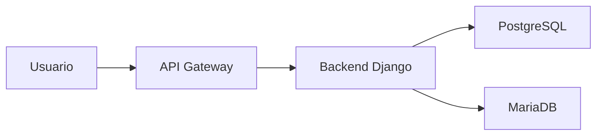
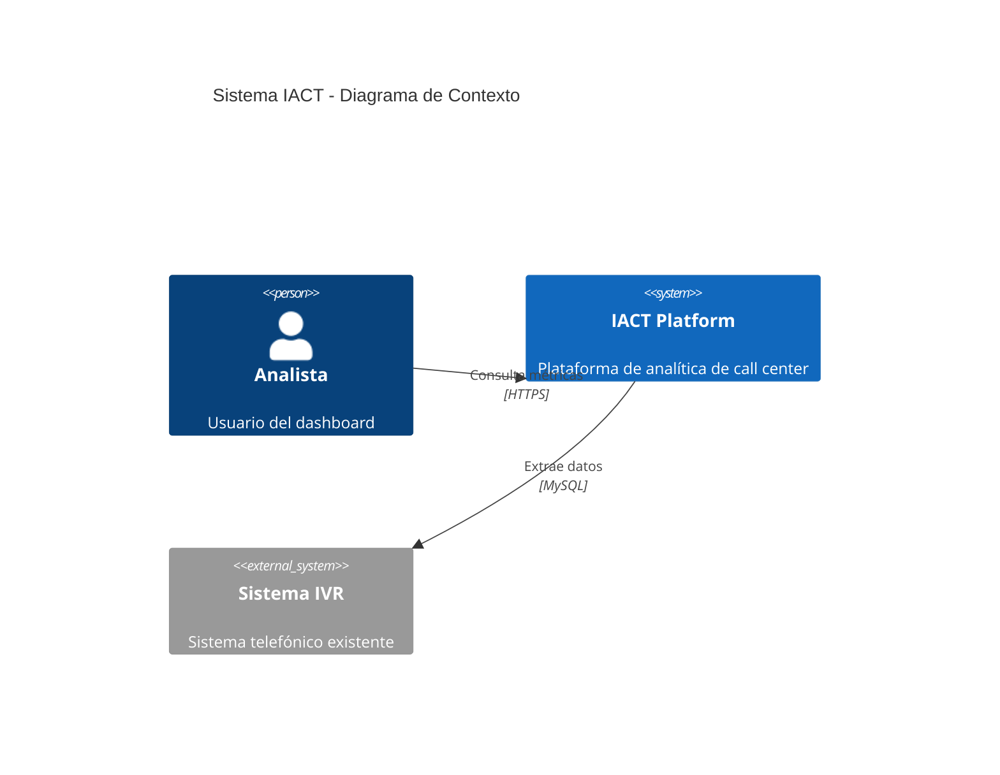
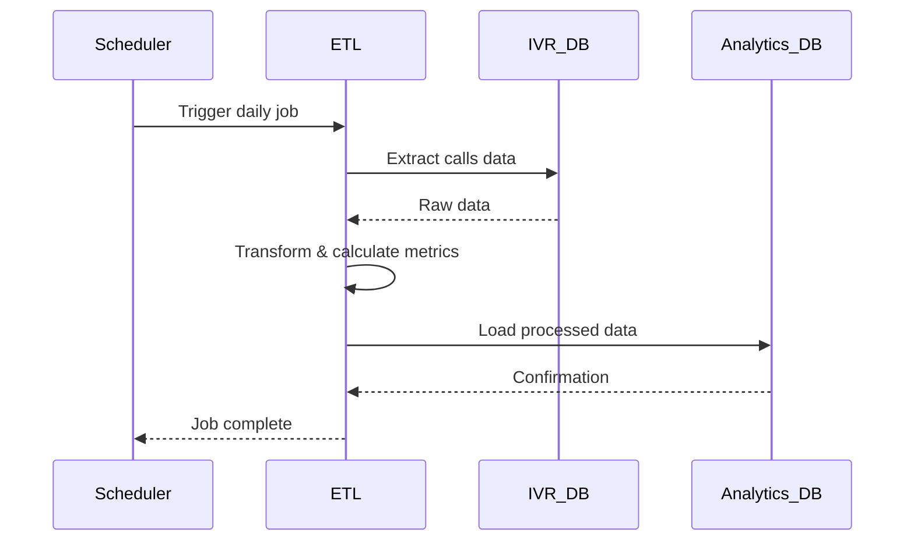

# Diagramas de Referencia

Este espacio almacena diagramas técnicos, arquitectónicos y de proceso del proyecto IACT.

## Página padre
- [Anexos](../readme.md)

## Información clave

### Tipos de Diagramas

**Arquitectura:**
- Diagramas C4 (Context, Container, Component, Code)
- Diagramas de infraestructura
- Topología de red
- Diagramas de deployment

**Procesos:**
- Diagramas de flujo
- Diagramas de secuencia
- Diagramas de actividad
- BPMN (Business Process Model and Notation)

**Datos:**
- Diagramas ER (Entity-Relationship)
- Esquemas de base de datos
- Modelos de datos

**UML:**
- Diagramas de clases
- Diagramas de paquetes
- Diagramas de estados

### Formato Recomendado

**Mermaid (Preferido):**


**Ventajas de Mermaid:**
- OK: Texto plano (versionable en Git)
- OK: Renderiza en GitHub, MkDocs, VS Code
- OK: Fácil de mantener y actualizar
- OK: No requiere herramientas externas

**Otros formatos aceptados:**
- PlantUML (.puml)
- Draw.io (.drawio) - exportar también como SVG
- Imágenes (PNG, SVG) - con fuente editable

### Estructura de Archivos

```
diagramas/
├── arquitectura/
│   ├── c4-context.mmd
│   ├── c4-container.mmd
│   └── infraestructura.mmd
├── procesos/
│   ├── etl-flow.mmd
│   └── deployment-flow.mmd
├── datos/
│   ├── er-analytics.mmd
│   └── er-ivr.mmd
└── uml/
    ├── clases-servicios.mmd
    └── secuencia-etl.mmd
```

### Convenciones de Nombrado

```
{tipo}-{descripcion}.{extension}

Ejemplos:
- c4-context-iact.mmd
- sequence-etl-process.mmd
- er-analytics-database.mmd
- flow-deployment-prod.mmd
```

### Ejemplos

**Diagrama C4 - Context:**


**Diagrama de Secuencia - ETL:**


## Buenas Prácticas

1. **Versionado**: Incluir fecha o versión en el nombre del archivo
2. **Documentación**: Agregar descripción en comentario al inicio
3. **Simplicidad**: Un diagrama por concepto
4. **Actualización**: Marcar diagramas obsoletos claramente
5. **Fuente**: Guardar archivos editables (no solo imágenes)

## Herramientas Recomendadas

- **Mermaid Live Editor**: https://mermaid.live
- **VS Code Extension**: Mermaid Preview
- **PlantUML**: https://plantuml.com
- **Draw.io**: https://app.diagrams.net

---

## Diagramas UML PlantUML Disponibles

### Estructura de Carpetas

```
docs/anexos/diagramas/
├── casos_de_uso/                   # Diagramas de Casos de Uso (UML)
├── secuencia/                      # Diagramas de Secuencia (UML)
├── actividad/                      # Diagramas de Actividad (UML)
└── contexto/                       # Diagramas de Contexto
```

### Catálogo de Diagramas UML

#### Diagramas de Contexto

| Archivo | Descripción | Relacionado |
|---------|-------------|-------------|
| [sistema_iact_contexto.puml](contexto/sistema_iact_contexto.puml) | Vista general del Sistema IACT con actores y sistemas externos | DOC-ARQ-INDEX |

#### Diagramas de Casos de Uso

| ID | Nombre | Archivo | Actor Primario |
|----|--------|---------|----------------|
| UC-001 | Generar Reporte de Métricas | [UC-001_generar_reporte_metricas.puml](casos_de_uso/UC-001_generar_reporte_metricas.puml) | Analista de Negocio |
| UC-002 | Registrar Llamada Entrante | [UC-002_registrar_llamada_entrante.puml](casos_de_uso/UC-002_registrar_llamada_entrante.puml) | Agente de Servicio |
| UC-003 | Consultar Estado de Pedido | [UC-003_consultar_estado_pedido.puml](casos_de_uso/UC-003_consultar_estado_pedido.puml) | Cliente |

#### Diagramas de Secuencia

| ID | Nombre | Archivo | Casos cubiertos |
|----|--------|---------|-----------------|
| UC-001-SEQ | Generar Reporte - Secuencia | [UC-001_generar_reporte_metricas_seq.puml](secuencia/UC-001_generar_reporte_metricas_seq.puml) | Flujo principal + PDF + Email |
| UC-002-SEQ | Registrar Llamada - Secuencia | [UC-002_registrar_llamada_entrante_seq.puml](secuencia/UC-002_registrar_llamada_entrante_seq.puml) | Flujo principal + CRM sync |
| UC-003-SEQ | Consultar Pedido - Secuencia | [UC-003_consultar_estado_pedido_seq.puml](secuencia/UC-003_consultar_estado_pedido_seq.puml) | Flujo principal + Historial + SMS |

#### Diagramas de Actividad

| ID | Nombre | Archivo | Flujos cubiertos |
|----|--------|---------|------------------|
| UC-001-ACT | Generar Reporte - Actividad | [UC-001_generar_reporte_metricas_act.puml](actividad/UC-001_generar_reporte_metricas_act.puml) | Principal + Alternos + Excepciones |
| UC-002-ACT | Registrar Llamada - Actividad | [UC-002_registrar_llamada_entrante_act.puml](actividad/UC-002_registrar_llamada_entrante_act.puml) | Principal + Validaciones + CRM |
| UC-003-ACT | Consultar Pedido - Actividad | [UC-003_consultar_estado_pedido_act.puml](actividad/UC-003_consultar_estado_pedido_act.puml) | Principal + Notificaciones + Errores |

### Convenciones PlantUML

**Nomenclatura de archivos**:
- Casos de Uso: `UC-{número}_{nombre}.puml`
- Secuencia: `UC-{número}_{nombre}_seq.puml`
- Actividad: `UC-{número}_{nombre}_act.puml`
- Contexto: `{sistema}_{tipo}.puml`

**Paleta de colores estándar**:
```plantuml
!define PRIMARY_COLOR #2C3E50
!define SECONDARY_COLOR #3498DB
!define SUCCESS_COLOR #27AE60
!define WARNING_COLOR #F39C12
!define ERROR_COLOR #E74C3C
```

**Renderizado**:
```bash
# Instalar PlantUML
brew install plantuml  # macOS
apt-get install plantuml  # Ubuntu

# Generar SVG
plantuml -tsvg archivo.puml

# Generar PNG
plantuml -tpng archivo.puml
```

**VSCode Extension**:
```bash
code --install-extension jebbs.plantuml
```

---

## Recursos relacionados
- [Guía de Casos de Uso](../../gobernanza/casos_de_uso_guide.md)
- [Arquitectura](../../arquitectura/readme.md)
- [Diseño Detallado](../../diseno_detallado/readme.md)
- [Ejemplos Completos](../ejemplos/readme.md)
