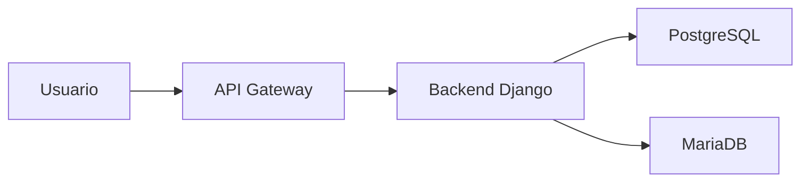
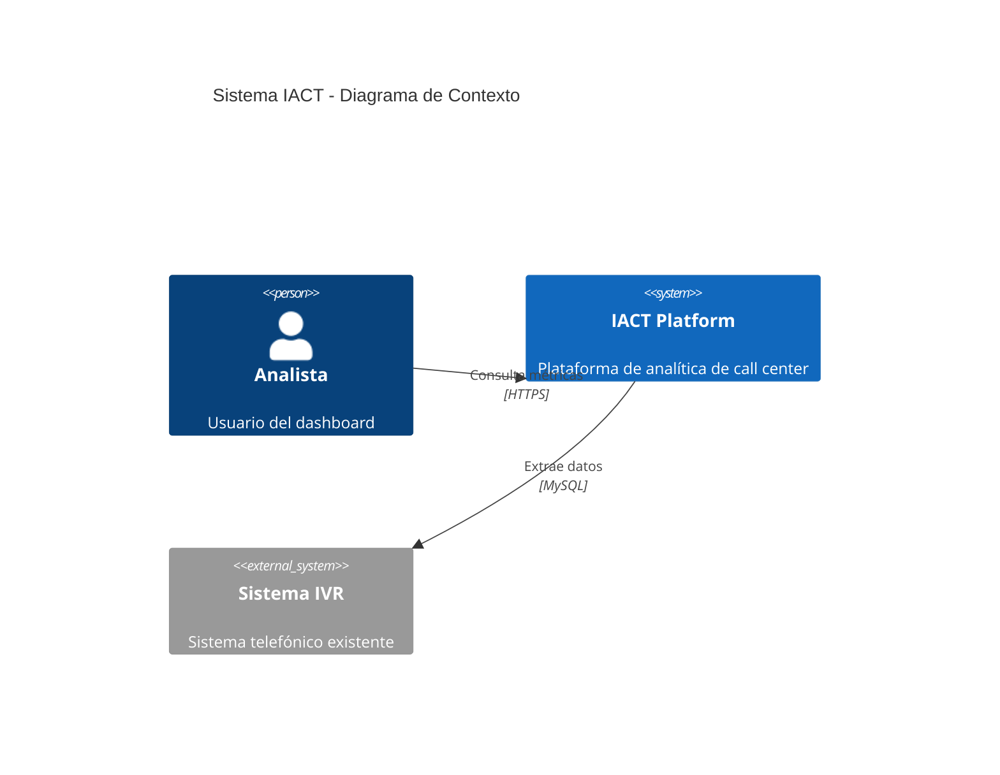
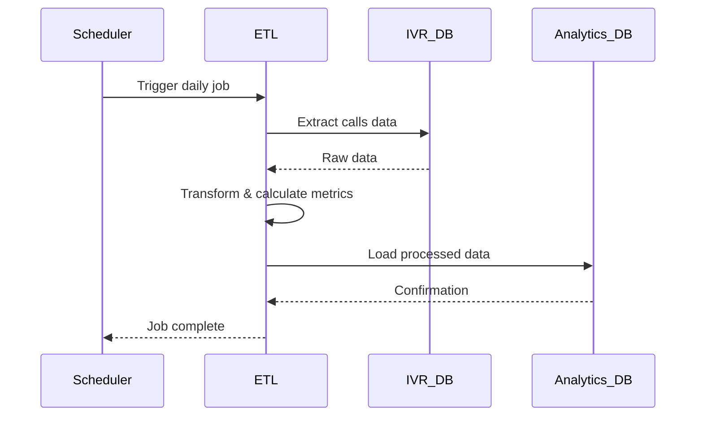

# Diagramas de Referencia

Este espacio almacena diagramas técnicos, arquitectónicos y de proceso del proyecto IACT.

## Página padre
- [Anexos](../readme.md)

## Información clave

### Tipos de Diagramas

**Arquitectura:**
- Diagramas C4 (Context, Container, Component, Code)
- Diagramas de infraestructura
- Topología de red
- Diagramas de deployment

**Procesos:**
- Diagramas de flujo
- Diagramas de secuencia
- Diagramas de actividad
- BPMN (Business Process Model and Notation)

**Datos:**
- Diagramas ER (Entity-Relationship)
- Esquemas de base de datos
- Modelos de datos

**UML:**
- Diagramas de clases
- Diagramas de paquetes
- Diagramas de estados

### Formato Recomendado

**Mermaid (Preferido):**


**Ventajas de Mermaid:**
- ✅ Texto plano (versionable en Git)
- ✅ Renderiza en GitHub, MkDocs, VS Code
- ✅ Fácil de mantener y actualizar
- ✅ No requiere herramientas externas

**Otros formatos aceptados:**
- PlantUML (.puml)
- Draw.io (.drawio) - exportar también como SVG
- Imágenes (PNG, SVG) - con fuente editable

### Estructura de Archivos

```
diagramas/
├── arquitectura/
│   ├── c4-context.mmd
│   ├── c4-container.mmd
│   └── infraestructura.mmd
├── procesos/
│   ├── etl-flow.mmd
│   └── deployment-flow.mmd
├── datos/
│   ├── er-analytics.mmd
│   └── er-ivr.mmd
└── uml/
    ├── clases-servicios.mmd
    └── secuencia-etl.mmd
```

### Convenciones de Nombrado

```
{tipo}-{descripcion}.{extension}

Ejemplos:
- c4-context-iact.mmd
- sequence-etl-process.mmd
- er-analytics-database.mmd
- flow-deployment-prod.mmd
```

### Ejemplos

**Diagrama C4 - Context:**


**Diagrama de Secuencia - ETL:**


## Buenas Prácticas

1. **Versionado**: Incluir fecha o versión en el nombre del archivo
2. **Documentación**: Agregar descripción en comentario al inicio
3. **Simplicidad**: Un diagrama por concepto
4. **Actualización**: Marcar diagramas obsoletos claramente
5. **Fuente**: Guardar archivos editables (no solo imágenes)

## Herramientas Recomendadas

- **Mermaid Live Editor**: https://mermaid.live
- **VS Code Extension**: Mermaid Preview
- **PlantUML**: https://plantuml.com
- **Draw.io**: https://app.diagrams.net

## Recursos relacionados
- [Arquitectura](../../arquitectura/readme.md)
- [Diseño Detallado](../../diseno_detallado/readme.md)
- [Ejemplos Completos](../ejemplos/readme.md)
