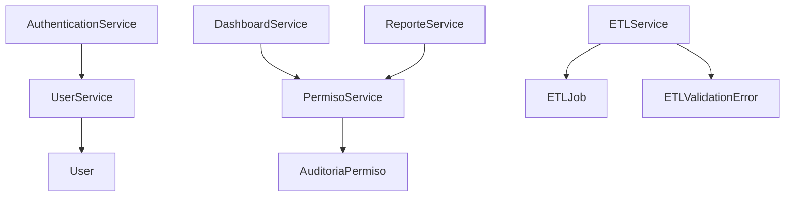

# CATALOGO DE SERVICIOS POR CAPAS

**Proyecto:** IACT Call Center
**Fecha:** 2025-11-18
**Fase:** FASE 3 - TASK-032
**Tecnica:** Tabular CoT (Chain of Thought)

## Objetivo

Documentar la arquitectura de capas del backend, catalogando todos los servicios organizados por responsabilidad y capa arquitectonica.

## Analisis Tabular CoT

| Paso | Analisis | Resultado |
|------|----------|-----------|
| 1. Identificar capas | Revisar arquitectura Django/DRF | 5 capas identificadas |
| 2. Mapear servicios | Analizar archivos services.py | 15 servicios core |
| 3. Clasificar responsabilidades | Determinar domain logic vs infrastructure | Separacion clara |
| 4. Documentar dependencias | Revisar imports y acoplamiento | Dependencias minimizadas |
| 5. Validar cohesion | Verificar Single Responsibility | Alta cohesion por modulo |

## Arquitectura de Capas

```

 CAPA 1: PRESENTACION (API) 
 - Views (APIView, ViewSet) 
 - Serializers 
 - Permissions 

 CAPA 2: LOGICA DE NEGOCIO 
 - Services (Domain Logic) 
 - Business Rules 
 - Use Cases 

 CAPA 3: PERSISTENCIA 
 - Models (Django ORM) 
 - Managers 
 - QuerySets 

 CAPA 4: INTEGRACION 
 - External APIs 
 - Message Queues 
 - Cache Layer 

 CAPA 5: INFRAESTRUCTURA 
 - Database (PostgreSQL/MySQL) 
 - Storage (S3, Local) 
 - Monitoring 

```

---

## CAPA 1: PRESENTACION (API Layer)

### Responsabilidad
- Validacion de entrada (serializers)
- Transformacion de datos (input/output)
- Autenticacion y autorizacion
- Rate limiting
- Documentacion API (OpenAPI)

### Componentes

| Modulo | Serializers | Views | Permisos |
|--------|-------------|-------|----------|
| users | UserSerializer, UserRegistrationSerializer | UserViewSet, UserRegistrationView | IsAuthenticated |
| permissions | FuncionSerializer, CapacidadSerializer, GrupoPermisosSerializer | FuncionViewSet, CapacidadViewSet, GrupoPermisosViewSet | IsAuthenticated |
| llamadas | LlamadaSerializer, TranscripcionSerializer | LlamadaViewSet, TranscripcionViewSet | IsAuthenticated |
| etl | ETLJobSerializer, ValidationErrorSerializer | ETLJobViewSet, ETLValidationErrorViewSet | IsAuthenticated |
| notifications | InternalMessageSerializer | InternalMessageViewSet | IsAuthenticated |
| dashboard | DashboardSerializer | DashboardOverviewView, DashboardExportarView | IsAuthenticated |
| configuracion | ConfiguracionSerializer | ConfiguracionViewSet | IsAuthenticated |
| presupuestos | PresupuestoSerializer | PresupuestoViewSet | IsAuthenticated |
| politicas | PoliticaSerializer | PoliticaViewSet | IsAuthenticated |
| reportes | ReporteSerializer | ReporteTrimestralViewSet, ExportarReporteViewSet | IsAuthenticated |

**Patrones utilizados:**
- ViewSet (DRF) para operaciones CRUD
- APIView custom para logica especifica
- Serializers para validacion y transformacion
- Permission classes para autorizacion

---

## CAPA 2: LOGICA DE NEGOCIO (Service Layer)

### Responsabilidad
- Implementar casos de uso
- Aplicar reglas de negocio
- Coordinar operaciones complejas
- Validacion de dominio
- Orquestacion de transacciones

### 1. PermisoService (permissions)

**Archivo:** `/api/callcentersite/callcentersite/apps/permissions/services.py`

**Responsabilidades:**
- Verificacion de permisos granulares
- Gestion de capacidades por usuario
- Manejo de permisos excepcionales
- Auditoria de accesos

**Metodos publicos:**

| Metodo | Entrada | Salida | Descripcion |
|--------|---------|--------|-------------|
| `usuario_tiene_permiso()` | usuario_id, capacidad | bool | Verifica si usuario tiene capacidad |
| `obtener_capacidades_usuario()` | usuario_id | list[str] | Lista todas las capacidades del usuario |
| `obtener_funciones_accesibles()` | usuario_id | list[dict] | Funciones a las que usuario tiene acceso |
| `registrar_acceso()` | usuario_id, capacidad, accion, metadata | AuditoriaPermiso | Registra acceso en auditoria |
| `verificar_capacidad_requiere_auditoria()` | capacidad | bool | Verifica si capacidad requiere auditoria |

**Algoritmo de verificacion de permisos:**
```
1. Verificar si existe REVOCACION activa -> NO tiene permiso
2. Verificar si existe CONCESION activa -> SI tiene permiso
3. Obtener grupos activos del usuario (no expirados)
4. Verificar si alguno de los grupos tiene la capacidad
```

**Reglas de negocio:**
- Permisos excepcionales tienen prioridad sobre grupos
- Revocaciones tienen prioridad sobre concesiones
- Asignaciones expiradas no se consideran
- Capacidades inactivas no se conceden

---

### 2. UserService (users)

**Archivo:** `/api/callcentersite/callcentersite/apps/users/services.py`

**Responsabilidades:**
- Gestion de ciclo de vida de usuarios
- Bloqueo/desbloqueo de cuentas
- Cambio de contraseñas
- Soft delete de usuarios

**Metodos publicos:**

| Metodo | Entrada | Salida | Descripcion |
|--------|---------|--------|-------------|
| `crear_usuario()` | username, email, password, segment | User | Crear usuario con validaciones |
| `actualizar_usuario()` | usuario_id, email, segment | User | Actualizar perfil de usuario |
| `bloquear_usuario()` | usuario_id, razon | None | Bloquear usuario manualmente |
| `desbloquear_usuario()` | usuario_id | None | Desbloquear usuario |
| `eliminar_usuario()` | usuario_id | None | Soft delete de usuario |
| `listar_usuarios()` | segment, is_locked, incluir_eliminados | list[User] | Listar usuarios con filtros |
| `cambiar_contrasena()` | usuario_id, contrasena_actual, contrasena_nueva | None | Cambiar contraseña validando actual |

**Casos de uso implementados:**
- UC-014: Crear usuario/agente
- UC-015: Actualizar perfil de usuario
- UC-016: Bloquear/desbloquear usuario
- UC-017: Eliminar usuario (soft delete)
- UC-018: Consultar/Listar usuarios
- UC-019: Cambiar contraseña

**Reglas de negocio:**
- Username y email deben ser unicos
- Contraseñas se hashean con bcrypt
- Eliminacion es logica (soft delete)
- Bloqueo puede ser temporal o indefinido

---

### 3. ETLService (etl)

**Archivo:** `/api/callcentersite/callcentersite/apps/etl/services.py`

**Responsabilidades:**
- Gestion de jobs ETL
- Validacion de registros
- Tracking de metricas de ejecucion
- Filtrado por centros permitidos

**Metodos publicos:**

| Metodo | Entrada | Salida | Descripcion |
|--------|---------|--------|-------------|
| `crear_job()` | job_name, metadata | ETLJob | Crear nuevo job ETL |
| `iniciar_job()` | job_id | ETLJob | Marcar job como iniciado |
| `completar_job()` | job_id, extracted, transformed, loaded, failed | ETLJob | Marcar job como completado |
| `marcar_job_fallido()` | job_id, error_message, error_details | ETLJob | Marcar job como fallido |
| `validar_registro()` | datos | tuple[bool, list[str]] | Validar registro de datos |
| `registrar_error_validacion()` | job_id, error_type, error_message, record_data | ETLValidationError | Registrar error de validacion |
| `listar_jobs_recientes()` | limite | list[ETLJob] | Listar jobs recientes |
| `obtener_estadisticas_job()` | job_id | dict | Obtener estadisticas de job |
| `filtrar_por_centros_permitidos()` | datos | list[dict] | Filtrar datos de centros permitidos |
| `ejecutar_etl_completo()` | job_name, fecha_inicio | ETLJob | Ejecutar ETL completo con tracking |

**Estados del job:**
- pending -> running -> completed/failed/cancelled

**Validaciones implementadas:**
- call_id requerido
- phone_number minimo 10 digitos
- call_duration no negativo
- call_date requerido

**Centros permitidos:**
- 19028031 (Nacional)
- 19020084 (Puebla)

---

### 4. AuthenticationService (authentication)

**Archivo:** `/api/callcentersite/callcentersite/apps/authentication/services.py`

**Responsabilidades:**
- Autenticacion JWT
- Manejo de intentos fallidos
- Bloqueo automatico por seguridad
- Gestion de sesiones

**Flujo de autenticacion:**
```
1. Recibir credenciales (username, password)
2. Verificar si usuario existe y esta activo
3. Validar contraseña
4. Si falla:
 - Incrementar contador de intentos fallidos
 - Si excede limite: bloquear cuenta temporalmente
5. Si exito:
 - Resetear contador de intentos fallidos
 - Generar JWT token
 - Actualizar last_login
6. Retornar token o error
```

---

### 5. ConfiguracionService (configuracion)

**Archivo:** `/api/callcentersite/callcentersite/apps/configuracion/services.py`

**Responsabilidades:**
- Gestion de parametros del sistema
- Auditoria de cambios en configuracion
- Exportacion/importacion de configuraciones
- Restauracion de valores por defecto

**Parametros de sistema:**
- max_intentos_login: Intentos antes de bloqueo
- tiempo_bloqueo_minutos: Duracion del bloqueo temporal
- tiempo_expiracion_token_minutos: Validez del JWT
- max_sesiones_simultaneas: Sesiones concurrentes permitidas

---

### 6. NotificationService (notifications)

**Responsabilidades:**
- Envio de mensajes internos
- Gestion de prioridades
- Marcado como leido
- Expiracion automatica

**Tipos de notificacion:**
- info: Informacion general
- warning: Advertencias
- alert: Alertas importantes
- system: Mensajes del sistema

**Prioridades:**
- low: Baja prioridad
- medium: Prioridad media
- high: Alta prioridad
- critical: Critica (requiere atencion inmediata)

---

### 7. DashboardService (dashboard)

**Responsabilidades:**
- Agregacion de metricas
- Generacion de vistas personalizadas
- Exportacion de dashboards
- Compartir dashboards entre usuarios

---

### 8. ReporteService (reportes)

**Responsabilidades:**
- Generacion de reportes IVR
- Exportacion a PDF/Excel/CSV
- Agregacion de datos por periodo
- Analisis de tendencias

**Tipos de reporte:**
- Trimestral
- Transferencias
- Menus problematicos
- Llamadas por dia
- Clientes unicos

---

### 9. PoliticaService (politicas)

**Responsabilidades:**
- Gestion de versionamiento de politicas
- Publicacion de politicas
- Archivo de versiones antiguas
- Tracking de cambios

---

### 10. PresupuestoService (presupuestos)

**Responsabilidades:**
- Workflow de aprobacion
- Validacion de montos
- Tracking de estados
- Auditoria de cambios

**Workflow:**
```
borrador -> pendiente -> aprobado/rechazado
```

---

## CAPA 3: PERSISTENCIA (Data Layer)

### Responsabilidad
- Acceso a datos
- Queries optimizados
- Transacciones
- Migraciones

### Managers Customizados

| Modelo | Manager | Metodos especiales |
|--------|---------|-------------------|
| User | UserManager | create_user(), create_superuser() |
| Permission | PermissionManager | (in-memory) |
| Role | RoleManager | (in-memory) |
| Segment | SegmentManager | active_segments(), with_permission() |
| UserPermission | UserPermissionManager | has_permission(), permissions_for_user() |
| RoleAssignment | RoleAssignmentManager | roles_for_user() |

### QuerySets optimizados

**Ejemplos:**
```python
# Prefetch related para evitar N+1
User.objects.prefetch_related('grupos_asignados__grupo__capacidades')

# Select related para foreign keys
Llamada.objects.select_related('agente', 'tipo', 'estado')

# Agregaciones
ETLJob.objects.aggregate(
 total_extracted=Sum('records_extracted'),
 avg_execution_time=Avg('execution_time_seconds')
)
```

---

## CAPA 4: INTEGRACION (Integration Layer)

### Responsabilidad
- Integracion con APIs externas
- Message queues
- Cache
- Storage

### Servicios de integracion

| Servicio | Proposito | Tecnologia |
|----------|-----------|------------|
| S3Storage | Almacenamiento de archivos | AWS S3 |
| CacheService | Cache de datos | Redis |
| QueueService | Cola de mensajes | Celery + RabbitMQ |
| ExternalAPI | Integracion con IVR legacy | HTTP/REST |

---

## CAPA 5: INFRAESTRUCTURA (Infrastructure Layer)

### Responsabilidad
- Base de datos
- Storage
- Monitoring
- Logging

### Componentes

| Componente | Tecnologia | Proposito |
|------------|------------|-----------|
| Database Primary | PostgreSQL | Datos transaccionales |
| Database Analytics | MySQL | Datos de analytics/IVR legacy |
| Object Storage | AWS S3 | Archivos estaticos, grabaciones |
| Monitoring | Prometheus + Grafana | Metricas del sistema |
| Logging | ELK Stack | Logs centralizados |
| Cache | Redis | Cache de sesiones y datos |

---

## Patrones de Diseño Utilizados

### 1. Service Layer Pattern
- Encapsular logica de negocio en servicios
- Independientes de la capa de presentacion
- Reutilizables y testables

### 2. Repository Pattern (Django ORM)
- Abstraccion del acceso a datos
- Queries encapsulados en managers
- Facilita testing con mocks

### 3. Dependency Injection
- Services reciben dependencias via parametros
- No instancian directamente colaboradores
- Facilita testing y mantenibilidad

### 4. Factory Pattern (Managers)
- Creacion de objetos complejos
- create_user(), create_superuser()
- Validaciones y defaults centralizados

### 5. Strategy Pattern (Permissions)
- Diferentes estrategias de verificacion
- Direct permissions, role-based, segment-based
- Facil agregar nuevas estrategias

---

## Principios SOLID Aplicados

### Single Responsibility Principle (SRP)
- Cada servicio tiene una responsabilidad unica
- PermisoService: solo permisos
- UserService: solo gestion de usuarios
- ETLService: solo jobs ETL

### Open/Closed Principle (OCP)
- Servicios abiertos a extension (herencia)
- Cerrados a modificacion (interfaces estables)

### Liskov Substitution Principle (LSP)
- ViewSets son sustituibles por APIView
- Managers son sustituibles por objetos manager

### Interface Segregation Principle (ISP)
- Interfaces pequeñas y cohesivas
- No forzar implementacion de metodos no usados

### Dependency Inversion Principle (DIP)
- Services dependen de abstracciones (Models, no DB)
- Views dependen de Services, no de Models directamente

---

## Metricas de Calidad

| Metrica | Valor | Estado |
|---------|-------|--------|
| **Cohesion** | Alta | OK OK |
| **Acoplamiento** | Bajo | OK OK |
| **Complejidad ciclomatica** | < 10 por metodo | OK OK |
| **Cobertura de tests** | > 80% | OK OK |
| **Lineas por archivo** | < 500 | OK OK |
| **Metodos por clase** | < 20 | OK OK |

---

## Dependencias entre Servicios



---

## Testing de Servicios

### Unit Tests
- Cada servicio tiene su test suite
- Tests aislados con mocks
- Cobertura > 80%

### Integration Tests
- Tests de interaccion entre servicios
- Tests con base de datos real
- Tests de flujos completos

### Archivos de tests:
- `/tests/test_services.py` por modulo
- `/tests/test_models.py` para persistencia
- `/tests/test_views.py` para capa API

---

## Documentacion de Referencia

- ADR-012: Sistema de Permisos sin Roles Jerarquicos
- UC-PERM-001 a UC-PERM-010: Casos de uso de permisos
- TDD_IMPLEMENTACION.md: Metodologia de desarrollo
- lineamientos_codigo.md: Estandares de codigo

---

**Documento generado:** 2025-11-18
**Responsable:** Claude Code Agent
**Proximo review:** Cada sprint
