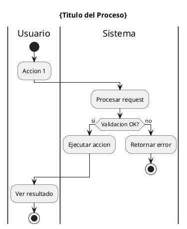

# Diagramas de Actividad

**Tipo:** Diagramas de actividad UML
**Notacion:** UML 2.0 Activity Diagrams
**Herramientas:** PlantUML, Draw.io

---

## Proposito

Diagramas que muestran el flujo de control y datos a traves de actividades/procesos.

**Uso tipico:**
- Flujos de trabajo (workflows)
- Procesos de negocio
- Algoritmos complejos
- Decision flows

---

## Convenciones

**Nombres:**
```
workflow_{proceso}_{version}.puml
```

**Ejemplos:**
- `workflow_aprobacion_politica_v1.puml`
- `workflow_escalacion_alerta_v2.puml`
- `process_onboarding_agente_v1.puml`

---

## Elementos

- **Inicio/Fin:** Circulos negros
- **Actividad:** Rectangulos redondeados
- **Decision:** Diamantes
- **Fork/Join:** Barras horizontales
- **Swimlanes:** Carriles por rol/sistema

---

## Template PlantUML



---

## Procesos Principales

- [ ] Workflow aprobacion de politicas
- [ ] Proceso escalacion de alertas
- [ ] Calculo de metricas mensuales
- [ ] Onboarding de agente
- [ ] Cierre de turno

---

**Ultima actualizacion:** 2025-11-16
