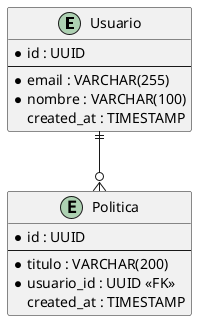

# Diagramas de Base de Datos

**Tipo:** Diagramas ER (Entity-Relationship) y esquemas
**Notacion:** Crow's Foot, UML Class Diagrams
**Herramientas:** PlantUML, dbdiagram.io, ERD tools

---

## Proposito

Diagramas que muestran el modelo de datos, relaciones entre entidades, y esquema de base de datos.

---

## Tipos de Diagramas

### ER Diagrams (Conceptual)

**Archivo:** `{dominio}_er_diagram_v{N}.puml`

**Muestra:**
- Entidades principales
- Relaciones (1:1, 1:N, N:M)
- Atributos clave

### Schema Diagrams (Logical)

**Archivo:** `{schema}_schema_v{N}.sql`

**Muestra:**
- Tablas
- Columnas y tipos
- Primary keys
- Foreign keys
- Indices

### Physical Model

**Archivo:** `physical_model_v{N}.puml`

**Muestra:**
- Partitioning strategy
- Sharding keys
- Replication setup

---

## Bases de Datos del Proyecto

### PostgreSQL (Transaccional)

**Schemas:**
- `auth` - Autenticacion y usuarios
- `core` - Entidades principales
- `metrics` - Metricas y reportes
- `audit` - Auditoria

### Cassandra (Analitica)

**Keyspaces:**
- `events` - Eventos del sistema
- `timeseries` - Datos de series temporales
- `analytics` - Datos analiticos

---

## Convenciones

**Nombres de entidades:** PascalCase
**Nombres de tablas:** snake_case
**Foreign keys:** `{tabla_ref}_id`

---

## Template PlantUML ER

---

## Diagramas Principales

- [ ] ER Diagram completo
- [ ] Schema: auth
- [ ] Schema: core
- [ ] Schema: metrics
- [ ] Cassandra keyspaces

---

**Ultima actualizacion:** 2025-11-16
