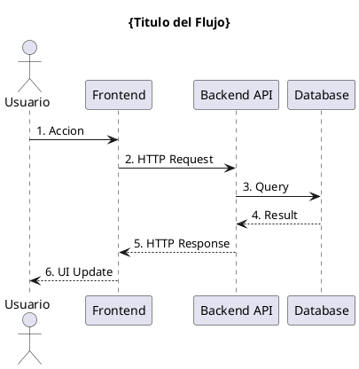

# Diagramas de Secuencia

**Tipo:** Diagramas de secuencia UML
**Notacion:** UML 2.0 Sequence Diagrams
**Herramientas:** PlantUML, Mermaid

---

## Proposito

Diagramas que muestran la interaccion entre objetos/componentes a lo largo del tiempo.

**Uso tipico:**
- Flujos de autenticacion
- Procesamiento de requests API
- Interaccion entre microservicios
- Flujos de integracion

---

## Convenciones

**Estructura:**
```
{dominio}_{caso_de_uso}_{version}.puml
```

**Ejemplos:**
- `auth_login_flow_v1.puml`
- `api_dora_metrics_calculation_v2.puml`
- `integration_crm_sync_v1.puml`

---

## Componentes

**Actores:**
- Usuario
- Sistema IACT
- Sistemas externos

**Objetos:**
- Frontend components
- Backend controllers
- Services
- Database
- External APIs

---

## Template PlantUML



---

## Diagramas Principales

- [ ] Autenticacion y login
- [ ] Creacion de politica
- [ ] Calculo de metricas DORA
- [ ] Sincronizacion CRM
- [ ] Generacion de alertas

---

## Referencias

- [UML Sequence Diagrams](https://www.uml.org/)
- [PlantUML Sequence](https://plantuml.com/sequence-diagram)
- [Casos de Uso](../casos_de_uso/)

**Ultima actualizacion:** 2025-11-16
