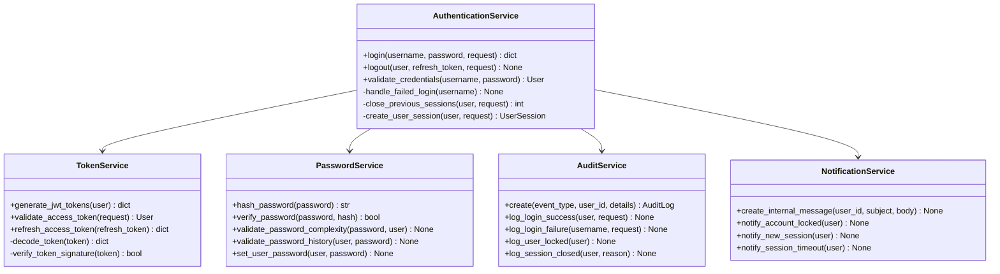

# Diseño Técnico: Sistema de Autenticación y Sesiones

**Versión:** 1.0
**Fecha:** 2025-11-04
**Componente:** Autenticación y Sesiones (Componente 1)
**Estado:** En Diseño

---

## NOTA Tabla de Contenidos

1. [Arquitectura General](#1-arquitectura-general)
2. [Diagramas de Secuencia](#2-diagramas-de-secuencia)
3. [Diagramas de Flujo](#3-diagramas-de-flujo)
4. [Diagramas de Estados](#4-diagramas-de-estados)
5. [Modelo de Datos](#5-modelo-de-datos)
6. [Arquitectura de Componentes](#6-arquitectura-de-componentes)

---

## 1. Arquitectura General

### 1.1 Vista de Alto Nivel


### 1.2 Capas de la Aplicación


---

## 2. Diagramas de Secuencia

### 2.1 RF-005: Login con Credenciales Locales


### 2.2 RF-006: Validación de Access Token


### 2.3 RF-006: Refresh de Access Token


### 2.4 RF-007: Logout Manual


### 2.5 RF-008: Cierre Automático por Inactividad


### 2.6 RF-009: Gestión de Intentos Fallidos y Bloqueo


---

## 3. Diagramas de Flujo

### 3.1 Flujo de Decisión: Login


### 3.2 Flujo de Decisión: Validación de Token


### 3.3 Flujo de Decisión: Refresh Token


### 3.4 Flujo de Decisión: Validación de Complejidad de Password


---

## 4. Diagramas de Estados

### 4.1 Estados de Usuario


### 4.2 Estados de Sesión


### 4.3 Estados de Refresh Token


### 4.4 Ciclo de Vida de Password


---

## 5. Modelo de Datos

### 5.1 Diagrama Entidad-Relación (ER)

```mermaid
erDiagram
 USER ||--o{ USER_SESSION : "tiene"
 USER ||--o{ PASSWORD_HISTORY : "tiene"
 USER ||--o{ AUDIT_LOG : "genera"
 USER ||--o{ INTERNAL_MESSAGE : "recibe"
 USER ||--o{ OUTSTANDING_TOKEN : "posee"
 OUTSTANDING_TOKEN ||--o| BLACKLISTED_TOKEN : "puede estar en"

 USER {
 int user_id PK
 string username UK
 string email UK
 string password_hash
 datetime password_changed_at
 string status
 string segment
 int failed_login_attempts
 datetime last_failed_login_at
 boolean is_locked
 datetime locked_until
 string lock_reason
 datetime last_login_at
 datetime created_at
 datetime updated_at
 datetime deleted_at
 }

 USER_SESSION {
 int session_id PK
 int user_id FK
 string session_key UK
 string user_agent
 boolean is_active
 datetime created_at
 datetime last_activity_at
 datetime logged_out_at
 string logout_reason
 }

 PASSWORD_HISTORY {
 int id PK
 int user_id FK
 string password_hash
 datetime created_at
 }

 AUDIT_LOG {
 int id PK
 string event_type
 int user_id FK "nullable"
 int performed_by FK "nullable"
 string user_agent
 json details
 string result
 datetime created_at
 }

 INTERNAL_MESSAGE {
 int id PK
 int user_id FK
 string subject
 text body
 string severity
 boolean read
 boolean created_by_system
 datetime created_at
 }

 OUTSTANDING_TOKEN {
 int id PK
 int user_id FK
 string jti UK
 text token
 datetime created_at
 datetime expires_at
 }

 BLACKLISTED_TOKEN {
 int id PK
 int token_id FK UK
 datetime blacklisted_at
 }
```

### 5.2 Índices y Constraints

```sql
-- USER
CREATE UNIQUE INDEX idx_users_username ON users(username) WHERE deleted_at IS NULL;
CREATE UNIQUE INDEX idx_users_email ON users(email) WHERE deleted_at IS NULL;
CREATE INDEX idx_users_status ON users(status);
CREATE INDEX idx_users_is_locked ON users(is_locked);

-- USER_SESSION
CREATE UNIQUE INDEX idx_user_sessions_session_key ON user_sessions(session_key);
CREATE INDEX idx_user_sessions_user_active ON user_sessions(user_id, is_active);
CREATE INDEX idx_user_sessions_last_activity ON user_sessions(last_activity_at)
 WHERE is_active = TRUE;

-- PASSWORD_HISTORY
CREATE INDEX idx_password_history_user_created ON password_history(user_id, created_at DESC);

-- AUDIT_LOG
CREATE INDEX idx_audit_logs_event_type ON audit_logs(event_type);
CREATE INDEX idx_audit_logs_user_created ON audit_logs(user_id, created_at DESC);
CREATE INDEX idx_audit_logs_created_at ON audit_logs(created_at DESC);

-- OUTSTANDING_TOKEN
CREATE UNIQUE INDEX idx_outstanding_token_jti ON token_blacklist_outstandingtoken(jti);
CREATE INDEX idx_outstanding_token_user ON token_blacklist_outstandingtoken(user_id);
CREATE INDEX idx_outstanding_token_expires ON token_blacklist_outstandingtoken(expires_at);

-- BLACKLISTED_TOKEN
CREATE UNIQUE INDEX idx_blacklisted_token_token_id
 ON token_blacklist_blacklistedtoken(token_id);
```

---

## 6. Arquitectura de Componentes

### 6.1 Estructura de Módulos


### 6.2 Dependencias entre Módulos


### 6.3 Capa de Servicios (Services Layer)



---

## 7. Configuración y Parámetros

### 7.1 Variables de Configuración (settings.py)

```python
# JWT Configuration
SIMPLE_JWT = {
 'ACCESS_TOKEN_LIFETIME': timedelta(minutes=15), # EXACTO
 'REFRESH_TOKEN_LIFETIME': timedelta(days=7), # EXACTO
 'ROTATE_REFRESH_TOKENS': True, # OBLIGATORIO
 'BLACKLIST_AFTER_ROTATION': True, # OBLIGATORIO
 'ALGORITHM': 'HS256', # OBLIGATORIO
 'SIGNING_KEY': SECRET_KEY, # Desde env
}

# Session Configuration
SESSION_ENGINE = 'django.contrib.sessions.backends.db' # PostgreSQL
SESSION_COOKIE_AGE = 1800 # 30 minutos
SESSION_SAVE_EVERY_REQUEST = True

# Password Configuration
PASSWORD_HASHERS = ['django.contrib.auth.hashers.BCryptSHA256PasswordHasher']
BCRYPT_COST_FACTOR = 12 # OBLIGATORIO

# Rate Limiting
THROTTLE_RATES = {
 'login': '5/5min', # 5 intentos cada 5 minutos
 'refresh': '10/min',
}

# APScheduler
SCHEDULER_CONFIG = {
 'apscheduler.jobstores.default': {
 'type': 'sqlalchemy',
 'url': 'postgresql://...'
 },
 'apscheduler.executors.default': {
 'class': 'apscheduler.executors.pool:ThreadPoolExecutor',
 'max_workers': '3'
 }
}
```

### 7.2 Parámetros de Seguridad

| Parámetro | Valor | Justificación |
|-----------|-------|---------------|
| **Access Token Lifetime** | 15 minutos | Balance seguridad/UX |
| **Refresh Token Lifetime** | 7 días | Evitar re-login frecuente |
| **bcrypt Cost Factor** | 12 | Resistente a ataques, ~400ms |
| **Max Failed Attempts** | 3 | Prevenir fuerza bruta |
| **Lock Duration** | 15 minutos | Balancear seguridad/UX |
| **Session Inactivity** | 30 minutos | Cerrar sesiones abandonadas |
| **Password Min Length** | 8 caracteres | Estándar NIST |
| **Password Max Length** | 100 caracteres | Prevenir DoS |
| **Password History** | 5 últimas | Prevenir reutilización |

---

## 8. Métricas y Monitoreo

### 8.1 Métricas Clave

```mermaid
graph LR
 subgraph "Métricas de Autenticación"
 M1[Login Success Rate]
 M2[Login Failure Rate]
 M3[Account Lockout Rate]
 M4[Token Refresh Rate]
 end

 subgraph "Métricas de Performance"
 P1[Login Response Time]
 P2[Token Validation Time]
 P3[Password Hash Time]
 end

 subgraph "Métricas de Sesiones"
 S1[Active Sessions]
 S2[Session Timeout Rate]
 S3[Concurrent Sessions/User]
 end

 subgraph "Métricas de Seguridad"
 SE1[Failed Login Attempts]
 SE2[Locked Accounts]
 SE3[Token Blacklist Size]
 end
```

### 8.2 Alertas Recomendadas

| Alerta | Condición | Acción |
|--------|-----------|--------|
| **High Login Failure Rate** | > 30% en 5 min | Revisar logs, posible ataque |
| **Mass Account Lockouts** | > 10 cuentas bloqueadas en 1 min | Investigar posible ataque distribuido |
| **Slow Login Performance** | p95 > 1 segundo | Revisar carga de BD, bcrypt |
| **Token Validation Failures** | > 100/min | Verificar SECRET_KEY, tokens |
| **Inactive Session Buildup** | > 1000 sesiones inactivas | Verificar job de limpieza |

---

## Control de Cambios

| Versión | Fecha | Autor | Cambios |
|---------|-------|-------|---------|
| 1.0 | 2025-11-04 | claude | Creación inicial del diseño técnico completo |

---

**Última actualización:** 2025-11-04
**Próxima revisión:** Antes de FASE 3 (Implementación)
