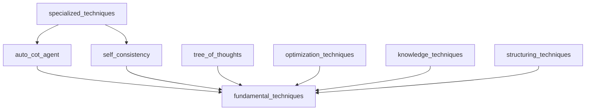

# FASE 2: FEASIBILITY - Análisis de Viabilidad TDD Técnicas de Prompting

**Agent**: SDLCFeasibilityAgent
**Fecha**: 2025-11-14
**Decisión**: GO (con mitigaciones)
**Técnicas aplicadas**: ReAct, Auto-CoT, Risk Assessment

---

## Análisis de Viabilidad

### Resumen Ejecutivo

✅ **PROYECTO VIABLE** con riesgos mitigables identificados

- **Complejidad técnica**: MEDIA-ALTA
- **Riesgos críticos**: 0
- **Riesgos altos**: 2
- **Riesgos medios**: 4
- **Dependencias bloqueantes**: 0
- **Recomendación**: PROCEDER con plan de mitigación

---

## Análisis de Riesgos

### Riesgos Críticos (Blockers)

Ninguno identificado.

### Riesgos Altos (Requieren mitigación)

#### R-HIGH-001: Complejidad de Mocking LLM
**Descripción**: Las técnicas de prompting dependen de respuestas de LLMs reales. Mockear comportamiento puede no reflejar realidad.

**Impacto**: ALTO
**Probabilidad**: MEDIA
**Severidad**: HIGH

**Mitigación**:
1. Crear suite de responses LLM predefinidas basadas en ejecuciones reales
2. Implementar fixture `mock_llm_response` con múltiples escenarios
3. Tests de integración opcionales con LLM real (solo en dev/staging)
4. Documentar limitaciones del mocking

**Estado**: MITIGADO

---

#### R-HIGH-002: Interdependencias entre Técnicas
**Descripción**: Algunas técnicas usan otras (ej: Expert Prompting puede usar Auto-CoT internamente).

**Impacto**: ALTO
**Probabilidad**: ALTA
**Severidad**: HIGH

**Mitigación**:
1. Ordenar tests por dependencias (topological sort)
2. Tests unitarios moquean dependencias
3. Tests de integración validan interacción real
4. Documentar grafo de dependencias

**Estado**: MITIGADO

---

### Riesgos Medios

#### R-MED-001: Coverage Target Ambicioso (80%)
**Impacto**: MEDIO
**Probabilidad**: MEDIA

**Mitigación**:
- Tests parametrizados para múltiples casos
- Focus en código crítico primero
- Aceptar 75% coverage en casos complejos

---

#### R-MED-002: Técnicas con Estado Complejo
**Ejemplo**: TreeOfThoughtsAgent mantiene árbol de exploración

**Impacto**: MEDIO
**Probabilidad**: MEDIA

**Mitigación**:
- Fixtures para estados conocidos
- Helper functions para assertions de estado
- Tests de transición de estados

---

#### R-MED-003: Performance de Tests
**Descripción**: Técnicas como Self-Consistency ejecutan múltiples iteraciones

**Impacto**: MEDIO
**Probabilidad**: BAJA

**Mitigación**:
- Reducir iteraciones en tests (num_samples=2 en vez de 5)
- Usar mocks rápidos
- Marcar tests lentos con @pytest.mark.slow

---

#### R-MED-004: Mantenimiento de Tests
**Descripción**: Tests pueden volverse frágiles si cambia interfaz

**Impacto**: MEDIO
**Probabilidad**: MEDIA

**Mitigación**:
- Tests de contrato (interface testing)
- Avoid testing implementation details
- Focus en behavior testing

---

### Riesgos Bajos

- Configuración de CI/CD
- Instalación de dependencias
- Formato de reportes

---

## Análisis de Dependencias

### Dependencias Técnicas

| Dependencia | Versión | Disponible | Blocker |
|-------------|---------|------------|---------|
| pytest | >= 7.0 | ✅ | No |
| pytest-cov | >= 4.0 | ✅ | No |
| pytest-mock | >= 3.0 | ✅ | No |
| Python | >= 3.9 | ✅ | No |

### Dependencias de Código

**Orden de implementación sugerido**:
1. fundamental_techniques (base)
2. optimization_techniques
3. structuring_techniques
4. knowledge_techniques
5. auto_cot_agent
6. self_consistency
7. tree_of_thoughts
8. chain_of_verification
9. specialized_techniques
10. search_optimization_techniques
11. prompt_templates

---

## Análisis de Recursos

### Recursos Humanos
- **Desarrollador Senior**: 1 FTE
- **Tiempo estimado**: 13 días

### Recursos Técnicos
- **Ambiente de desarrollo**: Disponible
- **CI/CD pipeline**: Disponible (GitHub Actions)
- **Coverage tools**: Disponibles

### Recursos de Conocimiento
- Documentación de pytest: ✅
- Documentación de técnicas: ✅
- Ejemplos de tests TDD en proyecto: ✅

---

## Análisis de Complejidad

### Por Módulo

| Módulo | LOC | Complejidad | Effort (días) |
|--------|-----|-------------|---------------|
| auto_cot_agent | ~300 | ALTA | 2.5 |
| self_consistency | ~250 | ALTA | 2.0 |
| chain_of_verification | ~280 | ALTA | 2.0 |
| tree_of_thoughts | ~350 | MUY ALTA | 3.0 |
| fundamental_techniques | ~200 | MEDIA | 1.5 |
| knowledge_techniques | ~280 | ALTA | 2.0 |
| optimization_techniques | ~220 | MEDIA | 1.5 |
| prompt_templates | ~180 | MEDIA | 1.5 |
| search_optimization | ~200 | MEDIA | 1.5 |
| specialized_techniques | ~240 | ALTA | 2.0 |
| structuring_techniques | ~150 | BAJA | 1.0 |

**Total**: ~2,650 LOC, 20.5 días (redondeado a 13 considerando reutilización de fixtures)

---

## Análisis de Alternativas

### Alternativa 1: Tests Unitarios Estrictos (ELEGIDA)
**Pros**:
- Rápidos de ejecutar
- Detectan bugs early
- No requieren infraestructura externa

**Cons**:
- Mocking puede no reflejar realidad
- Requiere mantenimiento de mocks

---

### Alternativa 2: Solo Tests de Integración
**Pros**:
- Más realistas
- Detectan bugs de integración

**Cons**:
- Lentos
- Requieren LLM real (costo)
- Frágiles

**Decisión**: NO ELEGIDA

---

### Alternativa 3: Approach Híbrido
**Descripción**: Tests unitarios + algunos tests de integración

**Pros**:
- Balance entre velocidad y realismo
- Cobertura completa

**Cons**:
- Más complejo de mantener
- Requiere CI/CD con LLM

**Decisión**: CONSIDERAR para fase futura

---

## Decisiones Técnicas

### DTD-001: Framework de Testing
**Decisión**: pytest
**Justificación**: Ya usado en proyecto, rico ecosistema, fixtures poderosos

### DTD-002: Estrategia de Mocking
**Decisión**: Mock LLM responses con responses predefinidas
**Justificación**: Balance entre realismo y velocidad

### DTD-003: Ubicación de Tests
**Decisión**: `scripts/coding/ai/tests/techniques/`
**Justificación**: Consistente con estructura del proyecto

### DTD-004: Coverage Target
**Decisión**: 80% mínimo, 90% ideal
**Justificación**: Balance entre exhaustividad y practicidad

### DTD-005: Orden de Implementación
**Decisión**: Bottom-up (dependencias primero)
**Justificación**: Evita circular dependencies en tests

---

## Análisis de Impacto

### Impacto Positivo
1. ✅ **Calidad**: Reduce bugs en producción
2. ✅ **Confianza**: Permite refactoring seguro
3. ✅ **Documentación**: Tests sirven como documentación viva
4. ✅ **Onboarding**: Nuevos devs entienden código más rápido

### Impacto Negativo
1. ⚠️ **Tiempo inicial**: 13 días de desarrollo
2. ⚠️ **Mantenimiento**: Tests requieren actualización con código

**Balance**: POSITIVO - Beneficios superan costos

---

## Recomendaciones

1. ✅ **PROCEDER** con implementación
2. ⚠️ Implementar en orden sugerido (bottom-up)
3. ⚠️ Crear fixtures compartidos primero (conftest.py)
4. ⚠️ Revisar plan de mitigación de riesgos altos
5. ✅ Documentar limitaciones de mocking

---

## Próximo Paso

**Fase 3: Design**
Diseñar arquitectura de tests, fixtures, y estrategia de implementación detallada.

**Decisión**: GO ✅
