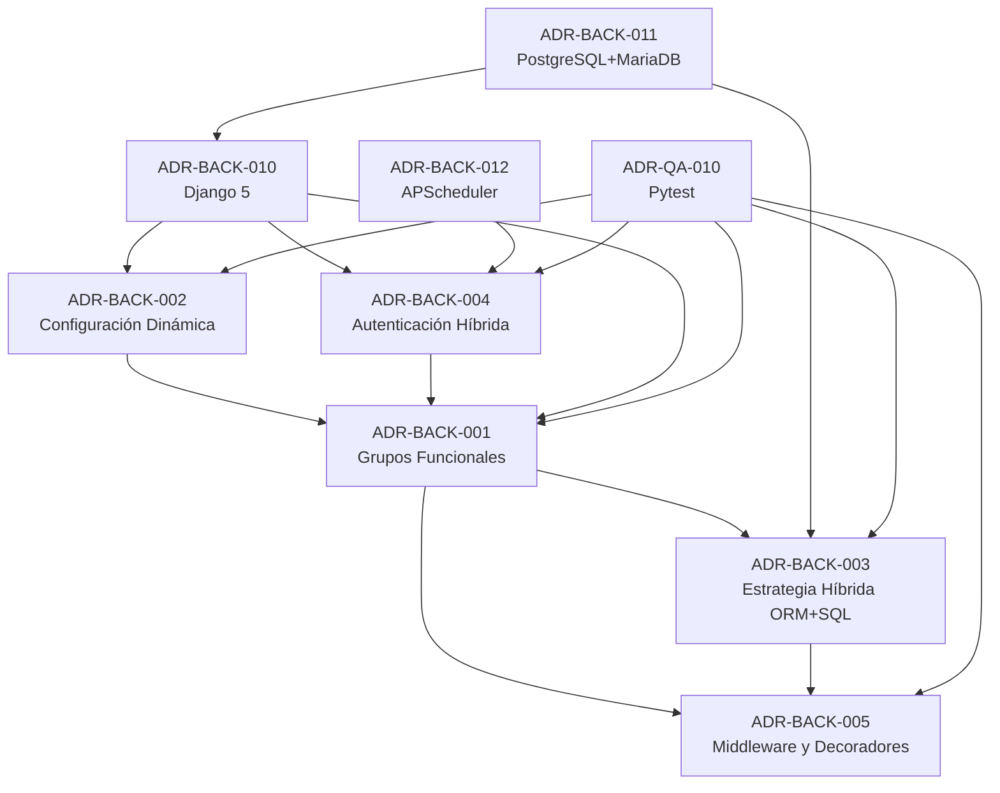

# Índice de ADRs - Backend

**Última actualización:** 2025-11-18

Este documento contiene el índice completo de Architecture Decision Records (ADRs) del backend del sistema IACT.

---

## Estructura de Numeración

Los ADRs del backend siguen la nomenclatura:
- **ADR-BACK-XXX**: Decisiones arquitectónicas de backend
- **ADR-QA-XXX**: Decisiones de quality assurance

---

## ADRs de Backend

### ADR-BACK-001: Sistema de Permisos con Grupos Funcionales Sin Jerarquía

**Estado:** Aceptada
**Fecha:** 2025-11-18
**Propietario:** equipo-backend

**Resumen:**
Implementación de sistema de permisos granular basado en grupos funcionales combinables, sin roles jerárquicos tradicionales (Admin/Supervisor/Agent). Permite flexibilidad total con múltiples grupos por usuario.

**Conceptos clave:**
- Grupos funcionales descriptivos
- N:M usuarios-grupos
- 130+ capacidades atómicas
- Sin jerarquías artificiales

**Alternativas consideradas:**
- RBAC Tradicional (rechazado)
- ABAC (rechazado)
- ACL (rechazado)

**Impacto:**
- 8 tablas en PostgreSQL
- Performance < 50ms (p95)
- Escalable a 200+ capacidades

**Referencias:**
- [Archivo ADR](ADR-BACK-001-grupos-funcionales-sin-jerarquia.md)
- [Arquitectura Permisos](../../permisos/arquitectura_permisos_granular.md)

---

### ADR-BACK-002: Sistema de Configuración Dinámica con Historial Inmutable

**Estado:** Aceptada
**Fecha:** 2025-11-18
**Propietario:** equipo-backend

**Resumen:**
App Django custom `configuration` para gestionar parámetros del sistema con modificación en caliente, historial inmutable de cambios y auditoría completa (ISO 27001).

**Conceptos clave:**
- Sin redespliegue para cambios
- Historial inmutable en ConfiguracionHistorial
- Metadata completa (IP, user agent, timestamp)
- Import/Export de configuraciones

**Alternativas consideradas:**
- Django-constance (rechazado)
- Variables de Entorno (rechazado)
- PostgreSQL JSONB (rechazado)

**Impacto:**
- 2 modelos: Configuracion y ConfiguracionHistorial
- Trazabilidad 100% para auditorías
- 8 categorías predefinidas

**Referencias:**
- [Archivo ADR](ADR-BACK-002-configuracion-dinamica-sistema.md)
- [App Configuration](../../arquitectura/configuration.md)

---

### ADR-BACK-003: Estrategia Híbrida ORM + SQL Nativo para Permisos

**Estado:** Aceptada
**Fecha:** 2025-11-18
**Propietario:** equipo-backend

**Resumen:**
Estrategia híbrida combinando Django ORM para desarrollo/testing y SQL nativo (vistas + funciones PostgreSQL) para performance crítica en verificación de permisos.

**Conceptos clave:**
- ORM para desarrollo, CRUD, testing
- Vistas SQL para queries frecuentes
- Funciones SQL para hot path (< 10ms)
- Gradual optimization

**Alternativas consideradas:**
- ORM exclusivamente (rechazado por performance)
- SQL nativo exclusivamente (rechazado por mantenibilidad)

**Impacto:**
- Performance 5-10x mejor en hot path
- Vistas: vista_capacidades_usuario, vista_grupos_usuario
- Funciones: usuario_tiene_permiso(), obtener_menu_usuario()

**Referencias:**
- [Archivo ADR](ADR-BACK-003-orm-sql-hybrid-permissions.md)
- [Optimizaciones Performance](../../permisos/OPTIMIZACIONES_PERFORMANCE.md)

---

### ADR-BACK-004: Sistema de Autenticación Híbrido JWT + Sessions

**Estado:** Aceptada
**Fecha:** 2025-11-18
**Propietario:** equipo-backend

**Resumen:**
Sistema híbrido combinando JWT tokens para API stateless con Django Sessions para control de sesiones, auditoría y cierre remoto.

**Conceptos clave:**
- JWT para API stateless (access + refresh tokens)
- Django Sessions para control de sesiones
- UserSession model para tracking
- LoginAttempt para prevención fuerza bruta
- SecurityQuestion para recuperación sin email

**Alternativas consideradas:**
- Django Sessions exclusivamente (rechazado)
- JWT exclusivamente (rechazado)
- OAuth2/OpenID Connect (rechazado por complejidad)

**Impacto:**
- Cierre remoto de sesiones
- Rate limiting por IP
- Auditoría completa (ISO 27001)
- APScheduler para limpieza automática

**Referencias:**
- [Archivo ADR](ADR-BACK-004-autenticacion-hibrida-jwt-sessions.md)
- [Diseño Técnico Autenticación](../../diseno_detallado/diseno_tecnico_autenticacion.md)

---

### ADR-BACK-005: Middleware y Decoradores para Permisos Granulares

**Estado:** Aceptada
**Fecha:** 2025-11-18
**Propietario:** equipo-backend

**Resumen:**
Decoradores Python y Permission Classes DRF para integración transparente del sistema de permisos en vistas Django y ViewSets.

**Conceptos clave:**
- @verificar_permiso para FBV
- @method_decorator para CBV
- GranularPermission para DRF ViewSets
- Lógica AND/OR para múltiples permisos
- Auditoría configurable

**Alternativas consideradas:**
- Permission Classes DRF exclusivamente (rechazado)
- Middleware global (rechazado)

**Impacto:**
- Overhead < 5ms por request
- Soporta FBV, CBV, DRF ViewSets
- Código boilerplate mínimo
- 11+ tests de cobertura

**Referencias:**
- [Archivo ADR](ADR-BACK-005-middleware-decoradores-permisos.md)
- [Decoradores y Middleware](../../arquitectura/decoradores_y_middleware_permisos.md)

---

## ADRs de Quality Assurance

### ADR-QA-010: Pytest Framework para Testing

**Estado:** Aceptada
**Fecha:** 2025-11-18
**Propietario:** equipo-backend

**Resumen:**
Uso de Pytest como framework de testing principal para backend con fixtures, factories y plugins especializados.

**Referencias:**
- [Archivo ADR](ADR-QA-010-pytest-framework-testing.md)

---

## ADRs de Base de Datos

### ADR-BACK-010: Django 5 Framework Backend

**Estado:** Aceptada
**Fecha:** 2025-11-18
**Propietario:** equipo-backend

**Resumen:**
Selección de Django 5 como framework principal para backend.

**Referencias:**
- [Archivo ADR](ADR-BACK-010-django-5-framework-backend.md)

---

### ADR-BACK-011: PostgreSQL + MariaDB Multi-Database

**Estado:** Aceptada
**Fecha:** 2025-11-18
**Propietario:** equipo-backend

**Resumen:**
Estrategia multi-database con PostgreSQL para datos principales y MariaDB para legacy IVR.

**Referencias:**
- [Archivo ADR](ADR-BACK-011-postgresql-mariadb-multi-database.md)

---

### ADR-BACK-012: APScheduler para Tareas Programadas

**Estado:** Aceptada
**Fecha:** 2025-11-18
**Propietario:** equipo-backend

**Resumen:**
Uso de APScheduler para jobs programados en lugar de Celery.

**Referencias:**
- [Archivo ADR](ADR-BACK-012-apscheduler-tareas-programadas.md)

---

## Resumen por Estado

| Estado | Cantidad |
|--------|----------|
| Aceptada | 8 |
| Propuesta | 0 |
| Rechazada | 0 |
| Deprecada | 0 |

---

## Resumen por Categoría

| Categoría | ADRs |
|-----------|------|
| Permisos y Seguridad | ADR-BACK-001, ADR-BACK-003, ADR-BACK-005 |
| Autenticación | ADR-BACK-004 |
| Configuración | ADR-BACK-002 |
| Base de Datos | ADR-BACK-011 |
| Framework | ADR-BACK-010 |
| Jobs | ADR-BACK-012 |
| Testing | ADR-QA-010 |

---

## Mapa de Relaciones

---

## Proceso de Creación de ADRs

Para crear un nuevo ADR:

1. **Copiar plantilla**: Usar `plantilla_adr.md` de docs/gobernanza/adr/
2. **Nombrar archivo**: `ADR-BACK-XXX-titulo-descriptivo.md`
3. **Completar secciones**:
 - Contexto y Problema
 - Factores de Decisión
 - Opciones Consideradas
 - Decisión
 - Consecuencias
 - Plan de Implementación
 - Referencias
4. **Agregar metadatos YAML**: Frontmatter con id, estado, propietario, tags
5. **Crear PR**: Para revisión del equipo de arquitectura
6. **Actualizar este índice**: Agregar nuevo ADR a la lista

---

## Referencias

- [Plantilla ADR](../../../gobernanza/adr/plantilla_adr.md)
- [ADRs Globales](../../../gobernanza/adr/README.md)
- [Documentación Backend](../../README.md)

---

**Mantenedores:**
- equipo-backend
- arquitecto-principal

**Contacto:**
Para preguntas sobre ADRs, contactar a equipo-backend
