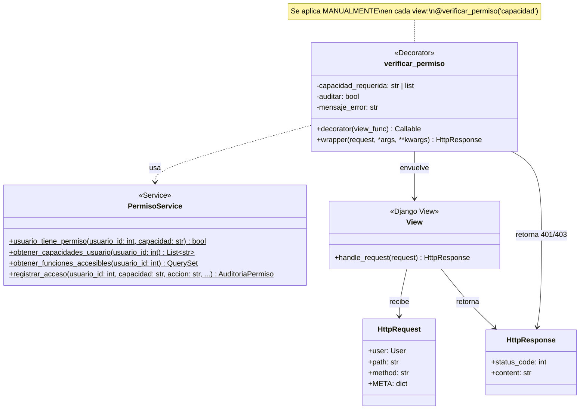
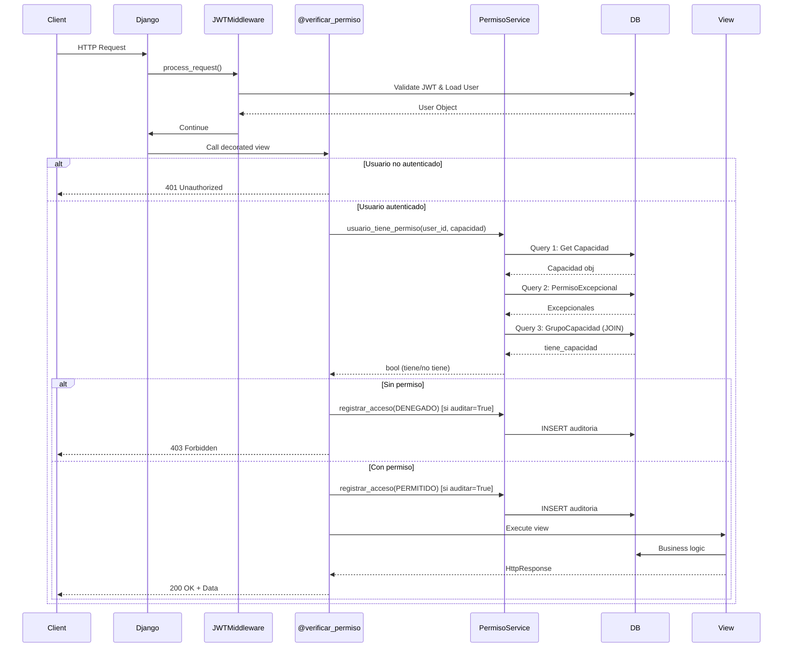
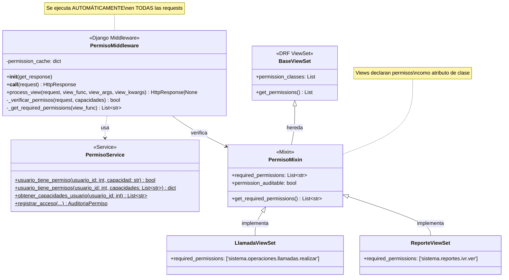
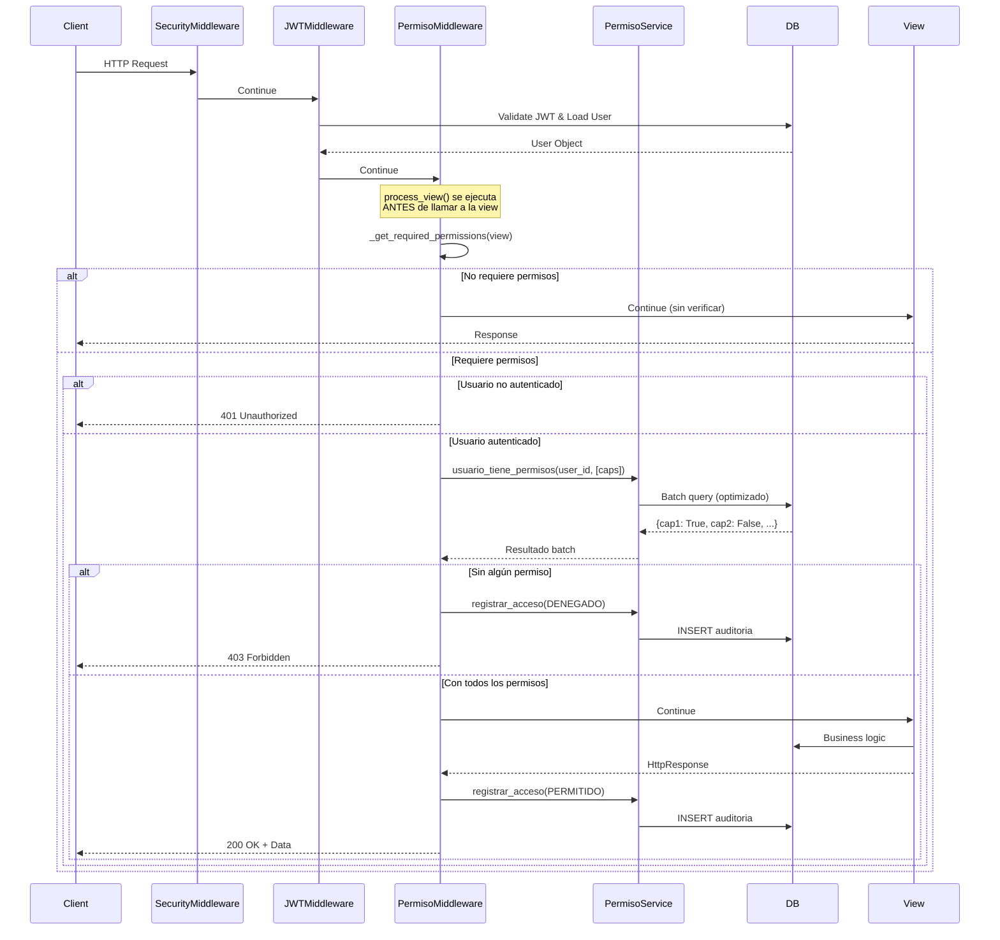
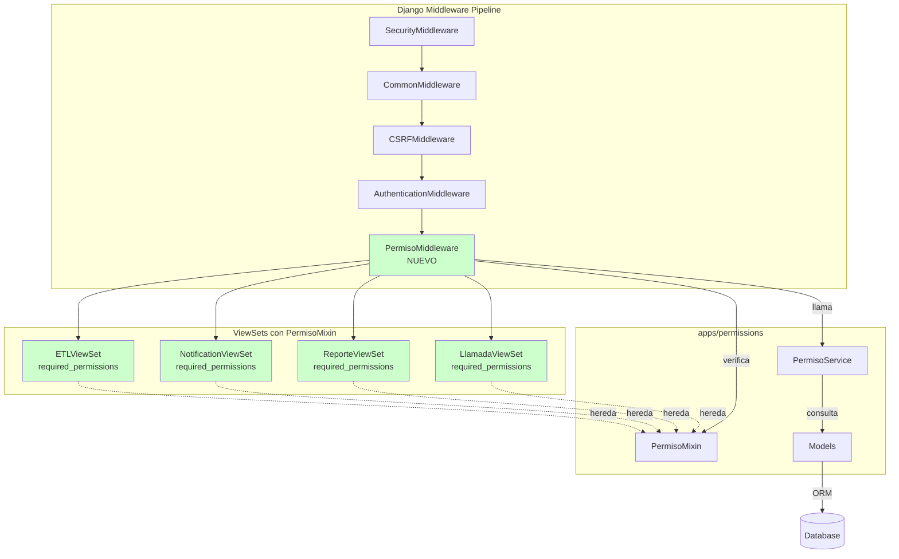
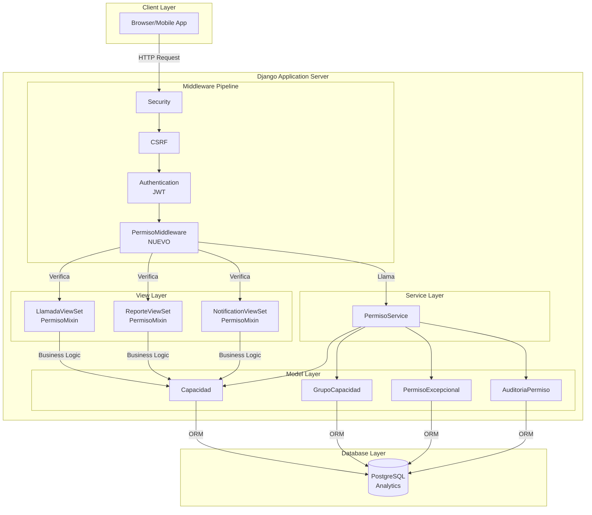
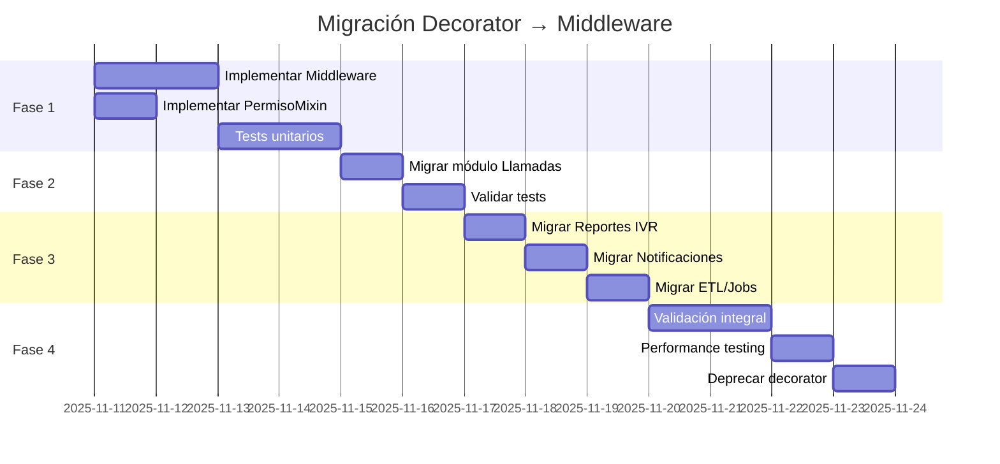

# Arquitectura del Sistema de Permisos - Diagramas UML

**Fecha:** 2025-11-11
**Propósito:** Documentar la arquitectura actual y propuesta del sistema de permisos con diagramas UML
**Referencia:** ADR-012-sistema-permisos-sin-roles-jerarquicos.md

---

## 1. Arquitectura ACTUAL (Decorator-based)

### 1.1 Diagrama de Clases - Arquitectura Actual



### 1.2 Diagrama de Secuencia - Flujo Actual con Decorator



### 1.3 Diagrama de Componentes - Vista de Deployment Actual

```mermaid
graph TB
    subgraph "Django Application"
        subgraph "apps/permissions"
            Service[PermisoService<br/>services.py]
            Decorator[verificar_permiso<br/>middleware.py]
            Models[Models<br/>Capacidad, GrupoCapacidad,<br/>PermisoExcepcional, etc.]
        end

        subgraph "apps/llamadas"
            ViewLlamadas[@verificar_permiso<br/>LlamadaViewSet]
        end

        subgraph "apps/reportes"
            ViewReportes[IsAuthenticated<br/>ReporteViewSet]
        end

        subgraph "apps/notifications"
            ViewNotif[IsAuthenticated<br/>NotificationViewSet]
        end

        subgraph "apps/etl"
            ViewETL[IsAuthenticated<br/>ETLViewSet]
        end

        ViewLlamadas -->|usa| Decorator
        ViewReportes -.->|NO usa permisos<br/>granulares| Service
        ViewNotif -.->|NO usa permisos<br/>granulares| Service
        ViewETL -.->|NO usa permisos<br/>granulares| Service

        Decorator -->|llama| Service
        Service -->|consulta| Models
    end

    subgraph "Database"
        DB[(PostgreSQL<br/>Analytics)]
    end

    Models -->|ORM| DB

    style ViewReportes fill:#ffcccc
    style ViewNotif fill:#ffcccc
    style ViewETL fill:#ffcccc
    style ViewLlamadas fill:#ccffcc
```

**Leyenda:**
- 🟢 Verde: Usa permisos granulares correctamente
- 🔴 Rojo: Solo usa `IsAuthenticated`, NO permisos granulares

---

## 2. Problemas de la Arquitectura Actual

### 2.1 Problema 1: Aplicación Manual del Decorator

```python
# ❌ PROBLEMA: Desarrollador debe recordar aplicar decorator
class ReporteViewSet(viewsets.ModelViewSet):
    permission_classes = [IsAuthenticated]  # Solo autenticación básica

    def list(self, request):
        # CUALQUIER usuario autenticado puede listar reportes
        return Response(...)
```

**Consecuencias:**
- 🔴 Inconsistente: 3 módulos (Reportes, Notificaciones, ETL) NO usan permisos granulares
- 🔴 Error humano: Fácil olvidar aplicar el decorator
- 🔴 Sin centralización: Cada view decide si verificar permisos

### 2.2 Problema 2: No es un Middleware Django Real

**Middleware Django** se ejecuta en el pipeline automáticamente:

```python
# settings.py
MIDDLEWARE = [
    'django.middleware.security.SecurityMiddleware',
    'django.middleware.common.CommonMiddleware',
    'django.middleware.csrf.CsrfViewMiddleware',
    'django.contrib.auth.middleware.AuthenticationMiddleware',
    # ❌ FALTA: PermisoMiddleware (no existe)
]
```

**El decorator NO está en MIDDLEWARE**, por lo que:
- ⚠️ No se ejecuta automáticamente
- ⚠️ No tiene acceso al pipeline de Django
- ⚠️ No puede interceptar requests antes de routing

### 2.3 Problema 3: Verificación Repetida por View

```mermaid
graph LR
    A[Request] --> B{ViewLlamadas}
    A --> C{ViewReportes}
    A --> D{ViewNotificaciones}

    B --> E[@verificar_permiso<br/>verifica cada request]
    C -.-> F[IsAuthenticated<br/>NO verifica permisos]
    D -.-> G[IsAuthenticated<br/>NO verifica permisos]

    E --> H[PermisoService<br/>3 queries]

    style F fill:#ffcccc
    style G fill:#ffcccc
```

**Problema:** Cada view decorada hace 3 queries independientes. No hay caché ni optimización centralizada.

---

## 3. Arquitectura PROPUESTA (Middleware-based)

### 3.1 Diagrama de Clases - Nueva Arquitectura



### 3.2 Diagrama de Secuencia - Flujo Propuesto con Middleware



### 3.3 Diagrama de Componentes - Nueva Arquitectura



---

## 4. Comparación Arquitecturas: Decorator vs Middleware

### 4.1 Tabla Comparativa

| Aspecto | Decorator Actual | Middleware Propuesto |
|---------|------------------|----------------------|
| **Aplicación** | Manual (`@verificar_permiso`) | Automática (pipeline Django) |
| **Cobertura** | Solo views decoradas | TODAS las views con `PermisoMixin` |
| **Consistencia** | 🔴 Inconsistente (3 módulos sin permisos) | 🟢 Consistente (automático) |
| **Centralización** | ❌ Cada view independiente | ✅ Centralizado en middleware |
| **Caché** | ❌ No tiene caché | ✅ Puede implementar caché de request |
| **Queries** | 3 queries por verificación | 3 queries batch (optimizado) |
| **Error humano** | 🔴 Alto (fácil olvidar decorator) | 🟢 Bajo (automático) |
| **Auditoría** | Manual (`auditar=True`) | Automática (configurable por view) |
| **Testing** | Decorar cada test | Middleware se prueba una vez |
| **Orden ejecución** | Después de routing | Antes de routing |

### 4.2 Diagrama de Actividad - Comparación de Flujos

```mermaid
graph TB
    subgraph "ACTUAL: Decorator"
        A1[Request] --> A2{Routing}
        A2 --> A3[View decorada]
        A3 --> A4{@verificar_permiso}
        A4 -->|Sin permiso| A5[403 Forbidden]
        A4 -->|Con permiso| A6[Execute View]
        A6 --> A7[Response]

        A2 -.-> A8[View SIN decorator]
        A8 -.-> A9[Execute sin verificar]
        A9 -.-> A10[Response]

        style A8 fill:#ffcccc
        style A9 fill:#ffcccc
        style A10 fill:#ffcccc
    end

    subgraph "PROPUESTO: Middleware"
        B1[Request] --> B2[PermisoMiddleware]
        B2 --> B3{Routing}
        B3 --> B4{Tiene PermisoMixin?}
        B4 -->|NO| B5[Execute View<br/>sin verificar]
        B4 -->|SÍ| B6{Verificar permisos}
        B6 -->|Sin permiso| B7[403 Forbidden]
        B6 -->|Con permiso| B8[Execute View]
        B5 --> B9[Response]
        B8 --> B9

        style B2 fill:#ccffcc
        style B6 fill:#ccffcc
    end
```

---

## 5. Implementación Propuesta

### 5.1 Código del Middleware Django

```python
# apps/permissions/middleware.py

from typing import Callable, List, Optional
from django.http import HttpRequest, HttpResponse, JsonResponse
from django.utils.functional import SimpleLazyObject

from .services import PermisoService

class PermisoMiddleware:
    """
    Middleware Django para verificación automática de permisos.

    Se ejecuta en el pipeline de Django ANTES de llamar a las views.
    Verifica permisos si la view implementa PermisoMixin.
    """

    def __init__(self, get_response: Callable):
        self.get_response = get_response

    def __call__(self, request: HttpRequest) -> HttpResponse:
        """
        Ejecuta el middleware.

        process_view() se llama automáticamente por Django.
        """
        return self.get_response(request)

    def process_view(
        self,
        request: HttpRequest,
        view_func: Callable,
        view_args: tuple,
        view_kwargs: dict
    ) -> Optional[HttpResponse]:
        """
        Se ejecuta ANTES de llamar a la view.

        Retorna:
            - None: Continuar al siguiente middleware/view
            - HttpResponse: Cortocircuito (401/403)
        """
        # 1. Obtener permisos requeridos
        required_permissions = self._get_required_permissions(view_func, view_kwargs)

        # 2. Si no requiere permisos, continuar
        if not required_permissions:
            return None

        # 3. Verificar autenticación
        if not request.user.is_authenticated:
            return JsonResponse({
                "error": "Autenticación requerida",
                "detalle": "Debe autenticarse para acceder a este recurso"
            }, status=401)

        # 4. Verificar permisos
        usuario_id = request.user.id
        tiene_permisos, permisos_faltantes = self._verificar_permisos(
            usuario_id,
            required_permissions
        )

        # 5. Denegar si falta algún permiso
        if not tiene_permisos:
            # Auditar acceso denegado
            if self._is_auditable(view_func, view_kwargs):
                PermisoService.registrar_acceso(
                    usuario_id=usuario_id,
                    capacidad=", ".join(permisos_faltantes),
                    accion="ACCESO_DENEGADO",
                    ip_address=self._get_client_ip(request),
                    user_agent=request.META.get("HTTP_USER_AGENT"),
                    metadata={
                        "path": request.path,
                        "method": request.method,
                        "permisos_faltantes": permisos_faltantes
                    }
                )

            return JsonResponse({
                "error": f"Permiso denegado. Requiere: {', '.join(permisos_faltantes)}",
                "capacidades_requeridas": permisos_faltantes
            }, status=403)

        # 6. Auditar acceso permitido
        if self._is_auditable(view_func, view_kwargs):
            PermisoService.registrar_acceso(
                usuario_id=usuario_id,
                capacidad=", ".join(required_permissions),
                accion="ACCESO_PERMITIDO",
                ip_address=self._get_client_ip(request),
                user_agent=request.META.get("HTTP_USER_AGENT"),
                metadata={
                    "path": request.path,
                    "method": request.method
                }
            )

        # 7. Continuar a la view
        return None

    def _get_required_permissions(
        self,
        view_func: Callable,
        view_kwargs: dict
    ) -> List[str]:
        """
        Extrae permisos requeridos de la view.

        Busca atributo `required_permissions` en:
        - ViewSet (si es DRF)
        - View function (si es FBV)
        """
        # Caso 1: DRF ViewSet
        if hasattr(view_func, 'cls'):
            view_class = view_func.cls
            if hasattr(view_class, 'required_permissions'):
                permisos = view_class.required_permissions
                return permisos if isinstance(permisos, list) else [permisos]

        # Caso 2: Function-based view
        if hasattr(view_func, 'required_permissions'):
            permisos = view_func.required_permissions
            return permisos if isinstance(permisos, list) else [permisos]

        return []

    def _verificar_permisos(
        self,
        usuario_id: int,
        capacidades: List[str]
    ) -> tuple[bool, List[str]]:
        """
        Verifica si usuario tiene TODAS las capacidades.

        Returns:
            (tiene_todos, lista_faltantes)
        """
        permisos_faltantes = []

        for capacidad in capacidades:
            if not PermisoService.usuario_tiene_permiso(usuario_id, capacidad):
                permisos_faltantes.append(capacidad)

        tiene_todos = len(permisos_faltantes) == 0
        return tiene_todos, permisos_faltantes

    def _is_auditable(self, view_func: Callable, view_kwargs: dict) -> bool:
        """Verifica si la view requiere auditoría."""
        if hasattr(view_func, 'cls'):
            return getattr(view_func.cls, 'permission_auditable', False)
        return getattr(view_func, 'permission_auditable', False)

    def _get_client_ip(self, request: HttpRequest) -> Optional[str]:
        """Extrae IP del cliente."""
        x_forwarded_for = request.META.get("HTTP_X_FORWARDED_FOR")
        if x_forwarded_for:
            return x_forwarded_for.split(",")[0].strip()
        return request.META.get("REMOTE_ADDR")
```

### 5.2 Mixin para ViewSets

```python
# apps/permissions/mixins.py

from typing import List

class PermisoMixin:
    """
    Mixin para ViewSets que requieren permisos granulares.

    Uso:
        class LlamadaViewSet(PermisoMixin, viewsets.ModelViewSet):
            required_permissions = [
                'sistema.operaciones.llamadas.realizar'
            ]
            permission_auditable = True
    """

    # Capacidades requeridas (sobreescribir en subclase)
    required_permissions: List[str] = []

    # Si True, auditará accesos
    permission_auditable: bool = False

    def get_required_permissions(self) -> List[str]:
        """Hook para permisos dinámicos basados en acción."""
        return self.required_permissions
```

### 5.3 Ejemplo de Uso en ViewSet

```python
# apps/llamadas/views.py

from rest_framework import viewsets
from apps.permissions.mixins import PermisoMixin

class LlamadaViewSet(PermisoMixin, viewsets.ModelViewSet):
    """
    ViewSet con permisos granulares verificados AUTOMÁTICAMENTE.
    """
    required_permissions = [
        'sistema.operaciones.llamadas.realizar'
    ]
    permission_auditable = True

    queryset = Llamada.objects.all()
    serializer_class = LlamadaSerializer

    # NO necesita @verificar_permiso decorator
    # El middleware lo verifica automáticamente
```

### 5.4 Configuración en settings.py

```python
# callcentersite/settings/base.py

MIDDLEWARE = [
    'django.middleware.security.SecurityMiddleware',
    'django.contrib.sessions.middleware.SessionMiddleware',
    'django.middleware.common.CommonMiddleware',
    'django.middleware.csrf.CsrfViewMiddleware',
    'django.contrib.auth.middleware.AuthenticationMiddleware',

    # ✅ AGREGAR: Middleware de permisos
    'callcentersite.apps.permissions.middleware.PermisoMiddleware',

    'django.contrib.messages.middleware.MessageMiddleware',
    'django.middleware.clickjacking.XFrameOptionsMiddleware',
]
```

---

## 6. Diagrama de Deployment

### 6.1 Vista de Deployment con Ambas Arquitecturas



---

## 7. Ventajas y Desventajas

### 7.1 Ventajas del Middleware Django

| Ventaja | Descripción | Impacto |
|---------|-------------|---------|
| **Automático** | Se ejecuta en TODAS las requests sin intervención manual | 🟢 Alto |
| **Centralizado** | Lógica de permisos en UN solo lugar | 🟢 Alto |
| **Consistente** | Imposible olvidar verificar permisos (si usa PermisoMixin) | 🟢 Alto |
| **Caché request-scoped** | Puede cachear permisos durante la request | 🟢 Medio |
| **Auditoría** | Configurable por view, no requiere parametrizar decorator | 🟢 Medio |
| **Testing** | Probar middleware una vez vs decorar cada test | 🟢 Medio |
| **Pipeline Django** | Aprovecha orden de ejecución de middlewares | 🟢 Medio |

### 7.2 Desventajas del Middleware Django

| Desventaja | Descripción | Mitigación |
|------------|-------------|------------|
| **Complejidad inicial** | Más complejo que decorator simple | Documentación clara |
| **Refactoring** | Requiere cambiar views existentes | Migración gradual |
| **Debugging** | Middleware pipeline puede ser opaco | Logging detallado |
| **Overhead** | Se ejecuta en TODAS las requests | Solo verifica si tiene PermisoMixin |

---

## 8. Plan de Migración

### 8.1 Fases de Migración



### 8.2 Pasos Detallados

1. **Fase 1: Implementación Base (3 días)**
   - [ ] Crear `PermisoMiddleware` en `middleware.py`
   - [ ] Crear `PermisoMixin` en `mixins.py`
   - [ ] Actualizar `settings.py` (agregar middleware)
   - [ ] Tests unitarios del middleware
   - [ ] Tests de integración

2. **Fase 2: Validación con Llamadas (2 días)**
   - [ ] Migrar `LlamadaViewSet` a usar `PermisoMixin`
   - [ ] Remover decorators `@verificar_permiso`
   - [ ] Ejecutar tests existentes (49 tests)
   - [ ] Validar que SIGUE funcionando

3. **Fase 3: Migración Módulos Restantes (3 días)**
   - [ ] `ReporteViewSet`: Agregar `required_permissions`
   - [ ] `NotificationViewSet`: Agregar `required_permissions`
   - [ ] `ETLViewSet`: Agregar `required_permissions`
   - [ ] Crear tests de permisos para estos módulos

4. **Fase 4: Validación y Cleanup (4 días)**
   - [ ] Tests de integración completos
   - [ ] Performance testing (comparar queries)
   - [ ] Validar auditoría funciona
   - [ ] Deprecar decorator antiguo
   - [ ] Actualizar documentación

---

## 9. Métricas de Éxito

### 9.1 KPIs Técnicos

| Métrica | Baseline (Decorator) | Target (Middleware) | Medición |
|---------|---------------------|---------------------|----------|
| **Cobertura de permisos** | 25% (1/4 módulos) | 100% (4/4 módulos) | Tests + code review |
| **Queries por verificación** | 3 queries | 3 queries (igual) | Django Debug Toolbar |
| **Latencia p50** | ~30ms | ≤30ms | Sampling logs |
| **Latencia p95** | ~60ms | ≤60ms | Sampling logs |
| **Tests passing** | 49/49 | 49/49 | CI/CD |
| **Error rate** | 0% | 0% | Monitoring |

### 9.2 Criterios de Aceptación

✅ **Debe cumplir:**
- Todos los tests existentes pasan (49/49)
- TODOS los módulos usan permisos granulares (4/4)
- No aumenta queries ni latencia
- Auditoría funciona correctamente
- Sin errores en producción

---

## 10. Conclusiones

### 10.1 Recomendación: Migrar a Middleware Django

**Razones principales:**

1. **Consistencia:** TODOS los módulos usan permisos automáticamente
2. **Mantenibilidad:** Lógica centralizada, fácil de modificar
3. **Escalabilidad:** Agregar nuevos módulos es trivial (solo heredar PermisoMixin)
4. **Seguridad:** Imposible olvidar verificar permisos
5. **Cumple ADR-012:** Sistema granular sin roles jerárquicos

### 10.2 Trade-offs Aceptados

- ⚠️ Mayor complejidad inicial (compensado por consistencia)
- ⚠️ Refactoring necesario (gradual, módulo por módulo)
- ⚠️ Curva de aprendizaje (1-2 semanas para el equipo)

### 10.3 Próximos Pasos

1. **Validar con usuario:** Revisar diagramas y arquitectura propuesta
2. **Aprobar migración:** Confirmar plan de 4 fases
3. **Implementar Fase 1:** Crear middleware y mixin
4. **Iterar:** Migrar módulo por módulo con validación

---

## Referencias

- **ADR-012:** Sistema de Permisos Granular SIN Roles Jerárquicos
- **Django Middleware:** https://docs.djangoproject.com/en/5.2/topics/http/middleware/
- **DRF Permissions:** https://www.django-rest-framework.org/api-guide/permissions/
- **Código actual:**
  - `apps/permissions/middleware.py` (decorator)
  - `apps/permissions/services.py` (PermisoService)
  - `apps/permissions/models.py` (modelos)

---

**Versión:** 1.0
**Estado:** Propuesto
**Fecha:** 2025-11-11
