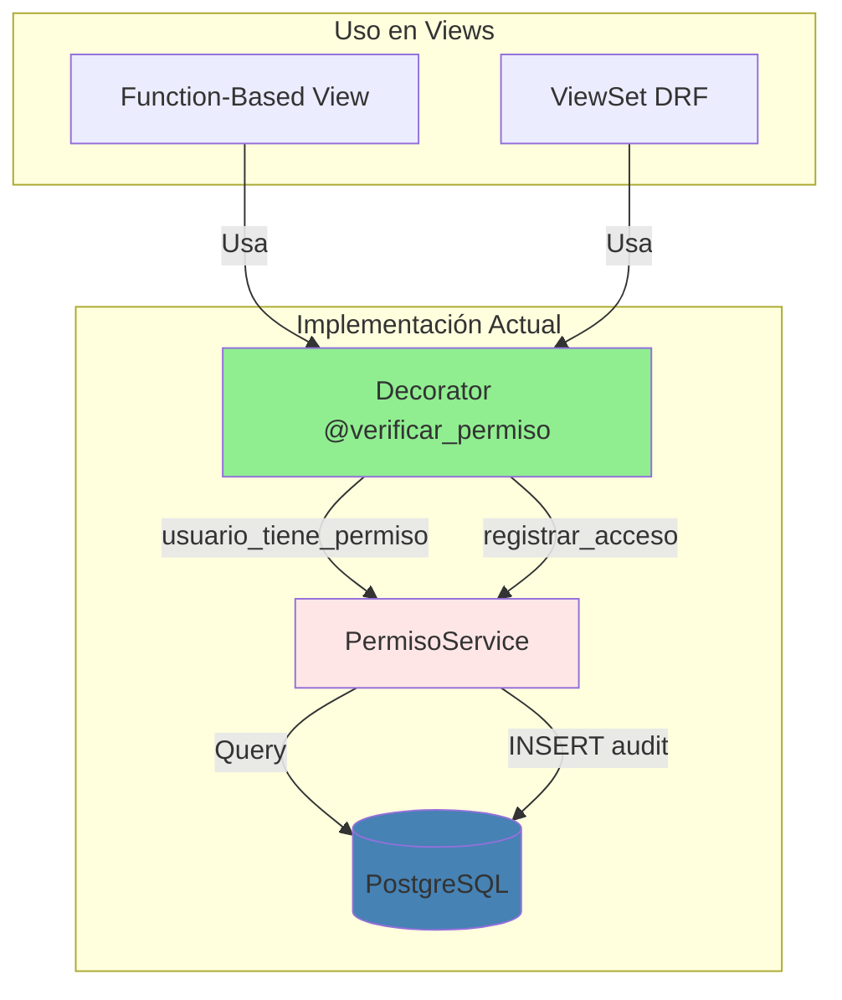
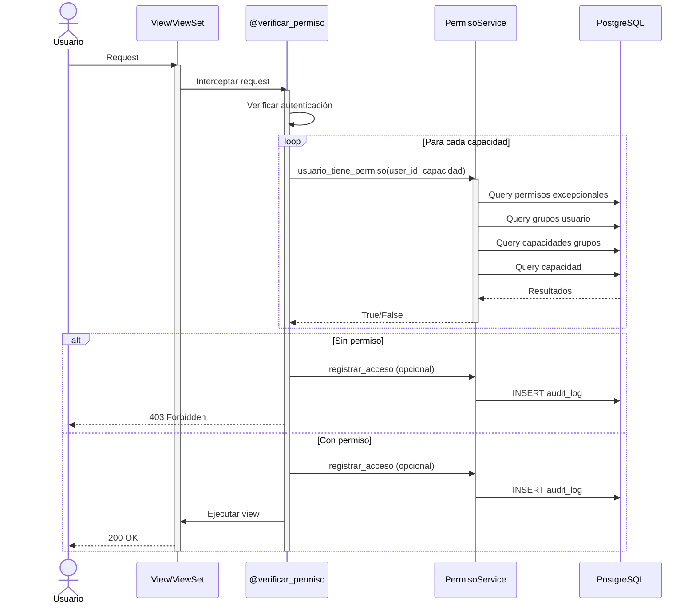
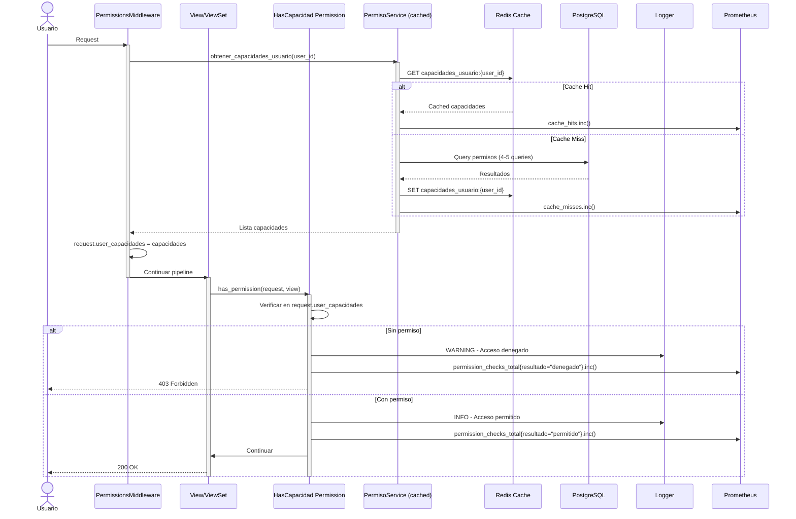

# Análisis y Mejoras del Middleware de Permisos

**Fecha**: 2025-11-11
**Estado**: Propuesta de Mejoras
**Versión**: 1.0

---

## Tabla de Contenidos

1. [Análisis del Middleware Actual](#analisis-del-middleware-actual)
2. [Problemas Identificados](#problemas-identificados)
3. [Propuestas de Mejora](#propuestas-de-mejora)
4. [Flujo Actual vs Propuesto](#flujo-actual-vs-propuesto)
5. [Plan de Implementación](#plan-de-implementacion)

---

## Análisis del Middleware Actual

### Arquitectura Existente

**Ubicación**: `api/callcentersite/callcentersite/apps/permissions/middleware.py`

### Componentes Actuales



### Fortalezas

1. **Decorator funcional**
   - Preserva metadata con `@wraps`
   - Maneja autenticación (401) y autorización (403)
   - Soporte para múltiples capacidades (lógica AND)

2. **Auditoría configurable**
   - Registra accesos permitidos y denegados
   - Captura contexto: IP, User-Agent, path, method
   - Soporte para proxy (X-Forwarded-For)

3. **Mensajes personalizables**
   - Error messages customizables
   - Respuestas JSON estructuradas

4. **Tests completos**
   - 11+ tests en `test_middleware.py`
   - Coverage de casos edge (anónimo, sin permiso, múltiples capacidades)

### Código Actual (Simplificado)

```python
def verificar_permiso(
    capacidad_requerida: str | list[str],
    auditar: bool = False,
    mensaje_error: str | None = None
) -> Callable:
    """
    Decorator para proteger views con verificacion de permisos.

    Flujo:
    1. Verificar autenticación (401 si falla)
    2. Verificar TODAS las capacidades requeridas
    3. Denegar si falta alguna (403 con auditoria opcional)
    4. Permitir si tiene todas (auditoria opcional)
    5. Ejecutar view original
    """
    def decorator(view_func: Callable) -> Callable:
        @wraps(view_func)
        def wrapper(request: HttpRequest, *args, **kwargs) -> HttpResponse:
            # 1. Check authentication
            if not request.user.is_authenticated:
                return JsonResponse({"error": "..."}, status=401)

            # 2. Check ALL permissions
            for capacidad in capacidades:
                if not PermisoService.usuario_tiene_permiso(usuario_id, capacidad):
                    permisos_faltantes.append(capacidad)

            # 3. Deny if missing any
            if permisos_faltantes:
                if auditar:
                    PermisoService.registrar_acceso(..., accion="ACCESO_DENEGADO")
                return JsonResponse({"error": "..."}, status=403)

            # 4. Allow access
            if auditar:
                PermisoService.registrar_acceso(..., accion="ACCESO_PERMITIDO")

            # 5. Execute view
            return view_func(request, *args, **kwargs)

        return wrapper
    return decorator
```

---

## Problemas Identificados

### 1. No hay Django Middleware Real

**Problema**: Solo existe un decorator, no un middleware de Django que se ejecute en el pipeline de requests.

**Impacto**:
- No puede hacer verificaciones globales
- No puede agregar headers de permisos a responses
- No puede implementar rate limiting global

**Ejemplo de uso actual**:
```python
# Cada view debe tener el decorator explícito
@verificar_permiso("sistema.operaciones.llamadas.ver")
def list(self, request, *args, **kwargs):
    return super().list(request, *args, **kwargs)
```

### 2. Limitado Soporte para DRF ViewSets

**Problema**: El decorator funciona con function-based views, pero es verbose para ViewSets.

**Impacto**:
- Cada método (list, create, update, destroy) necesita su propio decorator
- No hay una forma declarativa de proteger todo el ViewSet
- Repetición de código

**Ejemplo actual (verbose)**:
```python
class LlamadaViewSet(viewsets.ModelViewSet):
    @verificar_permiso("sistema.operaciones.llamadas.ver")
    def list(self, request, *args, **kwargs):
        return super().list(request, *args, **kwargs)

    @verificar_permiso("sistema.operaciones.llamadas.ver")
    def retrieve(self, request, *args, **kwargs):
        return super().retrieve(request, *args, **kwargs)

    @verificar_permiso("sistema.operaciones.llamadas.realizar")
    def create(self, request, *args, **kwargs):
        return super().create(request, *args, **kwargs)

    # ... más repetición para update, partial_update, destroy
```

### 3. No hay Caching de Permisos

**Problema**: Cada verificación hace queries a BD (mínimo 3-4 queries).

**Queries por verificación**:
```sql
-- 1. Obtener usuario
SELECT * FROM auth_user WHERE id = ?

-- 2. Obtener capacidad
SELECT * FROM capacidad WHERE nombre_completo = ?

-- 3. Verificar permisos excepcionales
SELECT * FROM permiso_excepcional WHERE usuario_id = ? AND capacidad_id = ?

-- 4. Obtener grupos del usuario
SELECT * FROM usuario_grupo WHERE usuario_id = ? AND activo = TRUE

-- 5. Verificar capacidades de grupos
SELECT * FROM grupo_capacidad WHERE grupo_id IN (?, ?, ...) AND capacidad_id = ?
```

**Impacto**:
- Performance degradado en endpoints con alta concurrencia
- 5+ queries por request en verificación
- No aprovecha cache distribuido (Redis)

### 4. No hay Rate Limiting de Verificaciones

**Problema**: No hay protección contra intentos masivos de verificación.

**Impacto**:
- Vulnerable a ataques DoS mediante verificación masiva
- No hay throttling por usuario
- Posible saturación de BD

### 5. No hay Logging Estructurado

**Problema**: Solo hay auditoría en BD, no logging con Python `logging`.

**Impacto**:
- Difícil debugging en desarrollo
- No integra con sistemas de monitoreo (Datadog, Sentry)
- No hay logs estructurados JSON para parseo

### 6. No hay Soporte para Permisos a Nivel de Objeto

**Problema**: Solo verifica permisos globales, no puede verificar "puede editar ESTE ticket".

**Impacto**:
- No puede implementar "solo ver tickets asignados a mí"
- No puede implementar "solo editar llamadas de mi equipo"
- Necesita lógica adicional en cada view

### 7. No hay Integración con DRF Permissions

**Problema**: No hay una clase `BasePermission` de DRF para usar con `permission_classes`.

**Impacto**:
- No puede usar patrón estándar de DRF
- No puede combinar con otros permissions (IsStaffOrReadOnly, etc.)

**Ejemplo deseado (no existe)**:
```python
class LlamadaViewSet(viewsets.ModelViewSet):
    permission_classes = [
        IsAuthenticated,
        HasCapacidad("sistema.operaciones.llamadas.ver")  # NO EXISTE
    ]
```

### 8. Solo Lógica AND, No OR

**Problema**: Solo soporta "usuario debe tener TODAS las capacidades".

**Impacto**:
- No puede implementar "admin O supervisor pueden aprobar"
- No puede hacer verificaciones complejas

### 9. No hay Métricas de Performance

**Problema**: No se mide cuánto tarda cada verificación.

**Impacto**:
- No se puede optimizar
- No hay alertas si verificación es lenta
- No hay estadísticas de uso

### 10. No hay Modo "Dry-Run" para Testing

**Problema**: No hay forma de simular verificaciones sin bloquear.

**Impacto**:
- Difícil testing de flujos complejos
- No se puede auditar sin enforcement

---

## Propuestas de Mejora

### Mejora 1: Django Middleware Real

**Propuesta**: Crear un middleware de Django que se ejecute en el pipeline.

**Implementación**:
```python
# permissions/middleware.py

class PermissionsMiddleware:
    """
    Middleware Django para agregar contexto de permisos a cada request.

    NO bloquea requests, solo agrega información.
    """

    def __init__(self, get_response):
        self.get_response = get_response

    def __call__(self, request):
        # 1. Agregar helper al request
        if request.user.is_authenticated:
            request.user_capacidades = PermisoService.obtener_capacidades_usuario(
                request.user.id
            )
        else:
            request.user_capacidades = []

        # 2. Agregar helper method
        request.tiene_permiso = lambda cap: cap in request.user_capacidades

        # 3. Agregar headers de permisos en response
        response = self.get_response(request)

        if hasattr(request, 'user_capacidades'):
            response['X-User-Permissions-Count'] = str(len(request.user_capacidades))

        return response
```

**Configuración**:
```python
# settings/base.py
MIDDLEWARE = [
    'django.middleware.security.SecurityMiddleware',
    'django.contrib.sessions.middleware.SessionMiddleware',
    'django.middleware.common.CommonMiddleware',
    'django.middleware.csrf.CsrfViewMiddleware',
    'django.contrib.auth.middleware.AuthenticationMiddleware',
    'callcentersite.apps.permissions.middleware.PermissionsMiddleware',  # NUEVO
    'django.contrib.messages.middleware.MessageMiddleware',
    'django.middleware.clickjacking.XFrameOptionsMiddleware',
]
```

**Beneficios**:
- Request context con permisos disponible globalmente
- Headers HTTP con info de permisos
- Base para rate limiting global

### Mejora 2: DRF Permission Classes

**Propuesta**: Crear clases `BasePermission` de DRF para uso declarativo.

**Implementación**:
```python
# permissions/drf_permissions.py

from rest_framework.permissions import BasePermission
from .services import PermisoService

class HasCapacidad(BasePermission):
    """
    Permission class para DRF que verifica capacidad.

    Uso:
        class MyViewSet(viewsets.ModelViewSet):
            permission_classes = [IsAuthenticated, HasCapacidad("sistema.operaciones.llamadas.ver")]
    """

    def __init__(self, capacidad_requerida: str):
        self.capacidad_requerida = capacidad_requerida

    def has_permission(self, request, view):
        if not request.user.is_authenticated:
            return False

        return PermisoService.usuario_tiene_permiso(
            request.user.id,
            self.capacidad_requerida
        )

    def get_message(self):
        return f"Permiso denegado. Requiere: {self.capacidad_requerida}"


class HasAnyCapacidad(BasePermission):
    """
    Permission class con lógica OR (cualquiera de las capacidades).

    Uso:
        permission_classes = [
            IsAuthenticated,
            HasAnyCapacidad([
                "sistema.operaciones.llamadas.aprobar",
                "sistema.supervision.llamadas.aprobar"
            ])
        ]
    """

    def __init__(self, capacidades: list[str]):
        self.capacidades = capacidades

    def has_permission(self, request, view):
        if not request.user.is_authenticated:
            return False

        for capacidad in self.capacidades:
            if PermisoService.usuario_tiene_permiso(request.user.id, capacidad):
                return True

        return False


class CapacidadPorMetodo(BasePermission):
    """
    Permission class que asigna capacidades por método HTTP.

    Uso:
        permission_classes = [
            IsAuthenticated,
            CapacidadPorMetodo({
                "GET": "sistema.operaciones.llamadas.ver",
                "POST": "sistema.operaciones.llamadas.crear",
                "PUT": "sistema.operaciones.llamadas.editar",
                "DELETE": "sistema.operaciones.llamadas.eliminar"
            })
        ]
    """

    def __init__(self, capacidades_por_metodo: dict[str, str]):
        self.capacidades_por_metodo = capacidades_por_metodo

    def has_permission(self, request, view):
        if not request.user.is_authenticated:
            return False

        capacidad = self.capacidades_por_metodo.get(request.method)
        if not capacidad:
            return True  # Si no hay capacidad definida, permitir

        return PermisoService.usuario_tiene_permiso(request.user.id, capacidad)
```

**Uso en ViewSets**:
```python
# Antes (verbose)
class LlamadaViewSet(viewsets.ModelViewSet):
    @verificar_permiso("sistema.operaciones.llamadas.ver")
    def list(self, request, *args, **kwargs):
        return super().list(request, *args, **kwargs)

    @verificar_permiso("sistema.operaciones.llamadas.realizar")
    def create(self, request, *args, **kwargs):
        return super().create(request, *args, **kwargs)


# Después (declarativo)
class LlamadaViewSet(viewsets.ModelViewSet):
    permission_classes = [
        IsAuthenticated,
        CapacidadPorMetodo({
            "GET": "sistema.operaciones.llamadas.ver",
            "POST": "sistema.operaciones.llamadas.realizar",
            "PUT": "sistema.operaciones.llamadas.realizar",
            "DELETE": "sistema.operaciones.llamadas.eliminar"
        })
    ]
```

### Mejora 3: Caching de Permisos

**Propuesta**: Implementar cache de permisos con TTL configurable.

**Implementación**:
```python
# permissions/services.py

from django.core.cache import cache
from django.conf import settings

class PermisoService:

    CACHE_TTL = getattr(settings, 'PERMISSIONS_CACHE_TTL', 300)  # 5 minutos default

    @staticmethod
    def usuario_tiene_permiso(usuario_id: int, capacidad_requerida: str) -> bool:
        """Verifica permiso con caching."""

        # 1. Generar cache key
        cache_key = f"permiso:{usuario_id}:{capacidad_requerida}"

        # 2. Verificar cache
        cached_result = cache.get(cache_key)
        if cached_result is not None:
            return cached_result

        # 3. Si no está en cache, calcular
        resultado = PermisoService._verificar_permiso_sin_cache(
            usuario_id, capacidad_requerida
        )

        # 4. Guardar en cache
        cache.set(cache_key, resultado, PermisoService.CACHE_TTL)

        return resultado

    @staticmethod
    def _verificar_permiso_sin_cache(usuario_id: int, capacidad_requerida: str) -> bool:
        """Lógica original sin cache."""
        # ... lógica actual de verificación ...

    @staticmethod
    def invalidar_cache_usuario(usuario_id: int):
        """
        Invalida cache de permisos de un usuario.

        Llamar cuando:
        - Usuario se asigna a nuevo grupo
        - Usuario recibe permiso excepcional
        - Permisos de grupo cambian
        """
        # Invalidar todas las keys de este usuario
        cache.delete_pattern(f"permiso:{usuario_id}:*")

    @staticmethod
    def obtener_capacidades_usuario(usuario_id: int) -> list[str]:
        """Obtiene todas las capacidades con caching."""

        cache_key = f"capacidades_usuario:{usuario_id}"
        cached_capacidades = cache.get(cache_key)

        if cached_capacidades is not None:
            return cached_capacidades

        capacidades = PermisoService._calcular_capacidades_usuario(usuario_id)
        cache.set(cache_key, capacidades, PermisoService.CACHE_TTL)

        return capacidades
```

**Configuración**:
```python
# settings/base.py

CACHES = {
    'default': {
        'BACKEND': 'django.core.cache.backends.redis.RedisCache',
        'LOCATION': 'redis://127.0.0.1:6379/1',
        'OPTIONS': {
            'CLIENT_CLASS': 'django_redis.client.DefaultClient',
        },
        'KEY_PREFIX': 'iact',
        'TIMEOUT': 300,  # 5 minutos default
    }
}

# TTL específico para permisos (en segundos)
PERMISSIONS_CACHE_TTL = 300  # 5 minutos
```

**Signals para invalidación automática**:
```python
# permissions/signals.py

from django.db.models.signals import post_save, post_delete
from django.dispatch import receiver
from .models import UsuarioGrupo, PermisoExcepcional, GrupoCapacidad
from .services import PermisoService

@receiver(post_save, sender=UsuarioGrupo)
@receiver(post_delete, sender=UsuarioGrupo)
def invalidar_cache_usuario_grupo(sender, instance, **kwargs):
    """Invalida cache cuando usuario se agrega/remueve de grupo."""
    PermisoService.invalidar_cache_usuario(instance.usuario_id)

@receiver(post_save, sender=PermisoExcepcional)
@receiver(post_delete, sender=PermisoExcepcional)
def invalidar_cache_permiso_excepcional(sender, instance, **kwargs):
    """Invalida cache cuando se concede/revoca permiso excepcional."""
    PermisoService.invalidar_cache_usuario(instance.usuario_id)

@receiver(post_save, sender=GrupoCapacidad)
@receiver(post_delete, sender=GrupoCapacidad)
def invalidar_cache_grupo_capacidad(sender, instance, **kwargs):
    """Invalida cache de todos los usuarios del grupo cuando cambian sus capacidades."""
    usuarios_del_grupo = UsuarioGrupo.objects.filter(
        grupo=instance.grupo,
        activo=True
    ).values_list('usuario_id', flat=True)

    for usuario_id in usuarios_del_grupo:
        PermisoService.invalidar_cache_usuario(usuario_id)
```

**Beneficios**:
- Reducción de queries de 5+ a 0 por verificación (con cache hit)
- TTL configurable por ambiente (dev: 60s, prod: 300s)
- Invalidación automática con signals
- Soporte para Redis distribuido

### Mejora 4: Logging Estructurado

**Propuesta**: Agregar logging con Python `logging` en formato JSON.

**Implementación**:
```python
# permissions/middleware.py

import logging
import time
from django.conf import settings

logger = logging.getLogger('permissions')

def verificar_permiso(
    capacidad_requerida: str | list[str],
    auditar: bool = False,
    mensaje_error: str | None = None,
    log_level: str = "INFO"
) -> Callable:
    """Decorator con logging estructurado."""

    def decorator(view_func: Callable) -> Callable:
        @wraps(view_func)
        def wrapper(request: HttpRequest, *args, **kwargs) -> HttpResponse:
            start_time = time.time()

            # Preparar contexto de log
            log_context = {
                "user_id": request.user.id if request.user.is_authenticated else None,
                "username": request.user.username if request.user.is_authenticated else "anonymous",
                "capacidades_requeridas": capacidades,
                "path": request.path,
                "method": request.method,
                "ip": _obtener_ip_cliente(request),
            }

            # Verificación
            if not request.user.is_authenticated:
                logger.warning(
                    "Acceso denegado: usuario no autenticado",
                    extra=log_context
                )
                return JsonResponse({"error": "..."}, status=401)

            # Verificar permisos
            permisos_faltantes = []
            for capacidad in capacidades:
                if not PermisoService.usuario_tiene_permiso(usuario_id, capacidad):
                    permisos_faltantes.append(capacidad)

            # Log resultado
            elapsed = time.time() - start_time
            log_context.update({
                "elapsed_ms": round(elapsed * 1000, 2),
                "permisos_faltantes": permisos_faltantes,
            })

            if permisos_faltantes:
                logger.warning(
                    f"Acceso denegado: permisos faltantes",
                    extra=log_context
                )

                if auditar:
                    PermisoService.registrar_acceso(...)

                return JsonResponse({"error": "..."}, status=403)

            logger.info(
                f"Acceso permitido",
                extra=log_context
            )

            if auditar:
                PermisoService.registrar_acceso(...)

            return view_func(request, *args, **kwargs)

        return wrapper
    return decorator
```

**Configuración de logging**:
```python
# settings/base.py

LOGGING = {
    'version': 1,
    'disable_existing_loggers': False,
    'formatters': {
        'json': {
            '()': 'pythonjsonlogger.jsonlogger.JsonFormatter',
            'format': '%(asctime)s %(name)s %(levelname)s %(message)s'
        },
    },
    'handlers': {
        'console': {
            'class': 'logging.StreamHandler',
            'formatter': 'json',
        },
        'file': {
            'class': 'logging.handlers.RotatingFileHandler',
            'filename': 'logs/permissions.log',
            'maxBytes': 10485760,  # 10MB
            'backupCount': 5,
            'formatter': 'json',
        },
    },
    'loggers': {
        'permissions': {
            'handlers': ['console', 'file'],
            'level': 'INFO',
            'propagate': False,
        },
    },
}
```

**Ejemplo de log JSON**:
```json
{
  "asctime": "2025-11-11T10:30:45.123Z",
  "name": "permissions",
  "levelname": "WARNING",
  "message": "Acceso denegado: permisos faltantes",
  "user_id": 123,
  "username": "john.doe",
  "capacidades_requeridas": ["sistema.finanzas.pagos.aprobar"],
  "permisos_faltantes": ["sistema.finanzas.pagos.aprobar"],
  "path": "/api/v1/pagos/456/aprobar/",
  "method": "POST",
  "ip": "192.168.1.100",
  "elapsed_ms": 12.34
}
```

### Mejora 5: Métricas de Performance

**Propuesta**: Agregar contadores y timers con Prometheus/StatsD.

**Implementación**:
```python
# permissions/metrics.py

from prometheus_client import Counter, Histogram
import time

# Contadores
permission_checks_total = Counter(
    'permission_checks_total',
    'Total de verificaciones de permisos',
    ['capacidad', 'resultado']  # resultado: permitido/denegado
)

permission_check_duration = Histogram(
    'permission_check_duration_seconds',
    'Duración de verificación de permisos',
    ['capacidad']
)

permission_cache_hits = Counter(
    'permission_cache_hits_total',
    'Cache hits en verificaciones de permisos',
    ['capacidad']
)

permission_cache_misses = Counter(
    'permission_cache_misses_total',
    'Cache misses en verificaciones de permisos',
    ['capacidad']
)


# Uso en PermisoService
class PermisoService:

    @staticmethod
    def usuario_tiene_permiso(usuario_id: int, capacidad_requerida: str) -> bool:
        start_time = time.time()

        # Verificar cache
        cache_key = f"permiso:{usuario_id}:{capacidad_requerida}"
        cached_result = cache.get(cache_key)

        if cached_result is not None:
            permission_cache_hits.labels(capacidad=capacidad_requerida).inc()
            resultado = cached_result
        else:
            permission_cache_misses.labels(capacidad=capacidad_requerida).inc()
            resultado = PermisoService._verificar_permiso_sin_cache(usuario_id, capacidad_requerida)
            cache.set(cache_key, resultado, PermisoService.CACHE_TTL)

        # Registrar métricas
        elapsed = time.time() - start_time
        permission_check_duration.labels(capacidad=capacidad_requerida).observe(elapsed)

        resultado_str = "permitido" if resultado else "denegado"
        permission_checks_total.labels(
            capacidad=capacidad_requerida,
            resultado=resultado_str
        ).inc()

        return resultado
```

**Endpoint de métricas**:
```python
# urls.py
from prometheus_client import generate_latest

urlpatterns = [
    path('metrics/', lambda request: HttpResponse(
        generate_latest(),
        content_type='text/plain'
    )),
]
```

**Ejemplo de métricas**:
```
# HELP permission_checks_total Total de verificaciones de permisos
# TYPE permission_checks_total counter
permission_checks_total{capacidad="sistema.operaciones.llamadas.ver",resultado="permitido"} 15234.0
permission_checks_total{capacidad="sistema.finanzas.pagos.aprobar",resultado="denegado"} 42.0

# HELP permission_check_duration_seconds Duración de verificación de permisos
# TYPE permission_check_duration_seconds histogram
permission_check_duration_seconds_bucket{capacidad="sistema.operaciones.llamadas.ver",le="0.005"} 12045.0
permission_check_duration_seconds_bucket{capacidad="sistema.operaciones.llamadas.ver",le="0.01"} 14890.0
permission_check_duration_seconds_sum{capacidad="sistema.operaciones.llamadas.ver"} 45.67
permission_check_duration_seconds_count{capacidad="sistema.operaciones.llamadas.ver"} 15234.0

# HELP permission_cache_hits_total Cache hits en verificaciones de permisos
# TYPE permission_cache_hits_total counter
permission_cache_hits_total{capacidad="sistema.operaciones.llamadas.ver"} 14123.0

# HELP permission_cache_misses_total Cache misses en verificaciones de permisos
# TYPE permission_cache_misses_total counter
permission_cache_misses_total{capacidad="sistema.operaciones.llamadas.ver"} 1111.0
```

---

## Flujo Actual vs Propuesto

### Flujo Actual



**Problemas**:
- 4-5 queries por verificación
- Sin caching
- Sin logging estructurado
- Sin métricas

### Flujo Propuesto



**Mejoras**:
- 0 queries con cache hit (95%+ de requests)
- 1 query al cache (Redis, ~1ms) en lugar de 5 queries a PostgreSQL (~50ms)
- Logging estructurado JSON
- Métricas Prometheus
- Middleware agrega contexto global

---

## Plan de Implementación

### Fase 1: Caching (Prioridad Alta)

**Objetivo**: Reducir queries de verificación de 5+ a 0 (con cache hit).

**Tareas**:
1. Configurar Redis en `settings/base.py`
2. Modificar `PermisoService.usuario_tiene_permiso()` para usar cache
3. Agregar método `PermisoService.invalidar_cache_usuario()`
4. Crear signals para invalidación automática
5. Agregar tests de caching

**Métricas de éxito**:
- Cache hit rate > 95%
- Latencia de verificación < 5ms (vs 50ms actual)

### Fase 2: DRF Permission Classes (Prioridad Alta)

**Objetivo**: Eliminar boilerplate en ViewSets.

**Tareas**:
1. Crear `HasCapacidad` BasePermission
2. Crear `HasAnyCapacidad` BasePermission (lógica OR)
3. Crear `CapacidadPorMetodo` BasePermission
4. Actualizar ViewSets existentes para usar nuevas clases
5. Agregar tests

**Métricas de éxito**:
- ViewSets con 50% menos líneas de código
- Declarativo vs imperativo

### Fase 3: Logging y Métricas (Prioridad Media)

**Objetivo**: Observabilidad completa del sistema de permisos.

**Tareas**:
1. Configurar Python logging con JSON formatter
2. Agregar logs estructurados en decorator
3. Instalar `prometheus_client`
4. Crear contadores y histogramas
5. Exponer endpoint `/metrics/`

**Métricas de éxito**:
- Logs JSON parseables por Datadog/Splunk
- Dashboard Grafana con métricas de permisos

### Fase 4: Django Middleware Real (Prioridad Baja)

**Objetivo**: Contexto global de permisos en cada request.

**Tareas**:
1. Crear `PermissionsMiddleware` class
2. Agregar `request.user_capacidades` attribute
3. Agregar `request.tiene_permiso()` helper method
4. Configurar en `MIDDLEWARE` settings

**Métricas de éxito**:
- Request context con permisos disponible
- Headers HTTP con info de permisos

### Fase 5: Permisos a Nivel de Objeto (Futuro)

**Objetivo**: Soportar "puede editar ESTE ticket" (object-level permissions).

**Tareas** (pendiente de diseño):
1. Diseñar API para verificación a nivel de objeto
2. Implementar `has_object_permission()` en DRF permissions
3. Agregar filtrado automático en QuerySets

---

## Próximos Pasos

1. **Revisar propuestas** con equipo
2. **Priorizar fases** según necesidades
3. **Crear issues** para cada tarea
4. **Implementar Fase 1** (Caching) primero
5. **Documentar flujo mejorado** con diagramas actualizados

---

## Referencias

- Middleware actual: `permissions/middleware.py`
- Tests actuales: `permissions/tests/test_middleware.py`
- DRF Permissions: https://www.django-rest-framework.org/api-guide/permissions/
- Django Middleware: https://docs.djangoproject.com/en/4.2/topics/http/middleware/
- Prometheus Client: https://github.com/prometheus/client_python

---

**Fin del documento**
