# Guía para Crear Componentes PromptOps

**Propósito:** Documentar la metodología para crear nuevos gates, chains, templates y meta-prompts siguiendo el estándar PromptOps del proyecto IACT.

**Audiencia:** Desarrolladores que necesitan agregar nuevos componentes de validación automática con IA.

---

## Índice

1. [Arquitectura PromptOps](#arquitectura-promptops)
2. [Anatomía de un Componente](#anatomía-de-un-componente)
3. [Tipos de Componentes](#tipos-de-componentes)
4. [Flujo de Creación](#flujo-de-creación)
5. [Convenciones y Estándares](#convenciones-y-estándares)
6. [Testing](#testing)
7. [Ejemplos Paso a Paso](#ejemplos-paso-a-paso)

---

## 1. Arquitectura PromptOps

### Principio Fundamental

**PromptOps = Prompt + Agent + Shell Script**

```
┌────────────────────────────────────────────────────────┐
│                    COMPONENTE PROMPTOPS                │
├────────────────────────────────────────────────────────┤
│                                                        │
│  📄 PROMPT (Markdown)                                 │
│  └─ docs/backend/permisos/promptops/                  │
│     Define QUÉ hacer y CÓMO analizar                  │
│                                                        │
│  🐍 AGENT (Python)                                    │
│  └─ scripts/ai/agents/permissions/                    │
│     Ejecuta el prompt con contexto del código         │
│                                                        │
│  🐚 SHELL (Bash)                                      │
│  └─ scripts/ci/                                        │
│     Orquesta la ejecución en CI/CD                    │
│                                                        │
└────────────────────────────────────────────────────────┘
```

### Flujo de Ejecución

```bash
# 1. CI/CD ejecuta shell script
scripts/ci/gate-route-lint.sh

# 2. Shell script llama al agente Python
python scripts/ai/agents/permissions/route_linter.py

# 3. Agente lee el prompt desde docs
prompt = load_prompt("docs/backend/permisos/promptops/gates/route-lint.md")

# 4. Agente analiza código con el prompt
result = analyze_code_with_prompt(code, prompt)

# 5. Retorna resultado estructurado
exit 0  # ✅ Pass
exit 1  # ❌ Fail
```

---

## 2. Anatomía de un Componente

### Estructura de Archivos

Para un gate llamado "route-lint":

```
📦 Componente: Route Lint
├── 📄 docs/backend/permisos/promptops/gates/route-lint.md
│   ├── [SISTEMA] - Comportamiento del agente
│   ├── [CONTEXTO] - Información del proyecto
│   ├── [INPUTS] - Qué analizar
│   ├── [PROCESO] - Pasos a seguir
│   ├── [OUTPUTS] - Formato de respuesta
│   └── [VALIDACIÓN] - Criterios de éxito
│
├── 🐍 scripts/ai/agents/permissions/route_linter.py
│   ├── class RouteLintAgent(BasePermissionAgent)
│   ├── def load_prompt() -> str
│   ├── def analyze_viewsets() -> LintResult
│   ├── def generate_report() -> dict
│   └── def main()
│
├── 🐚 scripts/ci/gate-route-lint.sh
│   ├── #!/bin/bash
│   ├── set -euo pipefail
│   ├── python scripts/ai/agents/permissions/route_linter.py
│   └── exit $?
│
└── 🧪 scripts/ai/agents/permissions/tests/test_route_linter.py
    ├── def test_detects_missing_permissions()
    ├── def test_ignores_test_files()
    └── def test_output_format()
```

---

## 3. Tipos de Componentes

### A. Gates (CI/CD Validation)

**Propósito:** Validación automática que BLOQUEA merge si falla.

**Ubicación:**
- Prompt: `docs/backend/permisos/promptops/gates/`
- Agent: `scripts/ai/agents/permissions/`
- Shell: `scripts/ci/`

**Características:**
- Exit code binario (0 = pass, 1 = fail)
- Sin interacción humana
- Rápido (< 30 segundos)
- Idempotente

**Ejemplos:**
- `route-lint`: Verifica que ViewSets tengan `required_permissions`
- `audit-contract`: Valida que auditoría tenga campos requeridos
- `permission-coverage`: Verifica cobertura de permisos en tests

### B. Chains (Workflows)

**Propósito:** Secuencia de prompts que se ejecutan en orden, donde la salida de uno es entrada del siguiente.

**Ubicación:**
- `docs/backend/permisos/promptops/chains/`

**Características:**
- Multi-paso
- Puede requerir input humano
- Genera artefactos (docs, código)

**Ejemplo:**
```
permission-analysis-pipeline:
  1. Analizar código actual
  2. Identificar problemas
  3. Proponer soluciones
  4. Generar plan de refactoring
```

### C. Templates (Plantillas Reutilizables)

**Propósito:** Prompts reutilizables para tareas comunes.

**Ubicación:**
- `docs/backend/permisos/promptops/templates/`

**Características:**
- Parametrizables
- Sin código asociado (solo el prompt)
- Copy-paste friendly

**Ejemplos:**
- `code-review-permissions.md`
- `security-analysis-api.md`
- `middleware-validation.md`

### D. Meta (Generadores de Prompts)

**Propósito:** IA que genera/optimiza otros prompts.

**Ubicación:**
- `docs/backend/permisos/promptops/meta/`

**Características:**
- Recursivo
- Auto-mejora
- Genera nuevos componentes

**Ejemplos:**
- `prompt-optimizer.md`: Mejora prompts existentes
- `prompt-generator.md`: Genera nuevos prompts desde requisitos

---

## 4. Flujo de Creación

### Proceso de 5 Pasos

```mermaid
graph LR
    A[1. Definir<br/>Requisito] --> B[2. Crear<br/>Prompt]
    B --> C[3. Implementar<br/>Agent]
    C --> D[4. Escribir<br/>Shell Script]
    D --> E[5. Testing]
    E --> F[✅ Integrar<br/>CI/CD]
```



### Paso 1: Definir Requisito

**Template de Requisito:**

```markdown
## Requisito: [Nombre del Gate/Chain]

**Problema a resolver:**
[Descripción del problema que este componente resuelve]

**Criterios de éxito:**
- [ ] Detecta correctamente el caso A
- [ ] No genera falsos positivos en caso B
- [ ] Ejecuta en menos de X segundos

**Input esperado:**
[Qué archivos/código analiza]

**Output esperado:**
[Qué reporte genera]

**Casos de prueba:**
1. Caso válido: [ejemplo]
2. Caso inválido: [ejemplo]
3. Edge case: [ejemplo]
```

### Paso 2: Crear Prompt (Markdown)

**Template de Prompt:**

````markdown
# [Nombre del Gate]: [Descripción Breve]

**Tipo:** [Gate | Chain | Template | Meta]
**Versión:** 1.0
**Última actualización:** [Fecha]

---

## [SISTEMA]

Eres un [rol específico] especializado en [dominio].

**Objetivos:**
1. [Objetivo primario]
2. [Objetivo secundario]

**Restricciones:**
- [Restricción 1]
- [Restricción 2]

---

## [CONTEXTO]

**Proyecto:** Sistema IACT - Call Center Analytics
**Stack Técnico:**
- Django 5.1
- Django REST Framework
- PostgreSQL (BD Analytics)
- MySQL (BD IVR - READONLY)

**Restricciones del Proyecto:**
- NO Redis para sesiones
- NO Sentry/external monitoring
- NO SMTP/Email
- Sesiones en base de datos
- BD IVR es READONLY

**Sistema de Permisos:**
- Basado en capacidades granulares (NO roles jerárquicos)
- Formato: `sistema.dominio.recurso.accion`
- Middleware + Mixin para validación
- ADR-012: Sistema de permisos sin roles jerárquicos

---

## [INPUTS]

**Archivos a analizar:**
```
api/callcentersite/**/views.py
```

**Patrones a buscar:**
- [Patrón 1]
- [Patrón 2]

---

## [PROCESO]

**Algoritmo:**

1. **Paso 1: Escanear archivos**
   - Buscar clases que hereden de `ViewSet`, `ModelViewSet`, `ReadOnlyModelViewSet`
   - Excluir archivos de `migrations/` y `test*/`

2. **Paso 2: Verificar permisos**
   - Verificar si clase tiene atributo `required_permissions`
   - O si hereda de `PermisoMixin`

3. **Paso 3: Reportar violaciones**
   - Para cada ViewSet sin permisos, reportar:
     - Archivo
     - Línea
     - Nombre de clase
     - Sugerencia de corrección

---

## [OUTPUTS]

**Formato de Salida:**

```json
{
  "status": "pass" | "fail",
  "total_viewsets": 10,
  "viewsets_with_permissions": 8,
  "violations": [
    {
      "file": "api/callcentersite/apps/reportes/views.py",
      "line": 42,
      "class": "ReporteViewSet",
      "issue": "ViewSet no tiene required_permissions ni hereda PermisoMixin",
      "severity": "high",
      "suggestion": "Agregar: required_permissions = ['sistema.reportes.ivr.ver']"
    }
  ],
  "summary": {
    "critical": 0,
    "high": 2,
    "medium": 0,
    "low": 0
  }
}
```

---

## [VALIDACIÓN]

**Criterios de Éxito:**

- [ ] Detecta TODOS los ViewSets sin permisos
- [ ] NO genera falsos positivos en ViewSets base abstractos
- [ ] Identifica correctamente uso de `PermisoMixin`
- [ ] Provee sugerencias concretas de corrección
- [ ] Ejecuta en menos de 30 segundos

**Self-Check:**

Antes de retornar resultado, verifica:
1. ¿Analicé TODOS los archivos views.py?
2. ¿Excluí correctamente migrations y tests?
3. ¿Las violaciones reportadas son reales?
4. ¿Las sugerencias son implementables?
5. ¿El formato JSON es válido?

---

## Ejemplos

### Caso 1: ViewSet SIN Permisos (VIOLATION)

```python
# ❌ VIOLATION
class ReporteViewSet(viewsets.ModelViewSet):
    queryset = Reporte.objects.all()
    serializer_class = ReporteSerializer
```

**Resultado esperado:**
```json
{
  "violation": true,
  "suggestion": "Agregar: required_permissions = ['sistema.reportes.ivr.ver']"
}
```

### Caso 2: ViewSet CON Permisos (OK)

```python
# ✅ OK
class ReporteViewSet(PermisoMixin, viewsets.ModelViewSet):
    required_permissions = ['sistema.reportes.ivr.ver']
    queryset = Reporte.objects.all()
    serializer_class = ReporteSerializer
```

**Resultado esperado:**
```json
{
  "violation": false
}
```

---

## Métricas de Calidad

**KPIs de este Prompt:**

| Métrica | Target | Medición |
|---------|--------|----------|
| Precisión | > 95% | True Positives / Total Positives |
| Recall | > 98% | True Positives / Actual Issues |
| False Positives | < 2% | False Positives / Total Reports |
| Tiempo de ejecución | < 30s | Wall clock time |

---

## Changelog

**v1.0 (2025-11-11):**
- Versión inicial
- Detección de ViewSets sin permisos
- Soporte para PermisoMixin
````

### Paso 3: Implementar Agent (Python)

**Template de Agent:**

```python
#!/usr/bin/env python3
"""
[Nombre del Gate] Agent

Propósito: [Descripción breve]
Input: [Archivos/código a analizar]
Output: [Formato de reporte]

Ejemplo de uso:
    python route_linter.py
    python route_linter.py --verbose
    python route_linter.py --fix
"""

import ast
import json
import sys
from pathlib import Path
from typing import List, Dict, Optional
from dataclasses import dataclass, asdict

# Imports del proyecto
from scripts.ai.agents.permissions.base import BasePermissionAgent


@dataclass
class Violation:
    """Representa una violación detectada."""
    file: str
    line: int
    class_name: str
    issue: str
    severity: str
    suggestion: str


@dataclass
class LintResult:
    """Resultado del análisis."""
    status: str  # "pass" | "fail"
    total_viewsets: int
    viewsets_with_permissions: int
    violations: List[Violation]
    summary: Dict[str, int]


class RouteLintAgent(BasePermissionAgent):
    """
    Agent que verifica que ViewSets tengan required_permissions.

    Hereda de BasePermissionAgent que provee:
    - load_prompt()
    - log_execution()
    - format_output()
    """

    def __init__(self, verbose: bool = False):
        super().__init__(
            name="route-lint",
            prompt_path="docs/backend/permisos/promptops/gates/route-lint.md",
            verbose=verbose
        )

    def analyze_viewsets(self, root_path: Path) -> LintResult:
        """
        Analiza todos los ViewSets del proyecto.

        Args:
            root_path: Ruta raíz del proyecto

        Returns:
            LintResult con violaciones encontradas
        """
        violations = []
        total_viewsets = 0
        viewsets_with_permissions = 0

        # Buscar todos los archivos views.py
        view_files = self._find_view_files(root_path)

        for view_file in view_files:
            # Analizar archivo
            file_violations = self._analyze_file(view_file)

            # Contar ViewSets
            viewsets = self._count_viewsets(view_file)
            total_viewsets += viewsets['total']
            viewsets_with_permissions += viewsets['with_permissions']

            violations.extend(file_violations)

        # Generar resumen
        summary = self._generate_summary(violations)

        # Determinar status
        status = "fail" if violations else "pass"

        return LintResult(
            status=status,
            total_viewsets=total_viewsets,
            viewsets_with_permissions=viewsets_with_permissions,
            violations=violations,
            summary=summary
        )

    def _find_view_files(self, root_path: Path) -> List[Path]:
        """Encuentra todos los archivos views.py."""
        api_root = root_path / "api" / "callcentersite"

        view_files = []
        for view_file in api_root.rglob("**/views.py"):
            # Excluir migrations y tests
            if "migrations" in str(view_file) or "test" in str(view_file):
                continue
            view_files.append(view_file)

        return view_files

    def _analyze_file(self, file_path: Path) -> List[Violation]:
        """Analiza un archivo views.py."""
        violations = []

        with open(file_path) as f:
            try:
                tree = ast.parse(f.read())
            except SyntaxError:
                return []  # Skip archivos con errores de sintaxis

        for node in ast.walk(tree):
            if isinstance(node, ast.ClassDef):
                # Verificar si es ViewSet
                if self._is_viewset(node):
                    # Verificar si tiene permisos
                    if not self._has_permissions(node):
                        violation = Violation(
                            file=str(file_path),
                            line=node.lineno,
                            class_name=node.name,
                            issue="ViewSet no tiene required_permissions ni hereda PermisoMixin",
                            severity="high",
                            suggestion=f"Agregar: required_permissions = ['sistema.{self._suggest_capability(node.name)}']"
                        )
                        violations.append(violation)

        return violations

    def _is_viewset(self, node: ast.ClassDef) -> bool:
        """Verifica si clase hereda de ViewSet."""
        bases = []
        for base in node.bases:
            if isinstance(base, ast.Attribute):
                bases.append(base.attr)
            elif isinstance(base, ast.Name):
                bases.append(base.id)

        return any(b in ['ViewSet', 'ModelViewSet', 'ReadOnlyModelViewSet'] for b in bases)

    def _has_permissions(self, node: ast.ClassDef) -> bool:
        """Verifica si ViewSet tiene required_permissions o PermisoMixin."""
        # Verificar required_permissions
        for item in node.body:
            if isinstance(item, ast.Assign):
                for target in item.targets:
                    if isinstance(target, ast.Name) and target.id == 'required_permissions':
                        return True

        # Verificar PermisoMixin en bases
        bases = []
        for base in node.bases:
            if isinstance(base, ast.Name):
                bases.append(base.id)

        return 'PermisoMixin' in bases

    def _count_viewsets(self, file_path: Path) -> Dict[str, int]:
        """Cuenta ViewSets en archivo."""
        with open(file_path) as f:
            try:
                tree = ast.parse(f.read())
            except SyntaxError:
                return {'total': 0, 'with_permissions': 0}

        total = 0
        with_permissions = 0

        for node in ast.walk(tree):
            if isinstance(node, ast.ClassDef):
                if self._is_viewset(node):
                    total += 1
                    if self._has_permissions(node):
                        with_permissions += 1

        return {'total': total, 'with_permissions': with_permissions}

    def _suggest_capability(self, class_name: str) -> str:
        """Sugiere capacidad basada en nombre de clase."""
        # Eliminar "ViewSet" del nombre
        name = class_name.replace('ViewSet', '').lower()
        return f"{name}.ver"

    def _generate_summary(self, violations: List[Violation]) -> Dict[str, int]:
        """Genera resumen de violaciones por severidad."""
        summary = {
            'critical': 0,
            'high': 0,
            'medium': 0,
            'low': 0
        }

        for v in violations:
            summary[v.severity] += 1

        return summary

    def generate_report(self, result: LintResult) -> str:
        """Genera reporte legible."""
        lines = []

        if result.status == "pass":
            lines.append("✅ Route Lint: PASS")
            lines.append(f"   Todos los ViewSets ({result.total_viewsets}) tienen protección de permisos")
            return "\n".join(lines)

        lines.append("❌ Route Lint: FAIL")
        lines.append(f"   {result.total_viewsets} ViewSets analizados")
        lines.append(f"   {result.viewsets_with_permissions} con permisos")
        lines.append(f"   {len(result.violations)} violaciones encontradas\n")

        for v in result.violations:
            lines.append(f"  {v.file}:{v.line}")
            lines.append(f"    Class: {v.class_name}")
            lines.append(f"    Issue: {v.issue}")
            lines.append(f"    Fix: {v.suggestion}\n")

        lines.append(f"Resumen: {result.summary}")

        return "\n".join(lines)


def main():
    """Entry point."""
    import argparse

    parser = argparse.ArgumentParser(description="Route Lint Agent")
    parser.add_argument('--verbose', '-v', action='store_true', help='Verbose output')
    parser.add_argument('--json', action='store_true', help='Output JSON')
    args = parser.parse_args()

    # Crear agent
    agent = RouteLintAgent(verbose=args.verbose)

    # Analizar
    project_root = Path(__file__).parent.parent.parent.parent
    result = agent.analyze_viewsets(project_root)

    # Output
    if args.json:
        print(json.dumps(asdict(result), indent=2, default=str))
    else:
        print(agent.generate_report(result))

    # Exit code
    sys.exit(0 if result.status == "pass" else 1)


if __name__ == "__main__":
    main()
```

### Paso 4: Escribir Shell Script

**Template de Shell Script:**

```bash
#!/bin/bash
# Gate: Route Lint
# Propósito: Verificar que ViewSets tengan required_permissions
# Exit codes: 0 = pass, 1 = fail

set -euo pipefail

# Colores para output
RED='\033[0;31m'
GREEN='\033[0;32m'
YELLOW='\033[1;33m'
NC='\033[0m' # No Color

# Directorio del proyecto
PROJECT_ROOT="$(cd "$(dirname "${BASH_SOURCE[0]}")/../.." && pwd)"

echo "🔍 Running Route Lint Gate..."

# Ejecutar agent Python
if python3 "$PROJECT_ROOT/scripts/ai/agents/permissions/route_linter.py"; then
    echo -e "${GREEN}✅ Route Lint: PASS${NC}"
    exit 0
else
    echo -e "${RED}❌ Route Lint: FAIL${NC}"
    echo ""
    echo "Para corregir:"
    echo "1. Agrega required_permissions a los ViewSets reportados"
    echo "2. O hereda de PermisoMixin"
    echo ""
    echo "Ejemplo:"
    echo "  class MiViewSet(PermisoMixin, viewsets.ModelViewSet):"
    echo "      required_permissions = ['sistema.mi_modulo.ver']"
    exit 1
fi
```

### Paso 5: Testing

**Template de Test:**

```python
"""
Tests para Route Lint Agent
"""

import pytest
from pathlib import Path
from scripts.ai.agents.permissions.route_linter import RouteLintAgent, Violation


class TestRouteLinter:
    """Tests del Route Linter."""

    @pytest.fixture
    def agent(self):
        return RouteLintAgent(verbose=False)

    def test_detects_viewset_without_permissions(self, agent, tmp_path):
        """Detecta ViewSet sin permisos."""
        # Crear archivo de prueba
        view_file = tmp_path / "views.py"
        view_file.write_text("""
from rest_framework import viewsets

class TestViewSet(viewsets.ModelViewSet):
    queryset = Model.objects.all()
        """)

        violations = agent._analyze_file(view_file)

        assert len(violations) == 1
        assert violations[0].class_name == "TestViewSet"
        assert violations[0].severity == "high"

    def test_accepts_viewset_with_permissions(self, agent, tmp_path):
        """Acepta ViewSet con required_permissions."""
        view_file = tmp_path / "views.py"
        view_file.write_text("""
from rest_framework import viewsets

class TestViewSet(viewsets.ModelViewSet):
    required_permissions = ['sistema.test.ver']
    queryset = Model.objects.all()
        """)

        violations = agent._analyze_file(view_file)

        assert len(violations) == 0

    def test_accepts_viewset_with_mixin(self, agent, tmp_path):
        """Acepta ViewSet con PermisoMixin."""
        view_file = tmp_path / "views.py"
        view_file.write_text("""
from rest_framework import viewsets
from apps.permissions.mixins import PermisoMixin

class TestViewSet(PermisoMixin, viewsets.ModelViewSet):
    queryset = Model.objects.all()
        """)

        violations = agent._analyze_file(view_file)

        assert len(violations) == 0

    def test_ignores_non_viewset_classes(self, agent, tmp_path):
        """Ignora clases que no son ViewSets."""
        view_file = tmp_path / "views.py"
        view_file.write_text("""
class RegularClass:
    pass
        """)

        violations = agent._analyze_file(view_file)

        assert len(violations) == 0

    def test_output_format(self, agent, tmp_path):
        """Verifica formato de output."""
        view_file = tmp_path / "views.py"
        view_file.write_text("""
from rest_framework import viewsets

class TestViewSet(viewsets.ModelViewSet):
    pass
        """)

        violations = agent._analyze_file(view_file)

        assert isinstance(violations[0], Violation)
        assert violations[0].file
        assert violations[0].line > 0
        assert violations[0].suggestion
```

---

## 5. Convenciones y Estándares

### Nombres de Archivos

```
gate-{nombre}.md          # Prompt de gate
{nombre}_agent.py         # Agent Python (snake_case)
gate-{nombre}.sh          # Shell script CI/CD
test_{nombre}_agent.py    # Tests
```

### Estructura de Prompts

Todos los prompts DEBEN seguir esta estructura:

```
# Título

[SISTEMA]      - Rol y comportamiento
[CONTEXTO]     - Info del proyecto IACT
[INPUTS]       - Qué analizar
[PROCESO]      - Algoritmo paso a paso
[OUTPUTS]      - Formato JSON estructurado
[VALIDACIÓN]   - Self-check criteria
```

### Códigos de Salida

```bash
0   # ✅ Success - No issues found
1   # ❌ Failure - Issues found that block merge
2   # ⚠️  Warning - Issues found but non-blocking
127 # 💥 Error - Script execution error
```

### Logging

```python
# Usar logging estructurado
import logging

logger = logging.getLogger(__name__)

logger.info("gate_started", extra={"gate": "route-lint"})
logger.error("violation_found", extra={
    "file": "views.py",
    "line": 42,
    "severity": "high"
})
```

---

## 6. Testing

### Pirámide de Tests

```
           🔺
          /  \
         / E2E \     1-2 tests - Ejecuta shell script completo
        /--------\
       / Integration\ 3-5 tests - Agent + código real
      /--------------\
     /   Unit Tests   \ 10+ tests - Funciones individuales
    /------------------\
```

### Casos de Prueba Obligatorios

Todo gate DEBE tener tests para:

1. **Happy path:** Código correcto → `status = "pass"`
2. **Violation:** Código incorrecto → `status = "fail"`
3. **Edge cases:** Archivos vacíos, sintaxis incorrecta
4. **False positives:** No reportar código válido como error
5. **Output format:** Validar JSON schema

### Ejecutar Tests

```bash
# Tests unitarios
pytest scripts/ai/agents/permissions/tests/test_route_linter.py -v

# Tests de integración
pytest scripts/ai/agents/permissions/tests/ -v --integration

# Test E2E
bash scripts/ci/gate-route-lint.sh
```

---

## 7. Ejemplos Paso a Paso

### Ejemplo Completo: Crear Gate "Permission Coverage"

**Requisito:** Verificar que todos los permisos definidos en modelos estén cubiertos por tests.

#### Paso 1: Definir requisito

```markdown
## Requisito: Permission Coverage Gate

**Problema:** Permisos se definen en modelos pero no se testean.

**Criterios de éxito:**
- [ ] Detecta permisos sin tests
- [ ] Calcula % de cobertura
- [ ] Falla si cobertura < 80%

**Input:**
- `apps/permissions/models.py`
- `apps/permissions/tests/`

**Output:**
- Lista de permisos sin tests
- % de cobertura
```

#### Paso 2: Crear prompt

`docs/backend/permisos/promptops/gates/permission-coverage.md`

```markdown
# Permission Coverage Gate

## [SISTEMA]
Eres un QA engineer especializado en testing de sistemas de permisos.

## [CONTEXTO]
Proyecto IACT con sistema de permisos granulares...

## [INPUTS]
Analizar:
- Capacidades definidas en `Capacidad.objects.all()`
- Tests en `apps/permissions/tests/`

## [PROCESO]
1. Extraer todas las capacidades del modelo
2. Buscar tests que usen cada capacidad
3. Calcular cobertura: tested / total * 100
4. Reportar capacidades sin tests

## [OUTPUTS]
```json
{
  "status": "pass" | "fail",
  "coverage_percent": 85.5,
  "total_capabilities": 50,
  "tested_capabilities": 42,
  "untested": ["sistema.reportes.exportar", ...]
}
```
```

#### Paso 3: Implementar agent

`scripts/ai/agents/permissions/coverage_analyzer.py`

```python
class CoverageAnalyzer(BasePermissionAgent):
    def analyze_coverage(self):
        # 1. Obtener capacidades del modelo
        capabilities = self._get_all_capabilities()

        # 2. Buscar tests
        tested = self._find_tested_capabilities()

        # 3. Calcular untested
        untested = set(capabilities) - set(tested)

        # 4. Calcular porcentaje
        coverage = len(tested) / len(capabilities) * 100

        # 5. Determinar status
        status = "pass" if coverage >= 80 else "fail"

        return CoverageResult(...)
```

#### Paso 4: Shell script

`scripts/ci/gate-permission-coverage.sh`

```bash
#!/bin/bash
set -euo pipefail

echo "🔍 Checking permission coverage..."
python3 scripts/ai/agents/permissions/coverage_analyzer.py

exit $?
```

#### Paso 5: Tests

```python
def test_calculates_coverage_correctly():
    agent = CoverageAnalyzer()
    result = agent.analyze_coverage()
    assert 0 <= result.coverage_percent <= 100

def test_fails_below_80_percent():
    # Mock: 30 capabilities, 20 tested
    result = agent.analyze_coverage()
    assert result.status == "fail"
```

#### Paso 6: Integrar en CI

```bash
# scripts/ci/run-all-gates.sh
./scripts/ci/gate-route-lint.sh
./scripts/ci/gate-audit-contract.sh
./scripts/ci/gate-permission-coverage.sh  # ✅ NUEVO
```

---

## Checklist de Creación

Al crear un nuevo componente PromptOps, verifica:

### Prompt (Markdown)
- [ ] Sigue estructura [SISTEMA], [CONTEXTO], [INPUTS], [PROCESO], [OUTPUTS], [VALIDACIÓN]
- [ ] Incluye contexto de proyecto IACT y restricciones
- [ ] Define formato de salida JSON estructurado
- [ ] Tiene ejemplos concretos (caso válido + inválido)
- [ ] Incluye criterios de self-validation

### Agent (Python)
- [ ] Hereda de `BasePermissionAgent`
- [ ] Tiene docstrings claros
- [ ] Usa type hints
- [ ] Retorna dataclass estructurado
- [ ] Maneja errores gracefully
- [ ] Logging estructurado

### Shell Script
- [ ] Tiene `set -euo pipefail`
- [ ] Exit codes correctos (0/1)
- [ ] Output con colores
- [ ] Instrucciones de cómo corregir errores
- [ ] Ejecutable (`chmod +x`)

### Testing
- [ ] Tests unitarios (10+)
- [ ] Tests de integración (3-5)
- [ ] Test E2E (1)
- [ ] Cobertura > 80%
- [ ] CI ejecuta tests automáticamente

### Documentación
- [ ] Actualizado INDEX.md con link al nuevo componente
- [ ] README del componente explicando uso
- [ ] Comentarios en código
- [ ] Ejemplos de uso

---

## Recursos

### Plantillas

- [Template de Prompt](./templates/template-prompt.md)
- [Template de Agent](./templates/template-agent.py)
- [Template de Shell](./templates/template-shell.sh)
- [Template de Test](./templates/template-test.py)

### Documentación Relacionada

- [ADR-012: Sistema de Permisos](../../arquitectura/ADR-012-sistema-permisos-sin-roles-jerarquicos.md)
- [Restricciones del Proyecto](../../requisitos/restricciones_y_lineamientos.md)
- [Arquitectura de Permisos](../ARQUITECTURA_PERMISOS_UML.md)

### Herramientas

- [AST Explorer](https://astexplorer.net/) - Explorar Python AST
- [JSON Schema Validator](https://www.jsonschemavalidator.net/) - Validar JSON
- [ShellCheck](https://www.shellcheck.net/) - Lint shell scripts

---

## FAQ

**P: ¿Cuándo crear un Gate vs un Chain?**

R:
- **Gate:** Validación binaria (pass/fail) que bloquea CI/CD
- **Chain:** Workflow multi-paso que puede requerir input humano

**P: ¿Puedo usar LLM API externa (OpenAI, Anthropic)?**

R: NO. Por restricciones del proyecto, NO dependencias externas. Los prompts son templates para uso manual o local.

**P: ¿Cómo versiono los prompts?**

R: Git + changelog en el prompt mismo. Formato: `v1.0 (YYYY-MM-DD): [cambios]`

**P: ¿Qué hago si mi gate es muy lento (>30s)?**

R:
1. Optimiza el algoritmo
2. Paraleliza análisis
3. O conviértelo en Chain (no-blocking)

**P: ¿Cómo manejo configuración?**

R: Usa `scripts/ai/config/promptops.yaml` para configuración global.

---

## Contribuir

**¿Encontraste una mejora a esta guía?**

1. Crea un issue describiendo la mejora
2. O crea un PR con los cambios
3. Sigue el formato de este documento

**Contacto:**

- Issues: GitHub Issues del proyecto
- Slack: #promptops-iact

---

**Versión:** 1.0
**Última actualización:** 2025-11-11
**Autores:** Equipo IACT
**Licencia:** Interno - Confidencial
