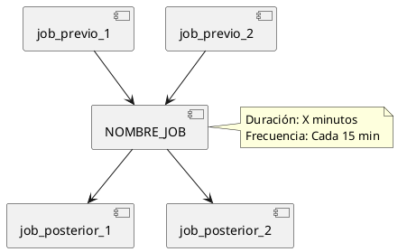
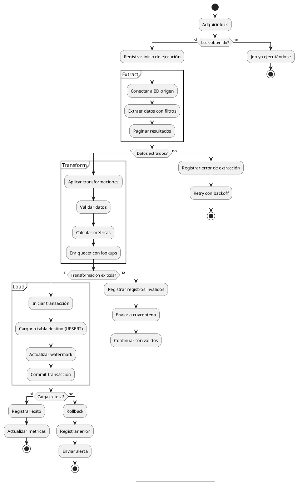
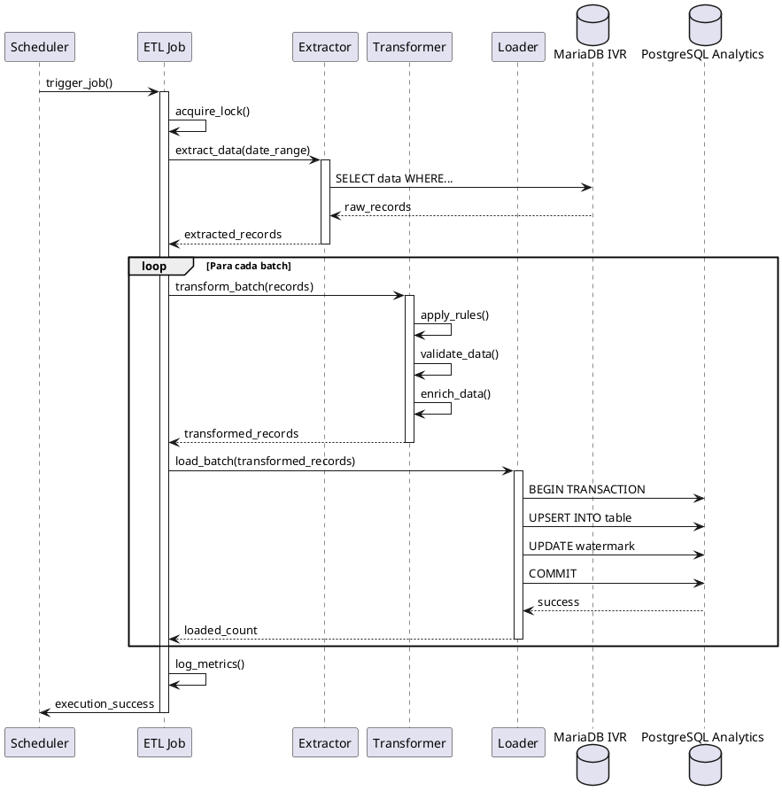
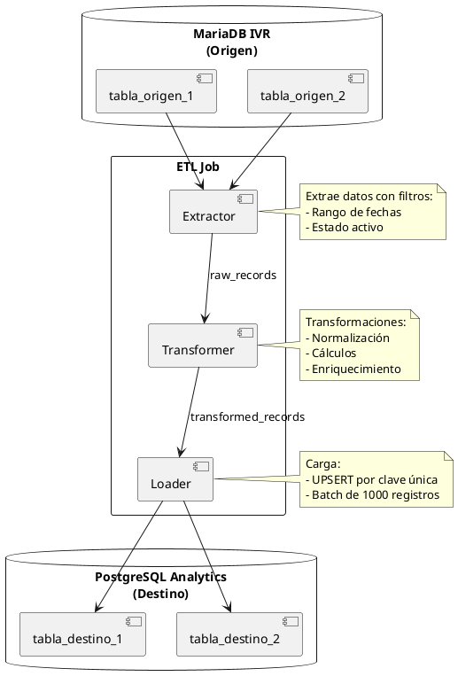

# Plantilla: Documentación de Job ETL

> **Instrucciones de uso**:
> 1. Copiar esta plantilla a la ubicación deseada (ej: `docs/implementacion/backend/diseno_detallado/etl_job_<nombre>.md`)
> 2. Reemplazar `[NOMBRE_JOB]` con el nombre real del job ETL
> 3. Completar cada sección con la información específica del job
> 4. Generar diagramas en PlantUML para el flujo de datos
> 5. Actualizar el front matter con IDs y relaciones correctas
> 6. Vincular con runbooks operativos si existen

---

## 1. Información del Job

### Identificación

**Nombre del job**: `[NOMBRE_JOB]`
**Tipo**: [Extractor / Transformador / Loader / Completo (E+T+L)]
**Ubicación**: `api/callcentersite/callcentersite/apps/etl/[archivo].py`

### Propósito

**Descripción**: [Descripción clara y concisa de QUÉ hace este job]

**Problema de negocio que resuelve**:
[Explicar el problema de negocio o necesidad que este job ETL satisface]

**Valor de negocio**:
- [Beneficio 1]
- [Beneficio 2]

### Programación y ejecución

**Frecuencia de ejecución**: [Cada 15 min / Cada hora / Diaria / Semanal / Bajo demanda]

**Schedule (cron expression)**: `[0 */15 * * *]` o `N/A`

**Horario recomendado**: [HH:MM - HH:MM timezone]

**Duración estimada**:
- **Normal**: [X minutos]
- **Máxima observada**: [Y minutos]
- **SLA**: [Z minutos]

**Ventana de ejecución permitida**: [Descripción de restricciones de horario]

### Modo de ejecución

**Comando de ejecución**:
```bash
python manage.py run_etl [NOMBRE_JOB] [opciones]
```

**Opciones disponibles**:
| Opción | Tipo | Default | Descripción |
|--------|------|---------|-------------|
| --date | fecha | hoy | Fecha para procesar (YYYY-MM-DD) |
| --full-load | flag | False | Forzar carga completa en lugar de incremental |
| --dry-run | flag | False | Ejecutar sin commit a BD |
| --batch-size | int | 1000 | Tamaño de lote para procesamiento |

**Ejemplos de ejecución**:
```bash
# Ejecución normal (programada)
python manage.py run_etl [NOMBRE_JOB]

# Reprocesar fecha específica
python manage.py run_etl [NOMBRE_JOB] --date=2025-11-01

# Carga completa (históricos)
python manage.py run_etl [NOMBRE_JOB] --full-load

# Dry run (prueba sin commit)
python manage.py run_etl [NOMBRE_JOB] --dry-run
```

### Configuración

**Variables de entorno requeridas**:
```bash
# Base de datos origen (IVR)
IVR_DATABASE_HOST=host
IVR_DATABASE_PORT=13306
IVR_DATABASE_NAME=ivr_db
IVR_DATABASE_USER=readonly_user
IVR_DATABASE_PASSWORD=password

# Base de datos destino (Analytics)
ANALYTICS_DATABASE_HOST=host
ANALYTICS_DATABASE_PORT=15432
ANALYTICS_DATABASE_NAME=analytics_db

# Configuración del job
ETL_[NOMBRE_JOB]_BATCH_SIZE=1000
ETL_[NOMBRE_JOB]_LOOKBACK_DAYS=7
```

**Settings de Django**:
```python
# settings/base.py
ETL_CONFIG = {
    '[NOMBRE_JOB]': {
        'enabled': True,
        'batch_size': 1000,
        'max_retries': 3,
        'timeout': 3600,  # segundos
    }
}
```

---

## 2. Fuente de datos (Extract)

### Base de datos origen

**Sistema fuente**: [MariaDB IVR / PostgreSQL / API Externa / Archivo CSV]
**Conexión**: [Nombre de la conexión en Django databases]
**Modo de acceso**: [Read-only / Read-write]

### Tablas/vistas consultadas

| Tabla/Vista | Esquema | Propósito | Volumen estimado |
|-------------|---------|-----------|------------------|
| [tabla_1] | [schema] | [propósito] | [X registros] |
| [tabla_2] | [schema] | [propósito] | [Y registros] |

### Query de extracción

#### 2.1 Query principal

**Archivo**: `extractors.py` - Clase `[ExtractorClass]`

**Query SQL**:
```sql
-- Descripción: [Qué extrae este query]
-- Filtros aplicados: [descripción de filtros]
SELECT
    campo1,
    campo2,
    CASE
        WHEN condicion THEN valor1
        ELSE valor2
    END AS campo_calculado,
    created_at
FROM tabla_origen
WHERE
    created_at >= %(fecha_inicio)s
    AND created_at < %(fecha_fin)s
    AND estado IN ('activo', 'completado')
ORDER BY created_at
LIMIT %(batch_size)s
OFFSET %(offset)s;
```

**Parámetros del query**:
| Parámetro | Tipo | Origen | Descripción |
|-----------|------|--------|-------------|
| fecha_inicio | datetime | calculado | Fecha inicio ventana de extracción |
| fecha_fin | datetime | calculado | Fecha fin ventana de extracción |
| batch_size | int | config | Tamaño del lote |
| offset | int | iteración | Offset para paginación |

**Índices requeridos en origen**:
```sql
CREATE INDEX idx_tabla_created_at ON tabla_origen(created_at);
CREATE INDEX idx_tabla_estado ON tabla_origen(estado);
```

### Filtros y condiciones

**Filtros de datos**:
1. **Temporal**: [Descripción del filtro temporal]
   - Ventana: [últimas 24 horas / últimos 7 días / etc.]
   - Campo: `[campo_fecha]`

2. **Estado**: [Descripción de filtros de estado]
   - Valores incluidos: [lista de valores]
   - Valores excluidos: [lista de valores]

3. **Otros filtros**: [Descripción]

**Estrategia de carga**:
- [x] **Incremental**: Solo registros nuevos o modificados
- [ ] **Full load**: Todos los registros cada vez
- [ ] **Delta**: Diferencias desde última ejecución
- [ ] **Snapshot**: Foto completa en momento específico

**Marcas de agua (watermarks)**:
- **Campo usado**: `[campo]`
- **Tabla de control**: `etl_watermarks`
- **Última marca**: [Dónde se guarda]

### Volumen de datos

**Volumen promedio por ejecución**: [X registros / Y MB]
**Volumen máximo observado**: [X registros / Y MB]
**Tasa de crecimiento**: [X registros/día]

**Performance de extracción**:
- **Tiempo de query**: [X segundos]
- **Throughput**: [Y registros/segundo]
- **Uso de red**: [Z MB/s]

---

## 3. Transformaciones (Transform)

### Arquitectura de transformación

**Estrategia**: [Row-by-row / Batch / Stream / En memoria / SQL]

**Archivo**: `transformers.py` - Clase `[TransformerClass]`

### Reglas de transformación

#### 3.1 Transformación: [Nombre de transformación]

**Descripción**: [Qué hace esta transformación]

**Input**:
```python
{
    'campo1': 'valor_origen',
    'campo2': 123,
    'campo_fecha': '2025-11-04 10:30:00'
}
```

**Output**:
```python
{
    'campo1_transformado': 'VALOR_ORIGEN',
    'campo2_normalizado': 123.00,
    'fecha_procesamiento': datetime(2025, 11, 4, 10, 30, 0),
    'campo_calculado': 456
}
```

**Lógica de transformación**:
```python
def transform_[nombre](self, row: dict) -> dict:
    """
    Descripción de la transformación.

    Args:
        row: Registro origen con estructura [descripción]

    Returns:
        dict: Registro transformado

    Raises:
        ValidationError: Si los datos no cumplen reglas de negocio
    """
    transformed = {}

    # Transformación 1: [descripción]
    transformed['campo1'] = row['campo1'].upper()

    # Transformación 2: [descripción]
    transformed['campo2'] = Decimal(row['campo2'])

    # Cálculo: [descripción de regla de negocio]
    if row['condicion']:
        transformed['campo_calculado'] = row['campo2'] * 1.1
    else:
        transformed['campo_calculado'] = row['campo2']

    return transformed
```

**Reglas de negocio aplicadas**:
1. [Regla 1]: [Descripción y justificación]
2. [Regla 2]: [Descripción y justificación]

**Validaciones**:
- [Validación 1]: [Descripción]
- [Validación 2]: [Descripción]

#### 3.2 Transformación: [Otra transformación]
<!-- Repetir estructura para cada transformación importante -->

### Agregaciones

**Nivel de agregación**: [Ninguno / Por día / Por hora / Por usuario / etc.]

**Métricas calculadas**:
| Métrica | Fórmula | Descripción |
|---------|---------|-------------|
| [metrica_1] | `SUM(campo)` | [descripción] |
| [metrica_2] | `AVG(campo)` | [descripción] |
| [metrica_3] | `COUNT(DISTINCT campo)` | [descripción] |

**Dimensiones**:
- [Dimensión 1]: [descripción]
- [Dimensión 2]: [descripción]

**Ejemplo de agregación**:
```python
def aggregate_metrics(self, records: List[dict]) -> dict:
    """Agrega métricas por [dimensión]."""
    aggregated = {
        'total': sum(r['campo'] for r in records),
        'promedio': mean(r['campo'] for r in records),
        'maximo': max(r['campo'] for r in records),
    }
    return aggregated
```

### Enriquecimiento de datos

**Fuentes de enriquecimiento**:
| Fuente | Tipo | Campo de join | Datos agregados |
|--------|------|---------------|-----------------|
| [tabla_lookup] | Tabla maestra | [campo] | [campos agregados] |
| [api_externa] | API REST | [campo] | [datos obtenidos] |

**Ejemplo**:
```python
def enrich_with_[fuente](self, row: dict) -> dict:
    """
    Enriquece registro con datos de [fuente].

    Args:
        row: Registro base

    Returns:
        dict: Registro enriquecido
    """
    lookup_value = self.get_lookup_value(row['key'])
    row['campo_enriquecido'] = lookup_value
    return row
```

### Limpieza y normalización

**Acciones de limpieza**:
1. **Normalización de texto**:
   - Trim espacios
   - Uppercase/lowercase
   - Eliminación de caracteres especiales

2. **Normalización de fechas**:
   - Conversión a UTC
   - Formato estándar: `YYYY-MM-DD HH:MM:SS`

3. **Manejo de nulos**:
   - Campos obligatorios: [lista]
   - Valores por defecto: [mapeo]

4. **Validación de tipos**:
   - [campo]: [tipo esperado]

### Manejo de errores en transformación

**Estrategia ante errores**:
- [ ] **Fail fast**: Detener proceso al primer error
- [x] **Registro y continuación**: Registrar error y continuar con siguiente registro
- [ ] **Quarantine**: Mover registros problemáticos a tabla de cuarentena
- [ ] **Retry**: Reintentar transformación

**Logs de errores**:
```python
logger.error(
    f"Error transformando registro {row['id']}: {error}",
    extra={
        'job': '[NOMBRE_JOB]',
        'row_id': row['id'],
        'error_type': type(error).__name__
    }
)
```

---

## 4. Destino (Load)

### Base de datos destino

**Sistema destino**: [PostgreSQL Analytics / Data Warehouse / etc.]
**Conexión**: [Nombre de la conexión en Django databases]
**Esquema**: `[schema_name]`

### Tablas de destino

| Tabla | Propósito | Estrategia de carga | Índices |
|-------|-----------|---------------------|---------|
| [tabla_dest_1] | [propósito] | [INSERT/UPSERT/TRUNCATE+LOAD] | [índices] |
| [tabla_dest_2] | [propósito] | [estrategia] | [índices] |

### Estrategia de carga

#### 4.1 Tabla: [tabla_destino_1]

**Modelo Django**: `[ModelName]`

**Estrategia**: [INSERT / UPSERT / BULK INSERT / TRUNCATE + LOAD]

**Código de carga**:
```python
def load_to_[tabla](self, transformed_records: List[dict]):
    """
    Carga registros transformados a tabla destino.

    Args:
        transformed_records: Lista de registros transformados

    Raises:
        IntegrityError: Si hay conflictos de unicidad
        DatabaseError: Si hay errores de BD
    """
    # Estrategia: Bulk insert con manejo de duplicados
    with transaction.atomic():
        # Opción 1: Bulk create (solo INSERT)
        ModelName.objects.bulk_create([
            ModelName(**record)
            for record in transformed_records
        ], batch_size=1000)

        # Opción 2: Bulk update or create (UPSERT)
        for record in transformed_records:
            ModelName.objects.update_or_create(
                unique_field=record['unique_field'],
                defaults=record
            )

        # Opción 3: SQL directo para performance
        self._execute_bulk_upsert(transformed_records)
```

**Campos de auditoría**:
```python
# Campos agregados automáticamente
{
    'etl_created_at': datetime.now(),
    'etl_updated_at': datetime.now(),
    'etl_job_name': '[NOMBRE_JOB]',
    'etl_run_id': '[uuid]',
    'source_id': '[id_en_origen]'
}
```

**Manejo de duplicados**:
- **Clave única**: `[campo1, campo2]`
- **Acción**: [SKIP / UPDATE / ERROR]

**Transaccionalidad**:
- [x] Todo o nada (atomic transaction)
- [ ] Commit por lotes
- [ ] Commit por registro

### Performance de carga

**Batch size**: [1000 registros]
**Throughput**: [Y registros/segundo]
**Uso de memoria**: [Z MB]

**Optimizaciones aplicadas**:
- [x] Bulk operations
- [x] Índices deshabilitados durante carga (si full load)
- [ ] Parallel workers
- [ ] Carga asíncrona

### Tablas de control

**Tabla de ejecuciones**: `etl_job_executions`
```python
{
    'job_name': '[NOMBRE_JOB]',
    'run_id': '[uuid]',
    'start_time': datetime,
    'end_time': datetime,
    'status': 'success/failed',
    'records_extracted': int,
    'records_transformed': int,
    'records_loaded': int,
    'errors_count': int,
    'error_message': str
}
```

**Tabla de watermarks**: `etl_watermarks`
```python
{
    'job_name': '[NOMBRE_JOB]',
    'watermark_field': '[campo]',
    'watermark_value': '[valor]',
    'updated_at': datetime
}
```

---

## 5. Dependencias y orden de ejecución

### Jobs que deben ejecutarse ANTES

| Job | Motivo | Criticidad |
|-----|--------|------------|
| [job_previo_1] | [razón] | [Alta/Media/Baja] |
| [job_previo_2] | [razón] | [Alta/Media/Baja] |

### Jobs que dependen de ESTE job

| Job | Motivo | Criticidad |
|-----|--------|------------|
| [job_posterior_1] | [razón] | [Alta/Media/Baja] |
| [job_posterior_2] | [razón] | [Alta/Media/Baja] |

### Diagrama de dependencias



### Recursos compartidos

**Locks o semáforos**:
- [x] Job usa lock para evitar ejecuciones concurrentes
- [ ] Job puede ejecutarse en paralelo
- [ ] Job requiere lock de tabla específica

**Código de lock**:
```python
import fcntl

def acquire_lock(self):
    """Adquiere lock para evitar ejecución concurrente."""
    lock_file = f'/tmp/etl_{self.job_name}.lock'
    self.lock_fd = open(lock_file, 'w')
    try:
        fcntl.flock(self.lock_fd, fcntl.LOCK_EX | fcntl.LOCK_NB)
        return True
    except IOError:
        logger.warning(f"Job {self.job_name} ya está ejecutándose")
        return False
```

---

## 6. Monitoreo y métricas

### KPIs del job

| Métrica | Umbral esperado | Alerta si |
|---------|-----------------|-----------|
| Duración | < [X] minutos | > [Y] minutos |
| Registros procesados | [min - max] | < min o > max |
| Tasa de error | < 1% | > 5% |
| Uso de memoria | < [Z] MB | > [W] MB |

### Logs importantes

**Nivel de logging**: [DEBUG / INFO / WARNING / ERROR]

**Logs clave a monitorear**:
```python
# Inicio de job
logger.info(f"Iniciando job {job_name}", extra={'run_id': run_id})

# Progreso
logger.info(
    f"Procesados {processed}/{total} registros ({percent}%)",
    extra={'job': job_name, 'batch': batch_num}
)

# Advertencias
logger.warning(
    f"Registro con datos incompletos: {record_id}",
    extra={'job': job_name, 'record': record}
)

# Errores
logger.error(
    f"Error procesando lote: {error}",
    extra={'job': job_name, 'batch': batch_num},
    exc_info=True
)

# Fin de job
logger.info(
    f"Job completado: {success_count} exitosos, {error_count} errores",
    extra={'job': job_name, 'run_id': run_id, 'duration': duration}
)
```

### Métricas de negocio

**Métricas expuestas**:
- `etl_job_duration_seconds{job="[NOMBRE_JOB]"}`: Duración de ejecución
- `etl_records_processed_total{job="[NOMBRE_JOB]"}`: Total de registros procesados
- `etl_records_failed_total{job="[NOMBRE_JOB]"}`: Total de registros con error
- `etl_job_status{job="[NOMBRE_JOB]"}`: Estado (1=success, 0=failed)

### Alertas configuradas

| Alerta | Condición | Severidad | Acción |
|--------|-----------|-----------|--------|
| Job fallido | status=failed | Critical | Notificar on-call + crear incident |
| Duración excesiva | duration > [X]min | Warning | Notificar equipo |
| Alta tasa de errores | error_rate > 5% | Warning | Review manual |
| Job no ejecutado | last_run > schedule+30min | Critical | Verificar scheduler |

### Dashboard

**Ubicación**: [Grafana / Kibana / Django Admin]

**Métricas visualizadas**:
- Duración por ejecución (serie temporal)
- Registros procesados por día
- Tasa de error histórica
- Estado de última ejecución

---

## 7. Recuperación ante fallos

### Estrategia de retry

**Configuración de reintentos**:
- **Max intentos**: [3]
- **Backoff strategy**: [Exponential: 2^attempt seconds]
- **Errores retriables**: [ConnectionError, Timeout, etc.]
- **Errores NO retriables**: [ValidationError, IntegrityError]

**Código de retry**:
```python
from tenacity import retry, stop_after_attempt, wait_exponential

@retry(
    stop=stop_after_attempt(3),
    wait=wait_exponential(multiplier=1, min=2, max=10)
)
def execute_with_retry(self):
    """Ejecuta job con retry automático."""
    try:
        self.extract()
        self.transform()
        self.load()
    except RetriableError as e:
        logger.warning(f"Error retriable: {e}, reintentando...")
        raise  # Trigger retry
    except NonRetriableError as e:
        logger.error(f"Error no retriable: {e}, abortando")
        raise  # No retry
```

### Rollback

**Estrategia de rollback**:
- [x] **Transaccional**: Rollback automático si falla algún paso
- [ ] **Manual**: Requiere ejecución de script de rollback
- [ ] **No aplicable**: Datos no se pueden revertir

**Procedimiento de rollback**:
```bash
# Si el job falló parcialmente, rollback a estado anterior
python manage.py etl_rollback [NOMBRE_JOB] --run-id=[uuid]
```

### Reprocesamiento manual

**Cuándo reproces ar**:
- Job falló completamente
- Datos de origen fueron corregidos
- Cambios en lógica de transformación requieren reprocesar

**Comando de reproceso**:
```bash
# Reprocesar fecha específica
python manage.py run_etl [NOMBRE_JOB] --date=2025-11-01 --force

# Reprocesar rango de fechas
python manage.py run_etl [NOMBRE_JOB] --date-from=2025-11-01 --date-to=2025-11-04

# Limpieza previa + reproceso
python manage.py run_etl [NOMBRE_JOB] --date=2025-11-01 --clean-first
```

**Runbook de reproceso**:
1. [Paso 1]: Verificar causa del fallo en logs
2. [Paso 2]: Corregir datos de origen si es necesario
3. [Paso 3]: Limpiar datos parciales en destino
4. [Paso 4]: Ejecutar reproceso
5. [Paso 5]: Verificar resultado
6. [Paso 6]: Actualizar watermarks si es necesario

### Datos de cuarentena

**Tabla de cuarentena**: `etl_quarantine`

```python
{
    'job_name': '[NOMBRE_JOB]',
    'run_id': '[uuid]',
    'source_record': json,  # Registro original
    'error_message': str,
    'error_type': str,
    'created_at': datetime,
    'resolved': bool,
    'resolved_at': datetime
}
```

**Revisión de cuarentena**:
```bash
# Ver registros en cuarentena
python manage.py etl_quarantine_review [NOMBRE_JOB]

# Reprocesar registros en cuarentena (después de corrección)
python manage.py etl_quarantine_retry [NOMBRE_JOB] --run-id=[uuid]
```

---

## 8. Diagramas de flujo

### 8.1 Diagrama de flujo general



### 8.2 Diagrama de secuencia



### 8.3 Diagrama de flujo de datos



---

## 9. Testing y validación

### Tests unitarios

**Ubicación**: `tests/etl/test_[NOMBRE_JOB].py`

**Tests implementados**:
- `test_extractor_query`: Valida query de extracción
- `test_transformer_logic`: Valida transformaciones
- `test_loader_upsert`: Valida estrategia de carga
- `test_error_handling`: Valida manejo de errores
- `test_watermark_update`: Valida actualización de marcas de agua

**Ejemplo de test**:
```python
import pytest
from callcentersite.apps.etl.jobs import [NombreJob]

@pytest.mark.django_db
class Test[NombreJob]:
    def test_extractor_filters(self):
        """Test que el extractor aplica filtros correctamente."""
        job = [NombreJob]()
        records = job.extract(date_from='2025-11-01', date_to='2025-11-02')

        assert len(records) > 0
        assert all(r['created_at'] >= '2025-11-01' for r in records)

    def test_transformer_calculation(self):
        """Test que las transformaciones calculan correctamente."""
        job = [NombreJob]()
        input_record = {'campo1': 100, 'campo2': 10}
        output = job.transform(input_record)

        assert output['campo_calculado'] == 110
```

### Tests de integración

**Ambiente de test**: [Desarrollo / Staging / Test DB]

**Datos de prueba**:
- [Descripción de fixtures o datos de prueba]
- [Ubicación de archivos de test data]

**Validaciones**:
1. Job se ejecuta sin errores
2. Datos se extraen correctamente
3. Transformaciones producen output esperado
4. Datos se cargan en destino
5. Watermarks se actualizan

### Validación de datos

**Queries de validación post-ejecución**:
```sql
-- Validación 1: Verificar conteo de registros
SELECT COUNT(*) FROM tabla_destino
WHERE etl_run_id = '[ultimo_run_id]';

-- Validación 2: Verificar integridad de sumas
SELECT SUM(campo_monetario) FROM tabla_destino
WHERE fecha = '[fecha_procesada]';

-- Validación 3: Detectar duplicados
SELECT campo_unico, COUNT(*)
FROM tabla_destino
GROUP BY campo_unico
HAVING COUNT(*) > 1;
```

**Checklist de validación**:
- [ ] Conteo de registros coincide con origen
- [ ] No hay duplicados en campos únicos
- [ ] Sumas de control coinciden
- [ ] Fechas están en rango esperado
- [ ] No hay valores nulos en campos obligatorios

---

## 10. Changelog y versionado

### Historial de cambios

| Versión | Fecha | Autor | Cambios |
|---------|-------|-------|---------|
| 1.0.0 | 2025-11-04 | [autor] | Versión inicial |

### Cambios en lógica de negocio

**Registro de cambios importantes**:
| Fecha | Descripción del cambio | Impacto | Requiere reproceso |
|-------|------------------------|---------|-------------------|
| [fecha] | [cambio] | [impacto] | [Sí/No] |

---

## 11. Referencias

### Documentación relacionada
- [App ETL](app_etl.md)
- [Database Design](database_design.md)
- [Runbook: Reprocesar ETL fallido](../../devops/runbooks/reprocesar_etl_fallido.md)

### ADRs relacionados
- [ADR-XXXX]: [Decisión arquitectónica relevante]

### Issues y mejoras
- [Issue #123]: [Descripción]
- [Mejora propuesta]: [Descripción]

---

## 12. Notas adicionales

<!-- Cualquier información adicional relevante -->

---

**Última actualización**: 2025-11-04
**Próxima revisión**: [fecha]
**Responsable**: [nombre]
**On-call**: [equipo/persona]
