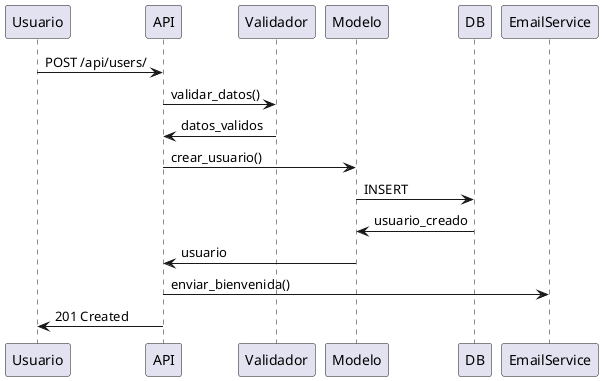

# Plan de Implementación: [Nombre de la Feature]

## Metadata

- **ID de Plan**: PLAN-[CATEGORIA]-[NUMERO]
- **Especificación**: [SPEC-XXX-NNN] (link a especificación)
- **Versión**: 1.0.0
- **Fecha de Creación**: YYYY-MM-DD
- **Autor**: [Nombre del desarrollador líder]
- **Estado**: [Planificación | En Progreso | Bloqueado | Completado]
- **Sprint/Release**: [Sprint número o versión target]

## Trazabilidad

- **Especificación**: [SPEC-XXX-NNN]
- **Issue de GitHub**: [#123]
- **Branch**: [feature/nombre-descriptivo]
- **Pull Request**: [#456] (cuando esté creado)
- **Requisitos**: [REQ-XXX-NNN, REQ-YYY-NNN]

---

## 1. Resumen del Plan

### 1.1 Objetivo

[Descripción concisa del objetivo de esta implementación en 2-3 oraciones]

### 1.2 Alcance de Implementación

**Incluido en este plan**:
- [Item 1]
- [Item 2]
- [Item 3]

**Excluido de este plan** (futuras iteraciones):
- [Item 1]
- [Item 2]

### 1.3 Estimaciones

- **Esfuerzo estimado**: [X story points o Y días]
- **Fecha inicio planeada**: YYYY-MM-DD
- **Fecha fin planeada**: YYYY-MM-DD
- **Desarrolladores asignados**: [Nombres]

---

## 2. Pre-requisitos

### 2.1 Conocimientos Requeridos

- [Tecnología/Framework 1]
- [Tecnología/Framework 2]
- [Dominio de negocio específico]

### 2.2 Setup de Entorno

**Dependencias a instalar**:
```bash
pip install nombre-paquete==1.2.3
```

**Servicios requeridos**:
- [PostgreSQL en puerto 15432]
- [MariaDB en puerto 13306]
- [Servicio externo X]

**Variables de entorno**:
```bash
export VARIABLE_NUEVA=valor
export OTRA_VARIABLE=valor
```

### 2.3 Documentación de Referencia

- [SPEC-XXX-NNN]: Especificación completa
- [ADR-YYYY-NNN]: Decisión arquitectónica relacionada
- [Link a documentación externa]

---

## 3. Arquitectura de la Solución

### 3.1 Componentes a Modificar

| Componente | Tipo de Cambio | Impacto | Archivos |
|------------|----------------|---------|----------|
| [Modelo User] | Modificación | Medio | `api/users/models.py` |
| [API endpoint] | Nuevo | Alto | `api/users/views.py`, `api/users/urls.py` |
| [Servicio de Email] | Nuevo | Bajo | `api/services/email_service.py` |

### 3.2 Diagrama de Flujo

[Diagrama en PlantUML o Mermaid mostrando el flujo de la implementación]



### 3.3 Modelo de Datos

**Cambios en modelos**:

```python
# Antes
class User(models.Model):
    username = models.CharField(max_length=150)
    email = models.EmailField()

# Después
class User(models.Model):
    username = models.CharField(max_length=150)
    email = models.EmailField()
    subscription_tier = models.CharField(  # NUEVO
        max_length=20,
        choices=TIER_CHOICES,
        default='free'
    )
```

**Migración requerida**:
```bash
python manage.py makemigrations users --name add_subscription_tier
python manage.py migrate
```

---

## 4. Plan de Tareas Detallado

### Fase 1: Setup y Preparación

#### Tarea 1.1: Crear feature branch

**Prioridad**: Crítica
**Estimación**: 5 min
**Asignado a**: [Nombre]
**Estado**: [ ] Pendiente

**Pasos**:
```bash
git checkout main
git pull origin main
git checkout -b feature/add-subscription-tiers
git push -u origin feature/add-subscription-tiers
```

**Criterio de completitud**:
- [ ] Branch creada localmente
- [ ] Branch pusheada a remote
- [ ] Branch protegida configurada (si aplica)

---

#### Tarea 1.2: Crear spec de feature (si no existe)

**Prioridad**: Crítica
**Estimación**: 2 horas
**Asignado a**: [Nombre]
**Estado**: [ ] Pendiente

**Pasos**:
1. Copiar `docs/plantillas/desarrollo/plantilla_spec.md`
2. Completar todas las secciones requeridas
3. Commit: `docs: agregar especificación de subscription tiers`

**Archivos a crear**:
- `docs/specs/subscription-tiers.md`

**Criterio de completitud**:
- [ ] Spec completado
- [ ] Revisado por Product Owner
- [ ] Aprobado por Tech Lead

---

#### Tarea 1.3: Configurar environment variables

**Prioridad**: Alta
**Estimación**: 15 min
**Asignado a**: [Nombre]
**Estado**: [ ] Pendiente

**Pasos**:
1. Agregar variables en `.env.example`:
   ```bash
   SUBSCRIPTION_FREE_LIMIT=10
   SUBSCRIPTION_PRO_LIMIT=100
   ```
2. Actualizar `.env` local
3. Documentar en `docs/infraestructura/devops/runbooks/environment_variables.md`

**Criterio de completitud**:
- [ ] Variables en `.env.example`
- [ ] Documentación actualizada
- [ ] CI/CD configurado con variables

---

### Fase 2: Modelo y Migraciones

#### Tarea 2.1: Modificar modelo User

**Prioridad**: Crítica
**Estimación**: 1 hora
**Asignado a**: [Nombre]
**Estado**: [ ] Pendiente

**Archivos a modificar**:
- `api/users/models.py`

**Código a agregar**:
```python
# En api/users/models.py

TIER_CHOICES = [
    ('free', 'Free'),
    ('pro', 'Professional'),
    ('enterprise', 'Enterprise'),
]

class User(AbstractUser):
    # ... campos existentes ...

    subscription_tier = models.CharField(
        max_length=20,
        choices=TIER_CHOICES,
        default='free',
        help_text="Nivel de suscripción del usuario"
    )
    subscription_start_date = models.DateTimeField(
        null=True,
        blank=True,
        help_text="Fecha de inicio de suscripción paga"
    )

    def get_usage_limit(self) -> int:
        """
        Retorna límite de uso según tier de suscripción.

        Returns:
            int: Límite de operaciones permitidas por mes

        Trazabilidad: REQ-SUB-001
        """
        limits = {
            'free': 10,
            'pro': 100,
            'enterprise': 1000,
        }
        return limits.get(self.subscription_tier, 10)
```

**Tests a crear**:
```python
# En api/users/tests/test_models.py

def test_user_get_usage_limit_free_tier():
    """
    Verifica que usuarios free tier tengan límite de 10.

    Caso de prueba: CP-SUB-001
    """
    user = User.objects.create(username='test', subscription_tier='free')
    assert user.get_usage_limit() == 10

def test_user_get_usage_limit_pro_tier():
    """Verifica que usuarios pro tier tengan límite de 100."""
    user = User.objects.create(username='test', subscription_tier='pro')
    assert user.get_usage_limit() == 100
```

**Criterio de completitud**:
- [ ] Modelo modificado con docstrings
- [ ] Tests unitarios creados
- [ ] Tests pasan localmente
- [ ] Type hints agregados
- [ ] MyPy pasa sin errores

---

#### Tarea 2.2: Crear y aplicar migración

**Prioridad**: Crítica
**Estimación**: 30 min
**Asignado a**: [Nombre]
**Estado**: [ ] Pendiente

**Pasos**:
```bash
# Crear migración
python manage.py makemigrations users --name add_subscription_fields

# Revisar migración generada
cat api/users/migrations/XXXX_add_subscription_fields.py

# Aplicar en local
python manage.py migrate

# Verificar
python manage.py showmigrations users
```

**Criterio de completitud**:
- [ ] Migración creada
- [ ] Migración aplicada en local
- [ ] Migración reversible (`migrate users XXXX` funciona)
- [ ] Datos existentes no afectados

---

### Fase 3: Lógica de Negocio y Servicios

#### Tarea 3.1: Crear servicio de suscripciones

**Prioridad**: Alta
**Estimación**: 2 horas
**Asignado a**: [Nombre]
**Estado**: [ ] Pendiente

**Archivos a crear**:
- `api/subscriptions/services.py`
- `api/subscriptions/__init__.py`

**Código**:
```python
# api/subscriptions/services.py

from typing import Optional
from datetime import datetime
from api.users.models import User

class SubscriptionService:
    """
    Servicio para gestionar suscripciones de usuarios.

    Trazabilidad: REQ-SUB-002
    """

    @staticmethod
    def upgrade_subscription(
        user: User,
        new_tier: str
    ) -> User:
        """
        Actualiza tier de suscripción de un usuario.

        Args:
            user: Usuario a actualizar
            new_tier: Nuevo tier ('free', 'pro', 'enterprise')

        Returns:
            Usuario actualizado

        Raises:
            ValueError: Si tier inválido
            PermissionError: Si downgrade no permitido

        Example:
            >>> service = SubscriptionService()
            >>> user = User.objects.get(pk=1)
            >>> service.upgrade_subscription(user, 'pro')
        """
        valid_tiers = ['free', 'pro', 'enterprise']
        if new_tier not in valid_tiers:
            raise ValueError(f"Tier inválido: {new_tier}")

        # Lógica de negocio aquí
        user.subscription_tier = new_tier
        if new_tier != 'free':
            user.subscription_start_date = datetime.now()
        user.save()

        return user
```

**Tests**:
```python
# api/subscriptions/tests/test_services.py

def test_upgrade_subscription_to_pro():
    """
    Verifica upgrade exitoso de free a pro.

    Caso de prueba: CP-SUB-010
    """
    user = User.objects.create(username='test', subscription_tier='free')
    service = SubscriptionService()

    updated_user = service.upgrade_subscription(user, 'pro')

    assert updated_user.subscription_tier == 'pro'
    assert updated_user.subscription_start_date is not None
```

**Criterio de completitud**:
- [ ] Servicio implementado
- [ ] Tests unitarios (cobertura > 80%)
- [ ] Docstrings completos
- [ ] Type hints completos
- [ ] Validaciones de negocio implementadas

---

#### Tarea 3.2: Agregar validación de límites

**Prioridad**: Alta
**Estimación**: 1.5 horas
**Asignado a**: [Nombre]
**Estado**: [ ] Pendiente

**Archivos a modificar**:
- `api/operations/views.py`

**Código a agregar**:
```python
# api/operations/views.py

from rest_framework.exceptions import PermissionDenied

def check_usage_limit(user: User) -> None:
    """
    Verifica que usuario no haya excedido su límite.

    Args:
        user: Usuario a verificar

    Raises:
        PermissionDenied: Si límite excedido

    Trazabilidad: REQ-SUB-003
    """
    current_usage = get_monthly_usage(user)
    limit = user.get_usage_limit()

    if current_usage >= limit:
        raise PermissionDenied(
            f"Límite mensual alcanzado ({limit}). "
            f"Actualiza tu suscripción para continuar."
        )
```

**Criterio de completitud**:
- [ ] Validación implementada
- [ ] Tests de límites
- [ ] Mensajes de error claros
- [ ] Logging agregado

---

### Fase 4: API y Endpoints

#### Tarea 4.1: Crear endpoint de upgrade

**Prioridad**: Alta
**Estimación**: 2 horas
**Asignado a**: [Nombre]
**Estado**: [ ] Pendiente

**Archivos a crear/modificar**:
- `api/subscriptions/views.py`
- `api/subscriptions/serializers.py`
- `api/subscriptions/urls.py`
- `api/urls.py`

**Código**:
```python
# api/subscriptions/serializers.py

from rest_framework import serializers

class UpgradeSubscriptionSerializer(serializers.Serializer):
    """
    Serializer para request de upgrade de suscripción.

    Trazabilidad: REQ-SUB-004
    """
    tier = serializers.ChoiceField(
        choices=['free', 'pro', 'enterprise'],
        help_text="Nuevo tier de suscripción"
    )

# api/subscriptions/views.py

from rest_framework.views import APIView
from rest_framework.response import Response
from rest_framework import status

class UpgradeSubscriptionView(APIView):
    """
    Endpoint para upgrade de suscripción.

    POST /api/subscriptions/upgrade/
    """
    permission_classes = [IsAuthenticated]

    def post(self, request):
        """Procesa upgrade de suscripción."""
        serializer = UpgradeSubscriptionSerializer(data=request.data)
        serializer.is_valid(raise_exception=True)

        service = SubscriptionService()
        user = service.upgrade_subscription(
            request.user,
            serializer.validated_data['tier']
        )

        return Response(
            {'message': 'Suscripción actualizada exitosamente'},
            status=status.HTTP_200_OK
        )
```

**Tests de API**:
```python
# api/subscriptions/tests/test_views.py

def test_upgrade_subscription_authenticated():
    """
    Verifica que usuario autenticado puede hacer upgrade.

    Caso de prueba: CP-SUB-020
    """
    client = APIClient()
    user = User.objects.create(username='test')
    client.force_authenticate(user=user)

    response = client.post('/api/subscriptions/upgrade/', {
        'tier': 'pro'
    })

    assert response.status_code == 200
    user.refresh_from_db()
    assert user.subscription_tier == 'pro'
```

**Criterio de completitud**:
- [ ] Endpoint implementado
- [ ] Serializers con validaciones
- [ ] Tests de API (happy path + error cases)
- [ ] Autenticación y permisos
- [ ] Documentación de API (OpenAPI/Swagger)

---

### Fase 5: Testing

#### Tarea 5.1: Tests unitarios completos

**Prioridad**: Crítica
**Estimación**: 3 horas
**Asignado a**: [Nombre]
**Estado**: [ ] Pendiente

**Cobertura mínima**: 85%

**Tests a crear**:
- [ ] Models: `api/users/tests/test_models.py`
- [ ] Services: `api/subscriptions/tests/test_services.py`
- [ ] Views: `api/subscriptions/tests/test_views.py`
- [ ] Serializers: `api/subscriptions/tests/test_serializers.py`

**Ejecutar tests**:
```bash
pytest api/subscriptions/ -v --cov=api/subscriptions --cov-report=term-missing
```

**Criterio de completitud**:
- [ ] Cobertura >= 85%
- [ ] Todos los tests pasan
- [ ] Happy paths cubiertos
- [ ] Edge cases cubiertos
- [ ] Error cases cubiertos

---

#### Tarea 5.2: Tests de integración

**Prioridad**: Alta
**Estimación**: 2 horas
**Asignado a**: [Nombre]
**Estado**: [ ] Pendiente

**Escenarios a probar**:
1. Flujo completo de upgrade
2. Validación de límites en operaciones
3. Rollback de suscripción

**Criterio de completitud**:
- [ ] Escenarios end-to-end funcionan
- [ ] Base de datos en estado consistente
- [ ] Transacciones manejan errores correctamente

---

### Fase 6: Documentación

#### Tarea 6.1: Documentar API

**Prioridad**: Media
**Estimación**: 1 hora
**Asignado a**: [Nombre]
**Estado**: [ ] Pendiente

**Archivos a crear/actualizar**:
- `docs/api/subscriptions.md`
- `docs/api/readme.md`

**Contenido**:
- Endpoints disponibles
- Request/response examples
- Error codes
- Authentication requirements

**Criterio de completitud**:
- [ ] API documentada completamente
- [ ] Ejemplos de curl incluidos
- [ ] Error responses documentados

---

#### Tarea 6.2: Actualizar changelog

**Prioridad**: Media
**Estimación**: 15 min
**Asignado a**: [Nombre]
**Estado**: [ ] Pendiente

**Archivo**: `CHANGELOG.md`

**Entrada a agregar**:
```markdown
## [Unreleased]

### Added
- Sistema de tiers de suscripción (free, pro, enterprise)
- Endpoint POST /api/subscriptions/upgrade/
- Validación de límites de uso por tier
- Modelo User extendido con campos subscription_tier y subscription_start_date
```

**Criterio de completitud**:
- [ ] Changelog actualizado
- [ ] Formato Keep a Changelog seguido

---

### Fase 7: Code Review y Merge

#### Tarea 7.1: Pre-commit checks

**Prioridad**: Crítica
**Estimación**: 30 min
**Asignado a**: [Nombre]
**Estado**: [ ] Pendiente

**Checks a ejecutar**:
```bash
# Linting
ruff check .
ruff format .

# Type checking
mypy api/

# Security
bandit -r api/
detect-secrets scan

# Tests
pytest --cov=api --cov-report=term-missing

# Emojis check
python scripts/check_no_emojis.py
```

**Criterio de completitud**:
- [ ] Ruff pasa sin errores
- [ ] MyPy pasa sin errores
- [ ] Bandit sin vulnerabilidades críticas
- [ ] No secrets detectados
- [ ] Tests pasan 100%
- [ ] Sin emojis

---

#### Tarea 7.2: Crear Pull Request

**Prioridad**: Crítica
**Estimación**: 30 min
**Asignado a**: [Nombre]
**Estado**: [ ] Pendiente

**Pasos**:
```bash
git push origin feature/add-subscription-tiers
gh pr create --title "feat: agregar sistema de tiers de suscripción" \
  --body "$(cat <<'EOF'
## Summary
Implementa sistema de tiers de suscripción (free, pro, enterprise) con validación de límites.

## Trazabilidad
- Spec: SPEC-SUB-001
- Issue: #123
- Requisitos: REQ-SUB-001, REQ-SUB-002, REQ-SUB-003

## Cambios
- [x] Modelo User extendido
- [x] Servicio de suscripciones
- [x] API endpoint de upgrade
- [x] Validación de límites
- [x] Tests (cobertura 87%)
- [x] Documentación

## Test plan
- [x] Tests unitarios pasan
- [x] Tests de integración pasan
- [x] Manual testing en local
- [ ] QA testing en staging

## Checklist
- [x] Código sigue guía de estilo
- [x] Tests incluidos
- [x] Documentación actualizada
- [x] Sin emojis
- [x] Changelog actualizado
EOF
)"
```

**Criterio de completitud**:
- [ ] PR creado con template completo
- [ ] Reviewers asignados
- [ ] Labels agregados
- [ ] CI/CD pasa

---

#### Tarea 7.3: Code review

**Prioridad**: Crítica
**Estimación**: Variable (esperar aprobaciones)
**Asignado a**: [Reviewers]
**Estado**: [ ] Pendiente

**Reviewers requeridos**: 2 mínimo

**Aspectos a revisar**:
- [ ] Lógica de negocio correcta
- [ ] Tests suficientes
- [ ] Seguridad (no hay vulnerabilidades)
- [ ] Performance (no hay N+1 queries)
- [ ] Documentación clara
- [ ] Adherencia a estándares

**Criterio de completitud**:
- [ ] 2+ aprobaciones
- [ ] Todos los comentarios resueltos
- [ ] CI/CD verde

---

#### Tarea 7.4: Merge a main

**Prioridad**: Crítica
**Estimación**: 5 min
**Asignado a**: [Tech Lead]
**Estado**: [ ] Pendiente

**Método**: Squash and merge

**Pasos**:
1. Verificar CI/CD verde
2. Verificar aprobaciones
3. Squash and merge
4. Eliminar branch feature

**Criterio de completitud**:
- [ ] Merge completado
- [ ] Branch feature eliminada
- [ ] Deploy a staging automático exitoso

---

## 5. Plan de Deploy

### 5.1 Deploy a Staging

**Cuándo**: Inmediatamente después de merge a main

**Pasos automáticos** (CI/CD):
1. Build de imagen Docker
2. Push a registry
3. Deploy a staging
4. Ejecutar migraciones
5. Health check

**Validaciones en staging**:
- [ ] Migraciones aplicadas exitosamente
- [ ] API endpoints responden
- [ ] Tests de smoke pasan

### 5.2 Deploy a Production

**Cuándo**: Después de QA approval en staging

**Pre-requisitos**:
- [ ] QA approval
- [ ] Product Owner approval
- [ ] Runbook de rollback preparado

**Pasos**:
```bash
# Crear release
git tag -a v1.2.0 -m "Release v1.2.0: Subscription tiers"
git push origin v1.2.0

# CI/CD automático se activa
```

**Post-deploy validation**:
- [ ] Health check pasa
- [ ] Monitoreo sin alertas
- [ ] Smoke tests pasan en prod

---

## 6. Riesgos y Mitigaciones

| Riesgo | Probabilidad | Impacto | Mitigación |
|--------|--------------|---------|------------|
| Migración falla en prod | Baja | Alto | Probar migración en staging con copia de datos de prod |
| Performance degradation | Media | Medio | Agregar índices en campos subscription_tier |
| Usuarios existentes afectados | Baja | Alto | Migración establece default='free' para usuarios existentes |
| Bug en validación de límites | Media | Alto | Cobertura de tests > 85%, QA exhaustivo |

---

## 7. Rollback Plan

Si se detectan problemas críticos:

**Paso 1**: Revertir deploy
```bash
# Rollback a versión anterior
kubectl rollout undo deployment/api-server
```

**Paso 2**: Revertir migración (si necesario)
```bash
python manage.py migrate users XXXX  # Migración anterior
```

**Paso 3**: Comunicación
- Notificar a stakeholders
- Actualizar status page
- Crear post-mortem

---

## 8. Métricas de Éxito

**Métricas técnicas**:
- Cobertura de tests: >= 85%
- Tiempo de respuesta API: < 200ms p95
- Error rate: < 0.1%

**Métricas de negocio**:
- Usuarios que hacen upgrade: >= 5% en primer mes
- Satisfacción de usuarios: >= 4.5/5
- Reducción en support tickets sobre límites: >= 50%

---

## 9. Checklist Final

Antes de considerar este plan completado:

### Desarrollo
- [ ] Todos los cambios de código implementados
- [ ] Todos los tests pasan
- [ ] Cobertura >= 85%
- [ ] Linters pasan sin errores
- [ ] Type checking pasa
- [ ] Security scan sin vulnerabilidades críticas

### Documentación
- [ ] API documentada
- [ ] Changelog actualizado
- [ ] README actualizado (si aplica)
- [ ] Runbooks creados

### Review y Merge
- [ ] PR creado con template completo
- [ ] 2+ aprobaciones recibidas
- [ ] Todos los comentarios resueltos
- [ ] CI/CD verde
- [ ] Merge completado

### Deploy
- [ ] Deploy a staging exitoso
- [ ] QA approval en staging
- [ ] Deploy a production exitoso
- [ ] Post-deploy validation pasa
- [ ] Monitoreo configurado

### Cierre
- [ ] Issue de GitHub cerrado
- [ ] Spec marcada como "Implementado"
- [ ] Post-mortem (si hubo incidentes)
- [ ] Retrospectiva completada

---

## 10. Lecciones Aprendidas

[Al finalizar, documentar lecciones aprendidas]

**Qué funcionó bien**:
- [Item 1]

**Qué mejorar**:
- [Item 1]

**Acciones para próxima iteración**:
- [Acción 1]

---

## 11. Historial de Cambios del Plan

| Versión | Fecha | Autor | Cambios |
|---------|-------|-------|---------|
| 1.0.0 | YYYY-MM-DD | [Nombre] | Plan inicial |

---

## Referencias

- [SPEC-XXX-NNN]: Especificación completa de la feature
- [Guía de desarrollo](../../gobernanza/procesos/guia_completa_desarrollo_features.md)
- [Constitution para agentes AI](../../gobernanza/agentes/constitution.md)
- [Guía de estilo](../../gobernanza/GUIA_ESTILO.md)

---

**Notas de uso de esta plantilla**:
1. Adaptar las fases según complejidad de la feature
2. Estimar tiempos realísticamente
3. Actualizar estado de tareas regularmente
4. Documentar blockers inmediatamente
5. Mantener sincronizado con spec
6. Versionar cuando haya cambios significativos en el plan
