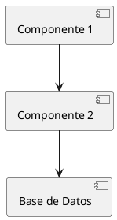

# Especificación de Feature: [Nombre de la Feature]

## Metadata

- **ID de Especificación**: SPEC-[CATEGORIA]-[NUMERO]
- **Nombre de Feature**: [Nombre descriptivo]
- **Versión**: 1.0.0
- **Fecha de Creación**: YYYY-MM-DD
- **Autor**: [Nombre del autor]
- **Estado**: [Borrador | En Revisión | Aprobado | Implementado | Obsoleto]
- **Prioridad**: [Crítica | Alta | Media | Baja]
- **Release Target**: [v1.2.3 o Sprint número]

## Trazabilidad

- **Requisitos relacionados**: [REQ-XXX-NNN, REQ-YYY-NNN]
- **Issue de GitHub**: [#123]
- **Epic relacionado**: [Si aplica]
- **ADR relacionado**: [Si existe decisión arquitectónica]
- **Casos de uso**: [REQ-UC-NNN]
- **Reglas de negocio**: [REQ-BR-NNN]

---

## 1. Resumen Ejecutivo

### 1.1 Descripción

[Descripción concisa de la feature en 2-3 párrafos. Explicar QUÉ es la feature y POR QUÉ es necesaria.]

### 1.2 Valor de Negocio

[Explicar el valor que aporta esta feature al negocio o usuarios]

**Métricas de éxito**:
- [Métrica 1]: [Objetivo cuantificable]
- [Métrica 2]: [Objetivo cuantificable]

### 1.3 Stakeholders

- **Product Owner**: [Nombre]
- **Patrocinador de Negocio**: [Nombre/Área]
- **Usuarios Finales**: [Descripción del tipo de usuarios]
- **Desarrolladores Asignados**: [Nombres]

---

## 2. Contexto y Motivación

### 2.1 Problema Actual

[Describir el problema que esta feature resuelve. Incluir pain points de usuarios.]

### 2.2 Solución Propuesta

[Describir en alto nivel cómo esta feature resuelve el problema.]

### 2.3 Alternativas Consideradas

[Listar alternativas que se consideraron y por qué no se eligieron]

1. **Alternativa 1**: [Descripción] - Razón de descarte: [...]
2. **Alternativa 2**: [Descripción] - Razón de descarte: [...]

---

## 3. Requisitos Funcionales

### 3.1 Casos de Uso

#### UC-1: [Nombre del Caso de Uso]

**Actor**: [Usuario/Sistema]

**Precondiciones**:
- [Precondición 1]
- [Precondición 2]

**Flujo Principal**:
1. [Paso 1]
2. [Paso 2]
3. [Paso 3]

**Flujo Alterno 1a**: [Condición]
1. [Paso alternativo]
2. [Regreso al flujo principal o fin]

**Postcondiciones**:
- [Postcondición 1]
- [Postcondición 2]

#### UC-2: [Siguiente caso de uso]

[Repetir estructura anterior]

### 3.2 Reglas de Negocio

| ID | Regla | Prioridad | Validación |
|----|-------|-----------|------------|
| BR-001 | [Descripción de la regla] | [Alta/Media/Baja] | [Cómo se valida] |
| BR-002 | [Descripción de la regla] | [Alta/Media/Baja] | [Cómo se valida] |

### 3.3 Criterios de Aceptación

Formato Given-When-Then:

**CA-001**: [Nombre del criterio]
```gherkin
Given [Contexto inicial]
When [Acción ejecutada]
Then [Resultado esperado]
```

**CA-002**: [Siguiente criterio]
```gherkin
Given [Contexto inicial]
And [Contexto adicional]
When [Acción ejecutada]
Then [Resultado esperado]
And [Resultado adicional esperado]
```

---

## 4. Requisitos No Funcionales

### 4.1 Performance

- **Tiempo de respuesta**: [X ms para Y% de requests]
- **Throughput**: [X requests por segundo]
- **Concurrencia**: [Número de usuarios simultáneos]

### 4.2 Seguridad

- **Autenticación**: [Requerimientos de autenticación]
- **Autorización**: [Roles y permisos requeridos]
- **Validación de Datos**: [Validaciones de input requeridas]
- **Auditoría**: [Qué acciones deben ser auditadas]

### 4.3 Disponibilidad

- **Uptime requerido**: [99.9%]
- **RTO (Recovery Time Objective)**: [X minutos/horas]
- **RPO (Recovery Point Objective)**: [X minutos/horas]

### 4.4 Escalabilidad

- **Crecimiento esperado**: [X% por año]
- **Límites de escala**: [Máximo número de registros/usuarios]

### 4.5 Usabilidad

- **Estándares UI/UX**: [Referencias a guías de diseño]
- **Accesibilidad**: [WCAG 2.1 nivel AA o similar]
- **Internacionalización**: [Idiomas soportados]

### 4.6 Mantenibilidad

- **Cobertura de tests**: [X%]
- **Documentación**: [Nivel requerido]
- **Logging**: [Nivel de logs requerido]

---

## 5. Diseño de Solución

### 5.1 Arquitectura de Alto Nivel

[Diagrama o descripción de la arquitectura. Puede usar PlantUML/Mermaid]



### 5.2 Modelo de Datos

**Entidades nuevas o modificadas**:

#### Modelo: [NombreModelo]

```python
class NombreModelo(models.Model):
 """
 [Descripción del modelo]

 Trazabilidad: REQ-XXX-NNN
 """
 campo_1 = models.CharField(max_length=100, help_text="...")
 campo_2 = models.IntegerField(default=0, help_text="...")

 class Meta:
 db_table = 'nombre_tabla'
 verbose_name = 'Nombre Modelo'
 verbose_name_plural = 'Nombres Modelos'
 indexes = [
 models.Index(fields=['campo_1']),
 ]
```

**Migraciones requeridas**:
- [Descripción de cambios en BD]

### 5.3 API Endpoints

#### Endpoint 1: [Nombre]

**URL**: `[GET/POST/PUT/DELETE] /api/v1/recurso/`

**Autenticación**: [JWT/Session/None]

**Permisos**: [Roles requeridos]

**Request**:
```json
{
 "campo1": "valor",
 "campo2": 123
}
```

**Response (200 OK)**:
```json
{
 "id": 1,
 "campo1": "valor",
 "campo2": 123,
 "created_at": "2025-11-06T10:00:00Z"
}
```

**Errores posibles**:
- `400 Bad Request`: [Cuando...]
- `401 Unauthorized`: [Cuando...]
- `403 Forbidden`: [Cuando...]
- `404 Not Found`: [Cuando...]

#### Endpoint 2: [Siguiente endpoint]

[Repetir estructura anterior]

### 5.4 Lógica de Negocio

[Describir algoritmos o lógica compleja que no sea obvia]

**Pseudocódigo**:
```
function calcular_descuento(producto, usuario):
 if usuario.es_premium:
 descuento = producto.precio * 0.20
 else if producto.en_oferta:
 descuento = producto.precio * 0.10
 else:
 descuento = 0

 return max(descuento, producto.descuento_minimo)
```

### 5.5 Interfaces de Usuario

[Wireframes o mockups si aplica. Puede ser links a Figma u otras herramientas]

**Pantallas afectadas**:
- [Pantalla 1]: [Descripción de cambios]
- [Pantalla 2]: [Descripción de cambios]

---

## 6. Dependencias

### 6.1 Dependencias Técnicas

- **Nuevas librerías requeridas**:
 - `nombre-libreria==1.2.3`: [Propósito]

- **Servicios externos**:
 - [API de terceros]: [Propósito y SLA]

### 6.2 Dependencias de Otras Features

- [SPEC-XXX-NNN]: [Relación]
- [SPEC-YYY-NNN]: [Relación]

### 6.3 Dependencias de Infraestructura

- [Cambios en configuración de servidor]
- [Nuevas variables de entorno]
- [Cambios en CI/CD]

---

## 7. Plan de Testing

### 7.1 Estrategia de Testing

- **Tests Unitarios**: [Cobertura X%]
- **Tests de Integración**: [Alcance]
- **Tests de API**: [Alcance]
- **Tests de UI**: [Si aplica]
- **Tests de Performance**: [Si aplica]
- **Tests de Seguridad**: [Si aplica]

### 7.2 Casos de Prueba

| ID | Descripción | Tipo | Prioridad | Criterio Aceptación |
|----|-------------|------|-----------|---------------------|
| CP-001 | [Descripción] | Unitario | Alta | CA-001 |
| CP-002 | [Descripción] | Integración | Media | CA-002 |

### 7.3 Datos de Prueba

[Describir datos necesarios para testing]

---

## 8. Plan de Despliegue

### 8.1 Estrategia de Deploy

- **Tipo**: [Rolling deployment | Blue-Green | Canary]
- **Rollback plan**: [Cómo hacer rollback si falla]

### 8.2 Configuración Requerida

**Variables de entorno**:
```bash
NUEVA_VARIABLE=valor_ejemplo
OTRA_VARIABLE=valor_ejemplo
```

**Cambios en settings.py**:
```python
# Agregar en INSTALLED_APPS
'nueva_app',
```

### 8.3 Migraciones de Datos

[Si se requieren migraciones de datos existentes]

**Script de migración**:
```python
# scripts/migrate_old_data.py
def migrate():
 # Lógica de migración
 pass
```

### 8.4 Documentación para Despliegue

- **Runbook**: [Link a runbook de deploy]
- **Rollback procedure**: [Link a procedimiento de rollback]

---

## 9. Plan de Rollout

### 9.1 Feature Flags

[Si se usarán feature flags para rollout gradual]

```python
if feature_enabled('nueva_feature'):
 # Código nuevo
else:
 # Código legacy
```

### 9.2 Fases de Rollout

1. **Fase 1 - Internal Alpha**: [Descripción]
2. **Fase 2 - Beta limitado**: [Descripción]
3. **Fase 3 - General Availability**: [Descripción]

### 9.3 Métricas de Monitoreo

**Métricas clave a monitorear**:
- [Métrica 1]: [Umbral de alerta]
- [Métrica 2]: [Umbral de alerta]

---

## 10. Riesgos e Impacto

### 10.1 Riesgos Identificados

| Riesgo | Probabilidad | Impacto | Mitigación |
|--------|--------------|---------|------------|
| [Descripción del riesgo] | [Alta/Media/Baja] | [Alto/Medio/Bajo] | [Estrategia de mitigación] |

### 10.2 Impacto en Usuarios

- **Usuarios afectados**: [Número o porcentaje]
- **Cambios en UX**: [Descripción]
- **Migración requerida**: [Si aplica]

### 10.3 Impacto en Sistema

- **Performance**: [Impacto esperado]
- **Almacenamiento**: [Crecimiento esperado en GB]
- **Costos**: [Impacto en costos de infraestructura]

---

## 11. Documentación

### 11.1 Documentación Técnica

- [ ] API Reference actualizado
- [ ] Database schema actualizado
- [ ] Architecture diagrams actualizados
- [ ] ADR creado (si aplica)

### 11.2 Documentación de Usuario

- [ ] User guide actualizado
- [ ] Release notes creados
- [ ] FAQs actualizados (si aplica)

### 11.3 Documentación de Operaciones

- [ ] Runbooks actualizados
- [ ] Monitoring dashboards creados
- [ ] Alertas configuradas

---

## 12. Criterios de Completitud

Esta feature se considera completa cuando:

- [ ] Todos los requisitos funcionales están implementados
- [ ] Todos los criterios de aceptación pasan
- [ ] Cobertura de tests cumple mínimo (X%)
- [ ] Todos los tests pasan en CI/CD
- [ ] Code review aprobado por al menos 2 desarrolladores
- [ ] Documentación actualizada y revisada
- [ ] Security scan sin vulnerabilidades críticas
- [ ] Performance tests cumplen requisitos
- [ ] Deploy exitoso en staging
- [ ] User acceptance testing completado
- [ ] Aprobación de Product Owner

---

## 13. Aprobaciones

| Rol | Nombre | Fecha | Firma/Aprobación |
|-----|--------|-------|------------------|
| Product Owner | | | |
| Arquitecto | | | |
| Tech Lead | | | |
| QA Lead | | | |

---

## 14. Historial de Cambios

| Versión | Fecha | Autor | Cambios |
|---------|-------|-------|---------|
| 1.0.0 | YYYY-MM-DD | [Nombre] | Versión inicial |

---

## Referencias

- [ISO 29148:2018](https://www.iso.org/standard/72089.html) - Requirements engineering
- [Guía de desarrollo de features](../../gobernanza/procesos/guia_completa_desarrollo_features.md)
- [Constitution para agentes AI](../../gobernanza/agentes/constitution.md)
- [Guía de estilo](../../gobernanza/GUIA_ESTILO.md)

---

**Notas de uso de esta plantilla**:
1. Reemplazar todos los placeholders entre corchetes [...]
2. Eliminar secciones que no apliquen (marcar como "No aplica" si es necesario mantener estructura)
3. Adjuntar diagramas en formato PlantUML o Mermaid cuando sea posible
4. Mantener trazabilidad a requisitos ISO 29148 siempre
5. Versionar este documento usando semver cuando haya cambios significativos
