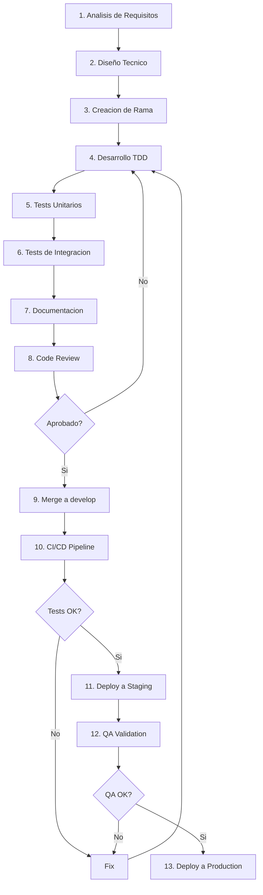

# PROC-BACK-001: Proceso de Desarrollo de Features Backend

**Proyecto:** IACT Call Center
**Fecha:** 2025-11-18
**Fase:** FASE 3 - TASK-035
**Version:** 1.0

## Objetivo

Definir el proceso completo para desarrollar nuevas funcionalidades en el backend Django/DRF, desde la concepcion hasta el despliegue, asegurando calidad, consistencia y trazabilidad.

---

## Alcance

**Aplica a:**
- Nuevos endpoints REST
- Nuevos modelos Django
- Nuevos servicios de negocio
- Nuevas capacidades del sistema de permisos
- Nuevos casos de uso

**No aplica a:**
- Hotfixes de produccion (ver PROC-BACK-003)
- Cambios de configuracion (ver PROC-BACK-004)
- Actualizacion de dependencias (ver PROC-BACK-002)

---

## Roles y Responsabilidades

| Rol | Responsabilidad |
|-----|-----------------|
| **Tech Lead** | Aprobar diseño tecnico, revisar PRs criticos |
| **Backend Developer** | Implementar feature completo (TDD) |
| **QA Engineer** | Validar tests y cobertura |
| **DevOps** | Validar estrategia de deployment |
| **Product Owner** | Aprobar requisitos funcionales |

---

## Flujo del Proceso



---

## FASE 1: Analisis de Requisitos

### Objetivo
Comprender completamente el requisito funcional antes de diseñar.

### Actividades

1. **Revisar documento de requisitos**
 - Leer UC (User Story/Use Case)
 - Identificar criterios de aceptacion
 - Detectar ambiguedades

2. **Analizar impacto**
 - Modelos afectados
 - Servicios afectados
 - APIs afectadas
 - Migraciones necesarias

3. **Identificar dependencias**
 - Features existentes relacionados
 - Integraciones externas
 - Cambios en otros modulos

### Entradas
- Documento de requisitos funcionales
- User stories / Use cases
- Criterios de aceptacion

### Salidas
- Analisis de impacto documentado
- Lista de dependencias
- Estimacion de esfuerzo

### Criterios de salida
- [ ] Requisitos claros y sin ambiguedades
- [ ] Impacto analizado y documentado
- [ ] Dependencias identificadas
- [ ] Estimacion validada con Tech Lead

---

## FASE 2: Diseño Tecnico

### Objetivo
Diseñar la solucion tecnica siguiendo principios SOLID y arquitectura de capas.

### Actividades

1. **Diseñar modelos Django**
 - Definir campos y tipos
 - Definir relaciones (ForeignKey, M2M)
 - Definir indices y constraints
 - Diseñar migraciones

2. **Diseñar servicios de negocio**
 - Definir metodos publicos
 - Definir validaciones de dominio
 - Definir transacciones necesarias

3. **Diseñar API REST**
 - Definir endpoints (URL patterns)
 - Definir metodos HTTP
 - Definir serializers
 - Definir permisos requeridos

4. **Diseñar tests**
 - Unit tests por servicio
 - Integration tests por endpoint
 - Edge cases y escenarios negativos

### Entradas
- Analisis de impacto
- Arquitectura actual del sistema
- Estandares de codigo (lineamientos_codigo.md)

### Salidas
- Diagrama de modelos (ER diagram)
- Especificacion de servicios
- Especificacion de API (OpenAPI)
- Plan de tests

### Criterios de salida
- [ ] Diseño revisado por Tech Lead
- [ ] Cumple principios SOLID
- [ ] Sigue arquitectura de capas
- [ ] Plan de tests completo

### Plantilla de Diseño
```markdown
# Diseño Tecnico: [NOMBRE-FEATURE]

## Modelos
- Modelo1: campos, relaciones, indices
- Modelo2: ...

## Servicios
- Servicio1.metodo1(): entrada, salida, logica
- Servicio1.metodo2(): ...

## API Endpoints
- GET /api/v1/recurso/: lista recursos
- POST /api/v1/recurso/: crea recurso

## Permisos
- sistema.dominio.recurso.ver
- sistema.dominio.recurso.crear

## Migraciones
- 0001_initial: crea tablas
- 0002_add_indices: agrega indices

## Tests
- test_crear_recurso_exitoso()
- test_crear_recurso_sin_permiso()
```

---

## FASE 3: Creacion de Rama

### Objetivo
Crear rama de trabajo siguiendo convencion de nombres.

### Actividades

1. **Actualizar develop**
 ```bash
 git checkout develop
 git pull origin develop
 ```

2. **Crear rama feature**
 ```bash
 git checkout -b feature/TASK-XXX-nombre-descriptivo
 ```

### Convencion de nombres
```
feature/TASK-XXX-descripcion-corta
bugfix/TASK-XXX-descripcion-corta
hotfix/TASK-XXX-descripcion-corta
```

### Criterios de salida
- [ ] Rama creada desde develop actualizado
- [ ] Nombre sigue convencion

---

## FASE 4: Desarrollo TDD (Test-Driven Development)

### Objetivo
Implementar la feature siguiendo metodologia TDD.

### Ciclo TDD (Red-Green-Refactor)

#### 4.1. RED: Escribir test que falla
```python
def test_crear_usuario_exitoso():
 # Arrange
 datos = {
 'username': 'test.user',
 'email': 'test@example.com',
 'password': 'SecureP@ss123'
 }

 # Act
 usuario = UserService.crear_usuario(**datos)

 # Assert
 assert usuario.username == 'test.user'
 assert usuario.email == 'test@example.com'
 assert usuario.is_active == True
```

#### 4.2. GREEN: Implementar codigo minimo
```python
class UserService:
 @staticmethod
 def crear_usuario(username, email, password):
 usuario = User.objects.create_user(
 username=username,
 email=email,
 password=password
 )
 return usuario
```

#### 4.3. REFACTOR: Mejorar codigo
```python
class UserService:
 @staticmethod
 def crear_usuario(username: str, email: str, password: str, segment: str = '') -> User:
 """
 UC-014: Crear usuario/agente.

 Args:
 username: Nombre de usuario unico
 email: Email del usuario
 password: Contraseña en texto plano
 segment: Segmento del usuario (opcional)

 Returns:
 Usuario creado

 Raises:
 ValidationError: Si username o email ya existen
 """
 # Validar username unico
 if User.objects.filter(username=username).exists():
 raise ValidationError(f'Username "{username}" ya existe')

 # Validar email unico
 if User.objects.filter(email=email).exists():
 raise ValidationError(f'Email "{email}" ya existe')

 # Crear usuario
 usuario = User.objects.create_user(
 username=username,
 email=email,
 password=password,
 segment=segment,
 status='ACTIVO'
 )
 return usuario
```

### Orden de implementacion

1. **Modelos** (`models.py`)
 - Definir clases de modelo
 - Ejecutar makemigrations
 - Ejecutar migrate

2. **Servicios** (`services.py`)
 - Implementar metodos de servicio
 - Aplicar validaciones de dominio
 - Manejar transacciones

3. **Serializers** (`serializers.py`)
 - Definir campos
 - Implementar validaciones
 - Customizar representacion

4. **Views** (`views.py`)
 - Implementar ViewSets o APIViews
 - Aplicar permisos
 - Documentar con docstrings

5. **URLs** (`urls.py`)
 - Registrar rutas
 - Configurar router

### Criterios de salida
- [ ] Todos los tests unitarios pasan
- [ ] Cobertura >= 80%
- [ ] Codigo sigue lineamientos
- [ ] Docstrings completos

---

## FASE 5: Tests Unitarios

### Objetivo
Asegurar que cada unidad funciona correctamente de forma aislada.

### Estructura de tests
```
tests/
 test_models.py # Tests de modelos
 test_services.py # Tests de servicios
 test_serializers.py # Tests de serializers
 test_views.py # Tests de views
 conftest.py # Fixtures compartidos
```

### Tests de Modelos
```python
# tests/test_models.py
def test_user_creation():
 usuario = User.objects.create_user(
 username='test',
 email='test@example.com',
 password='pass123'
 )
 assert usuario.is_active == True
 assert usuario.is_deleted == False

def test_user_mark_deleted():
 usuario = User.objects.create_user(
 username='test',
 email='test@example.com',
 password='pass123'
 )
 usuario.mark_deleted()
 assert usuario.is_deleted == True
 assert usuario.is_active == False
```

### Tests de Servicios
```python
# tests/test_services.py
def test_crear_usuario_exitoso():
 usuario = UserService.crear_usuario(
 username='nuevo',
 email='nuevo@example.com',
 password='SecureP@ss123'
 )
 assert usuario.username == 'nuevo'

def test_crear_usuario_duplicado_falla():
 UserService.crear_usuario(
 username='duplicado',
 email='duplicado@example.com',
 password='pass123'
 )

 with pytest.raises(ValidationError):
 UserService.crear_usuario(
 username='duplicado',
 email='otro@example.com',
 password='pass123'
 )
```

### Tests de Serializers
```python
# tests/test_serializers.py
def test_user_serializer_valid_data():
 data = {
 'username': 'test',
 'email': 'test@example.com',
 'password': 'SecureP@ss123'
 }
 serializer = UserSerializer(data=data)
 assert serializer.is_valid()

def test_user_serializer_invalid_email():
 data = {
 'username': 'test',
 'email': 'not-an-email',
 'password': 'SecureP@ss123'
 }
 serializer = UserSerializer(data=data)
 assert not serializer.is_valid()
 assert 'email' in serializer.errors
```

### Ejecutar tests
```bash
# Todos los tests
pytest

# Con cobertura
pytest --cov=callcentersite --cov-report=html

# Solo un modulo
pytest callcentersite/apps/users/tests/

# Solo un test especifico
pytest callcentersite/apps/users/tests/test_services.py::test_crear_usuario_exitoso
```

### Criterios de salida
- [ ] Cobertura >= 80%
- [ ] Todos los tests pasan
- [ ] Tests siguen patron AAA (Arrange-Act-Assert)
- [ ] Fixtures reutilizados cuando aplica

---

## FASE 6: Tests de Integracion

### Objetivo
Verificar que los componentes funcionan correctamente integrados.

### Tests de API
```python
# tests/test_api.py
@pytest.mark.django_db
def test_crear_usuario_via_api(api_client, auth_token):
 headers = {'Authorization': f'Bearer {auth_token}'}
 data = {
 'username': 'nuevo.usuario',
 'email': 'nuevo@example.com',
 'password': 'SecureP@ss123'
 }

 response = api_client.post('/api/v1/usuarios/', data=data, headers=headers)

 assert response.status_code == 201
 assert response.json()['username'] == 'nuevo.usuario'
 assert 'password' not in response.json() # No debe exponer password
```

### Tests de Permisos
```python
def test_crear_usuario_sin_permiso_falla(api_client, user_without_permission):
 token = generate_token(user_without_permission)
 headers = {'Authorization': f'Bearer {token}'}
 data = {
 'username': 'nuevo',
 'email': 'nuevo@example.com',
 'password': 'pass123'
 }

 response = api_client.post('/api/v1/usuarios/', data=data, headers=headers)

 assert response.status_code == 403
 assert 'permission' in response.json()['detail'].lower()
```

### Tests End-to-End
```python
def test_flujo_completo_crear_asignar_permisos(api_client, admin_token):
 # 1. Crear usuario
 response = api_client.post('/api/v1/usuarios/', data={...}, headers={...})
 usuario_id = response.json()['id']

 # 2. Asignar a grupo
 response = api_client.post('/api/v1/permissions/usuarios-grupos/', data={
 'usuario': usuario_id,
 'grupo': grupo_id
 }, headers={...})
 assert response.status_code == 201

 # 3. Verificar capacidades
 response = api_client.get(f'/api/v1/permissions/mis-capacidades/', headers={...})
 capacidades = response.json()
 assert 'sistema.operaciones.llamadas.ver' in capacidades
```

### Criterios de salida
- [ ] Todos los tests de integracion pasan
- [ ] Flujos completos validados
- [ ] Permisos validados
- [ ] Rate limiting validado (si aplica)

---

## FASE 7: Documentacion

### Objetivo
Documentar el feature para futuros desarrolladores y usuarios.

### Documentacion de Codigo

1. **Docstrings en servicios**
```python
def crear_usuario(username: str, email: str, password: str) -> User:
 """
 UC-014: Crear usuario/agente.

 Args:
 username: Nombre de usuario unico
 email: Email del usuario
 password: Contraseña en texto plano

 Returns:
 Usuario creado

 Raises:
 ValidationError: Si username o email ya existen

 Example:
 >>> usuario = UserService.crear_usuario(
 ... username='nuevo.agente',
 ... email='nuevo@company.com',
 ... password='SecureP@ss123'
 ... )
 """
```

2. **Docstrings en views**
```python
class UserViewSet(viewsets.ModelViewSet):
 """
 ViewSet para gestion de usuarios.

 Endpoints:
 - GET /usuarios/: Lista usuarios
 - POST /usuarios/: Crea usuario
 - GET /usuarios/{id}/: Obtiene usuario
 - PUT /usuarios/{id}/: Actualiza usuario
 - DELETE /usuarios/{id}/: Elimina usuario (soft delete)

 Permisos requeridos:
 - sistema.administracion.usuarios.ver (GET)
 - sistema.administracion.usuarios.crear (POST)
 - sistema.administracion.usuarios.editar (PUT/PATCH)
 - sistema.administracion.usuarios.eliminar (DELETE)
 """
```

### Documentacion de API

1. **Actualizar CATALOGO-APIs.md**
 - Agregar nuevos endpoints
 - Documentar parametros
 - Documentar respuestas

2. **Actualizar CATALOGO-ENDPOINTS.md**
 - Agregar matriz endpoint-vista-permiso

3. **Swagger/OpenAPI**
 - Se genera automaticamente con drf-spectacular
 - Verificar en `/api/docs/`

### Documentacion de Negocio

1. **Actualizar casos de uso**
 - UC-XXX: Descripcion del caso de uso
 - Precondiciones
 - Flujo principal
 - Flujos alternativos
 - Postcondiciones

2. **Actualizar ADRs si aplica**
 - Decisiones arquitectonicas tomadas
 - Alternativas consideradas
 - Consecuencias

### Criterios de salida
- [ ] Docstrings completos en codigo
- [ ] Catalogos actualizados
- [ ] Swagger generado correctamente
- [ ] UC documentado (si aplica)
- [ ] ADR creado (si aplica)

---

## FASE 8: Code Review

### Objetivo
Revisar el codigo antes de merge para asegurar calidad.

### Checklist de Code Review

#### Arquitectura
- [ ] Sigue arquitectura de capas
- [ ] Cumple principios SOLID
- [ ] No hay logica de negocio en views
- [ ] Servicios reutilizables

#### Codigo
- [ ] Nombres descriptivos (variables, funciones, clases)
- [ ] Funciones pequeñas (<50 lineas)
- [ ] No hay duplicacion (DRY)
- [ ] Manejo de errores apropiado
- [ ] Type hints en funciones publicas

#### Tests
- [ ] Cobertura >= 80%
- [ ] Tests unitarios e integracion
- [ ] Tests de casos negativos
- [ ] Fixtures bien organizados

#### Seguridad
- [ ] Validacion de entrada
- [ ] Permisos aplicados
- [ ] No hay secrets en codigo
- [ ] SQL injection prevenido (ORM)
- [ ] XSS prevenido (serializers)

#### Performance
- [ ] Queries optimizados (no N+1)
- [ ] Indices apropiados
- [ ] Paginacion implementada
- [ ] Cache considerado (si aplica)

#### Documentacion
- [ ] Docstrings completos
- [ ] Catalogos actualizados
- [ ] README actualizado (si aplica)

### Proceso de Review

1. **Crear Pull Request**
 ```bash
 git push origin feature/TASK-XXX-nombre
 # Crear PR en GitHub hacia develop
 ```

2. **Asignar reviewers**
 - Tech Lead (obligatorio)
 - 1-2 developers senior

3. **Esperar aprobacion**
 - Minimo 1 aprobacion de Tech Lead
 - Resolver comentarios

4. **Actualizar si necesario**
 ```bash
 # Hacer cambios solicitados
 git add .
 git commit -m "Aplicar feedback de code review"
 git push origin feature/TASK-XXX-nombre
 ```

### Criterios de salida
- [ ] PR aprobado por Tech Lead
- [ ] Comentarios resueltos
- [ ] CI pipeline verde
- [ ] Sin conflictos con develop

---

## FASE 9: Merge a Develop

### Actividades

1. **Actualizar rama con develop**
 ```bash
 git checkout develop
 git pull origin develop
 git checkout feature/TASK-XXX-nombre
 git merge develop
 # Resolver conflictos si existen
 git push origin feature/TASK-XXX-nombre
 ```

2. **Merge via PR**
 - Usar "Squash and merge" o "Merge commit"
 - Eliminar rama feature despues de merge

3. **Actualizar local**
 ```bash
 git checkout develop
 git pull origin develop
 git branch -d feature/TASK-XXX-nombre
 ```

### Criterios de salida
- [ ] Codigo mergeado a develop
- [ ] Rama feature eliminada
- [ ] Develop actualizado localmente

---

## FASE 10: CI/CD Pipeline

### Objetivo
Ejecutar validaciones automaticas en CI.

### Pipeline Steps

1. **Linting**
 ```bash
 flake8 callcentersite/
 black --check callcentersite/
 isort --check-only callcentersite/
 ```

2. **Tests**
 ```bash
 pytest --cov=callcentersite --cov-report=xml
 ```

3. **Security Scan**
 ```bash
 bandit -r callcentersite/
 safety check
 ```

4. **Build**
 ```bash
 docker build -t iact-backend:latest .
 ```

### Criterios de salida
- [ ] Linting OK
- [ ] Tests OK (cobertura >= 80%)
- [ ] Security scan OK
- [ ] Build OK

---

## FASE 11: Deploy a Staging

### Actividades

1. **Ejecutar migraciones**
 ```bash
 python manage.py migrate
 ```

2. **Deploy**
 - Via CD automatico
 - O manual segun proceso DevOps

3. **Smoke tests**
 - Health check: `/health/`
 - API docs: `/api/docs/`
 - Endpoint basico del feature

### Criterios de salida
- [ ] Deploy exitoso
- [ ] Migraciones aplicadas
- [ ] Smoke tests OK
- [ ] Logs sin errores

---

## FASE 12: QA Validation

### Objetivo
Validar feature en ambiente staging.

### Actividades

1. **Ejecutar plan de tests**
 - Tests funcionales
 - Tests de regresion
 - Tests de seguridad

2. **Validar criterios de aceptacion**
 - Revisar user story
 - Verificar cada criterio

3. **Reportar bugs (si existen)**
 - Crear tickets en backlog
 - Priorizar y asignar

### Criterios de salida
- [ ] Todos los tests QA pasan
- [ ] Criterios de aceptacion cumplidos
- [ ] No hay bugs criticos
- [ ] Aprobacion de QA

---

## FASE 13: Deploy a Production

### Actividades

1. **Aprobacion de Product Owner**
 - Revisar feature en staging
 - Aprobar para produccion

2. **Deploy**
 - Via CD automatico (si aprobado)
 - O manual en ventana de mantenimiento

3. **Monitoreo post-deploy**
 - Revisar logs (30 min)
 - Revisar metricas
 - Verificar health checks

4. **Rollback (si necesario)**
 - Si hay errores criticos
 - Seguir procedimiento de rollback

### Criterios de salida
- [ ] Deploy exitoso
- [ ] Feature funcionando en produccion
- [ ] Metricas normales
- [ ] Sin errores criticos

---

## Metricas del Proceso

| Metrica | Objetivo | Medicion |
|---------|----------|----------|
| **Tiempo de ciclo** | < 5 dias | Desde inicio a produccion |
| **Cobertura de tests** | >= 80% | pytest --cov |
| **Bugs post-deploy** | < 2 por feature | Tickets en 30 dias |
| **Code review time** | < 2 dias | Desde PR a merge |

---

## Herramientas Utilizadas

| Herramienta | Proposito |
|-------------|-----------|
| Git | Control de versiones |
| GitHub | Repositorio y PRs |
| pytest | Testing framework |
| flake8, black, isort | Linting y formateo |
| drf-spectacular | Documentacion API |
| Docker | Containerizacion |
| CI/CD (GitHub Actions) | Automatizacion |

---

## Referencias

- TDD_IMPLEMENTACION.md: Metodologia TDD
- lineamientos_codigo.md: Estandares de codigo
- CATALOGO-APIs.md: Inventario de APIs
- CATALOGO-SERVICIOS.md: Arquitectura de servicios

---

**Documento generado:** 2025-11-18
**Responsable:** Claude Code Agent
**Proximo review:** Trimestral
