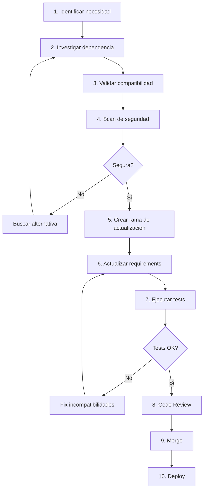

# PROC-BACK-002: Proceso de Gestion de Dependencias Backend

**Proyecto:** IACT Call Center
**Fecha:** 2025-11-18
**Fase:** FASE 3 - TASK-036
**Version:** 1.0

## Objetivo

Definir el proceso para gestionar dependencias Python del proyecto, incluyendo actualizaciones, validacion de seguridad, y mantenimiento de compatibilidad.

---

## Alcance

**Aplica a:**
- Actualizacion de dependencias existentes
- Incorporacion de nuevas dependencias
- Resolucion de vulnerabilidades de seguridad
- Limpieza de dependencias no utilizadas

**No aplica a:**
- Actualizacion de version de Python (requiere ADR)
- Cambio de framework principal (requiere ADR)
- Migracion a otras tecnologias

---

## Roles y Responsabilidades

| Rol | Responsabilidad |
|-----|-----------------|
| **Tech Lead** | Aprobar nuevas dependencias criticas |
| **Backend Developer** | Investigar y actualizar dependencias |
| **DevOps** | Validar impacto en deployment |
| **Security Engineer** | Validar dependencias sin vulnerabilidades |

---

## Archivos de Dependencias

### requirements.txt
Dependencias de produccion (minimas y locked).

```txt
# Web framework
Django==4.2.7
djangorestframework==3.14.0

# Database
psycopg2-binary==2.9.9
mysqlclient==2.2.0

# Auth
djangorestframework-simplejwt==5.3.0

# API Docs
drf-spectacular==0.26.5

# Storage
boto3==1.28.85

# Cache
redis==5.0.1

# Celery
celery==5.3.4

# Monitoring
sentry-sdk==1.38.0
```

### requirements-dev.txt
Dependencias de desarrollo y testing.

```txt
-r requirements.txt

# Testing
pytest==7.4.3
pytest-django==4.7.0
pytest-cov==4.1.0
pytest-mock==3.12.0
factory-boy==3.3.0

# Linting
flake8==6.1.0
black==23.11.0
isort==5.12.0
pylint==3.0.2

# Security
bandit==1.7.5
safety==2.3.5

# Type checking
mypy==1.7.1
django-stubs==4.2.6
```

---

## Flujo del Proceso



---

## FASE 1: Identificacion de Necesidad

### Tipos de actualizacion

| Tipo | Descripcion | Frecuencia | Urgencia |
|------|-------------|------------|----------|
| **Seguridad** | Vulnerabilidad reportada | Inmediato | Alta |
| **Bugfix** | Bug en dependencia | Segun impacto | Media |
| **Feature** | Nueva funcionalidad necesaria | Planificada | Baja |
| **Mantenimiento** | Actualizacion rutinaria | Mensual | Baja |
| **Nueva** | Incorporar nueva libreria | Segun proyecto | Media |

### Fuentes de identificacion

1. **Seguridad**
 - GitHub Dependabot alerts
 - `safety check` en CI
 - Suscripcion a security advisories

2. **Funcionalidad**
 - Requisitos de nuevos features
 - Mejoras de performance
 - Deprecation notices

3. **Mantenimiento**
 - Review mensual de dependencias
 - Actualizaciones de Django LTS

### Actividades

1. **Verificar alerta o necesidad**
 - Revisar alerta de seguridad
 - O identificar necesidad de nuevo feature

2. **Priorizar**
 - Critico: Vulnerabilidad de seguridad alta
 - Alto: Bug que afecta produccion
 - Medio: Nueva funcionalidad requerida
 - Bajo: Actualizacion rutinaria

### Criterios de salida
- [ ] Necesidad clara y documentada
- [ ] Prioridad asignada
- [ ] Ticket creado en backlog

---

## FASE 2: Investigacion de Dependencia

### Objetivo
Entender la dependencia antes de incorporarla o actualizarla.

### Checklist de investigacion

#### Informacion basica
- [ ] Nombre del paquete
- [ ] Version actual vs version objetivo
- [ ] Mantenimiento activo (ultimo commit)
- [ ] Numero de contributors
- [ ] Numero de stars/forks en GitHub

#### Licencia
- [ ] Licencia compatible (MIT, BSD, Apache 2.0)
- [ ] No es GPL (requiere codigo abierto)
- [ ] Revisada por legal (si aplica)

#### Seguridad
- [ ] Sin vulnerabilidades conocidas
- [ ] Scan con `safety check`
- [ ] Scan con `bandit` (si es critica)

#### Compatibilidad
- [ ] Compatible con Python 3.11
- [ ] Compatible con Django 4.2
- [ ] Compatible con DRF 3.14

#### Calidad
- [ ] Tests del paquete pasan
- [ ] Documentacion completa
- [ ] Changelog disponible

#### Alternativas
- [ ] Revisar al menos 2 alternativas
- [ ] Comparar features, performance, seguridad
- [ ] Justificar eleccion

### Herramientas

```bash
# Informacion del paquete
pip show <paquete>

# Vulnerabilidades
safety check --file requirements.txt

# Dependencias del paquete
pip show <paquete> | grep Requires

# Licencia
pip-licenses --from=mixed --format=markdown

# Ultimo release
pip index versions <paquete>
```

### Criterios de salida
- [ ] Dependencia investigada completamente
- [ ] Licencia compatible
- [ ] Sin vulnerabilidades criticas
- [ ] Alternativas consideradas

---

## FASE 3: Validacion de Compatibilidad

### Objetivo
Verificar que la dependencia no rompe el sistema existente.

### Matriz de compatibilidad

| Componente | Version requerida | Compatible |
|------------|-------------------|------------|
| Python | >= 3.11 | Verificar |
| Django | 4.2.x | Verificar |
| DRF | 3.14.x | Verificar |
| PostgreSQL | >= 13 | Verificar |
| Redis | >= 6.0 | Verificar |

### Verificacion local

1. **Crear entorno virtual limpio**
 ```bash
 python -m venv test_env
 source test_env/bin/activate
 ```

2. **Instalar dependencias**
 ```bash
 pip install Django==4.2.7 djangorestframework==3.14.0
 pip install <nueva-dependencia>==<version>
 ```

3. **Ejecutar tests**
 ```bash
 pytest
 ```

4. **Verificar imports**
 ```python
 python -c "import <paquete>; print(<paquete>.__version__)"
 ```

### Verificacion de conflictos

```bash
# Verificar conflictos de dependencias
pip check

# Ver arbol de dependencias
pipdeptree

# Resolver conflictos
pip-compile requirements.in --resolver=backtracking
```

### Criterios de salida
- [ ] Sin conflictos de dependencias
- [ ] Tests locales pasan
- [ ] Imports funcionan correctamente
- [ ] No hay deprecation warnings

---

## FASE 4: Scan de Seguridad

### Objetivo
Asegurar que la dependencia no introduce vulnerabilidades.

### Herramientas de scanning

#### 1. Safety (CVE database)
```bash
# Scan de vulnerabilidades
safety check --file requirements.txt --full-report

# Con threshold
safety check --file requirements.txt --severity high
```

#### 2. Bandit (static analysis)
```bash
# Scan de codigo
bandit -r <paquete-instalado>/

# Con severity threshold
bandit -r <paquete-instalado>/ -ll # Low severity
```

#### 3. pip-audit (PyPI advisories)
```bash
pip install pip-audit
pip-audit --requirement requirements.txt
```

### Evaluacion de vulnerabilidades

| Severidad | Accion |
|-----------|--------|
| **Critical** | Bloquear, buscar alternativa inmediata |
| **High** | Revisar con Security Engineer, mitigation plan |
| **Medium** | Documentar, plan de actualizacion |
| **Low** | Aceptar con justificacion |

### Excepciones de seguridad

Si se debe usar una dependencia con vulnerabilidad:

1. **Documentar en ADR**
 - Razon de uso
 - Mitigaciones aplicadas
 - Plan de remediacion

2. **Implementar mitigaciones**
 - Limitar acceso
 - Validacion adicional
 - Monitoreo especial

3. **Aprobar con Tech Lead y Security**

### Criterios de salida
- [ ] Sin vulnerabilidades criticas
- [ ] Vulnerabilidades high mitigadas o justificadas
- [ ] Scan de seguridad documentado

---

## FASE 5: Crear Rama de Actualizacion

### Actividades

1. **Actualizar develop**
 ```bash
 git checkout develop
 git pull origin develop
 ```

2. **Crear rama**
 ```bash
 git checkout -b chore/update-<paquete>-<version>
 ```

### Convencion de nombres

```
chore/update-django-4.2.8
chore/update-drf-3.14.1
chore/add-celery-5.3.4
chore/remove-unused-deps
```

### Criterios de salida
- [ ] Rama creada desde develop actualizado
- [ ] Nombre sigue convencion

---

## FASE 6: Actualizar Requirements

### Actividades

1. **Actualizar archivo requirements**
 ```txt
 # Antes
 Django==4.2.7

 # Despues
 Django==4.2.8
 ```

2. **Actualizar requirements-dev si aplica**
 ```txt
 pytest==7.4.3 # actualizar si necesario
 ```

3. **Generar hash locks (opcional pero recomendado)**
 ```bash
 pip-compile requirements.in --generate-hashes
 ```

4. **Actualizar en entorno local**
 ```bash
 pip install -r requirements.txt --upgrade
 pip install -r requirements-dev.txt --upgrade
 ```

5. **Verificar instalacion**
 ```bash
 pip list | grep <paquete>
 pip check
 ```

### Commit message

```
chore: update Django to 4.2.8

- Security fix for CVE-2023-XXXXX
- Improved performance in ORM queries
- No breaking changes

Refs: #TICKET-123
```

### Criterios de salida
- [ ] requirements.txt actualizado
- [ ] requirements-dev.txt actualizado (si aplica)
- [ ] pip check pasa
- [ ] Commit realizado

---

## FASE 7: Ejecutar Tests

### Objetivo
Verificar que la actualizacion no rompe funcionalidad existente.

### Tests a ejecutar

1. **Unit tests**
 ```bash
 pytest callcentersite/ -v
 ```

2. **Integration tests**
 ```bash
 pytest callcentersite/ --integration -v
 ```

3. **Coverage**
 ```bash
 pytest --cov=callcentersite --cov-report=html --cov-fail-under=80
 ```

4. **Linting**
 ```bash
 flake8 callcentersite/
 black --check callcentersite/
 isort --check-only callcentersite/
 ```

### Verificar deprecations

```bash
# Ejecutar con warnings
pytest -W default::DeprecationWarning

# Buscar deprecations en logs
grep -r "DeprecationWarning" .
```

### Si tests fallan

1. **Investigar causa**
 - Leer changelog de la dependencia
 - Buscar breaking changes
 - Revisar documentacion de migracion

2. **Aplicar fix**
 - Actualizar codigo para compatibilidad
 - Actualizar tests si API cambio
 - Documentar cambios

3. **Re-ejecutar tests**

### Criterios de salida
- [ ] Todos los tests pasan
- [ ] Cobertura >= 80%
- [ ] Linting OK
- [ ] Sin deprecation warnings criticos

---

## FASE 8: Code Review

### Checklist especifico para dependencias

#### Seguridad
- [ ] Scan de seguridad ejecutado
- [ ] Sin vulnerabilidades criticas
- [ ] Licencia compatible

#### Compatibilidad
- [ ] Compatible con Python/Django/DRF
- [ ] Sin conflictos con otras deps
- [ ] pip check pasa

#### Tests
- [ ] Tests pasan en CI
- [ ] No hay regresiones
- [ ] Coverage mantenido o mejorado

#### Documentacion
- [ ] Changelog revisado
- [ ] Breaking changes documentados
- [ ] Migration guide seguido (si aplica)

### Proceso

1. **Crear PR**
 ```markdown
 ## Actualizacion de dependencia: <paquete>

 **Version:** X.Y.Z -> X.Y.Z+1

 **Razon:**
 - Security fix: CVE-2023-XXXXX
 - Bugfix: <descripcion>

 **Breaking changes:**
 - Ninguno
 - O listar si existen

 **Tests:**
 - [x] Unit tests pasan
 - [x] Integration tests pasan
 - [x] Security scan OK

 **Documentacion:**
 - Changelog: <link>
 - Migration guide: <link>
 ```

2. **Asignar reviewers**
 - Tech Lead
 - Security Engineer (si es actualizacion de seguridad)

3. **Esperar aprobacion**

### Criterios de salida
- [ ] PR aprobado
- [ ] Comentarios resueltos
- [ ] CI pipeline verde

---

## FASE 9: Merge y Deploy

### Actividades

1. **Merge a develop**
 ```bash
 # Via PR en GitHub
 # Usar "Squash and merge"
 ```

2. **Deploy a staging**
 - Via CD automatico
 - Ejecutar smoke tests

3. **Validar en staging**
 - Health check: `/health/`
 - Verificar funcionalidad basica
 - Revisar logs

4. **Deploy a production** (si OK)
 - Via CD automatico o manual
 - Monitoreo post-deploy (30 min)

5. **Rollback** (si falla)
 - Revertir commit
 - Deploy version anterior

### Criterios de salida
- [ ] Mergeado a develop
- [ ] Desplegado en staging OK
- [ ] Desplegado en produccion OK
- [ ] Monitoreo post-deploy sin errores

---

## FASE 10: Documentacion

### Actividades

1. **Actualizar CHANGELOG.md**
 ```markdown
 ## [Unreleased]

 ### Dependencies
 - Updated Django from 4.2.7 to 4.2.8 (security fix CVE-2023-XXXXX)
 - Updated DRF from 3.14.0 to 3.14.1 (bugfix)
 ```

2. **Actualizar documentacion de deployment**
 - Si hay cambios en proceso de instalacion
 - Si hay nuevas variables de entorno

3. **Notificar al equipo**
 - Slack/email con resumen
 - Destacar breaking changes (si existen)

### Criterios de salida
- [ ] CHANGELOG.md actualizado
- [ ] Docs actualizadas (si aplica)
- [ ] Equipo notificado

---

## Casos Especiales

### Actualizacion de Django

**Frecuencia:** Cada release LTS (cada 2-3 años) o security patches

**Proceso:**
1. Revisar Django release notes
2. Revisar Django deprecation timeline
3. Actualizar codigo deprecado ANTES de actualizar
4. Ejecutar `python manage.py check --deploy`
5. Ejecutar todas las migraciones en test
6. Smoke test exhaustivo

### Actualizacion de DRF

**Frecuencia:** Segun necesidad o security patches

**Proceso:**
1. Revisar DRF changelog
2. Verificar compatibilidad con Django
3. Revisar serializers (API changes comunes)
4. Ejecutar tests de API

### Nuevas dependencias

**Proceso:**
1. Justificar necesidad (no reinventar rueda, pero tampoco dependencias innecesarias)
2. Revisar alternativas (minimo 2)
3. Aprobar con Tech Lead
4. Documentar decision en ADR (si es critica)

### Remover dependencias

**Proceso:**
1. Verificar que no se usa: `grep -r "import <paquete>" .`
2. Ejecutar tests sin la dependencia
3. Actualizar requirements
4. Commit con mensaje: `chore: remove unused dependency <paquete>`

---

## Herramientas

| Herramienta | Proposito | Comando |
|-------------|-----------|---------|
| **pip** | Package manager | `pip install <pkg>` |
| **safety** | Security scan | `safety check` |
| **bandit** | Static analysis | `bandit -r .` |
| **pip-audit** | Audit dependencies | `pip-audit` |
| **pipdeptree** | Dependency tree | `pipdeptree` |
| **pip-compile** | Lock dependencies | `pip-compile requirements.in` |
| **pip-licenses** | License checker | `pip-licenses` |

---

## Metricas

| Metrica | Objetivo |
|---------|----------|
| **Vulnerabilidades criticas** | 0 |
| **Vulnerabilidades high** | 0 (o mitigadas) |
| **Dependencias desactualizadas** | < 10 |
| **Tiempo de actualizacion (security)** | < 48 horas |
| **Tiempo de actualizacion (maintenance)** | < 1 semana |

---

## Calendario de Mantenimiento

| Actividad | Frecuencia | Responsable |
|-----------|------------|-------------|
| **Security scan** | Diario (CI) | Automatico |
| **Review de dependencias** | Mensual | Backend Team |
| **Actualizacion rutinaria** | Mensual | Backend Developer |
| **Audit completo** | Trimestral | Tech Lead |

---

## Referencias

- PROC-BACK-001: Desarrollo de Features
- lineamientos_codigo.md: Estandares de codigo
- Security Policy: Politica de seguridad

---

**Documento generado:** 2025-11-18
**Responsable:** Claude Code Agent
**Proximo review:** Trimestral
