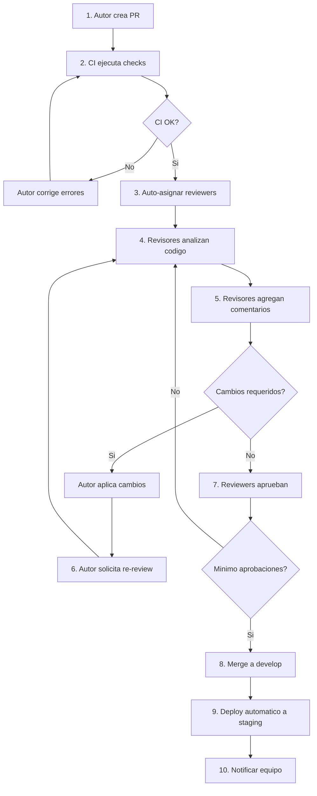

# PROC-BACK-003: Proceso de Code Review Backend

## Objetivo

Establecer un proceso sistematico y riguroso de revision de codigo para el backend Django/DRF, asegurando calidad, seguridad, mantenibilidad y adherencia a principios arquitectonicos antes de integrar cambios al repositorio principal.

---

## Alcance

### Aplica a

- Pull Requests de nuevas funcionalidades (features)
- Pull Requests de correccion de errores (bugfixes)
- Pull Requests de refactorizacion
- Pull Requests de actualizacion de dependencias
- Pull Requests de optimizacion de performance

### No aplica a

- Cambios en documentacion unicamente (requiere revision ligera)
- Cambios en configuracion de CI/CD (requiere revision de DevOps)
- Hotfixes criticos en produccion (requiere proceso acelerado)

---

## Roles y Responsabilidades

| Rol | Responsabilidad |
|-----|-----------------|
| **Autor del PR** | Preparar codigo, tests, documentacion y responder a comentarios |
| **Tech Lead** | Aprobar PRs criticos, revisar arquitectura, resolver conflictos |
| **Senior Developer** | Revisar codigo, sugerir mejoras, validar calidad |
| **QA Engineer** | Validar cobertura de tests y criterios de aceptacion |
| **Security Engineer** | Revisar aspectos de seguridad en PRs sensibles |

---

## Flujo del Proceso



---

## FASE 1: Preparacion del Pull Request

### Objetivo

El autor prepara un PR de alta calidad antes de solicitar revision.

### Actividades

#### 1.1 Checklist Pre-PR del Autor

Antes de crear el PR, verificar:

**Codigo:**
- [ ] Codigo cumple lineamientos de estilo (flake8, black, isort)
- [ ] Codigo sigue principios SOLID
- [ ] No hay duplicacion (DRY)
- [ ] Nombres descriptivos (variables, funciones, clases)
- [ ] Sin codigo comentado o codigo muerto
- [ ] Sin imports no utilizados

**Tests:**
- [ ] Tests unitarios completos (cobertura >= 80%)
- [ ] Tests de integracion para endpoints nuevos
- [ ] Tests de casos negativos y edge cases
- [ ] Todos los tests pasan localmente

**Documentacion:**
- [ ] Docstrings completos en funciones publicas
- [ ] Comentarios en logica compleja
- [ ] README actualizado (si aplica)
- [ ] CHANGELOG.md actualizado

**Seguridad:**
- [ ] Sin secretos en codigo (passwords, tokens, keys)
- [ ] Validacion de entrada implementada
- [ ] Permisos aplicados en endpoints
- [ ] Sin vulnerabilidades evidentes

#### 1.2 Crear Pull Request

**Plantilla de PR:**

```markdown
## Descripcion

Breve descripcion de los cambios realizados.

## Tipo de cambio

- [ ] Feature (nueva funcionalidad)
- [ ] Bugfix (correccion de error)
- [ ] Refactor (mejora de codigo sin cambio funcional)
- [ ] Performance (optimizacion)
- [ ] Chore (dependencias, configuracion)

## Relacionado con

- Issue: #123
- User Story: UC-XXX
- Task: TASK-XXX

## Cambios principales

- Cambio 1: Descripcion
- Cambio 2: Descripcion
- Cambio 3: Descripcion

## Tests

- [ ] Tests unitarios agregados/actualizados
- [ ] Tests de integracion agregados/actualizados
- [ ] Cobertura >= 80%
- [ ] Todos los tests pasan

## Checklist del Autor

- [ ] Codigo sigue lineamientos de estilo
- [ ] Docstrings completos
- [ ] Sin codigo comentado
- [ ] Sin secretos en codigo
- [ ] CHANGELOG.md actualizado

## Screenshots / Logs (si aplica)

[Agregar evidencia visual o logs relevantes]

## Notas adicionales

[Cualquier contexto adicional para reviewers]
```

### Criterios de salida

- [ ] PR creado con descripcion completa
- [ ] CI pipeline ejecutandose
- [ ] Reviewers asignados automaticamente

---

## FASE 2: Ejecucion de CI Automatico

### Objetivo

Validar automaticamente calidad basica del codigo antes de revision humana.

### CI Pipeline (GitHub Actions)

```yaml
name: Backend CI

on:
  pull_request:
    branches: [develop, main]

jobs:
  lint:
    runs-on: ubuntu-latest
    steps:
      - uses: actions/checkout@v3
      - name: Linting
        run: |
          flake8 callcentersite/
          black --check callcentersite/
          isort --check-only callcentersite/

  test:
    runs-on: ubuntu-latest
    steps:
      - uses: actions/checkout@v3
      - name: Run tests
        run: |
          pytest --cov=callcentersite --cov-report=xml --cov-fail-under=80

  security:
    runs-on: ubuntu-latest
    steps:
      - uses: actions/checkout@v3
      - name: Security scan
        run: |
          bandit -r callcentersite/ -ll
          safety check --file requirements.txt
```

### Checks Ejecutados

| Check | Herramienta | Criterio de Exito |
|-------|-------------|-------------------|
| Linting | flake8 | 0 errores |
| Formateo | black | Codigo formateado |
| Imports | isort | Imports ordenados |
| Tests | pytest | 100% pasan |
| Cobertura | pytest-cov | >= 80% |
| Seguridad | bandit | 0 vulnerabilidades high |
| Dependencias | safety | 0 CVEs criticos |

### Criterios de salida

- [ ] Todos los checks CI pasan
- [ ] Badge verde en PR

---

## FASE 3: Asignacion de Reviewers

### Objetivo

Asignar revisores apropiados segun tipo y criticidad del PR.

### Reglas de Asignacion

#### PRs Standard (Features, Bugfixes)

- **Minimo:** 1 Senior Developer
- **Recomendado:** 2 Developers (1 Senior + 1 Mid)

#### PRs Criticos (Seguridad, Migraciones, Arquitectura)

- **Obligatorio:** Tech Lead + Security Engineer (si aplica)
- **Recomendado:** 2+ Senior Developers

#### PRs de Dependencias

- **Obligatorio:** Tech Lead o Senior Developer
- **Recomendado:** DevOps (validar deployment)

### CODEOWNERS (GitHub)

```
# Backend
callcentersite/ @tech-lead @senior-dev-1 @senior-dev-2

# Seguridad
callcentersite/apps/permissions/ @tech-lead @security-engineer
callcentersite/apps/users/ @tech-lead @security-engineer

# Core
callcentersite/core/ @tech-lead

# Configuracion
callcentersite/settings/ @tech-lead @devops-lead
```

### Criterios de salida

- [ ] Reviewers asignados segun criticidad
- [ ] Reviewers notificados via GitHub/Slack

---

## FASE 4: Revision de Codigo

### Objetivo

Revisores analizan codigo en profundidad siguiendo checklist estructurado.

### Checklist de Revision Completo

#### 4.1 Arquitectura y Diseño

**Capas (Layered Architecture):**
- [ ] Logica de negocio en `services.py` (no en views)
- [ ] Views solo orquestan (llaman servicios)
- [ ] Modelos solo representan datos (no logica compleja)
- [ ] Serializers solo validan/transforman (no logica de negocio)

**Principios SOLID:**
- [ ] Single Responsibility: Clases/funciones una sola responsabilidad
- [ ] Open/Closed: Extensible sin modificar
- [ ] Liskov Substitution: Subclases intercambiables
- [ ] Interface Segregation: Interfaces especificas
- [ ] Dependency Inversion: Depender de abstracciones

**Patrones:**
- [ ] Uso apropiado de patrones (Factory, Strategy, Repository, etc.)
- [ ] No anti-patrones (God Object, Spaghetti Code, etc.)

#### 4.2 Codigo (Code Quality)

**Legibilidad:**
- [ ] Nombres descriptivos (no abreviaturas cripticas)
- [ ] Funciones <= 50 lineas (idealmente <= 20)
- [ ] Clases <= 300 lineas
- [ ] Sin complejidad ciclomatica alta (>= 10)

**Claridad:**
- [ ] Codigo auto-documentado (nombres explican intencion)
- [ ] Comentarios solo en logica no obvia
- [ ] Sin codigo comentado
- [ ] Sin TODOs sin issue asociado

**Consistencia:**
- [ ] Sigue convenciones del proyecto
- [ ] Estilo consistente con codebase existente
- [ ] Nomenclatura consistente (snake_case, PascalCase)

#### 4.3 Tests

**Cobertura:**
- [ ] Cobertura >= 80% (verificar en reporte)
- [ ] Lineas criticas cubiertas (servicios, validaciones)
- [ ] Sin branches no cubiertos en codigo critico

**Calidad de Tests:**
- [ ] Tests siguen patron AAA (Arrange-Act-Assert)
- [ ] Nombres descriptivos (`test_crear_usuario_con_email_duplicado_falla`)
- [ ] Un assert por test (idealmente)
- [ ] Sin logica compleja en tests
- [ ] Fixtures reutilizados apropiadamente

**Tipos de Tests:**
- [ ] Unit tests para servicios
- [ ] Integration tests para endpoints
- [ ] Tests de casos negativos
- [ ] Tests de edge cases

#### 4.4 Seguridad

**Validacion:**
- [ ] Validacion de entrada en serializers
- [ ] Sanitizacion de datos peligrosos
- [ ] Validacion de tipos y rangos

**Autorizacion:**
- [ ] Permisos aplicados en views (`@permission_required`)
- [ ] Validacion de ownership (usuario accede solo sus datos)
- [ ] Sin bypass de autorizacion

**Datos Sensibles:**
- [ ] Sin passwords en logs
- [ ] Sin tokens expuestos en responses
- [ ] Sin secretos hardcodeados

**Vulnerabilidades:**
- [ ] Sin SQL injection (usar ORM)
- [ ] Sin XSS (serializers escapan HTML)
- [ ] Sin CSRF (DRF csrf_token)
- [ ] Sin IDOR (validar ownership)

#### 4.5 Performance

**Queries:**
- [ ] Sin queries N+1 (usar `select_related`, `prefetch_related`)
- [ ] Indices apropiados en modelos
- [ ] Uso de `only()`, `defer()` cuando aplica
- [ ] Querys complejos optimizados

**Paginacion:**
- [ ] Endpoints de listas paginados
- [ ] Paginacion apropiada (100-200 items max)

**Cache:**
- [ ] Cache considerado para queries frecuentes
- [ ] Invalidacion de cache implementada

#### 4.6 Mantenibilidad

**Documentacion:**
- [ ] Docstrings en funciones publicas
- [ ] Docstrings formato Google/NumPy
- [ ] Type hints en funciones publicas
- [ ] Comentarios en logica compleja

**Testabilidad:**
- [ ] Codigo facil de testear (bajo acoplamiento)
- [ ] Dependencias inyectables
- [ ] Sin side effects ocultos

**Extensibilidad:**
- [ ] Codigo abierto a extension (Open/Closed)
- [ ] Abstracciones apropiadas

#### 4.7 Errores y Excepciones

**Manejo:**
- [ ] Excepciones apropiadas (ValidationError, NotFound, etc.)
- [ ] Mensajes de error descriptivos
- [ ] No exponer stack traces en produccion

**Logging:**
- [ ] Logging apropiado de errores
- [ ] Niveles de log correctos (DEBUG, INFO, WARNING, ERROR)
- [ ] Sin logging excesivo

### Comentarios de Revision

**Tipos de comentarios:**

1. **Bloqueante (Must Fix):**
   - Errores criticos
   - Vulnerabilidades de seguridad
   - Violaciones arquitectonicas serias
   - Formato: `MUST FIX: Descripcion del problema`

2. **Recomendacion (Should Fix):**
   - Mejoras de calidad
   - Optimizaciones importantes
   - Formato: `SHOULD FIX: Sugerencia de mejora`

3. **Sugerencia (Nice to Have):**
   - Mejoras menores
   - Opiniones personales
   - Formato: `SUGGESTION: Idea de mejora`

4. **Pregunta:**
   - Solicitar clarificacion
   - Formato: `QUESTION: Pregunta sobre logica`

5. **Aprobacion:**
   - Codigo bien hecho
   - Formato: `LGTM: Looks Good To Me`

### Criterios de salida

- [ ] Todos los aspectos del checklist revisados
- [ ] Comentarios agregados en GitHub
- [ ] Severidad asignada a comentarios

---

## FASE 5: Aplicacion de Cambios

### Objetivo

Autor aplica cambios solicitados por reviewers.

### Actividades

#### 5.1 Resolver Comentarios

1. **Leer todos los comentarios**
   - Entender feedback de reviewers
   - Priorizar comentarios bloqueantes

2. **Aplicar cambios**
   - Corregir errores bloqueantes
   - Aplicar recomendaciones
   - Considerar sugerencias

3. **Responder a comentarios**
   - Confirmar cambios aplicados
   - Justificar decisiones (si no se aplica feedback)
   - Solicitar clarificacion si necesario

#### 5.2 Push de Cambios

```bash
# Aplicar cambios
git add .
git commit -m "fix: aplicar feedback de code review"
git push origin feature/TASK-XXX-nombre
```

#### 5.3 Solicitar Re-Review

- Marcar comentarios como resueltos en GitHub
- Mencionar reviewers: `@reviewer re-review listo`
- CI ejecuta automaticamente

### Criterios de salida

- [ ] Todos los comentarios bloqueantes resueltos
- [ ] Cambios pusheados
- [ ] Re-review solicitado

---

## FASE 6: Aprobacion del PR

### Objetivo

Reviewers aprueban PR una vez cumple criterios de calidad.

### Politica de Aprobaciones

#### PRs Standard

- **Minimo:** 1 aprobacion de Senior Developer
- **Bloqueante:** Comentarios bloqueantes resueltos
- **CI:** Todos los checks verdes

#### PRs Criticos

- **Minimo:** 2 aprobaciones (Tech Lead + Senior Dev)
- **Bloqueante:** Sin comentarios pendientes
- **CI:** Todos los checks verdes
- **Aprobacion:** Security Engineer (si toca autenticacion/autorizacion)

#### PRs de Hotfix

- **Minimo:** 1 aprobacion de Tech Lead
- **Bloqueante:** Tests criticos pasan
- **Tiempo:** < 2 horas

### Estados de Aprobacion

| Estado | Descripcion |
|--------|-------------|
| Approved | Aprobado para merge |
| Request Changes | Cambios requeridos antes de merge |
| Comment | Comentarios sin bloquear |

### Criterios de salida

- [ ] Aprobaciones minimas obtenidas
- [ ] Sin comentarios bloqueantes pendientes
- [ ] CI verde

---

## FASE 7: Merge

### Objetivo

Integrar cambios aprobados a rama develop.

### Estrategias de Merge

#### Squash and Merge (Recomendado)

- **Uso:** Features, bugfixes
- **Ventaja:** Historia limpia, un solo commit
- **Mensaje:** `feat: descripcion del feature (#123)`

#### Merge Commit

- **Uso:** Branches de larga duracion
- **Ventaja:** Preserva historia completa
- **Mensaje:** `Merge branch 'feature/XXX' into develop`

#### Rebase and Merge

- **Uso:** Commits bien estructurados
- **Ventaja:** Historia lineal
- **Requisito:** Commits atomicos y descriptivos

### Proceso de Merge

1. **Verificar estado**
   ```bash
   # Verificar aprobaciones y CI
   gh pr view 123
   ```

2. **Merge via GitHub**
   - Usar boton "Squash and merge"
   - Editar mensaje de commit si necesario
   - Confirmar merge

3. **Eliminar rama**
   - GitHub elimina automaticamente (si configurado)
   - O manual: `git branch -d feature/TASK-XXX-nombre`

4. **Actualizar local**
   ```bash
   git checkout develop
   git pull origin develop
   ```

### Criterios de salida

- [ ] PR mergeado a develop
- [ ] Rama feature eliminada
- [ ] Develop actualizado

---

## FASE 8: Post-Merge

### Objetivo

Validar cambios en staging y notificar equipo.

### Actividades

#### 8.1 Deploy Automatico a Staging

CI/CD despliega automaticamente a staging:

```yaml
deploy-staging:
  runs-on: ubuntu-latest
  if: github.ref == 'refs/heads/develop'
  steps:
    - name: Deploy to staging
      run: |
        ./scripts/deploy-staging.sh
```

#### 8.2 Smoke Tests

Ejecutar tests basicos en staging:

- [ ] Health check: `GET /health/`
- [ ] API docs: `GET /api/docs/`
- [ ] Endpoint principal del feature

#### 8.3 Notificacion

Notificar al equipo via Slack:

```
PR #123 mergeado a develop y desplegado a staging
Feature: Autenticacion JWT
Autor: @developer
Reviewers: @senior-dev, @tech-lead
Staging: https://staging.iact.com
```

### Criterios de salida

- [ ] Deploy a staging exitoso
- [ ] Smoke tests OK
- [ ] Equipo notificado

---

## Metricas del Proceso

| Metrica | Objetivo | Medicion |
|---------|----------|----------|
| Tiempo de review | < 24 horas | Desde PR a primera review |
| Tiempo de aprobacion | < 48 horas | Desde PR a merge |
| Numero de reviewers | >= 1 | Numero de aprobaciones |
| Iteraciones de review | <= 2 | Numero de re-reviews |
| Comentarios por PR | 5-15 | Numero de comentarios |
| Bugs post-merge | < 1 por PR | Bugs en 30 dias |
| Cobertura promedio | >= 80% | pytest --cov |

---

## Herramientas

| Herramienta | Proposito |
|-------------|-----------|
| GitHub | Plataforma de PRs y reviews |
| GitHub Actions | CI/CD automatico |
| flake8 | Linting |
| black | Formateo |
| isort | Ordenamiento de imports |
| pytest | Testing |
| bandit | Security scanning |
| CodeClimate | Metricas de calidad |

---

## Referencias

- PROC-BACK-001: Desarrollo de Features Backend
- PROC-BACK-002: Gestion de Dependencias Backend
- PROC-BACK-004: Testing Estrategia
- lineamientos_codigo.md: Estandares de codigo
- CATALOGO-APIs.md: Documentacion de APIs

---

## Apendice A: Ejemplos de Comentarios

### Ejemplo 1: Comentario Bloqueante

```
MUST FIX: Vulnerabilidad de seguridad - IDOR

En la linea 45, el endpoint no valida que el usuario solo acceda a sus propios datos:

def get_queryset(self):
    return User.objects.all()  # PROBLEMA: retorna todos los usuarios

Debe filtrar por usuario autenticado:

def get_queryset(self):
    return User.objects.filter(id=self.request.user.id)

Referencia: OWASP A01:2021 - Broken Access Control
```

### Ejemplo 2: Recomendacion

```
SHOULD FIX: Query N+1

En la linea 67, hay un query N+1 que impacta performance:

usuarios = User.objects.all()
for usuario in usuarios:
    print(usuario.profile.avatar)  # N queries adicionales

Usar select_related para optimizar:

usuarios = User.objects.select_related('profile').all()
for usuario in usuarios:
    print(usuario.profile.avatar)  # 1 solo query
```

### Ejemplo 3: Sugerencia

```
SUGGESTION: Mejorar legibilidad

En la linea 89, el nombre `proc_usr_data` es poco descriptivo.

Sugerencia: `process_user_data` o `validate_user_input` segun contexto.
```

### Ejemplo 4: Aprobacion

```
LGTM: Excelente implementacion

- Arquitectura limpia (servicios + views)
- Tests completos (95% cobertura)
- Documentacion clara
- Sin vulnerabilidades

Aprobado para merge.
```

---

## Apendice B: Template de Checklist Rapida

```markdown
## Code Review Checklist

**Arquitectura:**
- [ ] Logica en servicios (no views)
- [ ] Cumple SOLID

**Codigo:**
- [ ] Nombres descriptivos
- [ ] Funciones <= 50 lineas
- [ ] Sin duplicacion (DRY)

**Tests:**
- [ ] Cobertura >= 80%
- [ ] Tests de casos negativos
- [ ] Patron AAA

**Seguridad:**
- [ ] Validacion de entrada
- [ ] Permisos aplicados
- [ ] Sin secretos en codigo

**Performance:**
- [ ] Sin queries N+1
- [ ] Paginacion implementada

**Documentacion:**
- [ ] Docstrings completos
- [ ] Catalogos actualizados

**Decision:**
- [ ] APPROVED
- [ ] REQUEST CHANGES
- [ ] COMMENT
```

---

**Documento generado:** 2025-11-18
**Responsable:** Equipo Backend
**Proximo review:** Trimestral
