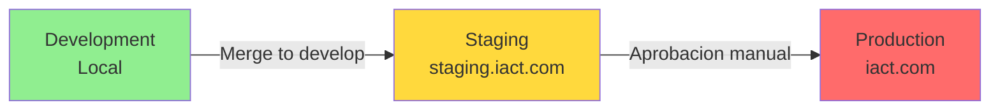
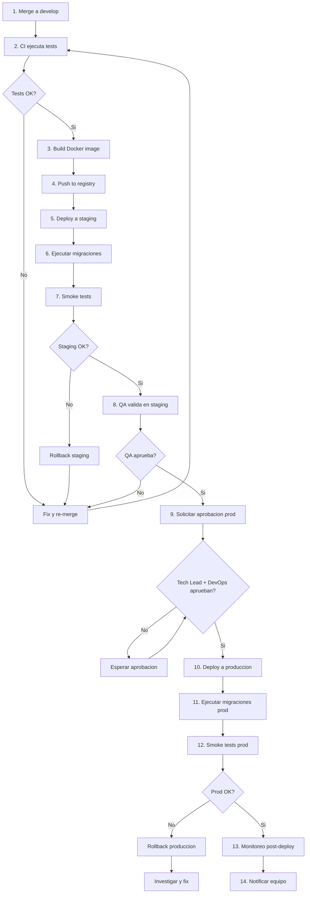
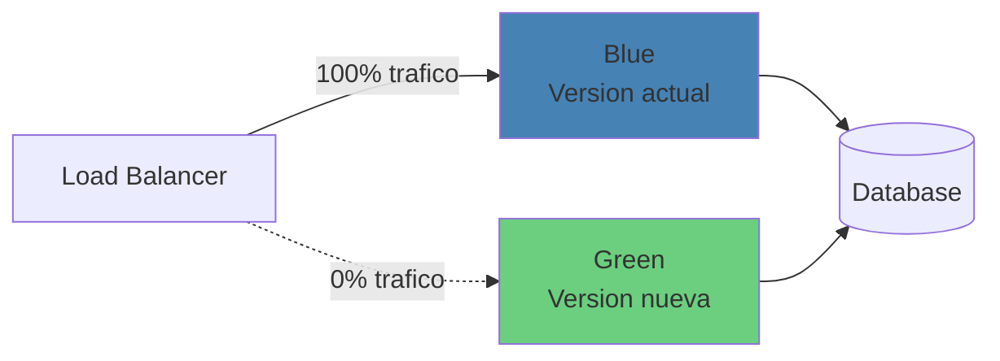
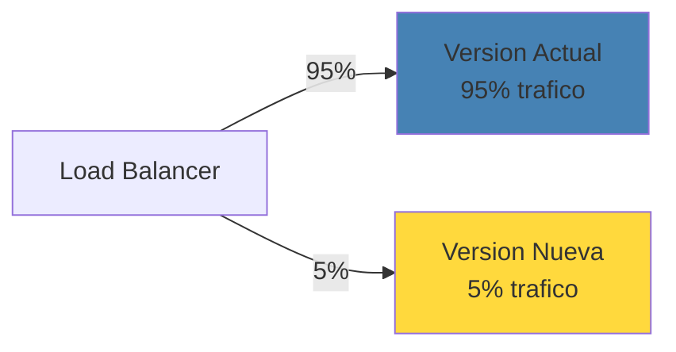

# PROC-BACK-005: Proceso de Deployment Backend

## Objetivo

Definir el proceso completo y seguro de despliegue del backend Django/DRF desde desarrollo hasta produccion, incluyendo estrategias de deployment, rollback, monitoreo y validacion post-deployment.

---

## Alcance

### Aplica a

- Deployment a staging (automatico desde develop)
- Deployment a produccion (manual con aprobacion)
- Hotfixes criticos en produccion
- Rollback de deployments fallidos
- Migraciones de base de datos
- Actualizaciones de dependencias

### No aplica a

- Deployment de frontend (ver proceso frontend)
- Deployment de infraestructura (ver proceso DevOps)
- Cambios de configuracion sin codigo (ver runbooks)

---

## Roles y Responsabilidades

| Rol | Responsabilidad |
|-----|-----------------|
| **DevOps Lead** | Aprobar deployments a produccion, configurar pipelines |
| **Tech Lead** | Validar cambios antes de deployment, aprobar releases |
| **Backend Developer** | Preparar codigo para deployment, ejecutar migraciones |
| **QA Engineer** | Validar en staging, ejecutar smoke tests |
| **Product Owner** | Aprobar features para produccion |

---

## Ambientes

### Arquitectura de Ambientes



### Caracteristicas de Ambientes

| Ambiente | URL | Proposito | Auto-deploy | Base de datos |
|----------|-----|-----------|-------------|---------------|
| **Development** | localhost:8000 | Desarrollo local | No | SQLite/Local Postgres |
| **Staging** | staging.iact.com | Testing pre-produccion | Si (desde develop) | Postgres replica |
| **Production** | iact.com | Sistema en vivo | No (manual) | Postgres principal |

---

## Flujo del Proceso



---

## FASE 1: Preparacion Pre-Deployment

### Objetivo

Asegurar que codigo esta listo para deployment.

### Checklist Pre-Deployment

#### 1.1 Validacion de Codigo

- [ ] Todos los tests pasan en CI
- [ ] Cobertura >= 80%
- [ ] Code review aprobado
- [ ] Sin comentarios bloqueantes pendientes
- [ ] Linting OK (flake8, black, isort)
- [ ] Security scan OK (bandit, safety)

#### 1.2 Validacion de Migraciones

```bash
# Verificar migraciones pendientes
python manage.py makemigrations --check --dry-run

# Verificar si hay migraciones sin aplicar
python manage.py showmigrations

# Verificar migraciones reversibles
python manage.py migrate --plan
```

**Checklist de migraciones:**
- [ ] Migraciones creadas y commiteadas
- [ ] Migraciones testeadas localmente
- [ ] Migraciones reversibles (si posible)
- [ ] Migraciones de datos separadas de esquema
- [ ] Migraciones de produccion validadas en staging

#### 1.3 Validacion de Dependencias

```bash
# Verificar dependencias actualizadas
pip list --outdated

# Scan de vulnerabilidades
safety check --file requirements.txt

# Verificar conflictos
pip check
```

**Checklist de dependencias:**
- [ ] requirements.txt actualizado
- [ ] Sin vulnerabilidades criticas (CVE)
- [ ] Sin conflictos de dependencias
- [ ] Dependencias testeadas en staging

#### 1.4 Validacion de Configuracion

**Variables de entorno:**
- [ ] `.env.staging` configurado
- [ ] `.env.production` configurado
- [ ] `SECRET_KEY` >= 256 bits
- [ ] `DEBUG=False` en produccion
- [ ] Credenciales de DB correctas
- [ ] Credenciales de servicios externos (S3, Redis, etc.)

**Settings:**
- [ ] `ALLOWED_HOSTS` configurado
- [ ] `CORS_ALLOWED_ORIGINS` configurado
- [ ] `SECURE_SSL_REDIRECT=True`
- [ ] `SESSION_COOKIE_SECURE=True`
- [ ] `CSRF_COOKIE_SECURE=True`

#### 1.5 Documentacion

- [ ] CHANGELOG.md actualizado
- [ ] Release notes creado
- [ ] Documentacion de API actualizada
- [ ] Runbooks actualizados (si aplica)

### Artefactos de entrada

- Codigo mergeado a develop
- Tests pasando en CI
- Migraciones listas
- Configuracion validada

### Criterios de salida

- [ ] Checklist pre-deployment completo
- [ ] Aprobacion de Tech Lead para continuar

---

## FASE 2: Build y Push de Imagen Docker

### Objetivo

Construir imagen Docker optimizada y subirla a registry.

### Dockerfile Optimizado

```dockerfile
# Dockerfile
FROM python:3.11-slim as builder

WORKDIR /app

# Instalar dependencias de sistema
RUN apt-get update && apt-get install -y \
    gcc \
    postgresql-client \
    && rm -rf /var/lib/apt/lists/*

# Instalar dependencias Python
COPY requirements.txt .
RUN pip install --no-cache-dir -r requirements.txt

# Imagen final
FROM python:3.11-slim

WORKDIR /app

# Copiar dependencias desde builder
COPY --from=builder /usr/local/lib/python3.11/site-packages /usr/local/lib/python3.11/site-packages
COPY --from=builder /usr/local/bin /usr/local/bin

# Instalar postgresql-client para migraciones
RUN apt-get update && apt-get install -y \
    postgresql-client \
    && rm -rf /var/lib/apt/lists/*

# Copiar codigo
COPY callcentersite /app/callcentersite
COPY manage.py /app/

# Usuario no-root
RUN useradd -m -u 1000 appuser && chown -R appuser:appuser /app
USER appuser

# Collectstatic
RUN python manage.py collectstatic --noinput

EXPOSE 8000

CMD ["gunicorn", "callcentersite.wsgi:application", "--bind", "0.0.0.0:8000", "--workers", "4"]
```

### Build y Push

```bash
# Build imagen
docker build -t iact-backend:${VERSION} .

# Tag imagen
docker tag iact-backend:${VERSION} registry.example.com/iact-backend:${VERSION}
docker tag iact-backend:${VERSION} registry.example.com/iact-backend:latest

# Push a registry
docker push registry.example.com/iact-backend:${VERSION}
docker push registry.example.com/iact-backend:latest
```

### CI Pipeline (GitHub Actions)

```yaml
name: Build and Deploy

on:
  push:
    branches: [develop, main]

jobs:
  build:
    runs-on: ubuntu-latest
    steps:
      - uses: actions/checkout@v3

      - name: Set version
        id: version
        run: echo "VERSION=$(git rev-parse --short HEAD)" >> $GITHUB_OUTPUT

      - name: Build Docker image
        run: |
          docker build -t iact-backend:${{ steps.version.outputs.VERSION }} .

      - name: Login to registry
        run: echo "${{ secrets.REGISTRY_PASSWORD }}" | docker login registry.example.com -u ${{ secrets.REGISTRY_USERNAME }} --password-stdin

      - name: Push image
        run: |
          docker tag iact-backend:${{ steps.version.outputs.VERSION }} registry.example.com/iact-backend:${{ steps.version.outputs.VERSION }}
          docker push registry.example.com/iact-backend:${{ steps.version.outputs.VERSION }}
```

### Artefactos de salida

- Imagen Docker en registry
- Tag de version (git commit SHA)
- Build logs

### Criterios de salida

- [ ] Imagen construida exitosamente
- [ ] Imagen pusheada a registry
- [ ] Tag versionado correctamente

---

## FASE 3: Deployment a Staging

### Objetivo

Desplegar automaticamente a staging desde develop.

### Deployment Script

```bash
#!/bin/bash
# scripts/deploy-staging.sh

set -e  # Exit on error

VERSION=${1:-latest}
ENVIRONMENT="staging"

echo "Deploying version $VERSION to $ENVIRONMENT..."

# 1. Pull imagen
docker pull registry.example.com/iact-backend:$VERSION

# 2. Stop contenedor anterior
docker stop iact-backend-staging || true
docker rm iact-backend-staging || true

# 3. Run migraciones
docker run --rm \
  --env-file .env.staging \
  registry.example.com/iact-backend:$VERSION \
  python manage.py migrate --noinput

# 4. Start nuevo contenedor
docker run -d \
  --name iact-backend-staging \
  --env-file .env.staging \
  -p 8000:8000 \
  --restart unless-stopped \
  registry.example.com/iact-backend:$VERSION

# 5. Health check
echo "Waiting for service to start..."
sleep 10

curl -f http://staging.iact.com/health/ || exit 1

echo "Deployment to $ENVIRONMENT completed successfully!"
```

### Kubernetes Deployment (Alternativa)

```yaml
# k8s/staging/deployment.yaml
apiVersion: apps/v1
kind: Deployment
metadata:
  name: iact-backend-staging
  namespace: staging
spec:
  replicas: 2
  selector:
    matchLabels:
      app: iact-backend
      env: staging
  template:
    metadata:
      labels:
        app: iact-backend
        env: staging
    spec:
      containers:
      - name: backend
        image: registry.example.com/iact-backend:VERSION
        ports:
        - containerPort: 8000
        envFrom:
        - secretRef:
            name: backend-staging-secrets
        livenessProbe:
          httpGet:
            path: /health/
            port: 8000
          initialDelaySeconds: 30
          periodSeconds: 10
        readinessProbe:
          httpGet:
            path: /health/
            port: 8000
          initialDelaySeconds: 10
          periodSeconds: 5
```

### Artefactos de salida

- Servicio desplegado en staging
- Logs de deployment
- Health check exitoso

### Criterios de salida

- [ ] Deployment exitoso
- [ ] Health check pasa
- [ ] Logs sin errores criticos

---

## FASE 4: Ejecucion de Migraciones

### Objetivo

Aplicar migraciones de base de datos de forma segura.

### Estrategia de Migraciones

#### Migraciones Seguras (Zero Downtime)

**DO:**
- Agregar columnas nuevas con `null=True` o `default`
- Agregar indices con `CREATE INDEX CONCURRENTLY` (Postgres)
- Agregar modelos nuevos
- Agregar relaciones opcionales

**DON'T:**
- Eliminar columnas directamente (hacer deprecation primero)
- Renombrar columnas directamente (hacer transicion)
- Cambiar tipos de datos destructivamente
- Eliminar tablas con datos

#### Proceso de Migracion

```bash
# 1. Backup de base de datos (CRITICO)
pg_dump -h localhost -U postgres iact_db > backup_pre_migration_$(date +%Y%m%d_%H%M%S).sql

# 2. Dry-run de migraciones
python manage.py migrate --plan

# 3. Ejecutar migraciones
python manage.py migrate --noinput

# 4. Verificar migraciones aplicadas
python manage.py showmigrations

# 5. Verificar integridad de datos
python manage.py check --deploy
```

#### Migraciones de Datos

```python
# Ejemplo: migracion de datos
from django.db import migrations

def migrar_datos(apps, schema_editor):
    User = apps.get_model('users', 'User')
    for user in User.objects.filter(segment__isnull=True):
        user.segment = 'DEFAULT'
        user.save()

def reverse_migrar_datos(apps, schema_editor):
    # Revertir si es posible
    pass

class Migration(migrations.Migration):
    dependencies = [
        ('users', '0001_initial'),
    ]

    operations = [
        migrations.RunPython(migrar_datos, reverse_migrar_datos),
    ]
```

### Rollback de Migraciones

```bash
# Rollback a migracion especifica
python manage.py migrate users 0003_previous_migration

# Verificar estado
python manage.py showmigrations users
```

### Criterios de salida

- [ ] Backup de DB creado
- [ ] Migraciones aplicadas exitosamente
- [ ] No hay errores en logs
- [ ] Verificacion de integridad OK

---

## FASE 5: Smoke Tests en Staging

### Objetivo

Validar funcionalidad basica en staging.

### Smoke Test Suite

```python
# tests/smoke/test_smoke_staging.py
import requests
import pytest

BASE_URL = "https://staging.iact.com"

class TestSmokeStaging:

    def test_health_check(self):
        response = requests.get(f"{BASE_URL}/health/")
        assert response.status_code == 200
        assert response.json()["status"] == "healthy"

    def test_api_docs_disponible(self):
        response = requests.get(f"{BASE_URL}/api/docs/")
        assert response.status_code == 200

    def test_login_endpoint_disponible(self):
        response = requests.post(f"{BASE_URL}/api/v1/auth/login/", json={
            "username": "test",
            "password": "wrongpass"
        })
        # Debe responder (aunque falle autenticacion)
        assert response.status_code in [400, 401]

    def test_base_de_datos_accesible(self):
        # Login con usuario test valido
        response = requests.post(f"{BASE_URL}/api/v1/auth/login/", json={
            "username": "smoke_test_user",
            "password": "smoke_test_pass"
        })
        assert response.status_code == 200
        assert "access_token" in response.json()

    def test_endpoint_protegido_requiere_autenticacion(self):
        response = requests.get(f"{BASE_URL}/api/v1/usuarios/")
        assert response.status_code == 401
```

### Ejecucion de Smoke Tests

```bash
# Ejecutar smoke tests
pytest tests/smoke/test_smoke_staging.py -v

# Con reporte
pytest tests/smoke/test_smoke_staging.py --html=report.html
```

### Criterios de salida

- [ ] Todos los smoke tests pasan
- [ ] Health check OK
- [ ] Endpoints criticos responden
- [ ] Base de datos accesible

---

## FASE 6: Validacion QA en Staging

### Objetivo

QA valida funcionalidad completa antes de produccion.

### Checklist de Validacion QA

#### Funcionalidad

- [ ] Features nuevos funcionan segun criterios de aceptacion
- [ ] Regresion: Features existentes siguen funcionando
- [ ] Flujos criticos de usuario funcionan end-to-end
- [ ] Permisos y autorizacion funcionan correctamente

#### Integracion

- [ ] Integraciones con servicios externos funcionan
- [ ] Webhooks funcionan correctamente
- [ ] Jobs background ejecutan correctamente
- [ ] Emails se envian correctamente

#### Performance

- [ ] Endpoints responden en tiempo aceptable (< 1s)
- [ ] Sin queries N+1 evidentes
- [ ] Paginacion funciona correctamente

#### Datos

- [ ] Migraciones aplicadas correctamente
- [ ] Datos de prueba consistentes
- [ ] Sin perdida de datos

### Reporte de QA

```markdown
## QA Validation Report - Staging

**Fecha:** 2025-11-18
**Version:** v1.2.3
**Ambiente:** Staging

**Features Validados:**
- [ ] UC-014: Crear usuario - OK
- [ ] UC-015: Asignar permisos - OK
- [ ] UC-016: Login JWT - OK

**Regresion:**
- [ ] Flujo de autenticacion - OK
- [ ] Gestion de usuarios - OK
- [ ] Permisos RBAC - OK

**Issues Encontrados:**
- Ninguno

**Decision:**
- [X] APROBADO para produccion
- [ ] RECHAZADO (requiere fixes)

**Aprobado por:** QA Engineer
**Fecha:** 2025-11-18
```

### Criterios de salida

- [ ] QA completo ejecutado
- [ ] Reporte de QA generado
- [ ] QA aprueba deployment a produccion

---

## FASE 7: Aprobacion para Produccion

### Objetivo

Obtener aprobaciones necesarias antes de deployment a produccion.

### Proceso de Aprobacion

#### Aprobadores Requeridos

| Rol | Responsabilidad | Bloqueante |
|-----|-----------------|------------|
| **QA Engineer** | Validar funcionalidad en staging | Si |
| **Tech Lead** | Aprobar cambios tecnicos | Si |
| **DevOps Lead** | Aprobar deployment y configuracion | Si |
| **Product Owner** | Aprobar features de negocio | No (recomendado) |

#### Request de Aprobacion

```markdown
## Production Deployment Request

**Version:** v1.2.3
**Branch:** develop
**Commit:** abc123def456

**Features Incluidos:**
- Feature 1: Autenticacion JWT (UC-014, UC-015)
- Feature 2: RBAC Engine (UC-016, UC-017)

**Cambios Tecnicos:**
- Migracion: Agregar tabla `user_sessions`
- Dependencia: Actualizar Django 4.2.7 -> 4.2.8
- Configuracion: Agregar variable `SESSION_TIMEOUT`

**Testing:**
- Tests unitarios: 523 passing
- Cobertura: 92%
- Smoke tests staging: All passing
- QA validation: Approved

**Riesgos:**
- Migracion agrega nueva tabla (reversible)
- Dependencia actualizada (testeada en staging)

**Rollback Plan:**
- Rollback a version v1.2.2
- Tiempo estimado: 5 minutos

**Downtime Esperado:**
- Ninguno (deployment zero-downtime)

**Aprobaciones:**
- [ ] QA Engineer: @qa-engineer
- [ ] Tech Lead: @tech-lead
- [ ] DevOps Lead: @devops-lead
- [ ] Product Owner: @product-owner

**Ventana de Deployment:**
- Fecha: 2025-11-18
- Hora: 22:00 - 23:00 (bajo trafico)
```

### Criterios de salida

- [ ] Aprobaciones minimas obtenidas
- [ ] Ventana de deployment programada
- [ ] Equipo notificado

---

## FASE 8: Deployment a Produccion

### Objetivo

Desplegar a produccion de forma segura y controlada.

### Pre-Deployment Checklist Produccion

- [ ] Backup de base de datos creado
- [ ] Aprobaciones obtenidas
- [ ] Ventana de deployment confirmada
- [ ] Equipo en standby
- [ ] Rollback plan listo
- [ ] Monitoreo activo

### Deployment Script Produccion

```bash
#!/bin/bash
# scripts/deploy-production.sh

set -e

VERSION=$1
ENVIRONMENT="production"

if [ -z "$VERSION" ]; then
  echo "Error: VERSION requerido"
  exit 1
fi

echo "=========================================="
echo "PRODUCTION DEPLOYMENT"
echo "Version: $VERSION"
echo "Environment: $ENVIRONMENT"
echo "=========================================="
read -p "Continuar? (yes/no): " confirm

if [ "$confirm" != "yes" ]; then
  echo "Deployment cancelado"
  exit 1
fi

# 1. Backup de DB
echo "Creating database backup..."
pg_dump -h prod-db.example.com -U postgres iact_prod > backup_pre_deploy_$(date +%Y%m%d_%H%M%S).sql

# 2. Pull imagen
echo "Pulling Docker image..."
docker pull registry.example.com/iact-backend:$VERSION

# 3. Run migraciones
echo "Running migrations..."
docker run --rm \
  --env-file .env.production \
  registry.example.com/iact-backend:$VERSION \
  python manage.py migrate --noinput

# 4. Blue-Green Deployment
echo "Starting new containers (green)..."
docker-compose -f docker-compose.prod.yml up -d --scale backend=4

# 5. Health check
echo "Health checking new containers..."
sleep 15
for i in {1..5}; do
  curl -f http://iact.com/health/ && break
  sleep 5
done

# 6. Switch traffic (load balancer)
echo "Switching traffic to new containers..."
./scripts/switch-traffic.sh green

# 7. Stop old containers (blue)
echo "Stopping old containers..."
sleep 30  # Grace period
docker-compose -f docker-compose.prod.yml down

echo "=========================================="
echo "DEPLOYMENT COMPLETED"
echo "=========================================="
```

### Estrategia Blue-Green Deployment



**Ventajas:**
- Zero downtime
- Rollback instantaneo (switch back)
- Validacion en vivo antes de switch

### Estrategia Rolling Update (Kubernetes)

```yaml
apiVersion: apps/v1
kind: Deployment
metadata:
  name: iact-backend-prod
spec:
  replicas: 4
  strategy:
    type: RollingUpdate
    rollingUpdate:
      maxSurge: 1        # Max 1 pod extra durante update
      maxUnavailable: 1  # Max 1 pod down durante update
  template:
    spec:
      containers:
      - name: backend
        image: registry.example.com/iact-backend:VERSION
```

### Criterios de salida

- [ ] Deployment ejecutado exitosamente
- [ ] Migraciones aplicadas
- [ ] Servicio respondiendo

---

## FASE 9: Smoke Tests en Produccion

### Objetivo

Validar funcionalidad basica en produccion inmediatamente post-deployment.

### Smoke Test Suite Produccion

```bash
# Ejecutar smoke tests contra produccion
pytest tests/smoke/test_smoke_production.py -v

# Tests criticos
pytest tests/smoke/test_smoke_production.py::test_health_check
pytest tests/smoke/test_smoke_production.py::test_login_endpoint
pytest tests/smoke/test_smoke_production.py::test_endpoint_critico
```

### Criterios de salida

- [ ] Todos los smoke tests pasan
- [ ] Health check OK
- [ ] Endpoints criticos responden
- [ ] No hay errores en logs

---

## FASE 10: Monitoreo Post-Deployment

### Objetivo

Monitorear sistema durante 30-60 minutos post-deployment.

### Metricas a Monitorear

| Metrica | Normal | Alerta | Accion |
|---------|--------|--------|--------|
| Response time (p95) | < 500ms | > 1s | Investigar |
| Error rate | < 1% | > 5% | Rollback |
| CPU usage | < 70% | > 90% | Escalar |
| Memory usage | < 80% | > 95% | Escalar |
| Request rate | Baseline | +200% | Validar |
| Database connections | < 80% pool | > 95% pool | Escalar |

### Dashboard de Monitoreo

```python
# Metricas clave en Grafana/DataDog
- Request rate (requests/sec)
- Response time (p50, p95, p99)
- Error rate (4xx, 5xx)
- Database query time
- CPU/Memory usage
- Active connections
```

### Logs a Revisar

```bash
# Logs de aplicacion
tail -f /var/log/iact-backend/app.log | grep ERROR

# Logs de migraciones
tail -f /var/log/iact-backend/migrations.log

# Logs de base de datos
tail -f /var/log/postgresql/postgresql.log | grep ERROR
```

### Criterios de salida

- [ ] Metricas normales durante 30-60 minutos
- [ ] No hay errores criticos en logs
- [ ] No hay alertas de monitoreo

---

## FASE 11: Rollback (si necesario)

### Objetivo

Revertir deployment si hay problemas criticos.

### Cuando Hacer Rollback

**Rollback inmediato si:**
- Error rate > 10%
- Servicio caido (health check falla)
- Perdida de datos detectada
- Vulnerabilidad de seguridad critica
- Migracion falla destructivamente

**Considerar rollback si:**
- Error rate > 5% por > 10 minutos
- Response time > 2s por > 10 minutos
- Features criticos no funcionan

### Proceso de Rollback

#### Rollback de Aplicacion (Blue-Green)

```bash
#!/bin/bash
# scripts/rollback-production.sh

VERSION_ANTERIOR=$1

echo "ROLLING BACK to version $VERSION_ANTERIOR"

# 1. Switch traffic back to blue (version anterior)
./scripts/switch-traffic.sh blue

# 2. Verificar health check
curl -f http://iact.com/health/ || exit 1

# 3. Stop green containers
docker-compose -f docker-compose.prod.yml down

echo "ROLLBACK COMPLETED"
```

#### Rollback de Migraciones

```bash
# Rollback a migracion anterior
python manage.py migrate users 0003_previous_migration

# Verificar estado
python manage.py showmigrations
```

#### Rollback de Base de Datos (ultima opcion)

```bash
# CUIDADO: Restaurar backup (perdida de datos)
pg_restore -h prod-db.example.com -U postgres -d iact_prod backup_pre_deploy_20251118_220000.sql
```

### Post-Rollback

1. **Notificar equipo**
   - Slack/Email urgente
   - Detallar razon de rollback

2. **Investigar causa**
   - Revisar logs
   - Reproducir error
   - Crear issue critico

3. **Documentar incidente**
   - Post-mortem report
   - Lecciones aprendidas
   - Acciones correctivas

### Criterios de salida

- [ ] Rollback ejecutado exitosamente
- [ ] Sistema funcionando normalmente
- [ ] Equipo notificado
- [ ] Incidente documentado

---

## FASE 12: Notificacion y Documentacion

### Objetivo

Notificar al equipo y documentar deployment.

### Notificacion Post-Deployment

```markdown
## Production Deployment - EXITOSO

**Version:** v1.2.3
**Fecha:** 2025-11-18 22:30
**Ejecutado por:** @devops-lead

**Features Desplegados:**
- Feature 1: Autenticacion JWT
- Feature 2: RBAC Engine

**Migraciones:**
- Creada tabla `user_sessions`
- Agregado indice en `users.username`

**Metricas Post-Deployment:**
- Response time: 350ms (p95)
- Error rate: 0.5%
- CPU usage: 45%
- Smoke tests: All passing

**Issues:**
- Ninguno

**Estado:** ESTABLE

**Rollback disponible:** v1.2.2
```

### Documentacion

#### Actualizar CHANGELOG.md

```markdown
## [1.2.3] - 2025-11-18

### Added
- Autenticacion JWT (UC-014, UC-015)
- RBAC Engine (UC-016, UC-017)

### Changed
- Actualizado Django 4.2.7 -> 4.2.8

### Fixed
- Bug en validacion de permisos (#123)

### Database
- Migration: 0005_create_user_sessions
```

#### Actualizar Deployment Log

```markdown
# Deployment Log

| Version | Fecha | Ambiente | Ejecutado por | Estado | Issues |
|---------|-------|----------|---------------|--------|--------|
| v1.2.3 | 2025-11-18 | Production | DevOps Lead | EXITOSO | 0 |
| v1.2.2 | 2025-11-15 | Production | DevOps Lead | EXITOSO | 1 |
| v1.2.1 | 2025-11-10 | Production | DevOps Lead | ROLLBACK | 3 |
```

### Criterios de salida

- [ ] Equipo notificado
- [ ] CHANGELOG.md actualizado
- [ ] Deployment log actualizado
- [ ] Release notes publicado

---

## Metricas del Proceso

| Metrica | Objetivo | Medicion |
|---------|----------|----------|
| Deployment frequency | 2-3 por semana | Calendario de deployments |
| Lead time to production | < 7 dias | Desde merge a produccion |
| Deployment success rate | > 95% | Deployments exitosos / total |
| Mean time to recovery (MTTR) | < 30 minutos | Tiempo de rollback promedio |
| Change failure rate | < 10% | Rollbacks / total deployments |
| Downtime por deployment | 0 minutos | Zero-downtime deployments |

---

## Estrategias de Deployment

### Zero-Downtime Deployment

**Tecnicas:**
- Blue-Green Deployment
- Rolling Updates (Kubernetes)
- Migraciones backward-compatible

### Canary Deployment



**Proceso:**
1. Deploy version nueva con 5% trafico
2. Monitorear metricas (30 min)
3. Si OK, incrementar a 25%
4. Si OK, incrementar a 50%
5. Si OK, incrementar a 100%
6. Deprecar version anterior

### Feature Flags

```python
# Usar feature flags para habilitar features gradualmente
from features import feature_enabled

@api_view(['POST'])
def nuevo_endpoint(request):
    if not feature_enabled('nuevo_feature', request.user):
        return Response({'detail': 'Feature no disponible'}, status=403)

    # Logica del nuevo feature
    ...
```

---

## Herramientas

| Herramienta | Proposito |
|-------------|-----------|
| Docker | Containerizacion |
| Docker Compose | Orquestacion local |
| Kubernetes | Orquestacion produccion |
| GitHub Actions | CI/CD |
| Terraform | Infrastructure as Code |
| Grafana | Monitoreo y dashboards |
| Sentry | Error tracking |
| DataDog | APM y metricas |

---

## Referencias

- PROC-BACK-001: Desarrollo de Features Backend
- PROC-BACK-003: Code Review Backend
- PROC-BACK-004: Testing Estrategia
- Runbook: Rollback de Deployments
- Runbook: Troubleshooting Produccion

---

## Apendice A: Checklist Rapido de Deployment

```markdown
## Pre-Deployment
- [ ] Tests pasan
- [ ] Code review aprobado
- [ ] Migraciones testeadas
- [ ] Configuracion validada
- [ ] CHANGELOG actualizado

## Staging
- [ ] Deploy a staging
- [ ] Migraciones aplicadas
- [ ] Smoke tests OK
- [ ] QA valida y aprueba

## Produccion
- [ ] Aprobaciones obtenidas
- [ ] Backup de DB creado
- [ ] Deploy a produccion
- [ ] Migraciones aplicadas
- [ ] Smoke tests OK
- [ ] Monitoreo normal (30 min)
- [ ] Equipo notificado
```

---

## Apendice B: Template de Post-Mortem

```markdown
# Post-Mortem: Rollback v1.2.3

**Fecha del Incidente:** 2025-11-18 23:15
**Duracion:** 15 minutos
**Severidad:** Alta
**Impact:** 5% de requests fallando

## Resumen

Deployment v1.2.3 causo error rate de 5% debido a migracion incorrecta.

## Timeline

- 22:30 - Deploy iniciado
- 23:00 - Deploy completado
- 23:10 - Alertas de error rate alto
- 23:15 - Rollback ejecutado
- 23:20 - Sistema estabilizado

## Causa Raiz

Migracion 0005_create_user_sessions no fue backward-compatible, causando errores en queries existentes.

## Lecciones Aprendidas

1. Validar migraciones en staging con datos reales
2. Ejecutar smoke tests mas exhaustivos
3. Implementar rollback automatico en error rate > 5%

## Acciones Correctivas

- [ ] Crear tests de migraciones backward-compatible
- [ ] Agregar alerta temprana de error rate
- [ ] Documentar proceso de validacion de migraciones
```

---

**Documento generado:** 2025-11-18
**Responsable:** Equipo DevOps
**Proximo review:** Trimestral
