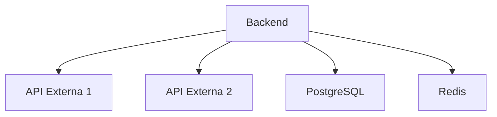

# TASK-031: Crear CATALOGO-APIs.md

## Información General
- **Fase**: FASE 3 - Catalogos
- **Duración Estimada**: 30 minutos
- **Prioridad**: ALTA
- **Tipo**: Catalogación
- **Metodología**: Auto-CoT + Self-Consistency + Tabular CoT

## Objetivo
Crear un catálogo completo de todas las APIs utilizadas en el backend del proyecto IACT, documentando su propósito, configuración y uso.

## Auto-CoT: Razonamiento en Cadena

### Paso 1: Identificación de APIs
**Pregunta**: ¿Qué APIs existen en el backend?
**Razonamiento**:
- Buscar en archivos de configuración (settings.py, config/)
- Identificar APIs externas en requirements.txt
- Revisar imports de librerías de APIs
- Examinar variables de entorno relacionadas con APIs

### Paso 2: Clasificación
**Pregunta**: ¿Cómo clasificar las APIs encontradas?
**Razonamiento**:
- APIs de servicios externos (third-party)
- APIs REST internas
- APIs GraphQL (si aplica)
- APIs de bases de datos
- APIs de autenticación/autorización

### Paso 3: Documentación
**Pregunta**: ¿Qué información documentar de cada API?
**Razonamiento**:
- Nombre y versión
- Propósito/uso
- Endpoint base
- Autenticación requerida
- Configuración necesaria
- Dependencias

## Tabular CoT: Estructura de Análisis

| Etapa | Acción | Herramienta | Salida Esperada |
|-------|--------|-------------|-----------------|
| 1. Búsqueda | Identificar archivos de configuración | Grep/Glob | Lista de archivos config |
| 2. Extracción | Extraer nombres de APIs | Read | Lista de APIs |
| 3. Clasificación | Categorizar por tipo | Análisis manual | APIs clasificadas |
| 4. Documentación | Crear tabla con detalles | Tabular CoT | CATALOGO-APIs.md |
| 5. Validación | Verificar completitud | Self-Consistency | Catálogo validado |

## Self-Consistency: Validación Cruzada

### Verificación 1: Completitud
- ¿Se documentaron todas las APIs en requirements.txt?
- ¿Se revisaron todos los archivos de configuración?
- ¿Se incluyeron APIs de servicios en docker-compose?

### Verificación 2: Consistencia
- ¿Los nombres de APIs coinciden en todos los archivos?
- ¿Las versiones documentadas son las correctas?
- ¿La clasificación es coherente?

### Verificación 3: Utilidad
- ¿El catálogo es útil para un desarrollador nuevo?
- ¿Incluye toda la información necesaria?
- ¿Es fácil de mantener?

## Estructura del Entregable: CATALOGO-APIs.md

```markdown
# Catálogo de APIs - Backend IACT

## APIs Externas (Third-Party)

| Nombre | Versión | Propósito | Endpoint Base | Autenticación | Config Requerida |
|--------|---------|-----------|---------------|---------------|------------------|
| API-1  | v1.0    | Desc.     | https://...   | API Key       | ENV_VAR          |

## APIs REST Internas

| Nombre | Versión | Propósito | Endpoint Base | Autenticación | Módulo |
|--------|---------|-----------|---------------|---------------|--------|
| API-2  | v1.0    | Desc.     | /api/v1/...   | JWT           | module |

## APIs de Base de Datos

| Nombre | Versión | Propósito | Connection String | Driver | Config |
|--------|---------|-----------|-------------------|--------|--------|
| DB-1   | v1.0    | Desc.     | postgresql://...  | psycopg2 | settings.py |

## APIs de Autenticación

| Nombre | Versión | Propósito | Tipo | Configuración |
|--------|---------|-----------|------|---------------|
| Auth-1 | v1.0    | Desc.     | JWT  | SECRET_KEY    |

## Dependencias y Relaciones



## Configuración Requerida

### Variables de Entorno
```bash
API_KEY_1=...
API_SECRET_1=...
DATABASE_URL=...
```

## Referencias
- requirements.txt
- docker-compose.yml
- settings.py
```

## Entregables
- [ ] CATALOGO-APIs.md creado
- [ ] Todas las APIs documentadas con Tabular CoT
- [ ] Validación Self-Consistency completada
- [ ] Diagrama de dependencias incluido

## Criterios de Aceptación
1. ✅ Todas las APIs del backend identificadas
2. ✅ Clasificación coherente aplicada
3. ✅ Formato tabular utilizado
4. ✅ Información completa para cada API
5. ✅ Validación cruzada realizada
6. ✅ Diagrama de relaciones incluido

## Notas
- Buscar en: backend/, requirements.txt, docker-compose.yml, .env.example
- Usar formato markdown para tablas
- Incluir ejemplos de configuración
- Documentar versiones específicas
