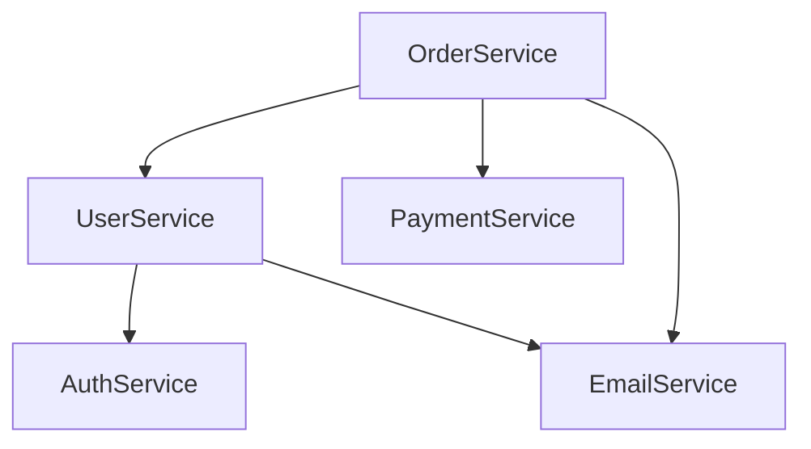

# TASK-032: Crear CATALOGO-SERVICIOS.md

## Información General
- **Fase**: FASE 3 - Catalogos
- **Duración Estimada**: 25 minutos
- **Prioridad**: MEDIA
- **Tipo**: Catalogación
- **Metodología**: Auto-CoT + Self-Consistency + Tabular CoT

## Objetivo
Crear un catálogo completo de todos los servicios (services) del backend, documentando su arquitectura, responsabilidades y dependencias.

## Auto-CoT: Razonamiento en Cadena

### Paso 1: Identificación de Servicios
**Pregunta**: ¿Dónde están definidos los servicios?
**Razonamiento**:
- Buscar carpetas services/ o service/
- Identificar clases con patrón Service
- Revisar archivos __init__.py
- Examinar imports de servicios en views/controllers

### Paso 2: Análisis de Responsabilidades
**Pregunta**: ¿Qué hace cada servicio?
**Razonamiento**:
- Revisar docstrings de clases
- Analizar métodos públicos
- Identificar modelos que maneja
- Determinar lógica de negocio

### Paso 3: Mapeo de Dependencias
**Pregunta**: ¿Qué dependencias tiene cada servicio?
**Razonamiento**:
- Servicios que importa
- Modelos que utiliza
- APIs externas que consume
- Repositorios que usa

## Tabular CoT: Estructura de Análisis

| Etapa | Acción | Herramienta | Salida Esperada |
|-------|--------|-------------|-----------------|
| 1. Búsqueda | Localizar archivos de servicios | Glob | Lista de services/*.py |
| 2. Extracción | Extraer clases Service | Grep | Nombres de servicios |
| 3. Análisis | Determinar responsabilidades | Read | Descripción de cada servicio |
| 4. Mapeo | Identificar dependencias | Análisis | Grafo de dependencias |
| 5. Documentación | Crear catálogo tabular | Tabular CoT | CATALOGO-SERVICIOS.md |

## Self-Consistency: Validación Cruzada

### Verificación 1: Completitud
- ¿Se catalogaron todos los archivos en services/?
- ¿Se incluyeron servicios en otros módulos?
- ¿Se documentaron servicios auxiliares?

### Verificación 2: Arquitectura
- ¿Los servicios siguen el patrón arquitectónico?
- ¿Hay servicios con responsabilidades sobrelapadas?
- ¿Las dependencias son unidireccionales?

### Verificación 3: Nomenclatura
- ¿Los nombres siguen convención consistente?
- ¿Los nombres reflejan la responsabilidad?
- ¿Hay servicios con nombres ambiguos?

## Estructura del Entregable: CATALOGO-SERVICIOS.md

```markdown
# Catálogo de Servicios - Backend IACT

## Servicios de Dominio

| Servicio | Ubicación | Responsabilidad | Modelos | Dependencias |
|----------|-----------|-----------------|---------|--------------|
| UserService | users/services.py | Gestión de usuarios | User, Profile | AuthService, EmailService |
| ProductService | products/services.py | Gestión de productos | Product, Category | CacheService, ImageService |

## Servicios de Infraestructura

| Servicio | Ubicación | Responsabilidad | Tipo | Usado Por |
|----------|-----------|-----------------|------|-----------|
| EmailService | core/services/email.py | Envío de emails | Infraestructura | UserService, OrderService |
| CacheService | core/services/cache.py | Caché Redis | Infraestructura | ProductService, CategoryService |

## Servicios de Integración

| Servicio | Ubicación | Responsabilidad | API Externa | Config |
|----------|-----------|-----------------|-------------|--------|
| PaymentService | payments/services.py | Procesamiento pagos | Stripe API | STRIPE_KEY |
| StorageService | storage/services.py | Almacenamiento S3 | AWS S3 | AWS_CREDENTIALS |

## Arquitectura de Servicios

### Capas
```
┌─────────────────────────────────┐
│  Controllers/Views              │
├─────────────────────────────────┤
│  Domain Services                │
├─────────────────────────────────┤
│  Infrastructure Services        │
├─────────────────────────────────┤
│  Integration Services           │
└─────────────────────────────────┘
```

### Grafo de Dependencias


## Patrones Utilizados

| Patrón | Servicios | Propósito |
|--------|-----------|-----------|
| Service Layer | Todos | Encapsular lógica de negocio |
| Repository | *Service | Acceso a datos |
| Factory | UserService | Creación de objetos complejos |

## Métodos Comunes por Servicio

### UserService
| Método | Descripción | Parámetros | Retorno |
|--------|-------------|------------|---------|
| create_user() | Crear usuario | username, email, password | User |
| authenticate() | Autenticar | email, password | Token |
| update_profile() | Actualizar perfil | user_id, data | Profile |

## Testing de Servicios

| Servicio | Tests Unitarios | Tests Integración | Cobertura |
|----------|-----------------|-------------------|-----------|
| UserService | ✅ 15 tests | ✅ 5 tests | 85% |
| ProductService | ✅ 12 tests | ✅ 4 tests | 78% |

## Referencias
- backend/services/
- backend/*/services.py
- tests/services/
```

## Entregables
- [ ] CATALOGO-SERVICIOS.md creado
- [ ] Todos los servicios documentados con Tabular CoT
- [ ] Clasificación por capas aplicada
- [ ] Grafo de dependencias incluido
- [ ] Validación Self-Consistency completada

## Criterios de Aceptación
1. ✅ Todos los servicios identificados y catalogados
2. ✅ Clasificación en capas (Dominio, Infraestructura, Integración)
3. ✅ Responsabilidades claramente definidas
4. ✅ Dependencias mapeadas
5. ✅ Formato tabular utilizado
6. ✅ Patrones arquitectónicos documentados

## Notas
- Buscar en: backend/services/, backend/*/services.py
- Identificar patrones de diseño utilizados
- Documentar métodos principales de cada servicio
- Incluir información de testing
