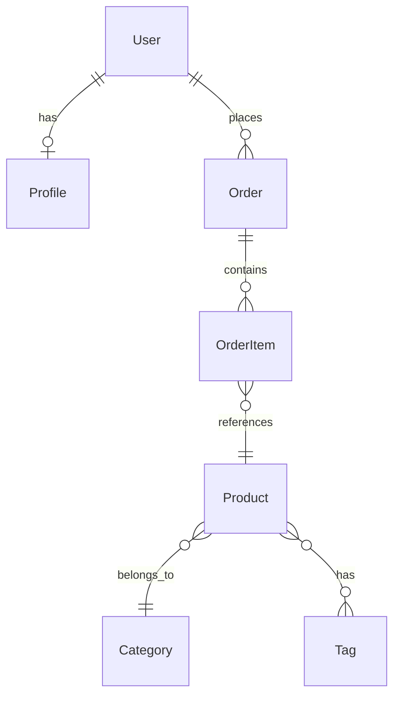

# TASK-033: Crear CATALOGO-MODELOS.md

## Información General
- **Fase**: FASE 3 - Catalogos
- **Duración Estimada**: 30 minutos
- **Prioridad**: MEDIA
- **Tipo**: Catalogación
- **Metodología**: Auto-CoT + Self-Consistency + Tabular CoT

## Objetivo
Crear un catálogo completo de todos los modelos de datos (ORM models) del backend, documentando su estructura, relaciones y validaciones.

## Auto-CoT: Razonamiento en Cadena

### Paso 1: Identificación de Modelos
**Pregunta**: ¿Dónde están definidos los modelos?
**Razonamiento**:
- Buscar archivos models.py en todas las apps
- Identificar clases que heredan de Model
- Revisar migraciones para modelos históricos
- Examinar modelos abstractos y mixins

### Paso 2: Análisis de Estructura
**Pregunta**: ¿Qué campos tiene cada modelo?
**Razonamiento**:
- Revisar definición de campos
- Identificar tipos de campo
- Analizar validadores
- Documentar valores por defecto

### Paso 3: Mapeo de Relaciones
**Pregunta**: ¿Cómo se relacionan los modelos?
**Razonamiento**:
- ForeignKey relationships
- ManyToMany relationships
- OneToOne relationships
- Relacionesreversas

## Tabular CoT: Estructura de Análisis

| Etapa | Acción | Herramienta | Salida Esperada |
|-------|--------|-------------|-----------------|
| 1. Búsqueda | Localizar models.py | Glob | Lista de archivos models |
| 2. Extracción | Extraer clases Model | Grep | Nombres de modelos |
| 3. Análisis | Documentar campos | Read | Estructura de cada modelo |
| 4. Relaciones | Mapear relaciones | Análisis | Diagrama ER |
| 5. Documentación | Crear catálogo tabular | Tabular CoT | CATALOGO-MODELOS.md |

## Self-Consistency: Validación Cruzada

### Verificación 1: Completitud
- ¿Se catalogaron todos los models.py?
- ¿Se incluyeron modelos abstractos?
- ¿Se documentaron modelos proxy?

### Verificación 2: Relaciones
- ¿Todas las ForeignKey tienen reverse_name?
- ¿Las relaciones están correctamente documentadas?
- ¿Se identificaron relaciones circulares?

### Verificación 3: Integridad
- ¿Los campos coinciden con las migraciones?
- ¿Se documentaron índices y constraints?
- ¿Se incluyeron métodos importantes?

## Estructura del Entregable: CATALOGO-MODELOS.md

```markdown
# Catálogo de Modelos - Backend IACT

## Modelos de Usuarios

### User
| Campo | Tipo | Requerido | Único | Default | Validación |
|-------|------|-----------|-------|---------|------------|
| id | AutoField | [OK] | [OK] | AUTO | PK |
| username | CharField(50) | [OK] | [OK] | - | unique, min_length=3 |
| email | EmailField | [OK] | [OK] | - | valid_email |
| password | CharField(128) | [OK] | [ERROR] | - | hashed |
| is_active | BooleanField | [OK] | [ERROR] | True | - |
| created_at | DateTimeField | [OK] | [ERROR] | now() | - |

**Relaciones:**
- Profile: OneToOne (reverse: user)
- Orders: ManyToOne (reverse: user)
- Permissions: ManyToMany (through: UserPermission)

**Métodos:**
- `get_full_name()`: Retorna nombre completo
- `has_permission(perm)`: Verifica permiso
- `activate()`: Activa cuenta

**Índices:**
- email (unique)
- username (unique)
- (is_active, created_at)

---

### Profile
| Campo | Tipo | Requerido | Único | Default | Validación |
|-------|------|-----------|-------|---------|------------|
| user | OneToOneField | [OK] | [OK] | - | FK to User |
| avatar | ImageField | [ERROR] | [ERROR] | None | max_size=5MB |
| bio | TextField | [ERROR] | [ERROR] | '' | max_length=500 |
| phone | CharField(20) | [ERROR] | [ERROR] | None | phone_format |

**Relaciones:**
- User: OneToOne (reverse: profile)

## Modelos de Productos

### Product
| Campo | Tipo | Requerido | Único | Default | Validación |
|-------|------|-----------|-------|---------|------------|
| id | UUIDField | [OK] | [OK] | uuid4() | PK |
| name | CharField(200) | [OK] | [ERROR] | - | min_length=3 |
| slug | SlugField | [OK] | [OK] | - | auto_from_name |
| price | DecimalField | [OK] | [ERROR] | 0.00 | min_value=0 |
| stock | IntegerField | [OK] | [ERROR] | 0 | min_value=0 |
| category | ForeignKey | [OK] | [ERROR] | - | FK to Category |

**Relaciones:**
- Category: ManyToOne (reverse: products)
- Tags: ManyToMany (through: ProductTag)
- Images: ManyToOne (reverse: product)

## Diagrama de Relaciones



## Modelos Abstractos

### TimeStampedModel
| Campo | Tipo | Descripción |
|-------|------|-------------|
| created_at | DateTimeField | Fecha de creación |
| updated_at | DateTimeField | Fecha de actualización |

**Usado por:**
- User, Product, Order, Category

### SoftDeleteModel
| Campo | Tipo | Descripción |
|-------|------|-------------|
| deleted_at | DateTimeField | Fecha de eliminación |
| is_deleted | BooleanField | Marca de eliminación |

**Usado por:**
- Product, Order

## Estadísticas

| App | Modelos | Campos Total | Relaciones |
|-----|---------|--------------|------------|
| users | 3 | 25 | 8 |
| products | 5 | 42 | 12 |
| orders | 4 | 31 | 9 |
| **TOTAL** | **12** | **98** | **29** |

## Validaciones Personalizadas

| Modelo | Validador | Descripción |
|--------|-----------|-------------|
| User | validate_username | Username alfanumérico |
| Product | validate_price | Precio > 0 |
| Order | validate_order_status | Estado válido |

## Índices de Base de Datos

| Modelo | Campo(s) | Tipo | Propósito |
|--------|----------|------|-----------|
| User | email | unique | Búsqueda rápida |
| Product | (category, is_active) | composite | Filtrado |
| Order | created_at | index | Ordenamiento |

## Referencias
- backend/*/models.py
- backend/migrations/
- docs/database/schema.md
```

## Entregables
- [ ] CATALOGO-MODELOS.md creado
- [ ] Todos los modelos documentados con Tabular CoT
- [ ] Diagrama ER incluido
- [ ] Relaciones mapeadas
- [ ] Validación Self-Consistency completada

## Criterios de Aceptación
1. [OK] Todos los modelos identificados y catalogados
2. [OK] Estructura de campos documentada en formato tabular
3. [OK] Relaciones entre modelos mapeadas
4. [OK] Diagrama ER incluido
5. [OK] Validaciones y constraints documentados
6. [OK] Estadísticas generales incluidas

## Notas
- Buscar en: backend/*/models.py
- Revisar migraciones para validar estructura
- Incluir modelos abstractos y mixins
- Documentar índices de base de datos
- Incluir métodos importantes de cada modelo
