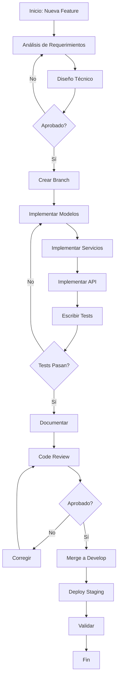

# TASK-035: Crear PROC-BACK-001-desarrollo-features.md

## Información General
- **Fase**: FASE 3 - Procesos
- **Duración Estimada**: 45 minutos
- **Prioridad**: ALTA
- **Tipo**: Proceso Documentación
- **Metodología**: Auto-CoT + Self-Consistency

## Objetivo
Crear un proceso documentado para el desarrollo de nuevas features en el backend, estableciendo un workflow estándar y repetible.

## Auto-CoT: Razonamiento en Cadena

### Paso 1: Análisis del Workflow Actual
**Pregunta**: ¿Cómo se desarrollan features actualmente?
**Razonamiento**:
- Revisar commits recientes para identificar patrones
- Analizar branches de features
- Examinar pull requests
- Identificar herramientas utilizadas

### Paso 2: Identificación de Etapas
**Pregunta**: ¿Qué etapas tiene el desarrollo de una feature?
**Razonamiento**:
1. Planificación y diseño
2. Creación de branch
3. Implementación
4. Testing
5. Documentación
6. Code review
7. Merge y deploy

### Paso 3: Definición de Estándares
**Pregunta**: ¿Qué estándares aplicar en cada etapa?
**Razonamiento**:
- Convenciones de naming
- Estructura de código
- Cobertura de tests
- Formato de commits
- Criterios de aceptación

## Self-Consistency: Validación Cruzada

### Verificación 1: Completitud
- ¿El proceso cubre todas las etapas de desarrollo?
- ¿Se incluyen criterios de calidad?
- ¿Se consideran casos excepcionales?

### Verificación 2: Practicidad
- ¿El proceso es realista y aplicable?
- ¿Los tiempos son razonables?
- ¿Las herramientas están disponibles?

### Verificación 3: Alineación
- ¿Está alineado con metodología del equipo?
- ¿Es compatible con CI/CD existente?
- ¿Sigue estándares del proyecto?

## Estructura del Entregable: PROC-BACK-001-desarrollo-features.md

```markdown
# PROC-BACK-001: Desarrollo de Features Backend

## Metadata
- **ID**: PROC-BACK-001
- **Versión**: 1.0
- **Fecha**: 2025-11-18
- **Owner**: Equipo Backend
- **Revisión**: Mensual

## Propósito
Establecer un proceso estándar para el desarrollo de nuevas features en el backend del proyecto IACT, asegurando calidad, consistencia y mantenibilidad.

## Alcance
- Desarrollo de nuevas funcionalidades
- Modificaciones mayores a features existentes
- Integraciones con servicios externos
- No aplica a: hotfixes, refactoring menor

## Roles y Responsabilidades

| Rol | Responsabilidad |
|-----|-----------------|
| Developer | Implementar feature según especificación |
| Tech Lead | Revisar diseño técnico y arquitectura |
| QA | Validar criterios de aceptación |
| DevOps | Configurar pipeline y deployment |
| Product Owner | Definir requerimientos y priorizar |

## Proceso Paso a Paso

### 1. Planificación (1-2 horas)

#### 1.1 Análisis de Requerimientos
- [ ] Revisar user story y criterios de aceptación
- [ ] Identificar dependencias con otros módulos
- [ ] Estimar complejidad y esfuerzo
- [ ] Definir casos de uso principales

#### 1.2 Diseño Técnico
- [ ] Identificar modelos afectados
- [ ] Diseñar endpoints necesarios
- [ ] Planificar servicios a implementar
- [ ] Considerar impacto en BD
- [ ] Documentar decisiones arquitectónicas

**Template: Tech Design**
```markdown
## Feature: [Nombre]
### Modelos
- Nuevos: [lista]
- Modificados: [lista]

### Endpoints
- GET /api/v1/... - Descripción
- POST /api/v1/... - Descripción

### Servicios
- ServiceName.method() - Lógica

### Migraciones
- Cambios en BD

### Consideraciones
- Performance
- Seguridad
- Escalabilidad
```

### 2. Preparación del Entorno (15 minutos)

#### 2.1 Crear Branch
```bash
# Naming: feature/TICKET-ID-short-description
git checkout develop
git pull origin develop
git checkout -b feature/IACT-123-user-notifications
```

#### 2.2 Configurar Entorno Local
```bash
# Actualizar dependencias
pip install -r requirements.txt

# Aplicar migraciones
python manage.py migrate

# Ejecutar tests base
pytest
```

### 3. Implementación (Variable según complejidad)

#### 3.1 Orden de Implementación Recomendado
1. **Modelos** (`models.py`)
 ```python
 class Notification(TimeStampedModel):
 user = models.ForeignKey(User, on_delete=models.CASCADE)
 message = models.TextField()
 is_read = models.BooleanField(default=False)

 class Meta:
 ordering = ['-created_at']
 indexes = [
 models.Index(fields=['user', 'is_read']),
 ]
 ```

2. **Migraciones**
 ```bash
 python manage.py makemigrations
 python manage.py migrate
 ```

3. **Serializers** (`serializers.py`)
 ```python
 class NotificationSerializer(serializers.ModelSerializer):
 class Meta:
 model = Notification
 fields = ['id', 'message', 'is_read', 'created_at']
 ```

4. **Servicios** (`services.py`)
 ```python
 class NotificationService:
 @staticmethod
 def create_notification(user, message):
 return Notification.objects.create(
 user=user,
 message=message
 )
 ```

5. **Views/ViewSets** (`views.py`)
 ```python
 class NotificationViewSet(viewsets.ModelViewSet):
 serializer_class = NotificationSerializer
 permission_classes = [IsAuthenticated]

 def get_queryset(self):
 return Notification.objects.filter(user=self.request.user)
 ```

6. **URLs** (`urls.py`)
 ```python
 router.register(r'notifications', NotificationViewSet, basename='notification')
 ```

#### 3.2 Estándares de Código
- [OK] Seguir PEP 8
- [OK] Usar type hints
- [OK] Documentar con docstrings
- [OK] Manejar excepciones apropiadamente
- [OK] Logging en operaciones críticas

### 4. Testing (30-50% del tiempo de implementación)

#### 4.1 Tests Unitarios
```python
# tests/test_services.py
class TestNotificationService:
 def test_create_notification(self):
 user = UserFactory()
 notification = NotificationService.create_notification(
 user=user,
 message="Test message"
 )
 assert notification.user == user
 assert notification.message == "Test message"
 assert not notification.is_read
```

#### 4.2 Tests de Integración
```python
# tests/test_api.py
class TestNotificationAPI:
 def test_list_notifications(self, authenticated_client):
 response = authenticated_client.get('/api/v1/notifications/')
 assert response.status_code == 200
```

#### 4.3 Cobertura Mínima
- Models: 90%
- Services: 85%
- Views: 80%
- Overall: 80%

```bash
# Ejecutar tests con cobertura
pytest --cov=app --cov-report=html
```

### 5. Documentación (15-30 minutos)

#### 5.1 Código
- [ ] Docstrings en clases y métodos
- [ ] Comentarios en lógica compleja
- [ ] Type hints completos

#### 5.2 API
- [ ] Actualizar OpenAPI/Swagger
- [ ] Documentar ejemplos de request/response
- [ ] Incluir códigos de error

#### 5.3 README
- [ ] Actualizar si hay nuevas dependencias
- [ ] Documentar variables de entorno
- [ ] Incluir instrucciones de setup

### 6. Code Review (1-2 días)

#### 6.1 Pre-Review Checklist
- [ ] Tests pasan localmente
- [ ] Linter sin errores (`flake8 .`)
- [ ] Formatter aplicado (`black .`)
- [ ] Type checking OK (`mypy .`)
- [ ] No hay conflictos con develop
- [ ] Migraciones revisadas
- [ ] Documentación actualizada

#### 6.2 Crear Pull Request
```markdown
## Feature: [Nombre]

### Descripción
[Descripción clara y concisa]

### Cambios
- Nuevo modelo Notification
- Endpoint GET /api/v1/notifications/
- Service para crear notificaciones

### Testing
- [OK] Tests unitarios (15 tests)
- [OK] Tests integración (8 tests)
- [OK] Cobertura: 87%

### Checklist
- [x] Tests pasan
- [x] Documentación actualizada
- [x] Migraciones revisadas
- [x] No breaking changes

### Screenshots/Ejemplos
[Si aplica]
```

#### 6.3 Criterios de Aprobación
- [OK] Al menos 1 aprobación de Tech Lead
- [OK] Todos los comentarios resueltos
- [OK] CI/CD pipeline verde
- [OK] Cobertura de tests cumple mínimo

### 7. Merge y Deploy

#### 7.1 Pre-Merge
```bash
# Actualizar con develop
git checkout develop
git pull origin develop
git checkout feature/IACT-123-user-notifications
git merge develop
# Resolver conflictos si existen
pytest
```

#### 7.2 Merge
- Usar "Squash and Merge" para features pequeñas
- Usar "Merge Commit" para features grandes
- Mensaje de commit descriptivo

#### 7.3 Post-Merge
- [ ] Verificar deploy en staging
- [ ] Ejecutar smoke tests
- [ ] Monitorear logs
- [ ] Notificar al equipo

## Diagramas de Flujo



## Herramientas

| Herramienta | Propósito | Comando |
|-------------|-----------|---------|
| pytest | Testing | `pytest -v` |
| black | Formatting | `black .` |
| flake8 | Linting | `flake8 .` |
| mypy | Type checking | `mypy .` |
| coverage | Code coverage | `pytest --cov` |
| pre-commit | Git hooks | `pre-commit run --all` |

## Métricas de Calidad

| Métrica | Objetivo | Crítico |
|---------|----------|---------|
| Cobertura Tests | ≥ 80% | < 70% |
| Complejidad Ciclomática | ≤ 10 | > 15 |
| Duplicación Código | < 5% | > 10% |
| Tiempo Build | < 5 min | > 10 min |
| Code Review Time | < 2 días | > 5 días |

## Troubleshooting

### Tests Fallan
1. Verificar migraciones aplicadas
2. Revisar fixtures y factories
3. Limpiar caché de pytest: `pytest --cache-clear`

### Conflictos de Merge
1. Actualizar branch con develop
2. Resolver conflictos manualmente
3. Ejecutar tests completos

### CI/CD Falla
1. Revisar logs de pipeline
2. Reproducir localmente con mismo entorno
3. Verificar variables de entorno

## Referencias
- [Django Best Practices](https://docs.djangoproject.com/)
- [DRF Guidelines](https://www.django-rest-framework.org/)
- [Git Flow](https://nvie.com/posts/a-successful-git-branching-model/)
- docs/backend/STANDARDS.md
- docs/backend/TESTING.md

## Changelog
- v1.0 (2025-11-18): Versión inicial
```

## Entregables
- [ ] PROC-BACK-001-desarrollo-features.md creado
- [ ] Proceso paso a paso documentado
- [ ] Diagramas de flujo incluidos
- [ ] Templates y ejemplos incluidos
- [ ] Validación Self-Consistency completada

## Criterios de Aceptación
1. [OK] Proceso completo de desarrollo documentado
2. [OK] Todas las etapas claramente definidas
3. [OK] Templates y ejemplos de código incluidos
4. [OK] Criterios de calidad especificados
5. [OK] Herramientas y comandos documentados
6. [OK] Diagrama de flujo incluido
7. [OK] Troubleshooting común documentado

## Notas
- Revisar procesos actuales en .github/workflows/
- Incluir ejemplos reales del proyecto
- Considerar integración con herramientas existentes
- Actualizar según feedback del equipo
