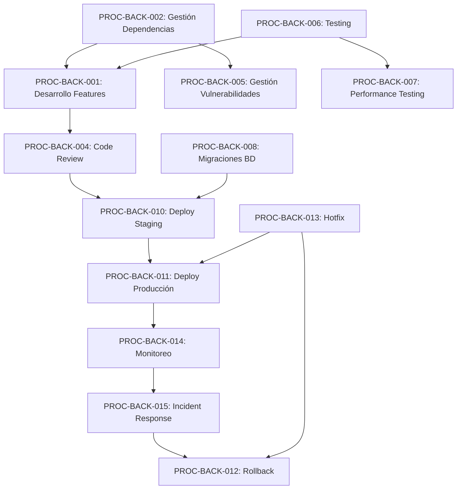

# TASK-037: Crear INDICE_PROCESOS.md

## Información General
- **Fase**: FASE 3 - Procesos
- **Duración Estimada**: 10 minutos
- **Prioridad**: MEDIA
- **Tipo**: Índice/Navegación
- **Metodología**: Auto-CoT + Self-Consistency

## Objetivo
Crear un índice maestro de todos los procesos documentados del backend, facilitando la navegación y consulta rápida.

## Auto-CoT: Razonamiento en Cadena

### Paso 1: Inventario de Procesos
**Pregunta**: ¿Qué procesos existen o están planificados?
**Razonamiento**:
- Procesos ya documentados
- Procesos en desarrollo (TASK-035, TASK-036)
- Procesos futuros identificados
- Clasificación por categoría

### Paso 2: Estructura de Índice
**Pregunta**: ¿Cómo organizar el índice?
**Razonamiento**:
- Por categoría (desarrollo, operaciones, calidad)
- Por frecuencia de uso
- Por rol (developer, devops, qa)
- Orden lógico de ejecución

### Paso 3: Información a Incluir
**Pregunta**: ¿Qué datos mostrar de cada proceso?
**Razonamiento**:
- ID del proceso
- Nombre y descripción breve
- Categoría
- Prioridad/Criticidad
- Owner
- Última actualización
- Link al documento

## Self-Consistency: Validación Cruzada

### Verificación 1: Completitud
- ¿Están todos los procesos listados?
- ¿Las categorías son exhaustivas?
- ¿Los links funcionan?

### Verificación 2: Usabilidad
- ¿Es fácil encontrar un proceso?
- ¿La organización es intuitiva?
- ¿Incluye búsqueda/filtros?

### Verificación 3: Mantenibilidad
- ¿Es fácil agregar nuevos procesos?
- ¿Se puede automatizar la actualización?
- ¿Incluye metadata útil?

## Estructura del Entregable: INDICE_PROCESOS.md

```markdown
# Índice de Procesos - Backend IACT

## Información General
- **Última Actualización**: 2025-11-18
- **Total Procesos**: 2 (documentados) + 8 (planificados)
- **Owner**: Equipo Backend
- **Ubicación**: `docs/backend/procesos/`

## Navegación Rápida
- [Por Categoría](#por-categoría)
- [Por Rol](#por-rol)
- [Por Prioridad](#por-prioridad)
- [Procesos Planificados](#procesos-planificados)

## Por Categoría

### 🛠️ Desarrollo

| ID | Proceso | Descripción | Prioridad | Owner | Status | Última Actualización |
|----|---------|-------------|-----------|-------|--------|---------------------|
| PROC-BACK-001 | [Desarrollo de Features](./PROC-BACK-001-desarrollo-features.md) | Workflow completo para implementar nuevas funcionalidades | ALTA | Tech Lead | ✅ Activo | 2025-11-18 |
| PROC-BACK-003 | Refactoring de Código | Proceso para refactorizar código legacy | MEDIA | Tech Lead | 📝 Planificado | - |
| PROC-BACK-004 | Code Review | Guía de code review y estándares | ALTA | Tech Lead | 📝 Planificado | - |

### 📦 Gestión de Dependencias

| ID | Proceso | Descripción | Prioridad | Owner | Status | Última Actualización |
|----|---------|-------------|-----------|-------|--------|---------------------|
| PROC-BACK-002 | [Gestión de Dependencias](./PROC-BACK-002-gestion-dependencias.md) | Instalación, actualización y auditoría de dependencias | MEDIA | DevOps | ✅ Activo | 2025-11-18 |
| PROC-BACK-005 | Gestión de Vulnerabilidades | Respuesta a vulnerabilidades de seguridad | ALTA | Security | 📝 Planificado | - |

### 🧪 Testing y Calidad

| ID | Proceso | Descripción | Prioridad | Owner | Status | Última Actualización |
|----|---------|-------------|-----------|-------|--------|---------------------|
| PROC-BACK-006 | Testing Estrategia | Estrategia de testing (unitario, integración, E2E) | ALTA | QA Lead | 📝 Planificado | - |
| PROC-BACK-007 | Performance Testing | Testing de rendimiento y carga | MEDIA | QA Lead | 📝 Planificado | - |

### 🗄️ Base de Datos

| ID | Proceso | Descripción | Prioridad | Owner | Status | Última Actualización |
|----|---------|-------------|-----------|-------|--------|---------------------|
| PROC-BACK-008 | Migraciones de BD | Creación y aplicación de migraciones | ALTA | Tech Lead | 📝 Planificado | - |
| PROC-BACK-009 | Backup y Recovery | Proceso de respaldo y recuperación | CRÍTICA | DevOps | 📝 Planificado | - |

### 🚀 Deployment y Operaciones

| ID | Proceso | Descripción | Prioridad | Owner | Status | Última Actualización |
|----|---------|-------------|-----------|-------|--------|---------------------|
| PROC-BACK-010 | Deployment a Staging | Deploy de cambios a ambiente de staging | ALTA | DevOps | 📝 Planificado | - |
| PROC-BACK-011 | Deployment a Producción | Deploy de cambios a producción | CRÍTICA | DevOps | 📝 Planificado | - |
| PROC-BACK-012 | Rollback | Proceso de rollback ante fallas | CRÍTICA | DevOps | 📝 Planificado | - |
| PROC-BACK-013 | Hotfix | Proceso de hotfix para bugs críticos | CRÍTICA | Tech Lead | 📝 Planificado | - |

### 📊 Monitoreo

| ID | Proceso | Descripción | Prioridad | Owner | Status | Última Actualización |
|----|---------|-------------|-----------|-------|--------|---------------------|
| PROC-BACK-014 | Monitoreo y Alertas | Configuración de monitoreo y alertas | ALTA | DevOps | 📝 Planificado | - |
| PROC-BACK-015 | Incident Response | Respuesta a incidentes en producción | CRÍTICA | On-Call | 📝 Planificado | - |

## Por Rol

### 👨‍💻 Developer
- [PROC-BACK-001: Desarrollo de Features](./PROC-BACK-001-desarrollo-features.md)
- PROC-BACK-003: Refactoring de Código
- PROC-BACK-004: Code Review
- PROC-BACK-008: Migraciones de BD

### 🔧 DevOps
- [PROC-BACK-002: Gestión de Dependencias](./PROC-BACK-002-gestion-dependencias.md)
- PROC-BACK-009: Backup y Recovery
- PROC-BACK-010: Deployment a Staging
- PROC-BACK-011: Deployment a Producción
- PROC-BACK-012: Rollback
- PROC-BACK-014: Monitoreo y Alertas

### 🧪 QA Engineer
- PROC-BACK-006: Testing Estrategia
- PROC-BACK-007: Performance Testing

### 👔 Tech Lead
- [PROC-BACK-001: Desarrollo de Features](./PROC-BACK-001-desarrollo-features.md)
- PROC-BACK-003: Refactoring de Código
- PROC-BACK-004: Code Review
- PROC-BACK-013: Hotfix

### 🔒 Security Engineer
- PROC-BACK-005: Gestión de Vulnerabilidades
- PROC-BACK-015: Incident Response

## Por Prioridad

### 🔴 CRÍTICA
| ID | Proceso | Categoría | Owner |
|----|---------|-----------|-------|
| PROC-BACK-009 | Backup y Recovery | Base de Datos | DevOps |
| PROC-BACK-011 | Deployment a Producción | Deployment | DevOps |
| PROC-BACK-012 | Rollback | Deployment | DevOps |
| PROC-BACK-013 | Hotfix | Deployment | Tech Lead |
| PROC-BACK-015 | Incident Response | Monitoreo | On-Call |

### 🟠 ALTA
| ID | Proceso | Categoría | Owner |
|----|---------|-----------|-------|
| PROC-BACK-001 | Desarrollo de Features | Desarrollo | Tech Lead |
| PROC-BACK-004 | Code Review | Desarrollo | Tech Lead |
| PROC-BACK-005 | Gestión de Vulnerabilidades | Dependencias | Security |
| PROC-BACK-006 | Testing Estrategia | Testing | QA Lead |
| PROC-BACK-008 | Migraciones de BD | Base de Datos | Tech Lead |
| PROC-BACK-010 | Deployment a Staging | Deployment | DevOps |
| PROC-BACK-014 | Monitoreo y Alertas | Monitoreo | DevOps |

### 🟡 MEDIA
| ID | Proceso | Categoría | Owner |
|----|---------|-----------|-------|
| PROC-BACK-002 | Gestión de Dependencias | Dependencias | DevOps |
| PROC-BACK-003 | Refactoring de Código | Desarrollo | Tech Lead |
| PROC-BACK-007 | Performance Testing | Testing | QA Lead |

## Procesos Planificados

### Q1 2025
- [ ] PROC-BACK-003: Refactoring de Código
- [ ] PROC-BACK-004: Code Review
- [ ] PROC-BACK-006: Testing Estrategia

### Q2 2025
- [ ] PROC-BACK-008: Migraciones de BD
- [ ] PROC-BACK-010: Deployment a Staging
- [ ] PROC-BACK-011: Deployment a Producción

### Q3 2025
- [ ] PROC-BACK-005: Gestión de Vulnerabilidades
- [ ] PROC-BACK-009: Backup y Recovery
- [ ] PROC-BACK-012: Rollback
- [ ] PROC-BACK-013: Hotfix

### Q4 2025
- [ ] PROC-BACK-007: Performance Testing
- [ ] PROC-BACK-014: Monitoreo y Alertas
- [ ] PROC-BACK-015: Incident Response

## Estadísticas

```
Total Procesos: 15
├── Documentados: 2 (13%)
├── Planificados: 13 (87%)
│
Por Categoría:
├── Desarrollo: 3
├── Dependencias: 2
├── Testing: 2
├── Base de Datos: 2
├── Deployment: 4
└── Monitoreo: 2

Por Prioridad:
├── CRÍTICA: 5 (33%)
├── ALTA: 7 (47%)
└── MEDIA: 3 (20%)
```

## Diagrama de Dependencias



## Convenciones

### Nomenclatura de Procesos
```
PROC-BACK-XXX-nombre-descriptivo.md
```
- `PROC`: Prefijo de proceso
- `BACK`: Área (Backend)
- `XXX`: Número secuencial (001-999)
- `nombre-descriptivo`: Slug del proceso

### Status de Procesos
- ✅ **Activo**: Proceso documentado y en uso
- 📝 **Planificado**: Proceso identificado, no documentado
- 🔄 **En Revisión**: Proceso siendo actualizado
- ⚠️ **Deprecado**: Proceso obsoleto, usar alternativa
- ❌ **Archivado**: Proceso ya no aplicable

### Niveles de Prioridad
- 🔴 **CRÍTICA**: Proceso esencial para operación
- 🟠 **ALTA**: Proceso importante, uso frecuente
- 🟡 **MEDIA**: Proceso útil, uso ocasional
- 🟢 **BAJA**: Proceso opcional, uso raro

## Cómo Usar Este Índice

1. **Buscar por Categoría**: Si sabes el tipo de proceso (desarrollo, testing, etc.)
2. **Buscar por Rol**: Si quieres ver todos los procesos relevantes para tu rol
3. **Buscar por Prioridad**: Si necesitas los procesos más críticos primero
4. **Usar Búsqueda**: Ctrl+F para buscar por palabra clave

## Cómo Agregar Nuevo Proceso

1. Crear documento: `PROC-BACK-XXX-nombre.md`
2. Agregar entrada en tabla correspondiente
3. Actualizar estadísticas
4. Actualizar diagrama de dependencias si aplica
5. Commit: `docs(procesos): add PROC-BACK-XXX`

## Mantenimiento

- **Frecuencia de Revisión**: Mensual
- **Responsable**: Tech Lead
- **Criterio de Actualización**:
  - Nuevo proceso documentado
  - Cambio de prioridad
  - Cambio de owner
  - Proceso deprecado

## Referencias
- [PROC-BACK-001: Desarrollo de Features](./PROC-BACK-001-desarrollo-features.md)
- [PROC-BACK-002: Gestión de Dependencias](./PROC-BACK-002-gestion-dependencias.md)
- docs/backend/README.md
- docs/backend/CONTRIBUTING.md

## Changelog
- 2025-11-18: Versión inicial con 2 procesos documentados
```

## Entregables
- [ ] INDICE_PROCESOS.md creado
- [ ] Todos los procesos listados y clasificados
- [ ] Navegación por categoría, rol y prioridad
- [ ] Estadísticas incluidas
- [ ] Diagrama de dependencias incluido
- [ ] Validación Self-Consistency completada

## Criterios de Aceptación
1. ✅ Índice completo de procesos creado
2. ✅ Clasificación múltiple (categoría, rol, prioridad)
3. ✅ Links a procesos documentados funcionales
4. ✅ Procesos planificados identificados
5. ✅ Estadísticas y métricas incluidas
6. ✅ Diagrama de dependencias incluido
7. ✅ Instrucciones de uso y mantenimiento

## Notas
- Mantener actualizado con cada nuevo proceso
- Considerar automatización con scripts
- Incluir procesos existentes del proyecto
- Actualizar roadmap según prioridades del equipo
