# TASK-040: Crear MATRIZ-requisitos-codigo.md

## Información General
- **Fase**: FASE 3 - Trazabilidad
- **Duración Estimada**: 40 minutos
- **Prioridad**: ALTA
- **Tipo**: Matriz de Trazabilidad
- **Metodología**: Auto-CoT + Self-Consistency + Tabular CoT

## Objetivo
Crear una matriz de trazabilidad que vincule requisitos funcionales con la implementación en código, facilitando mantenimiento y auditorías.

## Auto-CoT: Razonamiento en Cadena

### Paso 1: Requisitos Funcionales
**Pregunta**: ¿Qué requisitos funcionales se deben rastrear?
**Razonamiento**:
- Reutilizar requisitos de TASK-039
- Filtrar requisitos implementados
- Clasificar por módulo
- Priorizar por criticidad

### Paso 2: Identificación de Código
**Pregunta**: ¿Dónde está implementado cada requisito?
**Razonamiento**:
- Modelos que soportan el requisito
- Servicios que implementan la lógica
- APIs/endpoints que exponen la funcionalidad
- Vistas/controladores relacionados

### Paso 3: Mapeo Granular
**Pregunta**: ¿Cómo vincular requisitos con archivos/clases/métodos?
**Razonamiento**:
- Requisito → Archivos involucrados
- Requisito → Clases principales
- Requisito → Métodos específicos
- Requisito → Líneas de código (opcional)

## Tabular CoT: Estructura de Análisis

| Etapa | Acción | Herramienta | Salida Esperada |
|-------|--------|-------------|-----------------|
| 1. Requisitos | Importar requisitos | Reutilizar TASK-039 | Lista de requisitos |
| 2. Archivos | Identificar archivos relacionados | Grep/Glob | Mapa archivo-requisito |
| 3. Clases | Extraer clases principales | Read/Grep | Mapa clase-requisito |
| 4. Métodos | Identificar métodos clave | Read | Mapa método-requisito |
| 5. Documentación | Crear matriz tabular | Tabular CoT | MATRIZ-requisitos-codigo.md |

## Self-Consistency: Validación Cruzada

### Verificación 1: Completitud
- ¿Todos los requisitos implementados tienen código mapeado?
- ¿Se incluyen todas las capas (modelo, servicio, API)?
- ¿Hay archivos importantes sin requisito asociado?

### Verificación 2: Precisión
- ¿Los archivos mapeados realmente implementan el requisito?
- ¿Las clases/métodos son los correctos?
- ¿Se identificaron dependencias?

### Verificación 3: Utilidad
- ¿La matriz facilita encontrar código de un requisito?
- ¿Es útil para impact analysis?
- ¿Ayuda en refactoring?

## Estructura del Entregable: MATRIZ-requisitos-codigo.md

```markdown
# Matriz de Trazabilidad: Requisitos → Código

## Metadata
- **Fecha**: 2025-11-18
- **Versión**: 1.0
- **Owner**: Tech Lead
- **Última Actualización**: 2025-11-18

## Resumen Ejecutivo

| Métrica | Valor |
|---------|-------|
| Total Requisitos | 45 |
| Requisitos Implementados | 38 (84%) |
| Requisitos Parciales | 5 (11%) |
| Requisitos No Implementados | 2 (5%) |
| Archivos Involucrados | 127 |
| Clases Principales | 89 |
| Líneas de Código Total | ~15,400 |

## Matriz: Requisitos → Implementación

### Módulo: Autenticación

#### REQ-AUTH-001: Login de Usuario
- **Descripción**: Usuario puede autenticarse con email y password
- **Prioridad**: CRÍTICA
- **Status**: [OK] Implementado
- **Fecha Implementación**: 2024-09-15

**Implementación en Código:**

| Capa | Archivo | Clase/Función | Líneas | Responsabilidad |
|------|---------|---------------|--------|-----------------|
| **Modelo** | `backend/users/models.py` | `User` | 15-45 | Modelo de usuario |
| **Modelo** | `backend/users/models.py` | `User.check_password()` | 67-72 | Validación de password |
| **Servicio** | `backend/users/services.py` | `AuthService` | 20-85 | Lógica de autenticación |
| **Servicio** | `backend/users/services.py` | `AuthService.authenticate()` | 45-62 | Método principal de login |
| **Servicio** | `backend/users/services.py` | `AuthService.generate_token()` | 64-75 | Generación de JWT |
| **Serializer** | `backend/users/serializers.py` | `LoginSerializer` | 88-110 | Validación de input |
| **Vista** | `backend/users/views.py` | `LoginView` | 125-148 | Endpoint de login |
| **URL** | `backend/users/urls.py` | - | 18 | Ruta /api/v1/auth/login |

**Dependencias:**
- Django Authentication Framework
- djangorestframework-simplejwt
- `backend/core/utils/tokens.py`

**Configuración:**
- `settings.py`: JWT_AUTH settings (líneas 245-260)
- `settings.py`: AUTHENTICATION_BACKENDS (línea 189)

**Complejidad**: Media | **LOC**: ~180 | **Cobertura Tests**: 95%

---

#### REQ-AUTH-002: Logout de Usuario
- **Descripción**: Usuario autenticado puede cerrar sesión
- **Prioridad**: ALTA
- **Status**: [OK] Implementado
- **Fecha Implementación**: 2024-09-15

**Implementación en Código:**

| Capa | Archivo | Clase/Función | Líneas | Responsabilidad |
|------|---------|---------------|--------|-----------------|
| **Servicio** | `backend/users/services.py` | `AuthService.logout()` | 77-85 | Invalidar token |
| **Vista** | `backend/users/views.py` | `LogoutView` | 150-165 | Endpoint de logout |
| **URL** | `backend/users/urls.py` | - | 19 | Ruta /api/v1/auth/logout |
| **Middleware** | `backend/core/middleware/token_blacklist.py` | `TokenBlacklistMiddleware` | 12-45 | Blacklist de tokens |

**Dependencias:**
- Redis (para blacklist de tokens)
- `backend/core/cache.py`

**Complejidad**: Baja | **LOC**: ~65 | **Cobertura Tests**: 88%

---

#### REQ-AUTH-003: Registro de Usuario
- **Descripción**: Nuevo usuario puede registrarse con email y password
- **Prioridad**: CRÍTICA
- **Status**: [OK] Implementado
- **Fecha Implementación**: 2024-09-18

**Implementación en Código:**

| Capa | Archivo | Clase/Función | Líneas | Responsabilidad |
|------|---------|---------------|--------|-----------------|
| **Modelo** | `backend/users/models.py` | `User` | 15-45 | Modelo de usuario |
| **Servicio** | `backend/users/services.py` | `UserService.create_user()` | 120-155 | Lógica de creación |
| **Serializer** | `backend/users/serializers.py` | `RegistrationSerializer` | 112-145 | Validación de registro |
| **Vista** | `backend/users/views.py` | `RegistrationView` | 167-192 | Endpoint de registro |
| **URL** | `backend/users/urls.py` | - | 20 | Ruta /api/v1/auth/register |
| **Validator** | `backend/users/validators.py` | `validate_password_strength()` | 8-25 | Validación de password |
| **Validator** | `backend/users/validators.py` | `validate_email_unique()` | 27-35 | Email único |
| **Task** | `backend/users/tasks.py` | `send_welcome_email()` | 45-62 | Email de bienvenida |

**Dependencias:**
- Celery (para envío de email asíncrono)
- `backend/core/email.py`

**Complejidad**: Media-Alta | **LOC**: ~220 | **Cobertura Tests**: 92%

---

### Módulo: Usuarios

#### REQ-USER-001: Listar Usuarios
- **Descripción**: Admin puede listar todos los usuarios con paginación
- **Prioridad**: MEDIA
- **Status**: [OK] Implementado
- **Fecha Implementación**: 2024-10-02

**Implementación en Código:**

| Capa | Archivo | Clase/Función | Líneas | Responsabilidad |
|------|---------|---------------|--------|-----------------|
| **ViewSet** | `backend/users/views.py` | `UserViewSet` | 220-280 | CRUD de usuarios |
| **ViewSet** | `backend/users/views.py` | `UserViewSet.list()` | 235-248 | Método list |
| **Serializer** | `backend/users/serializers.py` | `UserListSerializer` | 180-205 | Serialización para lista |
| **Permission** | `backend/users/permissions.py` | `IsAdminUser` | 10-18 | Permiso de admin |
| **Filter** | `backend/users/filters.py` | `UserFilter` | 12-35 | Filtros de búsqueda |
| **Pagination** | `backend/core/pagination.py` | `StandardResultsSetPagination` | 8-15 | Configuración paginación |
| **URL** | `backend/users/urls.py` | - | 25 | Ruta /api/v1/users |

**Dependencias:**
- django-filter

**Complejidad**: Baja-Media | **LOC**: ~95 | **Cobertura Tests**: 78%

---

#### REQ-USER-002: Actualizar Perfil
- **Descripción**: Usuario puede actualizar su propio perfil
- **Prioridad**: ALTA
- **Status**: [WARNING] Implementado parcialmente
- **Fecha Implementación**: 2024-10-05

**Implementación en Código:**

| Capa | Archivo | Clase/Función | Líneas | Responsabilidad |
|------|---------|---------------|--------|-----------------|
| **Modelo** | `backend/users/models.py` | `Profile` | 95-125 | Modelo de perfil |
| **ViewSet** | `backend/users/views.py` | `UserViewSet.update_profile()` | 285-312 | Actualización de perfil |
| **Serializer** | `backend/users/serializers.py` | `ProfileSerializer` | 210-240 | Serialización de perfil |
| **Permission** | `backend/users/permissions.py` | `IsOwnerOrAdmin` | 20-32 | Permiso de owner |
| **URL** | `backend/users/urls.py` | - | 26 | Ruta /api/v1/users/me |

**Funcionalidad Faltante:**
- [ ] Validación de imágenes de avatar (tamaño, formato)
- [ ] Protección contra actualización concurrente
- [ ] Historial de cambios de perfil

**Complejidad**: Media | **LOC**: ~110 | **Cobertura Tests**: 65%

---

### Módulo: Productos

#### REQ-PROD-001: Crear Producto
- **Descripción**: Staff puede crear nuevos productos
- **Prioridad**: CRÍTICA
- **Status**: [OK] Implementado
- **Fecha Implementación**: 2024-10-10

**Implementación en Código:**

| Capa | Archivo | Clase/Función | Líneas | Responsabilidad |
|------|---------|---------------|--------|-----------------|
| **Modelo** | `backend/products/models.py` | `Product` | 20-85 | Modelo de producto |
| **Modelo** | `backend/products/models.py` | `Category` | 90-115 | Modelo de categoría |
| **Servicio** | `backend/products/services.py` | `ProductService.create()` | 45-88 | Lógica de creación |
| **ViewSet** | `backend/products/views.py` | `ProductViewSet` | 125-210 | CRUD de productos |
| **ViewSet** | `backend/products/views.py` | `ProductViewSet.create()` | 145-168 | Método create |
| **Serializer** | `backend/products/serializers.py` | `ProductSerializer` | 25-75 | Serialización |
| **Validator** | `backend/products/validators.py` | `validate_price()` | 8-18 | Validación de precio |
| **Validator** | `backend/products/validators.py` | `validate_stock()` | 20-28 | Validación de stock |
| **Permission** | `backend/products/permissions.py` | `IsStaffUser` | 10-18 | Permiso de staff |
| **URL** | `backend/products/urls.py` | - | 18 | Ruta /api/v1/products |
| **Signal** | `backend/products/signals.py` | `update_category_count()` | 35-42 | Actualizar contador |

**Dependencias:**
- `backend/core/storage.py` (para imágenes)
- `backend/core/cache.py` (para invalidar caché)

**Complejidad**: Media-Alta | **LOC**: ~285 | **Cobertura Tests**: 89%

---

#### REQ-PROD-002: Buscar Productos
- **Descripción**: Cualquier usuario puede buscar productos por nombre o categoría
- **Prioridad**: ALTA
- **Status**: [ERROR] No Implementado
- **Fecha Implementación**: Pendiente

**Implementación Planificada:**

| Capa | Archivo Planificado | Clase/Función | Responsabilidad |
|------|---------------------|---------------|-----------------|
| **ViewSet** | `backend/products/views.py` | `ProductViewSet.search()` | Endpoint de búsqueda |
| **Filter** | `backend/products/filters.py` | `ProductSearchFilter` | Filtro de búsqueda |
| **Servicio** | `backend/products/services.py` | `ProductService.search()` | Lógica de búsqueda |

**Funcionalidad Requerida:**
- [ ] Búsqueda por nombre (full-text)
- [ ] Búsqueda por categoría
- [ ] Filtros combinados
- [ ] Ordenamiento de resultados
- [ ] Paginación de resultados

**Estimación**: 6 horas | **Complejidad**: Media

---

## Matriz Inversa: Archivo → Requisitos

### backend/users/models.py

| Clase | Líneas | Requisitos Implementados |
|-------|--------|--------------------------|
| User | 15-45 | REQ-AUTH-001, REQ-AUTH-003 |
| Profile | 95-125 | REQ-USER-002 |
| UserPermission | 130-155 | REQ-PERM-001, REQ-PERM-002 |

### backend/users/services.py

| Clase/Método | Líneas | Requisitos Implementados |
|--------------|--------|--------------------------|
| AuthService | 20-85 | REQ-AUTH-001, REQ-AUTH-002, REQ-AUTH-004 |
| AuthService.authenticate() | 45-62 | REQ-AUTH-001 |
| AuthService.logout() | 77-85 | REQ-AUTH-002 |
| UserService | 100-200 | REQ-USER-001, REQ-USER-002, REQ-USER-003 |
| UserService.create_user() | 120-155 | REQ-AUTH-003 |

### backend/products/models.py

| Clase | Líneas | Requisitos Implementados |
|-------|--------|--------------------------|
| Product | 20-85 | REQ-PROD-001, REQ-PROD-003, REQ-PROD-004 |
| Category | 90-115 | REQ-PROD-005 |
| ProductImage | 120-145 | REQ-PROD-006 |
| ProductTag | 150-170 | REQ-PROD-007 |

## Mapa de Dependencias por Requisito

```mermaid
graph TD
 REQ_AUTH_001[REQ-AUTH-001: Login] --> USER_MODEL[users/models.py: User]
 REQ_AUTH_001 --> AUTH_SERVICE[users/services.py: AuthService]
 REQ_AUTH_001 --> LOGIN_VIEW[users/views.py: LoginView]
 REQ_AUTH_001 --> JWT_LIB[djangorestframework-simplejwt]

 REQ_AUTH_003[REQ-AUTH-003: Registro] --> USER_MODEL
 REQ_AUTH_003 --> USER_SERVICE[users/services.py: UserService]
 REQ_AUTH_003 --> REG_VIEW[users/views.py: RegistrationView]
 REQ_AUTH_003 --> EMAIL_TASK[users/tasks.py: send_welcome_email]
 REQ_AUTH_003 --> CELERY[Celery]

 REQ_PROD_001[REQ-PROD-001: Crear Producto] --> PROD_MODEL[products/models.py: Product]
 REQ_PROD_001 --> PROD_SERVICE[products/services.py: ProductService]
 REQ_PROD_001 --> PROD_VIEW[products/views.py: ProductViewSet]
 REQ_PROD_001 --> STORAGE[core/storage.py]
```



## Análisis de Impacto

### Archivos Críticos (usados por 3+ requisitos)

| Archivo | Requisitos | LOC | Complejidad | Riesgo |
|---------|------------|-----|-------------|--------|
| backend/users/models.py | 8 | 425 | Alta | Alto |
| backend/users/services.py | 6 | 380 | Alta | Alto |
| backend/products/models.py | 7 | 520 | Media | Medio |
| backend/core/permissions.py | 12 | 185 | Media | Medio |
| backend/core/serializers.py | 9 | 220 | Baja | Bajo |

### Módulos por Complejidad

| Módulo | Requisitos | Archivos | Clases | LOC | Complejidad Promedio |
|--------|------------|----------|--------|-----|----------------------|
| Autenticación | 5 | 12 | 18 | 1,840 | Alta |
| Usuarios | 8 | 15 | 22 | 2,650 | Media-Alta |
| Productos | 12 | 18 | 28 | 4,320 | Media |
| Pedidos | 10 | 20 | 25 | 3,890 | Alta |
| Notificaciones | 10 | 8 | 12 | 1,700 | Baja-Media |

## Estadísticas de Implementación

### Por Prioridad

| Prioridad | Requisitos | Implementados | Parciales | Pendientes | % Completitud |
|-----------|------------|---------------|-----------|------------|---------------|
| CRÍTICA | 12 | 12 | 0 | 0 | 100% |
| ALTA | 18 | 14 | 3 | 1 | 78% |
| MEDIA | 10 | 8 | 2 | 0 | 80% |
| BAJA | 5 | 4 | 0 | 1 | 80% |
| **TOTAL** | **45** | **38** | **5** | **2** | **84%** |

### Por Módulo

| Módulo | Archivos | Clases | Métodos | LOC | Requisitos |
|--------|----------|--------|---------|-----|------------|
| users | 15 | 22 | 158 | 2,650 | 13 |
| products | 18 | 28 | 186 | 4,320 | 12 |
| orders | 20 | 25 | 175 | 3,890 | 10 |
| notifications | 8 | 12 | 78 | 1,700 | 10 |
| **TOTAL** | **127** | **89** | **597** | **15,400** | **45** |

## Cobertura de Documentación en Código

### Requisitos con Docstrings Completos

| Requisito | Archivos con Docstrings | % Cobertura Doc |
|-----------|-------------------------|-----------------|
| REQ-AUTH-001 | 7/8 | 87% |
| REQ-AUTH-003 | 8/8 | 100% |
| REQ-PROD-001 | 10/11 | 91% |
| REQ-USER-002 | 3/5 | 60% |

**Meta**: 100% de clases y métodos principales documentados

## Roadmap de Implementación

### Sprint Actual (2025-11-18 a 2025-12-01)
- [ ] Completar REQ-USER-002 (actualización de perfil)
- [ ] Implementar REQ-PROD-002 (búsqueda de productos)
- [ ] Mejorar docstrings en módulo usuarios

### Próximo Sprint (2025-12-02 a 2025-12-15)
- [ ] Implementar requisitos pendientes (2)
- [ ] Completar implementaciones parciales (5)
- [ ] Refactoring de archivos críticos

## Herramientas de Análisis

- **radon**: Análisis de complejidad ciclomática
- **pylint**: Análisis estático de código
- **coverage**: Cobertura de tests
- **pydeps**: Visualización de dependencias

## Referencias
- backend/
- docs/requirements/
- docs/backend/CATALOGO-MODELOS.md
- docs/backend/CATALOGO-SERVICIOS.md
- docs/backend/qa/MATRIZ-requisitos-tests.md

## Changelog
- v1.0 (2025-11-18): Versión inicial con 45 requisitos mapeados
```

## Entregables
- [ ] MATRIZ-requisitos-codigo.md creado
- [ ] Requisitos mapeados a código (archivos, clases, métodos)
- [ ] Matriz bidireccional completa (requisito→código, código→requisito)
- [ ] Análisis de impacto incluido
- [ ] Estadísticas de implementación calculadas
- [ ] Roadmap de implementación creado
- [ ] Validación Self-Consistency completada

## Criterios de Aceptación
1. [OK] Matriz completa requisitos → código
2. [OK] Matriz inversa código → requisitos
3. [OK] Formato tabular utilizado (Tabular CoT)
4. [OK] Nivel de detalle: archivo, clase, método, líneas
5. [OK] Dependencias identificadas
6. [OK] Análisis de impacto incluido
7. [OK] Estadísticas y métricas calculadas
8. [OK] Roadmap de implementación

## Notas
- Reutilizar requisitos de TASK-039
- Usar Grep para buscar implementaciones
- Incluir líneas de código para referencia precisa
- Identificar archivos críticos (alto impacto)
- Documentar deuda técnica encontrada
