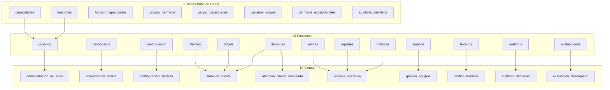

# Índice Maestro de Requisitos - IACT Backend

**Versión:** 2.0
**Fecha:** 2025-11-07
**Estado:** En Desarrollo

---

## DOCS Estructura de Documentación

```
docs/backend/requisitos/
├── INDICE_REQUISITOS.md                           # Este archivo - índice maestro
├── README.md                                       # Guía de navegación
├── restricciones_y_lineamientos.md                # Restricciones críticas del proyecto
├── INDICE_MAESTRO_PERMISOS_GRANULAR.md            # [NUEVO] Índice maestro del sistema de permisos granular
├── CATALOGO_GRUPOS_FUNCIONALES.md                 # [NUEVO] Catálogo de 10 grupos funcionales
├── CASOS_DE_USO_SISTEMA_PERMISOS.md               # [NUEVO] 5 casos de uso reales
├── MAPEO_FUNCIONES_MODULOS_DJANGO.md              # [NUEVO] Mapeo a módulos Django
├── MATRIZ_TRAZABILIDAD_PERMISOS.md                # [NUEVO] Trazabilidad completa
├── prioridad_01_estructura_base_datos.md          # [NUEVO] Estructura de 8 tablas
├── prioridad_02_funciones_core.md                 # [NUEVO] 3 funciones core
├── prioridad_03_modulos_operativos.md             # [NUEVO] 6 módulos operativos
├── prioridad_04_modulos_gestion.md                # [NUEVO] 4 módulos de gestión
├── negocio/                                        # Reglas de negocio por componente
│   └── rn_c01_autenticacion_sesiones.md
└── funcionales/                                    # Requisitos funcionales
    ├── RF-001 a RF-004 (users)
    └── RF-005 a RF-010 (authentication)
```

---

## NUEVO Sistema de Permisos Granular

**Versión:** 1.0 | **Fecha:** 2025-11-07 | **Estado:** Documentado - Pendiente Implementación

### Visión General

Sistema de permisos basado en **Grupos Funcionales** que reemplaza el enfoque tradicional de roles jerárquicos.

**Filosofía:**
- NO más roles jerárquicos: "Agente", "Supervisor", "Director", "Admin"
- SÍ grupos funcionales descriptivos: "Atención al Cliente", "Gestión de Equipos"
- Usuarios pueden tener múltiples grupos simultáneamente
- Permisos combinables y flexibles

### Documentos del Sistema

| Documento | Descripción | Estado |
|-----------|-------------|--------|
| [INDICE_MAESTRO_PERMISOS_GRANULAR.md](INDICE_MAESTRO_PERMISOS_GRANULAR.md) | Índice maestro del sistema completo | OK Completo |
| [ADR-2025-005](../../adr/adr_2025_005_grupos_funcionales_sin_jerarquia.md) | Decisión arquitectónica | OK Aprobado |
| [prioridad_01_estructura_base_datos.md](prioridad_01_estructura_base_datos.md) | 8 tablas + vistas + funciones SQL | OK Completo |
| [prioridad_02_funciones_core.md](prioridad_02_funciones_core.md) | 3 funciones core (16 capacidades) | OK Completo |
| [prioridad_03_modulos_operativos.md](prioridad_03_modulos_operativos.md) | 6 módulos operativos (38 capacidades) | OK Completo |
| [prioridad_04_modulos_gestion.md](prioridad_04_modulos_gestion.md) | 4 módulos de gestión (24 capacidades) | OK Completo |
| [CATALOGO_GRUPOS_FUNCIONALES.md](CATALOGO_GRUPOS_FUNCIONALES.md) | 10 grupos funcionales predefinidos | OK Completo |
| [CASOS_DE_USO_SISTEMA_PERMISOS.md](CASOS_DE_USO_SISTEMA_PERMISOS.md) | 5 casos de uso reales | OK Completo |
| [MAPEO_FUNCIONES_MODULOS_DJANGO.md](MAPEO_FUNCIONES_MODULOS_DJANGO.md) | Mapeo a módulos Django | OK Completo |
| [MATRIZ_TRAZABILIDAD_PERMISOS.md](MATRIZ_TRAZABILIDAD_PERMISOS.md) | Trazabilidad completa | OK Completo |

### Estadísticas del Sistema

| Métrica | Valor |
|---------|-------|
| **Funciones del Sistema** | 13 |
| **Capacidades Granulares** | 78 |
| **Grupos Funcionales** | 10 |
| **Tablas de Base de Datos** | 8 principales |
| **Módulos Django Existentes** | 8 (a extender) |
| **Módulos Django Nuevos** | 5 (a crear) |
| **Casos de Uso Documentados** | 5 |
| **Dominios Organizacionales** | 7 |

### Estructura del Sistema

#### 13 Funciones del Sistema

**Prioridad 2 - Core (3 funciones, 16 capacidades):**
1. `sistema.administracion.usuarios` - 7 capacidades
2. `sistema.vistas.dashboards` - 4 capacidades
3. `sistema.tecnico.configuracion` - 5 capacidades

**Prioridad 3 - Operativos (6 funciones, 38 capacidades):**
4. `sistema.operaciones.llamadas` - 7 capacidades
5. `sistema.operaciones.tickets` - 7 capacidades
6. `sistema.operaciones.clientes` - 6 capacidades
7. `sistema.analisis.metricas` - 5 capacidades
8. `sistema.analisis.reportes` - 6 capacidades
9. `sistema.monitoreo.alertas` - 7 capacidades

**Prioridad 4 - Gestión (4 funciones, 24 capacidades):**
10. `sistema.supervision.equipos` - 6 capacidades
11. `sistema.supervision.horarios` - 6 capacidades
12. `sistema.calidad.evaluaciones` - 6 capacidades
13. `sistema.calidad.auditoria` - 6 capacidades

#### 10 Grupos Funcionales

1. **administracion_usuarios** (7 capacidades) - Gestión de cuentas
2. **visualizacion_basica** (2 capacidades) - Acceso a dashboards
3. **configuracion_sistema** (5 capacidades) - Configuración técnica
4. **atencion_cliente** (9 capacidades) - Operaciones básicas
5. **atencion_cliente_avanzada** (16 capacidades) - Operaciones avanzadas
6. **analisis_operativo** (9 capacidades) - Métricas y reportes
7. **gestion_equipos** (6 capacidades) - Administración de equipos
8. **gestion_horarios** (6 capacidades) - Planificación de turnos
9. **auditoria_llamadas** (6 capacidades) - Auditoría de calidad
10. **evaluacion_desempeno** (6 capacidades) - Evaluaciones

#### 5 Casos de Uso Reales

1. **UC-001: Ana López** - Agente de Atención al Cliente (2 grupos, 11 capacidades)
2. **UC-002: Carlos Ruiz** - Coordinador de Equipo (4 grupos, 37 capacidades)
3. **UC-003: María Fernández** - Analista de Calidad (3 grupos, 21 capacidades)
4. **UC-004: Roberto Díaz** - Responsable Financiero (5 grupos, 29 capacidades)
5. **UC-005: Laura Martínez** - Administrador Técnico (3 grupos, 14 capacidades)

### Integración con Arquitectura Existente

**RF-001 a RF-004** (Sistema de Permisos Actual) se integran como:
- RF-001: Evaluación de Permisos → Implementa lógica de 3 niveles
- RF-002: Gestión de Permisos → Utiliza tablas de grupos_permisos, grupo_capacidades
- RF-003: Obtener Permisos Efectivos → Consulta vista_capacidades_usuario
- RF-004: Segmentos Dinámicos → Mantiene compatibilidad con segmentos

**Módulos Django:**
- 8 existentes a extender: users, dashboard, common, ivr_legacy, analytics, reports, notifications, audit
- 5 nuevos a crear: tickets, clients, teams, schedules, evaluations

### Mapa de Trazabilidad: Permisos Granular



---

## OBJETIVO Componentes del Sistema

### Componente 1: Autenticación y Sesiones
**Estado:** OK Requisitos Completos | ESPERANDO Tests Pendientes | ESPERANDO Implementación Pendiente

| ID | Documento | Estado | Tests | Código |
|----|-----------|--------|-------|--------|
| RN-C01 | [Reglas de Negocio](negocio/rn_c01_autenticacion_sesiones.md) | OK Completo (14/14) | - | - |
| RF-005 | [Login con Credenciales Locales](funcionales/rf005_login_credenciales_locales.md) | OK Documentado | ESPERANDO Pendiente (0/11) | ESPERANDO Pendiente |
| RF-006 | [Tokens JWT](funcionales/rf006_tokens_jwt.md) | OK Documentado | ESPERANDO Pendiente (0/15) | ESPERANDO Pendiente |
| RF-007 | [Logout Manual](funcionales/rf007_logout_manual.md) | OK Documentado | ESPERANDO Pendiente (0/11) | ESPERANDO Pendiente |
| RF-008 | [Cierre por Inactividad](funcionales/rf008_cierre_inactividad.md) | OK Documentado | ESPERANDO Pendiente (0/10) | ESPERANDO Pendiente |
| RF-009 | [Passwords e Intentos Fallidos](funcionales/rf009_gestion_passwords_intentos_fallidos.md) | OK Documentado | ESPERANDO Pendiente (0/23) | ESPERANDO Pendiente |
| RF-010 | [Sesión Única](funcionales/rf010_sesion_unica.md) | OK Documentado | ESPERANDO Pendiente (0/11) | ESPERANDO Pendiente |

**Total Tests Definidos:** 81 casos de prueba
**Total Escenarios Gherkin:** 53 escenarios

---

## Componente 2: Gestión de Usuarios (Parcial)

| ID | Documento | Estado | Tests | Código |
|----|-----------|--------|-------|--------|
| RF-001 | [Evaluación de Permisos (3 niveles)](funcionales/rf001_evaluacion_permisos_tres_niveles.md) | OK Documentado | OK Completo (10/10) | ESPERANDO Pendiente |
| RF-002 | [Gestión de Permisos Granulares](funcionales/rf002_gestion_permisos_granulares.md) | OK Documentado | OK Completo (27/27) | ESPERANDO Pendiente |
| RF-003 | [Obtener Permisos Efectivos](funcionales/rf003_obtener_permisos_efectivos_usuario.md) | OK Documentado | OK Completo (10/10) | ESPERANDO Pendiente |
| RF-004 | [Segmentos con Criterios Dinámicos](funcionales/rf004_segmentos_criterios_dinamicos.md) | OK Documentado | OK Completo (27/27) | ESPERANDO Pendiente |

**Total Tests Definidos:** 37 casos de prueba (implementados)
**Estado:** Tests creados pero no ejecutables (configuración pendiente)

---

## Mapa de Trazabilidad

### Reglas de Negocio -> Requisitos Funcionales

```mermaid
graph TD
    RN[RN-C01: Autenticación y Sesiones]
    RN --> RN01[RN-C01-01: Login Credenciales]
    RN --> RN02[RN-C01-02: Validación Credenciales]
    RN --> RN03[RN-C01-03: Generación JWT]
    RN --> RN04[RN-C01-04: Validación JWT]
    RN --> RN05[RN-C01-05: Logout Manual]
    RN --> RN06[RN-C01-06: Cierre Inactividad]
    RN --> RN07[RN-C01-07: Complejidad Passwords]
    RN --> RN08[RN-C01-08: Intentos Fallidos]
    RN --> RN09[RN-C01-09: Bloqueo Temporal]
    RN --> RN10[RN-C01-10: Hash bcrypt]
    RN --> RN11[RN-C01-11: Refresh Token]
    RN --> RN12[RN-C01-12: Auditoría Login]
    RN --> RN13[RN-C01-13: Sesiones PostgreSQL]
    RN --> RN14[RN-C01-14: Sesión Única]

    RN01 --> RF005[RF-005: Login]
    RN02 --> RF005

    RN03 --> RF006[RF-006: Tokens JWT]
    RN04 --> RF006
    RN11 --> RF006

    RN05 --> RF007[RF-007: Logout]

    RN06 --> RF008[RF-008: Cierre Inactividad]

    RN07 --> RF009[RF-009: Passwords]
    RN08 --> RF009
    RN09 --> RF009
    RN10 --> RF009

    RN13 --> RF010[RF-010: Sesión Única]
    RN14 --> RF010
```



### Requisitos Funcionales -> Tests

| Requisito | Archivo de Tests | Tests Unitarios | Tests Integración | Tests Seguridad |
|-----------|------------------|-----------------|-------------------|-----------------|
| RF-005 | `tests/authentication/test_login.py` | 11 | 2 | 3 |
| RF-006 | `tests/authentication/test_tokens.py` | 15 | 2 | 3 |
| RF-007 | `tests/authentication/test_logout.py` | 11 | 2 | - |
| RF-008 | `tests/authentication/test_inactivity.py` | 10 | 2 | - |
| RF-009 | `tests/authentication/test_passwords.py` | 23 | 2 | - |
| RF-010 | `tests/authentication/test_single_session.py` | 11 | 2 | 2 |

---

## NOTA Restricciones Críticas del Proyecto

Documento: [restricciones_y_lineamientos.md](restricciones_y_lineamientos.md)

### Top 10 Restricciones (Más Impactantes)

| # | Código | Restricción | Impacto en Requisitos |
|---|--------|-------------|----------------------|
| 1 | RESTR-001 | NO NO EMAIL - Solo buzón interno | RF-005, RF-008, RF-009 |
| 2 | RESTR-002 | CRITICO IVR DB READONLY - Cero escrituras | (Componente IVR) |
| 3 | RESTR-003 | SAVE SESSIONS IN DB - No Redis | RF-005, RF-007, RF-008, RF-010 |
| 4 | RESTR-004 | ⏱ NO REAL-TIME - ETL 6-12h | (Componente Analytics) |
| 5 | RESTR-005 | CONFIG DEBUG=FALSE - Siempre producción | Todos los RF |
| 6 | RESTR-006 | CRITICO JWT + PERMISSIONS - Auth robusta | RF-005, RF-006 |
| 7 | RESTR-007 | FILE PAGINATION - Siempre activa | (APIs futuras) |
| 8 | RESTR-008 | NOTA AUDITING - Logs obligatorios | RF-005, RF-007, RF-008, RF-009 |
| 9 | RESTR-009 | CRITICO NO CVE HIGH - Deps seguras | Todos los RF |
| 10 | RESTR-010 | DELETE LOGICAL DELETE - No físico | Todos los modelos |

---

## STATS Dashboard de Progreso

### Por Fase de Desarrollo

```
Documentación: ████████████████████ 100% (20/20 documentos)
Tests:         ███░░░░░░░░░░░░░░░░░  15% (37/244 implementados, 0 pasando)
Implementación: ░░░░░░░░░░░░░░░░░░░░   0% (0/13 módulos)
```

### Por Componente

**Componente 1: Autenticación y Sesiones**
- Documentación: OK 100% (6/6 RF completos)
- Tests: ESPERANDO 0% (0/81 implementados)
- Código: ESPERANDO 0%

**Componente 2: Gestión de Usuarios (RF-001 a RF-004)**
- Documentación: OK 100% (4/4 RF completos)
- Tests: WARNING 100% implementados pero no ejecutables (37/37)
- Código: ESPERANDO 0%

**Componente 3: Sistema de Permisos Granular**
- Documentación: OK 100% (10/10 documentos nuevos)
  - Índice maestro
  - ADR de decisión arquitectónica
  - 4 documentos de prioridades
  - Catálogo de grupos
  - Casos de uso
  - Mapeo a Django
  - Matriz de trazabilidad
- Tests: ESPERANDO 0%
- Código: ESPERANDO 0%
- Base de Datos: ESPERANDO 0% (8 tablas pendientes de creación)

---

## BUSCAR Búsqueda Rápida

### Por Funcionalidad

**Autenticación:**
- **Login/Autenticación**: RF-005, RF-006, RN-C01-01, RN-C01-02, RN-C01-03
- **Tokens JWT**: RF-006, RN-C01-03, RN-C01-04, RN-C01-11
- **Logout**: RF-007, RN-C01-05
- **Sesiones**: RF-008, RF-010, RN-C01-06, RN-C01-13, RN-C01-14
- **Contraseñas**: RF-009, RN-C01-07, RN-C01-10
- **Intentos Fallidos**: RF-009, RN-C01-08, RN-C01-09

**Permisos (Sistema Anterior):**
- **Permisos 3 Niveles**: RF-001, RF-002, RF-003
- **Segmentos Dinámicos**: RF-004

**Sistema de Permisos Granular (Nuevo):**
- **Estructura Base**: prioridad_01_estructura_base_datos.md
- **Funciones Core**: prioridad_02_funciones_core.md (usuarios, dashboards, configuracion)
- **Módulos Operativos**: prioridad_03_modulos_operativos.md (llamadas, tickets, clientes, métricas, reportes, alertas)
- **Módulos Gestión**: prioridad_04_modulos_gestion.md (equipos, horarios, evaluaciones, auditoría)
- **Grupos Funcionales**: CATALOGO_GRUPOS_FUNCIONALES.md
- **Casos de Uso**: CASOS_DE_USO_SISTEMA_PERMISOS.md
- **Trazabilidad**: MATRIZ_TRAZABILIDAD_PERMISOS.md
- **Mapeo Django**: MAPEO_FUNCIONES_MODULOS_DJANGO.md

### Por Tecnología

- **bcrypt**: RF-005, RF-009, RN-C01-02, RN-C01-10
- **JWT (djangorestframework-simplejwt)**: RF-005, RF-006, RN-C01-03, RN-C01-04, RN-C01-11
- **PostgreSQL**: RF-010, RN-C01-13, RESTR-003
- **APScheduler**: RF-008, RN-C01-06
- **Django Sessions**: RF-010, RN-C01-13

### Por Prioridad

**Crítica:**
- RF-005: Login con Credenciales Locales
- RF-006: Tokens JWT
- RF-009: Passwords e Intentos Fallidos
- RF-010: Sesión Única

**Alta:**
- RF-007: Logout Manual
- RF-008: Cierre por Inactividad

---

## NOTA Convenciones de Nomenclatura

### Códigos de Requisitos

```
RN-C##-##  -> Regla de Negocio - Componente ## - Número ##
            Ejemplo: RN-C01-03 (Componente 1, Regla 3)

RF-###     -> Requisito Funcional - Número ###
            Ejemplo: RF-005

TEST-###-### -> Test del Requisito ### - Número ###
               Ejemplo: TEST-005-001

IMPL-###   -> Implementación del Requisito ###
            Ejemplo: IMPL-005
```

### Estados

- OK **Completo**: Documentado, testeado y implementado
- WARNING **Parcial**: Avance pero no completo
- ESPERANDO **Pendiente**: No iniciado
- NO **Bloqueado**: Dependencias sin resolver

---

## Historial de Cambios

| Fecha | Versión | Cambios |
|-------|---------|---------|
| 2025-11-04 | 1.0 | Creación inicial del índice maestro |
| 2025-11-04 | 1.0 | Documentación completa RN-C01 (14 reglas) |
| 2025-11-04 | 1.0 | Documentación completa RF-005 a RF-010 (6 requisitos) |
| 2025-11-07 | 2.0 | Integración del Sistema de Permisos Granular |
| 2025-11-07 | 2.0 | Creación de ADR-2025-005 (Grupos Funcionales sin Jerarquía) |
| 2025-11-07 | 2.0 | Documentación completa de 13 funciones, 78 capacidades, 10 grupos |
| 2025-11-07 | 2.0 | Creación de 4 documentos de prioridades (P1-P4) |
| 2025-11-07 | 2.0 | Creación de catálogo de grupos funcionales |
| 2025-11-07 | 2.0 | Documentación de 5 casos de uso reales |
| 2025-11-07 | 2.0 | Creación de matriz de trazabilidad completa |
| 2025-11-07 | 2.0 | Mapeo a módulos Django (8 existentes, 5 nuevos) |

---

## Contactos

**Owner Backend:** equipo-backend
**Stakeholders:** usuarios-finales, administradores-sistema, gerentes-seguridad, analistas-calidad
**Documentación:** Este repositorio

---

## Enlaces Útiles

**Estándares:**
- [ISO/IEC/IEEE 29148:2018](https://www.iso.org/standard/72089.html) - Estándar de requisitos de ingeniería
- [BABOK v3](https://www.iiba.org/standards-and-resources/babok/) - Business Analysis Body of Knowledge
- [OWASP ASVS](https://owasp.org/www-project-application-security-verification-standard/) - Estándares de seguridad

**Tecnologías:**
- [Django Sessions](https://docs.djangoproject.com/en/stable/topics/http/sessions/) - Documentación Django
- [djangorestframework-simplejwt](https://django-rest-framework-simplejwt.readthedocs.io/) - Documentación JWT
- [PostgreSQL Documentation](https://www.postgresql.org/docs/) - Base de datos

**Arquitectura:**
- [ADR-2025-005](../adr/adr_2025_005_grupos_funcionales_sin_jerarquia.md) - Decisión de Grupos Funcionales

---

**Última actualización:** 2025-11-07
**Próxima revisión:** 2025-11-14 (Revisión de implementación P1)
