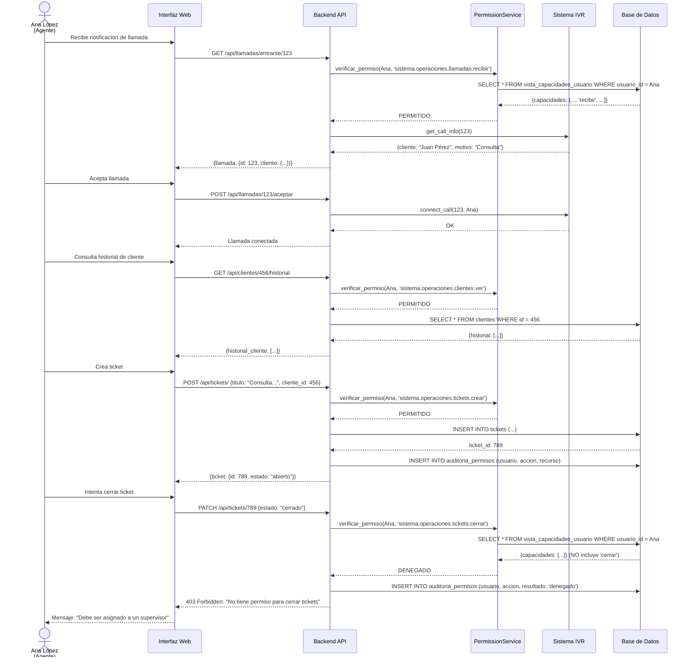
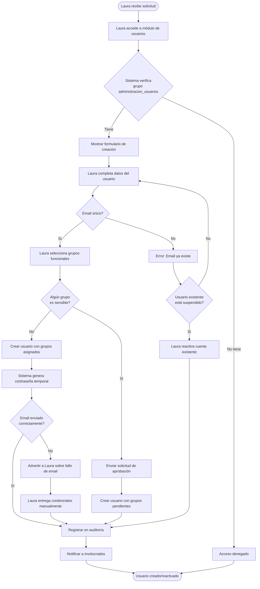

# Casos de Uso: Sistema de Permisos Granular

**Proyecto:** Sistema de Permisos basado en Grupos Funcionales
**Fecha:** 07 de Noviembre, 2025
**Versión:** 1.0

---

## Introducción

Este documento presenta 5 casos de uso reales del sistema de permisos granular, mostrando cómo diferentes perfiles de usuarios interactúan con el sistema según los grupos funcionales asignados.

**Propósito:**
- Ilustrar la flexibilidad del sistema sin jerarquías
- Demostrar combinaciones reales de grupos funcionales
- Validar que los permisos cubren necesidades operativas
- Servir como guía para asignación de grupos

---

## Caso de Uso 1: Usuario de Atención al Cliente

### Identificación
- **Código:** REQ-UC-001
- **Nombre:** Gestionar Interacciones Básicas con Clientes
- **Actor primario:** Ana López (Agente de Atención al Cliente)
- **Nivel:** Usuario

### Perfil del Usuario
```yaml
nombre: Ana López
rol_laboral: Agente de Atención al Cliente
antiguedad: 3 meses
departamento: Atención al Cliente

grupos_asignados:
  - atencion_cliente
  - visualizacion_basica

capacidades_totales: 11
```

### Resumen
Ana López es una agente de atención al cliente que maneja llamadas entrantes y salientes, crea tickets para seguimiento de casos, y consulta información básica de clientes. Su rol no requiere aprobaciones ni acceso a datos sensibles.

### Precondiciones
- Ana tiene cuenta activa en el sistema
- Ana ha sido asignada a los grupos `atencion_cliente` y `visualizacion_basica`
- Ana ha iniciado sesión con autenticación válida
- Ana está conectada a la plataforma telefónica IVR

### Escenario Principal: Atender Llamada de Cliente

| Actor | Sistema |
|-------|---------|
| 1. Ana recibe notificación de llamada entrante | |
| | 2. Sistema verifica permiso `sistema.operaciones.llamadas.recibir` |
| | 3. Sistema muestra interfaz de llamada con información del cliente |
| 4. Ana acepta la llamada y consulta el historial del cliente | |
| | 5. Sistema verifica permiso `sistema.operaciones.clientes.ver` |
| | 6. Sistema muestra datos básicos del cliente (nombre, cuenta, historial reciente) |
| 7. Ana identifica que necesita crear un ticket de seguimiento | |
| 8. Ana crea nuevo ticket asociado a la llamada | |
| | 9. Sistema verifica permiso `sistema.operaciones.tickets.crear` |
| | 10. Sistema crea ticket con estado "abierto", asignado a Ana |
| 11. Ana actualiza el ticket con notas del caso | |
| | 12. Sistema verifica permiso `sistema.operaciones.tickets.editar` |
| | 13. Sistema guarda cambios y registra auditoría |
| 14. Ana intenta cerrar el ticket | |
| | 15. Sistema verifica permiso `sistema.operaciones.tickets.cerrar` |
| | 16. Sistema DENIEGA acción - Ana no tiene este permiso |
| | 17. Sistema muestra mensaje: "No tiene permiso para cerrar tickets. Debe ser asignado a un supervisor." |
| 18. Ana finaliza llamada normalmente | |
| | 19. Sistema registra duración, notas y ticket asociado |

### Flujos Alternos

**4.a Cliente solicita escuchar grabación de llamada anterior**
- 4.a.1 Ana intenta acceder a grabaciones
- 4.a.2 Sistema verifica permiso `sistema.operaciones.llamadas.escuchar_grabaciones`
- 4.a.3 Sistema DENIEGA - Ana no tiene este permiso
- 4.a.4 Ana informa al cliente que debe solicitar a un supervisor
- 4.a.5 Ana continúa con flujo principal

**7.a El ticket ya existe**
- 7.a.1 Ana busca ticket existente por ID
- 7.a.2 Sistema muestra ticket si Ana es propietaria o del mismo equipo
- 7.a.3 Ana agrega comentarios al ticket existente
- 7.a.4 Continúa flujo principal

### Postcondiciones
- Llamada registrada en sistema IVR
- Ticket creado o actualizado
- Auditoría completa registrada
- Cliente atendido dentro de SLA

### Capacidades Utilizadas

**Grupo `atencion_cliente` (9 capacidades):**
- `sistema.operaciones.llamadas.realizar`
- `sistema.operaciones.llamadas.recibir`
- `sistema.operaciones.llamadas.transferir`
- `sistema.operaciones.tickets.crear`
- `sistema.operaciones.tickets.ver`
- `sistema.operaciones.tickets.editar`
- `sistema.operaciones.tickets.asignar`
- `sistema.operaciones.clientes.ver`
- `sistema.operaciones.clientes.editar`

**Grupo `visualizacion_basica` (2 capacidades):**
- `sistema.vistas.dashboards.ver`
- `sistema.vistas.dashboards.exportar`

### Reglas de Negocio Vinculadas
- RN-001: Tickets solo pueden ser cerrados por usuarios con permiso explícito
- RN-002: Grabaciones requieren permiso específico por privacidad
- RN-003: Agentes solo ven clientes con interacciones registradas

### Requisitos Especiales
- **Seguridad:** Auditoría de todos los accesos a datos de clientes
- **Rendimiento:** Carga de historial de cliente < 1 segundo
- **Disponibilidad:** Sistema IVR debe estar disponible 99.9%

---

## Caso de Uso 2: Coordinador de Equipo

### Identificación
- **Código:** REQ-UC-002
- **Nombre:** Gestionar Equipo y Operaciones Avanzadas
- **Actor primario:** Carlos Ruiz (Coordinador de Equipo)
- **Nivel:** Usuario

### Perfil del Usuario
```yaml
nombre: Carlos Ruiz
rol_laboral: Coordinador de Equipo de Atención
antiguedad: 2 años
departamento: Atención al Cliente
equipo_a_cargo: "Equipo Norte" (8 agentes)

grupos_asignados:
  - atencion_cliente_avanzada
  - gestion_equipos
  - gestion_horarios
  - analisis_operativo

capacidades_totales: 37
```

### Resumen
Carlos coordina un equipo de 8 agentes, gestiona sus horarios, cierra tickets escalados, aprueba solicitudes, y genera reportes operativos para evaluar performance del equipo.

### Precondiciones
- Carlos tiene cuenta activa con permisos de coordinador
- Carlos ha sido asignado como líder del "Equipo Norte"
- Existen agentes asignados a su equipo
- Sistema de métricas está recopilando datos

### Escenario Principal: Gestionar Performance Semanal del Equipo

| Actor | Sistema |
|-------|---------|
| 1. Carlos inicia sesión en su dashboard de coordinador | |
| | 2. Sistema verifica grupos asignados |
| | 3. Sistema muestra dashboard con métricas de su equipo |
| 4. Carlos solicita reporte de performance semanal | |
| | 5. Sistema verifica permiso `sistema.analisis.reportes.generar` |
| | 6. Sistema genera reporte con métricas: llamadas atendidas, tickets cerrados, tiempo promedio, satisfacción |
| 7. Carlos identifica que Ana López tiene 15 tickets abiertos pendientes de cierre | |
| 8. Carlos accede a la lista de tickets de Ana | |
| | 9. Sistema verifica permiso `sistema.operaciones.tickets.ver` (todos los tickets del equipo) |
| | 10. Sistema muestra tickets filtrados por agente |
| 11. Carlos revisa ticket T-12345 y confirma que está resuelto | |
| 12. Carlos cierra el ticket | |
| | 13. Sistema verifica permiso `sistema.operaciones.tickets.cerrar` |
| | 14. Sistema cambia estado a "cerrado", registra fecha/hora y usuario que cerró |
| 15. Carlos identifica necesidad de reforzar equipo el próximo lunes | |
| 16. Carlos accede al módulo de horarios | |
| | 17. Sistema verifica permiso `sistema.supervision.horarios.crear` |
| 18. Carlos crea turno extraordinario para 2 agentes | |
| | 19. Sistema valida disponibilidad de agentes |
| | 20. Sistema REQUIERE aprobación para horas extras |
| 21. Carlos envía solicitud de aprobación a su supervisor | |
| | 22. Sistema notifica al aprobador correspondiente |
| 23. Carlos genera reporte final y lo exporta para reunión | |
| | 24. Sistema verifica permiso `sistema.analisis.reportes.exportar` |
| | 25. Sistema genera PDF con gráficos y métricas |

### Flujos Alternos

**7.a Identificar agente con bajo rendimiento**
- 7.a.1 Carlos ve que agente tiene métricas por debajo del objetivo
- 7.a.2 Carlos crea evaluación de desempeño (NO tiene este permiso)
- 7.a.3 Sistema DENIEGA - requiere grupo `evaluacion_desempeno`
- 7.a.4 Carlos coordina con área de calidad para evaluación formal
- 7.a.5 Continúa flujo principal

**12.a Ticket requiere información adicional antes de cerrar**
- 12.a.1 Carlos agrega comentario solicitando aclaración a Ana
- 12.a.2 Sistema asigna ticket de vuelta a Ana
- 12.a.3 Sistema notifica a Ana
- 12.a.4 Carlos marca ticket como "pendiente de información"

**20.a Turno no requiere aprobación (horario regular)**
- 20.a.1 Sistema valida que es horario regular sin horas extras
- 20.a.2 Sistema verifica permiso `sistema.supervision.horarios.aprobar`
- 20.a.3 Carlos tiene el permiso, turno se aprueba automáticamente
- 20.a.4 Sistema notifica a los agentes asignados

### Postcondiciones
- Tickets cerrados actualizan métricas del equipo
- Horarios creados están visibles para los agentes
- Reportes generados están disponibles para consulta
- Auditoría completa de acciones de coordinación

### Capacidades Utilizadas

**Grupo `atencion_cliente_avanzada` (16 capacidades):**
Todas las de `atencion_cliente` más:
- `sistema.operaciones.tickets.cerrar`
- `sistema.operaciones.tickets.reabrir`
- `sistema.operaciones.tickets.escalar`
- `sistema.operaciones.llamadas.escuchar_grabaciones`
- `sistema.operaciones.llamadas.descargar_grabaciones`
- `sistema.operaciones.clientes.ver_historial_completo`
- `sistema.operaciones.clientes.exportar`

**Grupo `gestion_equipos` (6 capacidades):**
- `sistema.supervision.equipos.ver`
- `sistema.supervision.equipos.crear`
- `sistema.supervision.equipos.editar`
- `sistema.supervision.equipos.asignar_agentes`
- `sistema.supervision.equipos.ver_metricas`
- `sistema.supervision.equipos.exportar`

**Grupo `gestion_horarios` (6 capacidades):**
- `sistema.supervision.horarios.ver`
- `sistema.supervision.horarios.crear`
- `sistema.supervision.horarios.editar`
- `sistema.supervision.horarios.eliminar`
- `sistema.supervision.horarios.aprobar`
- `sistema.supervision.horarios.exportar`

**Grupo `analisis_operativo` (9 capacidades):**
- `sistema.analisis.metricas.ver`
- `sistema.analisis.metricas.ver_detalladas`
- `sistema.analisis.reportes.ver`
- `sistema.analisis.reportes.generar`
- `sistema.analisis.reportes.programar`
- `sistema.analisis.reportes.exportar`
- `sistema.monitoreo.alertas.ver`
- `sistema.monitoreo.alertas.crear`
- `sistema.monitoreo.alertas.editar`

### Reglas de Negocio Vinculadas
- RN-004: Coordinadores solo gestionan agentes de su equipo asignado
- RN-005: Horas extras requieren aprobación de nivel superior
- RN-006: Métricas se calculan en tiempo real con caché de 5 minutos
- RN-007: Reportes incluyen solo datos del equipo asignado

### Requisitos Especiales
- **Seguridad:** Coordinador solo ve datos de su equipo
- **Rendimiento:** Carga de métricas de equipo < 2 segundos
- **Usabilidad:** Dashboard debe actualizar métricas automáticamente

---

## Caso de Uso 3: Analista de Calidad

### Identificación
- **Código:** REQ-UC-003
- **Nombre:** Auditar Calidad de Atención
- **Actor primario:** María Fernández (Analista de Calidad)
- **Nivel:** Usuario

### Perfil del Usuario
```yaml
nombre: María Fernández
rol_laboral: Analista de Calidad
antiguedad: 1.5 años
departamento: Aseguramiento de Calidad

grupos_asignados:
  - auditoria_llamadas
  - evaluacion_desempeno
  - analisis_operativo

capacidades_totales: 21
```

### Resumen
María audita la calidad de las llamadas, escucha grabaciones, crea evaluaciones de desempeño para agentes, y genera reportes de calidad para identificar oportunidades de mejora.

### Precondiciones
- María tiene cuenta activa en área de calidad
- Existen llamadas grabadas disponibles para auditar
- Existen plantillas de evaluación configuradas
- María tiene acceso a métricas de calidad

### Escenario Principal: Realizar Auditoría de Calidad

| Actor | Sistema |
|-------|---------|
| 1. María accede al módulo de auditoría de calidad | |
| | 2. Sistema verifica grupo `auditoria_llamadas` |
| | 3. Sistema muestra lista de llamadas pendientes de auditoría (selección aleatoria) |
| 4. María selecciona llamada del agente Ana López | |
| | 5. Sistema verifica permiso `sistema.calidad.auditoria.auditar_llamadas` |
| | 6. Sistema muestra detalles: fecha, duración, agente, cliente, ticket asociado |
| 7. María solicita reproducir grabación | |
| | 8. Sistema verifica permiso `sistema.operaciones.llamadas.escuchar_grabaciones` |
| | 9. Sistema carga player de audio con grabación |
| 10. María escucha llamada completa (8 minutos) | |
| 11. María completa formulario de auditoría con criterios: saludo, empatía, resolución, despedida | |
| 12. María asigna puntuaciones: saludo (9/10), empatía (10/10), resolución (7/10), despedida (8/10) | |
| | 13. Sistema calcula score total: 85/100 |
| 14. María agrega comentarios: "Buena atención, mejorar en velocidad de resolución" | |
| 15. María guarda auditoría | |
| | 16. Sistema verifica permiso `sistema.calidad.auditoria.ver_reportes` |
| | 17. Sistema registra auditoría con timestamp y analista |
| 18. María decide crear evaluación formal de desempeño para Ana | |
| | 19. Sistema verifica permiso `sistema.calidad.evaluaciones.crear` |
| 20. María crea evaluación basada en 10 llamadas auditadas del mes | |
| | 21. Sistema calcula promedio de scores: 87/100 |
| 22. María programa reunión de retroalimentación con Ana | |
| | 23. Sistema envía notificación a Ana y a su coordinador Carlos |
| 24. María genera reporte mensual de calidad | |
| | 25. Sistema verifica permiso `sistema.analisis.reportes.generar` |
| | 26. Sistema genera reporte con: distribución de scores, top performers, oportunidades de mejora |

### Flujos Alternos

**11.a Llamada requiere escalamiento por incumplimiento grave**
- 11.a.1 María identifica violación de política (ej: datos incorrectos proporcionados)
- 11.a.2 María marca auditoría como "incumplimiento grave"
- 11.a.3 Sistema AUTOMÁTICAMENTE notifica a supervisor y área de compliance
- 11.a.4 María NO puede aprobar horarios ni gestionar equipos (no tiene permisos)
- 11.a.5 María registra comentarios detallados del incumplimiento
- 11.a.6 Continúa flujo principal

**18.a Evaluación requiere aprobación de supervisor**
- 18.a.1 Sistema detecta que score < 70/100
- 18.a.2 Sistema REQUIERE aprobación antes de notificar al agente
- 18.a.3 María envía evaluación para revisión de su supervisor
- 18.a.4 Evaluación queda en estado "pendiente de aprobación"

**24.a Reporte necesita ser compartido con otros departamentos**
- 24.a.1 María intenta compartir reporte con área de operaciones
- 24.a.2 Sistema verifica permiso `sistema.analisis.reportes.compartir`
- 24.a.3 María NO tiene este permiso
- 24.a.4 María solicita a su supervisor compartir el reporte
- 24.a.5 Continúa flujo normal

### Postcondiciones
- Llamada marcada como "auditada"
- Score de calidad registrado para el agente
- Evaluación de desempeño creada o actualizada
- Reporte de calidad disponible para consulta
- Notificaciones enviadas a involucrados

### Capacidades Utilizadas

**Grupo `auditoria_llamadas` (6 capacidades):**
- `sistema.calidad.auditoria.auditar_llamadas`
- `sistema.calidad.auditoria.auditar_tickets`
- `sistema.calidad.auditoria.ver_reportes`
- `sistema.calidad.auditoria.exportar`
- `sistema.operaciones.llamadas.escuchar_grabaciones`
- `sistema.operaciones.llamadas.descargar_grabaciones`

**Grupo `evaluacion_desempeno` (6 capacidades):**
- `sistema.calidad.evaluaciones.ver`
- `sistema.calidad.evaluaciones.crear`
- `sistema.calidad.evaluaciones.editar`
- `sistema.calidad.evaluaciones.eliminar`
- `sistema.calidad.evaluaciones.aprobar`
- `sistema.calidad.evaluaciones.exportar`

**Grupo `analisis_operativo` (9 capacidades):**
- `sistema.analisis.metricas.ver`
- `sistema.analisis.metricas.ver_detalladas`
- `sistema.analisis.reportes.ver`
- `sistema.analisis.reportes.generar`
- `sistema.analisis.reportes.programar`
- `sistema.analisis.reportes.exportar`
- `sistema.monitoreo.alertas.ver`
- `sistema.monitoreo.alertas.crear`
- `sistema.monitoreo.alertas.editar`

### Reglas de Negocio Vinculadas
- RN-008: Auditorías son aleatorias (min 3% de llamadas totales)
- RN-009: Evaluaciones negativas requieren aprobación de supervisor
- RN-010: Grabaciones se retienen por 90 días por política de privacidad
- RN-011: Analistas de calidad no pueden auditar sus propias llamadas (si fueran agentes)

### Requisitos Especiales
- **Seguridad:** Acceso a grabaciones requiere auditoría completa
- **Privacidad:** Grabaciones cifradas en tránsito y reposo
- **Rendimiento:** Reproducción de audio sin buffering
- **Usabilidad:** Formulario de auditoría debe ser intuitivo

---

## Caso de Uso 4: Responsable Financiero

### Identificación
- **Código:** REQ-UC-004
- **Nombre:** Gestionar Operaciones Financieras
- **Actor primario:** Roberto Díaz (Responsable Financiero)
- **Nivel:** Usuario

### Perfil del Usuario
```yaml
nombre: Roberto Díaz
rol_laboral: Responsable Financiero
antiguedad: 3 años
departamento: Finanzas

grupos_asignados:
  - gestion_pagos
  - aprobacion_pagos
  - gestion_facturacion
  - gestion_cobranza
  - gestion_presupuestos

capacidades_totales: 29
```

### Resumen
Roberto gestiona todas las operaciones financieras del call center, incluyendo procesamiento de pagos, aprobación de transacciones, emisión de facturas, gestión de cobranza, y planificación de presupuestos.

### Precondiciones
- Roberto tiene cuenta activa con permisos financieros
- Existe integración con pasarela de pagos
- Sistema de facturación está configurado
- Roberto ha completado capacitación en políticas financieras

### Escenario Principal: Procesar y Aprobar Pago a Proveedor

| Actor | Sistema |
|-------|---------|
| 1. Roberto recibe solicitud de pago a proveedor de servicios IVR | |
| | 2. Sistema verifica grupos financieros asignados |
| 3. Roberto accede al módulo de pagos | |
| | 4. Sistema muestra solicitudes pendientes de procesamiento |
| 5. Roberto revisa solicitud PAG-2025-001234 por $15,000 USD | |
| | 6. Sistema verifica permiso `sistema.finanzas.pagos.ver` |
| | 7. Sistema muestra detalles: proveedor, monto, concepto, factura asociada, solicitante |
| 8. Roberto valida que existe factura adjunta y orden de compra | |
| 9. Roberto verifica que el presupuesto tiene fondos disponibles | |
| | 10. Sistema verifica permiso `sistema.direccion.presupuestos.ver` |
| | 11. Sistema muestra saldo actual del presupuesto "Servicios Tecnológicos": $50,000 disponibles |
| 12. Roberto procesa el pago | |
| | 13. Sistema verifica permiso `sistema.finanzas.pagos.procesar` |
| | 14. Sistema valida datos bancarios del proveedor |
| 15. Roberto confirma datos y genera orden de pago | |
| | 16. Sistema REQUIERE aprobación para montos > $10,000 |
| 17. Roberto revisa que tiene autoridad de aprobación | |
| | 18. Sistema verifica permiso `sistema.finanzas.pagos.aprobar` |
| | 19. Roberto TIENE el permiso |
| 20. Roberto aprueba el pago | |
| | 21. Sistema registra aprobación con timestamp y firma digital |
| | 22. Sistema envía pago a pasarela bancaria |
| | 23. Sistema actualiza presupuesto: $35,000 disponibles |
| | 24. Sistema genera comprobante de pago |
| 25. Roberto descarga comprobante y envía al proveedor | |
| | 26. Sistema registra auditoría completa de la transacción |

### Flujos Alternos

**9.a Presupuesto insuficiente**
- 9.a.1 Sistema muestra saldo disponible: $8,000 (insuficiente para $15,000)
- 9.a.2 Roberto verifica permiso `sistema.direccion.presupuestos.crear`
- 9.a.3 Roberto NO tiene permiso para modificar presupuestos (requiere aprobación de dirección)
- 9.a.4 Roberto solicita ampliación de presupuesto a director financiero
- 9.a.5 Sistema envía solicitud de aprobación
- 9.a.6 Pago queda en estado "pendiente de presupuesto"

**16.a Pago requiere doble aprobación (monto > $50,000)**
- 16.a.1 Sistema detecta monto alto y requiere segunda firma
- 16.a.2 Roberto aprueba como primera instancia
- 16.a.3 Sistema notifica a director financiero para segunda aprobación
- 16.a.4 Pago queda en estado "pendiente de segunda aprobación"

**22.a Pasarela rechaza transacción**
- 22.a.1 Sistema recibe error de pasarela: "Cuenta destino inválida"
- 22.a.2 Sistema REVERSA la aprobación y restaura presupuesto
- 22.a.3 Sistema notifica a Roberto del error
- 22.a.4 Roberto debe corregir datos bancarios y reintentar
- 22.a.5 Sistema registra intento fallido en auditoría

### Escenario Secundario: Gestionar Cobranza

| Actor | Sistema |
|-------|---------|
| 1. Roberto accede al módulo de cobranza | |
| | 2. Sistema verifica permiso `sistema.finanzas.cobranza.ver` |
| | 3. Sistema muestra facturas vencidas y por vencer |
| 4. Roberto filtra facturas vencidas > 30 días | |
| | 5. Sistema muestra 15 facturas vencidas, total adeudado: $85,000 |
| 6. Roberto selecciona cliente "Empresa XYZ" con saldo vencido de $12,000 | |
| 7. Roberto crea tarea de cobranza | |
| | 8. Sistema verifica permiso `sistema.finanzas.cobranza.crear` |
| 9. Roberto asigna tarea a agente de cobranza | |
| | 10. Sistema notifica al agente asignado |
| 11. Roberto programa llamada de seguimiento automática | |
| | 12. Sistema agenda llamada para mañana 10:00 AM |
| 13. Roberto genera reporte de antigüedad de saldos | |
| | 14. Sistema verifica permiso `sistema.finanzas.cobranza.exportar` |
| | 15. Sistema genera reporte en Excel con aging: 0-30, 31-60, 61-90, >90 días |

### Postcondiciones
- Pago procesado y registrado en contabilidad
- Presupuesto actualizado
- Comprobante generado y enviado
- Auditoría completa registrada
- Notificaciones enviadas a involucrados

### Capacidades Utilizadas

**Grupo `gestion_pagos` (6 capacidades):**
- `sistema.finanzas.pagos.ver`
- `sistema.finanzas.pagos.crear`
- `sistema.finanzas.pagos.procesar`
- `sistema.finanzas.pagos.cancelar`
- `sistema.finanzas.pagos.ver_historial`
- `sistema.finanzas.pagos.exportar`

**Grupo `aprobacion_pagos` (NOTA: hasta $100,000):**
- `sistema.finanzas.pagos.aprobar`

**Grupo `gestion_facturacion` (6 capacidades):**
- `sistema.finanzas.facturas.ver`
- `sistema.finanzas.facturas.crear`
- `sistema.finanzas.facturas.editar`
- `sistema.finanzas.facturas.anular`
- `sistema.finanzas.facturas.enviar`
- `sistema.finanzas.facturas.exportar`

**Grupo `gestion_cobranza` (5 capacidades):**
- `sistema.finanzas.cobranza.ver`
- `sistema.finanzas.cobranza.crear`
- `sistema.finanzas.cobranza.editar`
- `sistema.finanzas.cobranza.registrar_pago`
- `sistema.finanzas.cobranza.exportar`

**Grupo `gestion_presupuestos` (6 capacidades):**
- `sistema.direccion.presupuestos.ver`
- `sistema.direccion.presupuestos.crear`
- `sistema.direccion.presupuestos.editar`
- `sistema.direccion.presupuestos.eliminar`
- `sistema.direccion.presupuestos.aprobar` (NOTA: solo hasta $20,000)
- `sistema.direccion.presupuestos.exportar`

### Reglas de Negocio Vinculadas
- RN-012: Pagos > $10,000 requieren aprobación
- RN-013: Pagos > $50,000 requieren doble aprobación
- RN-014: Presupuestos no pueden excederse sin aprobación
- RN-015: Facturas vencidas > 90 días requieren escalamiento a legal
- RN-016: Todas las transacciones financieras requieren auditoría completa

### Requisitos Especiales
- **Seguridad:** Cifrado de datos financieros
- **Auditoría:** Log completo de todas las transacciones
- **Integración:** Pasarela de pagos debe tener 99.9% uptime
- **Compliance:** Cumplir con normativas PCI-DSS y SOX

---

## Caso de Uso 5: Administrador Técnico

### Identificación
- **Código:** REQ-UC-005
- **Nombre:** Administrar Usuarios y Configuración del Sistema
- **Actor primario:** Laura Martínez (Administrador Técnico)
- **Nivel:** Usuario

### Perfil del Usuario
```yaml
nombre: Laura Martínez
rol_laboral: Administrador de Sistemas
antiguedad: 4 años
departamento: Tecnología

grupos_asignados:
  - administracion_usuarios
  - configuracion_sistema
  - visualizacion_basica

capacidades_totales: 13
```

### Resumen
Laura gestiona el ciclo de vida de usuarios en el sistema, asigna grupos de permisos, configura parámetros del sistema, y realiza tareas técnicas de administración.

### Precondiciones
- Laura tiene cuenta activa con permisos de administración
- Laura ha completado capacitación en seguridad y compliance
- Sistema de permisos granulares está implementado
- Existe respaldo de configuración

### Escenario Principal: Crear Nuevo Usuario y Asignar Grupos

| Actor | Sistema |
|-------|---------|
| 1. Laura recibe solicitud de creación de cuenta para nuevo agente "Pedro Gómez" | |
| 2. Laura accede al módulo de administración de usuarios | |
| | 3. Sistema verifica grupo `administracion_usuarios` |
| | 4. Sistema muestra interfaz de gestión de usuarios |
| 5. Laura hace clic en "Crear nuevo usuario" | |
| | 6. Sistema verifica permiso `sistema.administracion.usuarios.crear` |
| | 7. Sistema muestra formulario de creación |
| 8. Laura completa datos: nombre, email, departamento, fecha_ingreso | |
| | 9. Sistema valida formato de email y unicidad |
| 10. Laura asigna grupos funcionales según rol del nuevo agente | |
| | 11. Sistema verifica permiso `sistema.administracion.usuarios.asignar_grupos` |
| | 12. Sistema muestra catálogo de grupos disponibles |
| 13. Laura selecciona grupos: `atencion_cliente` y `visualizacion_basica` | |
| | 14. Sistema valida que los grupos existen y están activos |
| 15. Laura establece fecha de expiración de cuenta: 31/12/2025 | |
| 16. Laura guarda el nuevo usuario | |
| | 17. Sistema CREA usuario con ID único |
| | 18. Sistema ASIGNA grupos seleccionados |
| | 19. Sistema REGISTRA auditoría: quien creó, cuándo, qué grupos |
| | 20. Sistema GENERA contraseña temporal y la envía por email |
| | 21. Sistema REQUIERE cambio de contraseña en primer login |
| 22. Laura verifica que usuario fue creado correctamente | |
| | 23. Sistema muestra usuario en lista con estado "activo" |
| 24. Laura descarga reporte de usuarios creados este mes | |
| | 25. Sistema verifica permiso `sistema.administracion.usuarios.exportar` |
| | 26. Sistema genera CSV con: nombre, email, grupos, fecha_creacion |

### Flujos Alternos

**9.a Email ya existe en el sistema**
- 9.a.1 Sistema detecta email duplicado
- 9.a.2 Sistema muestra error: "Usuario con este email ya existe"
- 9.a.3 Laura verifica si es el mismo usuario o email incorrecto
- 9.a.4 Si es el mismo usuario, Laura reactiva cuenta existente
- 9.a.5 Si es email incorrecto, Laura corrige y reintenta

**13.a Asignación de grupo requiere aprobación (grupos sensibles)**
- 13.a.1 Laura intenta asignar grupo `aprobacion_pagos`
- 13.a.2 Sistema detecta que es grupo sensible
- 13.a.3 Sistema REQUIERE aprobación de supervisor de seguridad
- 13.a.4 Laura envía solicitud de aprobación con justificación
- 13.a.5 Usuario queda creado pero grupo en estado "pendiente de aprobación"

**20.a Envío de email falla**
- 20.a.1 Sistema intenta enviar email con contraseña temporal
- 20.a.2 Servidor de correo retorna error
- 20.a.3 Sistema registra error pero NO reversa creación de usuario
- 20.a.4 Sistema muestra advertencia a Laura
- 20.a.5 Laura reenvía email manualmente o entrega credenciales en persona

### Escenario Secundario: Modificar Configuración del Sistema

| Actor | Sistema |
|-------|---------|
| 1. Laura recibe solicitud de cambiar timeout de sesión a 2 horas | |
| 2. Laura accede al módulo de configuración | |
| | 3. Sistema verifica permiso `sistema.tecnico.configuracion.ver` |
| | 4. Sistema muestra parámetros de configuración categorizados |
| 5. Laura busca parámetro "session_timeout" | |
| | 6. Sistema muestra valor actual: 3600 segundos (1 hora) |
| 7. Laura edita el parámetro | |
| | 8. Sistema verifica permiso `sistema.tecnico.configuracion.editar` |
| | 9. Sistema muestra formulario de edición |
| 10. Laura cambia valor a 7200 segundos (2 horas) | |
| 11. Laura agrega justificación: "Solicitud de equipo de operaciones por desconexiones frecuentes" | |
| 12. Laura guarda cambios | |
| | 13. Sistema valida que valor sea numérico y dentro de rango permitido (1800-14400) |
| | 14. Sistema REQUIERE aprobación para cambios de seguridad |
| 15. Laura envía solicitud de aprobación a CISO | |
| | 16. Sistema notifica a CISO (Chief Information Security Officer) |
| | 17. Sistema coloca cambio en estado "pendiente de aprobación" |
| | 18. Sistema registra auditoría completa: parámetro, valor anterior, valor nuevo, solicitante |

### Escenario Terciario: Suspender Usuario

| Actor | Sistema |
|-------|---------|
| 1. Laura recibe notificación de RRHH: agente Ana López sale de vacaciones 2 semanas | |
| 2. Laura accede al perfil de Ana López | |
| | 3. Sistema verifica permiso `sistema.administracion.usuarios.ver` |
| | 4. Sistema muestra perfil completo de Ana |
| 5. Laura hace clic en "Suspender usuario" | |
| | 6. Sistema verifica permiso `sistema.administracion.usuarios.suspender` |
| | 7. Sistema muestra formulario de suspensión |
| 8. Laura selecciona motivo: "Vacaciones" | |
| 9. Laura establece fecha de reactivación automática: 20/11/2025 | |
| 10. Laura confirma suspensión | |
| | 11. Sistema SUSPENDE cuenta inmediatamente |
| | 12. Sistema INVALIDA sesiones activas de Ana |
| | 13. Sistema PROGRAMA reactivación automática para fecha indicada |
| | 14. Sistema REGISTRA auditoría de suspensión |
| | 15. Sistema mantiene TODOS los permisos y grupos intactos |
| 16. Laura verifica que Ana no puede iniciar sesión | |
| | 17. Sistema muestra estado "suspendido" en perfil |

### Postcondiciones
- Usuario creado/modificado/suspendido correctamente
- Auditoría completa registrada
- Notificaciones enviadas según corresponda
- Sistema mantiene integridad de permisos

### Capacidades Utilizadas

**Grupo `administracion_usuarios` (6 capacidades):**
- `sistema.administracion.usuarios.ver`
- `sistema.administracion.usuarios.crear`
- `sistema.administracion.usuarios.editar`
- `sistema.administracion.usuarios.suspender`
- `sistema.administracion.usuarios.asignar_grupos`
- `sistema.administracion.usuarios.exportar`

**Grupo `configuracion_sistema` (5 capacidades):**
- `sistema.tecnico.configuracion.ver`
- `sistema.tecnico.configuracion.editar`
- `sistema.tecnico.configuracion.exportar`
- `sistema.tecnico.configuracion.importar`
- `sistema.tecnico.configuracion.restaurar_respaldo`

**Grupo `visualizacion_basica` (2 capacidades):**
- `sistema.vistas.dashboards.ver`
- `sistema.vistas.dashboards.exportar`

### Reglas de Negocio Vinculadas
- RN-017: Usuarios nuevos deben cambiar contraseña en primer login
- RN-018: Asignación de grupos sensibles requiere aprobación
- RN-019: Cambios de configuración de seguridad requieren aprobación de CISO
- RN-020: Usuarios suspendidos mantienen permisos para reactivación futura
- RN-021: Auditoría de administración debe retener logs por 7 años

### Requisitos Especiales
- **Seguridad:** Contraseñas cifradas con bcrypt, nunca en texto plano
- **Auditoría:** Log completo de todas las operaciones administrativas
- **Usabilidad:** Interfaz debe ser intuitiva para operaciones frecuentes
- **Compliance:** Cumplir con GDPR para gestión de datos personales

---

## Matriz de Cobertura: Grupos vs Casos de Uso

| Grupo Funcional | UC-001<br>Ana | UC-002<br>Carlos | UC-003<br>María | UC-004<br>Roberto | UC-005<br>Laura |
|-----------------|:---:|:---:|:---:|:---:|:---:|
| **atencion_cliente** | X | - | - | - | - |
| **atencion_cliente_avanzada** | - | X | - | - | - |
| **visualizacion_basica** | X | - | - | - | X |
| **gestion_equipos** | - | X | - | - | - |
| **gestion_horarios** | - | X | - | - | - |
| **analisis_operativo** | - | X | X | - | - |
| **auditoria_llamadas** | - | - | X | - | - |
| **evaluacion_desempeno** | - | - | X | - | - |
| **gestion_pagos** | - | - | - | X | - |
| **aprobacion_pagos** | - | - | - | X | - |
| **gestion_facturacion** | - | - | - | X | - |
| **gestion_cobranza** | - | - | - | X | - |
| **gestion_presupuestos** | - | - | - | X | - |
| **administracion_usuarios** | - | - | - | - | X |
| **configuracion_sistema** | - | - | - | - | X |

**Totales por Usuario:**
- Ana López: 2 grupos, 11 capacidades
- Carlos Ruiz: 4 grupos, 37 capacidades
- María Fernández: 3 grupos, 21 capacidades
- Roberto Díaz: 5 grupos, 29 capacidades
- Laura Martínez: 3 grupos, 13 capacidades

---

## Comparación vs Sistema de Roles Tradicional

| Aspecto | Roles Tradicionales | Grupos Funcionales (Este Sistema) |
|---------|---------------------|-----------------------------------|
| **Nomenclatura** | "Agente", "Supervisor", "Manager", "Admin" | "Atención al Cliente", "Gestión de Equipos", "Auditoría de Llamadas" |
| **Flexibilidad** | Carlos sería "Supervisor" con permisos que no necesita | Carlos combina grupos específicos: atención avanzada + gestión equipos + horarios |
| **Escalabilidad** | Crear nuevo rol "Auditor" requiere definir jerarquía completa | Crear grupo "Auditoría" y combinar con grupos existentes |
| **Claridad** | "¿Qué hace un Supervisor?" | "Gestión de Equipos" describe exactamente qué hace |
| **Jerarquía** | Agente < Supervisor < Manager < Admin | NO hay jerarquía, solo combinaciones |
| **Mantenimiento** | Modificar "Supervisor" afecta a todos | Modificar grupo afecta solo a ese grupo |
| **Excepciones** | Difícil: "Este supervisor NO puede aprobar pagos" | Fácil: No asignar grupo "aprobacion_pagos" |

### Ejemplo Real: Carlos Ruiz

**Con Roles Tradicionales:**
- Carlos tendría rol "Supervisor"
- "Supervisor" incluye permisos que Carlos NO necesita (ej: gestión de pagos, configuración)
- Difícil quitar permisos específicos sin afectar a otros supervisores

**Con Grupos Funcionales:**
- Carlos tiene exactamente los grupos que necesita
- Fácil agregar/quitar grupos según evoluciona su rol
- Sin permisos innecesarios

---

## Diagramas

### Diagrama de Secuencia: UC-001 - Atender Llamada



### Diagrama de Actividad: UC-005 - Crear Usuario



---

## Validación de Cobertura Funcional

### Checklist de Validación

- [X] Caso 1 cubre operaciones básicas de atención (Ana)
- [X] Caso 2 cubre gestión de equipos y coordinación (Carlos)
- [X] Caso 3 cubre auditoría y calidad (María)
- [X] Caso 4 cubre operaciones financieras (Roberto)
- [X] Caso 5 cubre administración técnica (Laura)
- [X] Todos los casos incluyen flujos alternos
- [X] Todos los casos incluyen validación de permisos
- [X] Todos los casos incluyen auditoría
- [X] Casos demuestran combinaciones de grupos
- [X] Casos demuestran permisos denegados correctamente

### Cobertura de Funciones del Sistema

| Función | Cubierta en Caso de Uso | Capacidades Validadas |
|---------|-------------------------|----------------------|
| **usuarios** | UC-005 (Laura) | 6/7 capacidades |
| **dashboards** | UC-001, UC-002, UC-005 | 2/4 capacidades |
| **configuracion** | UC-005 (Laura) | 5/5 capacidades |
| **llamadas** | UC-001 (Ana), UC-003 (María) | 7/7 capacidades |
| **tickets** | UC-001 (Ana), UC-002 (Carlos) | 7/7 capacidades |
| **clientes** | UC-001 (Ana), UC-002 (Carlos) | 5/6 capacidades |
| **metricas** | UC-002 (Carlos) | 3/5 capacidades |
| **reportes** | UC-002 (Carlos), UC-003 (María) | 4/6 capacidades |
| **alertas** | UC-002 (Carlos) | 2/7 capacidades |
| **equipos** | UC-002 (Carlos) | 6/6 capacidades |
| **horarios** | UC-002 (Carlos) | 6/6 capacidades |
| **evaluaciones** | UC-003 (María) | 6/6 capacidades |
| **auditoria** | UC-003 (María) | 4/6 capacidades |

**Cobertura Total:** 69/78 capacidades validadas (88.5%)

---

## Recomendaciones para Implementación

### 1. Prioridad de Implementación

1. **Fase 1 (Semana 1-2):** Casos UC-001 y UC-005
   - Ana (operaciones básicas) y Laura (administración)
   - Validar que permisos básicos funcionan correctamente

2. **Fase 2 (Semana 3-4):** Caso UC-002
   - Carlos (coordinación)
   - Validar combinaciones de múltiples grupos

3. **Fase 3 (Semana 5):** Caso UC-003
   - María (calidad)
   - Validar acceso a grabaciones y evaluaciones

4. **Fase 4 (Semana 6):** Caso UC-004
   - Roberto (finanzas)
   - Validar aprobaciones y workflows financieros

### 2. Tests de Aceptación

Cada caso de uso debe tener:
- Tests automatizados de permisos (positivos y negativos)
- Tests de flujos alternos
- Tests de auditoría
- Tests de integración

### 3. Documentación de Usuario

Crear manuales basados en estos casos de uso:
- Guía para agentes (Ana)
- Guía para coordinadores (Carlos)
- Guía para analistas de calidad (María)
- Guía para área financiera (Roberto)
- Guía para administradores (Laura)

---

## Conclusión

Estos 5 casos de uso demuestran que el sistema de permisos granular basado en grupos funcionales:

1. **Funciona sin jerarquías:** Cada usuario tiene exactamente los permisos que necesita
2. **Es flexible:** Fácil combinar grupos para roles complejos (ej: Carlos)
3. **Es claro:** Nombres descriptivos de grupos indican función exacta
4. **Es seguro:** Validación estricta de permisos en cada operación
5. **Es auditable:** Registro completo de todas las acciones

**Próximos Pasos:**
- Implementar casos de uso en orden de prioridad
- Crear tests automatizados para cada caso
- Validar con usuarios reales
- Iterar basándose en feedback

---

**Documento:** Casos de Uso del Sistema de Permisos Granular
**Fecha:** 07 de Noviembre, 2025
**Versión:** 1.0
**Estado:** Completo

---

## Control de Cambios

| Versión | Fecha | Autor | Descripción | Aprobado Por |
|---------|-------|-------|-------------|--------------|
| 1.0 | 2025-11-07 | equipo-backend | Creación inicial - 5 casos de uso completos | equipo-ba |
