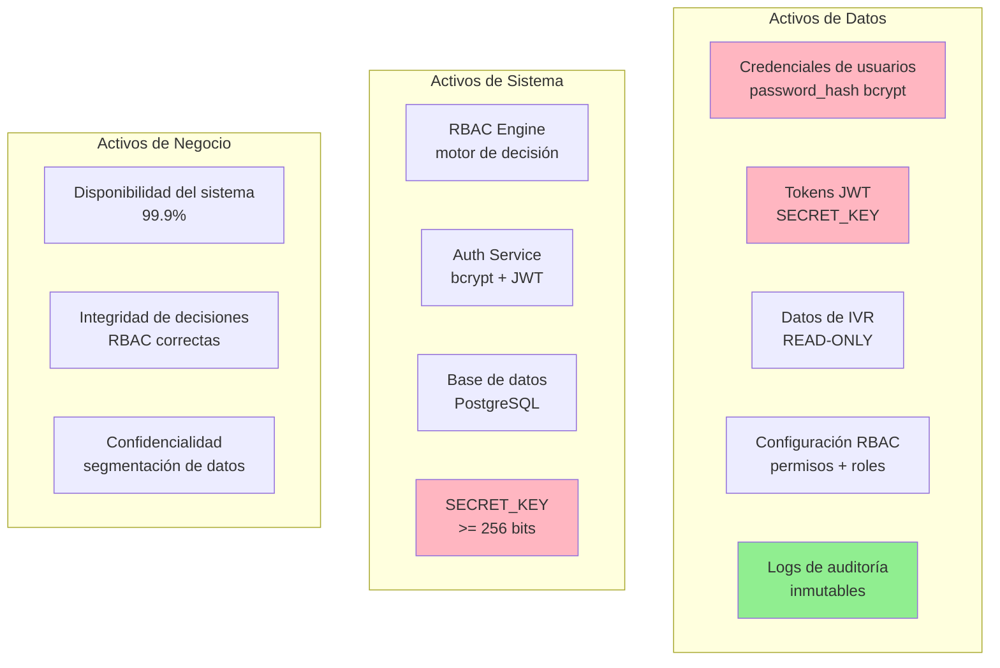
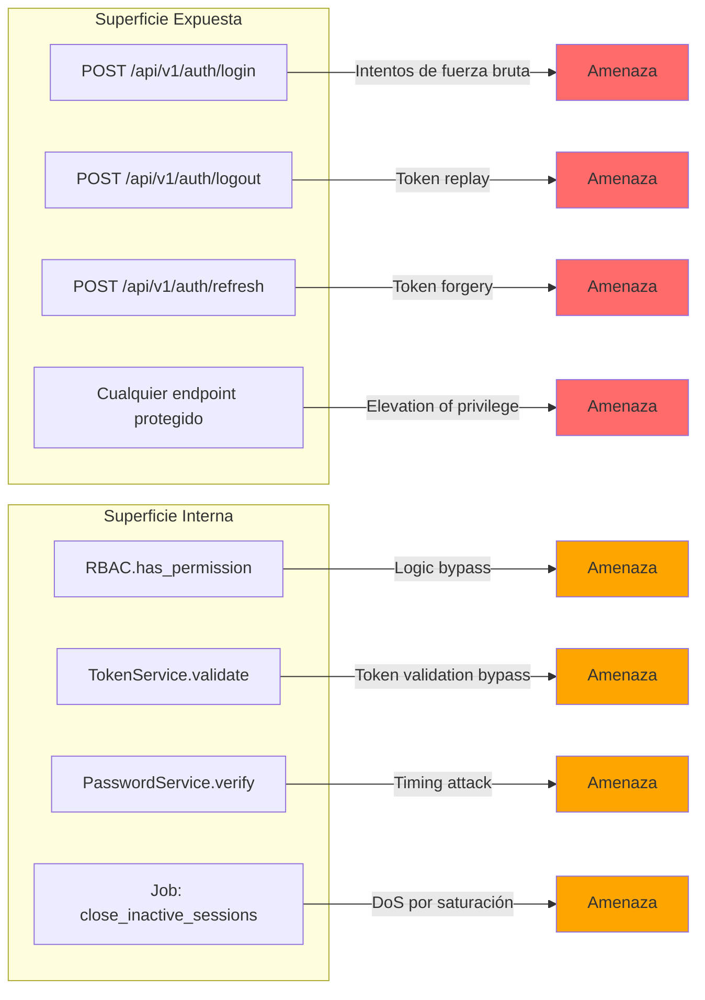
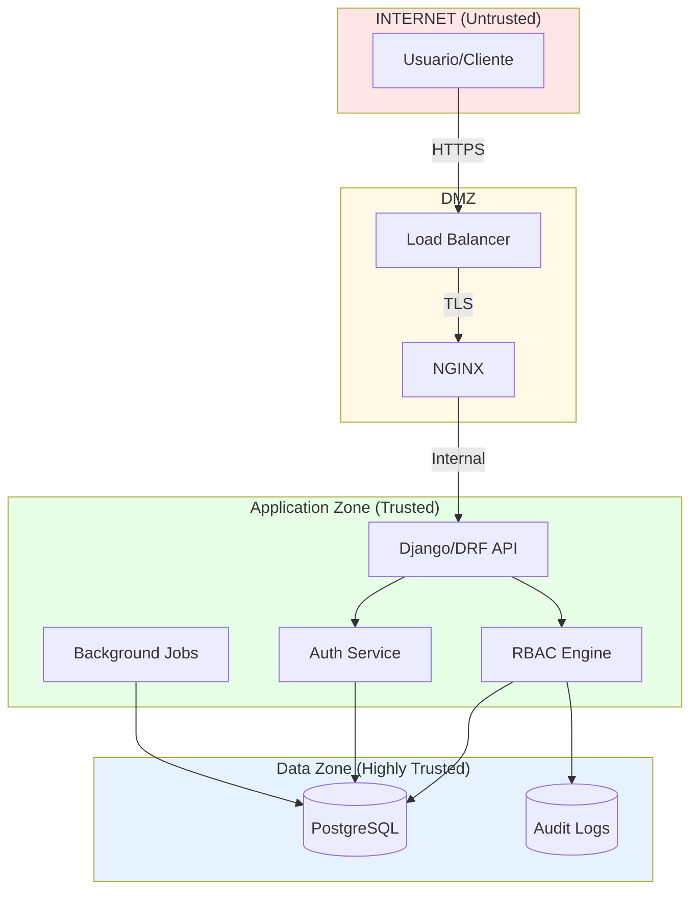
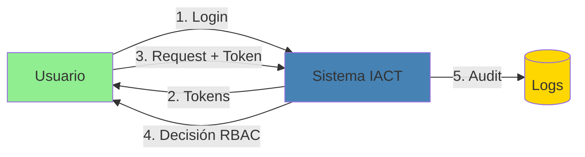
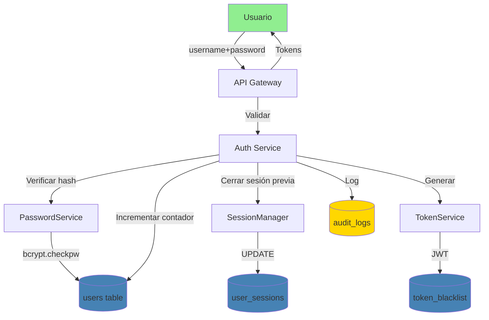
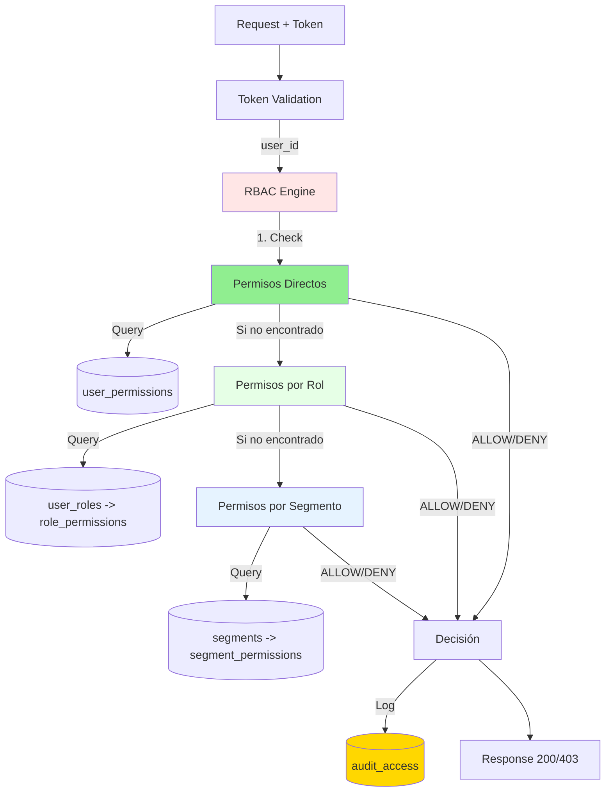
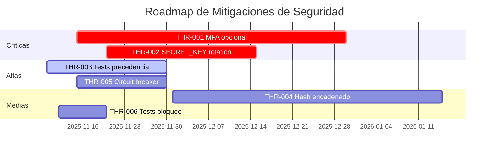
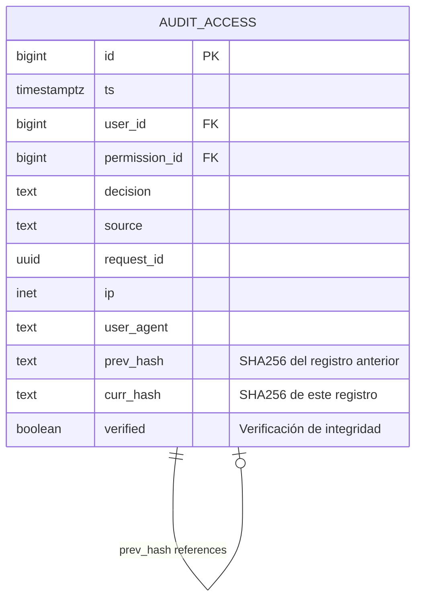
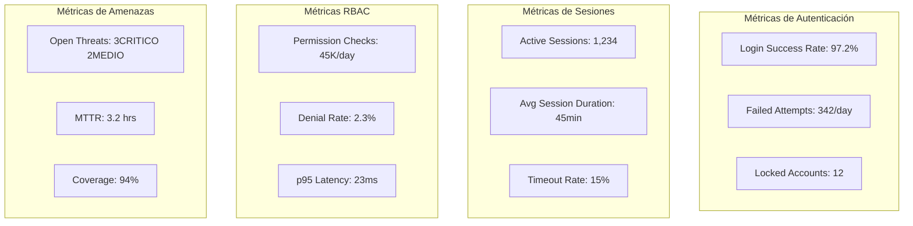
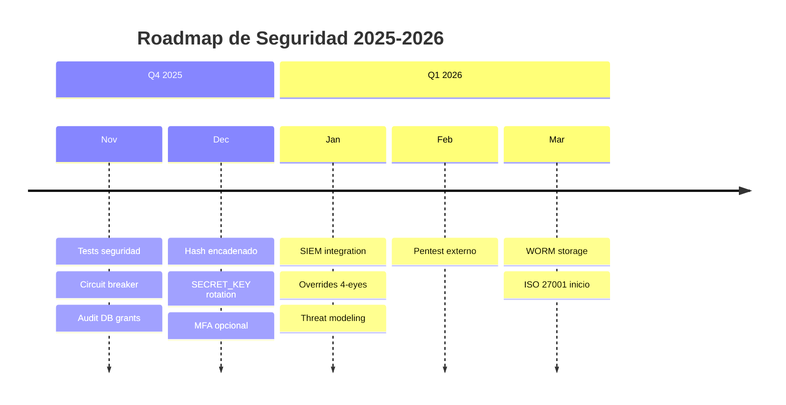

# Análisis de Seguridad y Threat Modeling - Sistema IACT

**Versión:** 1.0
**Fecha:** 2025-11-04
**Componente:** Sistema Completo (Autenticación + Permisos RBAC)
**Metodologías:** STRIDE, PASTA, LINDDUN
**Estado:** En Análisis

---

## NOTA Índice

1. [Contexto y Alcance](#1-contexto-y-alcance)
2. [Superficie de Ataque](#2-superficie-de-ataque)
3. [Modelado de Amenazas - DFD](#3-modelado-de-amenazas-dfd)
4. [Análisis STRIDE](#4-análisis-stride)
5. [Catálogo de Amenazas](#5-catálogo-de-amenazas)
6. [Matriz de Riesgos](#6-matriz-de-riesgos)
7. [Modelo de Datos de Seguridad](#7-modelo-de-datos-de-seguridad)
8. [Controles y Mitigaciones](#8-controles-y-mitigaciones)
9. [Auditoría y Trazabilidad](#9-auditoría-y-trazabilidad)
10. [Métricas de Seguridad](#10-métricas-de-seguridad)
11. [Ejercicios y Validación](#11-ejercicios-y-validación)
12. [Roadmap de Seguridad](#12-roadmap-de-seguridad)

---

## 1. Contexto y Alcance

### 1.1 Dominio del Sistema

**Sistema:** IACT - Plataforma de análisis y gestión de call center

**Componentes de Seguridad:**

1. **Autenticación Local**
 - Solo credenciales locales (NO LDAP/OAuth/SAML)
 - Hash bcrypt cost factor 12
 - JWT con tiempos estrictos (15min/7días)
 - Límite de 3 intentos fallidos
 - Bloqueo temporal de 15 minutos

2. **Sistema RBAC de 3 Niveles**
 - Nivel 1: Permisos directos (mayor precedencia)
 - Nivel 2: Permisos por rol
 - Nivel 3: Permisos por segmento (menor precedencia)
 - Short-circuit obligatorio
 - Permisos granulares (recurso.acción)

3. **Gestión de Sesiones**
 - Sesión única por usuario (máximo 1 activa)
 - Almacenamiento en PostgreSQL (NO Redis)
 - Cierre automático por inactividad (30 min)
 - Tokens JWT stateless

### 1.2 Restricciones Críticas de Seguridad

Del documento `restricciones_y_lineamientos.md`:

| ID | Restricción | Impacto en Seguridad |
|----|-------------|----------------------|
| RESTR-001 | NO NO EMAIL | Notificaciones solo por buzón interno - no se filtra info por email |
| RESTR-002 | CRITICO IVR DB READONLY | Base IVR es read-only - previene inyección de datos |
| RESTR-003 | SAVE SESSIONS IN DB | Sesiones en PostgreSQL - no Redis expuesto |
| RESTR-005 | CONFIG DEBUG=FALSE | Siempre producción - no leak de stack traces |
| RESTR-006 | CRITICO JWT + PERMISSIONS | Autenticación robusta obligatoria |
| RESTR-008 | NOTA AUDITING | Logs obligatorios - trazabilidad completa |
| RESTR-009 | CRITICO NO CVE HIGH | Dependencias seguras - escaneo continuo |
| RESTR-010 | DELETE LOGICAL DELETE | Eliminación lógica - mantiene auditoría |

### 1.3 Activos Críticos



---

## 2. Superficie de Ataque

### 2.1 Puntos de Entrada



### 2.2 Límites de Confianza



---

## 3. Modelado de Amenazas - DFD

### 3.1 DFD Nivel 0 - Sistema Completo



### 3.2 DFD Nivel 1 - Flujo de Autenticación



### 3.3 DFD Nivel 1 - Flujo de Decisión RBAC



---

## 4. Análisis STRIDE

### 4.1 STRIDE per Component

| Componente | S (Spoofing) | T (Tampering) | R (Repudiation) | I (Info Disclosure) | D (DoS) | E (Elevation) |
|------------|--------------|---------------|-----------------|---------------------|---------|---------------|
| **Login Endpoint** | Token robado/falsificado | Payload modificado | Sin auditoría | Leak de username válido | Brute force | N/A |
| **Auth Service** | Bypass de validación | Alteración de lógica | Logs incompletos | Stack traces en error | CPU exhaustion (bcrypt) | N/A |
| **RBAC Engine** | Cache poisoning | Logic bypass | Decisión sin log | Leak de estructura RBAC | Query flooding | Bypass de precedencia |
| **Token Service** | JWT forgery | Algoritmo None | Sin blacklist | Claims sensibles | Blacklist overflow | Token sin expiración |
| **PostgreSQL** | SQL injection | UPDATE sin WHERE | Transacciones sin log | Dump de BD | Connection exhaustion | GRANT abuse |
| **Audit Logs** | N/A | Alteración de logs | Falta de firma | Leak de PII | Log flooding | N/A |

### 4.2 STRIDE per Interaction

#### Interacción: Usuario -> API Gateway

| Categoría | Amenaza | Control Actual | Gap |
|-----------|---------|----------------|-----|
| **S** | Suplantación de usuario con credenciales robadas | bcrypt cost 12 + 15min bloqueo | OK Adicionar: MFA opcional |
| **T** | MITM modificando payload | TLS obligatorio | OK Verificar: Certificate pinning |
| **R** | Usuario niega haber hecho login | Auditoría completa | OK OK |
| **I** | Leak de username válido en error | Mensaje genérico | OK OK |
| **D** | Brute force de login | Rate limiting 5/5min | OK OK |
| **E** | N/A | N/A | N/A |

#### Interacción: API Gateway -> Auth Service

| Categoría | Amenaza | Control Actual | Gap |
|-----------|---------|----------------|-----|
| **S** | Falsificación de llamada interna | Autenticación de servicio | NO Adicionar: mTLS interno |
| **T** | Modificación de parámetros | Validación de esquema | OK OK |
| **R** | Acción sin traza | Logs completos | OK OK |
| **I** | Leak de password_hash | No se retorna nunca | OK OK |
| **D** | Saturación de bcrypt | Timeout + circuit breaker | WARNING Mejorar |
| **E** | Bypass de validación | Lógica centralizada | OK OK |

#### Interacción: RBAC Engine -> Base de Datos

| Categoría | Amenaza | Control Actual | Gap |
|-----------|---------|----------------|-----|
| **S** | Spoofing de consulta | Parametrización ORM | OK OK |
| **T** | SQL injection | Django ORM | OK OK |
| **R** | Cambio sin auditoría | Triggers de auditoría | NO Adicionar |
| **I** | Dump de permisos | Least privilege | WARNING Verificar grants |
| **D** | Query bombing | Connection pooling | WARNING Adicionar query timeout |
| **E** | Modificación directa de BD | No acceso directo en app | OK OK |

---

## 5. Catálogo de Amenazas

### 5.1 Amenazas Críticas (Riesgo >= 9)

| ID | Descripción | STRIDE | Componente | Probabilidad | Impacto | Riesgo |
|----|-------------|--------|------------|--------------|---------|--------|
| **THR-001** | Credenciales comprometidas permiten acceso total | S | Login | Alta (3) | Crítico (3) | 9 CRITICO |
| **THR-002** | JWT SECRET_KEY filtrada permite falsificación | S | TokenService | Media (2) | Crítico (3) | 6 MEDIO |
| **THR-003** | Bypass de precedencia RBAC permite elevación | E | RBAC Engine | Media (2) | Crítico (3) | 6 MEDIO |
| **THR-004** | Alteración de audit_logs oculta actividad maliciosa | T,R | Audit | Media (2) | Alto (3) | 6 MEDIO |
| **THR-005** | DoS por brute force de login satura bcrypt | D | Auth Service | Alta (3) | Medio (2) | 6 MEDIO |
| **THR-006** | Usuario sin bloqueo después de 3 intentos | E | Login | Baja (1) | Alto (3) | 3 ALTO |

### 5.2 Amenazas Altas (Riesgo 4-6)

| ID | Descripción | STRIDE | Componente | Probabilidad | Impacto | Riesgo |
|----|-------------|--------|------------|--------------|---------|--------|
| **THR-007** | Token replay después de logout | S | TokenService | Media (2) | Medio (2) | 4 ALTO |
| **THR-008** | Leak de estructura de permisos en errores | I | RBAC Engine | Media (2) | Bajo (1) | 2 BAJO |
| **THR-009** | Session fixation por reutilización de session_key | S | SessionManager | Baja (1) | Medio (2) | 2 BAJO |
| **THR-010** | Timing attack en bcrypt revela username válido | I | PasswordService | Baja (1) | Bajo (1) | 1 BAJO |

### 5.3 Amenazas Específicas por Restricción

| Restricción | Amenaza Derivada | Mitigación |
|-------------|------------------|------------|
| **NO EMAIL** | No se puede notificar incidentes por email | OK Buzón interno + alertas en app |
| **SESSIONS IN DB** | PostgreSQL down = pérdida de todas las sesiones | WARNING Replicación de BD + alta disponibilidad |
| **NO REDIS** | No cache distribuido para RBAC = latencia | OK Cache local por request + índices BD |
| **JWT stateless** | Access token válido hasta expirar (no revocable) | OK Tiempo corto (15min) + blacklist refresh |
| **DEBUG=FALSE** | Menos información para depurar ataques | OK Logs centralizados estructurados |

---

## 6. Matriz de Riesgos

### 6.1 Matriz Visual

```
 IMPACTO ->
P 1-Bajo 2-Medio 3-Alto 
R 3 3ALTO 6MEDIO 9CRITICO THR-001, THR-005
O 2 2BAJO 4ALTO 6MEDIO THR-002, THR-003, THR-004
B 1 1BAJO 2BAJO 3ALTO THR-006
 ↓
```

### 6.2 Matriz Detallada con Controles

| ID | Prob | Imp | Riesgo | Control Principal | Control Secundario | Due Date | Owner | Estado |
|----|------|-----|--------|-------------------|-------------------|----------|-------|--------|
| THR-001 | 3 | 3 | 9CRITICO | MFA opcional | Rate limit + bloqueo | 2025-12-31 | SecApp | Abierta |
| THR-002 | 2 | 3 | 6MEDIO | SECRET_KEY en secrets manager | Rotación trimestral | 2025-12-15 | DevSecOps | Abierta |
| THR-003 | 2 | 3 | 6MEDIO | Tests de precedencia | Code review obligatorio | 2025-11-30 | Dev | En progreso |
| THR-004 | 2 | 3 | 6MEDIO | Hash encadenado en logs | WORM storage | 2026-01-15 | SRE | Planificada |
| THR-005 | 3 | 2 | 6MEDIO | Rate limit 5/5min | Circuit breaker | 2025-11-30 | InfraSec | En progreso |
| THR-006 | 1 | 3 | 3ALTO | Tests de bloqueo | Monitoreo de intentos | 2025-11-20 | QA | En progreso |

### 6.3 Backlog Priorizado



---

## 7. Modelo de Datos de Seguridad

### 7.1 Auditoría Mejorada con Hash Encadenado



**Algoritmo de Hash:**
```
curr_hash = SHA256(
 id || ts || user_id || permission_id ||
 decision || source || request_id || prev_hash
)
```

### 7.2 Overrides Temporales (Feature Opcional)

```sql
CREATE TABLE user_permission_overrides (
 id BIGSERIAL PRIMARY KEY,
 user_id BIGINT NOT NULL REFERENCES users(id) ON DELETE CASCADE,
 permission_id BIGINT NOT NULL REFERENCES permissions(id) ON DELETE CASCADE,
 decision BOOLEAN NOT NULL, -- TRUE=allow, FALSE=deny
 valid_from TIMESTAMPTZ NOT NULL DEFAULT now(),
 valid_to TIMESTAMPTZ NOT NULL, -- Obligatorio
 motivo TEXT NOT NULL,
 granted_by BIGINT NOT NULL REFERENCES users(id),
 approved_by BIGINT REFERENCES users(id), -- 4-eyes principle
 created_at TIMESTAMPTZ NOT NULL DEFAULT now(),
 revoked_at TIMESTAMPTZ,
 CONSTRAINT valid_period CHECK (valid_to > valid_from),
 CONSTRAINT max_duration CHECK (valid_to <= valid_from + interval '30 days'),
 CONSTRAINT no_self_grant CHECK (granted_by != user_id)
);

CREATE INDEX idx_overrides_active ON user_permission_overrides(user_id, permission_id)
 WHERE revoked_at IS NULL AND now() BETWEEN valid_from AND valid_to;
```

**Reglas de Negocio:**
1. **Deny override** tiene precedencia sobre permisos de roles
2. **Allow override** se suma a permisos existentes (no reemplaza)
3. Duración máxima: 30 días
4. Requiere aprobación de 4-eyes para permisos críticos
5. Auto-revocación al llegar a `valid_to`

### 7.3 Modelo de Precedencia con Overrides

```

 NIVEL 0: Overrides DENY (precedencia máxima) 

 ↓ Si no hay deny override

 NIVEL 1: Permisos Directos 

 ↓ Si no encontrado

 NIVEL 2: Permisos por Rol 

 ↓ Si no encontrado

 NIVEL 3: Permisos por Segmento 

 ↓ Si no encontrado

 NIVEL 4: Overrides ALLOW (menor precedencia) 

 ↓ Si no hay allow override
 DENY por defecto
```

---

## 8. Controles y Mitigaciones

### 8.1 Controles Preventivos

| Control | Descripción | Componente | Estado |
|---------|-------------|------------|--------|
| **CNT-001** | Rate limiting 5 requests/5min en login | NGINX | OK Implementado |
| **CNT-002** | bcrypt cost factor 12 | PasswordService | OK Implementado |
| **CNT-003** | Bloqueo tras 3 intentos fallidos | AuthService | OK Implementado |
| **CNT-004** | JWT expiración 15min access, 7días refresh | TokenService | OK Implementado |
| **CNT-005** | Sesión única por usuario | SessionManager | OK Implementado |
| **CNT-006** | Parametrización de queries (ORM) | RBAC Engine | OK Implementado |
| **CNT-007** | Validación de esquemas de input | Serializers | ESPERANDO En progreso |
| **CNT-008** | SECRET_KEY >= 256 bits desde env | Settings | OK Implementado |
| **CNT-009** | TLS 1.3 obligatorio | NGINX | ESPERANDO Verificar |
| **CNT-010** | Least privilege en DB grants | PostgreSQL | ESPERANDO Auditar |

### 8.2 Controles Detectivos

| Control | Descripción | Implementación | Estado |
|---------|-------------|----------------|--------|
| **CNT-011** | Auditoría completa de decisiones RBAC | audit_access table | OK Implementado |
| **CNT-012** | Monitoreo de intentos fallidos | Logs + alertas | ESPERANDO Planificado |
| **CNT-013** | Detección de anomalías en accesos | SIEM | ESPERANDO Planificado |
| **CNT-014** | Alertas de bloqueos masivos | Prometheus | ESPERANDO Planificado |
| **CNT-015** | Verificación de hash de logs | Job diario | NO Pendiente |

### 8.3 Controles Correctivos

| Control | Descripción | SLA | Owner |
|---------|-------------|-----|-------|
| **CNT-016** | Revocación manual de tokens | < 5 min | SecOps |
| **CNT-017** | Desbloqueo manual de cuentas | < 15 min | Support |
| **CNT-018** | Rollback de cambios de permisos | < 30 min | Admin |
| **CNT-019** | Rotación de SECRET_KEY comprometida | < 2 hrs | DevSecOps |
| **CNT-020** | Respuesta a incidentes | < 4 hrs | CSIRT |

---

## 9. Auditoría y Trazabilidad

### 9.1 Eventos Auditados

| Categoría | Evento | Campos Críticos | Retención |
|-----------|--------|-----------------|-----------|
| **Autenticación** | LOGIN_SUCCESS | user_id, ip, user_agent, session_id | 1 año |
| **Autenticación** | LOGIN_FAILURE | username (no user_id), ip, attempts_remaining | 1 año |
| **Autenticación** | USER_LOCKED | user_id, reason, locked_until | 2 años |
| **Autenticación** | USER_UNLOCKED | user_id, reason, performed_by | 2 años |
| **Sesiones** | SESSION_CLOSED | user_id, reason (MANUAL/TIMEOUT/NEW) | 6 meses |
| **Sesiones** | SESSION_TIMEOUT | user_id, inactive_minutes | 6 meses |
| **RBAC** | PERMISSION_CHECK | user_id, permission_id, decision, source | 1 año |
| **RBAC** | PERMISSION_GRANT | user_id, permission_id, granted_by | 5 años |
| **RBAC** | PERMISSION_REVOKE | user_id, permission_id, revoked_by | 5 años |
| **Tokens** | TOKEN_REFRESH | user_id, old_jti, new_jti | 3 meses |
| **Tokens** | TOKEN_BLACKLIST | jti, reason | 7 días |

### 9.2 Consultas de Auditoría Críticas

```sql
-- 1. Usuarios con múltiples intentos fallidos recientes
SELECT user_id, COUNT(*) as failed_attempts, MAX(ts) as last_attempt
FROM audit_logs
WHERE event_type = 'LOGIN_FAILURE'
 AND ts >= now() - interval '1 hour'
GROUP BY user_id
HAVING COUNT(*) >= 5
ORDER BY failed_attempts DESC;

-- 2. Decisiones RBAC negadas por usuario
SELECT user_id, permission_id, COUNT(*) as denials
FROM audit_access
WHERE decision = 'deny'
 AND ts >= now() - interval '24 hours'
GROUP BY user_id, permission_id
ORDER BY denials DESC;

-- 3. Verificación de integridad de logs (hash encadenado)
WITH RECURSIVE chain AS (
 SELECT id, prev_hash, curr_hash,
 SHA256(id || ts || user_id || ... || prev_hash) AS computed_hash
 FROM audit_access
 WHERE id = 1
 UNION ALL
 SELECT a.id, a.prev_hash, a.curr_hash,
 SHA256(a.id || a.ts || ... || a.prev_hash) AS computed_hash
 FROM audit_access a
 JOIN chain c ON a.prev_hash = c.curr_hash
)
SELECT id, curr_hash, computed_hash,
 (curr_hash = computed_hash) AS verified
FROM chain
WHERE NOT verified;

-- 4. Actividad de usuarios bloqueados
SELECT al.user_id, al.event_type, al.ts, u.is_locked
FROM audit_logs al
JOIN users u ON u.id = al.user_id
WHERE u.is_locked = TRUE
 AND al.ts >= now() - interval '7 days'
ORDER BY al.ts DESC;
```

### 9.3 Retención y Archivado

| Tipo de Log | Retención Activa | Archivado | Formato Archivo |
|-------------|------------------|-----------|-----------------|
| audit_access | 1 año | 5 años | Parquet + GZIP |
| audit_logs | 1 año | 5 años | Parquet + GZIP |
| token_blacklist | 7 días | No | N/A |
| django_session | 30 días | No | N/A |

---

## 10. Métricas de Seguridad

### 10.1 KPIs de Seguridad

| Métrica | Fórmula | Objetivo | Frecuencia |
|---------|---------|----------|------------|
| **Tasa de login exitoso** | (login_success / total_logins) × 100 | > 95% | Diaria |
| **Tasa de cuentas bloqueadas** | (accounts_locked / active_users) × 100 | < 2% | Semanal |
| **MTTR de incidentes** | avg(resolved_at - detected_at) | < 4 hrs | Por incidente |
| **% de amenazas mitigadas** | (mitigated / total_threats) × 100 | > 90% | Mensual |
| **% de logs íntegros** | (verified_logs / total_logs) × 100 | 100% | Diaria |
| **Latencia de RBAC** | p95(rbac_decision_time) | < 50ms | Continua |

### 10.2 Dashboard de Seguridad



### 10.3 Alertas Críticas

| Alerta | Condición | Acción Automática | Escalamiento |
|--------|-----------|-------------------|--------------|
| **ALT-001** | > 100 intentos fallidos/min | Activar WAF block | SecOps (inmediato) |
| **ALT-002** | > 50 cuentas bloqueadas/hr | Investigar patrón | SecOps (15 min) |
| **ALT-003** | Token blacklist > 10K entries | Cleanup job | SRE (1 hr) |
| **ALT-004** | Logs con hash inválido | Bloquear escritura | CSIRT (inmediato) |
| **ALT-005** | RBAC p95 > 100ms | Verificar índices | DBA (30 min) |
| **ALT-006** | SECRET_KEY en logs | Rotar inmediatamente | DevSecOps (crítico) |

---

## 11. Ejercicios y Validación

### 11.1 Ejercicio 1: Threat Modeling Session (60 min)

**Objetivo:** Identificar 10 nuevas amenazas usando STRIDE

**Materiales:**
- DFD del sistema
- Lista de activos críticos
- Plantilla YAML de amenazas

**Pasos:**
1. Dividir en equipos de 3-4 personas
2. Asignar 1 componente por equipo
3. Aplicar STRIDE a cada interacción
4. Priorizar con matriz Probabilidad × Impacto
5. Documentar en YAML

**Entregable:** 10 amenazas con controles propuestos

### 11.2 Ejercicio 2: Elevation of Privilege (Game)

**Duración:** 90 min
**Participantes:** 4-6
**Material:** Baraja EoP de Microsoft

**Objetivo:** Identificar 15 amenazas de elevación de privilegios

### 11.3 Tests de Penetración Simulados

```python
# TEST-SEC-001: Brute force de login
def test_brute_force_protection():
 for i in range(6):
 response = client.post('/api/v1/auth/login', {
 'username': 'testuser',
 'password': f'wrong{i}'
 })
 assert response.status_code == 429 # Too Many Requests

# TEST-SEC-002: JWT forgery con algoritmo None
def test_jwt_none_algorithm_rejected():
 fake_token = jwt.encode({'user_id': 1}, None, algorithm='none')
 response = client.get('/api/v1/protected',
 headers={'Authorization': f'Bearer {fake_token}'})
 assert response.status_code == 401

# TEST-SEC-003: Bypass de precedencia RBAC
def test_rbac_precedence_cannot_be_bypassed():
 # Dar permiso directo DENY y permiso por rol ALLOW
 # Verificar que DENY gana
 user = create_user()
 permission = create_permission('analytics.view')
 assign_direct_permission(user, permission, allow=False)
 assign_role_permission(user, permission, allow=True)

 result = rbac.has_permission(user, 'analytics.view')
 assert result is False # Direct DENY debe ganar

# TEST-SEC-004: SQL injection en RBAC queries
def test_sql_injection_prevention():
 malicious_input = "'; DROP TABLE users; --"
 result = rbac.has_permission(user, malicious_input)
 # No debe lanzar excepción, debe retornar False
 assert result is False
```

---

## 12. Roadmap de Seguridad

### 12.1 Q4 2025

- OK **Noviembre:**
 - Completar tests de seguridad (THR-006, THR-003)
 - Implementar circuit breaker para bcrypt (THR-005)
 - Auditar grants de PostgreSQL (CNT-010)

- ESPERANDO **Diciembre:**
 - Implementar hash encadenado en logs (THR-004)
 - Rotación de SECRET_KEY (THR-002)
 - MFA opcional para admins (THR-001)

### 12.2 Q1 2026

- **Enero:**
 - SIEM integración para detección de anomalías (CNT-013)
 - Implementar overrides temporales con 4-eyes (Feature)
 - Threat modeling session trimestral

- **Febrero-Marzo:**
 - Penetration testing externo
 - WORM storage para auditoría crítica
 - Certificación ISO 27001 (inicio)

### 12.3 Roadmap Visual



---

## 13. Plantillas y Checklists

### 13.1 Template: Registro de Amenaza (YAML)

```yaml
id: THR-XXX
fecha_identificacion: 2025-11-04
sistema: iact-autenticacion
componente: <auth|rbac|session|token|db|audit>
interaccion: <usuario-api|api-auth|rbac-db|...>
metodologia: <STRIDE|PASTA|LINDDUN>
categoria_stride: <S|T|R|I|D|E>

amenaza:
 titulo: <título breve>
 descripcion: |
 <descripción detallada>
 actor: <externo|interno|privilegiado>
 vector_ataque: <endpoint|db|config|...>

evaluacion:
 probabilidad: <1-Baja|2-Media|3-Alta>
 impacto: <1-Bajo|2-Medio|3-Alto>
 riesgo_calculado: <1-9>
 clasificacion: <BAJO|ALTO|MEDIO|CRITICO>

controles:
 preventivos:
 - <control 1>
 - <control 2>
 detectivos:
 - <control 3>
 correctivos:
 - <control 4>

prueba_validacion: |
 <cómo se validará que el control funciona>

asignacion:
 owner: <equipo/persona>
 due_date: 2025-12-31
 prioridad: <P0|P1|P2|P3>

estado: <abierta|en_progreso|mitigada|aceptada|cerrada>

referencias:
 - RF-XXX
 - TEST-XXX
 - DOC-XXX
```

### 13.2 Checklist: Pre-Deploy de Seguridad

```markdown
## Checklist de Seguridad Pre-Deploy

### Configuración
- [ ] SECRET_KEY >= 256 bits desde variable de entorno
- [ ] DEBUG=False en producción
- [ ] ALLOWED_HOSTS configurado correctamente
- [ ] TLS 1.3 habilitado
- [ ] Rate limiting activo (5 req/5min en login)

### Credenciales
- [ ] bcrypt cost factor = 12
- [ ] Password requirements validados (8-100 chars, complejidad)
- [ ] Historial de passwords (últimas 5) implementado
- [ ] Bloqueo tras 3 intentos fallidos funcional

### Tokens JWT
- [ ] Access token = 15 minutos exactos
- [ ] Refresh token = 7 días exactos
- [ ] Rotación de refresh tokens activa
- [ ] Blacklist después de rotación activa
- [ ] Claims personalizados no incluyen datos sensibles

### Sesiones
- [ ] SESSION_ENGINE = 'django.contrib.sessions.backends.db'
- [ ] NO se usa Redis
- [ ] Sesión única por usuario implementada
- [ ] Cierre por inactividad (30 min) configurado
- [ ] Job de limpieza programado (cada 5 min)

### RBAC
- [ ] Precedencia de 3 niveles testeada
- [ ] Short-circuit implementado
- [ ] Tests de bypass pasando
- [ ] Permisos (recurso.acción) únicos

### Auditoría
- [ ] Todos los eventos críticos auditados
- [ ] Retención configurada (1 año activa)
- [ ] NO se almacena IP address (restricción)
- [ ] Hash de logs (opcional) implementado

### Base de Datos
- [ ] Least privilege grants aplicados
- [ ] Backup automático configurado
- [ ] Replicación activa (HA)
- [ ] Connection pooling configurado
- [ ] Query timeout definido

### Monitoreo
- [ ] Alertas críticas configuradas
- [ ] Dashboard de seguridad desplegado
- [ ] Logs centralizados
- [ ] SIEM integrado (si aplica)
```

### 13.3 Checklist: Revisión Trimestral de Seguridad

```markdown
## Checklist de Revisión Trimestral

### Amenazas
- [ ] Revisar catálogo de amenazas (nuevas/cerradas)
- [ ] Actualizar matriz de riesgos
- [ ] Verificar cumplimiento de due dates
- [ ] Re-evaluar probabilidades/impactos

### Controles
- [ ] Verificar controles preventivos activos
- [ ] Revisar efectividad de detectivos
- [ ] Probar controles correctivos (drill)
- [ ] Actualizar runbooks

### Auditoría
- [ ] Verificar integridad de logs (hash)
- [ ] Revisar eventos anómalos
- [ ] Validar retención y archivado
- [ ] Limpiar datos expirados

### Configuración
- [ ] Rotar SECRET_KEY (si aplica)
- [ ] Actualizar dependencias (CVE check)
- [ ] Revisar grants de BD
- [ ] Verificar certificados TLS

### Métricas
- [ ] Evaluar KPIs de seguridad
- [ ] Analizar tendencias de amenazas
- [ ] Calcular MTTR promedio
- [ ] Reportar a stakeholders

### Entrenamiento
- [ ] Threat modeling session
- [ ] Juego EoP/Cornucopia
- [ ] Revisar incidentes pasados
- [ ] Actualizar documentación
```

---

## 14. Referencias

### 14.1 Documentos Relacionados

- **Diseño Técnico:** `docs/backend/diseno/DISENO_TECNICO_AUTENTICACION.md`
- **Requisitos:** `docs/backend/requisitos/funcionales/rf*.md`
- **Restricciones:** `docs/backend/requisitos/restricciones_y_lineamientos.md`
- **Tests:** `api/callcentersite/tests/authentication/test_*.py`

### 14.2 Metodologías

- **STRIDE:** Microsoft Threat Modeling
- **PASTA:** Process for Attack Simulation and Threat Analysis
- **LINDDUN:** Privacy threat modeling
- **OWASP ASVS:** Application Security Verification Standard
- **NIST Cybersecurity Framework**

### 14.3 Herramientas

- **Threat Modeling:** Microsoft Threat Modeling Tool
- **Juegos:** EoP Card Game, OWASP Cornucopia, LINDDUN GO
- **SIEM:** Elasticsearch/Kibana (ELK Stack)
- **Vulnerability Scanning:** OWASP ZAP, Bandit, Safety

---

## Control de Cambios

| Versión | Fecha | Autor | Cambios |
|---------|-------|-------|---------|
| 1.0 | 2025-11-04 | claude | Creación inicial basada en RBAC Canvas adaptado a IACT |

---

**Última actualización:** 2025-11-04
**Próxima revisión:** 2025-12-04 (mensual)
**Owner:** Equipo de Seguridad + DevSecOps

> *"Threat modeling no es un evento único, es un proceso continuo"*
