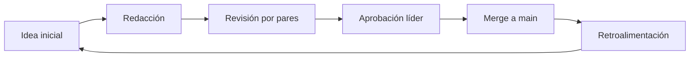

# Documentación Corporativa en Markdown (Repositorio GitHub)

<thinking>
Contextualizar cada sección con evidencias verificables.
</thinking>

## Sección 1 - Objetivo Estratégico
### Qué
Definir el propósito central de la documentación corporativa en Markdown alojada en GitHub alineado al plan estratégico vigente y a la Oficina de Transformación Digital.
### Cómo
Publicar el mandato ejecutivo en la carpeta `docs/`, relacionarlo con los KPIs trimestrales y mantenerlo visible mediante enlaces destacados en el readme principal del repositorio.

## Sección 2 - Alcance Organizacional
### Qué
Detallar las áreas, roles y permisos involucrados en la gestión del repositorio de documentación, incluyendo equipos internos y partners externos certificados.
### Cómo
Configurar equipos y revisores en GitHub, documentar en una tabla las responsabilidades por módulo y registrar excepciones de acceso con plantillas de "Control de Acceso".

## Sección 3 - Arquitectura de Información
### Qué
Establecer el mapa de carpetas, etiquetas y páginas maestras que estructuran la información corporativa siguiendo el modelo monolito modular.
### Cómo
Diseñar un árbol de navegación en Markdown con índices jerarquizados, registrar dependencias en una tabla de trazabilidad y validar la consistencia mediante revisiones trimestrales en issues dedicados.

## Sección 4 - Flujo Editorial
### Qué
Visualizar el proceso de creación, revisión y publicación de contenido conforme a la metodología TDD documental.
### Cómo
Implementar un diagrama de flujo en Mermaid dentro del repositorio, automatizar asignaciones de revisores con GitHub Actions y asociar responsables por fase usando el esquema RACI.



## Sección 5 - Plantillas Oficiales
### Qué
Inventariar las plantillas normativas utilizadas para documentación de proyectos, ADRs y reportes regulatorios.
### Cómo
Mantener un listado versionado con links, fecha de última revisión y responsable de mantenimiento en una tabla centralizada dentro del repositorio.

| Plantilla | Uso | Responsable | Última revisión |
|-----------|-----|-------------|-----------------|
| Proyecto Base | Kick-off de iniciativas | PMO | 2024-02-10 |
| ADR Corporativo | Decisiones arquitectónicas | CTO | 2024-03-04 |
| Informe Regulatorio | Reportes trimestrales | Legal | 2024-01-22 |

## Sección 6 - Normas de Estilo
### Qué
Documentar pautas de lenguaje directo, formato y requisitos de citación para todas las publicaciones internas en Markdown.
### Cómo
Aplicar la guía corporativa, usar checklists de revisión lingüística y automatizar verificaciones con linters como `markdownlint` en GitHub Actions.

## Sección 7 - Gestión de Versiones
### Qué
Controlar la evolución del contenido y garantizar trazabilidad de cambios significativos en documentos clave.
### Cómo
Activar reglas de protección de ramas, comparar diffs en pull requests antes de aprobar modificaciones y etiquetar versiones estables del repositorio.

## Sección 8 - Integración con Gestión de Trabajo
### Qué
Describir cómo se enlaza la documentación con tableros de trabajo para seguimiento de historias, bugs y retrospectivas.
### Cómo
Conectar issues y proyectos de GitHub con los documentos, usar enlaces inteligentes en Markdown y auditar el cumplimiento de TDD cruzando evidencias de tests en los reportes de CI.

## Sección 9 - Seguridad y Cumplimiento
### Qué
Resumir las políticas de acceso, retención de datos y controles de cumplimiento normativo aplicables al repositorio.
### Cómo
Aplicar políticas de branch protection, configurar escaneos de secretos, registrar auditorías trimestrales y coordinar con Seguridad de la Información para ajustes.

## Sección 10 - Automatizaciones
### Qué
Enumerar scripts y automatizaciones que soportan mantenimientos, notificaciones y sincronizaciones del repositorio de documentación.
### Cómo
Gestionar jobs en el orquestador interno, documentar parámetros en la página "Runbook" y validar logs semanalmente.

```bash
# Ejemplo de ejecución del job de respaldo nocturno
./scripts/backup_docs.sh --output backups/docs-$(date +%F).zip
```

## Sección 11 - Capacitación
### Qué
Definir la malla de formación para editores y consumidores de la documentación.
### Cómo
Planificar sesiones mensuales, publicar recursos e-learning en la carpeta `docs/capacitacion/` y evaluar competencias con encuestas de satisfacción.

## Sección 12 - Métricas y KPIs
### Qué
Enumerar indicadores clave de adopción, calidad y cumplimiento documental.
### Cómo
Integrar dashboards con GitHub Insights, crear paneles semanales en Markdown y distribuir reportes automatizados vía notificaciones del repositorio.

## Sección 13 - Gestión de Incidentes
### Qué
Detallar el procedimiento para reportar y resolver incidentes relacionados con la documentación.
### Cómo
Centralizar tickets en issues etiquetados, mantener un runbook actualizado y ejecutar retrospectivas tras incidentes críticos documentadas en la carpeta `docs/incidentes/`.

## Sección 14 - Roadmap de Evolución
### Qué
Presentar la hoja de ruta de mejoras funcionales y de gobernanza para la documentación en GitHub.
### Cómo
Priorizar iniciativas junto al equipo de arquitectura, usar hitos trimestrales en el repositorio y asegurar financiamiento en comité PMO.

## Sección 15 - Checklist de Auditoría
### Qué
Listar los puntos de verificación para auditorías internas de la documentación.
### Cómo
Aplicar la siguiente lista de control y documentar evidencias en la carpeta `docs/cumplimiento/`.

- [x] Permisos revisados y aprobados por Seguridad
- [x] Plantillas alineadas con normas actualizadas
- [ ] KPIs publicados en el dashboard ejecutivo
- [ ] Runbooks validados en el último trimestre
