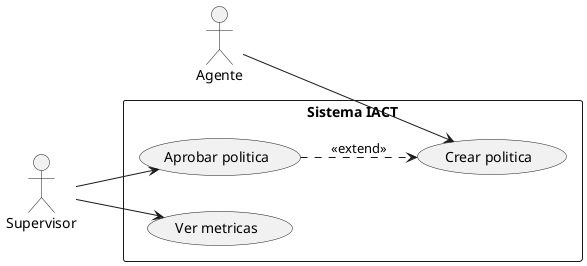

# Diagramas de Casos de Uso

**Tipo:** Diagramas de casos de uso UML
**Notacion:** UML 2.0 Use Case Diagrams
**Herramientas:** PlantUML, Draw.io

---

## Proposito

Diagramas que muestran funcionalidades del sistema desde la perspectiva del usuario.

**Elementos:**
- Actores (usuarios, sistemas externos)
- Casos de uso (funcionalidades)
- Relaciones (include, extend, generalizacion)

---

## Actores del Sistema IACT

**Usuarios humanos:**
- Agente de call center
- Supervisor
- Administrador
- Analista de datos

**Sistemas externos:**
- CRM externo
- Sistema de telefonia
- Servicio de notificaciones

---

## Convenciones

**Nombres:**
```
usecase_{modulo}_{version}.puml
```

**Ejemplos:**
- `usecase_politicas_v1.puml`
- `usecase_alertas_v1.puml`
- `usecase_metricas_v1.puml`

---

## Template PlantUML



---

## Modulos Principales

- [ ] Gestion de politicas
- [ ] Sistema de alertas
- [ ] Metricas y reportes
- [ ] Configuracion del sistema
- [ ] Gestion de horarios

---

**Ultima actualizacion:** 2025-11-16
