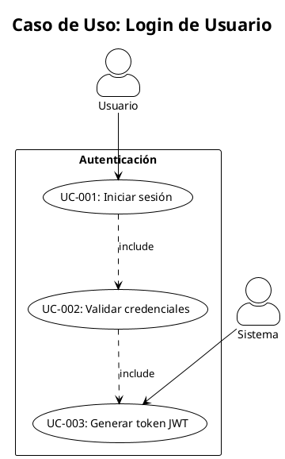
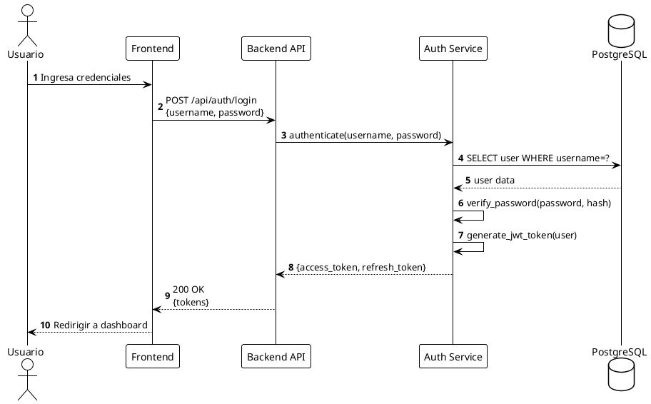
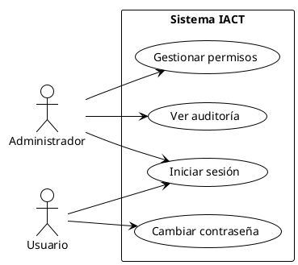
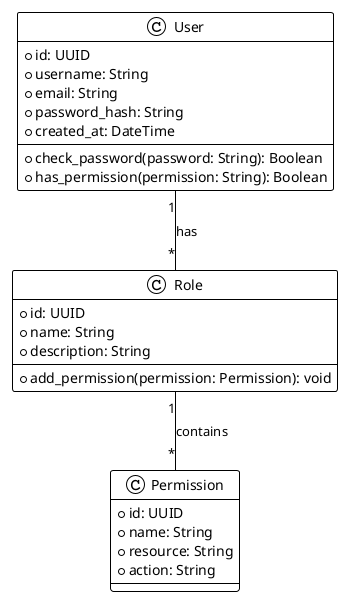

# ADR-GOB-004: PlantUML como Estándar para Diagramas UML

## Estado

**APROBADO** - 2025-11-17

## Contexto

El proyecto IACT requiere documentación técnica con diagramas UML para representar:
- Diagramas de casos de uso
- Diagramas de secuencia
- Diagramas de clases
- Diagramas de componentes
- Diagramas de actividad
- Diagramas de estado
- Diagramas BPMN (procesos de negocio)

Los diagramas son esenciales para:
- Comunicar decisiones arquitectónicas
- Documentar procesos y flujos
- Facilitar onboarding de nuevos desarrolladores
- Mantener documentación sincronizada con código
- Revisión y aprobación de diseños

### Problemas con Herramientas Tradicionales

**Herramientas gráficas (draw.io, Lucidchart, Visio)**:
- Archivos binarios o XML no versionables eficientemente con git
- Difícil ver cambios en diffs de pull requests
- No se puede editar directamente en editor de código
- Requiere herramientas externas para edición
- Difícil mantener sincronización con código
- No hay validación sintáctica

**Imágenes estáticas (PNG, JPG)**:
- No editables (requiere archivo fuente original)
- Difícil actualizar cuando código cambia
- Aumenta tamaño del repositorio
- No versionables semánticamente

### Necesidades Específicas del Proyecto

1. **Versionabilidad**: Diagramas deben ser texto plano para git diff efectivo
2. **Editabilidad**: Desarrolladores deben poder editar sin herramientas especiales
3. **Reproducibilidad**: Mismo código genera mismo diagrama
4. **Integración CI/CD**: Generación automática en pipelines
5. **Documentación como código**: Diagramas viven junto al código
6. **Validación**: Sintaxis validable en PR reviews

## Decisión

**Adoptar PlantUML como estándar exclusivo para todos los diagramas UML en la documentación del proyecto IACT.**

### Especificaciones

**Formato de archivo**:
- Extensión: `.puml` o `.plantuml`
- Encoding: UTF-8
- Ubicación: Junto a archivo markdown que lo referencia, o en carpeta `diagramas/`

**Nomenclatura**:
```
TIPO-DOMINIO-###-descripcion.puml
```

Ejemplos:
- `UC-BACK-001-login-usuario.puml` (Caso de uso)
- `SEQ-BACK-006-autenticacion-jwt.puml` (Secuencia)
- `CLASS-BACK-010-modelo-permisos.puml` (Clases)
- `COMP-DEVOPS-001-arquitectura-deployment.puml` (Componentes)
- `ACT-GOB-001-flujo-aprobacion-adr.puml` (Actividad)
- `BPMN-GOB-002-proceso-code-review.puml` (BPMN)

**Inclusión en Markdown**:
```markdown
## Diagrama de Secuencia


Fuente: [SEQ-BACK-006-autenticacion-jwt.puml](diagramas/SEQ-BACK-006-autenticacion-jwt.puml)
```

**Generación de imágenes**:
- Formato salida: SVG (preferido) o PNG
- Generación local: `plantuml -tsvg diagrama.puml`
- Generación CI/CD: Automática en pipeline
- Commitear ambos: `.puml` (fuente) y `.svg` (generado)

### Estilo y Convenciones

**Usar skin moderno**:
```plantuml
@startuml
!theme plain
skinparam style strictuml
skinparam backgroundColor #FFFFFF
skinparam shadowing false
```

**Idioma**:
- Elementos técnicos: Inglés (clases, métodos, variables)
- Elementos de negocio: Español (actores, casos de uso, descripciones)

**Ejemplo completo**:


## Alternativas Consideradas

### Alternativa 1: Mermaid

**Pros**:
- Integrado en GitHub/GitLab (renderizado automático)
- Sintaxis más simple
- No requiere herramientas externas para preview en web

**Contras**:
- Capacidades limitadas vs PlantUML (menos tipos de diagramas)
- No soporta diagramas BPMN completos
- Menos control sobre estilo y layout
- Comunidad y soporte más pequeño
- No es estándar UML estricto

**Razón de rechazo**: Limitaciones en tipos de diagramas. PlantUML soporta más tipos UML y BPMN.

### Alternativa 2: draw.io (diagrams.net)

**Pros**:
- Interface gráfica intuitiva
- Gran flexibilidad visual
- Puede exportar a formato XML versionable

**Contras**:
- Archivos XML verbosos difíciles de revisar en diff
- Requiere herramienta externa (web o app)
- No es "código como texto"
- Difícil automatizar en CI/CD
- Cambios menores generan diffs grandes

**Razón de rechazo**: No cumple principio de "documentation as code".

### Alternativa 3: Diagrams (Python library)

**Pros**:
- Programático (Python)
- Ideal para arquitectura de infraestructura
- Genera diagramas desde código

**Contras**:
- Solo para diagramas de arquitectura/infraestructura
- No soporta UML estándar
- Requiere Python instalado para editar
- No es lenguaje específico de dominio para UML

**Razón de rechazo**: No cubre todos los tipos de diagramas necesarios.

### Alternativa 4: Graphviz/DOT

**Pros**:
- Texto plano
- Potente motor de layout automático
- Ampliamente usado

**Contras**:
- No es sintaxis UML
- Más genérico (grafos), menos específico para UML
- Curva de aprendizaje para sintaxis DOT

**Razón de rechazo**: PlantUML usa Graphviz internamente pero con sintaxis UML-friendly.

## Consecuencias

### Positivas

1. **Versionabilidad eficiente**
   - Archivos texto plano
   - Git diffs legibles
   - Fácil ver cambios en PR reviews
   - Historial completo de evolución

2. **Edición simplificada**
   - Cualquier editor de texto
   - No requiere software especial
   - Plugins disponibles para VSCode, IntelliJ, Vim, etc.
   - Live preview en la mayoría de IDEs

3. **Documentación como código**
   - Diagramas viven junto al código
   - Actualizables en mismo PR que código
   - Revisables en code reviews
   - Búsqueda de texto en diagramas

4. **Automatización**
   - Generación automática en CI/CD
   - Validación sintáctica en pipelines
   - Detección de diagramas desactualizados
   - Scripts de generación batch

5. **Reproducibilidad**
   - Mismo `.puml` genera mismo diagrama
   - No hay "versión de herramienta" que cambie output
   - Consistencia visual automática con themes

6. **Amplio soporte**
   - Soporta todos los tipos UML estándar
   - Soporta BPMN
   - Extensiones para C4 model
   - Comunidad activa y grande

7. **Exportabilidad**
   - SVG (vectorial, escalable)
   - PNG (raster)
   - PDF (documentación formal)
   - ASCII art (para documentos texto)

### Negativas

1. **Curva de aprendizaje**
   - Requiere aprender sintaxis PlantUML
   - No es WYSIWYG (lo que ves es lo que obtienes)
   - Layout automático puede no ser óptimo

   **Mitigación**:
   - Crear plantillas reutilizables
   - Documentar ejemplos comunes en PROCED-GOB-002
   - Snippets en VSCode para patrones frecuentes

2. **Control limitado de layout**
   - Layout automático no siempre perfecto
   - Requiere hints para ajustar posicionamiento
   - Puede necesitar iteración para resultado óptimo

   **Mitigación**:
   - Usar directivas de layout (`left to right`, `top to bottom`)
   - Documentar tricks de posicionamiento
   - Aceptar que semántica > estética pixel-perfect

3. **Dependencia de PlantUML**
   - Requiere Java instalado para generación local
   - Requiere plantuml.jar o servidor PlantUML
   - Actualizaciones de PlantUML pueden cambiar rendering

   **Mitigación**:
   - Dockerizar PlantUML para CI/CD
   - Fijar versión de PlantUML en CI
   - Documentar instalación en README

4. **Tamaño de imágenes generadas**
   - SVG puede ser grande para diagramas complejos
   - Aumenta tamaño del repositorio

   **Mitigación**:
   - Comprimir SVG con herramientas
   - Considerar PNG optimizado para diagramas muy grandes
   - Git LFS si repositorio crece demasiado

5. **No todos los tipos de diagramas soportados perfectamente**
   - BPMN es extensión, no core
   - Algunos diagramas UML 2.5 avanzados limitados

   **Mitigación**:
   - Usar extensiones de PlantUML cuando sea necesario
   - Evaluar caso por caso si PlantUML es adecuado
   - Para casos extremos, considerar excepción documentada

### Impacto en el Proyecto

**Inmediato**:
- Todos los nuevos diagramas deben ser PlantUML
- Documentación existente con imágenes puede migrarse gradualmente
- PRs con diagramas requieren incluir archivo `.puml` fuente

**Mediano plazo**:
- Setup de CI/CD para generación automática
- Creación de plantillas y snippets
- Capacitación del equipo en sintaxis PlantUML

**Largo plazo**:
- Migración completa de diagramas legacy
- Biblioteca de diagramas reutilizables
- Integración con herramientas de análisis de arquitectura

## Implementación

### Fase 1: Setup Inicial (Semana 1)

1. **Instalación local**:
```bash
# Mac
brew install plantuml

# Ubuntu/Debian
sudo apt-get install plantuml

# O usando JAR directamente
wget https://sourceforge.net/projects/plantuml/files/plantuml.jar/download -O plantuml.jar
```

2. **VSCode plugin**:
```
Instalar: PlantUML (jebbs.plantuml)
```

3. **Crear estructura de diagramas**:
```
docs/
├── backend/diagramas/
├── frontend/diagramas/
├── devops/diagramas/
└── gobernanza/diagramas/
```

### Fase 2: Plantillas y Guías (Semana 2)

1. Crear plantillas para cada tipo de diagrama
2. Documentar en PROCED-GOB-002 sección PlantUML
3. Crear snippets para VSCode
4. Guía rápida con ejemplos comunes

### Fase 3: CI/CD Integration (Semana 3)

1. Script de generación automática:
```bash
#!/bin/bash
# scripts/generate-diagrams.sh
find docs -name "*.puml" -exec plantuml -tsvg {} \;
```

2. GitHub Action para validar y generar:
```yaml
# .github/workflows/diagrams.yml
name: Generate PlantUML Diagrams

on:
  pull_request:
    paths:
      - '**.puml'

jobs:
  generate:
    runs-on: ubuntu-latest
    steps:
      - uses: actions/checkout@v3
      - name: Generate diagrams
        uses: grassedge/generate-plantuml-action@v1.5
        with:
          path: docs/
          message: "Regenerate PlantUML diagrams"
```

### Fase 4: Migración Gradual (Ongoing)

- No requerido inmediatamente
- Migrar diagramas existentes según se actualicen
- Priorizar diagramas críticos de arquitectura

## Validación

### Criterios de Éxito

- 100% de nuevos diagramas en PlantUML
- CI/CD genera automáticamente SVGs
- Documentación con ejemplos y plantillas
- Equipo capacitado en sintaxis básica
- Al menos 10 diagramas creados en primer mes

### Métricas

- Número de archivos `.puml` en repositorio
- Tiempo promedio para crear/actualizar diagrama
- Issues relacionados con diagramas desactualizados
- Satisfacción del equipo (survey)

## Referencias

- [PlantUML Official Documentation](https://plantuml.com/)
- [PlantUML Cheat Sheet](https://plantuml.com/guide)
- [Real World PlantUML](https://real-world-plantuml.com/)
- [C4 Model with PlantUML](https://github.com/plantuml-stdlib/C4-PlantUML)
- [PROCED-GOB-002: Actualizar Documentación](../procedimientos/PROCED-GOB-002-actualizar_documentacion.md)
- [GUIA-GOB-002: Convenciones de Nomenclatura](../guias/GUIA-GOB-002-convenciones_nomenclatura.md)

## Ejemplos de Uso

### Diagrama de Secuencia



### Diagrama de Casos de Uso



### Diagrama de Clases



## Historial de Cambios

| Versión | Fecha | Autor | Cambios |
|---------|-------|-------|---------|
| 1.0.0 | 2025-11-17 | Claude Code | Versión inicial |

## Aprobación

- **Autor**: Claude Code (Sonnet 4.5)
- **Revisado por**: Pendiente
- **Aprobado por**: Pendiente
- **Fecha de próxima revisión**: 2026-05-17
