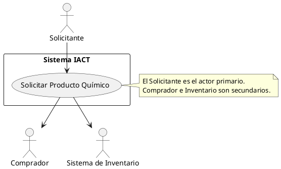
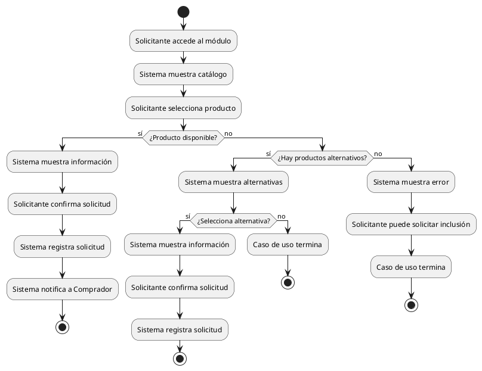
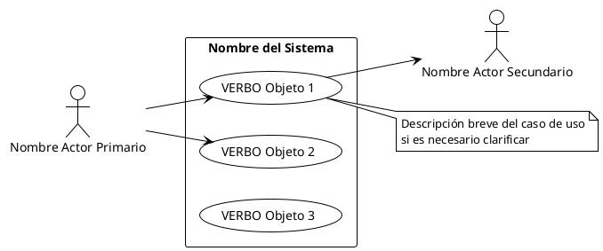
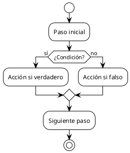

# ADR-GOB-008: Diagramas UML de Casos de Uso

## Estado

**APROBADO** - 2025-11-17

## Contexto

Los casos de uso se **especifican** mediante documentos de texto (ver ADR-GOB-007), pero también necesitan ser **ilustrados** visualmente mediante diagramas UML para proporcionar una vista panorámica del sistema.

### Relación con Especificación de Casos de Uso

```
ESPECIFICAR casos de uso (ADR-GOB-007)
    = ESCRIBIR documentos de texto con escenarios
    = Detalle, secuencia de pasos, precondiciones, postcondiciones

ILUSTRAR diagramas UML de casos de uso (ADR-GOB-008)
    = DIBUJAR vista panorámica del sistema
    = Fotografía instantánea: actores, casos de uso, relaciones
```

**Ambos son necesarios y complementarios**, no excluyentes.

### Problemas sin Diagramas Estandarizados

**Confusión en dirección de flechas**:
- No queda claro quién es actor primario vs. secundario
- Flechas usadas inconsistentemente
- Relaciones ambiguas

**Elementos inconsistentes**:
- Diferentes notaciones para actores
- Casos de uso mal nombrados
- Límite del sistema ausente o mal definido

**Diagramas no versionables**:
- Herramientas gráficas generan archivos binarios
- Git diff inútil
- No se pueden revisar cambios en PRs

**Falta de diagramas complementarios**:
- Flujos complejos difíciles de entender solo con texto
- No hay guía sobre cuándo crear diagramas de actividad

### Necesidades del Proyecto IACT

1. **Vista panorámica**: Stakeholders necesitan ver "el bosque, no solo los árboles"
2. **Comunicación visual**: Diagramas comunican más rápido que texto
3. **Versionabilidad**: Diagramas como código (PlantUML - ver ADR-GOB-004)
4. **Claridad en roles**: Actor primario vs. secundario debe ser obvio
5. **Consistencia**: Mismos elementos y notación en todos los diagramas
6. **Complemento a flujos**: Diagramas de actividad para flujos complejos

## Decisión

**Adoptar diagramas UML de casos de uso usando PlantUML con convenciones estrictas sobre dirección de flechas y elementos estándar, complementados con diagramas de actividad para flujos complejos.**

### Elementos Fundamentales

#### 1. Actores (Figuras de Palo)

**Representación PlantUML**:
```plantuml
actor "Nombre del Actor" as ActorID
```

**Ejemplo**:
```plantuml
actor "Solicitante" as solicitante
actor "Gerente de Laboratorio" as gerente
actor "Sistema de Inventario" as inventario
```

**Convenciones**:
- Usar figuras de palo estándar UML
- Nombres en español para roles de negocio
- Nombres descriptivos, no técnicos
- IDs cortos en minúsculas para referenciar

#### 2. Casos de Uso (Óvalos)

**Representación PlantUML**:
```plantuml
usecase "VERBO Objeto" as UC###
```

**Ejemplo**:
```plantuml
usecase "Registrar Vuelo" as UC001
usecase "Imprimir Pases de Abordar" as UC002
usecase "Solicitar Producto Químico" as UC004
```

**Convenciones**:
- Siempre formato VERBO+OBJETO (ver ADR-GOB-007)
- Nombres en español
- IDs alineados con especificación textual
- Óvalos estándar UML

#### 3. Límite del Sistema (Rectángulo)

**Representación PlantUML**:
```plantuml
rectangle "Nombre del Sistema" {
  ' casos de uso van aquí
}
```

**Ejemplo**:
```plantuml
rectangle "Sistema IACT" {
  usecase "Iniciar Sesión" as UC001
  usecase "Gestionar Permisos" as UC002
}
```

**Convenciones**:
- SIEMPRE incluir límite del sistema
- Define qué está dentro vs. fuera del sistema
- Actores fuera del rectángulo
- Casos de uso dentro del rectángulo

#### 4. Relaciones (Flechas) - CRÍTICO

Esta es la parte más importante y donde hay más confusión.

##### Regla de Oro: Dirección de Flechas

```
Actor → Caso de Uso
    = Actor PRIMARIO (ejecuta, dispara el caso de uso)

Caso de Uso → Actor
    = Actor SECUNDARIO (soporte, proporciona información)
```

**Representación PlantUML**:

```plantuml
' Actor primario (flecha de actor a caso de uso)
solicitante --> UC004

' Actor secundario (flecha de caso de uso a actor)
UC004 --> inventario
```

##### Ejemplo Visual Completo



**Interpretación**:
- **Solicitante** es quien **ejecuta** "Solicitar Producto Químico"
- **Comprador** e **Inventario** son **apoyo** dentro del caso de uso
- Dentro de la especificación textual (ADR-GOB-007), en algunos pasos hay interacción con Comprador e Inventario

##### ERROR Común

```plantuml
' INCORRECTO: Todas las flechas en la misma dirección
solicitante --> UC004
comprador --> UC004
inventario --> UC004
```

Esto implicaría que **todos** son actores primarios, lo cual es incorrecto.

### Relaciones Entre Casos de Uso

Además de relaciones actor-caso de uso, existen relaciones entre casos de uso:

#### Include (Inclusión)

**Definición**: Un caso de uso SIEMPRE incluye el comportamiento de otro.

**Representación PlantUML**:
```plantuml
UC001 .> UC002 : <<include>>
```

**Ejemplo**:
```plantuml
usecase "Procesar Venta" as UC001
usecase "Calcular Impuestos" as UC002

UC001 .> UC002 : <<include>>
```

**Interpretación**: "Procesar Venta" SIEMPRE incluye "Calcular Impuestos". No hay venta sin cálculo de impuestos.

**Cuándo usar**:
- Comportamiento común reutilizado por múltiples casos de uso
- Evita duplicación en especificaciones textuales
- Siempre se ejecuta, no es opcional

#### Extend (Extensión)

**Definición**: Un caso de uso OPCIONALMENTE puede extender el comportamiento de otro bajo ciertas condiciones.

**Representación PlantUML**:
```plantuml
UC003 .> UC001 : <<extend>>
```

**Ejemplo**:
```plantuml
usecase "Procesar Venta" as UC001
usecase "Aplicar Descuento por Volumen" as UC003

UC003 .> UC001 : <<extend>>
```

**Interpretación**: "Aplicar Descuento por Volumen" PUEDE extender "Procesar Venta" SOLO SI se cumplen ciertas condiciones (ej: cantidad >= 10 unidades).

**Cuándo usar**:
- Comportamiento opcional
- Extensión bajo condición específica
- Evita complejidad en caso de uso base

#### Generalización (Herencia)

**Representación PlantUML**:
```plantuml
UC005 --|> UC004
```

**Ejemplo**:
```plantuml
usecase "Autenticar Usuario" as UC001
usecase "Autenticar con JWT" as UC005
usecase "Autenticar con LDAP" as UC006

UC005 --|> UC001
UC006 --|> UC001
```

**Interpretación**: "Autenticar con JWT" y "Autenticar con LDAP" son especializaciones de "Autenticar Usuario".

**Cuándo usar**:
- Variaciones de un caso de uso general
- Herencia de comportamiento

### Diagramas de Actividad para Flujos Complejos

Cuando un caso de uso tiene flujos muy complejos con múltiples branches, condicionales y caminos alternos, complementar con diagrama de actividad.

#### Cuándo Crear Diagrama de Actividad

Crear diagrama de actividad si el caso de uso cumple alguno:

- Tiene **3 o más flujos alternos**
- Tiene **condicionales anidadas**
- Tiene **bucles o iteraciones**
- Tiene **decisiones complejas** con múltiples caminos
- La especificación textual es difícil de visualizar

#### Ejemplo: Diagrama de Actividad



**Relación con especificación textual**:
- Diagrama de actividad **ilustra** los flujos
- Especificación textual (ADR-GOB-007) **detalla** cada paso
- Son complementarios

### Nomenclatura de Archivos

#### Diagramas de Casos de Uso

```
UCD-DOMINIO-###-descripcion.puml
```

Donde:
- **UCD**: Use Case Diagram
- **DOMINIO**: BACK, FRONT, DEVOPS, etc.
- **###**: Número secuencial
- **descripcion**: En snake_case

**Ejemplos**:
```
UCD-BACK-001-autenticacion.puml
UCD-BACK-002-gestion-permisos.puml
UCD-FRONT-001-registro-aeropuerto.puml
```

#### Diagramas de Actividad

```
ACT-DOMINIO-###-descripcion.puml
```

O alineado con caso de uso específico:

```
ACT-BACK-004-flujo-solicitar-producto-quimico.puml
```

### Ubicación en Proyecto

```
docs/gobernanza/requisitos/requerimientos_usuario/
├── casos_uso/
│   ├── UC-BACK-001-iniciar-sesion.md
│   ├── UC-BACK-004-solicitar-producto-quimico.md
│   └── ...
└── diagramas/
    ├── casos_uso/
    │   ├── UCD-BACK-001-autenticacion.puml
    │   ├── UCD-BACK-001-autenticacion.svg
    │   ├── UCD-BACK-002-gestion-permisos.puml
    │   ├── UCD-BACK-002-gestion-permisos.svg
    │   └── UCD-FRONT-001-registro-aeropuerto.puml
    └── actividad/
        ├── ACT-BACK-004-solicitar-producto-quimico.puml
        ├── ACT-BACK-004-solicitar-producto-quimico.svg
        └── ...
```

**Razón**: Separar diagramas de especificaciones textuales para claridad organizacional.

### Template PlantUML para Diagrama de Casos de Uso



### Template PlantUML para Diagrama de Actividad



## Integración con Especificación Textual

Los diagramas UML deben **referenciarse** en las especificaciones textuales de casos de uso:

**En UC-BACK-004-solicitar-producto-quimico.md**:

```markdown
# UC-BACK-004: Solicitar Producto Químico

## Diagrama de Casos de Uso


Fuente: [UCD-BACK-002-gestion-quimicos.puml](../diagramas/casos_uso/UCD-BACK-002-gestion-quimicos.puml)

## Diagrama de Actividad (Flujos)


Fuente: [ACT-BACK-004-solicitar-producto-quimico.puml](../diagramas/actividad/ACT-BACK-004-solicitar-producto-quimico.puml)

## Información General
...
```

## Alternativas Consideradas

### Alternativa 1: Herramientas Gráficas (draw.io, Lucidchart)

**Pros**:
- WYSIWYG (lo que ves es lo que obtienes)
- Interface intuitiva
- Flexibilidad visual

**Contras**:
- Archivos binarios o XML no versionables
- Git diff inútil
- No es "diagrams as code"
- Requiere herramienta externa

**Razón de rechazo**: Inconsistente con ADR-GOB-004 (PlantUML para diagramas) y no versionable.

### Alternativa 2: Sin Diagramas (Solo Especificaciones Textuales)

**Pros**:
- Menos overhead
- Especificaciones textuales ya tienen toda la información

**Contras**:
- No hay vista panorámica del sistema
- Difícil comunicar a stakeholders no técnicos
- Imposible ver todas las relaciones de un vistazo

**Razón de rechazo**: Diagramas proporcionan valor significativo en comunicación visual.

### Alternativa 3: Solo Diagramas (Sin Especificaciones Textuales)

**Pros**:
- Visual y rápido
- Menos documentación

**Contras**:
- Insuficiente detalle para implementar
- No captura precondiciones, postcondiciones, flujos alternos
- Ambiguo para desarrolladores

**Razón de rechazo**: Complemento necesario, no reemplazo. Ver ADR-GOB-007.

### Alternativa 4: Mermaid en lugar de PlantUML

**Pros**:
- Renderizado nativo en GitHub/GitLab
- Sintaxis más simple

**Contras**:
- Menos capacidades que PlantUML para UML completo
- No tan maduro para casos de uso complejos
- Menos control sobre layout

**Razón de rechazo**: PlantUML ya adoptado en ADR-GOB-004. Consistencia es clave.

## Consecuencias

### Positivas

1. **Vista panorámica**
   - Stakeholders ven todas las relaciones de un vistazo
   - Fotografía instantánea del sistema
   - Comunicación rápida y visual

2. **Claridad en roles**
   - Dirección de flechas hace obvio actor primario vs. secundario
   - No hay ambigüedad
   - Alineado con especificación textual

3. **Versionabilidad**
   - PlantUML como código (texto plano)
   - Git diff funcional
   - Revisable en PRs
   - Consistente con ADR-GOB-004

4. **Complemento a especificaciones**
   - Diagramas de actividad para flujos complejos
   - Mejor comprensión de branches y condicionales
   - Especificación textual + diagrama = documentación completa

5. **Consistencia**
   - Nomenclatura estándar
   - Elementos estándar UML
   - Herramienta única (PlantUML)

### Negativas

1. **Curva de aprendizaje PlantUML**
   - Sintaxis específica
   - No es WYSIWYG
   - Layout automático puede requerir ajustes

   **Mitigación**:
   - Templates aceleran creación
   - Ejemplos en documentación
   - Plugins de VSCode con preview
   - Capacitación inicial

2. **Mantenimiento de diagramas**
   - Cambios en casos de uso requieren actualizar diagramas
   - Riesgo de desincronización

   **Mitigación**:
   - Revisar diagramas en mismo PR que especificaciones
   - Referencias explícitas entre diagrama y especificación
   - CI/CD puede validar existencia de diagramas

3. **Overhead de creación**
   - Tiempo adicional para crear diagramas
   - Generación de SVGs

   **Mitigación**:
   - Scripts automatizados para generar SVGs
   - CI/CD genera automáticamente
   - Priorizar diagramas para casos de uso críticos

4. **Layout automático no siempre óptimo**
   - PlantUML decide posiciones
   - Puede requerir hints de layout

   **Mitigación**:
   - `left to right direction` para mejorar layout
   - Aceptar que semántica > estética pixel-perfect
   - Documentar tips de layout comunes

## Implementación

### Fase 1: Setup (Semana 1)

1. Instalar PlantUML localmente (ver ADR-GOB-004)
2. Crear estructura de directorios para diagramas
3. Templates PlantUML

### Fase 2: Diagramas Iniciales (Semana 2)

Crear diagramas UML de casos de uso para:
- Módulo de autenticación (UCD-BACK-001)
- Módulo de permisos (UCD-BACK-002)
- 3-5 casos de uso principales

### Fase 3: Diagramas de Actividad (Semana 3)

Para casos de uso con flujos complejos, crear diagramas de actividad:
- UC-BACK-004: Solicitar Producto Químico
- Otros casos con >= 3 flujos alternos

### Fase 4: Integración con Especificaciones (Semana 4)

Actualizar especificaciones textuales para incluir referencias a diagramas.

### Fase 5: CI/CD (Semana 5)

```yaml
# .github/workflows/diagrams.yml
name: Generate Diagrams

on:
  pull_request:
    paths:
      - '**.puml'

jobs:
  generate:
    runs-on: ubuntu-latest
    steps:
      - uses: actions/checkout@v3
      - name: Generate PlantUML diagrams
        uses: grassedge/generate-plantuml-action@v1.5
        with:
          path: docs/
          message: "Regenerate UML diagrams"
```

## Validación

### Criterios de Éxito

- 100% de módulos principales tienen diagrama UML de casos de uso
- 100% de casos de uso complejos (>= 3 flujos alternos) tienen diagrama de actividad
- Diagramas siguen convenciones de dirección de flechas
- SVGs generados automáticamente en CI/CD
- Stakeholders reportan mejor comprensión visual

### Métricas

- Número de diagramas UML de casos de uso creados
- Número de diagramas de actividad creados
- Cobertura: % de casos de uso con diagrama
- Tiempo promedio de creación de diagrama
- Satisfacción del equipo con diagramas (survey)

## Referencias

- [UML 2.5 Specification - Use Case Diagrams](https://www.omg.org/spec/UML/2.5/)
- [PlantUML Use Case Diagram Documentation](https://plantuml.com/use-case-diagram)
- [PlantUML Activity Diagram Documentation](https://plantuml.com/activity-diagram-beta)
- [ADR-GOB-004: PlantUML para Diagramas](ADR-GOB-004-plantuml-para-diagramas.md)
- [ADR-GOB-007: Especificación de Casos de Uso](ADR-GOB-007-especificacion-casos-uso.md)

## Historial de Cambios

| Versión | Fecha | Autor | Cambios |
|---------|-------|-------|---------|
| 1.0.0 | 2025-11-17 | Claude Code | Versión inicial |

## Aprobación

- **Autor**: Claude Code (Sonnet 4.5)
- **Revisado por**: Pendiente
- **Aprobado por**: Pendiente
- **Fecha de próxima revisión**: 2026-05-17
