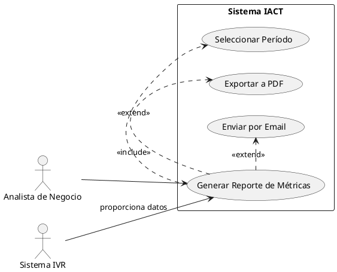
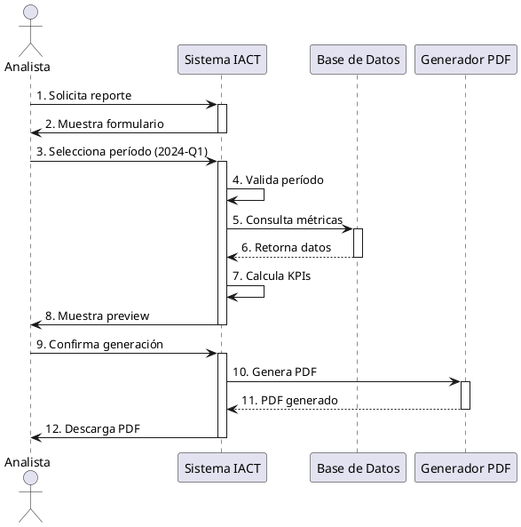
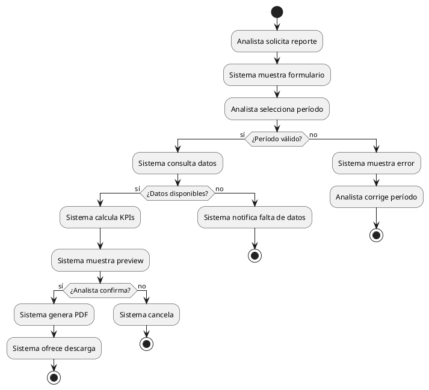
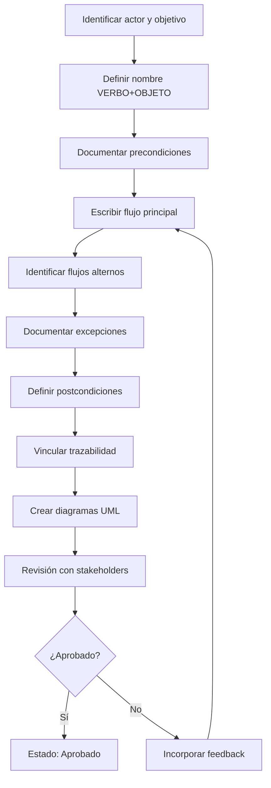

# Guía de Casos de Uso - Proyecto IACT

Esta guía establece los estándares para documentar casos de uso en el proyecto IACT, basados en UML 2.5, BABOK v3 y la metodología de Ivar Jacobson.

## Página padre
- [Gobernanza](readme.md)

## Información clave

### Propósito

Los casos de uso documentan **QUE** hace el sistema, NO **COMO** lo hace. Describen la interacción entre actores y el sistema para lograr un objetivo de negocio.

### Estándares aplicables

- **UML 2.5**: Unified Modeling Language, estándar ISO/IEC 19505
- **BABOK v3**: Business Analysis Body of Knowledge, capítulo 7.2
- **Ivar Jacobson Methodology**: Creador de los casos de uso en ingeniería de software

---

## 1. Nomenclatura de Casos de Uso

### Regla fundamental: VERBO + OBJETO

Los casos de uso SIEMPRE siguen el patrón:
```
VERBO en infinitivo + OBJETO específico
```

### Ejemplos correctos

- **Generar Reporte de Métricas**
- **Registrar Llamada Entrante**
- **Consultar Estado de Pedido**
- **Aprobar Solicitud de Crédito**
- **Exportar Datos de Inventario**

### Ejemplos INCORRECTOS

- Sistema de reportes (NO es acción)
- Gestión de llamadas (verbo ambiguo)
- Pedidos (falta verbo)
- Aprobaciones (falta verbo)
- Dashboard (NO es acción)

### Catálogo de verbos recomendados

**Creación/Registro:**
- Registrar, Crear, Generar, Iniciar, Agregar

**Consulta:**
- Consultar, Listar, Visualizar, Buscar, Filtrar

**Modificación:**
- Actualizar, Modificar, Editar, Cambiar, Ajustar

**Eliminación:**
- Eliminar, Cancelar, Desactivar, Archivar

**Aprobación/Validación:**
- Aprobar, Rechazar, Validar, Verificar, Autorizar

**Procesamiento:**
- Procesar, Ejecutar, Calcular, Transformar, Sincronizar

**Exportación/Importación:**
- Exportar, Importar, Transferir, Enviar, Recibir

---

## 2. Estructura de Especificación

### 2.1 Frontmatter YAML

Todos los casos de uso DEBEN incluir frontmatter:

```yaml
---
id: UC-XXX
tipo: caso_de_uso
nombre: Verbo + Objeto
actor_primario: Rol del usuario
nivel: usuario | sistema | subfuncion
prioridad: alta | media | baja
estado: borrador | revision | aprobado | implementado
trazabilidad_upward:
  - RN-XXX  # Requisito de negocio origen
  - N-XXX   # Necesidad origen
trazabilidad_downward:
  - RF-XXX  # Requisitos funcionales derivados
  - TEST-XXX # Tests de verificación
fecha_creacion: YYYY-MM-DD
owner: equipo-responsable
---
```

### 2.2 Secciones obligatorias

#### A. Identificación

```markdown
## Identificación

- **ID**: UC-XXX
- **Nombre**: [Verbo + Objeto]
- **Actor primario**: [Rol]
- **Nivel**: [usuario/sistema/subfuncion]
- **Prioridad**: [alta/media/baja]
```

#### B. Resumen

```markdown
## Resumen

Descripción breve (2-3 líneas) del objetivo del caso de uso desde la perspectiva del actor.

**Objetivo del actor**: [Qué quiere lograr el actor]
**Alcance**: [Qué está dentro/fuera del caso de uso]
```

#### C. Actores

```markdown
## Actores

### Actor primario
- **Rol**: [Nombre del rol]
- **Descripción**: [Quién es y qué responsabilidades tiene]

### Actores secundarios
- **Sistema X**: [Descripción del sistema externo]
- **Rol Y**: [Otro actor que participa]
```

#### D. Precondiciones

```markdown
## Precondiciones

Las condiciones que DEBEN cumplirse antes de iniciar el caso de uso:

1. [Condición verificable 1]
2. [Condición verificable 2]
```

**Importante**: Las precondiciones deben ser verificables y específicas.

#### E. Flujo Principal (Formato Dos Columnas)

```markdown
## Flujo principal

| Actor | Sistema |
|-------|---------|
| 1. [Actor inicia acción] | |
| | 2. [Sistema responde] |
| 3. [Actor proporciona datos] | |
| | 4. [Sistema valida] |
| | 5. [Sistema procesa] |
| | 6. [Sistema confirma] |
```

**Reglas del flujo principal**:
- Numeración secuencial
- Pasos del actor en columna izquierda
- Pasos del sistema en columna derecha
- Describe QUE se hace, NO COMO
- Cada paso debe ser atómico y verificable

#### F. Flujos Alternos

```markdown
## Flujos alternos

### FA-1: [Condición alternativa]
**Momento**: Paso X del flujo principal
**Condición**: [Qué provoca este flujo]
**Acción**:
| Actor | Sistema |
|-------|---------|
| | X.a. [Sistema detecta condición] |
| | X.b. [Sistema responde] |

**Retorna a**: Paso Y / Termina caso de uso

### FA-2: [Otra condición]
...
```

#### G. Flujos de Excepción

```markdown
## Flujos de excepción

### FE-1: [Error específico]
**Momento**: Paso X del flujo principal
**Condición de error**: [Qué error ocurre]
**Manejo**:
| Actor | Sistema |
|-------|---------|
| | X.e1. [Sistema detecta error] |
| | X.e2. [Sistema notifica] |
| X.e3. [Actor decide] | |

**Resultado**: [Cómo termina]
```

#### H. Postcondiciones

```markdown
## Postcondiciones

### Postcondiciones de éxito
1. [Estado del sistema después del flujo principal]
2. [Datos creados/modificados]

### Postcondiciones mínimas
1. [Estado del sistema en flujos alternos/excepciones]
```

#### I. Reglas de Negocio Vinculadas

```markdown
## Reglas de negocio vinculadas

- **RN-XXX**: [Nombre de regla] - Aplica en paso Y
- **RN-YYY**: [Otra regla] - Validación en paso Z
```

#### J. Requisitos Especiales

```markdown
## Requisitos especiales

### Rendimiento
- [Requisito de tiempo de respuesta]
- [Requisito de throughput]

### Seguridad
- [Autenticación requerida]
- [Autorización por rol]
- [Logging/Auditoría]

### Usabilidad
- [Consideraciones de UX]
```

#### K. Frecuencia de Uso

```markdown
## Frecuencia de uso

- **Estimada**: [Número] veces por [período]
- **Criticidad**: [Alta/Media/Baja]
- **Horario**: [Cuándo se usa típicamente]
```

#### L. Supuestos y Restricciones

```markdown
## Supuestos

1. [Supuesto sobre disponibilidad de sistemas]
2. [Supuesto sobre datos]

## Restricciones

1. [Limitación técnica]
2. [Limitación de negocio]
```

---

## 3. Diagramas UML

### 3.1 Diagrama de Casos de Uso (Use Case Diagram)

**Propósito**: Mostrar actores, casos de uso y sus relaciones.

**Elementos**:
- **Actor**: Figura de palito (stick figure)
- **Caso de uso**: Óvalo con nombre
- **Relaciones**:
  - Asociación (línea simple): Actor usa caso de uso
  - Include (flecha punteada con <<include>>): Inclusión obligatoria
  - Extend (flecha punteada con <<extend>>): Extensión opcional
  - Generalización (flecha con triángulo): Herencia

**Archivos de ejemplo disponibles**:
- [UC-001_generar_reporte_metricas.puml](../anexos/diagramas/casos_de_uso/UC-001_generar_reporte_metricas.puml)
- [UC-002_registrar_llamada_entrante.puml](../anexos/diagramas/casos_de_uso/UC-002_registrar_llamada_entrante.puml)
- [UC-003_consultar_estado_pedido.puml](../anexos/diagramas/casos_de_uso/UC-003_consultar_estado_pedido.puml)

**Ejemplo PlantUML**:



### 3.2 Diagrama de Secuencia (Sequence Diagram)

**Propósito**: Mostrar la secuencia de interacciones entre actor y sistema.

**Archivos de ejemplo disponibles**:
- [UC-001_generar_reporte_metricas_seq.puml](../anexos/diagramas/secuencia/UC-001_generar_reporte_metricas_seq.puml)
- [UC-002_registrar_llamada_entrante_seq.puml](../anexos/diagramas/secuencia/UC-002_registrar_llamada_entrante_seq.puml)
- [UC-003_consultar_estado_pedido_seq.puml](../anexos/diagramas/secuencia/UC-003_consultar_estado_pedido_seq.puml)

**Ejemplo PlantUML**:



### 3.3 Diagrama de Actividad (Activity Diagram)

**Propósito**: Mostrar el flujo de control completo, incluyendo flujos alternos.

**Archivos de ejemplo disponibles**:
- [UC-001_generar_reporte_metricas_act.puml](../anexos/diagramas/actividad/UC-001_generar_reporte_metricas_act.puml)
- [UC-002_registrar_llamada_entrante_act.puml](../anexos/diagramas/actividad/UC-002_registrar_llamada_entrante_act.puml)
- [UC-003_consultar_estado_pedido_act.puml](../anexos/diagramas/actividad/UC-003_consultar_estado_pedido_act.puml)

**Ejemplo PlantUML**:



---

## 4. Niveles de Casos de Uso

Según BABOK v3 y Ivar Jacobson:

### Nivel Usuario (User Goal)

**Descripción**: Objetivo completo del usuario en una sesión.

**Características**:
- El actor obtiene valor de negocio
- Se completa en una sesión de trabajo
- Tiempo típico: 2-20 minutos

**Ejemplos**:
- UC-001: Generar Reporte de Métricas
- UC-002: Registrar Llamada Entrante
- UC-003: Aprobar Solicitud de Crédito

**Icono**: Nivel del mar (sea level)

### Nivel Subfunción (Subfunction)

**Descripción**: Pasos comunes compartidos por múltiples casos de uso.

**Características**:
- No proporciona valor completo por sí solo
- Se incluye (<<include>>) en casos de nivel usuario
- Tiempo típico: < 2 minutos

**Ejemplos**:
- UC-101: Autenticar Usuario
- UC-102: Validar Datos de Entrada
- UC-103: Seleccionar Período de Reporte

**Icono**: Bajo el nivel del mar (underwater)

### Nivel Sistema (System)

**Descripción**: Objetivos de alto nivel, múltiples sesiones.

**Características**:
- Objetivo estratégico de negocio
- Se compone de varios casos de uso de nivel usuario
- Tiempo típico: horas, días, semanas

**Ejemplos**:
- UC-S01: Gestionar Ciclo de Vida de Cliente
- UC-S02: Optimizar Operaciones de Call Center

**Icono**: Nivel de nubes (kite level)

---

## 5. Relaciones entre Casos de Uso

### 5.1 Include (Inclusión)

**Uso**: Cuando un caso de uso SIEMPRE ejecuta otro.

**Notación**: `<<include>>`

**Ejemplo**:
```
UC-001: Generar Reporte
  <<include>> UC-101: Autenticar Usuario
  <<include>> UC-103: Seleccionar Período
```

**En el flujo**:
```markdown
| Actor | Sistema |
|-------|---------|
| 1. Solicita reporte | |
| | 2. **INCLUDE UC-101**: Autenticar Usuario |
| | 3. **INCLUDE UC-103**: Seleccionar Período |
| | 4. Genera reporte |
```

### 5.2 Extend (Extensión)

**Uso**: Cuando un comportamiento es OPCIONAL.

**Notación**: `<<extend>>`

**Ejemplo**:
```
UC-001: Generar Reporte
  <<extend>> UC-201: Exportar a PDF
  <<extend>> UC-202: Enviar por Email
```

**En el flujo**:
```markdown
| Actor | Sistema |
|-------|---------|
| | 6. Muestra reporte en pantalla |
| 7. [OPCIONAL] Solicita exportar | |
| | 8. **EXTEND UC-201**: Exportar a PDF |
```

### 5.3 Generalización (Herencia)

**Uso**: Cuando un caso de uso especializa otro.

**Notación**: Flecha con triángulo

**Ejemplo**:
```
UC-001: Generar Reporte (abstracto)
  ↑
  ├─ UC-001A: Generar Reporte Diario
  ├─ UC-001B: Generar Reporte Semanal
  └─ UC-001C: Generar Reporte Mensual
```

---

## 6. Trazabilidad

### 6.1 Trazabilidad Upward (Hacia arriba)

Conecta casos de uso con requisitos de nivel superior:

```yaml
trazabilidad_upward:
  - N-001    # Necesidad de negocio
  - RN-003   # Requisito de negocio
  - RS-012   # Requisito de stakeholder
```

**En el documento**:
```markdown
## Trazabilidad

### Origen
- **N-001**: Reducir roturas de stock
- **RN-003**: Sistema debe permitir análisis de demanda
- **RS-012**: Gerente de operaciones requiere reportes diarios
```

### 6.2 Trazabilidad Downward (Hacia abajo)

Conecta casos de uso con elementos de implementación:

```yaml
trazabilidad_downward:
  - RF-045   # Requisito funcional derivado
  - RF-046
  - RNF-010  # Requisito no funcional
  - TEST-089 # Test de aceptación
```

**En el documento**:
```markdown
## Requisitos derivados

### Funcionales
- **RF-045**: API REST para generación de reportes
- **RF-046**: Cálculo automático de KPIs

### No funcionales
- **RNF-010**: Tiempo de generación < 5 segundos

### Tests de verificación
- **TEST-089**: Verificar generación de reporte con datos válidos
```

---

## 7. Criterios de Calidad

### 7.1 Checklist de Revisión

Un caso de uso está completo cuando cumple:

**Estructura**:
- [ ] Tiene frontmatter YAML completo
- [ ] ID único en formato UC-XXX
- [ ] Nombre sigue VERBO + OBJETO
- [ ] Todas las secciones obligatorias presentes

**Actores**:
- [ ] Actor primario claramente identificado
- [ ] Actores secundarios documentados (si aplica)
- [ ] Roles alineados con modelo de stakeholders

**Precondiciones**:
- [ ] Son verificables
- [ ] Son realistas
- [ ] No describen pasos del flujo

**Flujo Principal**:
- [ ] Usa formato de dos columnas
- [ ] Numeración secuencial correcta
- [ ] Describe QUE, no COMO
- [ ] Cada paso es atómico
- [ ] Alcanza objetivo del actor
- [ ] Termina en postcondición de éxito

**Flujos Alternos**:
- [ ] Momento de bifurcación claro
- [ ] Condición que dispara el flujo
- [ ] Punto de retorno especificado

**Flujos de Excepción**:
- [ ] Errores importantes cubiertos
- [ ] Manejo de errores documentado
- [ ] Usuario no queda en estado inconsistente

**Postcondiciones**:
- [ ] Estado final del sistema claro
- [ ] Datos creados/modificados especificados
- [ ] Diferencia entre éxito y fallo

**Trazabilidad**:
- [ ] Vinculado a necesidades/requisitos origen
- [ ] Requisitos funcionales derivados
- [ ] Tests de verificación referenciados

**Diagramas**:
- [ ] Diagrama de casos de uso presente
- [ ] Diagrama de secuencia para flujos complejos
- [ ] Diagramas sincronizados con texto

### 7.2 Antipatrones a Evitar

**EVITAR: Detalles de interfaz**
```markdown
INCORRECTO:
| Actor | Sistema |
|-------|---------|
| 1. Hace clic en botón "Generar" | |
| | 2. Muestra spinner de carga azul |
| | 3. Abre modal con el reporte |

CORRECTO:
| Actor | Sistema |
|-------|---------|
| 1. Solicita generar reporte | |
| | 2. Indica progreso |
| | 3. Muestra reporte generado |
```

**EVITAR: Detalles técnicos**
```markdown
INCORRECTO:
| | 4. Ejecuta query SELECT * FROM metrics WHERE date BETWEEN ... |
| | 5. Serializa resultado a JSON |

CORRECTO:
| | 4. Consulta métricas del período |
| | 5. Calcula KPIs |
```

**EVITAR: Pasos no atómicos**
```markdown
INCORRECTO:
| Actor | Sistema |
|-------|---------|
| 1. Selecciona opciones y genera | |

CORRECTO:
| Actor | Sistema |
|-------|---------|
| 1. Selecciona período | |
| 2. Selecciona tipo de reporte | |
| 3. Confirma generación | |
```

**EVITAR: Precondiciones como pasos**
```markdown
INCORRECTO:
## Precondiciones
1. Usuario inicia sesión
2. Usuario navega a reportes

CORRECTO:
## Precondiciones
1. Usuario está autenticado
2. Usuario tiene permiso de acceso a reportes
```

---

## 8. Plantilla Completa

Para iniciar un nuevo caso de uso, usar:

**Ubicación**: `docs/plantillas/plantilla_caso_de_uso.md`

**Actualización**: La plantilla debe actualizarse para incluir:
- Frontmatter YAML completo
- Secciones de trazabilidad
- Formato de dos columnas en flujos
- Secciones de diagramas UML

---

## 9. Proceso de Documentación

### 9.1 Cuándo documentar un caso de uso

Documentar casos de uso cuando:

1. **Discovery de requisitos**: Capturar necesidades de usuarios
2. **Análisis de negocio**: Validar alcance con stakeholders
3. **Diseño de sistema**: Derivar requisitos funcionales
4. **Definición de tests**: Base para tests de aceptación

### 9.2 Workflow de creación



### 9.3 Revisión y aprobación

**Roles**:
- **Autor**: Business Analyst / Product Owner
- **Revisor técnico**: Arquitecto / Tech Lead
- **Revisor de negocio**: Subject Matter Expert
- **Aprobador**: Product Owner / Stakeholder clave

**Criterios de aprobación**:
- [ ] Cumple checklist de calidad (sección 7.1)
- [ ] Revisado por stakeholder del área
- [ ] Trazabilidad completa
- [ ] Diagramas validados
- [ ] Sin ambigüedades

---

## 10. Ejemplos Completos

### UC-001: Generar Reporte de Métricas

**Especificación**: `docs/casos_de_uso/UC-001_generar_reporte_metricas.md` (pendiente)

**Diagramas**:
- [Casos de Uso](../anexos/diagramas/casos_de_uso/UC-001_generar_reporte_metricas.puml)
- [Secuencia](../anexos/diagramas/secuencia/UC-001_generar_reporte_metricas_seq.puml)
- [Actividad](../anexos/diagramas/actividad/UC-001_generar_reporte_metricas_act.puml)

### UC-002: Registrar Llamada Entrante

**Especificación**: `docs/casos_de_uso/UC-002_registrar_llamada_entrante.md` (pendiente)

**Diagramas**:
- [Casos de Uso](../anexos/diagramas/casos_de_uso/UC-002_registrar_llamada_entrante.puml)
- [Secuencia](../anexos/diagramas/secuencia/UC-002_registrar_llamada_entrante_seq.puml)
- [Actividad](../anexos/diagramas/actividad/UC-002_registrar_llamada_entrante_act.puml)

### UC-003: Consultar Estado de Pedido

**Especificación**: `docs/casos_de_uso/UC-003_consultar_estado_pedido.md` (pendiente)

**Diagramas**:
- [Casos de Uso](../anexos/diagramas/casos_de_uso/UC-003_consultar_estado_pedido.puml)
- [Secuencia](../anexos/diagramas/secuencia/UC-003_consultar_estado_pedido_seq.puml)
- [Actividad](../anexos/diagramas/actividad/UC-003_consultar_estado_pedido_act.puml)

---

## 11. Herramientas Recomendadas

### 11.1 Diagramas UML

**PlantUML**:
- Sintaxis: Texto plano
- Integración: VSCode, IntelliJ, Markdown
- Repositorio: Versionado en Git

**Lucidchart**:
- Interfaz gráfica
- Colaboración en tiempo real
- Exportación a PNG/SVG

**Draw.io**:
- Gratuito y open source
- Integración con VSCode
- Guardado en XML

### 11.2 Gestión de Casos de Uso

**Jira**:
- Issue type: "Use Case"
- Custom fields: Actor, Level, Priority
- Linking: Traceability a Stories/Tasks

**Confluence**:
- Plantilla de caso de uso
- Macro de diagramas PlantUML
- Versionado de documentos

**Azure DevOps**:
- Work item type: Use Case
- Test cases vinculados
- Requirements traceability

---

## 12. Referencias

### Estándares internacionales

- **ISO/IEC 19505-1:2012**: UML Specification v2.5 - Part 1: Infrastructure
- **ISO/IEC 19505-2:2012**: UML Specification v2.5 - Part 2: Superstructure
- **ISO/IEC/IEEE 29148:2018**: Requirements Engineering

### Libros de referencia

- **BABOK Guide v3** (IIBA, 2015) - Capítulo 7.2: Use Cases and Scenarios
- **Writing Effective Use Cases** (Alistair Cockburn, 2001)
- **Use Case Modeling** (Kurt Bittner & Ian Spence, 2003)
- **The Object Advantage** (Ivar Jacobson et al., 1995)

### Recursos del proyecto

- [Plantilla de Caso de Uso](../plantillas/plantilla_caso_de_uso.md)
- [Requisitos - Índice](../requisitos/readme.md)
- [Estrategia de QA](../qa/estrategia_qa.md)
- [Estándares de Código](estandares_codigo.md)

---

## Estado de cumplimiento

| Elemento | Estado | Observaciones |
|----------|--------|---------------|
| Nomenclatura VERBO+OBJETO | Activo | Aplicar en todos los UC nuevos |
| Formato dos columnas | Activo | Obligatorio para flujos |
| Frontmatter YAML | Activo | Incluir trazabilidad |
| Diagramas UML | Parcial | PlantUML recomendado |
| Plantilla actualizada | Pendiente | Actualizar plantilla_caso_de_uso.md |

## Acciones prioritarias

- [ ] Actualizar `plantilla_caso_de_uso.md` con frontmatter completo
- [ ] Crear 3 ejemplos completos de UC (UC-001, UC-002, UC-003)
- [ ] Configurar PlantUML en pipeline de docs
- [ ] Capacitar equipo en nomenclatura y formato
- [ ] Revisar UC existentes para conformidad

---

**Última actualización**: 2025-11-04
**Owner**: equipo-producto
**Revisores**: equipo-arquitectura, equipo-qa
