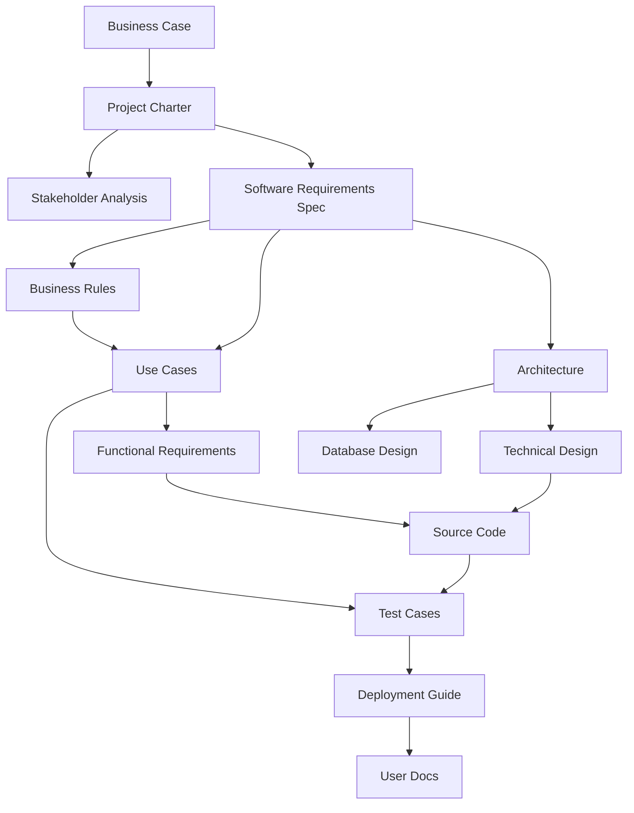
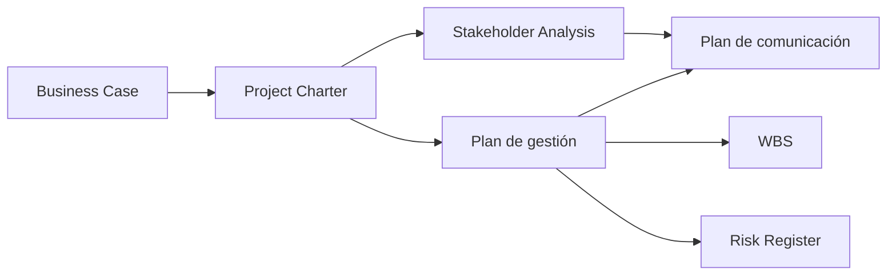
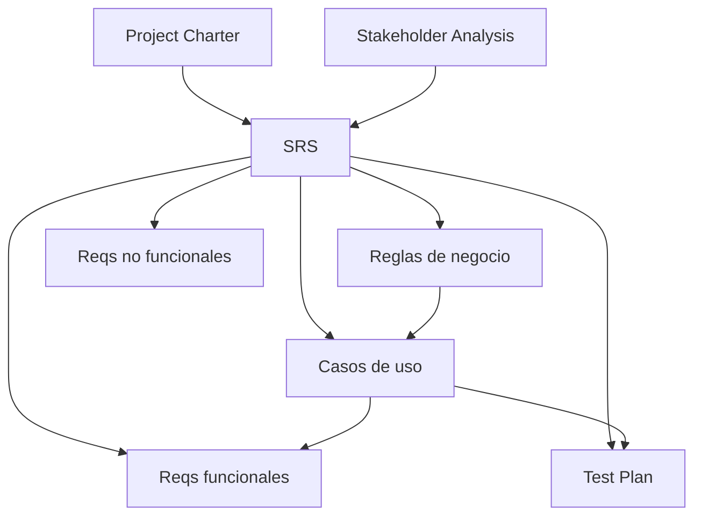

# Documentación Corporativa para Proyectos de Software (Repositorio Markdown)

<thinking>
¿Este contenido se probó internamente o es una hipótesis? Revisar antes de publicar.
¿La evidencia adjunta permite a otra persona reproducir los resultados?
¿Se distinguen claramente hechos observados de opiniones?
</thinking>

## Sección 0 - Principios fundamentales de documentación

### 0.1 Filosofía central
- Documentar para la persona que enfrentará el mismo problema mañana.
- Orientar cada entrada a la resolución de incidentes reales.
- Priorizar ejemplos reproducibles por encima de explicaciones teóricas.

### 0.2 Regla de los cinco minutos
- Pregunta guía: ¿alguien puede ejecutar el procedimiento y validar el resultado en cinco minutos?
- Validación: pruebas de escritorio con enlaces verificables.
- Ejemplos positivos: guías con comandos exactos, rutas y resultados esperados.
- Ejemplos negativos: narrativas vagas sin pasos accionables.

### 0.3 Lenguaje directo vs. académico

| Evitar | Utilizar |
| --- | --- |
| "El paradigma de binding evidencia..." | "PowerShell se confunde cuando..." |
| "La metodología transformacional revela..." | "Este comando muestra exactamente..." |
| "Principios universalmente aplicables..." | "Encontramos en Stack Overflow que..." |

### 0.4 Principio QUÉ vs. CÓMO
- QUÉ describe la funcionalidad requerida.
- CÓMO describe la implementación técnica y se documenta en artefactos específicos.
- Ejemplo correcto: "El sistema guarda una venta".
- Ejemplo incorrecto: "El sistema ejecuta un `INSERT` en la tabla `sales`."

### 0.5 Bloques de pensamiento para honestidad intelectual

```xml
<thinking>
¿Este hallazgo es específico de nuestra investigación o estoy extrapolando?
¿Esta solución la probamos realmente o es teórica?
¿Estoy usando lenguaje técnico directo o académico innecesario?
</thinking>
```

### 0.6 Limitaciones honestas
- Incluir secciones de limitaciones en cada documento.
- Explicar alcance probado, dependencias y supuestos.
- Plantilla: ver [plantillas/plantilla_seccion_limitaciones.md](plantillas/plantilla_seccion_limitaciones.md).

### 0.7 Checklist de validación general
- [ ] Cumple la regla de cinco minutos.
- [ ] Incluye código o comandos verificables.
- [ ] No usa lenguaje académico innecesario.
- [ ] Expone limitaciones con claridad.
- [ ] Referencia fuentes específicas.
- [ ] Permite copiar/pegar sin edición adicional.

## Sección 1 - Introducción y fundamentación

### 1.1 Propósito y alcance del marco documental
- Explicar la visión integral del sistema documental.
- Alinear objetivos estratégicos y tácticos.
- Detallar alcance funcional, tecnológico y de gobierno.

### 1.2 Beneficios estratégicos

| Área de beneficio | Descripción | Impacto |
| --- | --- | --- |
| Alineación estratégica | Vincular documentación con objetivos | Coherencia organizacional |
| Eficiencia operativa | Reducir duplicidad de esfuerzos | Ahorro del 20-30% en búsqueda |
| Escalabilidad | Evolución conjunta con el negocio | Soporte al crecimiento |
| Cumplimiento | Evidencia para auditorías | Disminución de riesgos |
| Transformación digital | Base para iniciativas tecnológicas | Incremento en tasa de éxito |

### 1.3 Desafíos y consideraciones
- Complejidad inicial y carga de adopción.
- Resistencia al cambio de equipos acostumbrados a la informalidad.
- Necesidad de recursos dedicados para mantener la calidad.
- Balance entre detalle y agilidad.

### 1.4 Marco conceptual
- Gestión por procesos.
- Arquitectura empresarial.
- Gestión del conocimiento.
- Transformación digital.
- Mejora continua (ciclo PDCA).

## Sección 2 - Filosofía de tres niveles

### 2.1 Visión general
```
Nivel 0: Reglas de negocio
    ↓
Nivel macro: Estratégico (visión del bosque)
    ↓
Nivel medio: Procesos (árbol individual)
    ↓
Nivel micro: Operativo (hojas y ramas)
```

### 2.2 Nivel macro
- Definición: representación global de los procesos.
- Características: amplitud, abstracción, orientación estratégica.
- Artefactos: mapa de procesos, cadena de valor, matriz de interrelaciones.
- Audiencia: alta dirección, patrocinadores, equipo de transformación.

### 2.3 Nivel medio
- Definición: documentación detallada de cada proceso.
- Características: detalle moderado, enfoque táctico.
- Artefactos: diagramas BPMN, fichas, matriz RACI.
- Audiencia: dueños de proceso, analistas, líderes funcionales.

### 2.4 Nivel micro
- Definición: instrucciones operativas específicas.
- Artefactos: procedimientos paso a paso, listas de verificación, formularios.
- Audiencia: personal operativo, auditores, personal de soporte.

### 2.5 Aplicación al ciclo de vida del software

| Nivel | En el SDLC | Documentos |
| --- | --- | --- |
| Macro | Visión del proyecto | Project Charter, documento de visión |
| Medio | Fases del SDLC | SRS, planes de pruebas, documentos de diseño |
| Micro | Procedimientos técnicos | Casos de uso, código, tests |

## Sección 3 - Sistematización vs. automatización

### 3.1 Diferenciación conceptual
```
Sistematizar: documentar, ordenar, estandarizar → actividad manual inicial.
Automatizar: aplicar tecnología → requiere inversión y ocurre después de sistematizar.
```

### 3.2 Sistematización de procesos
- Documentar procesos "As-Is".
- Estandarizar pasos y responsables.
- Analizar valor y eliminar desperdicio manual.
- Definir controles y métricas.

### 3.3 Automatización de procesos
- Definir requerimientos técnicos.
- Seleccionar tecnología y arquitectura.
- Implementar y monitorear la solución.
- Analizar resultados para iteraciones.

### 3.4 Secuencia de transformación
1. Documentar y sistematizar.
2. Optimizar y estandarizar.
3. Automatizar.
4. Mejorar de forma continua.

### 3.5 Aplicación al SDLC

| Fase | Sistematización | Automatización |
| --- | --- | --- |
| Requisitos | Documentar necesidades, reglas | Herramientas de gestión de requisitos |
| Diseño | Arquitectura y diagramas | Generación de artefactos base |
| Desarrollo | Estándares de código | Integración continua, linters |
| Pruebas | Casos manuales | Suites automáticas |
| Deploy | Procedimientos documentados | Pipelines y scripts |

## Sección 4 - Arquitectura del espacio documental

### 4.1 Estructura general
```
docs/
├── vision_y_alcance/
├── gobernanza/
├── requisitos/
├── arquitectura/
├── diseno_detallado/
├── planificacion_y_releases/
├── qa/
├── devops/
├── anexos/
├── plantillas/
├── checklists/
├── backend/
├── frontend/
├── infrastructure/
└── solicitudes/
    └── scientific_computing_projects/
```

### 4.2 Configuración de páginas y navegación
- Incluir índice inicial por sección.
- Definir breadcrumbs manuales con enlaces relativos.
- Establecer tabla de contenidos automática (`[TOC]` en Markdown renderizado por la plataforma).

### 4.3 Sistema de etiquetas
- `nivel_macro`, `nivel_medio`, `nivel_micro`.
- `fase_1` a `fase_7`.
- `req_funcional`, `req_no_funcional`, `regla_negocio`, `caso_uso`.
- `workflow_wkf_sdlc_xxx`.

### 4.4 Propiedades personalizadas
- Propietario.
- Estado (`borrador`, `en_revision`, `aprobado`, `obsoleto`).
- Fecha de revisión.
- Documentos relacionados.
- Nivel de madurez (`bajo`, `medio`, `alto`).

### 4.5 Permisos y seguridad
- Definir grupos de lectura y edición por carpeta.
- Registrar excepciones y justificaciones en `docs/gobernanza/lineamientos_gobernanza.md`.
- Revisar accesos trimestralmente con checklist específico.

## Sección 5 - Sistema de codificación y nomenclatura

### 5.1 Formato general
```
[NIVEL]-[FASE]-[TIPO]-[ID]-v[VERSION]
```
Ejemplos:
- `MAC-INIT-PC-001-v2.0` → Visión estratégica.
- `MED-REQ-UC-045-v1.3` → Caso de uso nivel medio.
- `MIC-DEV-PROC-012-v3.1` → Procedimiento operativo.

### 5.2 Códigos por nivel

| Nivel | Código | Ejemplo |
| --- | --- | --- |
| Macro | MAC | MAC-INIT-PC-001 |
| Medio | MED | MED-REQ-SRS-001 |
| Micro | MIC | MIC-DEV-PROC-001 |

### 5.3 Códigos por fase SDLC

| Fase | Código | Ejemplo |
| --- | --- | --- |
| Iniciación y planificación | INIT | MED-INIT-BC-001 |
| Análisis de requisitos | REQ | MED-REQ-UC-045 |
| Diseño | DES | MED-DES-SAD-001 |
| Desarrollo | DEV | MIC-DEV-CODE-123 |
| Testing | TEST | MED-TEST-TP-001 |
| Deployment | DEPL | MED-DEPL-DG-001 |
| Mantenimiento | MANT | MIC-MANT-RUN-001 |

### 5.4 Códigos por tipo de documento

| Tipo | Código | Ejemplo |
| --- | --- | --- |
| Business Case | BC | INIT-BC-001 |
| Project Charter | PC | INIT-PC-001 |
| SRS | SRS | REQ-SRS-001 |
| Regla de negocio | BR | REQ-BR-028 |
| Caso de uso | UC | REQ-UC-004 |
| Requisito funcional | FUNC | REQ-FUNC-045 |
| Documento de arquitectura | SAD | DES-SAD-001 |
| Diseño técnico | TDD | DES-TDD-001 |
| Diseño de base de datos | DBD | DES-DBD-001 |
| Plan de pruebas | TP | TEST-TP-001 |
| Caso de prueba | TC | TEST-TC-123 |
| Guía de despliegue | DG | DEPL-DG-001 |
| Runbook | RUN | MANT-RUN-001 |

### 5.5 Versionado
- Formato `v[major].[minor].[patch]`.
- Cambios mayores: ruptura de compatibilidad (`v1.0` → `v2.0`).
- Cambios menores: nuevas secciones (`v1.0` → `v1.1`).
- Correcciones: ajustes puntuales (`v1.1.0` → `v1.1.1`).

### 5.6 Nomenclatura de casos de uso
- Regla obligatoria: `VERBO + OBJETO`.
- Ejemplos correctos: `Registrar Vuelo`, `Procesar Venta`, `Solicitar Producto Químico`.
- Ejemplos incorrectos: `Vuelo`, `Sistema de Ventas`.

## Sección 6 - Sistema de trazabilidad multidimensional

### 6.1 Concepto de trazabilidad
- Asegura vínculo entre necesidades de negocio, requisitos, diseño, código y pruebas.
- Tipos: vertical, horizontal, temporal.

### 6.2 Trazabilidad vertical

```
Business Case → Project Charter → SRS → Reglas de negocio → Casos de uso → Requisitos funcionales → Diseño → Código → Casos de prueba
```

**Matriz de relaciones verticales**

| Nivel superior | Nivel inferior | Relación |
| --- | --- | --- |
| BC-001 | PC-001 | Justifica |
| PC-001 | SRS-001 | Define alcance |
| SRS-001 | BR-028, UC-004 | Contiene |
| UC-004 | FUNC-045, FUNC-046 | Genera |
| FUNC-045 | DES-TDD-015 | Se implementa en |
| DES-TDD-015 | CODE-MOD-X | Se codifica en |
| CODE-MOD-X | TC-123, TC-124 | Se prueba con |

### 6.3 Trazabilidad horizontal

| Documento A | Documento B | Relación |
| --- | --- | --- |
| SRS-001 | SRS-002 | Complementario |
| UC-001 | UC-004 | Relacionado |
| BR-028 | BR-031 | Dependiente |
| FUNC-045 | FUNC-046 | Secuencial |

### 6.4 Trazabilidad temporal
- Mantener historial de versiones y fechas de revisión.
- Documentar motivos de cambio y responsables.

### 6.5 Grafo de dependencias documentales



### 6.6 Matriz maestra de trazabilidad

| Documento | Código | Tipo | Depende de | Alimenta a | Estado | Bloqueadores |
| --- | --- | --- | --- | --- | --- | --- |
| SRS | REQ-SRS-001 | Requisitos | PC-001 | SAD-001, TP-001, UC-001..010 | Aprobado | Ninguno |
| SAD | DES-SAD-001 | Diseño | SRS-001 | TDD-001, DBD-001, API-001 | En progreso | Revisión de SRS |
| UC-004 | REQ-UC-004 | Caso de uso | SRS-001, BR-028, BR-031 | FUNC-045, FUNC-046 | Aprobado | Ninguno |
| TDD | DES-TDD-001 | Diseño | SAD-001 | Código, TC | No iniciado | Espera SAD |

### 6.7 Dashboard de trazabilidad (lineamientos)
- Mostrar estado de documentos, bloqueos y ruta crítica.
- Integrar métricas de completitud y cobertura.
- Actualizar semanalmente.

## Sección 7 - Workflows documentales

### 7.1 Visión general
- Los workflows aseguran consistencia y trazabilidad.
- Categorías: fundacionales, creación, cambios, verificación, matrices.

### 7.2 Flujo de activación típico
1. Establecimiento inicial (`WKF-SDLC-001`).
2. Creación por tipo/nivel (`WKF-SDLC-102` a `WKF-SDLC-112`).
3. Gestión de relaciones (`WKF-SDLC-131`, `WKF-SDLC-132`).
4. Gestión de matrices (`WKF-SDLC-135`).
5. Verificación periódica (`WKF-SDLC-301`).
6. Gestión de cambios (`WKF-SDLC-201`).
7. Análisis de impacto (`WKF-SDLC-302`).
8. Manejo de emergencias (`WKF-SDLC-204`).

### 7.3 Workflows por categoría
- Fundacionales: `WKF-SDLC-001`.
- Creación nivel macro: `WKF-SDLC-002`.
- Creación nivel medio: `WKF-SDLC-003`, `WKF-SDLC-004`.
- Creación nivel micro: `WKF-SDLC-005`.
- Creación por tipo de documento: `WKF-SDLC-101` a `WKF-SDLC-112`.
- Gestión de cambios: `WKF-SDLC-201` a `WKF-SDLC-204`.
- Verificación: `WKF-SDLC-301` a `WKF-SDLC-303`.
- Relaciones y matrices: `WKF-SDLC-401` a `WKF-SDLC-403`.

### 7.4 Matriz de precedencia

| Workflow | Prerrequisitos | Subsecuentes |
| --- | --- | --- |
| WKF-SDLC-001 | Ninguno | WKF-SDLC-101, 102 |
| WKF-SDLC-101 | WKF-SDLC-001 | WKF-SDLC-102 |
| WKF-SDLC-102 | WKF-SDLC-101 | WKF-SDLC-103 |
| WKF-SDLC-103 | WKF-SDLC-102 | WKF-SDLC-104, 105, 106 |
| WKF-SDLC-105 | WKF-SDLC-103, 104 | WKF-SDLC-107, TC |

### 7.5 Ejemplo detallado: WKF-SDLC-105 (caso de uso)

```markdown
# WKF-SDLC-105: Creación de especificación de caso de uso

## Disparador
Necesidad de documentar un requisito funcional desde la perspectiva del actor.

## Prerrequisitos
- SRS aprobado (WKF-SDLC-103).
- Catálogo de reglas de negocio publicado (WKF-SDLC-104).
- Stakeholders identificados y validados.

## Pasos
1. Identificar actor y objetivo.
2. Nombrar el caso de uso (verbo + objeto) y asignar código `UC-XXX`.
3. Registrar actores primarios y secundarios.
4. Definir precondiciones.
5. Escribir flujo normal en formato dos columnas (actor ↔ sistema).
6. Identificar puntos de decisión.
7. Documentar flujos alternos y excepciones.
8. Definir postcondiciones.
9. Vincular reglas de negocio y requisitos especiales.
10. Crear diagrama UML.
11. Validar con stakeholders.
12. Aprobar y publicar con versión.
13. Actualizar matriz de trazabilidad.

## Salidas
- Especificación textual `UC-XXX`.
- Diagrama UML.
- Matriz de trazabilidad actualizada.
- Requisitos funcionales derivados.

## Roles
- Responsable: Business Analyst.
- Aprobador: Product Owner.
- Consultados: Arquitectura, usuarios clave.
- Informados: Desarrollo, QA.
```

## Sección 8 - Fase 1: Iniciación y planificación

### 8.1 Visión general
- Objetivos: validar factibilidad, definir alcance y patrocinio.
- Duración típica: 2 a 4 semanas.
- Roles: patrocinador, Product Owner, arquitectura, finanzas.

### 8.2 Mapa de dependencias



### 8.3 Documentos clave
- Business Case (`plantillas/plantilla_business_case.md`).
- Project Charter (`plantillas/plantilla_project_charter.md`).
- Stakeholder Analysis (`plantillas/plantilla_stakeholder_analysis.md`).
- Project Management Plan (`plantillas/plantilla_project_management_plan.md`).
- Work Breakdown Structure.
- Risk Register.
- Communication Plan.

### 8.4 Checklist de fase
- [ ] WKF-SDLC-101 completado (Business Case).
- [ ] WKF-SDLC-102 completado (Project Charter).
- [ ] WBS aprobada por PMO.
- [ ] Riesgos clasificados y priorizados.
- [ ] Plan de comunicación publicado.

## Sección 9 - Fase 2: Análisis de requisitos

### 9.1 Visión general
- Construir la línea base de requisitos funcionales y no funcionales.
- Garantizar trazabilidad con reglas de negocio.

### 9.2 Jerarquía de requisitos
```
Reglas de negocio → Requisitos de negocio → Requisitos de usuario → Requisitos funcionales → Atributos de calidad
```

### 9.3 Mapa de dependencias



### 9.4 Reglas de negocio
- Definiciones, taxonomía (hechos, restricciones, desencadenadores, inferencias, cálculos).
- Plantilla: `plantillas/plantilla_regla_negocio.md`.
- Catálogo: `anexos/catalogo_reglas_negocio.md`.

### 9.5 Casos de uso
- Plantilla: `plantillas/plantilla_caso_de_uso.md`.
- Formato de dos columnas (actor vs. sistema).
- Diagramas UML como complemento visual.

### 9.6 Especificación de requisitos de software (SRS)
- Estructura completa en `plantillas/plantilla_srs.md`.
- Incluye reglas, requisitos, trazabilidad.

### 9.7 Matriz de trazabilidad de requisitos
- Mantener tabla que vincule UC, reglas, requisitos, NFR.
- Ver `checklists/checklist_trazabilidad_requisitos.md`.

## Sección 10 - Fase 3: Diseño

### 10.1 Visión general
- Traducir requisitos en arquitectura y diseños técnicos.

### 10.2 Dependencias
- SAD depende del SRS.
- TDD depende del SAD.
- Diseño de base de datos deriva de TDD y reglas de negocio.

### 10.3 Documentos
- Software Architecture Document (`plantillas/plantilla_sad.md`).
- Technical Design Document (`plantillas/plantilla_tdd.md`).
- Database Design (`plantillas/plantilla_database_design.md`).
- Especificaciones UI/UX (`plantillas/plantilla_ui_ux.md`).
- Documentación API (`plantillas/plantilla_api_reference.md`).

### 10.4 Checklist
- [ ] Arquitectura revisada por comité.
- [ ] Diagramas actualizados.
- [ ] TDD con secciones por módulo.
- [ ] Validación de riesgos técnicos.

## Sección 11 - Fase 4: Desarrollo

### 11.1 Visión general
- Implementar historias de usuario siguiendo TDD.

### 11.2 Preparación de entornos
- Documentar pasos en `plantillas/plantilla_setup_entorno.md`.
- Registrar dependencias en `anexos/inventario_dependencias.md`.

### 11.3 Estándares de código
- Seguir PEP 8, type hints y docstrings en español.
- Documentar estándares en `03_arquitectura/lineamientos_codigo.md` (crear cuando aplique).

### 11.4 Documentación de código y pruebas
- Comentar decisiones complejas.
- Referenciar ADRs desde los módulos.
- Checklist en `checklists/checklist_desarrollo.md`.

## Sección 12 - Fase 5: Testing

### 12.1 Visión general
- Validar funcionalidad, rendimiento y seguridad antes del release.

### 12.2 Plan de pruebas
- Plantilla: `plantillas/plantilla_plan_pruebas.md`.
- Cubrir alcance, estrategia, métricas.

### 12.3 Casos de prueba
- Plantilla: `plantillas/plantilla_caso_prueba.md`.
- Vincular cada caso con requisitos y casos de uso.

### 12.4 Preparación de ambientes
- Documentar en `plantillas/plantilla_setup_qa.md`.

### 12.5 Procedimientos de QA
- Registrar ejecuciones en `06_qa/registros/`.
- Checklist en `checklists/checklist_testing.md`.

## Sección 13 - Fase 6: Deployment

### 13.1 Visión general
- Garantizar entregas controladas y auditables.

### 13.2 Documentos
- Guía de despliegue (`plantillas/plantilla_deployment_guide.md`).
- Release Plan (`plantillas/plantilla_release_plan.md`).
- Runbook de soporte (`plantillas/plantilla_runbook.md`).

### 13.3 Checklist
- [ ] Checklist de retroceso definido.
- [ ] Validación de accesos.
- [ ] Comunicación a stakeholders completada.

## Sección 14 - Fase 7: Mantenimiento y soporte

### 14.1 Visión general
- Operar la solución, corregir incidentes y mantener registros.

### 14.2 Runbooks
- Ubicados en `07_devops/runbooks/`.
- Plantilla base: `plantillas/plantilla_runbook.md`.

### 14.3 Troubleshooting
- Formato estándar en `plantillas/plantilla_troubleshooting.md`.
- Incluir secciones de error exacto, código, causa, investigación, solución y validaciones.

### 14.4 Procedimientos de mantenimiento
- Programar revisiones periódicas.
- Documentar backups y restauraciones.

### 14.5 Documentación de usuario
- Plantilla: `plantillas/plantilla_manual_usuario.md`.
- Incluir limitaciones y preguntas frecuentes.

## Sección 15 - Gobierno y gestión

### 15.1 Roles y responsabilidades

| Actividad | Product Owner | Arquitecto | BA | Dev | QA | Stakeholder |
| --- | --- | --- | --- | --- | --- | --- |
| Aprobar Business Case | A | C | R | I | I | C |
| Crear SRS | A | C | R | C | C | C |
| Crear reglas de negocio | C | A | R | C | I | C |
| Crear casos de uso | A | C | R | C | C | C |
| Aprobar arquitectura | A | R | C | C | I | I |

### 15.2 Políticas y procedimientos
- Política de gestión documental.
- Procedimiento de creación y actualización.
- Procedimiento de revisión y aprobación.

### 15.3 Ciclo de vida documental
```
Borrador → En revisión → Aprobado → Publicado → En uso → Obsoleto
```

### 15.4 Métricas de salud documental
- Cobertura: % de procesos documentados.
- Calidad: índice de claridad y usabilidad.
- Trazabilidad: integridad de matrices.
- Uso: frecuencia de acceso y tasa de actualización.

### 15.5 Auditorías de trazabilidad
- Auditoría trimestral: revisión de integridad vertical y horizontal.
- Auditoría anual: verificación integral con muestreo.

### 15.6 Gestión de cambios
- Cambios menores, mayores y críticos con flujos específicos.
- Utilizar `checklists/checklist_cambios_documentales.md`.

### 15.7 Mejora continua
```
Plan → Do → Check → Act
```
- Analizar métricas, implementar mejoras, evaluar resultados y estandarizar ajustes.

## Anexos

### Anexo A - Glosario
- Archivo: `anexos/glosario.md`.
- Estructura: término, definición, referencia.

### Anexo B - Plantillas
- Ubicadas en `plantillas/`.
- Cada plantilla incluye metadatos, instrucciones y secciones obligatorias.

### Anexo C - Ejemplos completos
- Business Case, SRS, UC-004, Troubleshooting.
- Ubicados en `anexos/ejemplos/`.

### Anexo D - Checklists de validación
- Directorio `checklists/`.
- Cada archivo contiene checklist Markdown y referencia a workflows.

### Anexo E - Diagramas de referencia
- Guardar archivos Mermaid o imágenes exportadas en `anexos/diagramas/`.

### Anexo F - Referencias y bibliografía
- Documentar normas (ISO, IEEE) y artículos relevantes.

### Anexo G - Preguntas frecuentes
- Archivo `anexos/faq.md` con preguntas y respuestas rápidas.

## Resumen ejecutivo

| Métrica | Valor |
| --- | --- |
| Secciones principales | 15 |
| Subsecciones sugeridas | 120+ |
| Plantillas | 25+ |
| Checklists | 20+ |
| Diagramas | 30+ |
| Workflows | 35+ |

- Las fuentes originales se integran en este marco unificado.
- El documento sirve como manual operativo para todo el SDLC.
- La estructura facilita la trazabilidad y el mantenimiento continuo.
