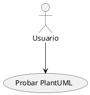
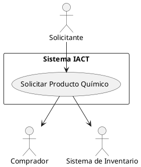
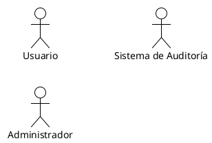
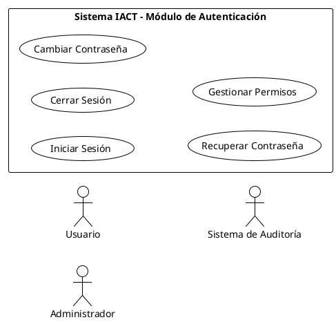
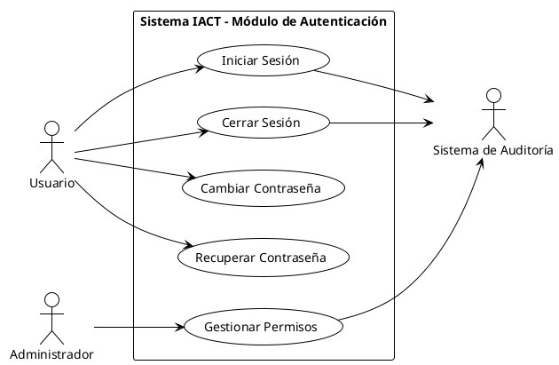
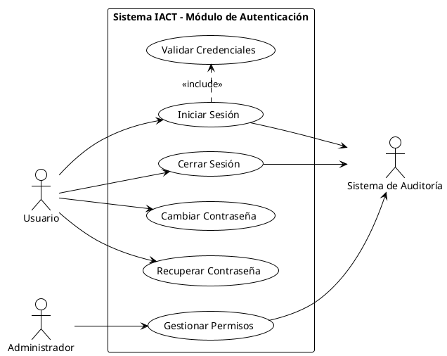
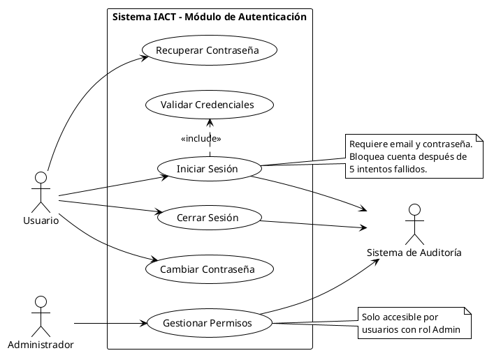

# GUIA-GOB-008: Crear Diagramas PlantUML

## Propósito

Esta guía enseña cómo crear diagramas UML de casos de uso y diagramas de actividad usando PlantUML, aplicando las convenciones establecidas en ADR-GOB-008 y ADR-GOB-004.

## Audiencia

- Analistas de requisitos
- Arquitectos de software
- Desarrolladores
- Technical Writers

## Problema que Resuelve

Sin una guía práctica de PlantUML:
- Diagramas con dirección de flechas incorrecta
- Inconsistencia en notación y elementos
- Desconocimiento de sintaxis PlantUML
- Diagramas no versionables (archivos binarios)
- Dificultad para crear diagramas de actividad para flujos complejos

## Recordatorio: Especificar vs Ilustrar

```
ESPECIFICAR casos de uso (GUIA-GOB-007)
    = ESCRIBIR documentos de texto

ILUSTRAR diagramas UML (esta guía)
    = DIBUJAR figuras con PlantUML
```

Ambos son necesarios y complementarios.

## Parte 1: Setup de PlantUML

### Instalación Local

#### Opción 1: Extensión de VSCode (Recomendado)

1. Instalar extensión "PlantUML" en VSCode
   ```
   Buscar: "PlantUML" por jebbs
   ```

2. Instalar Java (requerido para PlantUML)
   ```bash
   # Ubuntu/Debian
   sudo apt install default-jre

   # macOS (Homebrew)
   brew install openjdk
   ```

3. Instalar Graphviz (para layouts)
   ```bash
   # Ubuntu/Debian
   sudo apt install graphviz

   # macOS
   brew install graphviz
   ```

4. Configurar VSCode settings:
   ```json
   {
     "plantuml.exportFormat": "svg",
     "plantuml.exportSubFolder": false,
     "plantuml.exportOutDir": "."
   }
   ```

#### Opción 2: CLI (Línea de Comandos)

```bash
# Descargar plantuml.jar
wget https://sourceforge.net/projects/plantuml/files/plantuml.jar

# Generar diagrama
java -jar plantuml.jar diagrama.puml

# Generar en formato SVG
java -jar plantuml.jar -tsvg diagrama.puml
```

### Verificar Instalación

Crear archivo `test.puml`:



**En VSCode**: `Alt+D` para preview
**CLI**: `java -jar plantuml.jar test.puml`

Si se genera imagen, instalación exitosa.

## Parte 2: Diagramas UML de Casos de Uso

### Sintaxis Fundamental

#### Elementos Básicos

**1. Actores**:
```plantuml
actor "Nombre del Actor" as actorID
```

**Ejemplos**:
```plantuml
actor "Usuario" as usuario
actor "Administrador" as admin
actor "Sistema Externo" as sistema
```

**2. Casos de Uso**:
```plantuml
usecase "VERBO Objeto" as UCID
```

**Ejemplos**:
```plantuml
usecase "Iniciar Sesión" as UC001
usecase "Consultar Inventario" as UC010
usecase "Generar Reporte" as UC020
```

**3. Límite del Sistema**:
```plantuml
rectangle "Nombre del Sistema" {
  ' casos de uso aquí
}
```

**Ejemplo**:
```plantuml
rectangle "Sistema IACT" {
  usecase "Iniciar Sesión" as UC001
  usecase "Gestionar Permisos" as UC002
}
```

### Regla de Oro: Dirección de Flechas

**CRÍTICO**: La dirección de la flecha indica actor primario vs secundario.

```
Actor → Caso de Uso
    = Actor PRIMARIO (ejecuta el caso de uso)

Caso de Uso → Actor
    = Actor SECUNDARIO (proporciona soporte)
```

#### Ejemplo Visual



**Interpretación**:
- Solicitante es quien **ejecuta** el caso de uso (primario)
- Comprador e Inventario son **apoyo** (secundarios)

### Ejemplo Completo Paso a Paso

#### Paso 1: Crear Archivo

Crear `UCD-BACK-001-autenticacion.puml`

#### Paso 2: Estructura Base

```plantuml
@startuml UCD-BACK-001-autenticacion
!theme plain
left to right direction
skinparam packageStyle rectangle

' Contenido aquí

@enduml
```

**Explicación de directivas**:
- `!theme plain`: Tema simple sin colores innecesarios
- `left to right direction`: Layout horizontal (mejor para UML de UC)
- `skinparam packageStyle rectangle`: Usa rectángulos para límites

#### Paso 3: Definir Actores



#### Paso 4: Definir Sistema y Casos de Uso



#### Paso 5: Conectar Actores con Casos de Uso



#### Paso 6: Agregar Relaciones entre Casos de Uso (Opcional)



#### Paso 7: Agregar Notas (Opcional)



### Relaciones entre Casos de Uso

#### Include (Inclusión)

**Uso**: Caso de uso A SIEMPRE incluye comportamiento de caso de uso B.

**Sintaxis**:
```plantuml
UC001 .> UC002 : <<include>>
```

**Ejemplo**:
```plantuml
usecase "Procesar Venta" as UC020
usecase "Calcular Impuestos" as UC020A

UC020 .> UC020A : <<include>>

note right of UC020A
  Siempre se calcula IVA 16%
  al procesar venta
end note
```

**Interpretación**: No hay venta sin calcular impuestos.

#### Extend (Extensión)

**Uso**: Caso de uso B OPCIONALMENTE extiende comportamiento de caso de uso A bajo ciertas condiciones.

**Sintaxis**:
```plantuml
UC002 .> UC001 : <<extend>>
```

**Ejemplo**:
```plantuml
usecase "Procesar Venta" as UC020
usecase "Aplicar Descuento por Volumen" as UC020B

UC020B .> UC020 : <<extend>>

note left of UC020B
  Solo se aplica si
  cantidad >= 10 unidades
end note
```

**Interpretación**: El descuento es opcional, solo bajo condición.

#### Generalización (Herencia)

**Uso**: Caso de uso B es una especialización de caso de uso A.

**Sintaxis**:
```plantuml
UC002 --|> UC001
```

**Ejemplo**:
```plantuml
usecase "Autenticar Usuario" as UC001
usecase "Autenticar con JWT" as UC001A
usecase "Autenticar con OAuth2" as UC001B

UC001A --|> UC001
UC001B --|> UC001

note bottom of UC001
  Dos métodos de autenticación
  posibles
end note
```

### Tips de Layout

#### Problema: Diagramas Desordenados

PlantUML decide layout automáticamente, pero a veces necesita ayuda.

#### Solución 1: Dirección Global

```plantuml
' Para layout horizontal
left to right direction

' Para layout vertical (default)
top to bottom direction
```

#### Solución 2: Agrupar Elementos

```plantuml
rectangle "Sistema IACT" {
  ' Casos de uso del mismo módulo juntos
  usecase "UC1" as UC1
  usecase "UC2" as UC2
  usecase "UC3" as UC3
}
```

#### Solución 3: Hints de Posición

```plantuml
' Actores a la izquierda
actor "A1" as a1
actor "A2" as a2

' Sistema en el centro
rectangle "Sistema" {
  usecase "UC1" as UC1
}

' Actor secundario a la derecha
actor "A3" as a3

' Forzar orden con conexiones invisibles (raro, pero funciona)
a1 -[hidden]-> a2
```

### Generar SVG

**Desde VSCode**:
- Presionar `Alt+D` para preview
- Click derecho en preview → "Export Current Diagram"
- Seleccionar formato SVG

**Desde CLI**:
```bash
java -jar plantuml.jar -tsvg UCD-BACK-001-autenticacion.puml
```

**Resultado**: `UCD-BACK-001-autenticacion.svg`

### Integrar en Documentación Markdown

En el archivo `UC-BACK-001-iniciar-sesion.md`:

```markdown
# UC-BACK-001: Iniciar Sesión

## Diagrama de Casos de Uso


Fuente PlantUML: [UCD-BACK-001-autenticacion.puml](../diagramas/casos_uso/UCD-BACK-001-autenticacion.puml)

## Flujo Normal

[...]
```

## Parte 3: Diagramas de Actividad

### Cuándo Crear Diagrama de Actividad

Crear diagrama de actividad SI el caso de uso tiene:

- [ ] 3 o más flujos alternos
- [ ] Condicionales anidadas (if dentro de if)
- [ ] Bucles o iteraciones
- [ ] Decisiones complejas con múltiples caminos
- [ ] Flujos difíciles de visualizar solo con texto

### Sintaxis Fundamental

#### Elementos Básicos

**1. Inicio y Fin**:
```plantuml
start
stop
```

**2. Actividad (Acción)**:
```plantuml
:Nombre de la actividad;
```

**Ejemplo**:
```plantuml
:Usuario introduce email;
:Sistema valida formato;
```

**3. Condicional (Decisión)**:
```plantuml
if (¿Condición?) then (sí)
  :Acción si verdadero;
else (no)
  :Acción si falso;
endif
```

**4. Bucle (While)**:
```plantuml
while (¿Continuar?) is (sí)
  :Acción repetida;
endwhile (no)
```

**5. Fork/Join (Paralelismo)**:
```plantuml
fork
  :Acción 1 (paralela);
fork again
  :Acción 2 (paralela);
end fork
```

### Ejemplo Completo Paso a Paso

#### Contexto: UC-BACK-001 Iniciar Sesión

**Flujos**:
- Normal: Credenciales correctas
- Alterno: Primera vez que usa el sistema (cambiar contraseña)
- Excepción: Credenciales incorrectas (hasta 5 intentos)

#### Paso 1: Estructura Base

```plantuml
@startuml ACT-BACK-001-iniciar-sesion
!theme plain

start

stop

@enduml
```

#### Paso 2: Agregar Flujo Lineal

```plantuml
@startuml ACT-BACK-001-iniciar-sesion
!theme plain

start

:Usuario accede a pantalla de login;

:Usuario introduce email y contraseña;

:Sistema valida formato de email;

:Sistema valida credenciales;

:Sistema genera token de sesión;

:Sistema muestra pantalla principal;

stop

@enduml
```

#### Paso 3: Agregar Primera Decisión

```plantuml
@startuml ACT-BACK-001-iniciar-sesion
!theme plain

start

:Usuario accede a pantalla de login;

:Usuario introduce email y contraseña;

:Sistema valida formato de email;

if (¿Formato de email válido?) then (sí)
  :Sistema valida credenciales;
else (no)
  :Sistema muestra error "Email inválido";
  stop
endif

:Sistema genera token de sesión;

:Sistema muestra pantalla principal;

stop

@enduml
```

#### Paso 4: Agregar Validación de Credenciales

```plantuml
@startuml ACT-BACK-001-iniciar-sesion
!theme plain

start

:Usuario accede a pantalla de login;

:Usuario introduce email y contraseña;

:Sistema valida formato de email;

if (¿Formato de email válido?) then (sí)
  :Sistema valida credenciales;

  if (¿Credenciales correctas?) then (sí)
    :Sistema genera token de sesión;
    :Sistema actualiza campo "ultimo_acceso";
    :Sistema registra login exitoso en auditoría;
    :Sistema muestra pantalla principal;
    stop
  else (no)
    :Sistema incrementa contador de intentos fallidos;
    :Sistema registra intento fallido en auditoría;

    if (¿Intentos fallidos >= 5?) then (sí)
      :Sistema bloquea cuenta por 15 minutos;
      :Sistema muestra mensaje "Cuenta bloqueada";
      stop
    else (no)
      :Sistema muestra mensaje "Credenciales incorrectas";
      :Usuario puede reintentar;
      stop
    endif
  endif
else (no)
  :Sistema muestra error "Email inválido";
  stop
endif

@enduml
```

#### Paso 5: Agregar Flujo Alterno (Primera Vez)

```plantuml
@startuml ACT-BACK-001-iniciar-sesion
!theme plain

start

:Usuario accede a pantalla de login;

:Usuario introduce email y contraseña;

:Sistema valida formato de email;

if (¿Formato de email válido?) then (sí)
  :Sistema valida credenciales;

  if (¿Credenciales correctas?) then (sí)
    :Sistema genera token de sesión;

    if (¿Es primera vez del usuario?) then (sí)
      :Sistema marca sesión como temporal;
      :Sistema muestra pantalla "Cambiar Contraseña";
      :Usuario cambia contraseña;
      :Sistema actualiza contraseña;
      :Sistema registra cambio en auditoría;
      :Sistema muestra pantalla principal;
      stop
    else (no)
      :Sistema actualiza campo "ultimo_acceso";
      :Sistema registra login exitoso en auditoría;
      :Sistema muestra pantalla principal;
      stop
    endif
  else (no)
    :Sistema incrementa contador de intentos fallidos;
    :Sistema registra intento fallido en auditoría;

    if (¿Intentos fallidos >= 5?) then (sí)
      :Sistema bloquea cuenta por 15 minutos;
      :Sistema muestra mensaje "Cuenta bloqueada";
      stop
    else (no)
      :Sistema muestra mensaje "Credenciales incorrectas";
      stop
    endif
  endif
else (no)
  :Sistema muestra error "Email inválido";
  stop
endif

@enduml
```

### Colores y Estilos (Opcional)

PlantUML permite personalizar colores:

```plantuml
@startuml
!theme plain

start

:Actividad normal;

:Actividad exitosa; #palegreen

:Actividad de error; #lightcoral

if (¿Condición?) then (sí)
  :Camino exitoso; #palegreen
else (no)
  :Camino de error; #lightcoral
endif

stop

@enduml
```

**Recomendación**: Usar colores con moderación, solo para destacar rutas críticas.

### Swimlanes (Carriles por Actor)

Para mostrar qué actor hace cada acción:

```plantuml
@startuml
!theme plain

|Usuario|
start
:Introduce credenciales;

|Sistema|
:Valida credenciales;

if (¿Correctas?) then (sí)
  :Genera token;

  |Usuario|
  :Ve pantalla principal;
  stop
else (no)
  |Sistema|
  :Muestra error;

  |Usuario|
  :Puede reintentar;
  stop
endif

@enduml
```

**Ventaja**: Claridad sobre quién hace qué
**Desventaja**: Puede ser más complejo visualmente

### Ejemplo Completo: UC-BACK-040 Solicitar Producto Químico

```plantuml
@startuml ACT-BACK-040-solicitar-producto-quimico
!theme plain

start

:Solicitante accede a módulo de solicitudes;

:Sistema muestra catálogo de productos;

:Solicitante selecciona producto;

if (¿Producto es peligroso?) then (sí)
  :Sistema verifica certificación de seguridad del solicitante;

  if (¿Tiene certificación vigente?) then (sí)
    ' Continúa flujo normal
  else (no)
    :Sistema muestra mensaje "Requiere certificación";
    :Sistema sugiere contactar a RH para capacitación;
    stop
  endif
else (no)
  ' Continúa flujo normal
endif

:Sistema verifica disponibilidad en inventario;

if (¿Producto disponible en stock?) then (sí)
  :Sistema muestra información de producto;
  :Sistema muestra cantidad disponible;

  :Solicitante introduce cantidad solicitada;

  if (¿Cantidad <= stock disponible?) then (sí)
    :Solicitante confirma solicitud;
    :Sistema registra solicitud con estado "pendiente";
    :Sistema envía notificación a Comprador;
    :Sistema muestra número de seguimiento;
    stop
  else (no)
    :Sistema muestra mensaje "Stock insuficiente";
    :Sistema sugiere reducir cantidad;
    stop
  endif
else (no)
  :Sistema muestra mensaje "Producto no disponible";

  if (¿Hay productos alternativos?) then (sí)
    :Sistema sugiere 3 productos alternativos;

    if (¿Solicitante selecciona alternativa?) then (sí)
      :Sistema actualiza producto seleccionado;
      :Continúa con flujo normal;
      stop
    else (no)
      :Sistema ofrece "Solicitar inclusión en catálogo";
      stop
    endif
  else (no)
    :Sistema ofrece "Solicitar inclusión en catálogo";
    stop
  endif
endif

@enduml
```

## Parte 4: Nomenclatura de Archivos

### Diagramas de Casos de Uso

**Patrón**:
```
UCD-DOMINIO-###-descripcion.puml
```

**Ejemplos**:
```
UCD-BACK-001-autenticacion.puml
UCD-BACK-002-gestion-permisos.puml
UCD-FRONT-001-dashboard-principal.puml
UCD-BACK-010-gestion-productos-quimicos.puml
```

### Diagramas de Actividad

**Patrón**:
```
ACT-DOMINIO-###-descripcion.puml
```

O alineado con caso de uso específico:
```
ACT-UC###-descripcion.puml
```

**Ejemplos**:
```
ACT-BACK-001-flujo-login.puml
ACT-BACK-040-flujo-solicitar-producto.puml
ACT-UC001-iniciar-sesion.puml
```

## Parte 5: Estructura de Directorios

```
docs/gobernanza/requisitos/requerimientos_usuario/
├── casos_uso/
│   ├── UC-BACK-001-iniciar-sesion.md
│   ├── UC-BACK-040-solicitar-producto-quimico.md
│   └── ...
└── diagramas/
    ├── casos_uso/
    │   ├── UCD-BACK-001-autenticacion.puml
    │   ├── UCD-BACK-001-autenticacion.svg
    │   ├── UCD-BACK-010-gestion-productos.puml
    │   ├── UCD-BACK-010-gestion-productos.svg
    │   └── ...
    └── actividad/
        ├── ACT-BACK-001-flujo-login.puml
        ├── ACT-BACK-001-flujo-login.svg
        ├── ACT-BACK-040-flujo-solicitar-producto.puml
        ├── ACT-BACK-040-flujo-solicitar-producto.svg
        └── ...
```

## Parte 6: Integración con VSCode

### Extensiones Recomendadas

1. **PlantUML** (jebbs.plantuml)
   - Preview en tiempo real
   - Export a múltiples formatos
   - Autocompletado básico

2. **PlantUML Syntax** (optional)
   - Syntax highlighting mejorado

### Shortcuts Útiles

| Shortcut | Acción |
|----------|--------|
| `Alt+D` | Abrir preview del diagrama |
| `Ctrl+Shift+P` → "PlantUML: Export" | Exportar diagrama |
| `Ctrl+Shift+P` → "PlantUML: Export Current File" | Exportar archivo actual |

### Configuración Recomendada

En `.vscode/settings.json`:

```json
{
  "plantuml.exportFormat": "svg",
  "plantuml.exportSubFolder": false,
  "plantuml.exportOutDir": ".",
  "plantuml.diagramsRoot": "docs/",
  "plantuml.exportIncludeFolderHierarchy": false,
  "plantuml.server": "https://www.plantuml.com/plantuml",
  "plantuml.render": "PlantUMLServer"
}
```

## Parte 7: Checklist de Calidad de Diagramas

### Diagramas UML de Casos de Uso

- [ ] ¿Incluye límite del sistema (rectángulo)?
- [ ] ¿Los actores están fuera del rectángulo?
- [ ] ¿Los casos de uso están dentro del rectángulo?
- [ ] ¿Usa nomenclatura VERBO+OBJETO para casos de uso?
- [ ] ¿Las flechas Actor→UC indican actor primario?
- [ ] ¿Las flechas UC→Actor indican actor secundario?
- [ ] ¿Usa `!theme plain` para estilo limpio?
- [ ] ¿Usa `left to right direction` para layout horizontal?
- [ ] ¿Incluye notas explicativas solo si son necesarias?
- [ ] ¿El archivo .puml y .svg están en la ubicación correcta?

### Diagramas de Actividad

- [ ] ¿Tiene start y stop?
- [ ] ¿Las actividades están redactadas claramente?
- [ ] ¿Los condicionales tienen etiquetas claras (sí/no)?
- [ ] ¿Cubre flujo normal y principales flujos alternos?
- [ ] ¿Cubre excepciones críticas?
- [ ] ¿El diagrama es legible (no demasiado complejo)?
- [ ] ¿Usa colores solo cuando agrega valor?
- [ ] ¿Está alineado con especificación textual del UC?

## Parte 8: Errores Comunes y Soluciones

### Error 1: Flechas en Dirección Incorrecta

**Problema**:
```plantuml
' INCORRECTO
Sistema_Inventario --> UC004
```

**Razón**: Implica que Sistema de Inventario es actor primario, cuando es secundario.

**Solución**:
```plantuml
' CORRECTO
UC004 --> Sistema_Inventario
```

### Error 2: Nombres de UC sin VERBO+OBJETO

**Problema**:
```plantuml
usecase "Login" as UC001
usecase "Gestión de usuarios" as UC010
```

**Solución**:
```plantuml
usecase "Iniciar Sesión" as UC001
usecase "Gestionar Usuarios" as UC010
```

### Error 3: Olvido del Límite del Sistema

**Problema**:
```plantuml
@startuml
actor "Usuario" as user
usecase "UC1" as UC1
user --> UC1
@enduml
```

**Solución**:
```plantuml
@startuml
actor "Usuario" as user

rectangle "Sistema IACT" {
  usecase "UC1" as UC1
}

user --> UC1
@enduml
```

### Error 4: Diagramas de Actividad Demasiado Complejos

**Problema**: Intentar representar TODOS los flujos en un solo diagrama.

**Solución**: Crear diagramas separados:
- `ACT-BACK-001-flujo-normal.puml` (solo happy path)
- `ACT-BACK-001-flujo-excepcion-credenciales.puml` (excepción específica)

### Error 5: No Exportar SVG

**Problema**: Solo tener archivo `.puml` sin `.svg`.

**Razón**: El SVG es necesario para mostrar en documentación markdown.

**Solución**: Siempre exportar a SVG:
```bash
java -jar plantuml.jar -tsvg *.puml
```

## Parte 9: Ejemplos de Referencia

### Template: Diagrama UML de Casos de Uso

```plantuml
@startuml UCD-DOMINIO-###-descripcion
!theme plain
left to right direction
skinparam packageStyle rectangle

' Definir actores
actor "Nombre Actor Primario" as actor1
actor "Nombre Actor Secundario" as actor2

' Definir sistema y casos de uso
rectangle "Nombre del Sistema" {
  usecase "VERBO Objeto 1" as UC001
  usecase "VERBO Objeto 2" as UC002
  usecase "VERBO Objeto 3" as UC003
}

' Relaciones actores primarios (actor → UC)
actor1 --> UC001
actor1 --> UC002

' Relaciones actores secundarios (UC → actor)
UC001 --> actor2
UC002 --> actor2

' Relaciones entre casos de uso (opcional)
' UC001 .> UC002 : <<include>>
' UC003 .> UC001 : <<extend>>

' Notas (opcional)
note right of UC001
  Descripción breve si es necesario
end note

@enduml
```

### Template: Diagrama de Actividad

```plantuml
@startuml ACT-DOMINIO-###-descripcion
!theme plain

start

:Actividad inicial;

if (¿Condición 1?) then (sí)
  :Acción si verdadero;

  if (¿Condición anidada?) then (sí)
    :Acción anidada verdadera;
  else (no)
    :Acción anidada falsa;
  endif

else (no)
  :Acción si falso;
endif

:Actividad final;

stop

@enduml
```

## Referencias

- [ADR-GOB-008: Diagramas UML de Casos de Uso](/home/user/IACT---project/docs/gobernanza/adr/ADR-GOB-008-diagramas-uml-casos-uso.md)
- [ADR-GOB-004: PlantUML para Diagramas](/home/user/IACT---project/docs/gobernanza/adr/ADR-GOB-004-plantuml-para-diagramas.md)
- [ADR-GOB-007: Especificación de Casos de Uso](/home/user/IACT---project/docs/gobernanza/adr/ADR-GOB-007-especificacion-casos-uso.md)
- [GUIA-GOB-007: Escribir Casos de Uso Efectivos](GUIA-GOB-007-escribir-casos-uso-efectivos.md)
- [PlantUML Official Documentation](https://plantuml.com/)
- [PlantUML Use Case Diagram](https://plantuml.com/use-case-diagram)
- [PlantUML Activity Diagram](https://plantuml.com/activity-diagram-beta)

## Próximos Pasos

1. Instalar PlantUML en VSCode
2. Crear primer diagrama UML de casos de uso para módulo de autenticación
3. Crear diagrama de actividad para caso de uso complejo
4. Integrar diagramas en especificaciones de casos de uso
5. Configurar CI/CD para generar SVGs automáticamente (ver ADR-GOB-008)

## Historial de Cambios

| Versión | Fecha | Autor | Cambios |
|---------|-------|-------|---------|
| 1.0.0 | 2025-11-17 | Claude Code | Versión inicial |
