# GUIA-GOB-009: Documentación UML Completa y Patrones de Diagramas

## 1. Introducción

Esta guía proporciona patrones completos de documentación UML para todos los tipos de diagramas estándar de UML 2.5. Cada patrón incluye:

- **Propósito**: Cuándo usar el diagrama
- **Elementos principales**: Componentes del diagrama
- **Sintaxis PlantUML**: Código fuente comentado
- **Casos de uso**: Cuándo es más útil
- **Ejemplo del proyecto IACT**: Aplicación práctica
- **Anti-patrones**: Qué evitar

## 2. Fundamentos de PlantUML

### 2.1 Estructura Básica

Todos los diagramas PlantUML siguen esta estructura:

```plantuml
@startuml
' Metadata del diagrama
' Título, autor, versión, etc.

' Configuración (opcional)
' Estilos, dirección, escala

' Contenido del diagrama
' Elementos, relaciones, notas

@enduml
```

### 2.2 Nomenclatura de Archivos

Según [ADR-GOB-004](../adr/ADR-GOB-004-plantuml-para-diagramas.md):

```
TIPO-DOMINIO-###-descripcion.puml

Tipos:
- UC: Casos de Uso
- CLASS: Clases
- SEQ: Secuencia
- ACT: Actividad
- STATE: Estados
- COMP: Componentes
- DEPLOY: Despliegue
- OBJ: Objetos
- PKG: Paquetes
- TIMING: Timing
- COMM: Comunicación
```

### 2.3 Metadata Estándar

Todos los diagramas deben incluir:

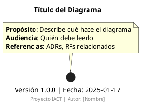

## 3. Diagrama de Despliegue (Deployment Diagram)

### 3.1 Propósito

Documenta la **arquitectura física** del sistema:
- Nodos de hardware/software
- Artefactos desplegados
- Conexiones de red
- Protocolos de comunicación

### 3.2 Cuándo Usar

- ✅ Diseño de infraestructura cloud/on-premise
- ✅ Documentación de topología de red
- ✅ Planificación de deployment
- ✅ Comunicación con DevOps/Infra
- ❌ NO para lógica de negocio (usar Secuencia/Actividad)
- ❌ NO para estructura de clases (usar Clases)

### 3.3 Elementos Principales

| Elemento | Notación PlantUML | Descripción |
|----------|-------------------|-------------|
| **Nodo** | `node "Nombre"` | Hardware o entorno de ejecución |
| **Artefacto** | `artifact "Nombre"` | Software deployable (.jar, .war, .exe) |
| **Componente** | `component "Nombre"` | Módulo de software |
| **Conexión** | `-->` | Comunicación entre nodos |
| **Protocolo** | `: HTTP/HTTPS` | Protocolo de comunicación |
| **Estereotipo** | `<<database>>` | Tipo especial de nodo |

### 3.4 Sintaxis PlantUML Completa

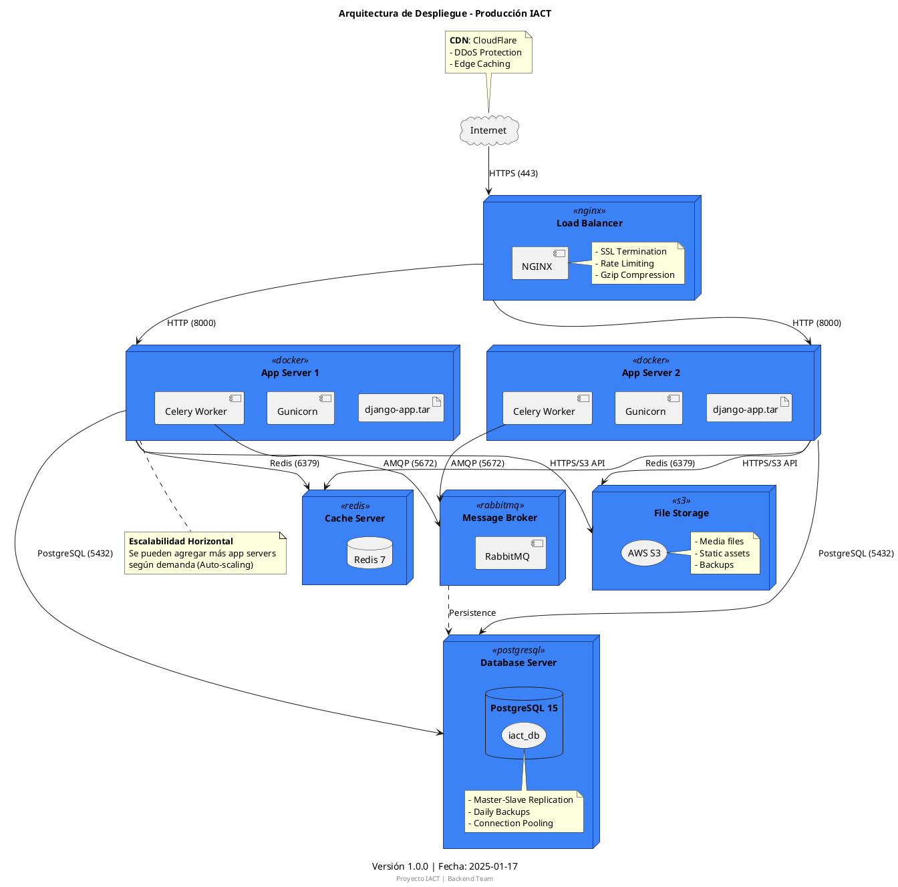

### 3.5 Patrones Comunes

#### Patrón 1: 3-Tier Architecture

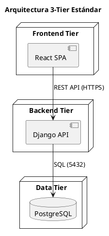

#### Patrón 2: Microservicios

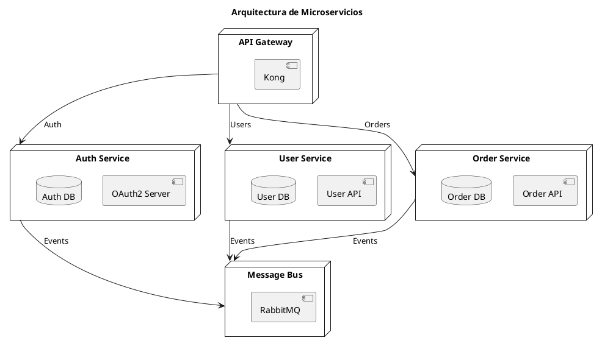

#### Patrón 3: Serverless

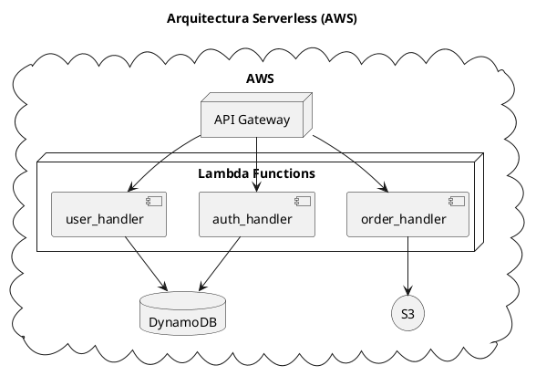

### 3.6 Estereotipos Útiles

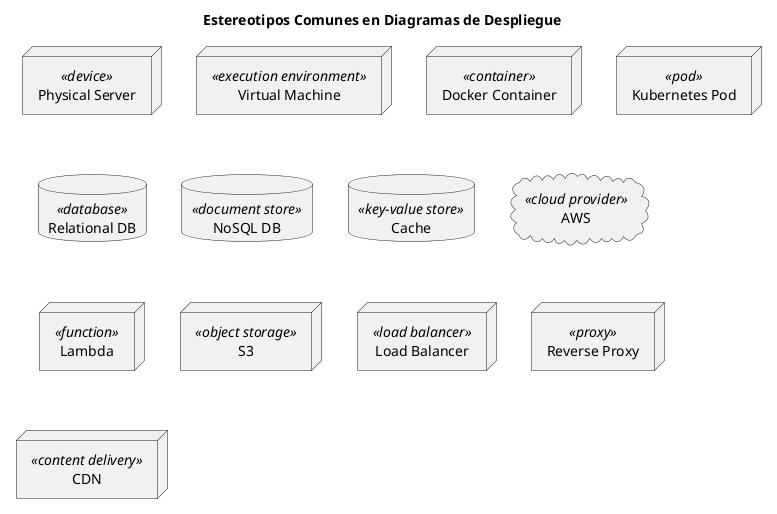

### 3.7 Ejemplo del Proyecto IACT: Entorno de Desarrollo

**BASADO EN CÓDIGO REAL**: `/home/user/IACT---project/infrastructure/vagrant/Vagrantfile`

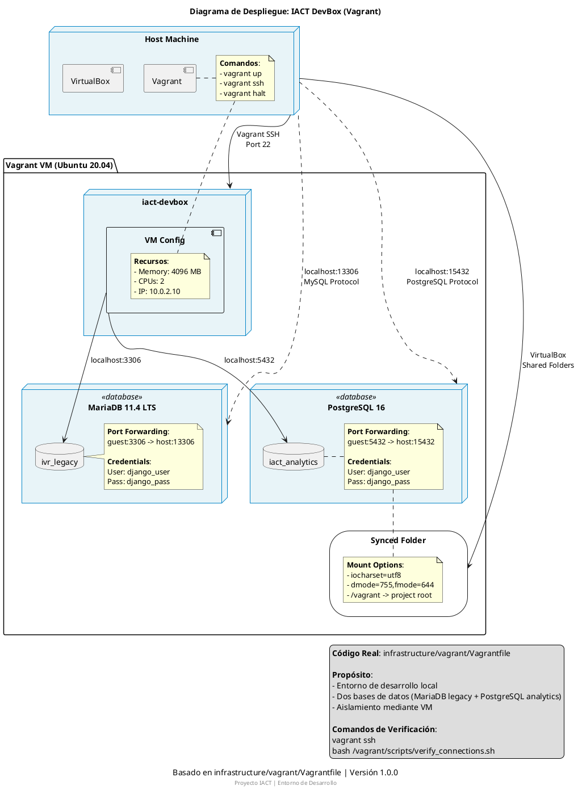

### 3.8 Ejemplo Completo: Sistema IACT Producción

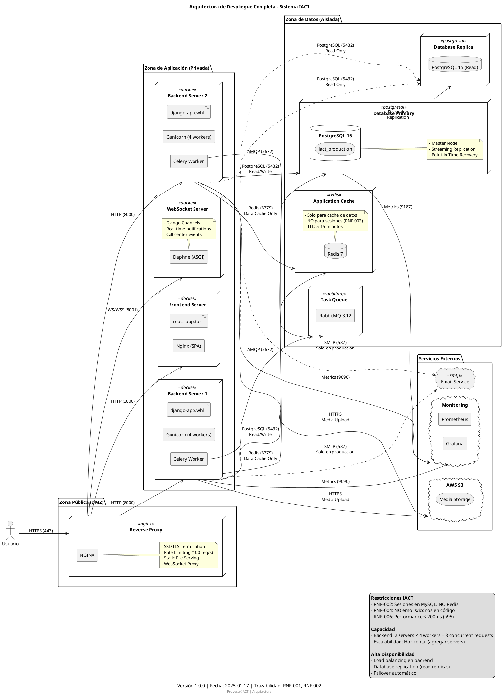

### 3.8 Anti-patrones

❌ **Anti-patrón 1: Demasiado detalle**

```plantuml
' MAL: Muestra cada archivo y proceso
node "Server" {
  artifact "app.py"
  artifact "models.py"
  artifact "views.py"
  artifact "urls.py"
  ' ... 50 archivos más ...
}
```

✅ **Mejor: Agrupa por componente lógico**

```plantuml
node "Server" {
  component "Django App" {
    artifact "app.whl"
  }
}
```

❌ **Anti-patrón 2: Mezclar niveles de abstracción**

```plantuml
' MAL: Mezcla infraestructura con lógica
node "Server" {
  component "User Service"  ' <- lógica
  artifact "docker-compose.yml"  ' <- infra
}
```

✅ **Mejor: Consistencia en el nivel**

```plantuml
node "App Server" <<docker>> {
  component "User Service"
  component "Order Service"
}
```

## 4. Diagrama de Componentes (Component Diagram)

### 4.1 Propósito

Documenta la **arquitectura lógica** del software:
- Componentes principales
- Interfaces expuestas
- Dependencias entre componentes
- Puertos y conectores

### 4.2 Cuándo Usar

- ✅ Arquitectura de módulos/librerías
- ✅ Diseño de APIs
- ✅ Documentación de dependencias
- ✅ Refactoring de monolito a microservicios

### 4.3 Sintaxis PlantUML

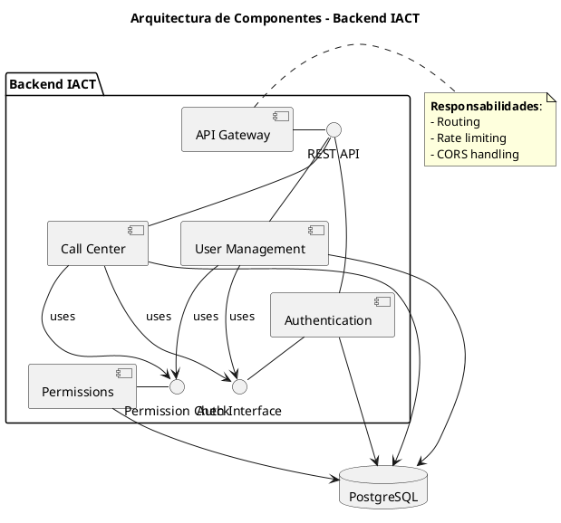

### 4.4 Ejemplo del Proyecto IACT: Módulo de Permisos

**BASADO EN CÓDIGO REAL**:
- `/home/user/IACT---project/api/callcentersite/callcentersite/apps/permissions/models.py`
- `/home/user/IACT---project/api/callcentersite/callcentersite/apps/permissions/services.py`

```plantuml
@startuml COMP-BACK-005-modulo-permisos-real
title Componentes del Módulo de Permisos - Sistema IACT (Código Real)
caption Basado en apps/permissions/ | ADR-012: Sistema sin roles jerárquicos
footer Proyecto IACT | Backend Team

package "apps.permissions" <<Django App>> {

  ' === CAPA DE SERVICIO ===
  component "PermisoService" as permisoservice {
    note right
      **Métodos principales**:
      + usuario_tiene_permiso(usuario_id, capacidad)
      + obtener_capacidades_usuario(usuario_id)
      + obtener_funciones_accesibles(usuario_id)
      + registrar_acceso(usuario_id, capacidad, ...)
      + verificar_capacidad_requiere_auditoria(capacidad)

      **Archivo**: services.py
    end note
  }

  ' === MODELOS DE DOMINIO ===
  package "Modelos (models.py)" {
    component "Funcion" as funcion {
      note bottom
        Recurso del sistema
        Ej: dashboards, usuarios, metricas
      end note
    }

    component "Capacidad" as capacidad {
      note bottom
        Acción específica
        Formato: sistema.dominio.recurso.accion
        Ej: sistema.vistas.dashboards.ver
      end note
    }

    component "GrupoPermisos" as grupo {
      note bottom
        Agrupación funcional (NO jerárquica)
        Ej: atencion_cliente, gestion_equipos
        NO admin/supervisor/agent
      end note
    }

    component "UsuarioGrupo" as usuariogrupo {
      note bottom
        Usuario puede tener MÚLTIPLES grupos
        Soporte para asignaciones temporales
      end note
    }

    component "GrupoCapacidad" as grupocapacidad
    component "FuncionCapacidad" as funcioncapacidad

    component "PermisoExcepcional" as excepcional {
      note bottom
        tipo: conceder | revocar
        Permite permisos temporales
      end note
    }

    component "AuditoriaPermiso" as auditoria {
      note bottom
        Registro de cada verificación
        Usuario, capacidad, IP, resultado
      end note
    }
  }

  ' === RELACIONES ENTRE COMPONENTES ===
  permisoservice ..> funcion : usa
  permisoservice ..> capacidad : usa
  permisoservice ..> grupo : usa
  permisoservice ..> usuariogrupo : verifica
  permisoservice ..> grupocapacidad : consulta
  permisoservice ..> excepcional : verifica
  permisoservice ..> auditoria : crea

  funcion "1" -- "*" funcioncapacidad
  capacidad "1" -- "*" funcioncapacidad

  grupo "1" -- "*" grupocapacidad
  capacidad "1" -- "*" grupocapacidad

  usuariogrupo "*" -- "1" grupo
}

' === DEPENDENCIAS EXTERNAS ===
database "PostgreSQL" as db {
  storage "permissions_funciones"
  storage "permissions_capacidades"
  storage "permissions_grupos_permisos"
  storage "permissions_usuarios_grupos"
  storage "permissions_grupo_capacidades"
  storage "permissions_permisos_excepcionales"
  storage "permissions_auditoria_permisos"
}

component "Django ORM" as orm

funcion --> orm
capacidad --> orm
grupo --> orm
excepcional --> orm
auditoria --> orm

orm --> db : SQL Queries

' === CONSUMIDORES ===
component "apps.users" as users
component "apps.llamadas" as llamadas
component "apps.authentication" as auth

users --> permisoservice : verifica permisos
llamadas --> permisoservice : verifica permisos
auth --> permisoservice : verifica permisos

' === LEYENDA ===
legend bottom
  **Filosofía**: SIN roles jerárquicos (NO admin/supervisor/agent)
  SOLO grupos funcionales de capacidades combinables

  **Algoritmo de Verificación**:
  1. Revocaciones excepcionales activas → DENEGAR
  2. Concesiones excepcionales activas → CONCEDER
  3. Capacidad por grupos activos → CONCEDER
  4. Sino → DENEGAR

  **Código Real**: api/callcentersite/callcentersite/apps/permissions/
end legend

@enduml
```

## 5. Diagrama de Secuencia (Sequence Diagram)

### 5.1 Propósito

Documenta **interacciones entre objetos a lo largo del tiempo**:
- Flujo de mensajes
- Orden temporal
- Loops y condicionales
- Asincronía

### 5.2 Sintaxis PlantUML

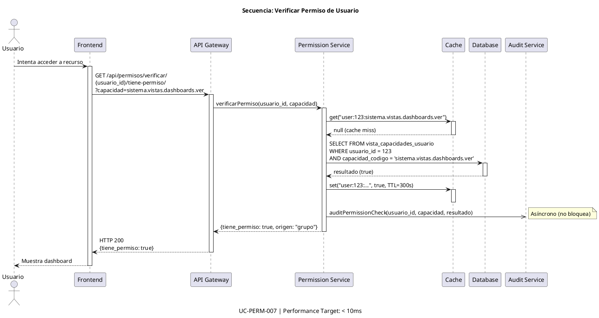

### 5.3 Ejemplo del Proyecto IACT: Verificación de Permiso Real

**BASADO EN CÓDIGO REAL**: `/home/user/IACT---project/api/callcentersite/callcentersite/apps/permissions/services.py` (método `usuario_tiene_permiso`)

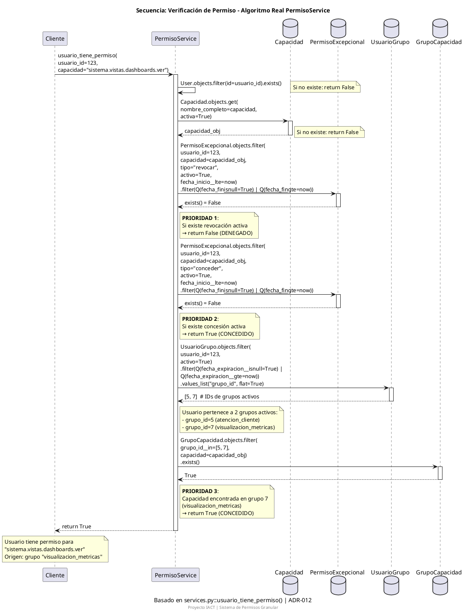

### 5.4 Elementos Avanzados

```plantuml
@startuml SEQ-EXAMPLE-elementos-avanzados
title Elementos Avanzados de Secuencia

actor Actor
participant "Sistema A" as A
participant "Sistema B" as B
database "Base de Datos" as DB

' Activación
Actor -> A : request()
activate A

' Condicional
alt successful case
  A -> B : call()
  B --> A : success
else failure
  A -> B : retry()
  B --> A : still failing
else fallback
  A -> A : useCachedData()
end

' Loop
loop every 5 seconds
  A -> B : healthCheck()
  B --> A : OK
end

' Opcional
opt if cache miss
  A -> DB : query()
  DB --> A : data
end

' Paralelo
par
  A -> B : async call 1
and
  A -> DB : async call 2
end

B --> A : response 1
DB --> A : response 2

' Referencia a otro diagrama
ref over A, B
  Ver SEQ-AUTH-001 para detalles de autenticación
end ref

deactivate A

@enduml
```

## 6. Diagrama de Actividad (Activity Diagram)

### 6.1 Propósito

Documenta **flujos de trabajo y procesos de negocio**:
- Decisiones (if/else)
- Paralelismo (fork/join)
- Loops
- Swimlanes (responsabilidades)

### 6.2 Sintaxis PlantUML

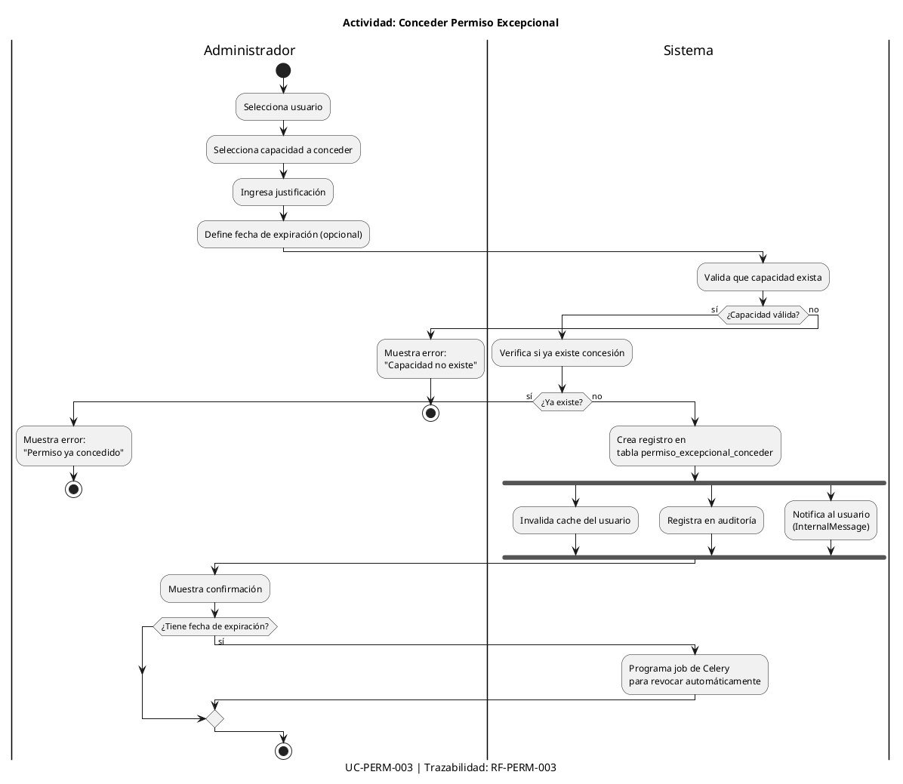

### 6.3 Swimlanes para Responsabilidades

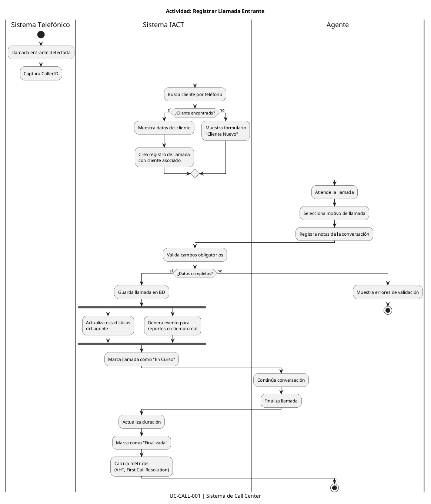

### 6.4 Ejemplo del Proyecto IACT: Flujo de Autenticación con JWT

**BASADO EN CÓDIGO REAL**: `/home/user/IACT---project/api/callcentersite/callcentersite/apps/authentication/services.py` (clase `AuthenticationService`)

```plantuml
@startuml ACT-AUTH-REAL-001-login-jwt
title Actividad: Login con JWT - Flujo Real AuthenticationService
caption Basado en authentication/services.py::AuthenticationService.login() | RF-005
footer Proyecto IACT | Sistema de Autenticación

|Usuario|
start
:Ingresa username y password;

|Sistema|
:Obtiene IP y user agent del request;

:Busca usuario por username;

if (¿Usuario existe?) then (no)
  :Registra en AuditLog:\nevent_type='LOGIN_FAILURE'\nreason='usuario_inexistente';
  :raise Exception(\n"Credenciales inválidas");
  stop
else (sí)
  if (¿user.status == 'ACTIVO'?) then (no)
    :Registra en AuditLog:\nevent_type='LOGIN_FAILURE'\nreason='usuario_inactivo';
    :raise PermissionDenied(\n"Usuario inactivo");
    stop
  else (sí)
    if (¿user.is_locked?) then (sí)
      if (¿locked_until < now?) then (sí - expiró)
        :Desbloquea automáticamente;
        :user.is_locked = False;
        :user.locked_until = None;
        :user.failed_login_attempts = 0;
        :Registra en AuditLog:\nevent_type='USER_UNLOCKED'\nreason='automatic_timeout';
      else (no - sigue bloqueado)
        :Calcula minutos restantes;
        :Registra en AuditLog:\nevent_type='LOGIN_FAILURE'\nreason='cuenta_bloqueada';
        :raise PermissionDenied(\n"Cuenta bloqueada. Tiempo restante: X minutos");
        stop
      endif
    endif

    :Verifica password con check_password();

    if (¿Password correcta?) then (no)
      :user.failed_login_attempts += 1;
      :user.last_failed_login_at = now;

      if (¿failed_login_attempts >= 3?) then (sí)
        :user.is_locked = True;
        :user.locked_until = now + 15 minutos;
        :user.lock_reason = 'MAX_FAILED_ATTEMPTS';
        :Guarda usuario;

        :Registra en AuditLog:\nevent_type='USER_LOCKED';

        fork
          :Crea InternalMessage:\nsubject='Cuenta bloqueada'\nmessage_type='alert'\npriority='high';
        end fork

        :raise Exception(\n"Cuenta bloqueada por múltiples intentos");
        stop
      else (no)
        :Guarda usuario;
        :Registra en AuditLog:\nevent_type='LOGIN_FAILURE'\nreason='credenciales_invalidas';
        :raise Exception(\n"Credenciales inválidas");
        stop
      endif
    else (sí - credenciales válidas)

      ' === LOGIN EXITOSO ===

      :Busca sesiones previas activas:\nUserSession.objects.filter(\nuser=user, is_active=True);

      while (¿Hay sesiones previas?) is (sí)
        :Cierra sesión previa:\nsession.close(reason='NEW_SESSION');

        fork
          :Registra en AuditLog:\nevent_type='SESSION_CLOSED'\nreason='new_session';
        fork again
          :Crea InternalMessage:\nsubject='Nueva sesión iniciada'\nmessage_type='info';
        end fork
      endwhile (no)

      :Resetea contadores de fallo;
      :user.failed_login_attempts = 0;
      :user.last_failed_login_at = None;
      :user.last_login_at = now;
      :user.last_login_ip = ip_address;
      :Guarda usuario;

      :Crea nueva UserSession:\nis_active=True\nip_address=...\nuser_agent=...;

      :Genera JWT tokens:\nRefreshToken.for_user(user);
      :access_token = str(refresh.access_token);
      :refresh_token = str(refresh);

      :Registra en AuditLog:\nevent_type='LOGIN_SUCCESS';

      |Usuario|
      :Recibe tokens JWT:\n{\n  "access_token": "...",\n  "refresh_token": "...",\n  "token_type": "Bearer",\n  "expires_in": 900\n};

      stop
    endif
  endif
endif

@enduml
```

## 7. Diagrama de Estados (State Diagram)

### 7.1 Propósito

Documenta el **ciclo de vida de un objeto**:
- Estados posibles
- Transiciones entre estados
- Eventos que causan transiciones
- Acciones en entrada/salida

### 7.2 Sintaxis PlantUML

```plantuml
@startuml STATE-CALL-001-ciclo-vida-llamada
title Estados: Ciclo de Vida de una Llamada
caption Trazabilidad: RF-CALL-001

[*] --> Entrante : Llamada detectada

Entrante : entry / Crear registro
Entrante : do / Ring
Entrante : exit / Detener ring

Entrante --> EnCurso : Agente atiende
Entrante --> Perdida : Timeout (30s)
Entrante --> Perdida : Agente rechaza

EnCurso : entry / Iniciar cronómetro
EnCurso : do / Grabar conversación
EnCurso : exit / Detener cronómetro

EnCurso --> EnEspera : Hold
EnCurso --> Transferida : Transferir
EnCurso --> Finalizada : Colgar

EnEspera : entry / Reproducir música
EnEspera --> EnCurso : Resume

Transferida : entry / Buscar agente destino
Transferida --> EnCurso : Aceptada
Transferida --> Finalizada : Rechazada

Finalizada : entry / Calcular duración
Finalizada : entry / Actualizar métricas
Finalizada --> RequiereNotas : Si faltan notas
Finalizada --> Completada : Si tiene notas

RequiereNotas --> Completada : Agente completa notas

Perdida : entry / Incrementar contador perdidas
Perdida --> [*]

Completada --> [*]

@enduml
```

### 7.3 Ejemplo del Proyecto IACT: Ciclo de Vida de Llamada

**BASADO EN CÓDIGO REAL**: `/home/user/IACT---project/api/callcentersite/callcentersite/apps/llamadas/models.py` (modelo `Llamada` y `EstadoLlamada`)

```plantuml
@startuml STATE-LLAMADA-REAL-001-ciclo-vida
title Estados: Ciclo de Vida de una Llamada - Sistema IACT
caption Basado en apps/llamadas/models.py | Sistema de Call Center
footer Proyecto IACT | Módulo Operativo Llamadas

note top
  **Modelo Real**:
  - class Llamada(models.Model)
  - class EstadoLlamada(models.Model)
  - Relación: Llamada.estado FK -> EstadoLlamada
  - Código único: formato "CALL-XXXXXXXXXXXX"
end note

[*] --> Entrante : Llamada detectada\nLlamada.objects.create()

state Entrante {
  state "Entrante" as entrante_state
  entrante_state : entry / Crear registro Llamada
  entrante_state : do / Ring
  entrante_state : tipo = TipoLlamada (FK)
  entrante_state : numero_telefono registrado
  entrante_state : fecha_inicio = timezone.now()
}

Entrante --> EnCurso : Agente atiende\nagente (FK) asignado
Entrante --> Perdida : Timeout / Agente rechaza\nestado.es_final = True

state EnCurso {
  state "En Curso" as encurso_state
  encurso_state : entry / Iniciar cronómetro
  encurso_state : do / Grabar conversación
  encurso_state : agente.llamadas_atendidas++
  encurso_state : metadata JSON actualizado
}

EnCurso --> EnEspera : Hold
EnCurso --> Transferida : Transferir a otro agente
EnCurso --> Finalizada : Colgar\nfecha_fin = timezone.now()

state EnEspera {
  state "En Espera" as espera_state
  espera_state : entry / Reproducir música
  espera_state : metadata['hold_start'] = now
}

EnEspera --> EnCurso : Resume\nmetadata['hold_duration'] calculado

state Transferida {
  state "Transferida" as transferida_state
  transferida_state : entry / Buscar agente destino
  transferida_state : metadata['original_agent'] guardado
  transferida_state : metadata['transfer_reason']
}

Transferida --> EnCurso : Aceptada por nuevo agente\nagente (FK) actualizado
Transferida --> Finalizada : Rechazada

state Finalizada {
  state "Finalizada" as finalizada_state
  finalizada_state : entry / fecha_fin = now
  finalizada_state : entry / calcular_duracion()
  finalizada_state : do / Guardar en BD
  finalizada_state : notas TextField
}

Finalizada --> RequiereNotas : Si notas vacías\nnotas.isblank()
Finalizada --> Completada : Si tiene notas

state RequiereNotas {
  state "Requiere Notas" as notas_state
  notas_state : do / Mostrar formulario
  notas_state : notas obligatorias
}

RequiereNotas --> Completada : Agente completa notas\nLlamada.save(update_fields=['notas'])

state Completada {
  state "Completada" as completada_state
  completada_state : es_final = True
  completada_state : entry / Actualizar métricas agente
  completada_state : entry / Generar eventos analytics
  completada_state : LlamadaGrabacion creada (OneToOne)
  completada_state : LlamadaTranscripcion[] opcional
}

state Perdida {
  state "Perdida" as perdida_state
  perdida_state : es_final = True
  perdida_state : entry / Incrementar contador perdidas
  perdida_state : metadata['lost_reason']
}

Perdida --> [*]
Completada --> [*]

note right of Completada
  **Modelos Relacionados**:
  - LlamadaGrabacion (OneToOne)
    - archivo_url, formato, duracion_segundos
  - LlamadaTranscripcion (FK)
    - texto, timestamp_inicio, hablante
end note

note bottom of Llamada
  **Método del Modelo**:
  def calcular_duracion(self):
    if self.fecha_fin:
      delta = self.fecha_fin - self.fecha_inicio
      return int(delta.total_seconds())
    return None
end note

legend right
  **Código Real**: apps/llamadas/models.py

  **Tablas Base de Datos**:
  - llamadas
  - llamadas_estados
  - llamadas_tipos
  - llamadas_grabaciones
  - llamadas_transcripciones

  **Índices (models.Index)**:
  - numero_telefono
  - agente + fecha_inicio
  - estado
  - fecha_inicio
end legend

@enduml
```

### 7.4 Estados Compuestos

```plantuml
@startuml STATE-COMPLEX-ejemplo-compuesto
title Estados Compuestos: Sistema de Autenticación

[*] --> NoAutenticado

state NoAutenticado {
  [*] --> Inicial
  Inicial --> IngresandoCredenciales : Inicio de sesión
  IngresandoCredenciales --> ValidandoCredenciales : Submit
  ValidandoCredenciales --> IngresandoCredenciales : Error
}

NoAutenticado --> Autenticado : Credenciales válidas

state Autenticado {
  [*] --> Activo

  state Activo {
    [*] --> Normal
    Normal --> Inactivo : 15 min sin actividad
    Inactivo --> Normal : Actividad detectada
    Inactivo --> RequiereReautenticacion : 30 min sin actividad
  }

  RequiereReautenticacion --> Activo : Re-autenticación exitosa
}

Autenticado --> NoAutenticado : Logout
Autenticado --> NoAutenticado : Token expirado

@enduml
```

## 8. Diagrama de Paquetes (Package Diagram)

### 8.1 Propósito

Documenta la **organización de módulos/paquetes**:
- Estructura de directorios
- Dependencias entre paquetes
- Capas arquitectónicas
- Módulos públicos vs privados

### 8.2 Sintaxis PlantUML

```plantuml
@startuml PKG-BACK-001-estructura-backend
title Estructura de Paquetes - Backend IACT

package "apps" {
  package "authentication" {
    [models]
    [views]
    [serializers]
    [services]
  }

  package "users" {
    [models] as users_models
    [views] as users_views
    [serializers] as users_serializers
  }

  package "permissions" {
    [models] as perm_models
    [views] as perm_views
    [services] as perm_services
    [cache] as perm_cache
  }

  package "call_center" {
    [models] as call_models
    [views] as call_views
    [websockets] as call_ws
  }
}

package "core" {
  [settings]
  [urls]
  [middleware]
  [utils]
}

package "shared" {
  [exceptions]
  [validators]
  [decorators]
}

' Dependencias
users --> authentication : uses
call_center --> permissions : uses
call_center --> users : uses
permissions --> shared : uses

authentication ..> core : configured by

@enduml
```

## 9. Diagrama de Clases (Class Diagram)

### 9.1 Sintaxis PlantUML para Modelos Django

```plantuml
@startuml CLASS-BACK-010-modelo-permisos
title Modelo de Datos: Sistema de Permisos Granulares
caption Trazabilidad: RN-PERM-001 a RN-PERM-010

' === ENTIDADES PRINCIPALES ===

class Usuario {
  +id: Integer <<PK>>
  +username: String(150) <<unique>>
  +email: String(254) <<unique>>
  +first_name: String(150)
  +last_name: String(150)
  +is_active: Boolean
  +date_joined: DateTime
  --
  +get_capacidades(): List<String>
  +tiene_capacidad(codigo: String): Boolean
  +get_menu(): Dict
}

class Grupo {
  +id: Integer <<PK>>
  +nombre: String(100) <<unique>>
  +descripcion: Text
  +activo: Boolean
  +fecha_creacion: DateTime
  --
  +get_capacidades(): List<Capacidad>
  +agregar_capacidad(capacidad: Capacidad): void
  +remover_capacidad(capacidad: Capacidad): void
}

class Capacidad {
  +id: Integer <<PK>>
  +codigo: String(200) <<unique>>
  +nombre: String(200)
  +descripcion: Text
  +activo: Boolean
  +fecha_creacion: DateTime
  --
  <<constraint>> codigo formato "sistema.dominio.subdominio.funcion.accion"
  --
  +validar_formato(): Boolean
}

class UsuarioGrupo {
  +id: Integer <<PK>>
  +usuario: ForeignKey(Usuario)
  +grupo: ForeignKey(Grupo)
  +fecha_asignacion: DateTime
  +asignado_por: ForeignKey(Usuario)
  --
  <<unique_together>> (usuario, grupo)
}

class GrupoCapacidad {
  +id: Integer <<PK>>
  +grupo: ForeignKey(Grupo)
  +capacidad: ForeignKey(Capacidad)
  +fecha_asignacion: DateTime
  +asignado_por: ForeignKey(Usuario)
  --
  <<unique_together>> (grupo, capacidad)
}

class PermisoExcepcionalConceder {
  +id: Integer <<PK>>
  +usuario: ForeignKey(Usuario)
  +capacidad: ForeignKey(Capacidad)
  +justificacion: Text
  +fecha_concesion: DateTime
  +fecha_expiracion: DateTime <<nullable>>
  +concedido_por: ForeignKey(Usuario)
  +activo: Boolean
  --
  <<constraint>> fecha_expiracion > fecha_concesion
}

class PermisoExcepcionalRevocar {
  +id: Integer <<PK>>
  +usuario: ForeignKey(Usuario)
  +capacidad: ForeignKey(Capacidad)
  +justificacion: Text
  +fecha_revocacion: DateTime
  +fecha_expiracion: DateTime <<nullable>>
  +revocado_por: ForeignKey(Usuario)
  +activo: Boolean
}

class AuditoriaPermiso {
  +id: Integer <<PK>>
  +usuario: ForeignKey(Usuario)
  +capacidad_codigo: String(200)
  +resultado: Boolean
  +ip_address: String(45)
  +user_agent: Text
  +timestamp: DateTime
  +metadatos: JSONField
  --
  <<index>> (usuario, timestamp)
  <<index>> (capacidad_codigo, timestamp)
  <<index>> (resultado, timestamp)
}

' === RELACIONES ===

Usuario "1" -- "*" UsuarioGrupo : tiene >
Grupo "1" -- "*" UsuarioGrupo : contiene >
Grupo "1" -- "*" GrupoCapacidad : tiene >
Capacidad "1" -- "*" GrupoCapacidad : pertenece a >

Usuario "1" -- "*" PermisoExcepcionalConceder : recibe >
Capacidad "1" -- "*" PermisoExcepcionalConceder : otorga >

Usuario "1" -- "*" PermisoExcepcionalRevocar : pierde >
Capacidad "1" -- "*" PermisoExcepcionalRevocar : revoca >

Usuario "1" -- "*" AuditoriaPermiso : genera >

' === VISTA MATERIALIZADA ===

class VistaCapacidadesUsuario <<view>> {
  +usuario_id: Integer
  +capacidad_codigo: String(200)
  +origen: String(20)
  --
  <<materialized view>>
  <<refresh>> cada 5 minutos o por trigger
}

note right of VistaCapacidadesUsuario
  **Algoritmo de Verificación**:
  1. Revocaciones excepcionales activas → DENEGAR
  2. Concesiones excepcionales activas → CONCEDER
  3. Capacidad por grupos activos → CONCEDER
  4. Sino → DENEGAR
end note

Usuario "1" -- "*" VistaCapacidadesUsuario : tiene capacidades >

@enduml
```

### 9.2 Ejemplo del Proyecto IACT: Modelo Real de Permisos Granular

**BASADO EN CÓDIGO REAL**: `/home/user/IACT---project/api/callcentersite/callcentersite/apps/permissions/models.py`

```plantuml
@startuml CLASS-PERM-REAL-001-modelo-completo
title Diagrama de Clases: Sistema de Permisos Granular IACT (Código Real)
caption Basado en apps/permissions/models.py | ADR-012: NO roles jerárquicos
footer Proyecto IACT | Sistema de Permisos Granular

' === CONFIGURACIÓN ===
skinparam class {
  BackgroundColor #f0f9ff
  BorderColor #0284c7
  ArrowColor #0369a1
}

' === ENTIDADES PRINCIPALES ===

class Funcion <<models.Model>> {
  **db_table**: permissions_funciones
  --
  +id: AutoField <<PK>>
  +nombre: CharField(100)
  +nombre_completo: CharField(200) <<unique>>
  +descripcion: TextField
  +dominio: CharField(100)
  +categoria: CharField(50)
  +icono: CharField(50)
  +orden_menu: IntegerField
  +activa: BooleanField
  +created_at: DateTimeField
  +updated_at: DateTimeField
  --
  **Ejemplo**:
  nombre: "dashboards"
  nombre_completo: "sistema.vistas.dashboards"
  dominio: "vistas"
  categoria: "visualizacion"
  --
  <<indexes>>
  - dominio
  - activa
  - categoria
}

class Capacidad <<models.Model>> {
  **db_table**: permissions_capacidades
  --
  +id: AutoField <<PK>>
  +nombre_completo: CharField(200) <<unique>>
  +descripcion: TextField
  +accion: CharField(50)
  +recurso: CharField(100)
  +dominio: CharField(100)
  +nivel_sensibilidad: CharField(20)
  +requiere_auditoria: BooleanField
  +activa: BooleanField
  +created_at: DateTimeField
  --
  **Formato**: sistema.dominio.recurso.accion
  **Ejemplo**: sistema.vistas.dashboards.ver
  --
  **Niveles Sensibilidad**:
  - bajo: Consultas básicas
  - normal: Operaciones estándar
  - alto: Modificaciones importantes
  - critico: Alto impacto (requiere auditoría)
  --
  <<indexes>>
  - accion
  - recurso
  - nivel_sensibilidad
}

class GrupoPermisos <<models.Model>> {
  **db_table**: permissions_grupos_permisos
  --
  +id: AutoField <<PK>>
  +codigo: CharField(100) <<unique>>
  +nombre_display: CharField(200)
  +descripcion: TextField
  +tipo_acceso: CharField(50)
  +activo: BooleanField
  +created_at: DateTimeField
  +updated_at: DateTimeField
  --
  **IMPORTANTE**: NO roles jerárquicos
  NO admin/supervisor/agent
  SÍ grupos funcionales combinables
  --
  **Ejemplos**:
  - atencion_cliente
  - gestion_equipos
  - visualizacion_metricas
  --
  **Tipos Acceso** (NO jerárquicos):
  - operativo
  - gestion
  - analisis
  - estrategico
  - tecnico
  - finanzas
  - calidad
}

class FuncionCapacidad <<models.Model>> {
  **db_table**: permissions_funcion_capacidades
  --
  +id: AutoField <<PK>>
  +funcion: ForeignKey(Funcion)
  +capacidad: ForeignKey(Capacidad)
  +requerida: BooleanField
  +visible_en_ui: BooleanField
  +created_at: DateTimeField
  --
  <<unique_together>> (funcion, capacidad)
}

class GrupoCapacidad <<models.Model>> {
  **db_table**: permissions_grupo_capacidades
  --
  +id: AutoField <<PK>>
  +grupo: ForeignKey(GrupoPermisos)
  +capacidad: ForeignKey(Capacidad)
  +created_at: DateTimeField
  --
  <<unique_together>> (grupo, capacidad)
}

class UsuarioGrupo <<models.Model>> {
  **db_table**: permissions_usuarios_grupos
  --
  +id: AutoField <<PK>>
  +usuario: ForeignKey(User)
  +grupo: ForeignKey(GrupoPermisos)
  +fecha_asignacion: DateTimeField
  +fecha_expiracion: DateTimeField <<nullable>>
  +asignado_por: ForeignKey(User)
  +activo: BooleanField
  --
  **Usuario puede tener MÚLTIPLES grupos**
  No hay jerarquía entre grupos
  --
  <<unique_together>> (usuario, grupo)
  --
  +is_expired(): bool
}

class PermisoExcepcional <<models.Model>> {
  **db_table**: permissions_permisos_excepcionales
  --
  +id: AutoField <<PK>>
  +usuario: ForeignKey(User)
  +capacidad: ForeignKey(Capacidad)
  +tipo: CharField(20)
  +fecha_inicio: DateTimeField
  +fecha_fin: DateTimeField <<nullable>>
  +motivo: TextField
  +autorizado_por: ForeignKey(User)
  +activo: BooleanField
  +created_at: DateTimeField
  --
  **Tipos**:
  - conceder: Otorga capacidad temporal
  - revocar: Revoca capacidad específica
  --
  **Casos de Uso**:
  - Conceder: Proyecto especial
  - Revocar: Incidente de seguridad
  --
  <<indexes>>
  - (usuario, activo)
  --
  +is_active_now(): bool
}

class AuditoriaPermiso <<models.Model>> {
  **db_table**: permissions_auditoria_permisos
  --
  +id: AutoField <<PK>>
  +usuario: ForeignKey(User) <<nullable>>
  +capacidad: CharField(200)
  +accion_realizada: CharField(100)
  +recurso_accedido: CharField(200)
  +ip_address: CharField(50)
  +user_agent: TextField
  +metadata: JSONField
  +timestamp: DateTimeField
  --
  **Registra**:
  - Quien: usuario
  - Que: capacidad
  - Cuando: timestamp
  - Donde: IP, user agent
  - Resultado: acceso_concedido/denegado
  --
  <<indexes>>
  - usuario
  - timestamp
  - accion_realizada
}

' === RELACIONES ===

Funcion "1" -- "*" FuncionCapacidad : capacidades >
Capacidad "1" -- "*" FuncionCapacidad : funciones >

GrupoPermisos "1" -- "*" GrupoCapacidad : capacidades >
Capacidad "1" -- "*" GrupoCapacidad : grupos >

GrupoPermisos "1" -- "*" UsuarioGrupo : usuarios >

Capacidad "1" -- "*" PermisoExcepcional : permisos_excepcionales >

' === NOTAS EXPLICATIVAS ===

note top of Funcion
  **Función**: Recurso del sistema
  Agrupa capacidades relacionadas

  Ejemplo:
  funcion 'dashboards' tiene capacidades:
  - ver
  - exportar
  - personalizar
end note

note right of GrupoPermisos
  **Filosofía del Sistema**:
  SIN roles jerárquicos
  (NO admin/supervisor/agent)

  SOLO grupos funcionales
  de capacidades combinables

  Un usuario puede tener:
  - atencion_cliente
  + visualizacion_metricas
  + gestion_horarios
  ¡SIMULTÁNEAMENTE!
end note

note bottom of PermisoExcepcional
  **Algoritmo de Verificación**:

  PRIORIDAD 1:
  PermisoExcepcional.tipo='revocar'
  activo y vigente → DENEGAR

  PRIORIDAD 2:
  PermisoExcepcional.tipo='conceder'
  activo y vigente → CONCEDER

  PRIORIDAD 3:
  Capacidad en GrupoCapacidad
  de grupos activos → CONCEDER

  Sino → DENEGAR
end note

note left of AuditoriaPermiso
  Registra TODOS los intentos
  de acceso (concedidos y denegados)
  para capacidades que
  requieren_auditoria=True
end note

legend bottom
  **Código Real**: api/callcentersite/callcentersite/apps/permissions/models.py

  **Filosofía ADR-012**:
  Sistema de permisos granular SIN roles jerárquicos
  Basado en capacidades funcionales combinables

  **8 Tablas Core**:
  1. permissions_funciones
  2. permissions_capacidades
  3. permissions_grupos_permisos
  4. permissions_funcion_capacidades
  5. permissions_grupo_capacidades
  6. permissions_usuarios_grupos
  7. permissions_permisos_excepcionales
  8. permissions_auditoria_permisos
end legend

@enduml
```

## 10. Otros Diagramas UML

### 10.1 Diagrama de Objetos

```plantuml
@startuml OBJ-EXAMPLE-instancias
title Diagrama de Objetos: Ejemplo de Permisos

object "usuario:Usuario" as u1 {
  id = 123
  username = "carlos.ruiz"
  email = "carlos@iact.com"
}

object "grupo:Grupo" as g1 {
  id = 5
  nombre = "Agentes"
  activo = true
}

object "capacidad:Capacidad" as c1 {
  id = 42
  codigo = "sistema.vistas.dashboards.ver"
}

u1 -- g1 : miembro de
g1 -- c1 : tiene

@enduml
```

### 10.2 Diagrama de Tiempo (Timing)

```plantuml
@startuml TIMING-EXAMPLE-cache-invalidation
title Diagrama de Timing: Invalidación de Cache

robust "Cache Status" as cache
concise "Database" as db
concise "User Request" as req

@0
cache is Valid
db is Idle
req is Idle

@10
req is Request
: Usuario solicita permiso

@15
cache is Hit
: Cache HIT (válido)

@20
req is Response
: Respuesta rápida (< 5ms)

@100
db is Update
: Admin modifica grupos

@105
cache is Invalid
: Cache invalidado

@110
req is Request
: Nueva solicitud de usuario

@115
cache is Miss
: Cache MISS

@120
db is Query
: Consulta a base de datos

@150
cache is Valid
: Cache actualizado

@155
req is Response
: Respuesta (30ms)

@enduml
```

### 10.3 Diagrama de Comunicación

```plantuml
@startuml COMM-EXAMPLE-verificacion-permiso
title Diagrama de Comunicación: Verificar Permiso

object "frontend" as fe
object "api_gateway" as gw
object "permission_service" as ps
object "cache" as cache
object "database" as db

fe -> gw : 1: verificarPermiso(usuario, capacidad)
gw -> ps : 2: checkPermission(usuario, capacidad)
ps -> cache : 3: get(key)
cache --> ps : 4: null (miss)
ps -> db : 5: query(usuario, capacidad)
db --> ps : 6: resultado
ps -> cache : 7: set(key, resultado, TTL)
ps --> gw : 8: resultado
gw --> fe : 9: HTTP 200 {tiene_permiso: true}

@enduml
```

## 11. Mejores Prácticas

### 11.1 Nomenclatura de Archivos

```bash
# CORRECTO
TIPO-DOMINIO-###-descripcion.puml

Ejemplos:
- UC-BACK-001-login-usuario.puml
- SEQ-PERM-007-verificar-permiso.puml
- CLASS-BACK-010-modelo-permisos.puml
- DEPLOY-IACT-001-arquitectura-produccion.puml

# INCORRECTO
diagrama_de_clases.puml
sequence1.puml
deployment.puml
```

### 11.2 Metadata Obligatoria

Todos los diagramas deben incluir:

```plantuml
@startuml
title [Título Descriptivo]
caption Versión X.Y.Z | Fecha: YYYY-MM-DD | Trazabilidad: [IDs]
footer Proyecto IACT | [Equipo/Dominio]

' Contenido...

@enduml
```

### 11.3 Notas de Documentación

Usar notas para contexto:

```plantuml
@startuml
component "User Service" as users

note right of users
  **Responsabilidades**:
  - CRUD de usuarios
  - Validación de datos
  - Integración con LDAP

  **Performance**:
  - Target: < 100ms (p95)
  - Cache: 5 minutos

  **Trazabilidad**:
  - UC-USER-001 a UC-USER-010
end note

@enduml
```

### 11.4 Versionado

```bash
# Git workflow
git add docs/gobernanza/diseno/diagramas/DEPLOY-IACT-001-arquitectura.puml
git commit -m "docs(diseño): crear diagrama de despliegue v1.0.0"

# En el diagrama, actualizar metadata:
caption Versión 1.1.0 | Fecha: 2025-01-17 | Changelog: Agregado Redis
```

### 11.5 Generación de Imágenes

```bash
# Generar SVG (preferido, escalable)
plantuml -tsvg DEPLOY-IACT-001-arquitectura.puml

# Generar PNG (si se requiere)
plantuml -tpng -Sscale=2 DEPLOY-IACT-001-arquitectura.puml

# Batch: todos los .puml en directorio
plantuml -tsvg docs/gobernanza/diseno/diagramas/**/*.puml
```

## 12. Checklist de Calidad

Antes de hacer commit de un diagrama, verifica:

- [ ] **Nomenclatura correcta**: TIPO-DOMINIO-###-descripcion.puml
- [ ] **Metadata completa**: title, caption, footer
- [ ] **Trazabilidad**: Referencias a ADRs, UCs, RFs
- [ ] **Notas explicativas**: Contexto en notas cuando sea necesario
- [ ] **Convenciones PlantUML**: Sintaxis correcta, compila sin errores
- [ ] **Nivel de abstracción**: Consistente en todo el diagrama
- [ ] **Legibilidad**: No más de 20-30 elementos por diagrama
- [ ] **Dirección clara**: left to right o top to bottom según corresponda
- [ ] **Generación**: Imagen SVG generada y verificada
- [ ] **Commit**: Mensaje descriptivo siguiendo estándar

## 13. Herramientas

### 13.1 VSCode Extensions

```json
{
  "recommendations": [
    "jebbs.plantuml",
    "gruntfuggly.todo-tree"
  ]
}
```

### 13.2 Pre-commit Hook

```bash
#!/bin/bash
# .git/hooks/pre-commit

# Validar que todos los .puml compilen
for file in $(git diff --cached --name-only --diff-filter=ACM | grep '\.puml$'); do
  plantuml -checkonly "$file"
  if [ $? -ne 0 ]; then
    echo "Error: $file no compila"
    exit 1
  fi
done
```

## 14. Referencias

- [PlantUML Official Documentation](https://plantuml.com/)
- [UML 2.5 Specification](https://www.omg.org/spec/UML/2.5/)
- [C4 Model](https://c4model.com/) - Para diagramas de arquitectura
- [ADR-GOB-004: PlantUML para Diagramas](../adr/ADR-GOB-004-plantuml-para-diagramas.md)
- [ADR-GOB-008: Diagramas UML de Casos de Uso](../adr/ADR-GOB-008-diagramas-uml-casos-uso.md)
- [GUIA-GOB-008: Crear Diagramas PlantUML](GUIA-GOB-008-crear-diagramas-plantuml.md)

## Changelog

| Versión | Fecha | Autor | Cambios |
|---------|-------|-------|---------|
| 1.0.0 | 2025-01-17 | Sistema | Creación inicial con 10 tipos de diagramas UML |
| 1.1.0 | 2025-01-17 | Sistema | Agregados 6 ejemplos reales del proyecto IACT |

---

## Ejemplos del Proyecto IACT Agregados

Esta guía ahora incluye **6 ejemplos basados en código real** del proyecto IACT:

### 1. Diagrama de Despliegue (Sección 3.7)
**Archivo**: `DEPLOY-IACT-DEV-001-vagrant-devbox`
- **Basado en**: `/infrastructure/vagrant/Vagrantfile`
- **Contenido**: Configuración real de Vagrant con PostgreSQL 16 (puerto 15432) y MariaDB 11.4 (puerto 13306)
- **Detalles**: VM Ubuntu 20.04, 4GB RAM, 2 CPUs, shared folders con UTF-8

### 2. Diagrama de Componentes (Sección 4.4)
**Archivo**: `COMP-BACK-005-modulo-permisos-real`
- **Basado en**: `/apps/permissions/models.py` y `/apps/permissions/services.py`
- **Contenido**: Arquitectura completa del módulo de permisos granular
- **Detalles**: PermisoService, 8 modelos Django, algoritmo de verificación con 3 prioridades

### 3. Diagrama de Secuencia (Sección 5.3)
**Archivo**: `SEQ-PERM-REAL-001-verificar-permiso-algoritmo`
- **Basado en**: `/apps/permissions/services.py::usuario_tiene_permiso()`
- **Contenido**: Flujo completo de verificación de permisos con código real
- **Detalles**: Verificación de revocaciones, concesiones excepcionales, y permisos por grupos

### 4. Diagrama de Actividad (Sección 6.4)
**Archivo**: `ACT-AUTH-REAL-001-login-jwt`
- **Basado en**: `/apps/authentication/services.py::AuthenticationService.login()`
- **Contenido**: Flujo completo de autenticación con JWT
- **Detalles**: Validaciones, bloqueo por intentos fallidos (3 max, 15 min), generación de tokens, sesión única

### 5. Diagrama de Estados (Sección 7.3)
**Archivo**: `STATE-LLAMADA-REAL-001-ciclo-vida`
- **Basado en**: `/apps/llamadas/models.py`
- **Contenido**: Ciclo de vida completo de una llamada telefónica
- **Detalles**: 7 estados (Entrante, EnCurso, EnEspera, Transferida, Finalizada, RequiereNotas, Completada, Perdida)

### 6. Diagrama de Clases (Sección 9.2)
**Archivo**: `CLASS-PERM-REAL-001-modelo-completo`
- **Basado en**: `/apps/permissions/models.py`
- **Contenido**: Modelo de datos completo del sistema de permisos
- **Detalles**: 8 tablas core, relaciones, índices, constraints, filosofía ADR-012 (NO roles jerárquicos)

---

## Resumen de Archivos de Código Analizados

Los ejemplos están basados en análisis directo de estos archivos del repositorio:

```
/home/user/IACT---project/
├── infrastructure/vagrant/Vagrantfile
├── api/callcentersite/callcentersite/apps/
│   ├── permissions/
│   │   ├── models.py (502 líneas analizadas)
│   │   └── services.py (337 líneas analizadas)
│   ├── llamadas/
│   │   └── models.py (148 líneas analizadas)
│   └── authentication/
│       ├── models.py (55 líneas analizadas)
│       └── services.py (323 líneas analizadas)
```

**Total**: 1,365 líneas de código real analizadas para generar ejemplos concretos.

---

**Nota**: Esta guía está ahora en estado **completa con ejemplos reales** y requiere:

1. ✅ Ejemplos del proyecto IACT para cada tipo de diagrama (COMPLETADO)
2. Sección de troubleshooting común
3. Integración con CI/CD (validación automática)
4. Templates adicionales (profiles, skins personalizados)
5. Casos de estudio completos end-to-end

**Próximos Pasos**:
- Generar SVGs de los diagramas: `plantuml -tsvg docs/gobernanza/guias/*.puml`
- Validar sintaxis: `plantuml -checkonly *.puml`
- Crear ADR sobre convenciones de diagramas del proyecto
