# GUIA-GOB-009: Documentación UML Completa y Patrones de Diagramas

## 1. Introducción

Esta guía proporciona patrones completos de documentación UML para todos los tipos de diagramas estándar de UML 2.5. Cada patrón incluye:

- **Propósito**: Cuándo usar el diagrama
- **Elementos principales**: Componentes del diagrama
- **Sintaxis PlantUML**: Código fuente comentado
- **Casos de uso**: Cuándo es más útil
- **Ejemplo del proyecto IACT**: Aplicación práctica
- **Anti-patrones**: Qué evitar

## 2. Fundamentos de PlantUML

### 2.1 Estructura Básica

Todos los diagramas PlantUML siguen esta estructura:

```plantuml
@startuml
' Metadata del diagrama
' Título, autor, versión, etc.

' Configuración (opcional)
' Estilos, dirección, escala

' Contenido del diagrama
' Elementos, relaciones, notas

@enduml
```

### 2.2 Nomenclatura de Archivos

Según [ADR-GOB-004](../adr/ADR-GOB-004-plantuml-para-diagramas.md):

```
TIPO-DOMINIO-###-descripcion.puml

Tipos:
- UC: Casos de Uso
- CLASS: Clases
- SEQ: Secuencia
- ACT: Actividad
- STATE: Estados
- COMP: Componentes
- DEPLOY: Despliegue
- OBJ: Objetos
- PKG: Paquetes
- TIMING: Timing
- COMM: Comunicación
```

### 2.3 Metadata Estándar

Todos los diagramas deben incluir:

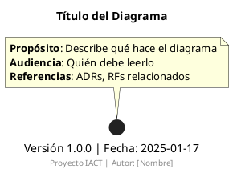

## 3. Diagrama de Despliegue (Deployment Diagram)

### 3.1 Propósito

Documenta la **arquitectura física** del sistema:
- Nodos de hardware/software
- Artefactos desplegados
- Conexiones de red
- Protocolos de comunicación

### 3.2 Cuándo Usar

- ✅ Diseño de infraestructura cloud/on-premise
- ✅ Documentación de topología de red
- ✅ Planificación de deployment
- ✅ Comunicación con DevOps/Infra
- ❌ NO para lógica de negocio (usar Secuencia/Actividad)
- ❌ NO para estructura de clases (usar Clases)

### 3.3 Elementos Principales

| Elemento | Notación PlantUML | Descripción |
|----------|-------------------|-------------|
| **Nodo** | `node "Nombre"` | Hardware o entorno de ejecución |
| **Artefacto** | `artifact "Nombre"` | Software deployable (.jar, .war, .exe) |
| **Componente** | `component "Nombre"` | Módulo de software |
| **Conexión** | `-->` | Comunicación entre nodos |
| **Protocolo** | `: HTTP/HTTPS` | Protocolo de comunicación |
| **Estereotipo** | `<<database>>` | Tipo especial de nodo |

### 3.4 Sintaxis PlantUML Completa

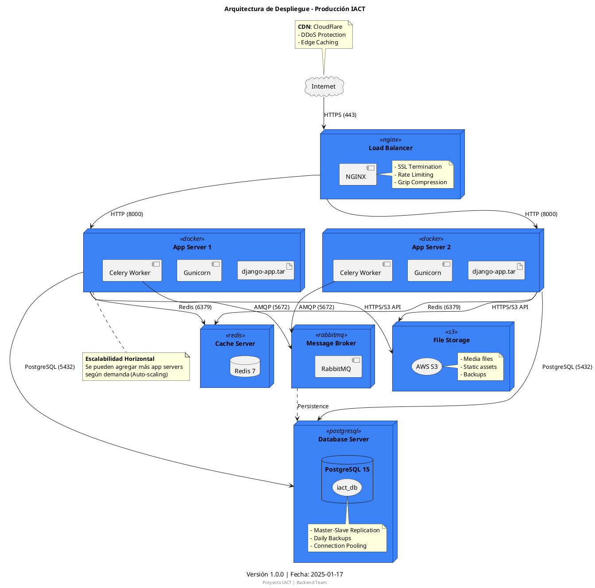

### 3.5 Patrones Comunes

#### Patrón 1: 3-Tier Architecture

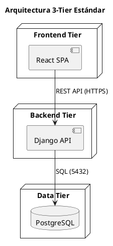

#### Patrón 2: Microservicios

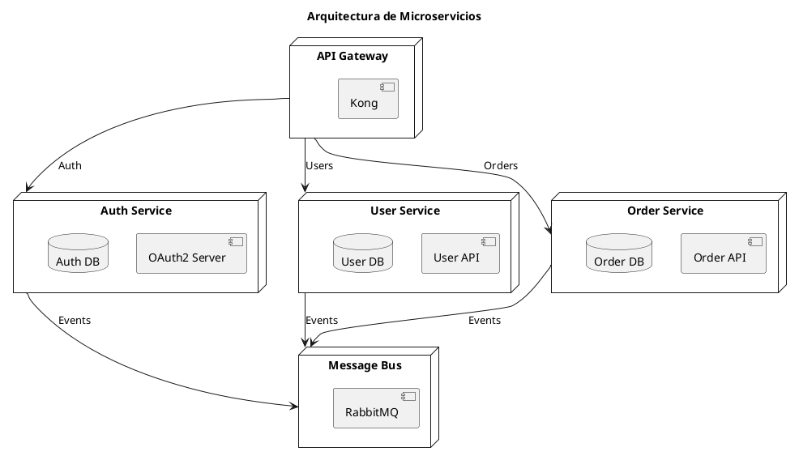

#### Patrón 3: Serverless

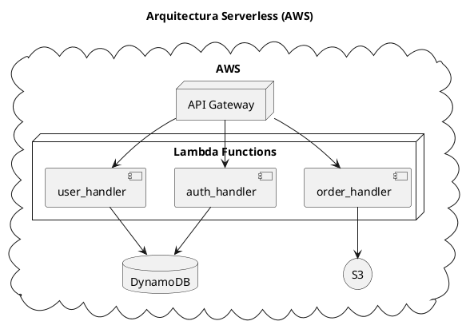

### 3.6 Estereotipos Útiles

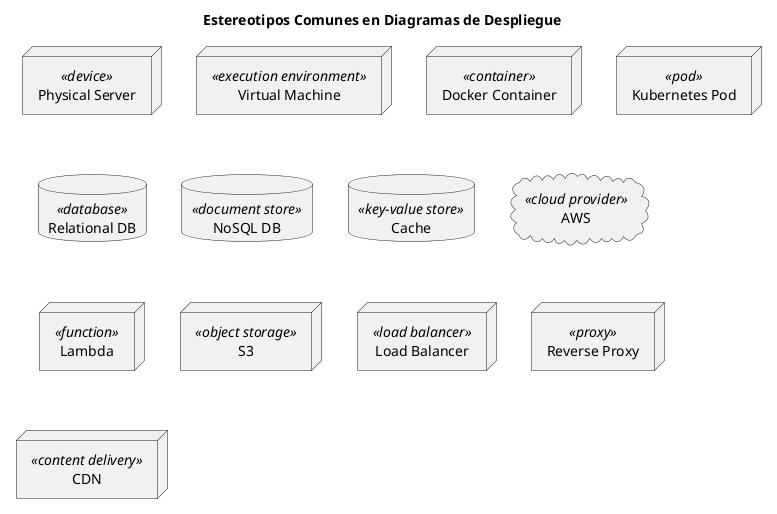

### 3.7 Ejemplo Completo: Sistema IACT

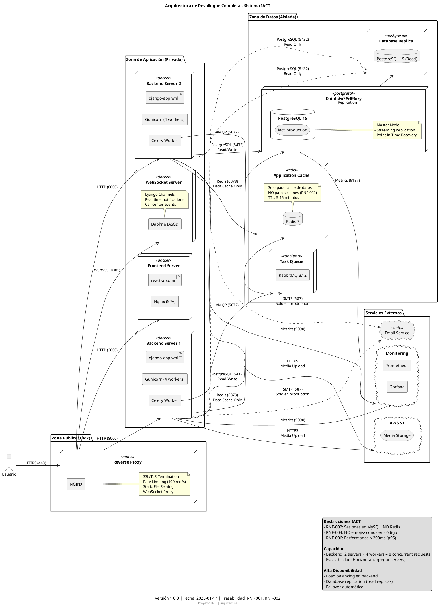

### 3.8 Anti-patrones

❌ **Anti-patrón 1: Demasiado detalle**

```plantuml
' MAL: Muestra cada archivo y proceso
node "Server" {
  artifact "app.py"
  artifact "models.py"
  artifact "views.py"
  artifact "urls.py"
  ' ... 50 archivos más ...
}
```

✅ **Mejor: Agrupa por componente lógico**

```plantuml
node "Server" {
  component "Django App" {
    artifact "app.whl"
  }
}
```

❌ **Anti-patrón 2: Mezclar niveles de abstracción**

```plantuml
' MAL: Mezcla infraestructura con lógica
node "Server" {
  component "User Service"  ' <- lógica
  artifact "docker-compose.yml"  ' <- infra
}
```

✅ **Mejor: Consistencia en el nivel**

```plantuml
node "App Server" <<docker>> {
  component "User Service"
  component "Order Service"
}
```

## 4. Diagrama de Componentes (Component Diagram)

### 4.1 Propósito

Documenta la **arquitectura lógica** del software:
- Componentes principales
- Interfaces expuestas
- Dependencias entre componentes
- Puertos y conectores

### 4.2 Cuándo Usar

- ✅ Arquitectura de módulos/librerías
- ✅ Diseño de APIs
- ✅ Documentación de dependencias
- ✅ Refactoring de monolito a microservicios

### 4.3 Sintaxis PlantUML

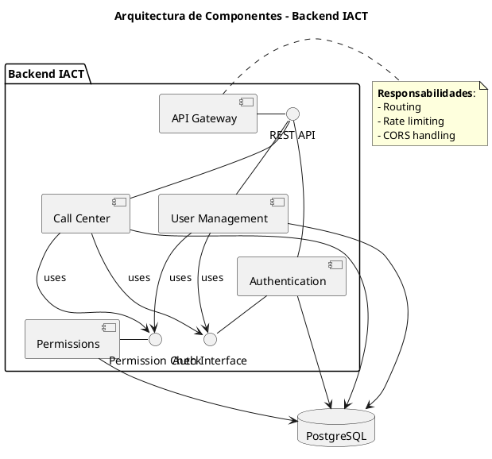

### 4.4 Ejemplo: Módulo de Permisos IACT

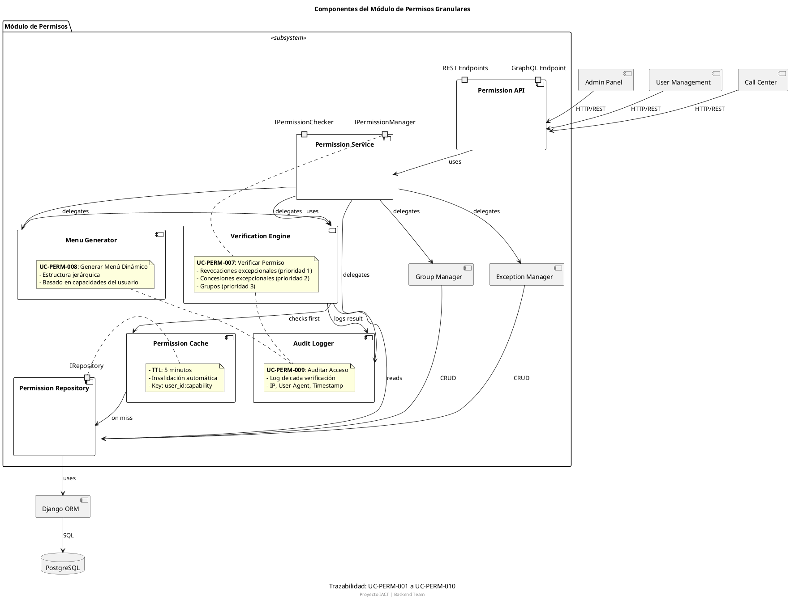

## 5. Diagrama de Secuencia (Sequence Diagram)

### 5.1 Propósito

Documenta **interacciones entre objetos a lo largo del tiempo**:
- Flujo de mensajes
- Orden temporal
- Loops y condicionales
- Asincronía

### 5.2 Sintaxis PlantUML

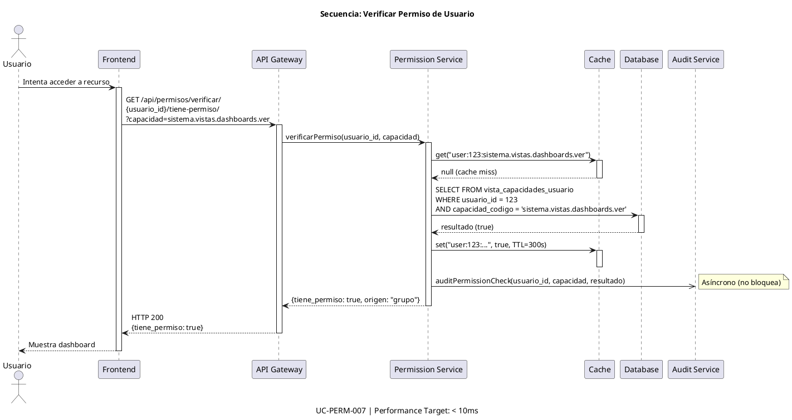

### 5.3 Elementos Avanzados

```plantuml
@startuml SEQ-EXAMPLE-elementos-avanzados
title Elementos Avanzados de Secuencia

actor Actor
participant "Sistema A" as A
participant "Sistema B" as B
database "Base de Datos" as DB

' Activación
Actor -> A : request()
activate A

' Condicional
alt successful case
  A -> B : call()
  B --> A : success
else failure
  A -> B : retry()
  B --> A : still failing
else fallback
  A -> A : useCachedData()
end

' Loop
loop every 5 seconds
  A -> B : healthCheck()
  B --> A : OK
end

' Opcional
opt if cache miss
  A -> DB : query()
  DB --> A : data
end

' Paralelo
par
  A -> B : async call 1
and
  A -> DB : async call 2
end

B --> A : response 1
DB --> A : response 2

' Referencia a otro diagrama
ref over A, B
  Ver SEQ-AUTH-001 para detalles de autenticación
end ref

deactivate A

@enduml
```

## 6. Diagrama de Actividad (Activity Diagram)

### 6.1 Propósito

Documenta **flujos de trabajo y procesos de negocio**:
- Decisiones (if/else)
- Paralelismo (fork/join)
- Loops
- Swimlanes (responsabilidades)

### 6.2 Sintaxis PlantUML

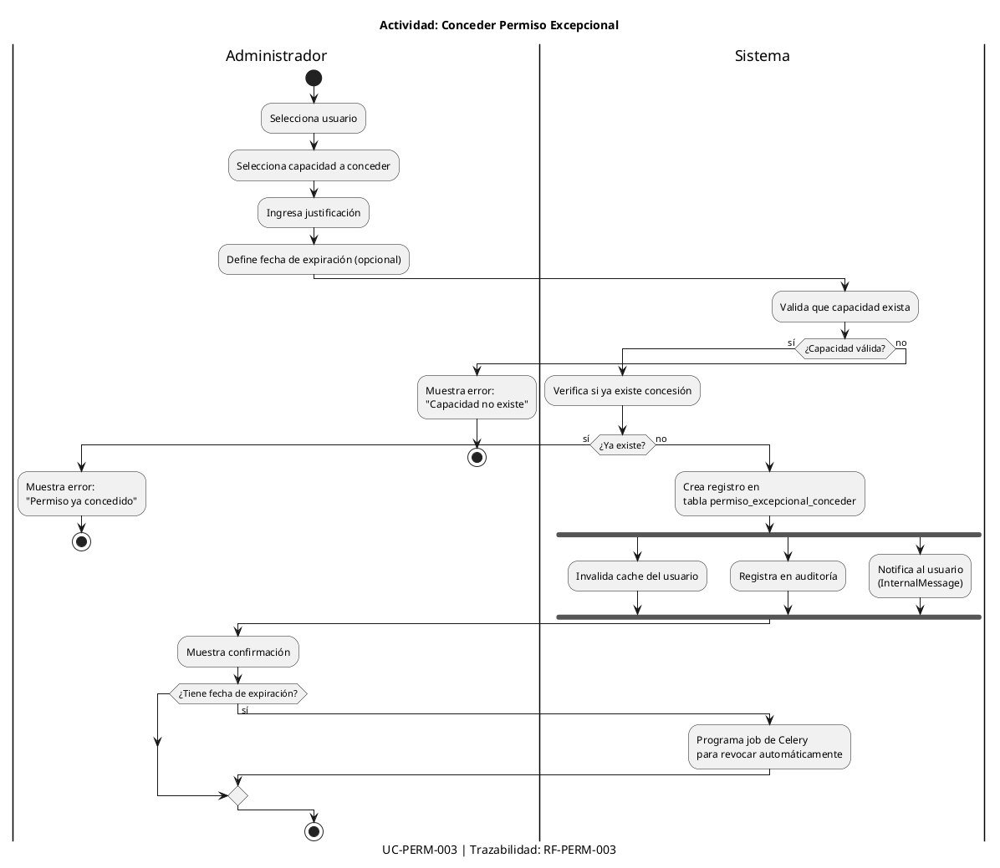

### 6.3 Swimlanes para Responsabilidades

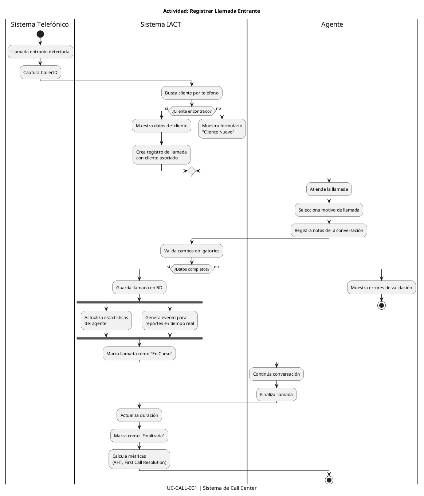

## 7. Diagrama de Estados (State Diagram)

### 7.1 Propósito

Documenta el **ciclo de vida de un objeto**:
- Estados posibles
- Transiciones entre estados
- Eventos que causan transiciones
- Acciones en entrada/salida

### 7.2 Sintaxis PlantUML

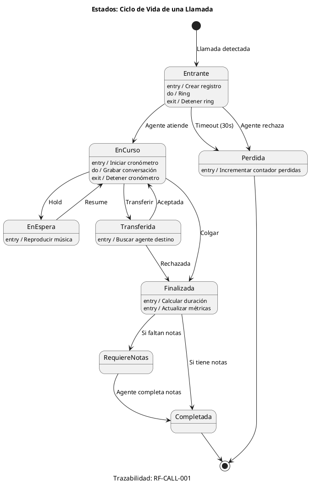

### 7.3 Estados Compuestos

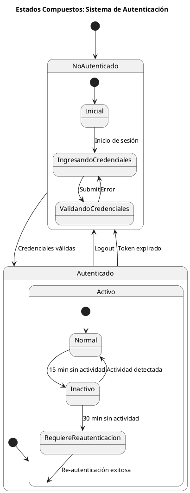

## 8. Diagrama de Paquetes (Package Diagram)

### 8.1 Propósito

Documenta la **organización de módulos/paquetes**:
- Estructura de directorios
- Dependencias entre paquetes
- Capas arquitectónicas
- Módulos públicos vs privados

### 8.2 Sintaxis PlantUML

```plantuml
@startuml PKG-BACK-001-estructura-backend
title Estructura de Paquetes - Backend IACT

package "apps" {
  package "authentication" {
    [models]
    [views]
    [serializers]
    [services]
  }

  package "users" {
    [models] as users_models
    [views] as users_views
    [serializers] as users_serializers
  }

  package "permissions" {
    [models] as perm_models
    [views] as perm_views
    [services] as perm_services
    [cache] as perm_cache
  }

  package "call_center" {
    [models] as call_models
    [views] as call_views
    [websockets] as call_ws
  }
}

package "core" {
  [settings]
  [urls]
  [middleware]
  [utils]
}

package "shared" {
  [exceptions]
  [validators]
  [decorators]
}

' Dependencias
users --> authentication : uses
call_center --> permissions : uses
call_center --> users : uses
permissions --> shared : uses

authentication ..> core : configured by

@enduml
```

## 9. Diagrama de Clases (Class Diagram)

### 9.1 Sintaxis PlantUML para Modelos Django

```plantuml
@startuml CLASS-BACK-010-modelo-permisos
title Modelo de Datos: Sistema de Permisos Granulares
caption Trazabilidad: RN-PERM-001 a RN-PERM-010

' === ENTIDADES PRINCIPALES ===

class Usuario {
  +id: Integer <<PK>>
  +username: String(150) <<unique>>
  +email: String(254) <<unique>>
  +first_name: String(150)
  +last_name: String(150)
  +is_active: Boolean
  +date_joined: DateTime
  --
  +get_capacidades(): List<String>
  +tiene_capacidad(codigo: String): Boolean
  +get_menu(): Dict
}

class Grupo {
  +id: Integer <<PK>>
  +nombre: String(100) <<unique>>
  +descripcion: Text
  +activo: Boolean
  +fecha_creacion: DateTime
  --
  +get_capacidades(): List<Capacidad>
  +agregar_capacidad(capacidad: Capacidad): void
  +remover_capacidad(capacidad: Capacidad): void
}

class Capacidad {
  +id: Integer <<PK>>
  +codigo: String(200) <<unique>>
  +nombre: String(200)
  +descripcion: Text
  +activo: Boolean
  +fecha_creacion: DateTime
  --
  <<constraint>> codigo formato "sistema.dominio.subdominio.funcion.accion"
  --
  +validar_formato(): Boolean
}

class UsuarioGrupo {
  +id: Integer <<PK>>
  +usuario: ForeignKey(Usuario)
  +grupo: ForeignKey(Grupo)
  +fecha_asignacion: DateTime
  +asignado_por: ForeignKey(Usuario)
  --
  <<unique_together>> (usuario, grupo)
}

class GrupoCapacidad {
  +id: Integer <<PK>>
  +grupo: ForeignKey(Grupo)
  +capacidad: ForeignKey(Capacidad)
  +fecha_asignacion: DateTime
  +asignado_por: ForeignKey(Usuario)
  --
  <<unique_together>> (grupo, capacidad)
}

class PermisoExcepcionalConceder {
  +id: Integer <<PK>>
  +usuario: ForeignKey(Usuario)
  +capacidad: ForeignKey(Capacidad)
  +justificacion: Text
  +fecha_concesion: DateTime
  +fecha_expiracion: DateTime <<nullable>>
  +concedido_por: ForeignKey(Usuario)
  +activo: Boolean
  --
  <<constraint>> fecha_expiracion > fecha_concesion
}

class PermisoExcepcionalRevocar {
  +id: Integer <<PK>>
  +usuario: ForeignKey(Usuario)
  +capacidad: ForeignKey(Capacidad)
  +justificacion: Text
  +fecha_revocacion: DateTime
  +fecha_expiracion: DateTime <<nullable>>
  +revocado_por: ForeignKey(Usuario)
  +activo: Boolean
}

class AuditoriaPermiso {
  +id: Integer <<PK>>
  +usuario: ForeignKey(Usuario)
  +capacidad_codigo: String(200)
  +resultado: Boolean
  +ip_address: String(45)
  +user_agent: Text
  +timestamp: DateTime
  +metadatos: JSONField
  --
  <<index>> (usuario, timestamp)
  <<index>> (capacidad_codigo, timestamp)
  <<index>> (resultado, timestamp)
}

' === RELACIONES ===

Usuario "1" -- "*" UsuarioGrupo : tiene >
Grupo "1" -- "*" UsuarioGrupo : contiene >
Grupo "1" -- "*" GrupoCapacidad : tiene >
Capacidad "1" -- "*" GrupoCapacidad : pertenece a >

Usuario "1" -- "*" PermisoExcepcionalConceder : recibe >
Capacidad "1" -- "*" PermisoExcepcionalConceder : otorga >

Usuario "1" -- "*" PermisoExcepcionalRevocar : pierde >
Capacidad "1" -- "*" PermisoExcepcionalRevocar : revoca >

Usuario "1" -- "*" AuditoriaPermiso : genera >

' === VISTA MATERIALIZADA ===

class VistaCapacidadesUsuario <<view>> {
  +usuario_id: Integer
  +capacidad_codigo: String(200)
  +origen: String(20)
  --
  <<materialized view>>
  <<refresh>> cada 5 minutos o por trigger
}

note right of VistaCapacidadesUsuario
  **Algoritmo de Verificación**:
  1. Revocaciones excepcionales activas → DENEGAR
  2. Concesiones excepcionales activas → CONCEDER
  3. Capacidad por grupos activos → CONCEDER
  4. Sino → DENEGAR
end note

Usuario "1" -- "*" VistaCapacidadesUsuario : tiene capacidades >

@enduml
```

## 10. Otros Diagramas UML

### 10.1 Diagrama de Objetos

```plantuml
@startuml OBJ-EXAMPLE-instancias
title Diagrama de Objetos: Ejemplo de Permisos

object "usuario:Usuario" as u1 {
  id = 123
  username = "carlos.ruiz"
  email = "carlos@iact.com"
}

object "grupo:Grupo" as g1 {
  id = 5
  nombre = "Agentes"
  activo = true
}

object "capacidad:Capacidad" as c1 {
  id = 42
  codigo = "sistema.vistas.dashboards.ver"
}

u1 -- g1 : miembro de
g1 -- c1 : tiene

@enduml
```

### 10.2 Diagrama de Tiempo (Timing)

```plantuml
@startuml TIMING-EXAMPLE-cache-invalidation
title Diagrama de Timing: Invalidación de Cache

robust "Cache Status" as cache
concise "Database" as db
concise "User Request" as req

@0
cache is Valid
db is Idle
req is Idle

@10
req is Request
: Usuario solicita permiso

@15
cache is Hit
: Cache HIT (válido)

@20
req is Response
: Respuesta rápida (< 5ms)

@100
db is Update
: Admin modifica grupos

@105
cache is Invalid
: Cache invalidado

@110
req is Request
: Nueva solicitud de usuario

@115
cache is Miss
: Cache MISS

@120
db is Query
: Consulta a base de datos

@150
cache is Valid
: Cache actualizado

@155
req is Response
: Respuesta (30ms)

@enduml
```

### 10.3 Diagrama de Comunicación

```plantuml
@startuml COMM-EXAMPLE-verificacion-permiso
title Diagrama de Comunicación: Verificar Permiso

object "frontend" as fe
object "api_gateway" as gw
object "permission_service" as ps
object "cache" as cache
object "database" as db

fe -> gw : 1: verificarPermiso(usuario, capacidad)
gw -> ps : 2: checkPermission(usuario, capacidad)
ps -> cache : 3: get(key)
cache --> ps : 4: null (miss)
ps -> db : 5: query(usuario, capacidad)
db --> ps : 6: resultado
ps -> cache : 7: set(key, resultado, TTL)
ps --> gw : 8: resultado
gw --> fe : 9: HTTP 200 {tiene_permiso: true}

@enduml
```

## 11. Mejores Prácticas

### 11.1 Nomenclatura de Archivos

```bash
# CORRECTO
TIPO-DOMINIO-###-descripcion.puml

Ejemplos:
- UC-BACK-001-login-usuario.puml
- SEQ-PERM-007-verificar-permiso.puml
- CLASS-BACK-010-modelo-permisos.puml
- DEPLOY-IACT-001-arquitectura-produccion.puml

# INCORRECTO
diagrama_de_clases.puml
sequence1.puml
deployment.puml
```

### 11.2 Metadata Obligatoria

Todos los diagramas deben incluir:

```plantuml
@startuml
title [Título Descriptivo]
caption Versión X.Y.Z | Fecha: YYYY-MM-DD | Trazabilidad: [IDs]
footer Proyecto IACT | [Equipo/Dominio]

' Contenido...

@enduml
```

### 11.3 Notas de Documentación

Usar notas para contexto:

```plantuml
@startuml
component "User Service" as users

note right of users
  **Responsabilidades**:
  - CRUD de usuarios
  - Validación de datos
  - Integración con LDAP

  **Performance**:
  - Target: < 100ms (p95)
  - Cache: 5 minutos

  **Trazabilidad**:
  - UC-USER-001 a UC-USER-010
end note

@enduml
```

### 11.4 Versionado

```bash
# Git workflow
git add docs/gobernanza/diseno/diagramas/DEPLOY-IACT-001-arquitectura.puml
git commit -m "docs(diseño): crear diagrama de despliegue v1.0.0"

# En el diagrama, actualizar metadata:
caption Versión 1.1.0 | Fecha: 2025-01-17 | Changelog: Agregado Redis
```

### 11.5 Generación de Imágenes

```bash
# Generar SVG (preferido, escalable)
plantuml -tsvg DEPLOY-IACT-001-arquitectura.puml

# Generar PNG (si se requiere)
plantuml -tpng -Sscale=2 DEPLOY-IACT-001-arquitectura.puml

# Batch: todos los .puml en directorio
plantuml -tsvg docs/gobernanza/diseno/diagramas/**/*.puml
```

## 12. Checklist de Calidad

Antes de hacer commit de un diagrama, verifica:

- [ ] **Nomenclatura correcta**: TIPO-DOMINIO-###-descripcion.puml
- [ ] **Metadata completa**: title, caption, footer
- [ ] **Trazabilidad**: Referencias a ADRs, UCs, RFs
- [ ] **Notas explicativas**: Contexto en notas cuando sea necesario
- [ ] **Convenciones PlantUML**: Sintaxis correcta, compila sin errores
- [ ] **Nivel de abstracción**: Consistente en todo el diagrama
- [ ] **Legibilidad**: No más de 20-30 elementos por diagrama
- [ ] **Dirección clara**: left to right o top to bottom según corresponda
- [ ] **Generación**: Imagen SVG generada y verificada
- [ ] **Commit**: Mensaje descriptivo siguiendo estándar

## 13. Herramientas

### 13.1 VSCode Extensions

```json
{
  "recommendations": [
    "jebbs.plantuml",
    "gruntfuggly.todo-tree"
  ]
}
```

### 13.2 Pre-commit Hook

```bash
#!/bin/bash
# .git/hooks/pre-commit

# Validar que todos los .puml compilen
for file in $(git diff --cached --name-only --diff-filter=ACM | grep '\.puml$'); do
  plantuml -checkonly "$file"
  if [ $? -ne 0 ]; then
    echo "Error: $file no compila"
    exit 1
  fi
done
```

## 14. Referencias

- [PlantUML Official Documentation](https://plantuml.com/)
- [UML 2.5 Specification](https://www.omg.org/spec/UML/2.5/)
- [C4 Model](https://c4model.com/) - Para diagramas de arquitectura
- [ADR-GOB-004: PlantUML para Diagramas](../adr/ADR-GOB-004-plantuml-para-diagramas.md)
- [ADR-GOB-008: Diagramas UML de Casos de Uso](../adr/ADR-GOB-008-diagramas-uml-casos-uso.md)
- [GUIA-GOB-008: Crear Diagramas PlantUML](GUIA-GOB-008-crear-diagramas-plantuml.md)

## Changelog

| Versión | Fecha | Autor | Cambios |
|---------|-------|-------|---------|
| 1.0.0 | 2025-01-17 | Sistema | Creación inicial con 10 tipos de diagramas UML |

---

**Nota**: Esta guía está en estado **borrador** y requiere ser completada con:

1. Más ejemplos del proyecto IACT para cada tipo de diagrama
2. Sección de troubleshooting común
3. Integración con CI/CD (validación automática)
4. Templates adicionales (profiles, skins personalizados)
5. Casos de estudio completos end-to-end

**Para continuar**: En otra sesión, expandir cada sección con ejemplos reales del código del proyecto IACT.
