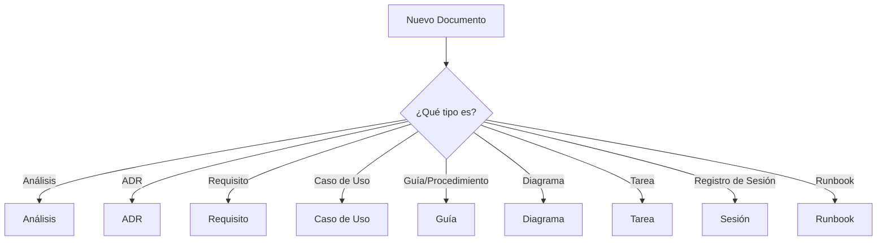
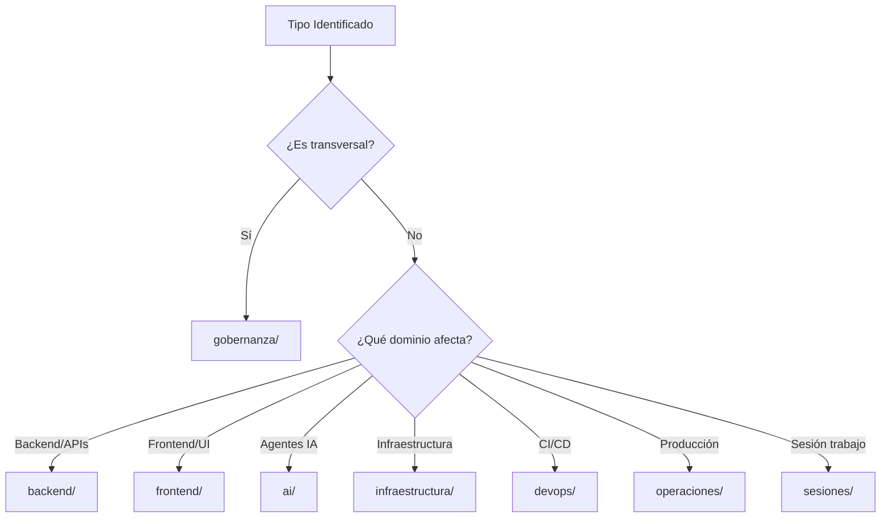

# Guía: Ubicación de Documentos por Dominio

## Propósito

Esta guía establece las reglas **obligatorias** para ubicar documentos en el directorio correcto según su dominio y tipo.

**REGLA FUNDAMENTAL:**
> **NUNCA** colocar documentos en `docs/` root. **SIEMPRE** ubicar en el dominio correspondiente.

---

## Estructura de Dominios

Según [ADR-020: Organización por Dominio](../adr/ADR-020-organizacion-documentacion-por-dominio.md), tenemos:

```
docs/
├── backend/           # Desarrollo backend (APIs, servicios, BD)
├── frontend/          # Desarrollo frontend (UI, UX)
├── ai/                # Agentes IA, ML, orquestación
├── infraestructura/   # Infraestructura, DevContainer, Vagrant
├── devops/            # CI/CD, deployment, automatización
├── operaciones/       # Producción, mantenimiento, DR
├── gobernanza/        # Procesos, ADRs, metodologías
├── sesiones/          # Registros de sesiones de trabajo
├── solicitudes/       # Solicitudes de cambio (SC-XXX)
├── dora/              # Métricas DORA
└── anexos/            # Material de referencia, ejemplos
```

---

## Matriz de Ubicación por Tipo de Documento

### 1. Análisis y Reportes

| Tipo de Análisis | Dominio | Ubicación Correcta | ❌ Incorrecto |
|------------------|---------|-------------------|--------------|
| Análisis de documentación | gobernanza | `gobernanza/analisis/` | ~~`docs/ANALISIS_*.md`~~ |
| Análisis de arquitectura backend | backend | `backend/analisis/` | ~~`docs/analisis_backend.md`~~ |
| Análisis de arquitectura frontend | frontend | `frontend/analisis/` | ~~`docs/analisis_frontend.md`~~ |
| Análisis de infraestructura | infraestructura | `infraestructura/analisis/` | ~~`docs/infra_analysis.md`~~ |
| Análisis de agentes IA | ai | `ai/analisis/` | ~~`docs/ai_analysis.md`~~ |
| Análisis de negocio general | gobernanza | `gobernanza/analisis_negocio/` | ~~`docs/business_analysis.md`~~ |
| Análisis de sesión específica | sesiones | `sesiones/YYYY-MM/` | ~~`docs/session_*.md`~~ |

**Ejemplo correcto:**
```bash
# ✅ Análisis de fallas en documentación
docs/gobernanza/analisis/analisis_fallas_docs_2025_11_16.md

# ✅ Análisis de arquitectura backend
docs/backend/analisis/analisis_arquitectura_modular.md

# ❌ INCORRECTO
docs/ANALISIS_FALLAS_DOCS_2025_11_16.md
```

---

### 2. ADRs (Architecture Decision Records)

| Tipo de ADR | Dominio | Ubicación | Ejemplo |
|-------------|---------|-----------|---------|
| ADR de backend | backend | `backend/adr/` | `ADR-004-centralized-log-storage.md` |
| ADR de frontend | frontend | `frontend/adr/` | `ADR-020-servicios-resilientes.md` |
| ADR de infraestructura | infraestructura | `infraestructura/adr/` | `ADR-001-vagrant-mod-wsgi.md` |
| ADR de AI/ML | ai | `ai/adr/` | `ADR-XXX-prompt-engineering.md` |
| ADR de gobernanza/proceso | gobernanza | `gobernanza/adr/` | `ADR-020-organizacion-por-dominio.md` |
| ADR transversal (afecta todos) | gobernanza | `gobernanza/adr/` | `ADR-021-convenciones-nomenclatura.md` |

**Regla:**
- ADRs específicos de dominio → `{dominio}/adr/`
- ADRs transversales/organizacionales → `gobernanza/adr/`

---

### 3. Requisitos

| Tipo de Requisito | Dominio | Ubicación | Ejemplo |
|-------------------|---------|-----------|---------|
| Requisitos funcionales backend | backend | `backend/requisitos/` | `RNF-001-api-rest-design.md` |
| Requisitos funcionales frontend | frontend | `frontend/requisitos/` | `RNF-XXX-responsive-design.md` |
| Requisitos no funcionales infraestructura | infraestructura | `infraestructura/requisitos/` | `RNF-002-alta-disponibilidad.md` |
| Requisitos de agentes IA | ai | `ai/requisitos/` | `RNF-XXX-agent-orchestration.md` |
| Stakeholders y atributos de calidad | {dominio} | `{dominio}/requisitos/` | Subdirectorios por tipo |

**Subdirectorios estándar:**
```
{dominio}/requisitos/
├── requerimientos_funcionales/
├── requerimientos_no_funcionales/
├── requerimientos_negocio/
├── stakeholders/
├── atributos_calidad/
└── restricciones_lineamientos/
```

---

### 4. Casos de Uso

| Tipo de Caso de Uso | Dominio | Ubicación | Ejemplo |
|---------------------|---------|-----------|---------|
| Casos de uso de APIs | backend | `backend/casos_de_uso/` | `UC-API-001-crear-recurso.md` |
| Casos de uso UI/UX | frontend | `frontend/casos_de_uso/` | `UC-UI-001-login-usuario.md` |
| Casos de uso de agentes | ai | `ai/casos_de_uso/` | `UC-AGENT-001-sdlc-pipeline.md` |
| Casos de uso de deployment | devops | `devops/casos_de_uso/` | `UC-DEPLOY-001-cd-pipeline.md` |
| Casos de uso transversales | gobernanza | `gobernanza/casos_de_uso/` | `UC-PERM-001-asignar-grupo.md` |

**Nota:** Los casos de uso en `gobernanza/casos_de_uso/` son transversales (permisos, auditoría) que aplican a múltiples dominios.

---

### 5. Guías y Procedimientos

| Tipo | Dominio | Ubicación | Ejemplo |
|------|---------|-----------|---------|
| Guía de desarrollo backend | backend | `backend/guias/` | `guia_api_rest.md` |
| Guía de desarrollo frontend | frontend | `frontend/guias/` | `guia_componentes_react.md` |
| Guía de agentes IA | ai | `ai/guias/` | `guia_crear_agente.md` |
| Guía de proceso/metodología | gobernanza | `gobernanza/guias/` | `GUIA_USO_AGENTE_NOMENCLATURA.md` |
| Procedimiento operativo | operaciones | `operaciones/runbooks/` | `procedimiento_rollback.md` |
| Procedimiento de gobernanza | gobernanza | `gobernanza/procesos/procedimientos/` | `procedimiento_renombrado_archivos.md` |

---

### 6. Testing y QA

| Tipo | Dominio | Ubicación | Ejemplo |
|------|---------|-----------|---------|
| Tests de backend | backend | `backend/qa/` | `guia_ejecutar_pytest.md` |
| Tests de frontend | frontend | `frontend/qa/` | `guia_ejecutar_jest_e2e.md` |
| Estrategia de testing | gobernanza | `gobernanza/qa/` | `estrategia_test_pyramid.md` |
| Registros de ejecución QA | sesiones | `sesiones/YYYY-MM/qa_registros/` | `2025_11_02_ejecucion_pytest.md` |

---

### 7. Arquitectura y Diseño

| Tipo | Dominio | Ubicación | Ejemplo |
|------|---------|-----------|---------|
| Arquitectura backend | backend | `backend/arquitectura/` | `arquitectura_modulos_completa.md` |
| Arquitectura frontend | frontend | `frontend/arquitectura/` | `arquitectura_microfrontends.md` |
| Arquitectura infraestructura | infraestructura | `infraestructura/arquitectura/` | `arquitectura_cpython_builder.md` |
| Arquitectura de agentes | ai | `ai/arquitectura/` | `arquitectura_orchestration.md` |
| Patrones de diseño | gobernanza | `gobernanza/arquitectura/patrones/` | `DESIGN_PATTERNS_GUIDE.md` |

---

### 8. Diagramas

| Tipo de Diagrama | Dominio | Ubicación | Ejemplo |
|------------------|---------|-----------|---------|
| Diagramas de backend | backend | `backend/diagramas/` | Subdirectorios por tipo |
| Diagramas de frontend | frontend | `frontend/diagramas/` | Subdirectorios por tipo |
| Diagramas de contexto general | anexos | `anexos/diagramas/contexto/` | `sistema_completo.puml` |

**Subdirectorios estándar:**
```
{dominio}/diagramas/
├── arquitectura/     # Diagramas de componentes, deployment
├── secuencia/        # Diagramas de secuencia
├── actividad/        # Diagramas de flujo/actividad
├── database/         # Diagramas ER
└── casos_de_uso/     # Diagramas de casos de uso
```

---

### 9. Tareas (TASK-XXX)

| Tipo de Tarea | Dominio | Ubicación | Ejemplo |
|---------------|---------|-----------|---------|
| Tarea de backend | backend | `backend/tareas/` | `TASK-010-logging-estructurado.md` |
| Tarea de frontend | frontend | `frontend/tareas/` | `TASK-XXX-implementar-feature.md` |
| Tarea de infraestructura | infraestructura | `infraestructura/tareas/` | `TASK-018-cassandra-cluster-setup.md` |
| Tarea de AI | ai | `ai/tareas/` | `TASK-XXX-mejorar-agente.md` |
| Tarea de operaciones | operaciones | `operaciones/maintenance/` | `TASK-008-cron-job-dora.md` |
| Tarea de DevOps | devops | `devops/tareas/` | `TASK-XXX-ci-pipeline.md` |
| Tarea de seguridad | gobernanza | `gobernanza/seguridad/` | `TASK-023-security-audit.md` |

---

### 10. Sesiones y Registros

| Tipo | Ubicación | Ejemplo |
|------|-----------|---------|
| Registro de sesión | `sesiones/YYYY-MM/` | `SESSION_PIPELINE_2025_11_13.md` |
| Registro QA de sesión | `sesiones/YYYY-MM/qa_registros/` | `2025_11_05_merge_ramas.md` |
| Catálogo de TODOs de sesión | `sesiones/YYYY-MM/` | `CATALOGO_TODOS_PENDIENTES.md` |

**❌ NUNCA:**
- ~~`gobernanza/qa/registros/`~~ → Duplica sesiones/
- ~~`ai/registros/`~~ → Duplica sesiones/

---

### 11. Runbooks Operativos

| Tipo | Ubicación Correcta | ❌ Incorrecto |
|------|-------------------|--------------|
| Runbook de deployment | `devops/runbooks/` | ~~`gobernanza/`~~ |
| Runbook de troubleshooting | `operaciones/troubleshooting/` | ~~`gobernanza/`~~ |
| Runbook de DR | `operaciones/disaster-recovery/` | ~~`gobernanza/`~~ |
| Runbook de mantenimiento | `operaciones/maintenance/` | ~~`gobernanza/`~~ |

**Ejemplo:**
```bash
# ✅ CORRECTO
devops/runbooks/claude_code.md
devops/runbooks/merge_y_limpieza_ramas.md
operaciones/troubleshooting/reprocesar_etl_fallido.md

# ❌ INCORRECTO (ubicaciones antiguas a eliminar)
gobernanza/claude_code.md
gobernanza/merge_y_limpieza_ramas.md
gobernanza/reprocesar_etl_fallido.md
```

---

### 12. Material de Referencia

| Tipo | Ubicación | Ejemplo |
|------|-----------|---------|
| Ejemplos de código | `anexos/ejemplos/` | `ejemplo_api_rest.md` |
| Referencias externas | `anexos/referencias/` | `links_utiles.md` |
| Glosario | `anexos/` | `glossary.md` |
| Material didáctico | `anexos/` | Material educativo |

---

## Archivos Permitidos en `docs/` Root

**SOLO 4 archivos:**

1. ✅ `README.md` - Índice principal del proyecto
2. ✅ `QUICKSTART.md` - Guía de inicio rápido
3. ✅ `AUDITORIA_NOMBRES_ARCHIVOS.md` - Auditoría histórica (temporal)
4. ✅ `ANALISIS_FALLAS_DOCS.md` - Análisis histórico (temporal)

**Cualquier otro archivo debe ir en su dominio.**

---

## Proceso de Decision: ¿Dónde Va Este Archivo?

### Paso 1: Identificar el Tipo de Documento



### Paso 2: Identificar el Dominio



### Paso 3: Construir la Ruta

```
{dominio}/{tipo}/{subtipo}/{nombre_archivo}.md
```

**Ejemplos:**

```bash
# Análisis de backend
backend/analisis/analisis_performance_apis.md

# ADR de infraestructura
infraestructura/adr/ADR-015-docker-compose-strategy.md

# Caso de uso de agente IA
ai/casos_de_uso/UC-AGENT-001-ejecutar-pipeline.md

# Guía de procedimiento de gobernanza
gobernanza/procesos/procedimientos/procedimiento_crear_adr.md

# Tarea de frontend
frontend/tareas/TASK-025-implementar-dark-mode.md

# Runbook de deployment
devops/runbooks/deploy_produccion.md

# Registro de sesión
sesiones/2025-11/session_refactor_docs.md
```

---

## Casos Especiales

### ¿Qué pasa si afecta múltiples dominios?

**Regla:** Si el documento es transversal (afecta a 3+ dominios), va en `gobernanza/`

**Ejemplos:**
- Permisos (afecta backend, frontend, AI) → `gobernanza/casos_de_uso/UC-PERM-*.md`
- Convenciones de nomenclatura (afecta todos) → `gobernanza/adr/ADR-021-*.md`
- Estrategia de QA (afecta todos) → `gobernanza/qa/`

### ¿Qué pasa si es específico de 2 dominios?

**Regla:** Va en el dominio **primario** (el que más le afecta)

**Ejemplo:**
- Integración backend-frontend → Si es API, va en `backend/`. Si es componente, va en `frontend/`
- Deployment de agente IA → Si es sobre el agente, va en `ai/`. Si es sobre el proceso de deploy, va en `devops/`

### ¿Qué pasa con documentos históricos/legacy?

**Regla:** Moverlos al dominio correcto, preservando historial con `git mv`

```bash
# ✅ CORRECTO - Preserva historial
git mv docs/ANALISIS_FALLAS_DOCS.md gobernanza/analisis/analisis_fallas_docs.md

# ❌ INCORRECTO - Pierde historial
mv docs/ANALISIS_FALLAS_DOCS.md gobernanza/analisis/
git add gobernanza/analisis/analisis_fallas_docs.md
```

---

## Validación Automática

### Verificar que un archivo está en el dominio correcto:

```bash
# Script de validación
python scripts/coding/ai/agents/documentation/validate_document_location.py \
  --file docs/backend/TASK-010.md
```

### Auditar todos los documentos:

```bash
# Ejecutar agente de validación
python scripts/coding/ai/agents/documentation/documentation_naming_agent.py \
  --audit-only
```

---

## Checklist al Crear Nuevo Documento

Antes de crear un documento, verificar:

- [ ] **Tipo identificado:** ¿Es análisis, ADR, requisito, caso de uso, guía, etc.?
- [ ] **Dominio identificado:** ¿Afecta backend, frontend, ai, infraestructura, etc.?
- [ ] **Ruta construida:** `{dominio}/{tipo}/{subtipo}/{archivo}.md`
- [ ] **Nomenclatura correcta:** Sigue [ADR-021](../adr/ADR-021-convenciones-nomenclatura-documentacion.md)
- [ ] **Frontmatter incluido:** Metadata YAML al inicio
- [ ] **H1 presente:** Título principal del documento
- [ ] **NO está en docs/ root:** A menos que sea README/QUICKSTART

---

## Ejemplos de Migraciones Correctas

### Ejemplo 1: Análisis de Documentación

```bash
# ❌ ANTES (Incorrecto)
docs/ANALISIS_FALLAS_DOCS_2025_11_16.md

# ✅ DESPUÉS (Correcto)
git mv docs/ANALISIS_FALLAS_DOCS_2025_11_16.md \
       docs/gobernanza/analisis/analisis_fallas_docs_2025_11_16.md
```

### Ejemplo 2: Runbook de Deployment

```bash
# ❌ ANTES (Incorrecto)
docs/gobernanza/claude_code.md
docs/gobernanza/merge_y_limpieza_ramas.md

# ✅ DESPUÉS (Correcto)
git mv docs/gobernanza/claude_code.md docs/devops/runbooks/claude_code.md
git mv docs/gobernanza/merge_y_limpieza_ramas.md docs/devops/runbooks/merge_y_limpieza_ramas.md
```

### Ejemplo 3: Registros de QA

```bash
# ❌ ANTES (Incorrecto - Duplicado)
docs/gobernanza/qa/registros/2025_11_05_merge_ramas.md
docs/ai/registros/2025_11_05_merge_ramas.md

# ✅ DESPUÉS (Correcto - Solo en sesiones)
git rm docs/gobernanza/qa/registros/2025_11_05_merge_ramas.md
git rm docs/ai/registros/2025_11_05_merge_ramas.md
# Mantener solo: docs/sesiones/2025-11/qa_registros/2025_11_05_merge_ramas.md
```

---

## Consecuencias de No Seguir Esta Guía

### ❌ Problemas que ocurren:

1. **Duplicación:** Mismo documento en múltiples ubicaciones
2. **Dificulta búsqueda:** No se sabe dónde buscar
3. **Rompe navegación:** Links rotos al reorganizar
4. **Confunde desarrolladores:** ¿Cuál es la fuente de verdad?
5. **Dificulta mantenimiento:** Actualizaciones inconsistentes

### ✅ Beneficios de seguir esta guía:

1. **Ubicación predecible:** Todos saben dónde buscar
2. **Navegación clara:** Estructura lógica y consistente
3. **Mantenibilidad:** Una sola ubicación por documento
4. **Escalabilidad:** Crece de forma organizada
5. **Colaboración:** Nuevos desarrolladores entienden rápido

---

## Referencias

- [ADR-020: Organización de Documentación por Dominio](../adr/ADR-020-organizacion-documentacion-por-dominio.md)
- [ADR-021: Convenciones de Nomenclatura de Documentación](../adr/ADR-021-convenciones-nomenclatura-documentacion.md)
- [Estructura de Directorios](../arquitectura/estructura_directorios.md)

---

## Mantenimiento de Esta Guía

**Owner:** Equipo de gobernanza
**Revisión:** Mensual
**Última actualización:** 2025-11-16

Si identificas un caso no cubierto en esta guía, crear un issue o proponer actualización mediante PR.

---

**Versión:** 1.0.0
**Estado:** ACTIVO - Cumplimiento obligatorio
